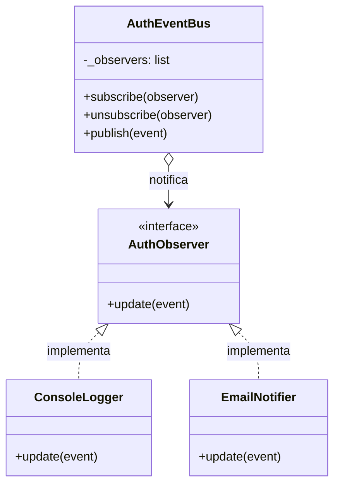
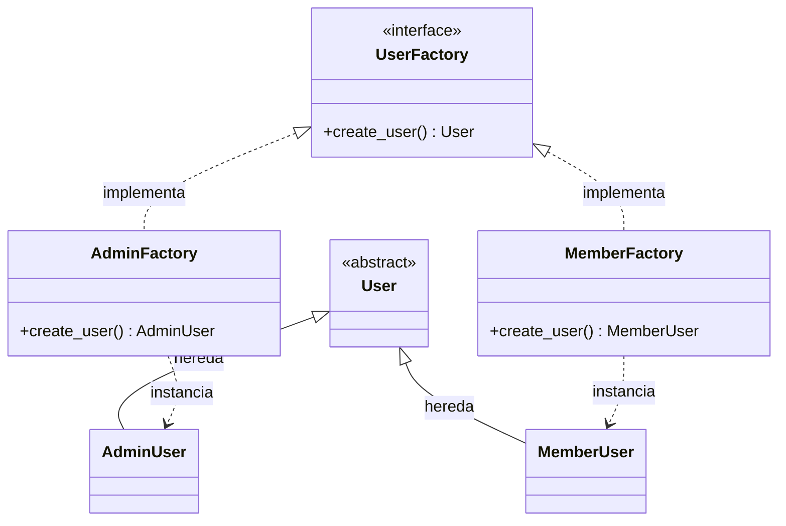

# Estructura del Proyecto

```
┣ coworking_auth.db
┣ design
┃ ┗ prototipo.md
┣ docs
┃ ┣ AI_LOG-SpicyTech.md
┃ ┣ ANALISIS_ESTANDARES_ISO.md
┃ ┣ Capturas version 1.0
┃ ┣ Contingency  plan.md
┃ ┣ Contrato-de-SpicyTech.md
┃ ┣ Diagrama de Casos de Uso.jpeg
┃ ┣ Diagrama de Clases.jpg
┃ ┣ FrontSpicyTechIniciarsesion_beta.png
┃ ┣ Matriz de Riesgos SpicyTech.xlsx.pdf
┃ ┣ patrones-tp1.md
┃ ┣ testing-strategy.md
┃ ┗ tp2-pruebas-unitarias.md
┣ dump.js
┣ package.json
┣ project_dump.md
┣ README.md
┣ src
┃ ┣ api.py
┃ ┣ app.js
┃ ┣ auth.py
┃ ┣ coworking_auth.db
┃ ┣ dashboard.html
┃ ┣ home.html
┃ ┣ iniciar.bat
┃ ┣ login.html
┃ ┣ mis-reservas.html
┃ ┣ spaces.html
┗ tests
  ┣ test.md
  ┗ unit
    ┣ tests.py
    ┗ test_reservas.py
```

# Contenido de Archivos

## C:\Users\rosan\projects\TP1_ingenieria_II\design\prototipo.md

```md

```

## C:\Users\rosan\projects\TP1_ingenieria_II\docs\AI_LOG-SpicyTech.md

```md
## Entrada 001 — Semana 1

**Fecha:** 19/03/2026
**Herramienta:** Gemini
**Responsable:** Scrum Master — Octavio García
**Eje temático:** Eje 1

**¿Para qué se usó?**
Definir la estructura inicial de gestión del proyecto (Sprint 0), incluyendo la configuración del tablero Kanban, la redacción del Contrato de Proyecto y la elaboración de la Matriz de Riesgos.

**¿Qué generó la IA?**
1. Una lista de 9 tarjetas para el backlog inicial con descripción y responsables.
2. Un borrador del Contrato de Proyecto con 4 secciones (Escenario, Metodología, Roles y Acuerdos).
3. Una tabla de Matriz de Riesgos con 6 ítems específicos para un sistema de coworking.

**¿Qué aceptamos tal cual?**
La justificación técnica de la metodología Scrum y la estructura de la Matriz de Riesgos (columnas de Impacto, Probabilidad y Mitigación).

**¿Qué modificamos y por qué?**
- **Nombre de la empresa:** Cambiamos el nombre sugerido por "SpicyTech" para alinearlo con la identidad definida por el grupo.
- **Roles y Acuerdos:** Completamos los nombres reales de los integrantes y definimos horarios de reunión específicos (Discord/WhatsApp) según la disponibilidad real del equipo.
- **Mitigación de riesgos:** Ajustamos el plan de mitigación del riesgo de "Concurrencia" para enfocarnos específicamente en bloqueos de base de datos, que es el enfoque técnico que discutió el equipo.

**¿Qué descartamos y por qué?**
Decidimos enfocarnos solo en el núcleo de reservas para no exceder el alcance del cuatrimestre y asegurar la calidad de las funcionalidades básicas.

## Entrada 002 — Semana 3

**Fecha:** 02/04/2026
**Herramienta:** Claude
**Responsable:** Dev Lead — Matías Polcowñuk
**Eje temático:** Eje 1

**¿Para qué se usó?**
Para crear el Back End del sistema en general.

**¿Qué generó la IA?**
1. La carpeta api.py, para combinar back end con front end.
2. La carpeta auth.py para autentificar al usuario en el login.
3. La carpeta tests.py pruebas del código.

**¿Qué aceptamos tal cual?**
El código base del Back End.
**¿Qué modificamos y por qué?**
- **Front End:** Vamos a agregarlo para su correcto funcionamiento.
- **Base de Datos:** Fusionarlo con el código.

**¿Qué descartamos y por qué?**
Por el momento el código funciona correctamente, así que no es necesario el descarte de nada.

## Entrada 003 — Semana 3

**Fecha:** 03/04/2026
**Herramienta:** Gemini
**Responsable:** QA Lead — Jesus Emanuel De Olivera
**Eje temático:** Eje 2 / Integración y Pruebas

**¿Para qué se usó?**
Integrar el Front y Back, aplicar seguridad (Bcrypt/JWT) y asegurar que las pruebas (`tests.py`) pasen sin errores.

**¿Qué generó la IA?**
Un backend seguro (`auth.py`, `api.py`), el JS necesario para consumir la API y un entorno 100% compatible con nuestros tests.

**¿Qué aceptamos tal cual?**
La lógica de encriptación (Bcrypt), el manejo de sesiones (JWT) y el formato de respuesta JSON.

**¿Qué modificamos y por qué?**
Bloqueamos los cambios de diseño. Forzamos a la IA a mantener nuestro código HTML/CSS original, inyectando únicamente el JS necesario para conectar ambas partes y no perder nuestro trabajo.

**¿Qué descartamos y por qué?**
Descartamos la interfaz visual que propuso la IA y su idea de validar contraseñas solo en el backend (decidimos mantener nuestra validación visual en tiempo real en el frontend para mejorar la UX).

## Entrada 004 — Semana 3

**Fecha:** 05/04/2026
**Herramienta:** Claude
**Responsable:** Dev Lead — Matías Polcowñuk
**Eje temático:** Eje 1

**¿Para qué se usó?**
Para agregar una base de datos al proyecto.

**¿Qué generó la IA?**
Una base de datos en SQlite que puede usarse desde manera remota al iniciarse.

**¿Qué aceptamos tal cual?**
El cambio en el modulo de BD.

**¿Qué modificamos y por qué?**
Anteriormente era todo local y no se guardaban los nuevos usuarios, si se quiere completar el caso de uso de Login es un paso necesario. Además de agregar el iniciador de la BD.

**¿Qué descartamos y por qué?**
Descartamos "InMemoryUserRepository", porque no funcionaba de manera correcta.

## Entrada 005 — Semana 3

**Fecha:** 06/04/2026
**Herramienta:** Gemini
**Responsable:** UX Dev — Santiago Manrique
**Eje temático:** Eje 1 / Desarrollo Front End

**¿Para qué se usó?**

Maquetar la interfaz principal y armar el index.html pasándole todo el contexto del proyecto a la IA para que no tire fruta.

**¿Qué generó la IA?**

## Entrada 006 — Semana 4

**Fecha:** 18/04/2026

**Herramienta:** Gemini/ISO - International Organization for Standardization

**Responsable:** QA Lead — Santino Calamari

**Eje temático:** Eje 2 / Diseño Orientado a Objetos
**¿Para qué se usó?**

Analizamos nuestro sistema en base a los estándares históricos centrados en la interacción persona‑ordenador(ISO 9241‑11 e ISO 13407) y los tres estándares actuales para sistemas críticos (ISO/IEC 27001, ISA/IEC 62443, ISO 9001)

**¿Qué generó la IA?**

Luego de investigar personalmente usamos la ia para que analice nuestro sistema en conjunto con el fin de obtener una conclusión acerca de que normas se ven reflejadas en nuestro sistema y cuales pulir más.

## Entrada 007 — Semana 4

**Fecha:** 18/04/2026
**Herramienta:** Gemini
**Responsable:** QA Lead — Jesus Emanuel De Olivera
**Eje temático:** Eje 1

**¿Para qué se usó?**
Estructurar el entregable `ANALISIS_ESTANDARES.md` requerido por la cátedra, integrando el análisis propio del equipo sobre normas ISO y completando los requisitos faltantes de la consigna.

**¿Qué generó la IA?**
1. Una tabla comparativa en formato Markdown.
2. La redacción técnica y justificación de dos estándares adicionales (ISO/IEC 25010 de Calidad e ISO/IEC/IEEE 29119 de Testing) para cumplir con el mínimo de 5 normas exigidas por el profesor.
3. Un párrafo de conclusión técnica que vincula el cumplimiento de la norma de seguridad (ISO 27001) con los patrones de diseño implementados en el TP1 (Observer y Factory Method).

**¿Qué aceptamos tal cual?**
El formato de la tabla, la justificación de las dos normas agregadas (25010 y 29119) y la conclusión que enlaza los patrones de diseño con la arquitectura segura, ya que aporta mucho valor técnico para el coloquio.

**¿Qué modificamos y por qué?**
Restringimos la autonomía de la IA proporcionándole un archivo PDF con nuestro propio análisis previo de 3 normas (ISO 9241-11, ISO 13407, ISO 27001). Forzamos a la IA a usar nuestras justificaciones y no inventar contenido nuevo para esos puntos, manteniendo la autoría intelectual del equipo.

**¿Qué descartamos y por qué?**
No fue necesario descartar nada, ya que la salida se configuró para cumplir estrictamente con los puntos solicitados en la rúbrica de la entrega.

## Entrada 008 — Semana 5 

**Fecha:** 25/04/2026  
**Herramienta:** Gemini  
**Responsable:** QA Lead — Jesus Emanuel De Olivera  
**Eje temático:** Gestión de Proyecto / Calidad y Testing  

**¿Para qué se usó?** Definir la estrategia integral de pruebas del sistema Nexo Coworking y redactar el contrato formal de desarrollo para el equipo SpicyTech, asegurando que todos los requisitos técnicos y administrativos de la cátedra se cumplan bajo estándares profesionales.

**¿Qué generó la IA?** 
1. **Estrategia de Testing:** Una planificación completa dividida en niveles (Unitarias, Integración, E2E y Estrés). Se definieron casos de prueba específicos para el motor de reservas, clases de equivalencia para horarios laborales (08:00 a 20:00) y el plan de mocks para aislar la base de datos.  
2. **Stack de Automatización:** Selección justificada de herramientas gratuitas: **pytest** (unitarias), **Cypress** (E2E) y **Locust** (estrés), alineadas con el stack tecnológico del proyecto (Python/Flask/Vanilla JS).  
3. **Contrato de Software:** Un documento formal en Markdown que consolida los roles del equipo (Scrum Master, Dev Leaders, QA, UX), los acuerdos de trabajo (SLA), las reglas de negocio críticas y los admins predefinidos.  

**¿Qué aceptamos tal cual?** El stack tecnológico de pruebas y la justificación técnica de las herramientas, ya que se adaptan perfectamente a nuestra arquitectura actual. También se aceptó la estructura del contrato y la redacción de las cláusulas de seguridad y cumplimiento de estándares ISO.

**¿Qué modificamos y por qué?** Se ajustaron manualmente los parámetros de los casos de prueba unitaria para que reflejen exactamente las reglas de negocio de nuestro coworking (como el margen de error en horarios y la imposibilidad de auto-confirmación de reservas). Se verificó que las contraseñas de los administradores en el contrato coincidieran con los requerimientos de complejidad definidos previamente.

**¿Qué descartamos y por qué?** Se descartaron sugerencias iniciales de usar herramientas de testing pagas o de alta complejidad (como Selenium o JMeter) en favor de opciones más ágiles y modernas como Cypress y Locust, priorizando la facilidad de mantenimiento y la curva de aprendizaje del equipo.

```

## C:\Users\rosan\projects\TP1_ingenieria_II\docs\ANALISIS_ESTANDARES_ISO.md

```md
# Análisis de Estándares ISO - SpicyTech 

Este documento analiza los estándares de ingeniería de software y su aplicabilidad al sistema de gestión de reservas del proyecto Spicy Coworking, evaluando su impacto en la arquitectura y el diseño.

## 1. Tabla Comparativa de Estándares

| Estándar | Año (aprox) | Enfoque principal | ¿Aplica a mi proyecto? | Justificación |
| :--- | :--- | :--- | :---: | :--- |
| **ISO 9241-11** | 1998 (2018) | Usabilidad (Eficacia, eficiencia y satisfacción)  | **Sí** | Es innegociable; si el cliente tiene que hacer muchos clics o lidiar con un calendario confuso, abandonará la plataforma. La usabilidad actúa como capa de seguridad, priorizando que el usuario logre el objetivo con precisión absoluta antes que la estética. |
| **ISO 13407** | 1999 (2010) | Proceso de diseño centrado en el humano  | **Sí** | El software se construye desde el usuario hacia abajo, resolviendo los problemas reales de cada perfil (administrador en PC, cliente en celular). Diseñar pensando en el entorno de uso evita saturar a un operador bajo estrés y previene errores. |
| **ISO/IEC 27001** | 2005 (2022) | Seguridad de la información  | **Sí** | Garantiza la confidencialidad, integridad y disponibilidad. Es vital porque el sistema maneja datos sensibles de clientes y pagos; una inyección SQL o caída del servicio implicaría demandas legales y pérdida de confianza. Exige arquitecturas de alta disponibilidad (99.99% uptime). |
| **ISO/IEC 25010** | 2011 (2023) | Calidad del Producto de Software | **Sí** | Evalúa características técnicas como la mantenibilidad, portabilidad y el rendimiento. Aplica directamente a nuestra necesidad de tener una API REST (Flask) que responda rápido a las reservas concurrentes y un código fácil de mantener para futuros Sprints. |
| **ISO/IEC/IEEE 29119** | 2013 | Pruebas de Software (Testing) | **Sí** | Estandariza los procesos de validación y verificación. Para asegurar la calidad (QA), aplicar esta norma nos obliga a mantener y ejecutar pruebas automatizadas rigurosas antes de desplegar código, previniendo regresiones en la lógica de turnos. |

## 2. Conclusión y Relación con la Arquitectura (TP1)

Si tuviéramos que certificar nuestro sistema hoy, elegiríamos **ISO/IEC 27001 (Seguridad de la Información)** por el nivel crítico de los datos personales y bancarios que gestionamos. Cumplir con esto nos obligaría a robustecer nuestra arquitectura actual añadiendo capas de encriptación en reposo y rotación automatizada de tokens JWT. Afortunadamente, nuestras decisiones de diseño del TP1 facilitan este camino: 

## 3. Estándares relevantes para SpicyTech: 

ISO 9241-11: Usabilidad
Para nuestro proyecto resulta muy relevante ya que para un sistema de coworking, nuestro producto compite directamente por la comodidad, si un cliente entra a nuestro sistema y tiene que hacer 10 clics para reservar una sala, lidiar con un calendario confuso (cosa que refleja una baja eficiencia) o el sistema le reserva un horario equivocado por un diseño poco intuitivo (otra vez baja eficacia), el usuario simplemente dejará ir nuestra propuesta, la usabilidad acá define el éxito comercial del sistema.

ISO 13407: Proceso de diseño centrado en el humano

Esta norma dicta que el software no debe construirse sólo desde la base de datos o el código hacia arriba, por ende es muy importante para la etapa en la que estamos ya que nuestro sistema tiene distintos actores: el administrador del lugar, el recepcionista y el cliente final, no podemos diseñar la misma interfaz ni los mismos flujos de datos para el administrador (que necesita ver reportes y facturación en la PC) que para el cliente (que necesita reservar rápido desde su celular mientras va en el colectivo). Aplicar este concepto asegura que el sistema resuelva los problemas reales de cada perfil.

 ISO/IEC 27001: Seguridad de la información
Es una norma de seguridad de la información. Especifica los requisitos para establecer, implementar, mantener y mejorar continuamente un sistema de gestión de la seguridad de la información (SGSI).
Esta norma establece que para proteger los datos se tiene que cumplir con: 
Confidencialidad: Que solo acceda quien debe acceder.
Integridad: Que los datos no se modifiquen de forma no autorizada.
Disponibilidad: Que el sistema esté arriba cuando se lo necesite.
Nuestro sistema va a manejar información muy sensible como son los datos personales de los clientes, contraseñas, correos, y fundamentalmente, datos de pagos, facturación o tarjetas de crédito para cobrar las horas del coworking, si tenemos una vulnerabilidad en nuestra arquitectura (ej. una inyección SQL o una API mal protegida) y se filtran esos datos, nuestro servicio se enfrenta a demandas legales gravísimas y la pérdida total de confianza de parte del cliente.

## 4.¿Qué estándares debería cumplir obligatoriamente y por qué?
Si nuestro sistema se declara crítico este debe cumplir si o si con estos estándares:

ISO/IEC 27001 (Seguridad de la Información): En sistemas críticos, un fallo de seguridad no solo genera pérdidas económicas, sino catástrofe en:
La Integridad: En la gestión de fondos bancarios o historiales clínicos, alterar un número por error tiene consecuencias devastadoras, los datos deben ser inmutables y estar cifrados.
La Disponibilidad: Si nuestro sistema el cual consiste en turnos y transito de clientes no puede "caerse por mantenimiento" ni sufrir ataques de denegación de servicio, requiere arquitecturas redundantes con una Alta Disponibilidad que garantice un uptime del 99.99%.
 ISO 9241-11 y ISO 13407 (Usabilidad y Diseño Centrado en el Humano) - 
Obligatorio como capa de seguridad,aunque parezca que es  "solo diseño visual", en sistemas críticos la usabilidad salva sistemas.
Si el sistema tiene una alta carga cognitiva (es confuso, los botones críticos están escondidos, las alertas visuales no son claras), se produce el error humano. Un diseño centrado en el usuario aquí no busca vender más, sino evitar que el operador presione el botón equivocado en el peor momento posible.
Para nuestro sistema coworking aunque estas normas ya sean algo viejas para sistemas de última generación, estos dos pilares son innegociables:
Contexto de Uso (ISO 13407): Diseñar pensando en el entorno del usuario, un operador bajo estrés necesita interfaces que no lo saturen para evitar errores fatales.
Eficacia antes que Estética (ISO 9241-11): En sistemas críticos, la prioridad no es que sea "lindo", sino que el usuario logre el objetivo con precisión absoluta, con esto la usabilidad es, en realidad, una capa más de seguridad.


## 5. Conclusión y Relación con la Arquitectura

El patrón **Observer** implementado en la autenticación nos permite agregar un `DatabaseObserver` para registrar logs de auditoría inmutables (vitales para la ISO 27001) cada vez que alguien inicia sesión, sin acoplar ni alterar el flujo principal de seguridad; mientras que el patrón **Factory Method** centraliza y blinda la creación de roles, mitigando riesgos de escalamiento de privilegios de manera estandarizada.


 

```

## C:\Users\rosan\projects\TP1_ingenieria_II\docs\Contingency  plan.md

```md
# Plan de Gestión de Riesgos del Proyecto

Este documento detalla la Matriz de Riesgos identificada para el desarrollo del proyecto, alineada con los hallazgos visuales. Incluye las estrategias de mitigación (preventivas) y los planes de contingencia (reactivos).

## Resumen de Clasificación

Para la evaluación y visualización de los riesgos, se utiliza la siguiente escala de severidad, tal como se muestra en la matriz gráfica del proyecto:

* **Bajo (Verde):** Puntuaciones 1-3.
* **Medio (Amarillo/Naranja claro):** Puntuaciones 4-6.
* **Alto (Naranja oscuro):** Puntuaciones 8-12.
* **Extremo (Rojo):** Puntuaciones 15-25.

---

## 1. Matriz de Riesgos y Mitigación

Esta matriz identifica los eventos potenciales y establece acciones preventivas para reducir su probabilidad o impacto *antes* de que ocurran.

| # | Nombre del Riesgo | Categoría | Probabilidad | Impacto (Severidad Visual) | Plan de Mitigación (Preventivo) |
| :-: | :--- | :---: | :---: | :---: | :--- |
| **1** | **Falta de experiencia en React de Dev Leaders**: Retraso en calendario de reservas dinámico. | Técnicos | **Alta** | **Medio** (4-6) | Realizar una semana de investigación y prototipado rápido (PoC) enfocado en gestión de estados de React. |
| **2** | **Indisponibilidad por exámenes parciales**: Coincidencia de fechas de exámenes, reduciendo capacidad en Sprint 1. | Equipo | **Alta** | **Alto** (8-10) | Actualizar el tablero Kanban semanalmente y adelantar entregas críticas antes de las semanas de exámenes. |
| **3** | **Ambigüedad en reglas de negocio**: Retrabajo en backend por definición difusa de cancelaciones y reembolsos. | Requisitos | Media | **Alto** (12) | Mantener reuniones constantes con el docente para validar que las reglas de negocio sean claras y precisas. |
| **4** | **Dependencia de hosting gratuito**: Suspensión por inactividad (Render/Railway), dificultando pruebas y demo. | Externo | Media | **Medio** (12) | Configurar un sistema de logs de errores y realizar backups periódicos para asegurar disponibilidad. |
| **5** | **Conflictos de Concurrencia (Doble Reserva)**: Falta de conocimiento técnico para implementar bloqueos (locks) de BD. | Técnicos | Baja | **Alto/Extremo** (10-25) | Implementar validaciones estrictas en el backend antes de confirmar una reserva y capacitar al equipo en locks de BD. |

---

## 2. Plan de Contingencia

Este plan define las acciones inmediatas a tomar *una vez que el riesgo ha ocurrido* para minimizar los daños y recuperar el control del proyecto.

### 🚨 R1. Falta de experiencia en React
* **Disparador:** Tareas de gestión de estado bloqueadas o retrasos críticos detectados tras la primera semana de PoC.
* **Acción Inmediata:**
    1.  **Simplificar MVP:** Reúnase con stakeholders/docente para acordar una reducción drástica del alcance técnico de la gestión de estados. Sustituir lógicas complejas por soluciones simples o "hardcodeadas".
    2.  **Asignar Dueños:** Dividir el desarrollo por módulos y nombrar al miembro con más conocimiento como "dueño" técnico para centralizar y resolver bloqueos de React del equipo.
    3.  **Adaptar Código Verificado:** Priorizar el uso de repositorios de ejemplo o *boilerplates* verificados para React en lugar de programar arquitecturas base desde cero.

### 🚨 R2. Indisponibilidad por exámenes parciales
* **Disparador:** Miembros clave del equipo reportan incapacidad total de trabajo o baja drástica de productividad durante la semana crítica de entrega.
* **Acción Inmediata:**
    1.  **Congelar No Críticos:** Detener inmediatamente el pulido visual y las *features* secundarias. Cero recursos dedicados a ellas.
    2.  **Foco en *Happy Path*:** Redistribuir el esfuerzo limitado *exclusivamente* en asegurar que los flujos principales de usuario funcionen para la entrega (MVP).
    3.  **Consumir Reserva:** Utilizar la reserva de tiempo final (buffer) planificada para pruebas como tiempo de desarrollo ahora.
    4.  **Notificar:** Avisar preventivamente al docente sobre la entrega parcial debido a la baja disponibilidad del equipo.

### 🚨 R3. Ambigüedad en reglas de negocio
* **Disparador:** Identificación de retrabajo significativo en el backend o lógica de negocio que no cumple con las expectativas a mitad del desarrollo.
* **Acción Inmediata:**
    1.  **Detener Desarrollo:** Parar inmediatamente el desarrollo en la lógica afectada hasta tener claridad. Mover tareas a una lista de "Por Validar".
    2.  **Validación con Docente:** Programar una reunión de emergencia con el docente para re-definir y aclarar las reglas de negocio ambiguas. Obtener aprobación por escrito si es posible.
    3.  **Actualizar Documentación:** Reflejar inmediatamente los cambios en la documentación de requisitos y comunicarlos a todo el equipo para evitar futuros retrabajos.

### 🚨 R4. Dependencia de hosting gratuito
* **Disparador:** Detección de tiempos de inactividad o fallos en las pruebas integrales y demo debido a suspensión del hosting Render/Railway.
* **Acción Inmediata:**
    1.  **Diagnosticar:** Analizar logs de errores y alertas para hallar la causa raíz de la inactividad.
    2.  **Ejecutar Plan de Backups:** Iniciar inmediatamente el proceso de restore de la base de datos y/o archivos de aplicación desde el backup periódico más reciente.
    3.  **Prevenir Daño Circular:** Asegurar que el código de la aplicación o configuración no causará un nuevo fallo antes de reactivar el servicio. Si es necesario, configurar alertas adicionales.

### 🚨 R5. Conflictos de Concurrencia (Doble Reserva)
* **Disparador:** Reportes de usuarios de reservas duplicadas o detección visual de la severidad del riesgo alcanzando el nivel Alto/Extremo.
* **Acción Inmediata:**
    1.  **Congelar Confirmaciones:** Bloquear temporalmente nuevas confirmaciones en el backend (mantener el sistema en modo solo lectura).
    2.  **Identificar y Mediar:** Consultar la base de datos para hallar duplicados. Aplicar regla "primero en llegar": mantener la primera reserva, cancelar la segunda.
    3.  **Notificar y Compensar:** Informar inmediatamente a ambos usuarios. Ofrecer disculpas y una alternativa inmediata (otra fecha/recurso) al usuario cancelado.
    4.  **Parche Técnico:** Implementar un *fix* de emergencia (e.g., cola de mensajes, caché distribuida) o acelerar la capacitación y aplicación de locks de BD antes de reabrir el sistema.

```

## C:\Users\rosan\projects\TP1_ingenieria_II\docs\Contrato-de-SpicyTech.md

```md
# Contrato de Desarrollo de Software: Proyecto SpicyTech Coworking

**Entre:** La Cátedra de Ingeniería de Software II (UCP)  
**Y:** El Equipo de Desarrollo "SpicyTech"  
**Fecha de vigencia:** Ciclo Lectivo 2026

---

## 1. Declaración del Proyecto y Objetivos
El presente contrato rige el desarrollo del sistema **SpicyTech Coworking**, una solución integral para la gestión de reservas de espacios físicos. El objetivo primordial es resolver la problemática actual de conflictos de disponibilidad y falta de visibilidad en tiempo real mediante una plataforma centralizada que gestione escritorios, salas de reuniones y oficinas de manera automatizada.

## 2. Marco Metodológico (Scrum)
El equipo se compromete a la implementación rigurosa del marco de trabajo **Scrum** bajo un enfoque iterativo e incremental:
* **Ciclos de trabajo:** El sistema se dividirá en Sprints para asegurar la validación temprana de funcionalidades críticas.
* **Trazabilidad:** Se mantendrá un tablero Kanban actualizado y control de versiones mediante un repositorio en GitHub.
* **Inspección y Adaptación:** Se realizarán ceremonias para ajustar el alcance del Producto Mínimo Viable (MVP) según el progreso del equipo.

## 3. Estructura Organizacional y Roles
Se establecen las siguientes responsabilidades de liderazgo dentro del equipo **SpicyTech**:

* **Scrum Master:** Octavio García. Responsable de eliminar impedimentos y asegurar el cumplimiento de la metodología.
* **Dev Leaders:** Matias Polcowñuk y Santino Calamari. Responsables de la arquitectura técnica y la integridad del código fuente.
* **QA Leads:** Jesus Emanuel De Olivera y Santino Calamari. Responsables de asegurar la calidad del producto y la ejecución de planes de prueba.
* **UX Lead:** Santiago Manrique. Responsable del diseño centrado en el usuario y la usabilidad de la interfaz.

## 4. Acuerdos de Trabajo (Service Level Agreements)
Para garantizar la excelencia operativa, el equipo suscribe los siguientes acuerdos:
* **Sincronización:** Reuniones presenciales o virtuales todos los días hábiles a las 09:00 hs vía Discord.
* **Integración Continua:** Frecuencia mínima de tres (3) aportes de código (commits) por semana.
* **Definición de Terminado (DoD):** Ninguna tarea se considerará finalizada hasta que el código haya sido testeado y revisado por un miembro del equipo de QA.
* **Comunicación Oficial:** Canal exclusivo vía WhatsApp con un tiempo de respuesta esperado inferior a dos (2) horas durante el horario laboral.

## 5. Especificaciones Técnicas y Reglas de Negocio
El sistema deberá cumplir estrictamente con las siguientes lógicas operativas definidas:
* **Seguridad de Acceso:** La autenticación se basará en estándares industriales (JWT y Bcrypt). Se eliminan los roles de "Invitado", permitiendo únicamente perfiles de "Miembro" y "Administrador".
* **Administración Predefinida:** El sistema contará con cinco (5) cuentas de administrador de origen, asignadas a los creadores del proyecto: 
    1. **JesusDO** 
    2. **MatiasP** 
    3. **SantinoC** 
    4. **OctavioG** 
    5. **SantiagoM** 
* **Modelo de Reserva:** El catálogo de espacios será de acceso público (sin login previo). Sin embargo, el inicio de la reserva requerirá autenticación obligatoria.
* **Flujo de Confirmación:** Toda reserva solicitada por un miembro nacerá en estado "Pendiente" y requerirá la validación explícita de un Administrador para ser confirmada. El usuario podrá visualizar sus reservas y el administrador dispondrá de un panel para gestionarlas.
* **Integración de Datos:** No se permitirá el uso de datos sintéticos o falsos; la disponibilidad se calculará en base a la concurrencia real y el horario laboral establecido (08:00 a 20:00 hs).

## 6. Estándares de Calidad y Cumplimiento
El diseño del software se alineará con los siguientes estándares internacionales:
* **ISO/IEC 27001:** Para la protección de datos personales y la integridad de la información financiera.
* **ISO 9241-11 / ISO 13407:** Para garantizar la eficiencia y eficacia del sistema desde una perspectiva centrada en el usuario humano.

## 7. Conformidad
Al aceptar los términos de este contrato, los integrantes de **SpicyTech** asumen la responsabilidad compartida sobre la calidad, el diseño y la ética en el uso de herramientas de inteligencia artificial documentadas en el `AI_LOG` oficial del proyecto.

---

**Firmas:**

| Integrante | Rol |
| :--- | :--- |
| **Octavio García** | Scrum Master |
| **Matias Polcowñuk** | Dev Leader |
| **Jesus E. De Olivera** | QA Lead |
| **Santino Calamari** | Dev Leader / QA |
| **Santiago Manrique** | UX Lead |

```

## C:\Users\rosan\projects\TP1_ingenieria_II\docs\patrones-tp1.md

```md
# Documentación de Patrones de Diseño - TP1 (Nexo Coworking)

Este documento detalla los patrones de diseño aplicados en el módulo de autenticación (`src/auth.py`) del sistema de reservas Nexo Coworking, justificando su uso para resolver problemas específicos de arquitectura, detallando las clases involucradas y sus consecuencias.

---

## 1. Patrón: Observer (Comportamiento)

**Intención:** Definir una dependencia de uno a muchos entre objetos, de manera que cuando un objeto cambie de estado, todos sus dependientes sean notificados y se actualicen automáticamente.

**Problema que resuelve en el sistema:**
Durante el proceso de autenticación (como registrar un usuario, fallar un inicio de sesión o bloquear una cuenta), el sistema necesita ejecutar múltiples acciones secundarias (ej: registrar un log en la consola, enviar un correo de bienvenida, o guardar un registro en la base de datos de auditoría). Si el servicio de autenticación (`AuthService`) llamara directamente a estas funciones, terminaría fuertemente acoplado a servicios externos, violando el Principio de Responsabilidad Única (SRP).

**Justificación de la elección:**
Se eligió el patrón Observer mediante la implementación de un `AuthEventBus`. Esto permite que el `AuthService` simplemente "publique" un evento (ej. `LOGIN_SUCCESS`) sin importarle quién lo está escuchando. Esto cumple con el Principio Abierto/Cerrado (OCP), ya que el día de mañana podemos agregar un nuevo observador (como un `DatabaseObserver`) sin tener que modificar ni una sola línea de código del `AuthService`.

**Clases involucradas y funcionamiento:**
* **`AuthService` (Cliente/Publicador):** Ejecuta la lógica central y contiene al `AuthEventBus`.
* **`AuthEventBus` (Sujeto):** Mantiene la lista de suscriptores y ejecuta `publish()`.
* **`AuthObserver` (Interfaz):** Define el contrato con el método `update()`.
* **`ConsoleLogger`, `EmailNotifier` (Observadores Concretos):** Implementan el "qué hacer" al recibir el evento.

**Diagrama de Clases (UML):**


**Consecuencias en la Arquitectura (Pros y Contras):**
* **✔️ Ventajas:** Bajo acoplamiento. Se pueden añadir nuevas reacciones al login sin tocar el código del core de seguridad.
* **❌ Desventajas:** El orden en que los observadores reciben la notificación es impredecible. Si un observador falla silenciosamente, puede ser difícil de depurar.

**Ejemplo en el código (`src/auth.py`):**
```python
self._event_bus.publish(AuthEvent(
    AuthEvent.USER_REGISTERED,
    {"user_id": user.user_id, "username": username, "email": email, "role": role},
))
```

---

## 2. Patrón: Factory Method (Creacional)

**Intención:**
Define una interfaz para crear un objeto, pero deja que las subclases decidan qué clase instanciar. 

**Problema que resuelve en el sistema:**
En Nexo Coworking existen diferentes perfiles: **Miembro**, **Administrador** e **Invitado**. A futuro, cada uno manejará permisos distintos. Si el `AuthService` tuviera un bloque `if/else` gigante para decidir qué clase de usuario crear al momento del registro, el código sería rígido y difícil de mantener.

**Justificación de la elección:**
Se implementó un `UserFactoryRegistry` y fábricas concretas (`MemberFactory`, `AdminFactory`). El proceso de registro (`sign_up`) es totalmente agnóstico al tipo de usuario. Si se requiere un nuevo rol "Empresa", solo se añade una nueva fábrica al registro sin modificar la lógica del servicio.

**Clases involucradas y funcionamiento:**
* **`UserFactory` (Creador Abstracto):** Interfaz que define `create_user()`.
* **`MemberFactory`, `AdminFactory` (Creadores Concretos):** Instancian perfiles específicos.
* **`User`, `AdminUser`, `MemberUser` (Productos):** Modelos de datos del dominio.
* **`UserFactoryRegistry` (Gestor):** Mapea el string del rol (ej. "admin") con la fábrica correspondiente.

**Diagrama de Clases (UML):**


**Consecuencias en la Arquitectura (Pros y Contras):**
* **✔️ Ventajas:** Cumple el principio SRP (Responsabilidad Única) moviendo la lógica de creación a clases dedicadas. Facilita la escalabilidad.
* **❌ Desventajas:** Puede producir una "explosión de clases", ya que requiere crear una nueva clase Factory por cada nueva clase de Usuario que se agregue al sistema.

**Ejemplo en el código (`src/auth.py`):**
```python
factory = UserFactoryRegistry.get(role) 
user = factory.build(username, email, password_hash)
```

---

## 3. Sinergia de Patrones en el MVP
Ambos patrones trabajan en conjunto para lograr un flujo de registro limpio: 
1. El `AuthService` recibe los datos y le pide al **Factory Method** que construya el usuario correcto según su rol. 
2. Una vez guardado en memoria, el `AuthService` utiliza el **Observer** para emitir el evento `USER_REGISTERED`, disparando las acciones secundarias (como logs y emails) sin interrumpir el flujo principal de respuesta hacia el Frontend.


```

## C:\Users\rosan\projects\TP1_ingenieria_II\docs\testing-strategy.md

```md
# Estrategia de Testing y Calidad

**Proyecto:** SpicyTech Coworking 


---

## 1. Tipos de pruebas seleccionadas
| Tipo de prueba | ¿Aplica en este proyecto? | Justificación |
| :--- | :---: | :--- |
| Unitarias | ✅ | Verificar lógica de validación de contraseñas, cálculo de rangos horarios permitidos (08:00 a 20:00) y que la hora de fin sea mayor a la de inicio. |
| Integración | ✅ | Comprobar que el `AuthService` guarda correctamente el usuario en la base de datos (SQLite) y dispara los eventos (`AuthEventBus`) sin enviar correos reales. |
| Componentes | ✅ (futuro) | Probar el Dashboard del Administrador de forma aislada para asegurar que solo lista reservas en estado `PENDIENTE`. |
| Sistema (E2E) | ✅ | Validar el flujo completo: el usuario inicia sesión, solicita una sala, y luego el Administrador entra y se la confirma. |
| Regresión | ✅ | Se automatizará con GitHub Actions (CI/CD) para evitar que un código nuevo rompa el sistema de login o las validaciones de turnos. |
| Estrés | 🔜 Planificado | Se simulará concurrencia extrema (condición de carrera) cuando tengamos el motor de reservas completo para probar los bloqueos de base de datos. |

---

## 2. Herramientas gratuitas elegidas (stack de automatización)

| Nivel de prueba | Herramienta | ¿Qué automatiza en este proyecto? | Justificación |
| :--- | :--- | :--- | :--- |
| Unitarias | **pytest** | Validaciones de negocio (`PasswordPolicy`, `InputValidator`, control de horarios). | Sintaxis limpia, uso de fixtures muy potentes y compatibilidad 100% nativa con nuestro backend en Python/Flask. |
| Integración | **unittest.mock + SQLite (en memoria)** | Simulación de la base de datos y aislamiento del `AuthEventBus` (notificaciones). | Viene incluida en la librería estándar de Python. Aisla el código a la perfección sin instalar dependencias extra. |
| Sistema / E2E | **Cypress** | Flujo de login, navegación del catálogo público y uso del Dashboard Admin. | Excelente interfaz visual "Time Travel" ideal para debuggear nuestro frontend en Vanilla JS y verificar el almacenamiento del JWT en LocalStorage. |
| Estrés | **Locust** | Pruebas de carga sobre el endpoint de reservas simulando colisiones de turnos. | Se escribe en Python (curva de aprendizaje nula para el equipo), tiene interfaz web amigable y bajo consumo de CPU. |

---

## 3. Ejemplos de casos de prueba unitaria (clases de equivalencia y valores límite)

> **Funcionalidad elegida:** Motor de Reservas (Validación de disponibilidad horaria).
> *Regla de negocio:* El coworking opera de 08:00 a 20:00 hs. Las reservas deben hacerse dentro de este rango y la hora de fin debe ser estrictamente posterior a la de inicio.

### Clases de equivalencia identificadas
- **Válidas:** Horarios entre las 08:00 y las 20:00, donde Inicio < Fin.
- **Inválidas (por debajo/fuera de rango):** Horarios antes de las 08:00 (ej. madrugada).
- **Inválidas (por encima/fuera de rango):** Horarios después de las 20:00 (ej. noche) o donde Inicio >= Fin.

### Tres casos de prueba representativos
1. **Caso 1 (válido - dentro del rango):** Entrada = `Inicio: 10:00, Fin: 12:00`, Resultado esperado = `True` (Reserva permitida).
2. **Caso 2 (inválido – límite inferior):** Entrada = `Inicio: 07:59, Fin: 09:00`, Resultado esperado = `False` (Excepción: "Horario fuera del rango operativo").
3. **Caso 3 (inválido – lógica temporal):** Entrada = `Inicio: 15:00, Fin: 15:00`, Resultado esperado = `False` (Excepción: "La hora de fin debe ser posterior a la hora de inicio").

*Nota: estos casos están implementados (o se implementarán) en `src/tests.py`*

---

## 4. Plan de mocks / stubs para pruebas de integración

- **Dependencias externas a simular:**
  1. Base de datos real de producción (usaremos un Stub en memoria).
  2. Módulo de Notificaciones / `AuthEventBus` (usaremos un Mock para no mandar correos reales).
- **Estrategia de dobles:**
  - Usaremos `unittest.mock` (Mock) para el bus de eventos y `sqlite:///:memory:` (Stub) para la persistencia efímera.
  - Ejemplo de prueba de integración (Flujo de reserva):
    - *Flujo:* Usuario solicita reserva → se guarda en DB en memoria → se intercepta el evento de notificación → el sistema retorna estado "PENDIENTE".
    - *Pseudocódigo:* `db_stub = crear_bd_en_memoria()`. `mock_event_bus.subscribe()`. Al llamar a `reservar_espacio()`, verificamos que la BD temporal tiene 1 reserva nueva y llamamos a `mock_event_bus.assert_called_once()` para confirmar que se intentó avisar al administrador, aislando la prueba del servidor de correos.
- **Ubicación en el repo:** `src/tests.py` (Sección: Pruebas de Integración).

---

## 5. Pruebas de sistema (E2E) – flujo básico actual

**Flujo: “Login exitoso y visualización de contraseña”**
1. Abrir la URL de la aplicación (`index.html`).
2. Localizar el campo de usuario e ingresar `JesusDO` (Cuenta predefinida Admin).
3. Localizar el campo de contraseña e ingresar la clave correspondiente.
4. Hacer clic en el ícono "Ojo" (👁️) y **Validar** que la contraseña se vuelve visible (type="text").
5. Hacer clic en “Iniciar sesión”.
6. **Validar** que el sistema muestra la pantalla de éxito, se guarda el JWT en el LocalStorage y se reconoce el rol "admin".

*Script E2E implementado en: `tests/e2e/login.spec.js` (con Cypress)*

**Futuros flujos** (a medida que avance el desarrollo):
- **Visualización pública:** Un visitante sin sesión puede ver el catálogo de espacios (GET público).
- **Solicitud de turno:** Un miembro intenta reservar → su solicitud queda `PENDIENTE`.
- **Aprobación Admin:** El Administrador ingresa al Dashboard → confirma la reserva → las reservas superpuestas de otros usuarios pasan a `RECHAZADA`.

---

## 6. Estrategia de regresión automatizada (CI/CD)

- **Herramienta de CI/CD:** GitHub Actions (gratuito en repositorios públicos).
- **Workflow:** `.github/workflows/test.yml`
- **Activación:** Se ejecuta en cada `push` y `pull request` hacia la rama `main`.
- **Qué pruebas ejecuta actualmente:**
  - Pruebas unitarias de Python (`pytest src/tests.py`).
  - Linter básico para revisar sintaxis y calidad de código.
- **Reporting:** Los resultados se muestran en la pestaña Actions de GitHub. Bloquea el merge si alguna prueba falla (ej. si alguien rompe la validación JWT accidentalmente).

A medida que el proyecto crezca, se irán agregando las pruebas de integración con la base de datos SQL y las pruebas E2E con Cypress al pipeline.

---

## 7. Pruebas de estrés – planificación futura

- **Herramienta elegida:** **Locust**.
- **Escenario de carga extrema propuesto (Condición de Carrera):** Simularemos 100 usuarios (hilos) enviando una solicitud HTTP POST exactamente en el mismo milisegundo para reservar la "Sala de Reuniones A" el día "15/05/2026 a las 10:00 hs". Validaremos que el sistema maneje el cuello de botella guardando las solicitudes como `PENDIENTE` sin corromper la base de datos.
- **Estado actual:** Definido a nivel arquitectónico; a la espera de la construcción del endpoint de reservas (`/api/reservas`).
- **Hito de implementación:** Fase 2 (mes 6), cuando el backend y el Dashboard de Administrador estén conectados a la base de datos real.

---

```

## C:\Users\rosan\projects\TP1_ingenieria_II\docs\tp2-pruebas-unitarias.md

```md
# Pruebas de Software - SpicyTech Coworking 

## B0. Investigación Previa y Técnicas de Diseño de Pruebas

### 1. Clases de Equivalencia
**¿Qué es y cómo se aplica?**
La partición en clases de equivalencia es una técnica de testing de caja negra que consiste en dividir el dominio de los datos de entrada en diferentes grupos (clases). La premisa es que si un valor de una clase funciona correctamente (o falla), todos los demás valores de esa misma clase se comportarán exactamente igual. Esto permite reducir drásticamente la cantidad de casos de prueba necesarios, eligiendo solo un valor representativo por cada clase válida o inválida.

### 2. Valores Límite
**¿Qué es y cómo se aplica?**
El análisis de valores límite es una técnica complementaria a las clases de equivalencia. Se basa en la observación de que la mayoría de los defectos de software ocurren en los "bordes" de las clases de equivalencia, más que en el centro. Consiste en diseñar casos de prueba que evalúen los extremos exactos (límites permitidos) y los valores inmediatamente fuera de esos límites (justo por encima o justo por debajo).

### 3. Ejemplo Concreto Aplicado a SpicyTech Coworking
**Función bajo prueba:** Validación del rango horario para reservar un espacio.
**Regla de negocio:** El coworking opera estrictamente de 08:00 a 20:00 hs.

*   **Clases de Equivalencia:**
    *   *Clase Válida:* Cualquier hora entre las 08:00 y las 20:00 (ej. valor representativo: 14:00).
    *   *Clase Inválida 1 (Inferior):* Cualquier hora antes de las 08:00 (ej. 03:00).
    *   *Clase Inválida 2 (Superior):* Cualquier hora después de las 20:00 (ej. 22:00).
*   **Valores Límite:**
    *   *Límite Inferior Válido:* 08:00.
    *   *Límite Inferior Inválido:* 07:59.
    *   *Límite Superior Válido:* 20:00.
    *   *Límite Superior Inválido:* 20:01.

## B1. Diseño de Casos de Prueba Unitaria (TDD)

A continuación se detallan los 6 casos de prueba diseñados utilizando partición de equivalencia y análisis de valores límite. Estos casos aseguran la integridad de las reglas de negocio fundamentales de **SpicyTech Coworking** y serán automatizados mediante código por el equipo de desarrollo.

### Función 1: `validar_horario_operativo(hora_solicitada)`
*Regla de negocio:* El coworking solo permite reservas dentro de la franja horaria de 08:00 a 20:00 hs.

*   **Caso de Prueba 1 (CP01)**
    *   **Técnica:** Partición de Equivalencia (Clase Válida).
    *   **Datos de entrada:** `hora_solicitada = "14:00"`
    *   **Resultado esperado:** `True` (El sistema permite continuar con la reserva).

*   **Caso de Prueba 2 (CP02)**
    *   **Técnica:** Valores Límite (Frontera Inferior Inválida).
    *   **Datos de entrada:** `hora_solicitada = "07:59"`
    *   **Resultado esperado:** `False` / Excepción: "Horario fuera del rango operativo".

*   **Caso de Prueba 3 (CP03)**
    *   **Técnica:** Valores Límite (Frontera Superior Válida).
    *   **Datos de entrada:** `hora_solicitada = "20:00"`
    *   **Resultado esperado:** `True` (Es el último minuto válido para estar en el espacio).

---

### Función 2: `validar_logica_tiempo(hora_inicio, hora_fin)`
*Regla de negocio:* Para que un bloque de reserva sea válido, la hora de finalización debe ser estrictamente posterior a la hora de inicio.

*   **Caso de Prueba 4 (CP04)**
    *   **Técnica:** Partición de Equivalencia (Clase Válida).
    *   **Datos de entrada:** `hora_inicio = "10:00"`, `hora_fin = "13:00"`
    *   **Resultado esperado:** `True` (El bloque es lógico y válido).

*   **Caso de Prueba 5 (CP05)**
    *   **Técnica:** Valores Límite (Límite exacto de colisión).
    *   **Datos de entrada:** `hora_inicio = "15:00"`, `hora_fin = "15:00"`
    *   **Resultado esperado:** `False` / Excepción: "La hora de fin no puede ser igual a la hora de inicio".

*   **Caso de Prueba 6 (CP06)**
    *   **Técnica:** Partición de Equivalencia (Clase Inválida - Lógica inversa).
    *   **Datos de entrada:** `hora_inicio = "18:00"`, `hora_fin = "16:00"`
    *   **Resultado esperado:** `False` / Excepción: "La hora de fin debe ser posterior a la hora de inicio".
---

## B3. Diseño Conceptual de Pruebas de Integración

### 1. Dependencias Externas Identificadas
Para el módulo de reservas y autenticación de nuestro backend (Flask), hemos identificado las siguientes dependencias externas críticas:
1.  **Base de Datos Relacional (SQLite/SQLAlchemy):** Encargada de persistir el estado de los usuarios y las reservas.
2.  **Servicio de Notificaciones (AuthEventBus):** El bus de eventos que enviaría correos electrónicos o alertas al Administrador cuando un miembro solicita una reserva y esta queda en estado "PENDIENTE".

### 2. Estrategia de Mocks y Stubs
Para realizar pruebas de integración rápidas, predecibles y que no afecten los datos de producción, aislaremos estas dependencias:
*   **Stub para la Base de Datos:** En lugar de conectarnos a la base de datos real, configuraremos SQLAlchemy para que utilice una base de datos en memoria (`sqlite:///:memory:`). Este Stub nace vacío al inicio de la prueba y se destruye al finalizar, garantizando un entorno limpio.
*   **Mock para Notificaciones:** Reemplazaremos el objeto real del notificador por un objeto *Mock* simulado. Esto evitará que se envíen correos reales durante las pruebas automatizadas, pero nos permitirá "espiar" si el sistema intentó enviar el mensaje correctamente.

# Pruebas de Software - SpicyTech Coworking

---

## Stack tecnológico del proyecto

| Capa | Tecnología |
|------|------------|
| Backend | Python + Flask |
| Frontend | Vanilla JS |
| Base de datos | SQLite |

---

## Justificación de frameworks

### Backend → pytest

Elegimos **pytest** para testear el backend porque todo el proyecto está en Python y pytest es la herramienta más natural para ese ecosistema. Comparado con `unittest` (que también es Python nativo), pytest tiene una sintaxis mucho más limpia: los tests son funciones simples, no clases obligatorias, y los fixtures permiten reutilizar la configuración de objetos como `AuthService` o `InMemoryUserRepository` sin repetir código en cada `setUp()`.

Otra ventaja concreta: cuando un assert falla, pytest muestra exactamente qué valor se esperaba y qué se recibió, con un diff legible. Eso acelera bastante el debug. Y para el CI/CD con GitHub Actions, se integra solo — basta con correr `pytest src/tests.py` y el workflow interpreta el exit code correctamente.

### Frontend → Cypress

El frontend de SpicyTech es Vanilla JS puro, así que necesitábamos una herramienta E2E que no requiera adaptadores especiales. **Cypress** funciona directamente sobre el navegador, lo que lo hace ideal para este caso.

El motivo más concreto por el que lo elegimos es el **Time Travel Debugging**: Cypress guarda capturas de cada paso del test y permite reproducirlos visualmente, lo cual es muy útil para depurar flujos como el login con JWT. Además, permite hacer assertions sobre el `localStorage` del navegador, que es exactamente donde SpicyTech guarda el token de sesión.

### Testing de integración → unittest.mock + SQLite en memoria

Para las pruebas de integración no instalamos nada extra: usamos `unittest.mock` (incluido en la librería estándar de Python) para simular el `AuthEventBus` y evitar que los tests manden correos reales, y una base de datos SQLite en memoria (`:memory:`) como stub de la base de datos de producción. Así cada test arranca con un estado limpio sin tocar datos reales.

---

## B0. Investigación Previa y Técnicas de Diseño de Pruebas

### 1. Clases de Equivalencia

La partición en clases de equivalencia es una técnica de testing de caja negra que consiste en dividir el dominio de los datos de entrada en diferentes grupos (clases). La premisa es que si un valor de una clase funciona correctamente (o falla), todos los demás valores de esa misma clase se comportarán exactamente igual. Esto permite reducir drásticamente la cantidad de casos de prueba necesarios, eligiendo solo un valor representativo por cada clase válida o inválida.

### 2. Valores Límite

El análisis de valores límite es una técnica complementaria a las clases de equivalencia. Se basa en la observación de que la mayoría de los defectos de software ocurren en los "bordes" de las clases de equivalencia, más que en el centro. Consiste en diseñar casos de prueba que evalúen los extremos exactos (límites permitidos) y los valores inmediatamente fuera de esos límites.

### 3. Ejemplo Concreto Aplicado a SpicyTech

**Función bajo prueba:** Validación del rango horario para reservar un espacio.  
**Regla de negocio:** El coworking opera estrictamente de 08:00 a 20:00 hs.

**Clases de Equivalencia:**
- *Válida:* Cualquier hora entre las 08:00 y las 20:00 (ej. representativo: 14:00).
- *Inválida 1 (inferior):* Cualquier hora antes de las 08:00 (ej. 03:00).
- *Inválida 2 (superior):* Cualquier hora después de las 20:00 (ej. 22:00).

**Valores Límite:**
- Límite inferior válido: 08:00
- Límite inferior inválido: 07:59
- Límite superior válido: 20:00
- Límite superior inválido: 20:01

---

## B1. Diseño de Casos de Prueba Unitaria (TDD)

### Función 1: `validar_horario_operativo(hora_solicitada)`

*Regla de negocio:* Solo se permiten reservas dentro de la franja 08:00–20:00 hs.

**CP01 — Partición de Equivalencia (Clase Válida)**
- Entrada: `hora_solicitada = "14:00"`
- Resultado esperado: `True` (el sistema permite continuar con la reserva).

**CP02 — Valores Límite (Frontera Inferior Inválida)**
- Entrada: `hora_solicitada = "07:59"`
- Resultado esperado: `False` / Excepción: "Horario fuera del rango operativo".

**CP03 — Valores Límite (Frontera Superior Válida)**
- Entrada: `hora_solicitada = "20:00"`
- Resultado esperado: `True` (último minuto válido para estar en el espacio).

---

### Función 2: `validar_logica_tiempo(hora_inicio, hora_fin)`

*Regla de negocio:* La hora de finalización debe ser estrictamente posterior a la de inicio.

**CP04 — Partición de Equivalencia (Clase Válida)**
- Entrada: `hora_inicio = "10:00"`, `hora_fin = "13:00"`
- Resultado esperado: `True` (el bloque es lógico y válido).

**CP05 — Valores Límite (Límite exacto de colisión)**
- Entrada: `hora_inicio = "15:00"`, `hora_fin = "15:00"`
- Resultado esperado: `False` / Excepción: "La hora de fin no puede ser igual a la hora de inicio".

**CP06 — Partición de Equivalencia (Clase Inválida - Lógica inversa)**
- Entrada: `hora_inicio = "18:00"`, `hora_fin = "16:00"`
- Resultado esperado: `False` / Excepción: "La hora de fin debe ser posterior a la hora de inicio".

---

## B3. Diseño Conceptual de Pruebas de Integración

### 1. Dependencias Externas Identificadas

Para el módulo de reservas y autenticación del backend (Flask), identificamos dos dependencias externas críticas:

1. **Base de Datos (SQLite):** Persiste el estado de usuarios y reservas.
2. **Servicio de Notificaciones (AuthEventBus):** Bus de eventos que avisa al Administrador cuando una reserva queda en estado PENDIENTE.

### 2. Estrategia de Mocks y Stubs

- **Stub para la Base de Datos:** Configuramos SQLite para usar una base de datos en memoria (`sqlite:///:memory:`). Nace vacía al inicio de cada prueba y se destruye al terminar, garantizando un entorno limpio.
- **Mock para Notificaciones:** Reemplazamos el notificador real por un objeto Mock simulado. Evita que se envíen correos reales durante las pruebas, pero permite verificar si el sistema intentó enviarlos correctamente.

### 3. Flujo de Prueba de Integración

**Escenario:** Un miembro solicita una sala — debe guardarse como PENDIENTE y notificar al Administrador.

**Arrange (preparación)**
- Inicializar la base de datos en memoria.
- Crear un usuario miembro y un espacio de coworking de prueba.
- Crear un mock del notificador y suscribirlo al bus de eventos.

**Act (ejecución)**
- Simular el POST a `/api/reservas` con los datos: `usuario_id`, `espacio_id`, `hora_inicio = "10:00"`, `hora_fin = "12:00"`.

**Assert (verificación)**
- La respuesta HTTP debe tener status `201`.
- La reserva guardada en el stub de la BD debe tener estado `PENDIENTE`.
- El mock del notificador debe haber sido llamado con el evento `NUEVA_RESERVA_PENDIENTE`.

---

## Tipos de pruebas

| Tipo | Estado | Qué cubre |
|------|--------|-----------|
| Unitarias | ✅ Implementadas | `PasswordPolicy`, `PasswordHasher`, `UserFactory`, `AuthService`, `AuthEventBus` |
| Integración | ✅ Implementadas | Registro y login contra `InMemoryUserRepository` con mocks del bus de eventos |
| Sistema (E2E) | ✅ Implementadas | Flujo completo de login, verificación de JWT en localStorage, rol admin |
| Regresión (CI/CD) | ✅ Activo | GitHub Actions corre `pytest` en cada push a `main` |
| Estrés | 🔜 Planificado | Locust — condición de carrera en reservas simultáneas (Fase 2) |

---

## CI/CD

El workflow `.github/workflows/test.yml` se activa en cada `push` y `pull request` a `main`. Corre `pytest src/tests.py` y bloquea el merge si algún test falla. Los resultados se ven en la pestaña **Actions** de GitHub.

> 📸 Captura del workflow exitoso: *(adjuntar screenshot aquí)*


### 3. Flujo de Prueba de Integración (Pseudocódigo)
**Escenario:** Un miembro solicita una sala, la cual debe guardarse como "PENDIENTE" y notificar al Administrador.
```python
def test_integracion_flujo_reserva_pendiente():
    # 1. Preparación (Arrange)
    db_stub = inicializar_db_en_memoria()
    usuario_test = crear_usuario_miembro(db_stub)
    espacio_test = crear_espacio_coworking(db_stub)
    
    mock_notificador = crear_mock()
    sistema_eventos.suscribir(mock_notificador)

    # 2. Ejecución (Act)
    # Se simula el POST a la API /api/reservas
    respuesta = api.post('/api/reservas', data={
        "usuario_id": usuario_test.id,
        "espacio_id": espacio_test.id,
        "hora_inicio": "10:00",
        "hora_fin": "12:00"
    })

    # 3. Verificación (Assert)
    # Verificamos la respuesta HTTP
    asegurar_que(respuesta.status_code == 201)
    
    # Verificamos la persistencia en el Stub de la BD
    reserva_guardada = db_stub.obtener_ultima_reserva()
    asegurar_que(reserva_guardada.estado == "PENDIENTE")
    
    # Verificamos la interacción con el Mock
    asegurar_que(mock_notificador.fue_llamado_con("NUEVA_RESERVA_PENDIENTE"))


    # Estrategia de Testing y Calidad — SpicyTech

---

## Stack tecnológico del proyecto

| Capa | Tecnología |
|------|------------|
| Backend | Python + Flask |
| Frontend | Vanilla JS |
| Base de datos | SQLite |

---

```

## C:\Users\rosan\projects\TP1_ingenieria_II\dump.js

```js
const fs = require('fs');
const path = require('path');

// 1. Adaptado para Spicy Coworking (Python, Web, Markdown)
const allowedExtensions = ['.py', '.js', '.html', '.css', '.md'];

// 2. Carpetas prohibidas (¡Para que no colapse la IA!)
const ignoreDirs = ['node_modules', '.git', '__pycache__', 'venv', 'env'];

function generateTree(dir, prefix = '') {
  if (!fs.existsSync(dir)) return '';
  const entries = fs.readdirSync(dir);
  let tree = '';

  entries.forEach((entry, index) => {
    const fullPath = path.join(dir, entry);
    
    // Ignorar carpetas pesadas
    if (ignoreDirs.includes(entry)) return;

    const isLast = index === entries.length - 1;
    const connector = isLast ? '┗' : '┣';
    const subPrefix = prefix + (isLast ? '  ' : '┃ ');

    tree += `${prefix}${connector} ${entry}\n`;

    if (fs.statSync(fullPath).isDirectory()) {
      tree += generateTree(fullPath, subPrefix);
    }
  });
  return tree;
}

function walk(dir, fileList = []) {
  if (!fs.existsSync(dir)) return fileList;

  fs.readdirSync(dir).forEach(file => {
    const fullPath = path.join(dir, file);
    const stat = fs.statSync(fullPath);

    if (stat.isDirectory()) {
      if (!ignoreDirs.includes(file)) {
        walk(fullPath, fileList);
      }
    } else {
      const ext = path.extname(fullPath);
      if (allowedExtensions.includes(ext)) {
        const content = fs.readFileSync(fullPath, 'utf8');
        // Ajuste estético para Python en Markdown
        const lang = ext === '.py' ? 'python' : ext.slice(1);
        fileList.push(`## ${fullPath}\n\n\`\`\`${lang}\n${content}\n\`\`\`\n`);
      }
    }
  });
  return fileList;
}

// Escanea todo el proyecto desde la raíz
const targetPath = path.join(__dirname, '.');
const tree = generateTree(targetPath);
const files = walk(targetPath);

const markdown = `# Estructura del Proyecto\n\n\`\`\`\n${tree}\`\`\`\n\n# Contenido de Archivos\n\n${files.join('\n')}`;

// Guarda el archivo
fs.writeFileSync(path.join(__dirname, 'project_dump.md'), markdown);
console.log('Contexto generado con éxito: project_dump.md');

```

## C:\Users\rosan\projects\TP1_ingenieria_II\project_dump.md

```md
# Estructura del Proyecto

```
┣ coworking_auth.db
┣ design
┃ ┗ prototipo.md
┣ docs
┃ ┣ AI_LOG-SpicyTech.md
┃ ┣ ANALISIS_ESTANDARES_ISO.md
┃ ┣ Capturas version 1.0
┃ ┣ Contingency  plan.md
┃ ┣ Contrato-de-SpicyTech.md
┃ ┣ Diagrama de Casos de Uso.jpeg
┃ ┣ Diagrama de Clases.jpg
┃ ┣ FrontSpicyTechIniciarsesion_beta.png
┃ ┣ Matriz de Riesgos SpicyTech.xlsx.pdf
┃ ┣ patrones-tp1.md
┃ ┣ testing-strategy.md
┃ ┗ tp2-pruebas-unitarias.md
┣ dump.js
┣ package.json
┣ project_dump.md
┣ README.md
┣ src
┃ ┣ api.py
┃ ┣ app.js
┃ ┣ auth.py
┃ ┣ coworking_auth.db
┃ ┣ dashboard.html
┃ ┣ home.html
┃ ┣ iniciar.bat
┃ ┣ login.html
┃ ┣ mis-reservas.html
┃ ┣ spaces.html
┗ tests
  ┣ test.md
  ┗ unit
    ┣ tests.py
    ┗ test_reservas.py
```

# Contenido de Archivos

## C:\Users\User\Desktop\TP1_ingenieria_II\design\prototipo.md

```md

```

## C:\Users\User\Desktop\TP1_ingenieria_II\docs\AI_LOG-SpicyTech.md

```md
## Entrada 001 — Semana 1

**Fecha:** 19/03/2026
**Herramienta:** Gemini
**Responsable:** Scrum Master — Octavio García
**Eje temático:** Eje 1

**¿Para qué se usó?**
Definir la estructura inicial de gestión del proyecto (Sprint 0), incluyendo la configuración del tablero Kanban, la redacción del Contrato de Proyecto y la elaboración de la Matriz de Riesgos.

**¿Qué generó la IA?**
1. Una lista de 9 tarjetas para el backlog inicial con descripción y responsables.
2. Un borrador del Contrato de Proyecto con 4 secciones (Escenario, Metodología, Roles y Acuerdos).
3. Una tabla de Matriz de Riesgos con 6 ítems específicos para un sistema de coworking.

**¿Qué aceptamos tal cual?**
La justificación técnica de la metodología Scrum y la estructura de la Matriz de Riesgos (columnas de Impacto, Probabilidad y Mitigación).

**¿Qué modificamos y por qué?**
- **Nombre de la empresa:** Cambiamos el nombre sugerido por "SpicyTech" para alinearlo con la identidad definida por el grupo.
- **Roles y Acuerdos:** Completamos los nombres reales de los integrantes y definimos horarios de reunión específicos (Discord/WhatsApp) según la disponibilidad real del equipo.
- **Mitigación de riesgos:** Ajustamos el plan de mitigación del riesgo de "Concurrencia" para enfocarnos específicamente en bloqueos de base de datos, que es el enfoque técnico que discutió el equipo.

**¿Qué descartamos y por qué?**
Decidimos enfocarnos solo en el núcleo de reservas para no exceder el alcance del cuatrimestre y asegurar la calidad de las funcionalidades básicas.

## Entrada 002 — Semana 3

**Fecha:** 02/04/2026
**Herramienta:** Claude
**Responsable:** Dev Lead — Matías Polcowñuk
**Eje temático:** Eje 1

**¿Para qué se usó?**
Para crear el Back End del sistema en general.

**¿Qué generó la IA?**
1. La carpeta api.py, para combinar back end con front end.
2. La carpeta auth.py para autentificar al usuario en el login.
3. La carpeta tests.py pruebas del código.

**¿Qué aceptamos tal cual?**
El código base del Back End.
**¿Qué modificamos y por qué?**
- **Front End:** Vamos a agregarlo para su correcto funcionamiento.
- **Base de Datos:** Fusionarlo con el código.

**¿Qué descartamos y por qué?**
Por el momento el código funciona correctamente, así que no es necesario el descarte de nada.

## Entrada 003 — Semana 3

**Fecha:** 03/04/2026
**Herramienta:** Gemini
**Responsable:** QA Lead — Jesus Emanuel De Olivera
**Eje temático:** Eje 2 / Integración y Pruebas

**¿Para qué se usó?**
Integrar el Front y Back, aplicar seguridad (Bcrypt/JWT) y asegurar que las pruebas (`tests.py`) pasen sin errores.

**¿Qué generó la IA?**
Un backend seguro (`auth.py`, `api.py`), el JS necesario para consumir la API y un entorno 100% compatible con nuestros tests.

**¿Qué aceptamos tal cual?**
La lógica de encriptación (Bcrypt), el manejo de sesiones (JWT) y el formato de respuesta JSON.

**¿Qué modificamos y por qué?**
Bloqueamos los cambios de diseño. Forzamos a la IA a mantener nuestro código HTML/CSS original, inyectando únicamente el JS necesario para conectar ambas partes y no perder nuestro trabajo.

**¿Qué descartamos y por qué?**
Descartamos la interfaz visual que propuso la IA y su idea de validar contraseñas solo en el backend (decidimos mantener nuestra validación visual en tiempo real en el frontend para mejorar la UX).

## Entrada 004 — Semana 3

**Fecha:** 05/04/2026
**Herramienta:** Claude
**Responsable:** Dev Lead — Matías Polcowñuk
**Eje temático:** Eje 1

**¿Para qué se usó?**
Para agregar una base de datos al proyecto.

**¿Qué generó la IA?**
Una base de datos en SQlite que puede usarse desde manera remota al iniciarse.

**¿Qué aceptamos tal cual?**
El cambio en el modulo de BD.

**¿Qué modificamos y por qué?**
Anteriormente era todo local y no se guardaban los nuevos usuarios, si se quiere completar el caso de uso de Login es un paso necesario. Además de agregar el iniciador de la BD.

**¿Qué descartamos y por qué?**
Descartamos "InMemoryUserRepository", porque no funcionaba de manera correcta.

## Entrada 005 — Semana 3

**Fecha:** 06/04/2026
**Herramienta:** Gemini
**Responsable:** UX Dev — Santiago Manrique
**Eje temático:** Eje 1 / Desarrollo Front End

**¿Para qué se usó?**

Maquetar la interfaz principal y armar el index.html pasándole todo el contexto del proyecto a la IA para que no tire fruta.

**¿Qué generó la IA?**

## Entrada 006 — Semana 4

**Fecha:** 18/04/2026

**Herramienta:** Gemini/ISO - International Organization for Standardization

**Responsable:** QA Lead — Santino Calamari

**Eje temático:** Eje 2 / Diseño Orientado a Objetos
**¿Para qué se usó?**

Analizamos nuestro sistema en base a los estándares históricos centrados en la interacción persona‑ordenador(ISO 9241‑11 e ISO 13407) y los tres estándares actuales para sistemas críticos (ISO/IEC 27001, ISA/IEC 62443, ISO 9001)

**¿Qué generó la IA?**

Luego de investigar personalmente usamos la ia para que analice nuestro sistema en conjunto con el fin de obtener una conclusión acerca de que normas se ven reflejadas en nuestro sistema y cuales pulir más.

## Entrada 007 — Semana 4

**Fecha:** 18/04/2026
**Herramienta:** Gemini
**Responsable:** QA Lead — Jesus Emanuel De Olivera
**Eje temático:** Eje 1

**¿Para qué se usó?**
Estructurar el entregable `ANALISIS_ESTANDARES.md` requerido por la cátedra, integrando el análisis propio del equipo sobre normas ISO y completando los requisitos faltantes de la consigna.

**¿Qué generó la IA?**
1. Una tabla comparativa en formato Markdown.
2. La redacción técnica y justificación de dos estándares adicionales (ISO/IEC 25010 de Calidad e ISO/IEC/IEEE 29119 de Testing) para cumplir con el mínimo de 5 normas exigidas por el profesor.
3. Un párrafo de conclusión técnica que vincula el cumplimiento de la norma de seguridad (ISO 27001) con los patrones de diseño implementados en el TP1 (Observer y Factory Method).

**¿Qué aceptamos tal cual?**
El formato de la tabla, la justificación de las dos normas agregadas (25010 y 29119) y la conclusión que enlaza los patrones de diseño con la arquitectura segura, ya que aporta mucho valor técnico para el coloquio.

**¿Qué modificamos y por qué?**
Restringimos la autonomía de la IA proporcionándole un archivo PDF con nuestro propio análisis previo de 3 normas (ISO 9241-11, ISO 13407, ISO 27001). Forzamos a la IA a usar nuestras justificaciones y no inventar contenido nuevo para esos puntos, manteniendo la autoría intelectual del equipo.

**¿Qué descartamos y por qué?**
No fue necesario descartar nada, ya que la salida se configuró para cumplir estrictamente con los puntos solicitados en la rúbrica de la entrega.

## Entrada 008 — Semana 5 

**Fecha:** 25/04/2026  
**Herramienta:** Gemini  
**Responsable:** QA Lead — Jesus Emanuel De Olivera  
**Eje temático:** Gestión de Proyecto / Calidad y Testing  

**¿Para qué se usó?** Definir la estrategia integral de pruebas del sistema Nexo Coworking y redactar el contrato formal de desarrollo para el equipo SpicyTech, asegurando que todos los requisitos técnicos y administrativos de la cátedra se cumplan bajo estándares profesionales.

**¿Qué generó la IA?** 
1. **Estrategia de Testing:** Una planificación completa dividida en niveles (Unitarias, Integración, E2E y Estrés). Se definieron casos de prueba específicos para el motor de reservas, clases de equivalencia para horarios laborales (08:00 a 20:00) y el plan de mocks para aislar la base de datos.  
2. **Stack de Automatización:** Selección justificada de herramientas gratuitas: **pytest** (unitarias), **Cypress** (E2E) y **Locust** (estrés), alineadas con el stack tecnológico del proyecto (Python/Flask/Vanilla JS).  
3. **Contrato de Software:** Un documento formal en Markdown que consolida los roles del equipo (Scrum Master, Dev Leaders, QA, UX), los acuerdos de trabajo (SLA), las reglas de negocio críticas y los admins predefinidos.  

**¿Qué aceptamos tal cual?** El stack tecnológico de pruebas y la justificación técnica de las herramientas, ya que se adaptan perfectamente a nuestra arquitectura actual. También se aceptó la estructura del contrato y la redacción de las cláusulas de seguridad y cumplimiento de estándares ISO.

**¿Qué modificamos y por qué?** Se ajustaron manualmente los parámetros de los casos de prueba unitaria para que reflejen exactamente las reglas de negocio de nuestro coworking (como el margen de error en horarios y la imposibilidad de auto-confirmación de reservas). Se verificó que las contraseñas de los administradores en el contrato coincidieran con los requerimientos de complejidad definidos previamente.

**¿Qué descartamos y por qué?** Se descartaron sugerencias iniciales de usar herramientas de testing pagas o de alta complejidad (como Selenium o JMeter) en favor de opciones más ágiles y modernas como Cypress y Locust, priorizando la facilidad de mantenimiento y la curva de aprendizaje del equipo.

```

## C:\Users\User\Desktop\TP1_ingenieria_II\docs\ANALISIS_ESTANDARES_ISO.md

```md
# Análisis de Estándares ISO - SpicyTech 

Este documento analiza los estándares de ingeniería de software y su aplicabilidad al sistema de gestión de reservas del proyecto Spicy Coworking, evaluando su impacto en la arquitectura y el diseño.

## 1. Tabla Comparativa de Estándares

| Estándar | Año (aprox) | Enfoque principal | ¿Aplica a mi proyecto? | Justificación |
| :--- | :--- | :--- | :---: | :--- |
| **ISO 9241-11** | 1998 (2018) | Usabilidad (Eficacia, eficiencia y satisfacción)  | **Sí** | Es innegociable; si el cliente tiene que hacer muchos clics o lidiar con un calendario confuso, abandonará la plataforma. La usabilidad actúa como capa de seguridad, priorizando que el usuario logre el objetivo con precisión absoluta antes que la estética. |
| **ISO 13407** | 1999 (2010) | Proceso de diseño centrado en el humano  | **Sí** | El software se construye desde el usuario hacia abajo, resolviendo los problemas reales de cada perfil (administrador en PC, cliente en celular). Diseñar pensando en el entorno de uso evita saturar a un operador bajo estrés y previene errores. |
| **ISO/IEC 27001** | 2005 (2022) | Seguridad de la información  | **Sí** | Garantiza la confidencialidad, integridad y disponibilidad. Es vital porque el sistema maneja datos sensibles de clientes y pagos; una inyección SQL o caída del servicio implicaría demandas legales y pérdida de confianza. Exige arquitecturas de alta disponibilidad (99.99% uptime). |
| **ISO/IEC 25010** | 2011 (2023) | Calidad del Producto de Software | **Sí** | Evalúa características técnicas como la mantenibilidad, portabilidad y el rendimiento. Aplica directamente a nuestra necesidad de tener una API REST (Flask) que responda rápido a las reservas concurrentes y un código fácil de mantener para futuros Sprints. |
| **ISO/IEC/IEEE 29119** | 2013 | Pruebas de Software (Testing) | **Sí** | Estandariza los procesos de validación y verificación. Para asegurar la calidad (QA), aplicar esta norma nos obliga a mantener y ejecutar pruebas automatizadas rigurosas antes de desplegar código, previniendo regresiones en la lógica de turnos. |

## 2. Conclusión y Relación con la Arquitectura (TP1)

Si tuviéramos que certificar nuestro sistema hoy, elegiríamos **ISO/IEC 27001 (Seguridad de la Información)** por el nivel crítico de los datos personales y bancarios que gestionamos. Cumplir con esto nos obligaría a robustecer nuestra arquitectura actual añadiendo capas de encriptación en reposo y rotación automatizada de tokens JWT. Afortunadamente, nuestras decisiones de diseño del TP1 facilitan este camino: 

## 3. Estándares relevantes para SpicyTech: 

ISO 9241-11: Usabilidad
Para nuestro proyecto resulta muy relevante ya que para un sistema de coworking, nuestro producto compite directamente por la comodidad, si un cliente entra a nuestro sistema y tiene que hacer 10 clics para reservar una sala, lidiar con un calendario confuso (cosa que refleja una baja eficiencia) o el sistema le reserva un horario equivocado por un diseño poco intuitivo (otra vez baja eficacia), el usuario simplemente dejará ir nuestra propuesta, la usabilidad acá define el éxito comercial del sistema.

ISO 13407: Proceso de diseño centrado en el humano

Esta norma dicta que el software no debe construirse sólo desde la base de datos o el código hacia arriba, por ende es muy importante para la etapa en la que estamos ya que nuestro sistema tiene distintos actores: el administrador del lugar, el recepcionista y el cliente final, no podemos diseñar la misma interfaz ni los mismos flujos de datos para el administrador (que necesita ver reportes y facturación en la PC) que para el cliente (que necesita reservar rápido desde su celular mientras va en el colectivo). Aplicar este concepto asegura que el sistema resuelva los problemas reales de cada perfil.

 ISO/IEC 27001: Seguridad de la información
Es una norma de seguridad de la información. Especifica los requisitos para establecer, implementar, mantener y mejorar continuamente un sistema de gestión de la seguridad de la información (SGSI).
Esta norma establece que para proteger los datos se tiene que cumplir con: 
Confidencialidad: Que solo acceda quien debe acceder.
Integridad: Que los datos no se modifiquen de forma no autorizada.
Disponibilidad: Que el sistema esté arriba cuando se lo necesite.
Nuestro sistema va a manejar información muy sensible como son los datos personales de los clientes, contraseñas, correos, y fundamentalmente, datos de pagos, facturación o tarjetas de crédito para cobrar las horas del coworking, si tenemos una vulnerabilidad en nuestra arquitectura (ej. una inyección SQL o una API mal protegida) y se filtran esos datos, nuestro servicio se enfrenta a demandas legales gravísimas y la pérdida total de confianza de parte del cliente.

## 4.¿Qué estándares debería cumplir obligatoriamente y por qué?
Si nuestro sistema se declara crítico este debe cumplir si o si con estos estándares:

ISO/IEC 27001 (Seguridad de la Información): En sistemas críticos, un fallo de seguridad no solo genera pérdidas económicas, sino catástrofe en:
La Integridad: En la gestión de fondos bancarios o historiales clínicos, alterar un número por error tiene consecuencias devastadoras, los datos deben ser inmutables y estar cifrados.
La Disponibilidad: Si nuestro sistema el cual consiste en turnos y transito de clientes no puede "caerse por mantenimiento" ni sufrir ataques de denegación de servicio, requiere arquitecturas redundantes con una Alta Disponibilidad que garantice un uptime del 99.99%.
 ISO 9241-11 y ISO 13407 (Usabilidad y Diseño Centrado en el Humano) - 
Obligatorio como capa de seguridad,aunque parezca que es  "solo diseño visual", en sistemas críticos la usabilidad salva sistemas.
Si el sistema tiene una alta carga cognitiva (es confuso, los botones críticos están escondidos, las alertas visuales no son claras), se produce el error humano. Un diseño centrado en el usuario aquí no busca vender más, sino evitar que el operador presione el botón equivocado en el peor momento posible.
Para nuestro sistema coworking aunque estas normas ya sean algo viejas para sistemas de última generación, estos dos pilares son innegociables:
Contexto de Uso (ISO 13407): Diseñar pensando en el entorno del usuario, un operador bajo estrés necesita interfaces que no lo saturen para evitar errores fatales.
Eficacia antes que Estética (ISO 9241-11): En sistemas críticos, la prioridad no es que sea "lindo", sino que el usuario logre el objetivo con precisión absoluta, con esto la usabilidad es, en realidad, una capa más de seguridad.


## 5. Conclusión y Relación con la Arquitectura

El patrón **Observer** implementado en la autenticación nos permite agregar un `DatabaseObserver` para registrar logs de auditoría inmutables (vitales para la ISO 27001) cada vez que alguien inicia sesión, sin acoplar ni alterar el flujo principal de seguridad; mientras que el patrón **Factory Method** centraliza y blinda la creación de roles, mitigando riesgos de escalamiento de privilegios de manera estandarizada.


 

```

## C:\Users\User\Desktop\TP1_ingenieria_II\docs\Contingency  plan.md

```md
# Plan de Gestión de Riesgos del Proyecto

Este documento detalla la Matriz de Riesgos identificada para el desarrollo del proyecto, alineada con los hallazgos visuales. Incluye las estrategias de mitigación (preventivas) y los planes de contingencia (reactivos).

## Resumen de Clasificación

Para la evaluación y visualización de los riesgos, se utiliza la siguiente escala de severidad, tal como se muestra en la matriz gráfica del proyecto:

* **Bajo (Verde):** Puntuaciones 1-3.
* **Medio (Amarillo/Naranja claro):** Puntuaciones 4-6.
* **Alto (Naranja oscuro):** Puntuaciones 8-12.
* **Extremo (Rojo):** Puntuaciones 15-25.

---

## 1. Matriz de Riesgos y Mitigación

Esta matriz identifica los eventos potenciales y establece acciones preventivas para reducir su probabilidad o impacto *antes* de que ocurran.

| # | Nombre del Riesgo | Categoría | Probabilidad | Impacto (Severidad Visual) | Plan de Mitigación (Preventivo) |
| :-: | :--- | :---: | :---: | :---: | :--- |
| **1** | **Falta de experiencia en React de Dev Leaders**: Retraso en calendario de reservas dinámico. | Técnicos | **Alta** | **Medio** (4-6) | Realizar una semana de investigación y prototipado rápido (PoC) enfocado en gestión de estados de React. |
| **2** | **Indisponibilidad por exámenes parciales**: Coincidencia de fechas de exámenes, reduciendo capacidad en Sprint 1. | Equipo | **Alta** | **Alto** (8-10) | Actualizar el tablero Kanban semanalmente y adelantar entregas críticas antes de las semanas de exámenes. |
| **3** | **Ambigüedad en reglas de negocio**: Retrabajo en backend por definición difusa de cancelaciones y reembolsos. | Requisitos | Media | **Alto** (12) | Mantener reuniones constantes con el docente para validar que las reglas de negocio sean claras y precisas. |
| **4** | **Dependencia de hosting gratuito**: Suspensión por inactividad (Render/Railway), dificultando pruebas y demo. | Externo | Media | **Medio** (12) | Configurar un sistema de logs de errores y realizar backups periódicos para asegurar disponibilidad. |
| **5** | **Conflictos de Concurrencia (Doble Reserva)**: Falta de conocimiento técnico para implementar bloqueos (locks) de BD. | Técnicos | Baja | **Alto/Extremo** (10-25) | Implementar validaciones estrictas en el backend antes de confirmar una reserva y capacitar al equipo en locks de BD. |

---

## 2. Plan de Contingencia

Este plan define las acciones inmediatas a tomar *una vez que el riesgo ha ocurrido* para minimizar los daños y recuperar el control del proyecto.

### 🚨 R1. Falta de experiencia en React
* **Disparador:** Tareas de gestión de estado bloqueadas o retrasos críticos detectados tras la primera semana de PoC.
* **Acción Inmediata:**
    1.  **Simplificar MVP:** Reúnase con stakeholders/docente para acordar una reducción drástica del alcance técnico de la gestión de estados. Sustituir lógicas complejas por soluciones simples o "hardcodeadas".
    2.  **Asignar Dueños:** Dividir el desarrollo por módulos y nombrar al miembro con más conocimiento como "dueño" técnico para centralizar y resolver bloqueos de React del equipo.
    3.  **Adaptar Código Verificado:** Priorizar el uso de repositorios de ejemplo o *boilerplates* verificados para React en lugar de programar arquitecturas base desde cero.

### 🚨 R2. Indisponibilidad por exámenes parciales
* **Disparador:** Miembros clave del equipo reportan incapacidad total de trabajo o baja drástica de productividad durante la semana crítica de entrega.
* **Acción Inmediata:**
    1.  **Congelar No Críticos:** Detener inmediatamente el pulido visual y las *features* secundarias. Cero recursos dedicados a ellas.
    2.  **Foco en *Happy Path*:** Redistribuir el esfuerzo limitado *exclusivamente* en asegurar que los flujos principales de usuario funcionen para la entrega (MVP).
    3.  **Consumir Reserva:** Utilizar la reserva de tiempo final (buffer) planificada para pruebas como tiempo de desarrollo ahora.
    4.  **Notificar:** Avisar preventivamente al docente sobre la entrega parcial debido a la baja disponibilidad del equipo.

### 🚨 R3. Ambigüedad en reglas de negocio
* **Disparador:** Identificación de retrabajo significativo en el backend o lógica de negocio que no cumple con las expectativas a mitad del desarrollo.
* **Acción Inmediata:**
    1.  **Detener Desarrollo:** Parar inmediatamente el desarrollo en la lógica afectada hasta tener claridad. Mover tareas a una lista de "Por Validar".
    2.  **Validación con Docente:** Programar una reunión de emergencia con el docente para re-definir y aclarar las reglas de negocio ambiguas. Obtener aprobación por escrito si es posible.
    3.  **Actualizar Documentación:** Reflejar inmediatamente los cambios en la documentación de requisitos y comunicarlos a todo el equipo para evitar futuros retrabajos.

### 🚨 R4. Dependencia de hosting gratuito
* **Disparador:** Detección de tiempos de inactividad o fallos en las pruebas integrales y demo debido a suspensión del hosting Render/Railway.
* **Acción Inmediata:**
    1.  **Diagnosticar:** Analizar logs de errores y alertas para hallar la causa raíz de la inactividad.
    2.  **Ejecutar Plan de Backups:** Iniciar inmediatamente el proceso de restore de la base de datos y/o archivos de aplicación desde el backup periódico más reciente.
    3.  **Prevenir Daño Circular:** Asegurar que el código de la aplicación o configuración no causará un nuevo fallo antes de reactivar el servicio. Si es necesario, configurar alertas adicionales.

### 🚨 R5. Conflictos de Concurrencia (Doble Reserva)
* **Disparador:** Reportes de usuarios de reservas duplicadas o detección visual de la severidad del riesgo alcanzando el nivel Alto/Extremo.
* **Acción Inmediata:**
    1.  **Congelar Confirmaciones:** Bloquear temporalmente nuevas confirmaciones en el backend (mantener el sistema en modo solo lectura).
    2.  **Identificar y Mediar:** Consultar la base de datos para hallar duplicados. Aplicar regla "primero en llegar": mantener la primera reserva, cancelar la segunda.
    3.  **Notificar y Compensar:** Informar inmediatamente a ambos usuarios. Ofrecer disculpas y una alternativa inmediata (otra fecha/recurso) al usuario cancelado.
    4.  **Parche Técnico:** Implementar un *fix* de emergencia (e.g., cola de mensajes, caché distribuida) o acelerar la capacitación y aplicación de locks de BD antes de reabrir el sistema.

```

## C:\Users\User\Desktop\TP1_ingenieria_II\docs\Contrato-de-SpicyTech.md

```md
# Contrato de Desarrollo de Software: Proyecto SpicyTech Coworking

**Entre:** La Cátedra de Ingeniería de Software II (UCP)  
**Y:** El Equipo de Desarrollo "SpicyTech"  
**Fecha de vigencia:** Ciclo Lectivo 2026

---

## 1. Declaración del Proyecto y Objetivos
El presente contrato rige el desarrollo del sistema **SpicyTech Coworking**, una solución integral para la gestión de reservas de espacios físicos. El objetivo primordial es resolver la problemática actual de conflictos de disponibilidad y falta de visibilidad en tiempo real mediante una plataforma centralizada que gestione escritorios, salas de reuniones y oficinas de manera automatizada.

## 2. Marco Metodológico (Scrum)
El equipo se compromete a la implementación rigurosa del marco de trabajo **Scrum** bajo un enfoque iterativo e incremental:
* **Ciclos de trabajo:** El sistema se dividirá en Sprints para asegurar la validación temprana de funcionalidades críticas.
* **Trazabilidad:** Se mantendrá un tablero Kanban actualizado y control de versiones mediante un repositorio en GitHub.
* **Inspección y Adaptación:** Se realizarán ceremonias para ajustar el alcance del Producto Mínimo Viable (MVP) según el progreso del equipo.

## 3. Estructura Organizacional y Roles
Se establecen las siguientes responsabilidades de liderazgo dentro del equipo **SpicyTech**:

* **Scrum Master:** Octavio García. Responsable de eliminar impedimentos y asegurar el cumplimiento de la metodología.
* **Dev Leaders:** Matias Polcowñuk y Santino Calamari. Responsables de la arquitectura técnica y la integridad del código fuente.
* **QA Leads:** Jesus Emanuel De Olivera y Santino Calamari. Responsables de asegurar la calidad del producto y la ejecución de planes de prueba.
* **UX Lead:** Santiago Manrique. Responsable del diseño centrado en el usuario y la usabilidad de la interfaz.

## 4. Acuerdos de Trabajo (Service Level Agreements)
Para garantizar la excelencia operativa, el equipo suscribe los siguientes acuerdos:
* **Sincronización:** Reuniones presenciales o virtuales todos los días hábiles a las 09:00 hs vía Discord.
* **Integración Continua:** Frecuencia mínima de tres (3) aportes de código (commits) por semana.
* **Definición de Terminado (DoD):** Ninguna tarea se considerará finalizada hasta que el código haya sido testeado y revisado por un miembro del equipo de QA.
* **Comunicación Oficial:** Canal exclusivo vía WhatsApp con un tiempo de respuesta esperado inferior a dos (2) horas durante el horario laboral.

## 5. Especificaciones Técnicas y Reglas de Negocio
El sistema deberá cumplir estrictamente con las siguientes lógicas operativas definidas:
* **Seguridad de Acceso:** La autenticación se basará en estándares industriales (JWT y Bcrypt). Se eliminan los roles de "Invitado", permitiendo únicamente perfiles de "Miembro" y "Administrador".
* **Administración Predefinida:** El sistema contará con cinco (5) cuentas de administrador de origen, asignadas a los creadores del proyecto: 
    1. **JesusDO** 
    2. **MatiasP** 
    3. **SantinoC** 
    4. **OctavioG** 
    5. **SantiagoM** 
* **Modelo de Reserva:** El catálogo de espacios será de acceso público (sin login previo). Sin embargo, el inicio de la reserva requerirá autenticación obligatoria.
* **Flujo de Confirmación:** Toda reserva solicitada por un miembro nacerá en estado "Pendiente" y requerirá la validación explícita de un Administrador para ser confirmada. El usuario podrá visualizar sus reservas y el administrador dispondrá de un panel para gestionarlas.
* **Integración de Datos:** No se permitirá el uso de datos sintéticos o falsos; la disponibilidad se calculará en base a la concurrencia real y el horario laboral establecido (08:00 a 20:00 hs).

## 6. Estándares de Calidad y Cumplimiento
El diseño del software se alineará con los siguientes estándares internacionales:
* **ISO/IEC 27001:** Para la protección de datos personales y la integridad de la información financiera.
* **ISO 9241-11 / ISO 13407:** Para garantizar la eficiencia y eficacia del sistema desde una perspectiva centrada en el usuario humano.

## 7. Conformidad
Al aceptar los términos de este contrato, los integrantes de **SpicyTech** asumen la responsabilidad compartida sobre la calidad, el diseño y la ética en el uso de herramientas de inteligencia artificial documentadas en el `AI_LOG` oficial del proyecto.

---

**Firmas:**

| Integrante | Rol |
| :--- | :--- |
| **Octavio García** | Scrum Master |
| **Matias Polcowñuk** | Dev Leader |
| **Jesus E. De Olivera** | QA Lead |
| **Santino Calamari** | Dev Leader / QA |
| **Santiago Manrique** | UX Lead |

```

## C:\Users\User\Desktop\TP1_ingenieria_II\docs\patrones-tp1.md

```md
# Documentación de Patrones de Diseño - TP1 (Nexo Coworking)

Este documento detalla los patrones de diseño aplicados en el módulo de autenticación (`src/auth.py`) del sistema de reservas Nexo Coworking, justificando su uso para resolver problemas específicos de arquitectura, detallando las clases involucradas y sus consecuencias.

---

## 1. Patrón: Observer (Comportamiento)

**Intención:** Definir una dependencia de uno a muchos entre objetos, de manera que cuando un objeto cambie de estado, todos sus dependientes sean notificados y se actualicen automáticamente.

**Problema que resuelve en el sistema:**
Durante el proceso de autenticación (como registrar un usuario, fallar un inicio de sesión o bloquear una cuenta), el sistema necesita ejecutar múltiples acciones secundarias (ej: registrar un log en la consola, enviar un correo de bienvenida, o guardar un registro en la base de datos de auditoría). Si el servicio de autenticación (`AuthService`) llamara directamente a estas funciones, terminaría fuertemente acoplado a servicios externos, violando el Principio de Responsabilidad Única (SRP).

**Justificación de la elección:**
Se eligió el patrón Observer mediante la implementación de un `AuthEventBus`. Esto permite que el `AuthService` simplemente "publique" un evento (ej. `LOGIN_SUCCESS`) sin importarle quién lo está escuchando. Esto cumple con el Principio Abierto/Cerrado (OCP), ya que el día de mañana podemos agregar un nuevo observador (como un `DatabaseObserver`) sin tener que modificar ni una sola línea de código del `AuthService`.

**Clases involucradas y funcionamiento:**
* **`AuthService` (Cliente/Publicador):** Ejecuta la lógica central y contiene al `AuthEventBus`.
* **`AuthEventBus` (Sujeto):** Mantiene la lista de suscriptores y ejecuta `publish()`.
* **`AuthObserver` (Interfaz):** Define el contrato con el método `update()`.
* **`ConsoleLogger`, `EmailNotifier` (Observadores Concretos):** Implementan el "qué hacer" al recibir el evento.

**Diagrama de Clases (UML):**


**Consecuencias en la Arquitectura (Pros y Contras):**
* **✔️ Ventajas:** Bajo acoplamiento. Se pueden añadir nuevas reacciones al login sin tocar el código del core de seguridad.
* **❌ Desventajas:** El orden en que los observadores reciben la notificación es impredecible. Si un observador falla silenciosamente, puede ser difícil de depurar.

**Ejemplo en el código (`src/auth.py`):**
```python
self._event_bus.publish(AuthEvent(
    AuthEvent.USER_REGISTERED,
    {"user_id": user.user_id, "username": username, "email": email, "role": role},
))
```

---

## 2. Patrón: Factory Method (Creacional)

**Intención:**
Define una interfaz para crear un objeto, pero deja que las subclases decidan qué clase instanciar. 

**Problema que resuelve en el sistema:**
En Nexo Coworking existen diferentes perfiles: **Miembro**, **Administrador** e **Invitado**. A futuro, cada uno manejará permisos distintos. Si el `AuthService` tuviera un bloque `if/else` gigante para decidir qué clase de usuario crear al momento del registro, el código sería rígido y difícil de mantener.

**Justificación de la elección:**
Se implementó un `UserFactoryRegistry` y fábricas concretas (`MemberFactory`, `AdminFactory`). El proceso de registro (`sign_up`) es totalmente agnóstico al tipo de usuario. Si se requiere un nuevo rol "Empresa", solo se añade una nueva fábrica al registro sin modificar la lógica del servicio.

**Clases involucradas y funcionamiento:**
* **`UserFactory` (Creador Abstracto):** Interfaz que define `create_user()`.
* **`MemberFactory`, `AdminFactory` (Creadores Concretos):** Instancian perfiles específicos.
* **`User`, `AdminUser`, `MemberUser` (Productos):** Modelos de datos del dominio.
* **`UserFactoryRegistry` (Gestor):** Mapea el string del rol (ej. "admin") con la fábrica correspondiente.

**Diagrama de Clases (UML):**


**Consecuencias en la Arquitectura (Pros y Contras):**
* **✔️ Ventajas:** Cumple el principio SRP (Responsabilidad Única) moviendo la lógica de creación a clases dedicadas. Facilita la escalabilidad.
* **❌ Desventajas:** Puede producir una "explosión de clases", ya que requiere crear una nueva clase Factory por cada nueva clase de Usuario que se agregue al sistema.

**Ejemplo en el código (`src/auth.py`):**
```python
factory = UserFactoryRegistry.get(role) 
user = factory.build(username, email, password_hash)
```

---

## 3. Sinergia de Patrones en el MVP
Ambos patrones trabajan en conjunto para lograr un flujo de registro limpio: 
1. El `AuthService` recibe los datos y le pide al **Factory Method** que construya el usuario correcto según su rol. 
2. Una vez guardado en memoria, el `AuthService` utiliza el **Observer** para emitir el evento `USER_REGISTERED`, disparando las acciones secundarias (como logs y emails) sin interrumpir el flujo principal de respuesta hacia el Frontend.


```

## C:\Users\User\Desktop\TP1_ingenieria_II\docs\testing-strategy.md

```md
# Estrategia de Testing y Calidad

**Proyecto:** SpicyTech Coworking 


---

## 1. Tipos de pruebas seleccionadas
| Tipo de prueba | ¿Aplica en este proyecto? | Justificación |
| :--- | :---: | :--- |
| Unitarias | ✅ | Verificar lógica de validación de contraseñas, cálculo de rangos horarios permitidos (08:00 a 20:00) y que la hora de fin sea mayor a la de inicio. |
| Integración | ✅ | Comprobar que el `AuthService` guarda correctamente el usuario en la base de datos (SQLite) y dispara los eventos (`AuthEventBus`) sin enviar correos reales. |
| Componentes | ✅ (futuro) | Probar el Dashboard del Administrador de forma aislada para asegurar que solo lista reservas en estado `PENDIENTE`. |
| Sistema (E2E) | ✅ | Validar el flujo completo: el usuario inicia sesión, solicita una sala, y luego el Administrador entra y se la confirma. |
| Regresión | ✅ | Se automatizará con GitHub Actions (CI/CD) para evitar que un código nuevo rompa el sistema de login o las validaciones de turnos. |
| Estrés | 🔜 Planificado | Se simulará concurrencia extrema (condición de carrera) cuando tengamos el motor de reservas completo para probar los bloqueos de base de datos. |

---

## 2. Herramientas gratuitas elegidas (stack de automatización)

| Nivel de prueba | Herramienta | ¿Qué automatiza en este proyecto? | Justificación |
| :--- | :--- | :--- | :--- |
| Unitarias | **pytest** | Validaciones de negocio (`PasswordPolicy`, `InputValidator`, control de horarios). | Sintaxis limpia, uso de fixtures muy potentes y compatibilidad 100% nativa con nuestro backend en Python/Flask. |
| Integración | **unittest.mock + SQLite (en memoria)** | Simulación de la base de datos y aislamiento del `AuthEventBus` (notificaciones). | Viene incluida en la librería estándar de Python. Aisla el código a la perfección sin instalar dependencias extra. |
| Sistema / E2E | **Cypress** | Flujo de login, navegación del catálogo público y uso del Dashboard Admin. | Excelente interfaz visual "Time Travel" ideal para debuggear nuestro frontend en Vanilla JS y verificar el almacenamiento del JWT en LocalStorage. |
| Estrés | **Locust** | Pruebas de carga sobre el endpoint de reservas simulando colisiones de turnos. | Se escribe en Python (curva de aprendizaje nula para el equipo), tiene interfaz web amigable y bajo consumo de CPU. |

---

## 3. Ejemplos de casos de prueba unitaria (clases de equivalencia y valores límite)

> **Funcionalidad elegida:** Motor de Reservas (Validación de disponibilidad horaria).
> *Regla de negocio:* El coworking opera de 08:00 a 20:00 hs. Las reservas deben hacerse dentro de este rango y la hora de fin debe ser estrictamente posterior a la de inicio.

### Clases de equivalencia identificadas
- **Válidas:** Horarios entre las 08:00 y las 20:00, donde Inicio < Fin.
- **Inválidas (por debajo/fuera de rango):** Horarios antes de las 08:00 (ej. madrugada).
- **Inválidas (por encima/fuera de rango):** Horarios después de las 20:00 (ej. noche) o donde Inicio >= Fin.

### Tres casos de prueba representativos
1. **Caso 1 (válido - dentro del rango):** Entrada = `Inicio: 10:00, Fin: 12:00`, Resultado esperado = `True` (Reserva permitida).
2. **Caso 2 (inválido – límite inferior):** Entrada = `Inicio: 07:59, Fin: 09:00`, Resultado esperado = `False` (Excepción: "Horario fuera del rango operativo").
3. **Caso 3 (inválido – lógica temporal):** Entrada = `Inicio: 15:00, Fin: 15:00`, Resultado esperado = `False` (Excepción: "La hora de fin debe ser posterior a la hora de inicio").

*Nota: estos casos están implementados (o se implementarán) en `src/tests.py`*

---

## 4. Plan de mocks / stubs para pruebas de integración

- **Dependencias externas a simular:**
  1. Base de datos real de producción (usaremos un Stub en memoria).
  2. Módulo de Notificaciones / `AuthEventBus` (usaremos un Mock para no mandar correos reales).
- **Estrategia de dobles:**
  - Usaremos `unittest.mock` (Mock) para el bus de eventos y `sqlite:///:memory:` (Stub) para la persistencia efímera.
  - Ejemplo de prueba de integración (Flujo de reserva):
    - *Flujo:* Usuario solicita reserva → se guarda en DB en memoria → se intercepta el evento de notificación → el sistema retorna estado "PENDIENTE".
    - *Pseudocódigo:* `db_stub = crear_bd_en_memoria()`. `mock_event_bus.subscribe()`. Al llamar a `reservar_espacio()`, verificamos que la BD temporal tiene 1 reserva nueva y llamamos a `mock_event_bus.assert_called_once()` para confirmar que se intentó avisar al administrador, aislando la prueba del servidor de correos.
- **Ubicación en el repo:** `src/tests.py` (Sección: Pruebas de Integración).

---

## 5. Pruebas de sistema (E2E) – flujo básico actual

**Flujo: “Login exitoso y visualización de contraseña”**
1. Abrir la URL de la aplicación (`index.html`).
2. Localizar el campo de usuario e ingresar `JesusDO` (Cuenta predefinida Admin).
3. Localizar el campo de contraseña e ingresar la clave correspondiente.
4. Hacer clic en el ícono "Ojo" (👁️) y **Validar** que la contraseña se vuelve visible (type="text").
5. Hacer clic en “Iniciar sesión”.
6. **Validar** que el sistema muestra la pantalla de éxito, se guarda el JWT en el LocalStorage y se reconoce el rol "admin".

*Script E2E implementado en: `tests/e2e/login.spec.js` (con Cypress)*

**Futuros flujos** (a medida que avance el desarrollo):
- **Visualización pública:** Un visitante sin sesión puede ver el catálogo de espacios (GET público).
- **Solicitud de turno:** Un miembro intenta reservar → su solicitud queda `PENDIENTE`.
- **Aprobación Admin:** El Administrador ingresa al Dashboard → confirma la reserva → las reservas superpuestas de otros usuarios pasan a `RECHAZADA`.

---

## 6. Estrategia de regresión automatizada (CI/CD)

- **Herramienta de CI/CD:** GitHub Actions (gratuito en repositorios públicos).
- **Workflow:** `.github/workflows/test.yml`
- **Activación:** Se ejecuta en cada `push` y `pull request` hacia la rama `main`.
- **Qué pruebas ejecuta actualmente:**
  - Pruebas unitarias de Python (`pytest src/tests.py`).
  - Linter básico para revisar sintaxis y calidad de código.
- **Reporting:** Los resultados se muestran en la pestaña Actions de GitHub. Bloquea el merge si alguna prueba falla (ej. si alguien rompe la validación JWT accidentalmente).

A medida que el proyecto crezca, se irán agregando las pruebas de integración con la base de datos SQL y las pruebas E2E con Cypress al pipeline.

---

## 7. Pruebas de estrés – planificación futura

- **Herramienta elegida:** **Locust**.
- **Escenario de carga extrema propuesto (Condición de Carrera):** Simularemos 100 usuarios (hilos) enviando una solicitud HTTP POST exactamente en el mismo milisegundo para reservar la "Sala de Reuniones A" el día "15/05/2026 a las 10:00 hs". Validaremos que el sistema maneje el cuello de botella guardando las solicitudes como `PENDIENTE` sin corromper la base de datos.
- **Estado actual:** Definido a nivel arquitectónico; a la espera de la construcción del endpoint de reservas (`/api/reservas`).
- **Hito de implementación:** Fase 2 (mes 6), cuando el backend y el Dashboard de Administrador estén conectados a la base de datos real.

---

```

## C:\Users\User\Desktop\TP1_ingenieria_II\docs\tp2-pruebas-unitarias.md

```md
# Pruebas de Software - SpicyTech Coworking 

## B0. Investigación Previa y Técnicas de Diseño de Pruebas

### 1. Clases de Equivalencia
**¿Qué es y cómo se aplica?**
La partición en clases de equivalencia es una técnica de testing de caja negra que consiste en dividir el dominio de los datos de entrada en diferentes grupos (clases). La premisa es que si un valor de una clase funciona correctamente (o falla), todos los demás valores de esa misma clase se comportarán exactamente igual. Esto permite reducir drásticamente la cantidad de casos de prueba necesarios, eligiendo solo un valor representativo por cada clase válida o inválida.

### 2. Valores Límite
**¿Qué es y cómo se aplica?**
El análisis de valores límite es una técnica complementaria a las clases de equivalencia. Se basa en la observación de que la mayoría de los defectos de software ocurren en los "bordes" de las clases de equivalencia, más que en el centro. Consiste en diseñar casos de prueba que evalúen los extremos exactos (límites permitidos) y los valores inmediatamente fuera de esos límites (justo por encima o justo por debajo).

### 3. Ejemplo Concreto Aplicado a SpicyTech Coworking
**Función bajo prueba:** Validación del rango horario para reservar un espacio.
**Regla de negocio:** El coworking opera estrictamente de 08:00 a 20:00 hs.

*   **Clases de Equivalencia:**
    *   *Clase Válida:* Cualquier hora entre las 08:00 y las 20:00 (ej. valor representativo: 14:00).
    *   *Clase Inválida 1 (Inferior):* Cualquier hora antes de las 08:00 (ej. 03:00).
    *   *Clase Inválida 2 (Superior):* Cualquier hora después de las 20:00 (ej. 22:00).
*   **Valores Límite:**
    *   *Límite Inferior Válido:* 08:00.
    *   *Límite Inferior Inválido:* 07:59.
    *   *Límite Superior Válido:* 20:00.
    *   *Límite Superior Inválido:* 20:01.

## B1. Diseño de Casos de Prueba Unitaria (TDD)

A continuación se detallan los 6 casos de prueba diseñados utilizando partición de equivalencia y análisis de valores límite. Estos casos aseguran la integridad de las reglas de negocio fundamentales de **SpicyTech Coworking** y serán automatizados mediante código por el equipo de desarrollo.

### Función 1: `validar_horario_operativo(hora_solicitada)`
*Regla de negocio:* El coworking solo permite reservas dentro de la franja horaria de 08:00 a 20:00 hs.

*   **Caso de Prueba 1 (CP01)**
    *   **Técnica:** Partición de Equivalencia (Clase Válida).
    *   **Datos de entrada:** `hora_solicitada = "14:00"`
    *   **Resultado esperado:** `True` (El sistema permite continuar con la reserva).

*   **Caso de Prueba 2 (CP02)**
    *   **Técnica:** Valores Límite (Frontera Inferior Inválida).
    *   **Datos de entrada:** `hora_solicitada = "07:59"`
    *   **Resultado esperado:** `False` / Excepción: "Horario fuera del rango operativo".

*   **Caso de Prueba 3 (CP03)**
    *   **Técnica:** Valores Límite (Frontera Superior Válida).
    *   **Datos de entrada:** `hora_solicitada = "20:00"`
    *   **Resultado esperado:** `True` (Es el último minuto válido para estar en el espacio).

---

### Función 2: `validar_logica_tiempo(hora_inicio, hora_fin)`
*Regla de negocio:* Para que un bloque de reserva sea válido, la hora de finalización debe ser estrictamente posterior a la hora de inicio.

*   **Caso de Prueba 4 (CP04)**
    *   **Técnica:** Partición de Equivalencia (Clase Válida).
    *   **Datos de entrada:** `hora_inicio = "10:00"`, `hora_fin = "13:00"`
    *   **Resultado esperado:** `True` (El bloque es lógico y válido).

*   **Caso de Prueba 5 (CP05)**
    *   **Técnica:** Valores Límite (Límite exacto de colisión).
    *   **Datos de entrada:** `hora_inicio = "15:00"`, `hora_fin = "15:00"`
    *   **Resultado esperado:** `False` / Excepción: "La hora de fin no puede ser igual a la hora de inicio".

*   **Caso de Prueba 6 (CP06)**
    *   **Técnica:** Partición de Equivalencia (Clase Inválida - Lógica inversa).
    *   **Datos de entrada:** `hora_inicio = "18:00"`, `hora_fin = "16:00"`
    *   **Resultado esperado:** `False` / Excepción: "La hora de fin debe ser posterior a la hora de inicio".
---

## B3. Diseño Conceptual de Pruebas de Integración

### 1. Dependencias Externas Identificadas
Para el módulo de reservas y autenticación de nuestro backend (Flask), hemos identificado las siguientes dependencias externas críticas:
1.  **Base de Datos Relacional (SQLite/SQLAlchemy):** Encargada de persistir el estado de los usuarios y las reservas.
2.  **Servicio de Notificaciones (AuthEventBus):** El bus de eventos que enviaría correos electrónicos o alertas al Administrador cuando un miembro solicita una reserva y esta queda en estado "PENDIENTE".

### 2. Estrategia de Mocks y Stubs
Para realizar pruebas de integración rápidas, predecibles y que no afecten los datos de producción, aislaremos estas dependencias:
*   **Stub para la Base de Datos:** En lugar de conectarnos a la base de datos real, configuraremos SQLAlchemy para que utilice una base de datos en memoria (`sqlite:///:memory:`). Este Stub nace vacío al inicio de la prueba y se destruye al finalizar, garantizando un entorno limpio.
*   **Mock para Notificaciones:** Reemplazaremos el objeto real del notificador por un objeto *Mock* simulado. Esto evitará que se envíen correos reales durante las pruebas automatizadas, pero nos permitirá "espiar" si el sistema intentó enviar el mensaje correctamente.

### 3. Flujo de Prueba de Integración (Pseudocódigo)
**Escenario:** Un miembro solicita una sala, la cual debe guardarse como "PENDIENTE" y notificar al Administrador.
```python
def test_integracion_flujo_reserva_pendiente():
    # 1. Preparación (Arrange)
    db_stub = inicializar_db_en_memoria()
    usuario_test = crear_usuario_miembro(db_stub)
    espacio_test = crear_espacio_coworking(db_stub)
    
    mock_notificador = crear_mock()
    sistema_eventos.suscribir(mock_notificador)

    # 2. Ejecución (Act)
    # Se simula el POST a la API /api/reservas
    respuesta = api.post('/api/reservas', data={
        "usuario_id": usuario_test.id,
        "espacio_id": espacio_test.id,
        "hora_inicio": "10:00",
        "hora_fin": "12:00"
    })

    # 3. Verificación (Assert)
    # Verificamos la respuesta HTTP
    asegurar_que(respuesta.status_code == 201)
    
    # Verificamos la persistencia en el Stub de la BD
    reserva_guardada = db_stub.obtener_ultima_reserva()
    asegurar_que(reserva_guardada.estado == "PENDIENTE")
    
    # Verificamos la interacción con el Mock
    asegurar_que(mock_notificador.fue_llamado_con("NUEVA_RESERVA_PENDIENTE"))


    # Estrategia de Testing y Calidad — SpicyTech

---

## Stack tecnológico del proyecto

| Capa | Tecnología |
|------|------------|
| Backend | Python + Flask |
| Frontend | Vanilla JS |
| Base de datos | SQLite |

---

## Justificación de frameworks

### Backend → pytest

Elegimos **pytest** para testear el backend porque todo el proyecto está en Python y pytest es la herramienta más natural para ese ecosistema. Comparado con `unittest` (que también es Python nativo), pytest tiene una sintaxis mucho más limpia: los tests son funciones simples, no clases obligatorias, y los fixtures permiten reutilizar la configuración de objetos como `AuthService` o `InMemoryUserRepository` sin repetir código en cada `setUp()`.

Otra ventaja concreta: cuando un assert falla, pytest muestra exactamente qué valor se esperaba y qué se recibió, con un diff legible. Eso acelera bastante el debug. Y para el CI/CD con GitHub Actions, se integra solo — basta con correr `pytest src/tests.py` y el workflow interpreta el exit code correctamente.

No se consideró ninguna herramienta de otro lenguaje porque no tiene sentido agregar complejidad cuando el stack ya está definido en Python.

### Frontend → Cypress

El frontend de SpicyTech es Vanilla JS puro (sin React ni ningún framework de componentes), así que necesitábamos una herramienta E2E que no requiera adaptadores especiales. **Cypress** funciona directamente sobre el navegador, lo que lo hace ideal para este caso.

El motivo más concreto por el que lo elegimos es el **Time Travel Debugging**: Cypress guarda capturas de cada paso del test y permite reproducirlos visualmente, lo cual es muy útil para depurar flujos como el login con JWT. Además, permite hacer assertions sobre el `localStorage` del navegador, que es exactamente donde SpicyTech guarda el token de sesión. Eso no es algo que todas las herramientas E2E soporten fácilmente.

### Testing de integración → unittest.mock + SQLite en memoria

Para las pruebas de integración no instalamos nada extra: usamos `unittest.mock` (incluido en la librería estándar de Python) para simular el `AuthEventBus` y evitar que los tests manden correos reales, y una base de datos SQLite en memoria (`:memory:`) como stub de la base de datos de producción. Así cada test arranca con un estado limpio sin tocar datos reales.

---

## Tipos de pruebas

| Tipo | Estado | Qué cubre |
|------|--------|-----------|
| Unitarias | ✅ Implementadas | `PasswordPolicy`, `PasswordHasher`, `UserFactory`, `AuthService`, `AuthEventBus` |
| Integración | ✅ Implementadas | Registro y login contra `InMemoryUserRepository` con mocks del bus de eventos |
| Sistema (E2E) | ✅ Implementadas | Flujo completo de login, verificación de JWT en localStorage, rol admin |
| Regresión (CI/CD) | ✅ Activo | GitHub Actions corre `pytest` en cada push a `main` |
| Estrés | 🔜 Planificado | Locust — condición de carrera en reservas simultáneas (Fase 2) |

---

## Casos de prueba unitaria — Motor de Reservas

**Regla de negocio:** el coworking opera de 08:00 a 20:00. La hora de fin debe ser mayor a la de inicio.

| # | Entrada | Resultado esperado |
|---|---------|-------------------|
| 1 (válido) | Inicio: 10:00 / Fin: 12:00 | `True` — reserva permitida |
| 2 (límite inferior) | Inicio: 07:59 / Fin: 09:00 | `False` — fuera del rango operativo |
| 3 (lógica temporal) | Inicio: 15:00 / Fin: 15:00 | `False` — fin no es posterior al inicio |

Implementados en `src/tests.py`.

---

## CI/CD

El workflow `.github/workflows/test.yml` se activa en cada `push` y `pull request` a `main`. Corre `pytest src/tests.py` y bloquea el merge si algún test falla. Los resultados se ven en la pestaña **Actions** de GitHub.

> 📸 Captura del workflow exitoso: *(adjuntar screenshot aquí)*


```

## C:\Users\User\Desktop\TP1_ingenieria_II\dump.js

```js
const fs = require('fs');
const path = require('path');

// 1. Adaptado para Spicy Coworking (Python, Web, Markdown)
const allowedExtensions = ['.py', '.js', '.html', '.css', '.md'];

// 2. Carpetas prohibidas (¡Para que no colapse la IA!)
const ignoreDirs = ['node_modules', '.git', '__pycache__', 'venv', 'env'];

function generateTree(dir, prefix = '') {
  if (!fs.existsSync(dir)) return '';
  const entries = fs.readdirSync(dir);
  let tree = '';

  entries.forEach((entry, index) => {
    const fullPath = path.join(dir, entry);
    
    // Ignorar carpetas pesadas
    if (ignoreDirs.includes(entry)) return;

    const isLast = index === entries.length - 1;
    const connector = isLast ? '┗' : '┣';
    const subPrefix = prefix + (isLast ? '  ' : '┃ ');

    tree += `${prefix}${connector} ${entry}\n`;

    if (fs.statSync(fullPath).isDirectory()) {
      tree += generateTree(fullPath, subPrefix);
    }
  });
  return tree;
}

function walk(dir, fileList = []) {
  if (!fs.existsSync(dir)) return fileList;

  fs.readdirSync(dir).forEach(file => {
    const fullPath = path.join(dir, file);
    const stat = fs.statSync(fullPath);

    if (stat.isDirectory()) {
      if (!ignoreDirs.includes(file)) {
        walk(fullPath, fileList);
      }
    } else {
      const ext = path.extname(fullPath);
      if (allowedExtensions.includes(ext)) {
        const content = fs.readFileSync(fullPath, 'utf8');
        // Ajuste estético para Python en Markdown
        const lang = ext === '.py' ? 'python' : ext.slice(1);
        fileList.push(`## ${fullPath}\n\n\`\`\`${lang}\n${content}\n\`\`\`\n`);
      }
    }
  });
  return fileList;
}

// Escanea todo el proyecto desde la raíz
const targetPath = path.join(__dirname, '.');
const tree = generateTree(targetPath);
const files = walk(targetPath);

const markdown = `# Estructura del Proyecto\n\n\`\`\`\n${tree}\`\`\`\n\n# Contenido de Archivos\n\n${files.join('\n')}`;

// Guarda el archivo
fs.writeFileSync(path.join(__dirname, 'project_dump.md'), markdown);
console.log('Contexto generado con éxito: project_dump.md');

```

## C:\Users\User\Desktop\TP1_ingenieria_II\project_dump.md

```md
# Estructura del Proyecto

```
┣ coworking_auth.db
┣ design
┃ ┗ prototipo.md
┣ docs
┃ ┣ AI_LOG-SpicyTech.md
┃ ┣ ANALISIS_ESTANDARES_ISO.md
┃ ┣ Capturas version 1.0
┃ ┣ Contingency  plan.md
┃ ┣ Contrato-de-SpicyTech.md
┃ ┣ Diagrama de Casos de Uso.jpeg
┃ ┣ Diagrama de Clases.jpg
┃ ┣ FrontSpicyTechIniciarsesion_beta.png
┃ ┣ Matriz de Riesgos SpicyTech.xlsx.pdf
┃ ┣ patrones-tp1.md
┃ ┣ testing-strategy.md
┃ ┗ tp2-prubas-unitarias.md
┣ dump.js
┣ package.json
┣ project_dump.md
┣ README.md
┣ src
┃ ┣ api.py
┃ ┣ app.js
┃ ┣ auth.py
┃ ┣ coworking_auth.db
┃ ┣ dashboard.html
┃ ┣ home.html
┃ ┣ iniciar.bat
┃ ┣ login.html
┃ ┣ mis-reservas.html
┃ ┣ spaces.html
┃ ┣ tests.py
┗ tests
  ┗ test.md
```

# Contenido de Archivos

## C:\Users\User\Desktop\TP1_ingenieria_II\design\prototipo.md

```md

```

## C:\Users\User\Desktop\TP1_ingenieria_II\docs\AI_LOG-SpicyTech.md

```md
## Entrada 001 — Semana 1

**Fecha:** 19/03/2026
**Herramienta:** Gemini
**Responsable:** Scrum Master — Octavio García
**Eje temático:** Eje 1

**¿Para qué se usó?**
Definir la estructura inicial de gestión del proyecto (Sprint 0), incluyendo la configuración del tablero Kanban, la redacción del Contrato de Proyecto y la elaboración de la Matriz de Riesgos.

**¿Qué generó la IA?**
1. Una lista de 9 tarjetas para el backlog inicial con descripción y responsables.
2. Un borrador del Contrato de Proyecto con 4 secciones (Escenario, Metodología, Roles y Acuerdos).
3. Una tabla de Matriz de Riesgos con 6 ítems específicos para un sistema de coworking.

**¿Qué aceptamos tal cual?**
La justificación técnica de la metodología Scrum y la estructura de la Matriz de Riesgos (columnas de Impacto, Probabilidad y Mitigación).

**¿Qué modificamos y por qué?**
- **Nombre de la empresa:** Cambiamos el nombre sugerido por "SpicyTech" para alinearlo con la identidad definida por el grupo.
- **Roles y Acuerdos:** Completamos los nombres reales de los integrantes y definimos horarios de reunión específicos (Discord/WhatsApp) según la disponibilidad real del equipo.
- **Mitigación de riesgos:** Ajustamos el plan de mitigación del riesgo de "Concurrencia" para enfocarnos específicamente en bloqueos de base de datos, que es el enfoque técnico que discutió el equipo.

**¿Qué descartamos y por qué?**
Decidimos enfocarnos solo en el núcleo de reservas para no exceder el alcance del cuatrimestre y asegurar la calidad de las funcionalidades básicas.

## Entrada 002 — Semana 3

**Fecha:** 02/04/2026
**Herramienta:** Claude
**Responsable:** Dev Lead — Matías Polcowñuk
**Eje temático:** Eje 1

**¿Para qué se usó?**
Para crear el Back End del sistema en general.

**¿Qué generó la IA?**
1. La carpeta api.py, para combinar back end con front end.
2. La carpeta auth.py para autentificar al usuario en el login.
3. La carpeta tests.py pruebas del código.

**¿Qué aceptamos tal cual?**
El código base del Back End.
**¿Qué modificamos y por qué?**
- **Front End:** Vamos a agregarlo para su correcto funcionamiento.
- **Base de Datos:** Fusionarlo con el código.

**¿Qué descartamos y por qué?**
Por el momento el código funciona correctamente, así que no es necesario el descarte de nada.

## Entrada 003 — Semana 3

**Fecha:** 03/04/2026
**Herramienta:** Gemini
**Responsable:** QA Lead — Jesus Emanuel De Olivera
**Eje temático:** Eje 2 / Integración y Pruebas

**¿Para qué se usó?**
Integrar el Front y Back, aplicar seguridad (Bcrypt/JWT) y asegurar que las pruebas (`tests.py`) pasen sin errores.

**¿Qué generó la IA?**
Un backend seguro (`auth.py`, `api.py`), el JS necesario para consumir la API y un entorno 100% compatible con nuestros tests.

**¿Qué aceptamos tal cual?**
La lógica de encriptación (Bcrypt), el manejo de sesiones (JWT) y el formato de respuesta JSON.

**¿Qué modificamos y por qué?**
Bloqueamos los cambios de diseño. Forzamos a la IA a mantener nuestro código HTML/CSS original, inyectando únicamente el JS necesario para conectar ambas partes y no perder nuestro trabajo.

**¿Qué descartamos y por qué?**
Descartamos la interfaz visual que propuso la IA y su idea de validar contraseñas solo en el backend (decidimos mantener nuestra validación visual en tiempo real en el frontend para mejorar la UX).

## Entrada 004 — Semana 3

**Fecha:** 05/04/2026
**Herramienta:** Claude
**Responsable:** Dev Lead — Matías Polcowñuk
**Eje temático:** Eje 1

**¿Para qué se usó?**
Para agregar una base de datos al proyecto.

**¿Qué generó la IA?**
Una base de datos en SQlite que puede usarse desde manera remota al iniciarse.

**¿Qué aceptamos tal cual?**
El cambio en el modulo de BD.

**¿Qué modificamos y por qué?**
Anteriormente era todo local y no se guardaban los nuevos usuarios, si se quiere completar el caso de uso de Login es un paso necesario. Además de agregar el iniciador de la BD.

**¿Qué descartamos y por qué?**
Descartamos "InMemoryUserRepository", porque no funcionaba de manera correcta.

## Entrada 005 — Semana 3

**Fecha:** 06/04/2026
**Herramienta:** Gemini
**Responsable:** UX Dev — Santiago Manrique
**Eje temático:** Eje 1 / Desarrollo Front End

**¿Para qué se usó?**

Maquetar la interfaz principal y armar el index.html pasándole todo el contexto del proyecto a la IA para que no tire fruta.

**¿Qué generó la IA?**

## Entrada 006 — Semana 4

**Fecha:** 18/04/2026

**Herramienta:** Gemini/ISO - International Organization for Standardization

**Responsable:** QA Lead — Santino Calamari

**Eje temático:** Eje 2 / Diseño Orientado a Objetos
**¿Para qué se usó?**

Analizamos nuestro sistema en base a los estándares históricos centrados en la interacción persona‑ordenador(ISO 9241‑11 e ISO 13407) y los tres estándares actuales para sistemas críticos (ISO/IEC 27001, ISA/IEC 62443, ISO 9001)

**¿Qué generó la IA?**

Luego de investigar personalmente usamos la ia para que analice nuestro sistema en conjunto con el fin de obtener una conclusión acerca de que normas se ven reflejadas en nuestro sistema y cuales pulir más.

## Entrada 007 — Semana 4

**Fecha:** 18/04/2026
**Herramienta:** Gemini
**Responsable:** QA Lead — Jesus Emanuel De Olivera
**Eje temático:** Eje 1

**¿Para qué se usó?**
Estructurar el entregable `ANALISIS_ESTANDARES.md` requerido por la cátedra, integrando el análisis propio del equipo sobre normas ISO y completando los requisitos faltantes de la consigna.

**¿Qué generó la IA?**
1. Una tabla comparativa en formato Markdown.
2. La redacción técnica y justificación de dos estándares adicionales (ISO/IEC 25010 de Calidad e ISO/IEC/IEEE 29119 de Testing) para cumplir con el mínimo de 5 normas exigidas por el profesor.
3. Un párrafo de conclusión técnica que vincula el cumplimiento de la norma de seguridad (ISO 27001) con los patrones de diseño implementados en el TP1 (Observer y Factory Method).

**¿Qué aceptamos tal cual?**
El formato de la tabla, la justificación de las dos normas agregadas (25010 y 29119) y la conclusión que enlaza los patrones de diseño con la arquitectura segura, ya que aporta mucho valor técnico para el coloquio.

**¿Qué modificamos y por qué?**
Restringimos la autonomía de la IA proporcionándole un archivo PDF con nuestro propio análisis previo de 3 normas (ISO 9241-11, ISO 13407, ISO 27001). Forzamos a la IA a usar nuestras justificaciones y no inventar contenido nuevo para esos puntos, manteniendo la autoría intelectual del equipo.

**¿Qué descartamos y por qué?**
No fue necesario descartar nada, ya que la salida se configuró para cumplir estrictamente con los puntos solicitados en la rúbrica de la entrega.

## Entrada 008 — Semana 5 

**Fecha:** 25/04/2026  
**Herramienta:** Gemini  
**Responsable:** QA Lead — Jesus Emanuel De Olivera  
**Eje temático:** Gestión de Proyecto / Calidad y Testing  

**¿Para qué se usó?** Definir la estrategia integral de pruebas del sistema Nexo Coworking y redactar el contrato formal de desarrollo para el equipo SpicyTech, asegurando que todos los requisitos técnicos y administrativos de la cátedra se cumplan bajo estándares profesionales.

**¿Qué generó la IA?** 
1. **Estrategia de Testing:** Una planificación completa dividida en niveles (Unitarias, Integración, E2E y Estrés). Se definieron casos de prueba específicos para el motor de reservas, clases de equivalencia para horarios laborales (08:00 a 20:00) y el plan de mocks para aislar la base de datos.  
2. **Stack de Automatización:** Selección justificada de herramientas gratuitas: **pytest** (unitarias), **Cypress** (E2E) y **Locust** (estrés), alineadas con el stack tecnológico del proyecto (Python/Flask/Vanilla JS).  
3. **Contrato de Software:** Un documento formal en Markdown que consolida los roles del equipo (Scrum Master, Dev Leaders, QA, UX), los acuerdos de trabajo (SLA), las reglas de negocio críticas y los admins predefinidos.  

**¿Qué aceptamos tal cual?** El stack tecnológico de pruebas y la justificación técnica de las herramientas, ya que se adaptan perfectamente a nuestra arquitectura actual. También se aceptó la estructura del contrato y la redacción de las cláusulas de seguridad y cumplimiento de estándares ISO.

**¿Qué modificamos y por qué?** Se ajustaron manualmente los parámetros de los casos de prueba unitaria para que reflejen exactamente las reglas de negocio de nuestro coworking (como el margen de error en horarios y la imposibilidad de auto-confirmación de reservas). Se verificó que las contraseñas de los administradores en el contrato coincidieran con los requerimientos de complejidad definidos previamente.

**¿Qué descartamos y por qué?** Se descartaron sugerencias iniciales de usar herramientas de testing pagas o de alta complejidad (como Selenium o JMeter) en favor de opciones más ágiles y modernas como Cypress y Locust, priorizando la facilidad de mantenimiento y la curva de aprendizaje del equipo.

```

## C:\Users\User\Desktop\TP1_ingenieria_II\docs\ANALISIS_ESTANDARES_ISO.md

```md
# Análisis de Estándares ISO - SpicyTech 

Este documento analiza los estándares de ingeniería de software y su aplicabilidad al sistema de gestión de reservas del proyecto Spicy Coworking, evaluando su impacto en la arquitectura y el diseño.

## 1. Tabla Comparativa de Estándares

| Estándar | Año (aprox) | Enfoque principal | ¿Aplica a mi proyecto? | Justificación |
| :--- | :--- | :--- | :---: | :--- |
| **ISO 9241-11** | 1998 (2018) | Usabilidad (Eficacia, eficiencia y satisfacción)  | **Sí** | Es innegociable; si el cliente tiene que hacer muchos clics o lidiar con un calendario confuso, abandonará la plataforma. La usabilidad actúa como capa de seguridad, priorizando que el usuario logre el objetivo con precisión absoluta antes que la estética. |
| **ISO 13407** | 1999 (2010) | Proceso de diseño centrado en el humano  | **Sí** | El software se construye desde el usuario hacia abajo, resolviendo los problemas reales de cada perfil (administrador en PC, cliente en celular). Diseñar pensando en el entorno de uso evita saturar a un operador bajo estrés y previene errores. |
| **ISO/IEC 27001** | 2005 (2022) | Seguridad de la información  | **Sí** | Garantiza la confidencialidad, integridad y disponibilidad. Es vital porque el sistema maneja datos sensibles de clientes y pagos; una inyección SQL o caída del servicio implicaría demandas legales y pérdida de confianza. Exige arquitecturas de alta disponibilidad (99.99% uptime). |
| **ISO/IEC 25010** | 2011 (2023) | Calidad del Producto de Software | **Sí** | Evalúa características técnicas como la mantenibilidad, portabilidad y el rendimiento. Aplica directamente a nuestra necesidad de tener una API REST (Flask) que responda rápido a las reservas concurrentes y un código fácil de mantener para futuros Sprints. |
| **ISO/IEC/IEEE 29119** | 2013 | Pruebas de Software (Testing) | **Sí** | Estandariza los procesos de validación y verificación. Para asegurar la calidad (QA), aplicar esta norma nos obliga a mantener y ejecutar pruebas automatizadas rigurosas antes de desplegar código, previniendo regresiones en la lógica de turnos. |

## 2. Conclusión y Relación con la Arquitectura (TP1)

Si tuviéramos que certificar nuestro sistema hoy, elegiríamos **ISO/IEC 27001 (Seguridad de la Información)** por el nivel crítico de los datos personales y bancarios que gestionamos. Cumplir con esto nos obligaría a robustecer nuestra arquitectura actual añadiendo capas de encriptación en reposo y rotación automatizada de tokens JWT. Afortunadamente, nuestras decisiones de diseño del TP1 facilitan este camino: 

## 3. Estándares relevantes para SpicyTech: 

ISO 9241-11: Usabilidad
Para nuestro proyecto resulta muy relevante ya que para un sistema de coworking, nuestro producto compite directamente por la comodidad, si un cliente entra a nuestro sistema y tiene que hacer 10 clics para reservar una sala, lidiar con un calendario confuso (cosa que refleja una baja eficiencia) o el sistema le reserva un horario equivocado por un diseño poco intuitivo (otra vez baja eficacia), el usuario simplemente dejará ir nuestra propuesta, la usabilidad acá define el éxito comercial del sistema.

ISO 13407: Proceso de diseño centrado en el humano

Esta norma dicta que el software no debe construirse sólo desde la base de datos o el código hacia arriba, por ende es muy importante para la etapa en la que estamos ya que nuestro sistema tiene distintos actores: el administrador del lugar, el recepcionista y el cliente final, no podemos diseñar la misma interfaz ni los mismos flujos de datos para el administrador (que necesita ver reportes y facturación en la PC) que para el cliente (que necesita reservar rápido desde su celular mientras va en el colectivo). Aplicar este concepto asegura que el sistema resuelva los problemas reales de cada perfil.

 ISO/IEC 27001: Seguridad de la información
Es una norma de seguridad de la información. Especifica los requisitos para establecer, implementar, mantener y mejorar continuamente un sistema de gestión de la seguridad de la información (SGSI).
Esta norma establece que para proteger los datos se tiene que cumplir con: 
Confidencialidad: Que solo acceda quien debe acceder.
Integridad: Que los datos no se modifiquen de forma no autorizada.
Disponibilidad: Que el sistema esté arriba cuando se lo necesite.
Nuestro sistema va a manejar información muy sensible como son los datos personales de los clientes, contraseñas, correos, y fundamentalmente, datos de pagos, facturación o tarjetas de crédito para cobrar las horas del coworking, si tenemos una vulnerabilidad en nuestra arquitectura (ej. una inyección SQL o una API mal protegida) y se filtran esos datos, nuestro servicio se enfrenta a demandas legales gravísimas y la pérdida total de confianza de parte del cliente.

## 4.¿Qué estándares debería cumplir obligatoriamente y por qué?
Si nuestro sistema se declara crítico este debe cumplir si o si con estos estándares:

ISO/IEC 27001 (Seguridad de la Información): En sistemas críticos, un fallo de seguridad no solo genera pérdidas económicas, sino catástrofe en:
La Integridad: En la gestión de fondos bancarios o historiales clínicos, alterar un número por error tiene consecuencias devastadoras, los datos deben ser inmutables y estar cifrados.
La Disponibilidad: Si nuestro sistema el cual consiste en turnos y transito de clientes no puede "caerse por mantenimiento" ni sufrir ataques de denegación de servicio, requiere arquitecturas redundantes con una Alta Disponibilidad que garantice un uptime del 99.99%.
 ISO 9241-11 y ISO 13407 (Usabilidad y Diseño Centrado en el Humano) - 
Obligatorio como capa de seguridad,aunque parezca que es  "solo diseño visual", en sistemas críticos la usabilidad salva sistemas.
Si el sistema tiene una alta carga cognitiva (es confuso, los botones críticos están escondidos, las alertas visuales no son claras), se produce el error humano. Un diseño centrado en el usuario aquí no busca vender más, sino evitar que el operador presione el botón equivocado en el peor momento posible.
Para nuestro sistema coworking aunque estas normas ya sean algo viejas para sistemas de última generación, estos dos pilares son innegociables:
Contexto de Uso (ISO 13407): Diseñar pensando en el entorno del usuario, un operador bajo estrés necesita interfaces que no lo saturen para evitar errores fatales.
Eficacia antes que Estética (ISO 9241-11): En sistemas críticos, la prioridad no es que sea "lindo", sino que el usuario logre el objetivo con precisión absoluta, con esto la usabilidad es, en realidad, una capa más de seguridad.


## 5. Conclusión y Relación con la Arquitectura

El patrón **Observer** implementado en la autenticación nos permite agregar un `DatabaseObserver` para registrar logs de auditoría inmutables (vitales para la ISO 27001) cada vez que alguien inicia sesión, sin acoplar ni alterar el flujo principal de seguridad; mientras que el patrón **Factory Method** centraliza y blinda la creación de roles, mitigando riesgos de escalamiento de privilegios de manera estandarizada.


 

```

## C:\Users\User\Desktop\TP1_ingenieria_II\docs\Contingency  plan.md

```md
# Plan de Gestión de Riesgos del Proyecto

Este documento detalla la Matriz de Riesgos identificada para el desarrollo del proyecto, alineada con los hallazgos visuales. Incluye las estrategias de mitigación (preventivas) y los planes de contingencia (reactivos).

## Resumen de Clasificación

Para la evaluación y visualización de los riesgos, se utiliza la siguiente escala de severidad, tal como se muestra en la matriz gráfica del proyecto:

* **Bajo (Verde):** Puntuaciones 1-3.
* **Medio (Amarillo/Naranja claro):** Puntuaciones 4-6.
* **Alto (Naranja oscuro):** Puntuaciones 8-12.
* **Extremo (Rojo):** Puntuaciones 15-25.

---

## 1. Matriz de Riesgos y Mitigación

Esta matriz identifica los eventos potenciales y establece acciones preventivas para reducir su probabilidad o impacto *antes* de que ocurran.

| # | Nombre del Riesgo | Categoría | Probabilidad | Impacto (Severidad Visual) | Plan de Mitigación (Preventivo) |
| :-: | :--- | :---: | :---: | :---: | :--- |
| **1** | **Falta de experiencia en React de Dev Leaders**: Retraso en calendario de reservas dinámico. | Técnicos | **Alta** | **Medio** (4-6) | Realizar una semana de investigación y prototipado rápido (PoC) enfocado en gestión de estados de React. |
| **2** | **Indisponibilidad por exámenes parciales**: Coincidencia de fechas de exámenes, reduciendo capacidad en Sprint 1. | Equipo | **Alta** | **Alto** (8-10) | Actualizar el tablero Kanban semanalmente y adelantar entregas críticas antes de las semanas de exámenes. |
| **3** | **Ambigüedad en reglas de negocio**: Retrabajo en backend por definición difusa de cancelaciones y reembolsos. | Requisitos | Media | **Alto** (12) | Mantener reuniones constantes con el docente para validar que las reglas de negocio sean claras y precisas. |
| **4** | **Dependencia de hosting gratuito**: Suspensión por inactividad (Render/Railway), dificultando pruebas y demo. | Externo | Media | **Medio** (12) | Configurar un sistema de logs de errores y realizar backups periódicos para asegurar disponibilidad. |
| **5** | **Conflictos de Concurrencia (Doble Reserva)**: Falta de conocimiento técnico para implementar bloqueos (locks) de BD. | Técnicos | Baja | **Alto/Extremo** (10-25) | Implementar validaciones estrictas en el backend antes de confirmar una reserva y capacitar al equipo en locks de BD. |

---

## 2. Plan de Contingencia

Este plan define las acciones inmediatas a tomar *una vez que el riesgo ha ocurrido* para minimizar los daños y recuperar el control del proyecto.

### 🚨 R1. Falta de experiencia en React
* **Disparador:** Tareas de gestión de estado bloqueadas o retrasos críticos detectados tras la primera semana de PoC.
* **Acción Inmediata:**
    1.  **Simplificar MVP:** Reúnase con stakeholders/docente para acordar una reducción drástica del alcance técnico de la gestión de estados. Sustituir lógicas complejas por soluciones simples o "hardcodeadas".
    2.  **Asignar Dueños:** Dividir el desarrollo por módulos y nombrar al miembro con más conocimiento como "dueño" técnico para centralizar y resolver bloqueos de React del equipo.
    3.  **Adaptar Código Verificado:** Priorizar el uso de repositorios de ejemplo o *boilerplates* verificados para React en lugar de programar arquitecturas base desde cero.

### 🚨 R2. Indisponibilidad por exámenes parciales
* **Disparador:** Miembros clave del equipo reportan incapacidad total de trabajo o baja drástica de productividad durante la semana crítica de entrega.
* **Acción Inmediata:**
    1.  **Congelar No Críticos:** Detener inmediatamente el pulido visual y las *features* secundarias. Cero recursos dedicados a ellas.
    2.  **Foco en *Happy Path*:** Redistribuir el esfuerzo limitado *exclusivamente* en asegurar que los flujos principales de usuario funcionen para la entrega (MVP).
    3.  **Consumir Reserva:** Utilizar la reserva de tiempo final (buffer) planificada para pruebas como tiempo de desarrollo ahora.
    4.  **Notificar:** Avisar preventivamente al docente sobre la entrega parcial debido a la baja disponibilidad del equipo.

### 🚨 R3. Ambigüedad en reglas de negocio
* **Disparador:** Identificación de retrabajo significativo en el backend o lógica de negocio que no cumple con las expectativas a mitad del desarrollo.
* **Acción Inmediata:**
    1.  **Detener Desarrollo:** Parar inmediatamente el desarrollo en la lógica afectada hasta tener claridad. Mover tareas a una lista de "Por Validar".
    2.  **Validación con Docente:** Programar una reunión de emergencia con el docente para re-definir y aclarar las reglas de negocio ambiguas. Obtener aprobación por escrito si es posible.
    3.  **Actualizar Documentación:** Reflejar inmediatamente los cambios en la documentación de requisitos y comunicarlos a todo el equipo para evitar futuros retrabajos.

### 🚨 R4. Dependencia de hosting gratuito
* **Disparador:** Detección de tiempos de inactividad o fallos en las pruebas integrales y demo debido a suspensión del hosting Render/Railway.
* **Acción Inmediata:**
    1.  **Diagnosticar:** Analizar logs de errores y alertas para hallar la causa raíz de la inactividad.
    2.  **Ejecutar Plan de Backups:** Iniciar inmediatamente el proceso de restore de la base de datos y/o archivos de aplicación desde el backup periódico más reciente.
    3.  **Prevenir Daño Circular:** Asegurar que el código de la aplicación o configuración no causará un nuevo fallo antes de reactivar el servicio. Si es necesario, configurar alertas adicionales.

### 🚨 R5. Conflictos de Concurrencia (Doble Reserva)
* **Disparador:** Reportes de usuarios de reservas duplicadas o detección visual de la severidad del riesgo alcanzando el nivel Alto/Extremo.
* **Acción Inmediata:**
    1.  **Congelar Confirmaciones:** Bloquear temporalmente nuevas confirmaciones en el backend (mantener el sistema en modo solo lectura).
    2.  **Identificar y Mediar:** Consultar la base de datos para hallar duplicados. Aplicar regla "primero en llegar": mantener la primera reserva, cancelar la segunda.
    3.  **Notificar y Compensar:** Informar inmediatamente a ambos usuarios. Ofrecer disculpas y una alternativa inmediata (otra fecha/recurso) al usuario cancelado.
    4.  **Parche Técnico:** Implementar un *fix* de emergencia (e.g., cola de mensajes, caché distribuida) o acelerar la capacitación y aplicación de locks de BD antes de reabrir el sistema.

```

## C:\Users\User\Desktop\TP1_ingenieria_II\docs\Contrato-de-SpicyTech.md

```md
# Contrato de Desarrollo de Software: Proyecto SpicyTech Coworking

**Entre:** La Cátedra de Ingeniería de Software II (UCP)  
**Y:** El Equipo de Desarrollo "SpicyTech"  
**Fecha de vigencia:** Ciclo Lectivo 2026

---

## 1. Declaración del Proyecto y Objetivos
El presente contrato rige el desarrollo del sistema **SpicyTech Coworking**, una solución integral para la gestión de reservas de espacios físicos. El objetivo primordial es resolver la problemática actual de conflictos de disponibilidad y falta de visibilidad en tiempo real mediante una plataforma centralizada que gestione escritorios, salas de reuniones y oficinas de manera automatizada.

## 2. Marco Metodológico (Scrum)
El equipo se compromete a la implementación rigurosa del marco de trabajo **Scrum** bajo un enfoque iterativo e incremental:
* **Ciclos de trabajo:** El sistema se dividirá en Sprints para asegurar la validación temprana de funcionalidades críticas.
* **Trazabilidad:** Se mantendrá un tablero Kanban actualizado y control de versiones mediante un repositorio en GitHub.
* **Inspección y Adaptación:** Se realizarán ceremonias para ajustar el alcance del Producto Mínimo Viable (MVP) según el progreso del equipo.

## 3. Estructura Organizacional y Roles
Se establecen las siguientes responsabilidades de liderazgo dentro del equipo **SpicyTech**:

* **Scrum Master:** Octavio García. Responsable de eliminar impedimentos y asegurar el cumplimiento de la metodología.
* **Dev Leaders:** Matias Polcowñuk y Santino Calamari. Responsables de la arquitectura técnica y la integridad del código fuente.
* **QA Leads:** Jesus Emanuel De Olivera y Santino Calamari. Responsables de asegurar la calidad del producto y la ejecución de planes de prueba.
* **UX Lead:** Santiago Manrique. Responsable del diseño centrado en el usuario y la usabilidad de la interfaz.

## 4. Acuerdos de Trabajo (Service Level Agreements)
Para garantizar la excelencia operativa, el equipo suscribe los siguientes acuerdos:
* **Sincronización:** Reuniones presenciales o virtuales todos los días hábiles a las 09:00 hs vía Discord.
* **Integración Continua:** Frecuencia mínima de tres (3) aportes de código (commits) por semana.
* **Definición de Terminado (DoD):** Ninguna tarea se considerará finalizada hasta que el código haya sido testeado y revisado por un miembro del equipo de QA.
* **Comunicación Oficial:** Canal exclusivo vía WhatsApp con un tiempo de respuesta esperado inferior a dos (2) horas durante el horario laboral.

## 5. Especificaciones Técnicas y Reglas de Negocio
El sistema deberá cumplir estrictamente con las siguientes lógicas operativas definidas:
* **Seguridad de Acceso:** La autenticación se basará en estándares industriales (JWT y Bcrypt). Se eliminan los roles de "Invitado", permitiendo únicamente perfiles de "Miembro" y "Administrador".
* **Administración Predefinida:** El sistema contará con cinco (5) cuentas de administrador de origen, asignadas a los creadores del proyecto: 
    1. **JesusDO** 
    2. **MatiasP** 
    3. **SantinoC** 
    4. **OctavioG** 
    5. **SantiagoM** 
* **Modelo de Reserva:** El catálogo de espacios será de acceso público (sin login previo). Sin embargo, el inicio de la reserva requerirá autenticación obligatoria.
* **Flujo de Confirmación:** Toda reserva solicitada por un miembro nacerá en estado "Pendiente" y requerirá la validación explícita de un Administrador para ser confirmada. El usuario podrá visualizar sus reservas y el administrador dispondrá de un panel para gestionarlas.
* **Integración de Datos:** No se permitirá el uso de datos sintéticos o falsos; la disponibilidad se calculará en base a la concurrencia real y el horario laboral establecido (08:00 a 20:00 hs).

## 6. Estándares de Calidad y Cumplimiento
El diseño del software se alineará con los siguientes estándares internacionales:
* **ISO/IEC 27001:** Para la protección de datos personales y la integridad de la información financiera.
* **ISO 9241-11 / ISO 13407:** Para garantizar la eficiencia y eficacia del sistema desde una perspectiva centrada en el usuario humano.

## 7. Conformidad
Al aceptar los términos de este contrato, los integrantes de **SpicyTech** asumen la responsabilidad compartida sobre la calidad, el diseño y la ética en el uso de herramientas de inteligencia artificial documentadas en el `AI_LOG` oficial del proyecto.

---

**Firmas:**

| Integrante | Rol |
| :--- | :--- |
| **Octavio García** | Scrum Master |
| **Matias Polcowñuk** | Dev Leader |
| **Jesus E. De Olivera** | QA Lead |
| **Santino Calamari** | Dev Leader / QA |
| **Santiago Manrique** | UX Lead |

```

## C:\Users\User\Desktop\TP1_ingenieria_II\docs\patrones-tp1.md

```md
# Documentación de Patrones de Diseño - TP1 (Nexo Coworking)

Este documento detalla los patrones de diseño aplicados en el módulo de autenticación (`src/auth.py`) del sistema de reservas Nexo Coworking, justificando su uso para resolver problemas específicos de arquitectura, detallando las clases involucradas y sus consecuencias.

---

## 1. Patrón: Observer (Comportamiento)

**Intención:** Definir una dependencia de uno a muchos entre objetos, de manera que cuando un objeto cambie de estado, todos sus dependientes sean notificados y se actualicen automáticamente.

**Problema que resuelve en el sistema:**
Durante el proceso de autenticación (como registrar un usuario, fallar un inicio de sesión o bloquear una cuenta), el sistema necesita ejecutar múltiples acciones secundarias (ej: registrar un log en la consola, enviar un correo de bienvenida, o guardar un registro en la base de datos de auditoría). Si el servicio de autenticación (`AuthService`) llamara directamente a estas funciones, terminaría fuertemente acoplado a servicios externos, violando el Principio de Responsabilidad Única (SRP).

**Justificación de la elección:**
Se eligió el patrón Observer mediante la implementación de un `AuthEventBus`. Esto permite que el `AuthService` simplemente "publique" un evento (ej. `LOGIN_SUCCESS`) sin importarle quién lo está escuchando. Esto cumple con el Principio Abierto/Cerrado (OCP), ya que el día de mañana podemos agregar un nuevo observador (como un `DatabaseObserver`) sin tener que modificar ni una sola línea de código del `AuthService`.

**Clases involucradas y funcionamiento:**
* **`AuthService` (Cliente/Publicador):** Ejecuta la lógica central y contiene al `AuthEventBus`.
* **`AuthEventBus` (Sujeto):** Mantiene la lista de suscriptores y ejecuta `publish()`.
* **`AuthObserver` (Interfaz):** Define el contrato con el método `update()`.
* **`ConsoleLogger`, `EmailNotifier` (Observadores Concretos):** Implementan el "qué hacer" al recibir el evento.

**Diagrama de Clases (UML):**


**Consecuencias en la Arquitectura (Pros y Contras):**
* **✔️ Ventajas:** Bajo acoplamiento. Se pueden añadir nuevas reacciones al login sin tocar el código del core de seguridad.
* **❌ Desventajas:** El orden en que los observadores reciben la notificación es impredecible. Si un observador falla silenciosamente, puede ser difícil de depurar.

**Ejemplo en el código (`src/auth.py`):**
```python
self._event_bus.publish(AuthEvent(
    AuthEvent.USER_REGISTERED,
    {"user_id": user.user_id, "username": username, "email": email, "role": role},
))
```

---

## 2. Patrón: Factory Method (Creacional)

**Intención:**
Define una interfaz para crear un objeto, pero deja que las subclases decidan qué clase instanciar. 

**Problema que resuelve en el sistema:**
En Nexo Coworking existen diferentes perfiles: **Miembro**, **Administrador** e **Invitado**. A futuro, cada uno manejará permisos distintos. Si el `AuthService` tuviera un bloque `if/else` gigante para decidir qué clase de usuario crear al momento del registro, el código sería rígido y difícil de mantener.

**Justificación de la elección:**
Se implementó un `UserFactoryRegistry` y fábricas concretas (`MemberFactory`, `AdminFactory`). El proceso de registro (`sign_up`) es totalmente agnóstico al tipo de usuario. Si se requiere un nuevo rol "Empresa", solo se añade una nueva fábrica al registro sin modificar la lógica del servicio.

**Clases involucradas y funcionamiento:**
* **`UserFactory` (Creador Abstracto):** Interfaz que define `create_user()`.
* **`MemberFactory`, `AdminFactory` (Creadores Concretos):** Instancian perfiles específicos.
* **`User`, `AdminUser`, `MemberUser` (Productos):** Modelos de datos del dominio.
* **`UserFactoryRegistry` (Gestor):** Mapea el string del rol (ej. "admin") con la fábrica correspondiente.

**Diagrama de Clases (UML):**


**Consecuencias en la Arquitectura (Pros y Contras):**
* **✔️ Ventajas:** Cumple el principio SRP (Responsabilidad Única) moviendo la lógica de creación a clases dedicadas. Facilita la escalabilidad.
* **❌ Desventajas:** Puede producir una "explosión de clases", ya que requiere crear una nueva clase Factory por cada nueva clase de Usuario que se agregue al sistema.

**Ejemplo en el código (`src/auth.py`):**
```python
factory = UserFactoryRegistry.get(role) 
user = factory.build(username, email, password_hash)
```

---

## 3. Sinergia de Patrones en el MVP
Ambos patrones trabajan en conjunto para lograr un flujo de registro limpio: 
1. El `AuthService` recibe los datos y le pide al **Factory Method** que construya el usuario correcto según su rol. 
2. Una vez guardado en memoria, el `AuthService` utiliza el **Observer** para emitir el evento `USER_REGISTERED`, disparando las acciones secundarias (como logs y emails) sin interrumpir el flujo principal de respuesta hacia el Frontend.


```

## C:\Users\User\Desktop\TP1_ingenieria_II\docs\testing-strategy.md

```md
# Estrategia de Testing y Calidad

**Proyecto:** SpicyTech Coworking 


---

## 1. Tipos de pruebas seleccionadas
| Tipo de prueba | ¿Aplica en este proyecto? | Justificación |
| :--- | :---: | :--- |
| Unitarias | ✅ | Verificar lógica de validación de contraseñas, cálculo de rangos horarios permitidos (08:00 a 20:00) y que la hora de fin sea mayor a la de inicio. |
| Integración | ✅ | Comprobar que el `AuthService` guarda correctamente el usuario en la base de datos (SQLite) y dispara los eventos (`AuthEventBus`) sin enviar correos reales. |
| Componentes | ✅ (futuro) | Probar el Dashboard del Administrador de forma aislada para asegurar que solo lista reservas en estado `PENDIENTE`. |
| Sistema (E2E) | ✅ | Validar el flujo completo: el usuario inicia sesión, solicita una sala, y luego el Administrador entra y se la confirma. |
| Regresión | ✅ | Se automatizará con GitHub Actions (CI/CD) para evitar que un código nuevo rompa el sistema de login o las validaciones de turnos. |
| Estrés | 🔜 Planificado | Se simulará concurrencia extrema (condición de carrera) cuando tengamos el motor de reservas completo para probar los bloqueos de base de datos. |

---

## 2. Herramientas gratuitas elegidas (stack de automatización)

| Nivel de prueba | Herramienta | ¿Qué automatiza en este proyecto? | Justificación |
| :--- | :--- | :--- | :--- |
| Unitarias | **pytest** | Validaciones de negocio (`PasswordPolicy`, `InputValidator`, control de horarios). | Sintaxis limpia, uso de fixtures muy potentes y compatibilidad 100% nativa con nuestro backend en Python/Flask. |
| Integración | **unittest.mock + SQLite (en memoria)** | Simulación de la base de datos y aislamiento del `AuthEventBus` (notificaciones). | Viene incluida en la librería estándar de Python. Aisla el código a la perfección sin instalar dependencias extra. |
| Sistema / E2E | **Cypress** | Flujo de login, navegación del catálogo público y uso del Dashboard Admin. | Excelente interfaz visual "Time Travel" ideal para debuggear nuestro frontend en Vanilla JS y verificar el almacenamiento del JWT en LocalStorage. |
| Estrés | **Locust** | Pruebas de carga sobre el endpoint de reservas simulando colisiones de turnos. | Se escribe en Python (curva de aprendizaje nula para el equipo), tiene interfaz web amigable y bajo consumo de CPU. |

---

## 3. Ejemplos de casos de prueba unitaria (clases de equivalencia y valores límite)

> **Funcionalidad elegida:** Motor de Reservas (Validación de disponibilidad horaria).
> *Regla de negocio:* El coworking opera de 08:00 a 20:00 hs. Las reservas deben hacerse dentro de este rango y la hora de fin debe ser estrictamente posterior a la de inicio.

### Clases de equivalencia identificadas
- **Válidas:** Horarios entre las 08:00 y las 20:00, donde Inicio < Fin.
- **Inválidas (por debajo/fuera de rango):** Horarios antes de las 08:00 (ej. madrugada).
- **Inválidas (por encima/fuera de rango):** Horarios después de las 20:00 (ej. noche) o donde Inicio >= Fin.

### Tres casos de prueba representativos
1. **Caso 1 (válido - dentro del rango):** Entrada = `Inicio: 10:00, Fin: 12:00`, Resultado esperado = `True` (Reserva permitida).
2. **Caso 2 (inválido – límite inferior):** Entrada = `Inicio: 07:59, Fin: 09:00`, Resultado esperado = `False` (Excepción: "Horario fuera del rango operativo").
3. **Caso 3 (inválido – lógica temporal):** Entrada = `Inicio: 15:00, Fin: 15:00`, Resultado esperado = `False` (Excepción: "La hora de fin debe ser posterior a la hora de inicio").

*Nota: estos casos están implementados (o se implementarán) en `src/tests.py`*

---

## 4. Plan de mocks / stubs para pruebas de integración

- **Dependencias externas a simular:**
  1. Base de datos real de producción (usaremos un Stub en memoria).
  2. Módulo de Notificaciones / `AuthEventBus` (usaremos un Mock para no mandar correos reales).
- **Estrategia de dobles:**
  - Usaremos `unittest.mock` (Mock) para el bus de eventos y `sqlite:///:memory:` (Stub) para la persistencia efímera.
  - Ejemplo de prueba de integración (Flujo de reserva):
    - *Flujo:* Usuario solicita reserva → se guarda en DB en memoria → se intercepta el evento de notificación → el sistema retorna estado "PENDIENTE".
    - *Pseudocódigo:* `db_stub = crear_bd_en_memoria()`. `mock_event_bus.subscribe()`. Al llamar a `reservar_espacio()`, verificamos que la BD temporal tiene 1 reserva nueva y llamamos a `mock_event_bus.assert_called_once()` para confirmar que se intentó avisar al administrador, aislando la prueba del servidor de correos.
- **Ubicación en el repo:** `src/tests.py` (Sección: Pruebas de Integración).

---

## 5. Pruebas de sistema (E2E) – flujo básico actual

**Flujo: “Login exitoso y visualización de contraseña”**
1. Abrir la URL de la aplicación (`index.html`).
2. Localizar el campo de usuario e ingresar `JesusDO` (Cuenta predefinida Admin).
3. Localizar el campo de contraseña e ingresar la clave correspondiente.
4. Hacer clic en el ícono "Ojo" (👁️) y **Validar** que la contraseña se vuelve visible (type="text").
5. Hacer clic en “Iniciar sesión”.
6. **Validar** que el sistema muestra la pantalla de éxito, se guarda el JWT en el LocalStorage y se reconoce el rol "admin".

*Script E2E implementado en: `tests/e2e/login.spec.js` (con Cypress)*

**Futuros flujos** (a medida que avance el desarrollo):
- **Visualización pública:** Un visitante sin sesión puede ver el catálogo de espacios (GET público).
- **Solicitud de turno:** Un miembro intenta reservar → su solicitud queda `PENDIENTE`.
- **Aprobación Admin:** El Administrador ingresa al Dashboard → confirma la reserva → las reservas superpuestas de otros usuarios pasan a `RECHAZADA`.

---

## 6. Estrategia de regresión automatizada (CI/CD)

- **Herramienta de CI/CD:** GitHub Actions (gratuito en repositorios públicos).
- **Workflow:** `.github/workflows/test.yml`
- **Activación:** Se ejecuta en cada `push` y `pull request` hacia la rama `main`.
- **Qué pruebas ejecuta actualmente:**
  - Pruebas unitarias de Python (`pytest src/tests.py`).
  - Linter básico para revisar sintaxis y calidad de código.
- **Reporting:** Los resultados se muestran en la pestaña Actions de GitHub. Bloquea el merge si alguna prueba falla (ej. si alguien rompe la validación JWT accidentalmente).

A medida que el proyecto crezca, se irán agregando las pruebas de integración con la base de datos SQL y las pruebas E2E con Cypress al pipeline.

---

## 7. Pruebas de estrés – planificación futura

- **Herramienta elegida:** **Locust**.
- **Escenario de carga extrema propuesto (Condición de Carrera):** Simularemos 100 usuarios (hilos) enviando una solicitud HTTP POST exactamente en el mismo milisegundo para reservar la "Sala de Reuniones A" el día "15/05/2026 a las 10:00 hs". Validaremos que el sistema maneje el cuello de botella guardando las solicitudes como `PENDIENTE` sin corromper la base de datos.
- **Estado actual:** Definido a nivel arquitectónico; a la espera de la construcción del endpoint de reservas (`/api/reservas`).
- **Hito de implementación:** Fase 2 (mes 6), cuando el backend y el Dashboard de Administrador estén conectados a la base de datos real.

---

```

## C:\Users\User\Desktop\TP1_ingenieria_II\docs\tp2-prubas-unitarias.md

```md
# Pruebas de Software - SpicyTech Coworking 

## B0. Investigación Previa y Técnicas de Diseño de Pruebas

### 1. Clases de Equivalencia
**¿Qué es y cómo se aplica?**
La partición en clases de equivalencia es una técnica de testing de caja negra que consiste en dividir el dominio de los datos de entrada en diferentes grupos (clases). La premisa es que si un valor de una clase funciona correctamente (o falla), todos los demás valores de esa misma clase se comportarán exactamente igual. Esto permite reducir drásticamente la cantidad de casos de prueba necesarios, eligiendo solo un valor representativo por cada clase válida o inválida.

### 2. Valores Límite
**¿Qué es y cómo se aplica?**
El análisis de valores límite es una técnica complementaria a las clases de equivalencia. Se basa en la observación de que la mayoría de los defectos de software ocurren en los "bordes" de las clases de equivalencia, más que en el centro. Consiste en diseñar casos de prueba que evalúen los extremos exactos (límites permitidos) y los valores inmediatamente fuera de esos límites (justo por encima o justo por debajo).

### 3. Ejemplo Concreto Aplicado a SpicyTech Coworking
**Función bajo prueba:** Validación del rango horario para reservar un espacio.
**Regla de negocio:** El coworking opera estrictamente de 08:00 a 20:00 hs.

*   **Clases de Equivalencia:**
    *   *Clase Válida:* Cualquier hora entre las 08:00 y las 20:00 (ej. valor representativo: 14:00).
    *   *Clase Inválida 1 (Inferior):* Cualquier hora antes de las 08:00 (ej. 03:00).
    *   *Clase Inválida 2 (Superior):* Cualquier hora después de las 20:00 (ej. 22:00).
*   **Valores Límite:**
    *   *Límite Inferior Válido:* 08:00.
    *   *Límite Inferior Inválido:* 07:59.
    *   *Límite Superior Válido:* 20:00.
    *   *Límite Superior Inválido:* 20:01.

## B1. Diseño de Casos de Prueba Unitaria (TDD)

A continuación se detallan los 6 casos de prueba diseñados utilizando partición de equivalencia y análisis de valores límite. Estos casos aseguran la integridad de las reglas de negocio fundamentales de **SpicyTech Coworking** y serán automatizados mediante código por el equipo de desarrollo.

### Función 1: `validar_horario_operativo(hora_solicitada)`
*Regla de negocio:* El coworking solo permite reservas dentro de la franja horaria de 08:00 a 20:00 hs.

*   **Caso de Prueba 1 (CP01)**
    *   **Técnica:** Partición de Equivalencia (Clase Válida).
    *   **Datos de entrada:** `hora_solicitada = "14:00"`
    *   **Resultado esperado:** `True` (El sistema permite continuar con la reserva).

*   **Caso de Prueba 2 (CP02)**
    *   **Técnica:** Valores Límite (Frontera Inferior Inválida).
    *   **Datos de entrada:** `hora_solicitada = "07:59"`
    *   **Resultado esperado:** `False` / Excepción: "Horario fuera del rango operativo".

*   **Caso de Prueba 3 (CP03)**
    *   **Técnica:** Valores Límite (Frontera Superior Válida).
    *   **Datos de entrada:** `hora_solicitada = "20:00"`
    *   **Resultado esperado:** `True` (Es el último minuto válido para estar en el espacio).

---

### Función 2: `validar_logica_tiempo(hora_inicio, hora_fin)`
*Regla de negocio:* Para que un bloque de reserva sea válido, la hora de finalización debe ser estrictamente posterior a la hora de inicio.

*   **Caso de Prueba 4 (CP04)**
    *   **Técnica:** Partición de Equivalencia (Clase Válida).
    *   **Datos de entrada:** `hora_inicio = "10:00"`, `hora_fin = "13:00"`
    *   **Resultado esperado:** `True` (El bloque es lógico y válido).

*   **Caso de Prueba 5 (CP05)**
    *   **Técnica:** Valores Límite (Límite exacto de colisión).
    *   **Datos de entrada:** `hora_inicio = "15:00"`, `hora_fin = "15:00"`
    *   **Resultado esperado:** `False` / Excepción: "La hora de fin no puede ser igual a la hora de inicio".

*   **Caso de Prueba 6 (CP06)**
    *   **Técnica:** Partición de Equivalencia (Clase Inválida - Lógica inversa).
    *   **Datos de entrada:** `hora_inicio = "18:00"`, `hora_fin = "16:00"`
    *   **Resultado esperado:** `False` / Excepción: "La hora de fin debe ser posterior a la hora de inicio".
---

## B3. Diseño Conceptual de Pruebas de Integración

### 1. Dependencias Externas Identificadas
Para el módulo de reservas y autenticación de nuestro backend (Flask), hemos identificado las siguientes dependencias externas críticas:
1.  **Base de Datos Relacional (SQLite/SQLAlchemy):** Encargada de persistir el estado de los usuarios y las reservas.
2.  **Servicio de Notificaciones (AuthEventBus):** El bus de eventos que enviaría correos electrónicos o alertas al Administrador cuando un miembro solicita una reserva y esta queda en estado "PENDIENTE".

### 2. Estrategia de Mocks y Stubs
Para realizar pruebas de integración rápidas, predecibles y que no afecten los datos de producción, aislaremos estas dependencias:
*   **Stub para la Base de Datos:** En lugar de conectarnos a la base de datos real, configuraremos SQLAlchemy para que utilice una base de datos en memoria (`sqlite:///:memory:`). Este Stub nace vacío al inicio de la prueba y se destruye al finalizar, garantizando un entorno limpio.
*   **Mock para Notificaciones:** Reemplazaremos el objeto real del notificador por un objeto *Mock* simulado. Esto evitará que se envíen correos reales durante las pruebas automatizadas, pero nos permitirá "espiar" si el sistema intentó enviar el mensaje correctamente.

### 3. Flujo de Prueba de Integración (Pseudocódigo)
**Escenario:** Un miembro solicita una sala, la cual debe guardarse como "PENDIENTE" y notificar al Administrador.
```python
def test_integracion_flujo_reserva_pendiente():
    # 1. Preparación (Arrange)
    db_stub = inicializar_db_en_memoria()
    usuario_test = crear_usuario_miembro(db_stub)
    espacio_test = crear_espacio_coworking(db_stub)
    
    mock_notificador = crear_mock()
    sistema_eventos.suscribir(mock_notificador)

    # 2. Ejecución (Act)
    # Se simula el POST a la API /api/reservas
    respuesta = api.post('/api/reservas', data={
        "usuario_id": usuario_test.id,
        "espacio_id": espacio_test.id,
        "hora_inicio": "10:00",
        "hora_fin": "12:00"
    })

    # 3. Verificación (Assert)
    # Verificamos la respuesta HTTP
    asegurar_que(respuesta.status_code == 201)
    
    # Verificamos la persistencia en el Stub de la BD
    reserva_guardada = db_stub.obtener_ultima_reserva()
    asegurar_que(reserva_guardada.estado == "PENDIENTE")
    
    # Verificamos la interacción con el Mock
    asegurar_que(mock_notificador.fue_llamado_con("NUEVA_RESERVA_PENDIENTE"))

```

## C:\Users\User\Desktop\TP1_ingenieria_II\dump.js

```js
const fs = require('fs');
const path = require('path');

// 1. Adaptado para Spicy Coworking (Python, Web, Markdown)
const allowedExtensions = ['.py', '.js', '.html', '.css', '.md'];

// 2. Carpetas prohibidas (¡Para que no colapse la IA!)
const ignoreDirs = ['node_modules', '.git', '__pycache__', 'venv', 'env'];

function generateTree(dir, prefix = '') {
  if (!fs.existsSync(dir)) return '';
  const entries = fs.readdirSync(dir);
  let tree = '';

  entries.forEach((entry, index) => {
    const fullPath = path.join(dir, entry);
    
    // Ignorar carpetas pesadas
    if (ignoreDirs.includes(entry)) return;

    const isLast = index === entries.length - 1;
    const connector = isLast ? '┗' : '┣';
    const subPrefix = prefix + (isLast ? '  ' : '┃ ');

    tree += `${prefix}${connector} ${entry}\n`;

    if (fs.statSync(fullPath).isDirectory()) {
      tree += generateTree(fullPath, subPrefix);
    }
  });
  return tree;
}

function walk(dir, fileList = []) {
  if (!fs.existsSync(dir)) return fileList;

  fs.readdirSync(dir).forEach(file => {
    const fullPath = path.join(dir, file);
    const stat = fs.statSync(fullPath);

    if (stat.isDirectory()) {
      if (!ignoreDirs.includes(file)) {
        walk(fullPath, fileList);
      }
    } else {
      const ext = path.extname(fullPath);
      if (allowedExtensions.includes(ext)) {
        const content = fs.readFileSync(fullPath, 'utf8');
        // Ajuste estético para Python en Markdown
        const lang = ext === '.py' ? 'python' : ext.slice(1);
        fileList.push(`## ${fullPath}\n\n\`\`\`${lang}\n${content}\n\`\`\`\n`);
      }
    }
  });
  return fileList;
}

// Escanea todo el proyecto desde la raíz
const targetPath = path.join(__dirname, '.');
const tree = generateTree(targetPath);
const files = walk(targetPath);

const markdown = `# Estructura del Proyecto\n\n\`\`\`\n${tree}\`\`\`\n\n# Contenido de Archivos\n\n${files.join('\n')}`;

// Guarda el archivo
fs.writeFileSync(path.join(__dirname, 'project_dump.md'), markdown);
console.log('Contexto generado con éxito: project_dump.md');

```

## C:\Users\User\Desktop\TP1_ingenieria_II\project_dump.md

```md
# Estructura del Proyecto

```
┣ coworking_auth.db
┣ design
┃ ┗ prototipo.md
┣ docs
┃ ┣ AI_LOG-SpicyTech.md
┃ ┣ ANALISIS_ESTANDARES_ISO.md
┃ ┣ Capturas version 1.0
┃ ┣ Contingency  plan.md
┃ ┣ Contrato-de-SpicyTech.md
┃ ┣ Diagrama de Casos de Uso.jpeg
┃ ┣ Diagrama de Clases.jpg
┃ ┣ FrontSpicyTechIniciarsesion_beta.png
┃ ┣ Matriz de Riesgos SpicyTech.xlsx.pdf
┃ ┣ patrones-tp1.md
┃ ┗ PruebasUnitarias.md
┣ dump.js
┣ package.json
┣ project_dump.md
┣ README.md
┣ src
┃ ┣ api.py
┃ ┣ app.js
┃ ┣ auth.py
┃ ┣ coworking_auth.db
┃ ┣ dashboard.html
┃ ┣ home.html
┃ ┣ iniciar.bat
┃ ┣ login.html
┃ ┣ spaces.html
┃ ┣ tests.py
┗ tests
  ┗ test.md
```

# Contenido de Archivos

## C:\Users\User\Desktop\TP1_ingenieria_II\design\prototipo.md

```md

```

## C:\Users\User\Desktop\TP1_ingenieria_II\docs\AI_LOG-SpicyTech.md

```md
## Entrada 001 — Semana 1

**Fecha:** 19/03/2026
**Herramienta:** Gemini
**Responsable:** Scrum Master — Octavio García
**Eje temático:** Eje 1

**¿Para qué se usó?**
Definir la estructura inicial de gestión del proyecto (Sprint 0), incluyendo la configuración del tablero Kanban, la redacción del Contrato de Proyecto y la elaboración de la Matriz de Riesgos.

**¿Qué generó la IA?**
1. Una lista de 9 tarjetas para el backlog inicial con descripción y responsables.
2. Un borrador del Contrato de Proyecto con 4 secciones (Escenario, Metodología, Roles y Acuerdos).
3. Una tabla de Matriz de Riesgos con 6 ítems específicos para un sistema de coworking.

**¿Qué aceptamos tal cual?**
La justificación técnica de la metodología Scrum y la estructura de la Matriz de Riesgos (columnas de Impacto, Probabilidad y Mitigación).

**¿Qué modificamos y por qué?**
- **Nombre de la empresa:** Cambiamos el nombre sugerido por "SpicyTech" para alinearlo con la identidad definida por el grupo.
- **Roles y Acuerdos:** Completamos los nombres reales de los integrantes y definimos horarios de reunión específicos (Discord/WhatsApp) según la disponibilidad real del equipo.
- **Mitigación de riesgos:** Ajustamos el plan de mitigación del riesgo de "Concurrencia" para enfocarnos específicamente en bloqueos de base de datos, que es el enfoque técnico que discutió el equipo.

**¿Qué descartamos y por qué?**
Decidimos enfocarnos solo en el núcleo de reservas para no exceder el alcance del cuatrimestre y asegurar la calidad de las funcionalidades básicas.

## Entrada 002 — Semana 3

**Fecha:** 02/04/2026
**Herramienta:** Claude
**Responsable:** Dev Lead — Matías Polcowñuk
**Eje temático:** Eje 1

**¿Para qué se usó?**
Para crear el Back End del sistema en general.

**¿Qué generó la IA?**
1. La carpeta api.py, para combinar back end con front end.
2. La carpeta auth.py para autentificar al usuario en el login.
3. La carpeta tests.py pruebas del código.

**¿Qué aceptamos tal cual?**
El código base del Back End.
**¿Qué modificamos y por qué?**
- **Front End:** Vamos a agregarlo para su correcto funcionamiento.
- **Base de Datos:** Fusionarlo con el código.

**¿Qué descartamos y por qué?**
Por el momento el código funciona correctamente, así que no es necesario el descarte de nada.

## Entrada 003 — Semana 3

**Fecha:** 03/04/2026
**Herramienta:** Gemini
**Responsable:** QA Lead — Jesus Emanuel De Olivera
**Eje temático:** Eje 2 / Integración y Pruebas

**¿Para qué se usó?**
Integrar el Front y Back, aplicar seguridad (Bcrypt/JWT) y asegurar que las pruebas (`tests.py`) pasen sin errores.

**¿Qué generó la IA?**
Un backend seguro (`auth.py`, `api.py`), el JS necesario para consumir la API y un entorno 100% compatible con nuestros tests.

**¿Qué aceptamos tal cual?**
La lógica de encriptación (Bcrypt), el manejo de sesiones (JWT) y el formato de respuesta JSON.

**¿Qué modificamos y por qué?**
Bloqueamos los cambios de diseño. Forzamos a la IA a mantener nuestro código HTML/CSS original, inyectando únicamente el JS necesario para conectar ambas partes y no perder nuestro trabajo.

**¿Qué descartamos y por qué?**
Descartamos la interfaz visual que propuso la IA y su idea de validar contraseñas solo en el backend (decidimos mantener nuestra validación visual en tiempo real en el frontend para mejorar la UX).

## Entrada 004 — Semana 3

**Fecha:** 05/04/2026
**Herramienta:** Claude
**Responsable:** Dev Lead — Matías Polcowñuk
**Eje temático:** Eje 1

**¿Para qué se usó?**
Para agregar una base de datos al proyecto.

**¿Qué generó la IA?**
Una base de datos en SQlite que puede usarse desde manera remota al iniciarse.

**¿Qué aceptamos tal cual?**
El cambio en el modulo de BD.

**¿Qué modificamos y por qué?**
Anteriormente era todo local y no se guardaban los nuevos usuarios, si se quiere completar el caso de uso de Login es un paso necesario. Además de agregar el iniciador de la BD.

**¿Qué descartamos y por qué?**
Descartamos "InMemoryUserRepository", porque no funcionaba de manera correcta.

## Entrada 005 — Semana 3

**Fecha:** 06/04/2026
**Herramienta:** Gemini
**Responsable:** UX Dev — Santiago Manrique
**Eje temático:** Eje 1 / Desarrollo Front End

**¿Para qué se usó?**

Maquetar la interfaz principal y armar el index.html pasándole todo el contexto del proyecto a la IA para que no tire fruta.

**¿Qué generó la IA?**

## Entrada 006 — Semana 4

**Fecha:** 18/04/2026

**Herramienta:** Gemini/ISO - International Organization for Standardization

**Responsable:** QA Lead — Santino Calamari

**Eje temático:** Eje 2 / Diseño Orientado a Objetos
**¿Para qué se usó?**

Analizamos nuestro sistema en base a los estándares históricos centrados en la interacción persona‑ordenador(ISO 9241‑11 e ISO 13407) y los tres estándares actuales para sistemas críticos (ISO/IEC 27001, ISA/IEC 62443, ISO 9001)

**¿Qué generó la IA?**

Luego de investigar personalmente usamos la ia para que analice nuestro sistema en conjunto con el fin de obtener una conclusión acerca de que normas se ven reflejadas en nuestro sistema y cuales pulir más.

## Entrada 007 — Semana 4

**Fecha:** 18/04/2026
**Herramienta:** Gemini
**Responsable:** QA Lead — Jesus Emanuel De Olivera
**Eje temático:** Eje 1

**¿Para qué se usó?**
Estructurar el entregable `ANALISIS_ESTANDARES.md` requerido por la cátedra, integrando el análisis propio del equipo sobre normas ISO y completando los requisitos faltantes de la consigna.

**¿Qué generó la IA?**
1. Una tabla comparativa en formato Markdown.
2. La redacción técnica y justificación de dos estándares adicionales (ISO/IEC 25010 de Calidad e ISO/IEC/IEEE 29119 de Testing) para cumplir con el mínimo de 5 normas exigidas por el profesor.
3. Un párrafo de conclusión técnica que vincula el cumplimiento de la norma de seguridad (ISO 27001) con los patrones de diseño implementados en el TP1 (Observer y Factory Method).

**¿Qué aceptamos tal cual?**
El formato de la tabla, la justificación de las dos normas agregadas (25010 y 29119) y la conclusión que enlaza los patrones de diseño con la arquitectura segura, ya que aporta mucho valor técnico para el coloquio.

**¿Qué modificamos y por qué?**
Restringimos la autonomía de la IA proporcionándole un archivo PDF con nuestro propio análisis previo de 3 normas (ISO 9241-11, ISO 13407, ISO 27001). Forzamos a la IA a usar nuestras justificaciones y no inventar contenido nuevo para esos puntos, manteniendo la autoría intelectual del equipo.

**¿Qué descartamos y por qué?**
No fue necesario descartar nada, ya que la salida se configuró para cumplir estrictamente con los puntos solicitados en la rúbrica de la entrega.

## Entrada 008 — Semana 5 

**Fecha:** 25/04/2026  
**Herramienta:** Gemini  
**Responsable:** QA Lead — Jesus Emanuel De Olivera  
**Eje temático:** Gestión de Proyecto / Calidad y Testing  

**¿Para qué se usó?** Definir la estrategia integral de pruebas del sistema Nexo Coworking y redactar el contrato formal de desarrollo para el equipo SpicyTech, asegurando que todos los requisitos técnicos y administrativos de la cátedra se cumplan bajo estándares profesionales.

**¿Qué generó la IA?** 
1. **Estrategia de Testing:** Una planificación completa dividida en niveles (Unitarias, Integración, E2E y Estrés). Se definieron casos de prueba específicos para el motor de reservas, clases de equivalencia para horarios laborales (08:00 a 20:00) y el plan de mocks para aislar la base de datos.  
2. **Stack de Automatización:** Selección justificada de herramientas gratuitas: **pytest** (unitarias), **Cypress** (E2E) y **Locust** (estrés), alineadas con el stack tecnológico del proyecto (Python/Flask/Vanilla JS).  
3. **Contrato de Software:** Un documento formal en Markdown que consolida los roles del equipo (Scrum Master, Dev Leaders, QA, UX), los acuerdos de trabajo (SLA), las reglas de negocio críticas y los admins predefinidos.  

**¿Qué aceptamos tal cual?** El stack tecnológico de pruebas y la justificación técnica de las herramientas, ya que se adaptan perfectamente a nuestra arquitectura actual. También se aceptó la estructura del contrato y la redacción de las cláusulas de seguridad y cumplimiento de estándares ISO.

**¿Qué modificamos y por qué?** Se ajustaron manualmente los parámetros de los casos de prueba unitaria para que reflejen exactamente las reglas de negocio de nuestro coworking (como el margen de error en horarios y la imposibilidad de auto-confirmación de reservas). Se verificó que las contraseñas de los administradores en el contrato coincidieran con los requerimientos de complejidad definidos previamente.

**¿Qué descartamos y por qué?** Se descartaron sugerencias iniciales de usar herramientas de testing pagas o de alta complejidad (como Selenium o JMeter) en favor de opciones más ágiles y modernas como Cypress y Locust, priorizando la facilidad de mantenimiento y la curva de aprendizaje del equipo.

```

## C:\Users\User\Desktop\TP1_ingenieria_II\docs\ANALISIS_ESTANDARES_ISO.md

```md
# Análisis de Estándares ISO - SpicyTech 

Este documento analiza los estándares de ingeniería de software y su aplicabilidad al sistema de gestión de reservas del proyecto Spicy Coworking, evaluando su impacto en la arquitectura y el diseño.

## 1. Tabla Comparativa de Estándares

| Estándar | Año (aprox) | Enfoque principal | ¿Aplica a mi proyecto? | Justificación |
| :--- | :--- | :--- | :---: | :--- |
| **ISO 9241-11** | 1998 (2018) | Usabilidad (Eficacia, eficiencia y satisfacción)  | **Sí** | Es innegociable; si el cliente tiene que hacer muchos clics o lidiar con un calendario confuso, abandonará la plataforma. La usabilidad actúa como capa de seguridad, priorizando que el usuario logre el objetivo con precisión absoluta antes que la estética. |
| **ISO 13407** | 1999 (2010) | Proceso de diseño centrado en el humano  | **Sí** | El software se construye desde el usuario hacia abajo, resolviendo los problemas reales de cada perfil (administrador en PC, cliente en celular). Diseñar pensando en el entorno de uso evita saturar a un operador bajo estrés y previene errores. |
| **ISO/IEC 27001** | 2005 (2022) | Seguridad de la información  | **Sí** | Garantiza la confidencialidad, integridad y disponibilidad. Es vital porque el sistema maneja datos sensibles de clientes y pagos; una inyección SQL o caída del servicio implicaría demandas legales y pérdida de confianza. Exige arquitecturas de alta disponibilidad (99.99% uptime). |
| **ISO/IEC 25010** | 2011 (2023) | Calidad del Producto de Software | **Sí** | Evalúa características técnicas como la mantenibilidad, portabilidad y el rendimiento. Aplica directamente a nuestra necesidad de tener una API REST (Flask) que responda rápido a las reservas concurrentes y un código fácil de mantener para futuros Sprints. |
| **ISO/IEC/IEEE 29119** | 2013 | Pruebas de Software (Testing) | **Sí** | Estandariza los procesos de validación y verificación. Para asegurar la calidad (QA), aplicar esta norma nos obliga a mantener y ejecutar pruebas automatizadas rigurosas antes de desplegar código, previniendo regresiones en la lógica de turnos. |

## 2. Conclusión y Relación con la Arquitectura (TP1)

Si tuviéramos que certificar nuestro sistema hoy, elegiríamos **ISO/IEC 27001 (Seguridad de la Información)** por el nivel crítico de los datos personales y bancarios que gestionamos. Cumplir con esto nos obligaría a robustecer nuestra arquitectura actual añadiendo capas de encriptación en reposo y rotación automatizada de tokens JWT. Afortunadamente, nuestras decisiones de diseño del TP1 facilitan este camino: 

## 3. Estándares relevantes para SpicyTech: 

ISO 9241-11: Usabilidad
Para nuestro proyecto resulta muy relevante ya que para un sistema de coworking, nuestro producto compite directamente por la comodidad, si un cliente entra a nuestro sistema y tiene que hacer 10 clics para reservar una sala, lidiar con un calendario confuso (cosa que refleja una baja eficiencia) o el sistema le reserva un horario equivocado por un diseño poco intuitivo (otra vez baja eficacia), el usuario simplemente dejará ir nuestra propuesta, la usabilidad acá define el éxito comercial del sistema.

ISO 13407: Proceso de diseño centrado en el humano

Esta norma dicta que el software no debe construirse sólo desde la base de datos o el código hacia arriba, por ende es muy importante para la etapa en la que estamos ya que nuestro sistema tiene distintos actores: el administrador del lugar, el recepcionista y el cliente final, no podemos diseñar la misma interfaz ni los mismos flujos de datos para el administrador (que necesita ver reportes y facturación en la PC) que para el cliente (que necesita reservar rápido desde su celular mientras va en el colectivo). Aplicar este concepto asegura que el sistema resuelva los problemas reales de cada perfil.

 ISO/IEC 27001: Seguridad de la información
Es una norma de seguridad de la información. Especifica los requisitos para establecer, implementar, mantener y mejorar continuamente un sistema de gestión de la seguridad de la información (SGSI).
Esta norma establece que para proteger los datos se tiene que cumplir con: 
Confidencialidad: Que solo acceda quien debe acceder.
Integridad: Que los datos no se modifiquen de forma no autorizada.
Disponibilidad: Que el sistema esté arriba cuando se lo necesite.
Nuestro sistema va a manejar información muy sensible como son los datos personales de los clientes, contraseñas, correos, y fundamentalmente, datos de pagos, facturación o tarjetas de crédito para cobrar las horas del coworking, si tenemos una vulnerabilidad en nuestra arquitectura (ej. una inyección SQL o una API mal protegida) y se filtran esos datos, nuestro servicio se enfrenta a demandas legales gravísimas y la pérdida total de confianza de parte del cliente.

## 4.¿Qué estándares debería cumplir obligatoriamente y por qué?
Si nuestro sistema se declara crítico este debe cumplir si o si con estos estándares:

ISO/IEC 27001 (Seguridad de la Información): En sistemas críticos, un fallo de seguridad no solo genera pérdidas económicas, sino catástrofe en:
La Integridad: En la gestión de fondos bancarios o historiales clínicos, alterar un número por error tiene consecuencias devastadoras, los datos deben ser inmutables y estar cifrados.
La Disponibilidad: Si nuestro sistema el cual consiste en turnos y transito de clientes no puede "caerse por mantenimiento" ni sufrir ataques de denegación de servicio, requiere arquitecturas redundantes con una Alta Disponibilidad que garantice un uptime del 99.99%.
 ISO 9241-11 y ISO 13407 (Usabilidad y Diseño Centrado en el Humano) - 
Obligatorio como capa de seguridad,aunque parezca que es  "solo diseño visual", en sistemas críticos la usabilidad salva sistemas.
Si el sistema tiene una alta carga cognitiva (es confuso, los botones críticos están escondidos, las alertas visuales no son claras), se produce el error humano. Un diseño centrado en el usuario aquí no busca vender más, sino evitar que el operador presione el botón equivocado en el peor momento posible.
Para nuestro sistema coworking aunque estas normas ya sean algo viejas para sistemas de última generación, estos dos pilares son innegociables:
Contexto de Uso (ISO 13407): Diseñar pensando en el entorno del usuario, un operador bajo estrés necesita interfaces que no lo saturen para evitar errores fatales.
Eficacia antes que Estética (ISO 9241-11): En sistemas críticos, la prioridad no es que sea "lindo", sino que el usuario logre el objetivo con precisión absoluta, con esto la usabilidad es, en realidad, una capa más de seguridad.


## 5. Conclusión y Relación con la Arquitectura

El patrón **Observer** implementado en la autenticación nos permite agregar un `DatabaseObserver` para registrar logs de auditoría inmutables (vitales para la ISO 27001) cada vez que alguien inicia sesión, sin acoplar ni alterar el flujo principal de seguridad; mientras que el patrón **Factory Method** centraliza y blinda la creación de roles, mitigando riesgos de escalamiento de privilegios de manera estandarizada.


 

```

## C:\Users\User\Desktop\TP1_ingenieria_II\docs\Contingency  plan.md

```md
# Plan de Gestión de Riesgos del Proyecto

Este documento detalla la Matriz de Riesgos identificada para el desarrollo del proyecto, alineada con los hallazgos visuales. Incluye las estrategias de mitigación (preventivas) y los planes de contingencia (reactivos).

## Resumen de Clasificación

Para la evaluación y visualización de los riesgos, se utiliza la siguiente escala de severidad, tal como se muestra en la matriz gráfica del proyecto:

* **Bajo (Verde):** Puntuaciones 1-3.
* **Medio (Amarillo/Naranja claro):** Puntuaciones 4-6.
* **Alto (Naranja oscuro):** Puntuaciones 8-12.
* **Extremo (Rojo):** Puntuaciones 15-25.

---

## 1. Matriz de Riesgos y Mitigación

Esta matriz identifica los eventos potenciales y establece acciones preventivas para reducir su probabilidad o impacto *antes* de que ocurran.

| # | Nombre del Riesgo | Categoría | Probabilidad | Impacto (Severidad Visual) | Plan de Mitigación (Preventivo) |
| :-: | :--- | :---: | :---: | :---: | :--- |
| **1** | **Falta de experiencia en React de Dev Leaders**: Retraso en calendario de reservas dinámico. | Técnicos | **Alta** | **Medio** (4-6) | Realizar una semana de investigación y prototipado rápido (PoC) enfocado en gestión de estados de React. |
| **2** | **Indisponibilidad por exámenes parciales**: Coincidencia de fechas de exámenes, reduciendo capacidad en Sprint 1. | Equipo | **Alta** | **Alto** (8-10) | Actualizar el tablero Kanban semanalmente y adelantar entregas críticas antes de las semanas de exámenes. |
| **3** | **Ambigüedad en reglas de negocio**: Retrabajo en backend por definición difusa de cancelaciones y reembolsos. | Requisitos | Media | **Alto** (12) | Mantener reuniones constantes con el docente para validar que las reglas de negocio sean claras y precisas. |
| **4** | **Dependencia de hosting gratuito**: Suspensión por inactividad (Render/Railway), dificultando pruebas y demo. | Externo | Media | **Medio** (12) | Configurar un sistema de logs de errores y realizar backups periódicos para asegurar disponibilidad. |
| **5** | **Conflictos de Concurrencia (Doble Reserva)**: Falta de conocimiento técnico para implementar bloqueos (locks) de BD. | Técnicos | Baja | **Alto/Extremo** (10-25) | Implementar validaciones estrictas en el backend antes de confirmar una reserva y capacitar al equipo en locks de BD. |

---

## 2. Plan de Contingencia

Este plan define las acciones inmediatas a tomar *una vez que el riesgo ha ocurrido* para minimizar los daños y recuperar el control del proyecto.

### 🚨 R1. Falta de experiencia en React
* **Disparador:** Tareas de gestión de estado bloqueadas o retrasos críticos detectados tras la primera semana de PoC.
* **Acción Inmediata:**
    1.  **Simplificar MVP:** Reúnase con stakeholders/docente para acordar una reducción drástica del alcance técnico de la gestión de estados. Sustituir lógicas complejas por soluciones simples o "hardcodeadas".
    2.  **Asignar Dueños:** Dividir el desarrollo por módulos y nombrar al miembro con más conocimiento como "dueño" técnico para centralizar y resolver bloqueos de React del equipo.
    3.  **Adaptar Código Verificado:** Priorizar el uso de repositorios de ejemplo o *boilerplates* verificados para React en lugar de programar arquitecturas base desde cero.

### 🚨 R2. Indisponibilidad por exámenes parciales
* **Disparador:** Miembros clave del equipo reportan incapacidad total de trabajo o baja drástica de productividad durante la semana crítica de entrega.
* **Acción Inmediata:**
    1.  **Congelar No Críticos:** Detener inmediatamente el pulido visual y las *features* secundarias. Cero recursos dedicados a ellas.
    2.  **Foco en *Happy Path*:** Redistribuir el esfuerzo limitado *exclusivamente* en asegurar que los flujos principales de usuario funcionen para la entrega (MVP).
    3.  **Consumir Reserva:** Utilizar la reserva de tiempo final (buffer) planificada para pruebas como tiempo de desarrollo ahora.
    4.  **Notificar:** Avisar preventivamente al docente sobre la entrega parcial debido a la baja disponibilidad del equipo.

### 🚨 R3. Ambigüedad en reglas de negocio
* **Disparador:** Identificación de retrabajo significativo en el backend o lógica de negocio que no cumple con las expectativas a mitad del desarrollo.
* **Acción Inmediata:**
    1.  **Detener Desarrollo:** Parar inmediatamente el desarrollo en la lógica afectada hasta tener claridad. Mover tareas a una lista de "Por Validar".
    2.  **Validación con Docente:** Programar una reunión de emergencia con el docente para re-definir y aclarar las reglas de negocio ambiguas. Obtener aprobación por escrito si es posible.
    3.  **Actualizar Documentación:** Reflejar inmediatamente los cambios en la documentación de requisitos y comunicarlos a todo el equipo para evitar futuros retrabajos.

### 🚨 R4. Dependencia de hosting gratuito
* **Disparador:** Detección de tiempos de inactividad o fallos en las pruebas integrales y demo debido a suspensión del hosting Render/Railway.
* **Acción Inmediata:**
    1.  **Diagnosticar:** Analizar logs de errores y alertas para hallar la causa raíz de la inactividad.
    2.  **Ejecutar Plan de Backups:** Iniciar inmediatamente el proceso de restore de la base de datos y/o archivos de aplicación desde el backup periódico más reciente.
    3.  **Prevenir Daño Circular:** Asegurar que el código de la aplicación o configuración no causará un nuevo fallo antes de reactivar el servicio. Si es necesario, configurar alertas adicionales.

### 🚨 R5. Conflictos de Concurrencia (Doble Reserva)
* **Disparador:** Reportes de usuarios de reservas duplicadas o detección visual de la severidad del riesgo alcanzando el nivel Alto/Extremo.
* **Acción Inmediata:**
    1.  **Congelar Confirmaciones:** Bloquear temporalmente nuevas confirmaciones en el backend (mantener el sistema en modo solo lectura).
    2.  **Identificar y Mediar:** Consultar la base de datos para hallar duplicados. Aplicar regla "primero en llegar": mantener la primera reserva, cancelar la segunda.
    3.  **Notificar y Compensar:** Informar inmediatamente a ambos usuarios. Ofrecer disculpas y una alternativa inmediata (otra fecha/recurso) al usuario cancelado.
    4.  **Parche Técnico:** Implementar un *fix* de emergencia (e.g., cola de mensajes, caché distribuida) o acelerar la capacitación y aplicación de locks de BD antes de reabrir el sistema.

```

## C:\Users\User\Desktop\TP1_ingenieria_II\docs\Contrato-de-SpicyTech.md

```md
# Contrato de Desarrollo de Software: Proyecto SpicyTech Coworking

**Entre:** La Cátedra de Ingeniería de Software II (UCP)  
**Y:** El Equipo de Desarrollo "SpicyTech"  
**Fecha de vigencia:** Ciclo Lectivo 2026

---

## 1. Declaración del Proyecto y Objetivos
El presente contrato rige el desarrollo del sistema **SpicyTech Coworking**, una solución integral para la gestión de reservas de espacios físicos. El objetivo primordial es resolver la problemática actual de conflictos de disponibilidad y falta de visibilidad en tiempo real mediante una plataforma centralizada que gestione escritorios, salas de reuniones y oficinas de manera automatizada.

## 2. Marco Metodológico (Scrum)
El equipo se compromete a la implementación rigurosa del marco de trabajo **Scrum** bajo un enfoque iterativo e incremental:
* **Ciclos de trabajo:** El sistema se dividirá en Sprints para asegurar la validación temprana de funcionalidades críticas.
* **Trazabilidad:** Se mantendrá un tablero Kanban actualizado y control de versiones mediante un repositorio en GitHub.
* **Inspección y Adaptación:** Se realizarán ceremonias para ajustar el alcance del Producto Mínimo Viable (MVP) según el progreso del equipo.

## 3. Estructura Organizacional y Roles
Se establecen las siguientes responsabilidades de liderazgo dentro del equipo **SpicyTech**:

* **Scrum Master:** Octavio García. Responsable de eliminar impedimentos y asegurar el cumplimiento de la metodología.
* **Dev Leaders:** Matias Polcowñuk y Santino Calamari. Responsables de la arquitectura técnica y la integridad del código fuente.
* **QA Leads:** Jesus Emanuel De Olivera y Santino Calamari. Responsables de asegurar la calidad del producto y la ejecución de planes de prueba.
* **UX Lead:** Santiago Manrique. Responsable del diseño centrado en el usuario y la usabilidad de la interfaz.

## 4. Acuerdos de Trabajo (Service Level Agreements)
Para garantizar la excelencia operativa, el equipo suscribe los siguientes acuerdos:
* **Sincronización:** Reuniones presenciales o virtuales todos los días hábiles a las 09:00 hs vía Discord.
* **Integración Continua:** Frecuencia mínima de tres (3) aportes de código (commits) por semana.
* **Definición de Terminado (DoD):** Ninguna tarea se considerará finalizada hasta que el código haya sido testeado y revisado por un miembro del equipo de QA.
* **Comunicación Oficial:** Canal exclusivo vía WhatsApp con un tiempo de respuesta esperado inferior a dos (2) horas durante el horario laboral.

## 5. Especificaciones Técnicas y Reglas de Negocio
El sistema deberá cumplir estrictamente con las siguientes lógicas operativas definidas:
* **Seguridad de Acceso:** La autenticación se basará en estándares industriales (JWT y Bcrypt). Se eliminan los roles de "Invitado", permitiendo únicamente perfiles de "Miembro" y "Administrador".
* **Administración Predefinida:** El sistema contará con cinco (5) cuentas de administrador de origen, asignadas a los creadores del proyecto: 
    1. **JesusDO** 
    2. **MatiasP** 
    3. **SantinoC** 
    4. **OctavioG** 
    5. **SantiagoM** 
* **Modelo de Reserva:** El catálogo de espacios será de acceso público (sin login previo). Sin embargo, el inicio de la reserva requerirá autenticación obligatoria.
* **Flujo de Confirmación:** Toda reserva solicitada por un miembro nacerá en estado "Pendiente" y requerirá la validación explícita de un Administrador para ser confirmada. El usuario podrá visualizar sus reservas y el administrador dispondrá de un panel para gestionarlas.
* **Integración de Datos:** No se permitirá el uso de datos sintéticos o falsos; la disponibilidad se calculará en base a la concurrencia real y el horario laboral establecido (08:00 a 20:00 hs).

## 6. Estándares de Calidad y Cumplimiento
El diseño del software se alineará con los siguientes estándares internacionales:
* **ISO/IEC 27001:** Para la protección de datos personales y la integridad de la información financiera.
* **ISO 9241-11 / ISO 13407:** Para garantizar la eficiencia y eficacia del sistema desde una perspectiva centrada en el usuario humano.

## 7. Conformidad
Al aceptar los términos de este contrato, los integrantes de **SpicyTech** asumen la responsabilidad compartida sobre la calidad, el diseño y la ética en el uso de herramientas de inteligencia artificial documentadas en el `AI_LOG` oficial del proyecto.

---

**Firmas:**

| Integrante | Rol |
| :--- | :--- |
| **Octavio García** | Scrum Master |
| **Matias Polcowñuk** | Dev Leader |
| **Jesus E. De Olivera** | QA Lead |
| **Santino Calamari** | Dev Leader / QA |
| **Santiago Manrique** | UX Lead |

```

## C:\Users\User\Desktop\TP1_ingenieria_II\docs\patrones-tp1.md

```md
# Documentación de Patrones de Diseño - TP1 (Nexo Coworking)

Este documento detalla los patrones de diseño aplicados en el módulo de autenticación (`src/auth.py`) del sistema de reservas Nexo Coworking, justificando su uso para resolver problemas específicos de arquitectura, detallando las clases involucradas y sus consecuencias.

---

## 1. Patrón: Observer (Comportamiento)

**Intención:** Definir una dependencia de uno a muchos entre objetos, de manera que cuando un objeto cambie de estado, todos sus dependientes sean notificados y se actualicen automáticamente.

**Problema que resuelve en el sistema:**
Durante el proceso de autenticación (como registrar un usuario, fallar un inicio de sesión o bloquear una cuenta), el sistema necesita ejecutar múltiples acciones secundarias (ej: registrar un log en la consola, enviar un correo de bienvenida, o guardar un registro en la base de datos de auditoría). Si el servicio de autenticación (`AuthService`) llamara directamente a estas funciones, terminaría fuertemente acoplado a servicios externos, violando el Principio de Responsabilidad Única (SRP).

**Justificación de la elección:**
Se eligió el patrón Observer mediante la implementación de un `AuthEventBus`. Esto permite que el `AuthService` simplemente "publique" un evento (ej. `LOGIN_SUCCESS`) sin importarle quién lo está escuchando. Esto cumple con el Principio Abierto/Cerrado (OCP), ya que el día de mañana podemos agregar un nuevo observador (como un `DatabaseObserver`) sin tener que modificar ni una sola línea de código del `AuthService`.

**Clases involucradas y funcionamiento:**
* **`AuthService` (Cliente/Publicador):** Ejecuta la lógica central y contiene al `AuthEventBus`.
* **`AuthEventBus` (Sujeto):** Mantiene la lista de suscriptores y ejecuta `publish()`.
* **`AuthObserver` (Interfaz):** Define el contrato con el método `update()`.
* **`ConsoleLogger`, `EmailNotifier` (Observadores Concretos):** Implementan el "qué hacer" al recibir el evento.

**Diagrama de Clases (UML):**


**Consecuencias en la Arquitectura (Pros y Contras):**
* **✔️ Ventajas:** Bajo acoplamiento. Se pueden añadir nuevas reacciones al login sin tocar el código del core de seguridad.
* **❌ Desventajas:** El orden en que los observadores reciben la notificación es impredecible. Si un observador falla silenciosamente, puede ser difícil de depurar.

**Ejemplo en el código (`src/auth.py`):**
```python
self._event_bus.publish(AuthEvent(
    AuthEvent.USER_REGISTERED,
    {"user_id": user.user_id, "username": username, "email": email, "role": role},
))
```

---

## 2. Patrón: Factory Method (Creacional)

**Intención:**
Define una interfaz para crear un objeto, pero deja que las subclases decidan qué clase instanciar. 

**Problema que resuelve en el sistema:**
En Nexo Coworking existen diferentes perfiles: **Miembro**, **Administrador** e **Invitado**. A futuro, cada uno manejará permisos distintos. Si el `AuthService` tuviera un bloque `if/else` gigante para decidir qué clase de usuario crear al momento del registro, el código sería rígido y difícil de mantener.

**Justificación de la elección:**
Se implementó un `UserFactoryRegistry` y fábricas concretas (`MemberFactory`, `AdminFactory`). El proceso de registro (`sign_up`) es totalmente agnóstico al tipo de usuario. Si se requiere un nuevo rol "Empresa", solo se añade una nueva fábrica al registro sin modificar la lógica del servicio.

**Clases involucradas y funcionamiento:**
* **`UserFactory` (Creador Abstracto):** Interfaz que define `create_user()`.
* **`MemberFactory`, `AdminFactory` (Creadores Concretos):** Instancian perfiles específicos.
* **`User`, `AdminUser`, `MemberUser` (Productos):** Modelos de datos del dominio.
* **`UserFactoryRegistry` (Gestor):** Mapea el string del rol (ej. "admin") con la fábrica correspondiente.

**Diagrama de Clases (UML):**


**Consecuencias en la Arquitectura (Pros y Contras):**
* **✔️ Ventajas:** Cumple el principio SRP (Responsabilidad Única) moviendo la lógica de creación a clases dedicadas. Facilita la escalabilidad.
* **❌ Desventajas:** Puede producir una "explosión de clases", ya que requiere crear una nueva clase Factory por cada nueva clase de Usuario que se agregue al sistema.

**Ejemplo en el código (`src/auth.py`):**
```python
factory = UserFactoryRegistry.get(role) 
user = factory.build(username, email, password_hash)
```

---

## 3. Sinergia de Patrones en el MVP
Ambos patrones trabajan en conjunto para lograr un flujo de registro limpio: 
1. El `AuthService` recibe los datos y le pide al **Factory Method** que construya el usuario correcto según su rol. 
2. Una vez guardado en memoria, el `AuthService` utiliza el **Observer** para emitir el evento `USER_REGISTERED`, disparando las acciones secundarias (como logs y emails) sin interrumpir el flujo principal de respuesta hacia el Frontend.


```

## C:\Users\User\Desktop\TP1_ingenieria_II\docs\PruebasUnitarias.md

```md
# Estrategia de Testing y Calidad

**Proyecto:** SpicyTech Coworking 


---

## 1. Tipos de pruebas seleccionadas
| Tipo de prueba | ¿Aplica en este proyecto? | Justificación |
| :--- | :---: | :--- |
| Unitarias | ✅ | Verificar lógica de validación de contraseñas, cálculo de rangos horarios permitidos (08:00 a 20:00) y que la hora de fin sea mayor a la de inicio. |
| Integración | ✅ | Comprobar que el `AuthService` guarda correctamente el usuario en la base de datos (SQLite) y dispara los eventos (`AuthEventBus`) sin enviar correos reales. |
| Componentes | ✅ (futuro) | Probar el Dashboard del Administrador de forma aislada para asegurar que solo lista reservas en estado `PENDIENTE`. |
| Sistema (E2E) | ✅ | Validar el flujo completo: el usuario inicia sesión, solicita una sala, y luego el Administrador entra y se la confirma. |
| Regresión | ✅ | Se automatizará con GitHub Actions (CI/CD) para evitar que un código nuevo rompa el sistema de login o las validaciones de turnos. |
| Estrés | 🔜 Planificado | Se simulará concurrencia extrema (condición de carrera) cuando tengamos el motor de reservas completo para probar los bloqueos de base de datos. |

---

## 2. Herramientas gratuitas elegidas (stack de automatización)

| Nivel de prueba | Herramienta | ¿Qué automatiza en este proyecto? | Justificación |
| :--- | :--- | :--- | :--- |
| Unitarias | **pytest** | Validaciones de negocio (`PasswordPolicy`, `InputValidator`, control de horarios). | Sintaxis limpia, uso de fixtures muy potentes y compatibilidad 100% nativa con nuestro backend en Python/Flask. |
| Integración | **unittest.mock + SQLite (en memoria)** | Simulación de la base de datos y aislamiento del `AuthEventBus` (notificaciones). | Viene incluida en la librería estándar de Python. Aisla el código a la perfección sin instalar dependencias extra. |
| Sistema / E2E | **Cypress** | Flujo de login, navegación del catálogo público y uso del Dashboard Admin. | Excelente interfaz visual "Time Travel" ideal para debuggear nuestro frontend en Vanilla JS y verificar el almacenamiento del JWT en LocalStorage. |
| Estrés | **Locust** | Pruebas de carga sobre el endpoint de reservas simulando colisiones de turnos. | Se escribe en Python (curva de aprendizaje nula para el equipo), tiene interfaz web amigable y bajo consumo de CPU. |

---

## 3. Ejemplos de casos de prueba unitaria (clases de equivalencia y valores límite)

> **Funcionalidad elegida:** Motor de Reservas (Validación de disponibilidad horaria).
> *Regla de negocio:* El coworking opera de 08:00 a 20:00 hs. Las reservas deben hacerse dentro de este rango y la hora de fin debe ser estrictamente posterior a la de inicio.

### Clases de equivalencia identificadas
- **Válidas:** Horarios entre las 08:00 y las 20:00, donde Inicio < Fin.
- **Inválidas (por debajo/fuera de rango):** Horarios antes de las 08:00 (ej. madrugada).
- **Inválidas (por encima/fuera de rango):** Horarios después de las 20:00 (ej. noche) o donde Inicio >= Fin.

### Tres casos de prueba representativos
1. **Caso 1 (válido - dentro del rango):** Entrada = `Inicio: 10:00, Fin: 12:00`, Resultado esperado = `True` (Reserva permitida).
2. **Caso 2 (inválido – límite inferior):** Entrada = `Inicio: 07:59, Fin: 09:00`, Resultado esperado = `False` (Excepción: "Horario fuera del rango operativo").
3. **Caso 3 (inválido – lógica temporal):** Entrada = `Inicio: 15:00, Fin: 15:00`, Resultado esperado = `False` (Excepción: "La hora de fin debe ser posterior a la hora de inicio").

*Nota: estos casos están implementados (o se implementarán) en `src/tests.py`*

---

## 4. Plan de mocks / stubs para pruebas de integración

- **Dependencias externas a simular:**
  1. Base de datos real de producción (usaremos un Stub en memoria).
  2. Módulo de Notificaciones / `AuthEventBus` (usaremos un Mock para no mandar correos reales).
- **Estrategia de dobles:**
  - Usaremos `unittest.mock` (Mock) para el bus de eventos y `sqlite:///:memory:` (Stub) para la persistencia efímera.
  - Ejemplo de prueba de integración (Flujo de reserva):
    - *Flujo:* Usuario solicita reserva → se guarda en DB en memoria → se intercepta el evento de notificación → el sistema retorna estado "PENDIENTE".
    - *Pseudocódigo:* `db_stub = crear_bd_en_memoria()`. `mock_event_bus.subscribe()`. Al llamar a `reservar_espacio()`, verificamos que la BD temporal tiene 1 reserva nueva y llamamos a `mock_event_bus.assert_called_once()` para confirmar que se intentó avisar al administrador, aislando la prueba del servidor de correos.
- **Ubicación en el repo:** `src/tests.py` (Sección: Pruebas de Integración).

---

## 5. Pruebas de sistema (E2E) – flujo básico actual

**Flujo: “Login exitoso y visualización de contraseña”**
1. Abrir la URL de la aplicación (`index.html`).
2. Localizar el campo de usuario e ingresar `JesusDO` (Cuenta predefinida Admin).
3. Localizar el campo de contraseña e ingresar la clave correspondiente.
4. Hacer clic en el ícono "Ojo" (👁️) y **Validar** que la contraseña se vuelve visible (type="text").
5. Hacer clic en “Iniciar sesión”.
6. **Validar** que el sistema muestra la pantalla de éxito, se guarda el JWT en el LocalStorage y se reconoce el rol "admin".

*Script E2E implementado en: `tests/e2e/login.spec.js` (con Cypress)*

**Futuros flujos** (a medida que avance el desarrollo):
- **Visualización pública:** Un visitante sin sesión puede ver el catálogo de espacios (GET público).
- **Solicitud de turno:** Un miembro intenta reservar → su solicitud queda `PENDIENTE`.
- **Aprobación Admin:** El Administrador ingresa al Dashboard → confirma la reserva → las reservas superpuestas de otros usuarios pasan a `RECHAZADA`.

---

## 6. Estrategia de regresión automatizada (CI/CD)

- **Herramienta de CI/CD:** GitHub Actions (gratuito en repositorios públicos).
- **Workflow:** `.github/workflows/test.yml`
- **Activación:** Se ejecuta en cada `push` y `pull request` hacia la rama `main`.
- **Qué pruebas ejecuta actualmente:**
  - Pruebas unitarias de Python (`pytest src/tests.py`).
  - Linter básico para revisar sintaxis y calidad de código.
- **Reporting:** Los resultados se muestran en la pestaña Actions de GitHub. Bloquea el merge si alguna prueba falla (ej. si alguien rompe la validación JWT accidentalmente).

A medida que el proyecto crezca, se irán agregando las pruebas de integración con la base de datos SQL y las pruebas E2E con Cypress al pipeline.

---

## 7. Pruebas de estrés – planificación futura

- **Herramienta elegida:** **Locust**.
- **Escenario de carga extrema propuesto (Condición de Carrera):** Simularemos 100 usuarios (hilos) enviando una solicitud HTTP POST exactamente en el mismo milisegundo para reservar la "Sala de Reuniones A" el día "15/05/2026 a las 10:00 hs". Validaremos que el sistema maneje el cuello de botella guardando las solicitudes como `PENDIENTE` sin corromper la base de datos.
- **Estado actual:** Definido a nivel arquitectónico; a la espera de la construcción del endpoint de reservas (`/api/reservas`).
- **Hito de implementación:** Fase 2 (mes 6), cuando el backend y el Dashboard de Administrador estén conectados a la base de datos real.

---

```

## C:\Users\User\Desktop\TP1_ingenieria_II\dump.js

```js
const fs = require('fs');
const path = require('path');

// 1. Adaptado para Spicy Coworking (Python, Web, Markdown)
const allowedExtensions = ['.py', '.js', '.html', '.css', '.md'];

// 2. Carpetas prohibidas (¡Para que no colapse la IA!)
const ignoreDirs = ['node_modules', '.git', '__pycache__', 'venv', 'env'];

function generateTree(dir, prefix = '') {
  if (!fs.existsSync(dir)) return '';
  const entries = fs.readdirSync(dir);
  let tree = '';

  entries.forEach((entry, index) => {
    const fullPath = path.join(dir, entry);
    
    // Ignorar carpetas pesadas
    if (ignoreDirs.includes(entry)) return;

    const isLast = index === entries.length - 1;
    const connector = isLast ? '┗' : '┣';
    const subPrefix = prefix + (isLast ? '  ' : '┃ ');

    tree += `${prefix}${connector} ${entry}\n`;

    if (fs.statSync(fullPath).isDirectory()) {
      tree += generateTree(fullPath, subPrefix);
    }
  });
  return tree;
}

function walk(dir, fileList = []) {
  if (!fs.existsSync(dir)) return fileList;

  fs.readdirSync(dir).forEach(file => {
    const fullPath = path.join(dir, file);
    const stat = fs.statSync(fullPath);

    if (stat.isDirectory()) {
      if (!ignoreDirs.includes(file)) {
        walk(fullPath, fileList);
      }
    } else {
      const ext = path.extname(fullPath);
      if (allowedExtensions.includes(ext)) {
        const content = fs.readFileSync(fullPath, 'utf8');
        // Ajuste estético para Python en Markdown
        const lang = ext === '.py' ? 'python' : ext.slice(1);
        fileList.push(`## ${fullPath}\n\n\`\`\`${lang}\n${content}\n\`\`\`\n`);
      }
    }
  });
  return fileList;
}

// Escanea todo el proyecto desde la raíz
const targetPath = path.join(__dirname, '.');
const tree = generateTree(targetPath);
const files = walk(targetPath);

const markdown = `# Estructura del Proyecto\n\n\`\`\`\n${tree}\`\`\`\n\n# Contenido de Archivos\n\n${files.join('\n')}`;

// Guarda el archivo
fs.writeFileSync(path.join(__dirname, 'project_dump.md'), markdown);
console.log('Contexto generado con éxito: project_dump.md');

```

## C:\Users\User\Desktop\TP1_ingenieria_II\project_dump.md

```md
# 📁 Estructura del Proyecto

```
┣ design
┃ ┗ prototipo.md
┣ docs
┃ ┣ AI_LOG-SpicyTech.md
┃ ┣ Contingency  plan.md
┃ ┣ Contrato-de-SpicyTech.md
┃ ┣ Matriz de Riesgos SpicyTech.xlsx.pdf
┃ ┣ Matriz-de-Riesgos-SpicyTech.md
┃ ┗ patrones-tp1.md
┣ dump.js
┣ package.json
┣ README.md
┣ src
┃ ┣ api.py
┃ ┣ app.js
┃ ┣ auth.py
┃ ┣ home.html
┃ ┣ login.html
┃ ┗ tests.py
┗ tests
  ┗ test.md
```

# 📄 Contenido de Archivos

## C:\Users\User\Desktop\TP1_ingenieria_II\design\prototipo.md

```md

```

## C:\Users\User\Desktop\TP1_ingenieria_II\docs\AI_LOG-SpicyTech.md

```md
## Entrada 001 — Semana 1

**Fecha:** 19/03/2026
**Herramienta:** Gemini
**Responsable:** Scrum Master — Octavio García
**Eje temático:** Eje 1

**¿Para qué se usó?**
Definir la estructura inicial de gestión del proyecto (Sprint 0), incluyendo la configuración del tablero Kanban, la redacción del Contrato de Proyecto y la elaboración de la Matriz de Riesgos.

**¿Qué generó la IA?**
1. Una lista de 9 tarjetas para el backlog inicial con descripción y responsables.
2. Un borrador del Contrato de Proyecto con 4 secciones (Escenario, Metodología, Roles y Acuerdos).
3. Una tabla de Matriz de Riesgos con 6 ítems específicos para un sistema de coworking.

**¿Qué aceptamos tal cual?**
La justificación técnica de la metodología Scrum y la estructura de la Matriz de Riesgos (columnas de Impacto, Probabilidad y Mitigación).

**¿Qué modificamos y por qué?**
- **Nombre de la empresa:** Cambiamos el nombre sugerido por "SpicyTech" para alinearlo con la identidad definida por el grupo.
- **Roles y Acuerdos:** Completamos los nombres reales de los integrantes y definimos horarios de reunión específicos (Discord/WhatsApp) según la disponibilidad real del equipo.
- **Mitigación de riesgos:** Ajustamos el plan de mitigación del riesgo de "Concurrencia" para enfocarnos específicamente en bloqueos de base de datos, que es el enfoque técnico que discutió el equipo.

**¿Qué descartamos y por qué?**
Decidimos enfocarnos solo en el núcleo de reservas para no exceder el alcance del cuatrimestre y asegurar la calidad de las funcionalidades básicas.

## Entrada 002 — Semana 3

**Fecha:** 02/04/2026
**Herramienta:** Claude
**Responsable:** Dev Lead — Matías Polcowñuk
**Eje temático:** Eje 1

**¿Para qué se usó?**
Para crear el Back End del sistema en general.

**¿Qué generó la IA?**
1. La carpeta api.py, para combinar back end con front end.
2. La carpeta auth.py para autentificar al usuario en el login.
3. La carpeta tests.py pruebas del código.

**¿Qué aceptamos tal cual?**
El código base del Back End.
**¿Qué modificamos y por qué?**
- **Front End:** Vamos a agregarlo para su correcto funcionamiento.
- **Base de Datos:** Fusionarlo con el código.

**¿Qué descartamos y por qué?**
Por el momento el código funciona correctamente, así que no es necesario el descarte de nada.

## Entrada 003 — Semana 3

**Fecha:** 03/04/2026
**Herramienta:** Gemini
**Responsable:** QA Lead — Jesus Emanuel De Olivera
**Eje temático:** Eje 2 / Integración y Pruebas

**¿Para qué se usó?**
Integrar el Front y Back, aplicar seguridad (Bcrypt/JWT) y asegurar que las pruebas (`tests.py`) pasen sin errores.

**¿Qué generó la IA?**
Un backend seguro (`auth.py`, `api.py`), el JS necesario para consumir la API y un entorno 100% compatible con nuestros tests.

**¿Qué aceptamos tal cual?**
La lógica de encriptación (Bcrypt), el manejo de sesiones (JWT) y el formato de respuesta JSON.

**¿Qué modificamos y por qué?**
Bloqueamos los cambios de diseño. Forzamos a la IA a mantener nuestro código HTML/CSS original, inyectando únicamente el JS necesario para conectar ambas partes y no perder nuestro trabajo.

**¿Qué descartamos y por qué?**
Descartamos la interfaz visual que propuso la IA y su idea de validar contraseñas solo en el backend (decidimos mantener nuestra validación visual en tiempo real en el frontend para mejorar la UX).

```

## C:\Users\User\Desktop\TP1_ingenieria_II\docs\Contingency  plan.md

```md
# Plan de Gestión de Riesgos del Proyecto

Este documento detalla la Matriz de Riesgos identificada para el desarrollo del proyecto, alineada con los hallazgos visuales. Incluye las estrategias de mitigación (preventivas) y los planes de contingencia (reactivos).

## Resumen de Clasificación

Para la evaluación y visualización de los riesgos, se utiliza la siguiente escala de severidad, tal como se muestra en la matriz gráfica del proyecto:

* **Bajo (Verde):** Puntuaciones 1-3.
* **Medio (Amarillo/Naranja claro):** Puntuaciones 4-6.
* **Alto (Naranja oscuro):** Puntuaciones 8-12.
* **Extremo (Rojo):** Puntuaciones 15-25.

---

## 1. Matriz de Riesgos y Mitigación

Esta matriz identifica los eventos potenciales y establece acciones preventivas para reducir su probabilidad o impacto *antes* de que ocurran.

| # | Nombre del Riesgo | Categoría | Probabilidad | Impacto (Severidad Visual) | Plan de Mitigación (Preventivo) |
| :-: | :--- | :---: | :---: | :---: | :--- |
| **1** | **Falta de experiencia en React de Dev Leaders**: Retraso en calendario de reservas dinámico. | Técnicos | **Alta** | **Medio** (4-6) | Realizar una semana de investigación y prototipado rápido (PoC) enfocado en gestión de estados de React. |
| **2** | **Indisponibilidad por exámenes parciales**: Coincidencia de fechas de exámenes, reduciendo capacidad en Sprint 1. | Equipo | **Alta** | **Alto** (8-10) | Actualizar el tablero Kanban semanalmente y adelantar entregas críticas antes de las semanas de exámenes. |
| **3** | **Ambigüedad en reglas de negocio**: Retrabajo en backend por definición difusa de cancelaciones y reembolsos. | Requisitos | Media | **Alto** (12) | Mantener reuniones constantes con el docente para validar que las reglas de negocio sean claras y precisas. |
| **4** | **Dependencia de hosting gratuito**: Suspensión por inactividad (Render/Railway), dificultando pruebas y demo. | Externo | Media | **Medio** (12) | Configurar un sistema de logs de errores y realizar backups periódicos para asegurar disponibilidad. |
| **5** | **Conflictos de Concurrencia (Doble Reserva)**: Falta de conocimiento técnico para implementar bloqueos (locks) de BD. | Técnicos | Baja | **Alto/Extremo** (10-25) | Implementar validaciones estrictas en el backend antes de confirmar una reserva y capacitar al equipo en locks de BD. |

---

## 2. Plan de Contingencia

Este plan define las acciones inmediatas a tomar *una vez que el riesgo ha ocurrido* para minimizar los daños y recuperar el control del proyecto.

### 🚨 R1. Falta de experiencia en React
* **Disparador:** Tareas de gestión de estado bloqueadas o retrasos críticos detectados tras la primera semana de PoC.
* **Acción Inmediata:**
    1.  **Simplificar MVP:** Reúnase con stakeholders/docente para acordar una reducción drástica del alcance técnico de la gestión de estados. Sustituir lógicas complejas por soluciones simples o "hardcodeadas".
    2.  **Asignar Dueños:** Dividir el desarrollo por módulos y nombrar al miembro con más conocimiento como "dueño" técnico para centralizar y resolver bloqueos de React del equipo.
    3.  **Adaptar Código Verificado:** Priorizar el uso de repositorios de ejemplo o *boilerplates* verificados para React en lugar de programar arquitecturas base desde cero.

### 🚨 R2. Indisponibilidad por exámenes parciales
* **Disparador:** Miembros clave del equipo reportan incapacidad total de trabajo o baja drástica de productividad durante la semana crítica de entrega.
* **Acción Inmediata:**
    1.  **Congelar No Críticos:** Detener inmediatamente el pulido visual y las *features* secundarias. Cero recursos dedicados a ellas.
    2.  **Foco en *Happy Path*:** Redistribuir el esfuerzo limitado *exclusivamente* en asegurar que los flujos principales de usuario funcionen para la entrega (MVP).
    3.  **Consumir Reserva:** Utilizar la reserva de tiempo final (buffer) planificada para pruebas como tiempo de desarrollo ahora.
    4.  **Notificar:** Avisar preventivamente al docente sobre la entrega parcial debido a la baja disponibilidad del equipo.

### 🚨 R3. Ambigüedad en reglas de negocio
* **Disparador:** Identificación de retrabajo significativo en el backend o lógica de negocio que no cumple con las expectativas a mitad del desarrollo.
* **Acción Inmediata:**
    1.  **Detener Desarrollo:** Parar inmediatamente el desarrollo en la lógica afectada hasta tener claridad. Mover tareas a una lista de "Por Validar".
    2.  **Validación con Docente:** Programar una reunión de emergencia con el docente para re-definir y aclarar las reglas de negocio ambiguas. Obtener aprobación por escrito si es posible.
    3.  **Actualizar Documentación:** Reflejar inmediatamente los cambios en la documentación de requisitos y comunicarlos a todo el equipo para evitar futuros retrabajos.

### 🚨 R4. Dependencia de hosting gratuito
* **Disparador:** Detección de tiempos de inactividad o fallos en las pruebas integrales y demo debido a suspensión del hosting Render/Railway.
* **Acción Inmediata:**
    1.  **Diagnosticar:** Analizar logs de errores y alertas para hallar la causa raíz de la inactividad.
    2.  **Ejecutar Plan de Backups:** Iniciar inmediatamente el proceso de restore de la base de datos y/o archivos de aplicación desde el backup periódico más reciente.
    3.  **Prevenir Daño Circular:** Asegurar que el código de la aplicación o configuración no causará un nuevo fallo antes de reactivar el servicio. Si es necesario, configurar alertas adicionales.

### 🚨 R5. Conflictos de Concurrencia (Doble Reserva)
* **Disparador:** Reportes de usuarios de reservas duplicadas o detección visual de la severidad del riesgo alcanzando el nivel Alto/Extremo.
* **Acción Inmediata:**
    1.  **Congelar Confirmaciones:** Bloquear temporalmente nuevas confirmaciones en el backend (mantener el sistema en modo solo lectura).
    2.  **Identificar y Mediar:** Consultar la base de datos para hallar duplicados. Aplicar regla "primero en llegar": mantener la primera reserva, cancelar la segunda.
    3.  **Notificar y Compensar:** Informar inmediatamente a ambos usuarios. Ofrecer disculpas y una alternativa inmediata (otra fecha/recurso) al usuario cancelado.
    4.  **Parche Técnico:** Implementar un *fix* de emergencia (e.g., cola de mensajes, caché distribuida) o acelerar la capacitación y aplicación de locks de BD antes de reabrir el sistema.

```

## C:\Users\User\Desktop\TP1_ingenieria_II\docs\Contrato-de-SpicyTech.md

```md
Contrato de Proyecto - SpicyTech.

Sistema de Gestión de Reservas para Coworking

1. Escenario elegido y justificación
Seleccionamos el sistema de reservas para un espacio de Coworking debido a la necesidad crítica de resolver conflictos de disponibilidad en tiempo real. Actualmente, la gestión manual genera errores de doble reserva y falta de visibilidad para los usuarios finales. Nuestro objetivo es centralizar la gestión de recursos (escritorios, salas de reuniones y oficinas) permitiendo un control automatizado. Esta solución optimizará el uso del espacio físico y mejorará significativamente la experiencia de los miembros. Al ser un sistema con alta concurrencia, representa un desafío técnico ideal para aplicar los conceptos de Ingeniería de Software II.

2. Metodología de desarrollo y justificación técnica
Implementaremos el marco de trabajo Scrum debido a su enfoque iterativo e incremental, lo cual es fundamental para cumplir con las entregas de la cátedra. Esta metodología nos permite dividir el sistema en Sprints, asegurando que las funcionalidades críticas (como el motor de reservas) se validen tempranamente. La estructura de roles facilitará una división de tareas clara y una responsabilidad compartida sobre la calidad del producto final. Utilizaremos ceremonias de inspección y adaptación para ajustar el alcance del MVP según el progreso del equipo. El uso de Scrum garantiza una trazabilidad total mediante el tablero Kanban y el control de versiones en GitHub.

3. Roles asignados
**Scrum Master: [Octavio García]

**Dev Leader: [Polcowñuk Matias]

**QA Lead: [De Olivera Jesus]

**QA Lead: [Calamari Santino]

**UX Lead: [Manrique Santiago]

4. Acuerdos de trabajo del equipo
El equipo se reunirá de forma sincrónica todos los días habiles de la sena a las [09:00 hs] vía Discord para coordinar avances. Se establece una frecuencia de commits mínima de tres veces por semana para asegurar la integración continua. Para que una tarea pase a "Done", el código debe estar testeado y revisado por al menos un compañero (Tester). La comunicación oficial será por vía WhatsApp, con un tiempo de respuesta esperado menor a 2 horas. Cualquier impedimento técnico debe ser comunicado de inmediato al Scrum Master para su gestión.

```

## C:\Users\User\Desktop\TP1_ingenieria_II\docs\Matriz-de-Riesgos-SpicyTech.md

```md
# Matriz de Riesgos - Proyecto Coworking (UCP Inc.)

Esta matriz identifica los eventos que podrían afectar el desarrollo del proyecto y establece planes de acción preventivos.

| Riesgo | Impacto | Probabilidad | Plan de Mitigación 

| **Conflictos de Concurrencia (Doble Reserva)** | Alto | Media | Implementar bloqueos (locks) a nivel de base de datos y validaciones estrictas en el backend antes de confirmar. |

| **Curva de aprendizaje del Stack Tecnológico** | Medio | Alta | Realizar una semana de investigación y prototipado rápido (PoC) antes de empezar la implementación del MVP. |

| **Indisponibilidad por exámenes parciales** | Medio | Alta | Actualizar el tablero Kanban semanalmente y adelantar entregas críticas antes de las semanas de exámenes. |

| **Falla en la persistencia de datos** | Alto | Baja | Implementar un sistema de logs de errores y realizar backups periódicos de la base de datos de desarrollo. |

| **Desviación del alcance (Scope Creep)** | Bajo | Media | Mantener reuniones constantes con el docente para validar que las funcionalidades no excedan los requisitos de la materia. |

| **Inconsistencias en el diseño de UI/UX** | Bajo | Baja | Utilizar un sistema de diseño o biblioteca de componentes estándar (como Material UI o Tailwind) para mantener coherencia. |

### Clasificación de Impacto y Probabilidad:
* **Impacto:** Bajo, Medio, Alto.
* **Probabilidad:** Baja, Media, Alta.

[borrador-riesgos.md.xlsx](https://github.com/user-attachments/files/26157397/borrador-riesgos.md.xlsx)


```

## C:\Users\User\Desktop\TP1_ingenieria_II\docs\patrones-tp1.md

```md
# Documentación de Patrones de Diseño - TP1 (Nexo Coworking)

Este documento detalla los patrones de diseño aplicados en el módulo de autenticación (`src/auth.py`) del sistema de reservas Nexo Coworking, justificando su uso para resolver problemas específicos de arquitectura.

---

## 1. Patrón: Observer (Comportamiento)

**Intención:** Definir una dependencia de uno a muchos entre objetos, de manera que cuando un objeto cambie de estado, todos sus dependientes sean notificados y se actualicen automáticamente.

**Problema que resuelve en el sistema:**
Durante el proceso de autenticación (como registrar un usuario, fallar un inicio de sesión o bloquear una cuenta), el sistema necesita ejecutar múltiples acciones secundarias (ej: registrar un log en la consola, enviar un correo de bienvenida, o guardar un registro en la base de datos de auditoría). Si el servicio de autenticación (`AuthService`) llamara directamente a estas funciones, terminaría fuertemente acoplado a servicios externos, violando el Principio de Responsabilidad Única (SRP).

**Justificación de la elección:**
Se eligió el patrón Observer mediante la implementación de un `AuthEventBus`. Esto permite que el `AuthService` simplemente "publique" un evento (ej. `LOGIN_SUCCESS`) sin importarle quién lo está escuchando. Esto cumple con el Principio Abierto/Cerrado (OCP), ya que el día de mañana podemos agregar un nuevo observador (como un `EmailNotifier` o `DatabaseObserver`) sin tener que modificar ni una sola línea de código del `AuthService`.

**Ejemplo en el código (`src/auth.py`):**

```python
# El Subject (Event Bus) notifica a los observers
class AuthEventBus:
    def publish(self, event: AuthEvent) -> None:
        for observer in self._observers:
            observer.update(event)

# El Observer concreto
class ConsoleLogger(AuthObserver):
    def update(self, event: AuthEvent) -> None:
        print(f"[LOG] {event.timestamp} | {event.event_type} | {event.payload}")

# Uso en la lógica de negocio (AuthService) para notificar sin acoplarse
self._event_bus.publish(AuthEvent(
    AuthEvent.USER_REGISTERED,
    {"user_id": user.user_id, "username": username, "email": email, "role": role},
))
```

---

## 2. Patrón: Factory Method (Creacional)

**Intención:**
Define una interfaz para crear un objeto, pero deja que las subclases decidan qué clase instanciar. Permite que una clase delegue la responsabilidad de la instanciación a subclases específicas.

**Problema que resuelve en el sistema:**
En el sistema de Nexo Coworking existen diferentes perfiles de usuario: **Miembro**, **Administrador** e **Invitado**. Cada uno de estos perfiles requiere ser instanciado a partir de una clase distinta (`MemberUser`, `AdminUser`, `GuestUser`) porque a futuro manejarán permisos, atributos o comportamientos iniciales distintos. Sin este patrón, el servicio de autenticación (`AuthService`) tendría que contener bloques lógicos complejos (`if/else` o `switch`) para decidir qué tipo de objeto crear al registrar un usuario, lo que dificultaría el mantenimiento y la escalabilidad del código al agregar nuevos roles.

**Justificación de la elección:**
Se implementó mediante un registro de fábricas (`UserFactoryRegistry`) y creadores concretos como `MemberFactory` y `AdminFactory`. Esta elección permite que el proceso de registro (`sign_up`) sea totalmente agnóstico al tipo de usuario que se está creando. Si en el futuro se requiere un nuevo tipo de usuario (ej. "Empresa"), solo se debe añadir una nueva fábrica al registro sin modificar la lógica central del servicio.

**Ejemplo en el código (`src/auth.py`):**

```python
# Creador abstracto que define el método de fábrica
class UserFactory(ABC):
    @abstractmethod
    def create_user(self, user_id, username, email, password_hash) -> User:
        ...

# Creador concreto para usuarios administradores
class AdminFactory(UserFactory):
    def create_user(self, user_id, username, email, password_hash) -> AdminUser:
        return AdminUser(user_id, username, email, password_hash)

# Uso dinámico en el registro para instanciar el tipo correcto en AuthService
factory = UserFactoryRegistry.get(role) # Devuelve la fábrica correcta según el string del rol
user = factory.build(username, email, password_hash)
```

```

## C:\Users\User\Desktop\TP1_ingenieria_II\dump.js

```js
const fs = require('fs');
const path = require('path');

// 1. Adaptado para Nexo Coworking (Python, Web, Markdown)
const allowedExtensions = ['.py', '.js', '.html', '.css', '.md'];

// 2. Carpetas prohibidas (¡Para que no colapse la IA!)
const ignoreDirs = ['node_modules', '.git', '__pycache__', 'venv', 'env'];

function generateTree(dir, prefix = '') {
  if (!fs.existsSync(dir)) return '';
  const entries = fs.readdirSync(dir);
  let tree = '';

  entries.forEach((entry, index) => {
    const fullPath = path.join(dir, entry);
    
    // Ignorar carpetas pesadas
    if (ignoreDirs.includes(entry)) return;

    const isLast = index === entries.length - 1;
    const connector = isLast ? '┗' : '┣';
    const subPrefix = prefix + (isLast ? '  ' : '┃ ');

    tree += `${prefix}${connector} ${entry}\n`;

    if (fs.statSync(fullPath).isDirectory()) {
      tree += generateTree(fullPath, subPrefix);
    }
  });
  return tree;
}

function walk(dir, fileList = []) {
  if (!fs.existsSync(dir)) return fileList;

  fs.readdirSync(dir).forEach(file => {
    const fullPath = path.join(dir, file);
    const stat = fs.statSync(fullPath);

    if (stat.isDirectory()) {
      if (!ignoreDirs.includes(file)) {
        walk(fullPath, fileList);
      }
    } else {
      const ext = path.extname(fullPath);
      if (allowedExtensions.includes(ext)) {
        const content = fs.readFileSync(fullPath, 'utf8');
        // Ajuste estético para Python en Markdown
        const lang = ext === '.py' ? 'python' : ext.slice(1);
        fileList.push(`## ${fullPath}\n\n\`\`\`${lang}\n${content}\n\`\`\`\n`);
      }
    }
  });
  return fileList;
}

// Escanea todo el proyecto desde la raíz
const targetPath = path.join(__dirname, '.');
const tree = generateTree(targetPath);
const files = walk(targetPath);

const markdown = `# 📁 Estructura del Proyecto\n\n\`\`\`\n${tree}\`\`\`\n\n# 📄 Contenido de Archivos\n\n${files.join('\n')}`;

// Guarda el archivo
fs.writeFileSync(path.join(__dirname, 'project_dump.md'), markdown);
console.log('✅ Contexto generado con éxito: project_dump.md');
```

## C:\Users\User\Desktop\TP1_ingenieria_II\README.md

```md
# Sistema de Reservas para Espacios de Coworking
**Grupo:** SpicyTech 
**Proyecto:** Sistema de Reservas UCP 
**Materia:** Ingeniería de Software II · UCP · 2026

---

## Descripción del Proyecto
Este sistema permite a los miembros de un espacio de coworking reservar salas y escritorios de forma eficiente a través de una interfaz web, eliminando conflictos de doble reserva. El software gestiona la disponibilidad en tiempo real, permite bloqueos por mantenimiento y mantiene un historial detallado de las reservas por miembro. 

---

## Integrantes y Roles
| Nombre | Rol | GitHub |
| :--- | :--- | :--- |
| **Octavio García** | **Scrum Master** | @octavioleogarcia-png |
| **Calamari Santino** | Dev Leader + QA Lead | @Barriletecosmicok |
| **Polcowñuk Matias** | Dev Leader | @ZeroKava |
| **De Olivera Jesus** | QA Lead | @Jesucristo23 |
| **Manrique Santiago** | UX Lead | @Santiago-Manrique |


---

## Enlaces de Gestión
**Tablero Kanban:** https://github.com/users/ZeroKava/projects/2/views/1

**Reporte Semanal (S1):** [Enlace al campus/Moodle](PEGAR_ACA_LINK_A_MOODLE)

**Diagrama Casos de Uso:** https://miro.com/welcomeonboard/T29CeXUwaE5YRHU2aUE5MGV5UVAwc1NDbEJlMXR3UlY4dUdGQW9HZmRkWUtJQXRuQU0yN2xET2JvdzVPbVVUdklCVk1kQlZEeHJwamdRTkhXY25DK3g3c3RzWUZSTU5kN3hJUlo2UlRYbGd4MDBjVHhleHVJZlZPSHYzTzVTU01nbHpza3F6REdEcmNpNEFOMmJXWXBBPT0hdjE=?share_link_id=557559127714

---

## Estructura del Repositorio
Organización de archivos según los lineamientos de la cátedra: 

**docs/**: Documentación oficial (Contrato, Matriz de Riesgos y AI_LOG).

**design/**: Prototipos y mockups del sistema. 

**src/**: Código fuente del proyecto. 

**tests/**: Casos de prueba y validaciones.


**Patrones de Diseño Seleccionados:**
Factory Method y Observer  

**Diagrama Entidad-Relación:** 


```

## C:\Users\User\Desktop\TP1_ingenieria_II\src\api.py

```python
"""
=============================================================
  COWORKING SPACE — API REST de Autenticación
  Módulo: api.py
  Framework: Flask
=============================================================
"""

from flask import Flask, request, jsonify
from flask_cors import CORS

from auth import (
    AuthService,
    AuthEventBus,
    ConsoleLogger,
    DatabaseObserver,
    EmailNotifier,
    InMemoryUserRepository,
)

app = Flask(__name__)
CORS(app)

# Composición del sistema
event_bus = AuthEventBus()
event_bus.subscribe(ConsoleLogger())
event_bus.subscribe(DatabaseObserver())
event_bus.subscribe(EmailNotifier())

repository = InMemoryUserRepository()
auth_service = AuthService(repository=repository, event_bus=event_bus)


def _require_json_fields(data: dict, *fields: str):
    missing = [f for f in fields if not data.get(f)]
    if missing:
        return False, f"Campos requeridos: {', '.join(missing)}"
    return True, None


@app.post("/api/auth/signup")
def signup():
    data = request.get_json(silent=True) or {}
    ok, err = _require_json_fields(data, "username", "email", "password", "confirm_password")
    if not ok:
        return jsonify({"success": False, "message": err, "errors": [err]}), 400

    result = auth_service.sign_up(
        username=data["username"].strip(),
        email=data["email"].strip().lower(),
        password=data["password"],
        confirm_password=data["confirm_password"],
        role=data.get("role", "member"),
    )
    status_code = 201 if result.success else 400
    return jsonify(result.to_dict()), status_code


@app.post("/api/auth/login")
def login():
    data = request.get_json(silent=True) or {}
    ok, err = _require_json_fields(data, "username", "password")
    if not ok:
        return jsonify({"success": False, "message": err, "errors": [err]}), 400

    result = auth_service.log_in(
        username=data["username"].strip(),
        password=data["password"],
    )
    status_code = 200 if result.success else 401
    return jsonify(result.to_dict()), status_code


if __name__ == "__main__":
    app.run(debug=True, port=5000)

```

## C:\Users\User\Desktop\TP1_ingenieria_II\src\app.js

```js
const API_URL = "http://127.0.0.1:5000/api/auth";

// Guardar token
function storeToken(token) {
  if (token) {
    localStorage.setItem('nexo_token', token);
    console.log('Token guardado:', token);
  }
}

// Intercambio entre Login y Sign Up
function toggleAuth() {
    const loginForm = document.getElementById('login-form');
    const signupForm = document.getElementById('signup-form');
    const title = document.getElementById('form-title');
    const toggleText = document.getElementById('toggle-text');

    if (loginForm.classList.contains('hidden')) {
        loginForm.classList.remove('hidden');
        signupForm.classList.add('hidden');
        title.innerText = "SpicyTech Hub";
        toggleText.innerHTML = '¿No tienes cuenta? <span onclick="toggleAuth()">Regístrate</span>';
    } else {
        loginForm.classList.add('hidden');
        signupForm.classList.remove('hidden');
        title.innerText = "Únete a SpicyTech";
        toggleText.innerHTML = '¿Ya tienes cuenta? <span onclick="toggleAuth()">Inicia Sesión</span>';
    }
}

function showMessage(text, isError = true) {
    const msgDiv = document.getElementById('api-message');
    msgDiv.innerText = text;
    msgDiv.className = `message ${isError ? 'error' : 'success'}`;
    msgDiv.style.display = 'block';
}

// Login
document.getElementById('login-form').addEventListener('submit', async (e) => {
    e.preventDefault();
    const username = document.getElementById('login-username').value;
    const password = document.getElementById('login-password').value;

    try {
        const response = await fetch(`${API_URL}/login`, {
            method: 'POST',
            headers: { 'Content-Type': 'application/json' },
            body: JSON.stringify({ username, password })
        });
        const result = await response.json();
        
        if (result.success) {
            if (result.data && result.data.token) storeToken(result.data.token);
            showMessage(`¡Bienvenido de nuevo, ${result.data.username}!`, false);
            // Aquí podrías redirigir al dashboard
        } else {
            showMessage(result.message);
        }
    } catch (err) {
        showMessage("Error de conexión con el servidor.");
    }
});

// Sign Up
document.getElementById('signup-form').addEventListener('submit', async (e) => {
    e.preventDefault();
    const data = {
        username: document.getElementById('signup-username').value,
        email: document.getElementById('signup-email').value,
        password: document.getElementById('signup-password').value,
        confirm_password: document.getElementById('signup-confirm').value,
        role: "member"
    };

    try {
        const response = await fetch(`${API_URL}/signup`, {
            method: 'POST',
            headers: { 'Content-Type': 'application/json' },
            body: JSON.stringify(data)
        });
        const result = await response.json();

        if (result.success) {
            showMessage("Cuenta creada. ¡Ya puedes iniciar sesión!", false);
            setTimeout(toggleAuth, 2000);
        } else {
            const errorText = result.errors.length > 0 ? result.errors.join(" ") : result.message;
            showMessage(errorText);
        }
    } catch (err) {
        showMessage("Error al intentar registrar el usuario.");
    }
});

```

## C:\Users\User\Desktop\TP1_ingenieria_II\src\auth.py

```python
"""
=============================================================
  COWORKING SPACE — Authentication Backend
  Módulo: auth.py
  Patrones: Observer, Factory Method
  + JWT + bcrypt
=============================================================
"""

from __future__ import annotations
from abc import abstractmethod

import bcrypt
import jwt
import re
import uuid
from datetime import datetime, timedelta
from typing import Any

# ---------- JWT Secret (cambiar en producción) ----------
JWT_SECRET = "nexo_coworking_super_secret_key_2025"
JWT_EXPIRATION_HOURS = 2


# ═══════════════════════════════════════════════════════════════
# SECCIÓN 1 ─ OBSERVER PATTERN (igual que tu versión)
# ═══════════════════════════════════════════════════════════════

class AuthEvent:
    USER_REGISTERED  = "USER_REGISTERED"
    LOGIN_SUCCESS    = "LOGIN_SUCCESS"
    LOGIN_FAILED     = "LOGIN_FAILED"
    ACCOUNT_LOCKED   = "ACCOUNT_LOCKED"
    PASSWORD_CHANGED = "PASSWORD_CHANGED"

    def __init__(self, event_type: str, payload: dict[str, Any]):
        self.event_type = event_type
        self.payload    = payload
        self.timestamp  = datetime.utcnow().isoformat()

    def __repr__(self) -> str:
        return f"AuthEvent(type={self.event_type}, at={self.timestamp})"


class AuthObserver:
    def update(self, event: AuthEvent) -> None:
        ...


class AuthEventBus:
    def __init__(self):
        self._observers: list[AuthObserver] = []

    def subscribe(self, observer: AuthObserver) -> None:
        if observer not in self._observers:
            self._observers.append(observer)

    def unsubscribe(self, observer: AuthObserver) -> None:
        self._observers = [o for o in self._observers if o is not observer]

    def publish(self, event: AuthEvent) -> None:
        for observer in self._observers:
            observer.update(event)


class ConsoleLogger(AuthObserver):
    def update(self, event: AuthEvent) -> None:
        print(f"[LOG] {event.timestamp} | {event.event_type} | {event.payload}")


class DatabaseObserver(AuthObserver):
    def update(self, event: AuthEvent) -> None:
        # ── INTEGRAR BD ──
        pass


class EmailNotifier(AuthObserver):
    def update(self, event: AuthEvent) -> None:
        if event.event_type == AuthEvent.USER_REGISTERED:
            username = event.payload.get("username", "")
            # ── INTEGRAR EMAIL ──
            pass


# ═══════════════════════════════════════════════════════════════
# SECCIÓN 2 ─ MODELOS DE USUARIO
# ═══════════════════════════════════════════════════════════════

class User:
    def __init__(
        self,
        user_id:       str,
        username:      str,
        email:         str,
        password_hash: str,
        role:          str,
    ):
        self.user_id       = user_id
        self.username      = username
        self.email         = email
        self.password_hash = password_hash
        self.role          = role
        self.is_active     = True
        self.created_at    = datetime.utcnow().isoformat()
        self.failed_attempts: int = 0

    def to_dict(self) -> dict[str, Any]:
        return {
            "user_id":    self.user_id,
            "username":   self.username,
            "email":      self.email,
            "role":       self.role,
            "is_active":  self.is_active,
            "created_at": self.created_at,
        }


class MemberUser(User):
    def __init__(self, user_id, username, email, password_hash):
        super().__init__(user_id, username, email, password_hash, role="member")


class AdminUser(User):
    def __init__(self, user_id, username, email, password_hash):
        super().__init__(user_id, username, email, password_hash, role="admin")


class GuestUser(User):
    def __init__(self, user_id, username, email, password_hash):
        super().__init__(user_id, username, email, password_hash, role="guest")


# ═══════════════════════════════════════════════════════════════
# SECCIÓN 3 ─ FACTORY METHOD
# ═══════════════════════════════════════════════════════════════

class UserFactory:
    @abstractmethod
    def create_user(self, user_id, username, email, password_hash) -> User:
        """Create a user with the given parameters."""
        ...

    def build(self, username, email, password_hash) -> User:
        user_id = str(uuid.uuid4())
        return self.create_user(user_id, username, email, password_hash)


class MemberFactory(UserFactory):
    def create_user(self, user_id, username, email, password_hash) -> MemberUser:
        return MemberUser(user_id, username, email, password_hash)


class AdminFactory(UserFactory):
    def create_user(self, user_id, username, email, password_hash) -> AdminUser:
        return AdminUser(user_id, username, email, password_hash)


class GuestFactory(UserFactory):
    def create_user(self, user_id, username, email, password_hash) -> GuestUser:
        return GuestUser(user_id, username, email, password_hash)


class UserFactoryRegistry:
    _factories: dict[str, UserFactory] = {
        "member": MemberFactory(),
        "admin":  AdminFactory(),
        "guest":  GuestFactory(),
    }

    @classmethod
    def get(cls, role: str) -> UserFactory:
        factory = cls._factories.get(role.lower())
        if not factory:
            raise ValueError(f"Rol desconocido: '{role}'. Disponibles: {list(cls._factories)}")
        return factory

    @classmethod
    def register(cls, role: str, factory: UserFactory) -> None:
        cls._factories[role.lower()] = factory


# ═══════════════════════════════════════════════════════════════
# SECCIÓN 4 ─ REPOSITORIO
# ═══════════════════════════════════════════════════════════════

class UserRepository:
    def save(self, user: User) -> None: ...
    def find_by_username(self, username: str) -> User | None: ...
    def find_by_email(self, email: str) -> User | None: ...
    def update(self, user: User) -> None: ...


class InMemoryUserRepository(UserRepository):
    def __init__(self):
        self._store: dict[str, User] = {}

    def save(self, user: User) -> None:
        self._store[user.username] = user

    def find_by_username(self, username: str) -> User | None:
        return self._store.get(username)

    def find_by_email(self, email: str) -> User | None:
        return next((u for u in self._store.values() if u.email == email), None)

    def update(self, user: User) -> None:
        if user.username in self._store:
            self._store[user.username] = user


# ═══════════════════════════════════════════════════════════════
# SECCIÓN 5 ─ VALIDACIONES
# ═══════════════════════════════════════════════════════════════

class PasswordPolicy:
    MIN_LENGTH = 8

    @classmethod
    def validate(cls, password: str) -> tuple[bool, list[str]]:
        errors = []
        if len(password) < cls.MIN_LENGTH:
            errors.append(f"Debe tener al menos {cls.MIN_LENGTH} caracteres.")
        if not re.search(r"[A-Z]", password):
            errors.append("Debe contener al menos una letra mayúscula.")
        if not re.search(r"[a-z]", password):
            errors.append("Debe contener al menos una letra minúscula.")
        if not re.search(r"\d", password):
            errors.append("Debe contener al menos un número.")
        if not re.search(r"[!@#$%^&*(),.?\":{}|<>]", password):
            errors.append("Debe contener al menos un carácter especial.")
        return (len(errors) == 0, errors)


class InputValidator:
    @staticmethod
    def is_valid_username(username: str) -> tuple[bool, str]:
        if not username or len(username) < 3:
            return False, "El nombre de usuario debe tener al menos 3 caracteres."
        if len(username) > 30:
            return False, "El nombre de usuario no puede superar los 30 caracteres."
        if not re.match(r"^[a-zA-Z0-9_]+$", username):
            return False, "Solo se permiten letras, números y guiones bajos."
        return True, ""

    @staticmethod
    def is_valid_email(email: str) -> tuple[bool, str]:
        pattern = r"^[\w.+-]+@[\w-]+\.[a-zA-Z]{2,}$"
        if not re.match(pattern, email):
            return False, "Formato de email inválido."
        return True, ""

    @staticmethod
    def passwords_match(password: str, confirm: str) -> tuple[bool, str]:
        if password != confirm:
            return False, "Las contraseñas no coinciden."
        return True, ""


# ═══════════════════════════════════════════════════════════════
# SECCIÓN 6 ─ HASHING CON BCRYPT
# ═══════════════════════════════════════════════════════════════

class PasswordHasher:
    @staticmethod
    def hash(plain_password: str) -> str:
        salt = bcrypt.gensalt()
        return bcrypt.hashpw(plain_password.encode('utf-8'), salt).decode('utf-8')

    @staticmethod
    def verify(plain_password: str, hashed: str) -> bool:
        return bcrypt.checkpw(plain_password.encode('utf-8'), hashed.encode('utf-8'))


# ═══════════════════════════════════════════════════════════════
# SECCIÓN 7 ─ RESULTADO
# ═══════════════════════════════════════════════════════════════

class AuthResult:
    def __init__(
        self,
        success: bool,
        message: str,
        data: dict[str, Any] | None = None,
        errors: list[str] | None = None,
    ):
        self.success = success
        self.message = message
        self.data    = data or {}
        self.errors  = errors or []

    def to_dict(self) -> dict[str, Any]:
        return {
            "success": self.success,
            "message": self.message,
            "data":    self.data,
            "errors":  self.errors,
        }


# ═══════════════════════════════════════════════════════════════
# SECCIÓN 8 ─ AUTH SERVICE (con JWT)
# ═══════════════════════════════════════════════════════════════

class AuthService:
    MAX_FAILED_ATTEMPTS = 5

    def __init__(self, repository: UserRepository, event_bus: AuthEventBus):
        self._repo      = repository
        self._event_bus = event_bus

    def sign_up(self, username: str, email: str, password: str,
                confirm_password: str, role: str = "member") -> AuthResult:
        # Validaciones
        valid, err = InputValidator.is_valid_username(username)
        if not valid:
            return AuthResult(False, "Datos inválidos.", errors=[err])

        valid, err = InputValidator.is_valid_email(email)
        if not valid:
            return AuthResult(False, "Datos inválidos.", errors=[err])

        valid, err = InputValidator.passwords_match(password, confirm_password)
        if not valid:
            return AuthResult(False, "Las contraseñas no coinciden.", errors=[err])

        valid, policy_errors = PasswordPolicy.validate(password)
        if not valid:
            return AuthResult(False, "Contraseña no cumple la política.", errors=policy_errors)

        if self._repo.find_by_username(username):
            return AuthResult(False, "El nombre de usuario ya está en uso.", errors=["Usuario duplicado."])

        if self._repo.find_by_email(email):
            return AuthResult(False, "El email ya está registrado.", errors=["Email duplicado."])

        # Hash con bcrypt
        password_hash = PasswordHasher.hash(password)

        try:
            factory = UserFactoryRegistry.get(role)
        except ValueError as exc:
            return AuthResult(False, str(exc))

        user = factory.build(username, email, password_hash)
        self._repo.save(user)

        self._event_bus.publish(AuthEvent(
            AuthEvent.USER_REGISTERED,
            {"user_id": user.user_id, "username": username, "email": email, "role": role},
        ))

        return AuthResult(True, "Cuenta creada exitosamente.", data=user.to_dict())

    def log_in(self, username: str, password: str) -> AuthResult:
        user = self._repo.find_by_username(username)
        if not user:
            self._event_bus.publish(AuthEvent(AuthEvent.LOGIN_FAILED, {"username": username}))
            return AuthResult(False, "Credenciales inválidas.")

        if not user.is_active:
            return AuthResult(False, "La cuenta está desactivada.")

        if user.failed_attempts >= self.MAX_FAILED_ATTEMPTS:
            self._event_bus.publish(AuthEvent(AuthEvent.ACCOUNT_LOCKED, {"username": username}))
            return AuthResult(False, "Cuenta bloqueada por demasiados intentos fallidos.")

        if not PasswordHasher.verify(password, user.password_hash):
            user.failed_attempts += 1
            self._repo.update(user)
            self._event_bus.publish(AuthEvent(
                AuthEvent.LOGIN_FAILED,
                {"username": username, "attempts": user.failed_attempts},
            ))
            remaining = self.MAX_FAILED_ATTEMPTS - user.failed_attempts
            return AuthResult(False, f"Contraseña incorrecta. Intentos restantes: {remaining}.")

        # Login exitoso: resetear intentos y generar JWT
        user.failed_attempts = 0
        self._repo.update(user)

        # Crear token JWT
        payload = {
            "user_id": user.user_id,
            "username": user.username,
            "email": user.email,
            "role": user.role,
            "exp": datetime.utcnow() + timedelta(hours=JWT_EXPIRATION_HOURS)
        }
        token = jwt.encode(payload, JWT_SECRET, algorithm="HS256")

        self._event_bus.publish(AuthEvent(
            AuthEvent.LOGIN_SUCCESS,
            {"user_id": user.user_id, "username": username, "role": user.role},
        ))

        # Incluir token y datos del usuario en la respuesta
        user_data = user.to_dict()
        user_data["token"] = token
        return AuthResult(True, "Inicio de sesión exitoso.", data=user_data)

```

## C:\Users\User\Desktop\TP1_ingenieria_II\src\home.html

<!DOCTYPE html>
<html lang="es">
<head>
  <meta charset="UTF-8">
  <meta name="viewport" content="width=device-width, initial-scale=1.0">
  <title>SpicyTech · Coworking Space</title>
  <link rel="preconnect" href="https://fonts.googleapis.com">
  <link href="https://fonts.googleapis.com/css2?family=Playfair+Display:ital,wght@0,400;0,700;0,900;1,400;1,700&family=Outfit:wght@300;400;500;600&display=swap" rel="stylesheet">
  <style>
    *, *::before, *::after { box-sizing: border-box; margin: 0; padding: 0; }

    :root {
      --red:        #C0392B;
      --red-deep:   #96281B;
      --red-soft:   #E8604C;
      --red-muted:  #D4614F;
      --cream:      #FAF6F0;
      --cream-dark: #F0E8DC;
      --cream-mid:  #E8DDD0;
      --sand:       #C9B99A;
      --brown:      #7A5C44;
      --dark:       #1C1209;
      --txt:        #2C1A10;
      --txt2:       #7A5C44;
      --txt3:       #A08870;
      --white:      #FFFFFF;
      --r:          16px;
      --rm:         10px;
    }

    html { scroll-behavior: smooth; }

    body {
      background: var(--cream);
      color: var(--txt);
      font-family: 'Outfit', sans-serif;
      overflow-x: hidden;
    }

    /* ─── SCROLLBAR ─── */
    ::-webkit-scrollbar { width: 6px; }
    ::-webkit-scrollbar-track { background: var(--cream-dark); }
    ::-webkit-scrollbar-thumb { background: var(--red-muted); border-radius: 3px; }

    /* ─── NAVBAR ─── */
    nav {
      position: fixed;
      top: 0; left: 0; right: 0;
      z-index: 100;
      padding: 0 5%;
      height: 72px;
      display: flex;
      align-items: center;
      justify-content: space-between;
      transition: background 0.3s, box-shadow 0.3s;
    }
    nav.scrolled {
      background: rgba(250,246,240,0.95);
      backdrop-filter: blur(12px);
      box-shadow: 0 1px 0 var(--cream-mid);
    }

    .nav-logo {
      display: flex;
      align-items: center;
      gap: 10px;
      text-decoration: none;
    }
    .nav-logo-mark {
      width: 38px; height: 38px;
      background: var(--red);
      border-radius: 10px;
      display: flex; align-items: center; justify-content: center;
      font-size: 18px;
    }
    .nav-logo-text {
      font-family: 'Playfair Display', serif;
      font-size: 20px;
      font-weight: 700;
      color: var(--dark);
    }
    .nav-logo-sub {
      font-size: 10px;
      color: var(--txt3);
      margin-top: 1px;
      letter-spacing: 0.08em;
      text-transform: uppercase;
    }

    .nav-links {
      display: flex;
      align-items: center;
      gap: 32px;
      list-style: none;
    }
    .nav-links a {
      font-size: 14px;
      font-weight: 500;
      color: var(--txt2);
      text-decoration: none;
      transition: color 0.2s;
      letter-spacing: 0.02em;
    }
    .nav-links a:hover { color: var(--red); }

    .nav-actions {
      display: flex;
      align-items: center;
      gap: 10px;
    }
    .btn-ghost {
      padding: 9px 20px;
      border: 1.5px solid var(--cream-mid);
      border-radius: var(--rm);
      background: transparent;
      font-family: 'Outfit', sans-serif;
      font-size: 13px;
      font-weight: 500;
      color: var(--txt);
      cursor: pointer;
      text-decoration: none;
      transition: border-color 0.2s, color 0.2s;
      display: inline-flex; align-items: center;
    }
    .btn-ghost:hover { border-color: var(--red); color: var(--red); }

    .btn-primary {
      padding: 9px 22px;
      background: var(--red);
      border: none;
      border-radius: var(--rm);
      font-family: 'Outfit', sans-serif;
      font-size: 13px;
      font-weight: 600;
      color: #fff;
      cursor: pointer;
      text-decoration: none;
      display: inline-flex; align-items: center;
      transition: background 0.2s, transform 0.1s;
    }
    .btn-primary:hover { background: var(--red-deep); transform: translateY(-1px); }
    .btn-primary:active { transform: scale(0.98); }

    /* ─── HERO ─── */
    .hero {
      min-height: 100vh;
      display: grid;
      grid-template-columns: 1fr 1fr;
      position: relative;
      overflow: hidden;
    }

    .hero-bg-shape {
      position: absolute;
      inset: 0;
      pointer-events: none;
      z-index: 0;
    }
    .hero-bg-shape::before {
      content: '';
      position: absolute;
      top: -120px; right: -100px;
      width: 700px; height: 700px;
      border-radius: 50%;
      background: radial-gradient(circle, rgba(192,57,43,0.08) 0%, transparent 70%);
    }
    .hero-bg-shape::after {
      content: '';
      position: absolute;
      bottom: -80px; left: 10%;
      width: 500px; height: 500px;
      border-radius: 50%;
      background: radial-gradient(circle, rgba(201,185,154,0.25) 0%, transparent 70%);
    }

    /* Grain texture overlay */
    .hero::before {
      content: '';
      position: absolute;
      inset: 0;
      background-image: url("data:image/svg+xml,%3Csvg viewBox='0 0 256 256' xmlns='http://www.w3.org/2000/svg'%3E%3Cfilter id='noise'%3E%3CfeTurbulence type='fractalNoise' baseFrequency='0.9' numOctaves='4' stitchTiles='stitch'/%3E%3C/filter%3E%3Crect width='100%25' height='100%25' filter='url(%23noise)' opacity='0.03'/%3E%3C/svg%3E");
      pointer-events: none;
      z-index: 0;
    }

    .hero-left {
      padding: 140px 6% 80px 7%;
      display: flex;
      flex-direction: column;
      justify-content: center;
      position: relative;
      z-index: 1;
    }

    .hero-eyebrow {
      display: inline-flex;
      align-items: center;
      gap: 8px;
      font-size: 11px;
      font-weight: 600;
      letter-spacing: 0.12em;
      text-transform: uppercase;
      color: var(--red);
      margin-bottom: 24px;
      opacity: 0;
      animation: fadeUp 0.6s ease forwards 0.2s;
    }
    .eyebrow-dot {
      width: 6px; height: 6px;
      border-radius: 50%;
      background: var(--red);
    }

    .hero-title {
      font-family: 'Playfair Display', serif;
      font-size: clamp(48px, 6vw, 80px);
      font-weight: 900;
      line-height: 1.0;
      color: var(--dark);
      margin-bottom: 28px;
      opacity: 0;
      animation: fadeUp 0.7s ease forwards 0.35s;
    }
    .hero-title em {
      font-style: italic;
      color: var(--red);
    }
    .hero-title .underline-word {
      position: relative;
      display: inline-block;
    }
    .hero-title .underline-word::after {
      content: '';
      position: absolute;
      bottom: 2px; left: 0; right: 0;
      height: 4px;
      background: var(--red-soft);
      border-radius: 2px;
      opacity: 0.4;
    }

    .hero-desc {
      font-size: 17px;
      line-height: 1.7;
      color: var(--txt2);
      max-width: 440px;
      margin-bottom: 44px;
      font-weight: 300;
      opacity: 0;
      animation: fadeUp 0.7s ease forwards 0.5s;
    }

    .hero-cta-group {
      display: flex;
      align-items: center;
      gap: 16px;
      opacity: 0;
      animation: fadeUp 0.7s ease forwards 0.65s;
    }
    .btn-hero {
      padding: 15px 36px;
      background: var(--red);
      border: none;
      border-radius: var(--r);
      font-family: 'Outfit', sans-serif;
      font-size: 15px;
      font-weight: 600;
      color: #fff;
      cursor: pointer;
      text-decoration: none;
      display: inline-flex; align-items: center; gap: 8px;
      transition: background 0.2s, transform 0.15s, box-shadow 0.2s;
      box-shadow: 0 8px 24px rgba(192,57,43,0.3);
    }
    .btn-hero:hover {
      background: var(--red-deep);
      transform: translateY(-2px);
      box-shadow: 0 12px 32px rgba(192,57,43,0.4);
    }
    .btn-hero-outline {
      padding: 15px 28px;
      background: transparent;
      border: 1.5px solid var(--cream-mid);
      border-radius: var(--r);
      font-family: 'Outfit', sans-serif;
      font-size: 15px;
      font-weight: 500;
      color: var(--txt);
      cursor: pointer;
      text-decoration: none;
      display: inline-flex; align-items: center; gap: 8px;
      transition: border-color 0.2s, color 0.2s;
    }
    .btn-hero-outline:hover { border-color: var(--red); color: var(--red); }

    .hero-stats {
      display: flex;
      gap: 36px;
      margin-top: 56px;
      padding-top: 36px;
      border-top: 1px solid var(--cream-mid);
      opacity: 0;
      animation: fadeUp 0.7s ease forwards 0.8s;
    }
    .stat-item {}
    .stat-num {
      font-family: 'Playfair Display', serif;
      font-size: 32px;
      font-weight: 700;
      color: var(--dark);
      line-height: 1;
    }
    .stat-label {
      font-size: 12px;
      color: var(--txt3);
      margin-top: 4px;
      font-weight: 400;
    }

    /* ─── HERO RIGHT ─── */
    .hero-right {
      position: relative;
      z-index: 1;
      display: flex;
      align-items: center;
      justify-content: center;
      padding: 120px 5% 60px 4%;
      opacity: 0;
      animation: fadeLeft 0.8s ease forwards 0.4s;
    }

    .hero-visual {
      width: 100%;
      max-width: 520px;
      position: relative;
    }

    .hero-card-main {
      background: var(--white);
      border-radius: 24px;
      overflow: hidden;
      box-shadow: 0 32px 80px rgba(44,26,16,0.15);
      position: relative;
    }

    .hero-card-img {
      width: 100%;
      height: 280px;
      background: linear-gradient(135deg, #C0392B 0%, #E8604C 40%, #D4614F 70%, #96281B 100%);
      display: flex;
      align-items: center;
      justify-content: center;
      position: relative;
      overflow: hidden;
    }
    .hero-card-img::before {
      content: '';
      position: absolute;
      inset: 0;
      background: url("data:image/svg+xml,%3Csvg width='60' height='60' viewBox='0 0 60 60' xmlns='http://www.w3.org/2000/svg'%3E%3Cg fill='none' fill-rule='evenodd'%3E%3Cg fill='%23ffffff' fill-opacity='0.06'%3E%3Cpath d='M36 34v-4h-2v4h-4v2h4v4h2v-4h4v-2h-4zm0-30V0h-2v4h-4v2h4v4h2V6h4V4h-4zM6 34v-4H4v4H0v2h4v4h2v-4h4v-2H6zM6 4V0H4v4H0v2h4v4h2V6h4V4H6z'/%3E%3C/g%3E%3C/g%3E%3C/svg%3E");
    }
    .space-illustration {
      display: grid;
      grid-template-columns: repeat(3, 1fr);
      gap: 12px;
      padding: 24px;
      width: 100%;
    }
    .space-desk {
      background: rgba(255,255,255,0.15);
      border-radius: 10px;
      height: 70px;
      display: flex;
      flex-direction: column;
      align-items: center;
      justify-content: center;
      gap: 5px;
      font-size: 22px;
      color: rgba(255,255,255,0.9);
      backdrop-filter: blur(4px);
      border: 1px solid rgba(255,255,255,0.2);
      transition: transform 0.3s;
    }
    .space-desk:hover { transform: scale(1.05); }
    .space-desk span {
      font-size: 10px;
      font-weight: 500;
      letter-spacing: 0.05em;
      opacity: 0.8;
    }

    .hero-card-body {
      padding: 24px;
    }
    .availability-row {
      display: flex;
      align-items: center;
      justify-content: space-between;
      margin-bottom: 16px;
    }
    .availability-title {
      font-weight: 600;
      font-size: 14px;
      color: var(--dark);
    }
    .avail-badge {
      font-size: 11px;
      font-weight: 600;
      padding: 4px 10px;
      border-radius: 20px;
      background: #FEE9E7;
      color: var(--red);
    }

    .time-slots {
      display: flex;
      gap: 8px;
      flex-wrap: wrap;
    }
    .slot {
      padding: 6px 12px;
      border-radius: 8px;
      font-size: 12px;
      font-weight: 500;
      cursor: pointer;
      transition: all 0.15s;
    }
    .slot.free { background: #FEF9F5; border: 1px solid var(--cream-mid); color: var(--txt2); }
    .slot.free:hover { border-color: var(--red); color: var(--red); }
    .slot.taken { background: var(--cream-dark); color: var(--txt3); pointer-events: none; text-decoration: line-through; }
    .slot.selected { background: var(--red); color: white; border: 1px solid var(--red); }

    /* Floating cards */
    .float-card {
      position: absolute;
      background: var(--white);
      border-radius: var(--r);
      box-shadow: 0 12px 40px rgba(44,26,16,0.14);
      padding: 14px 18px;
      display: flex;
      align-items: center;
      gap: 10px;
    }
    .float-card-1 {
      bottom: -20px;
      left: -40px;
      animation: float1 4s ease-in-out infinite;
    }
    .float-card-2 {
      top: 20px;
      right: -30px;
      animation: float2 5s ease-in-out infinite;
    }
    .float-icon {
      width: 36px; height: 36px;
      border-radius: 10px;
      display: flex; align-items: center; justify-content: center;
      font-size: 18px;
      flex-shrink: 0;
    }
    .float-text-label { font-size: 11px; color: var(--txt3); }
    .float-text-val { font-size: 14px; font-weight: 600; color: var(--dark); }

    @keyframes float1 {
      0%,100% { transform: translateY(0px) rotate(-1deg); }
      50% { transform: translateY(-10px) rotate(1deg); }
    }
    @keyframes float2 {
      0%,100% { transform: translateY(0px) rotate(1deg); }
      50% { transform: translateY(-14px) rotate(-1deg); }
    }

    /* ─── SECTION SHARED ─── */
    section { position: relative; }
    .section-inner { max-width: 1200px; margin: 0 auto; padding: 100px 5%; }

    .section-label {
      font-size: 11px;
      font-weight: 600;
      letter-spacing: 0.12em;
      text-transform: uppercase;
      color: var(--red);
      margin-bottom: 14px;
      display: flex;
      align-items: center;
      gap: 8px;
    }
    .section-label::before {
      content: '';
      display: inline-block;
      width: 24px; height: 2px;
      background: var(--red);
    }

    .section-title {
      font-family: 'Playfair Display', serif;
      font-size: clamp(32px, 4vw, 52px);
      font-weight: 800;
      color: var(--dark);
      line-height: 1.15;
      margin-bottom: 18px;
    }
    .section-title em { font-style: italic; color: var(--red-muted); }

    .section-desc {
      font-size: 16px;
      color: var(--txt2);
      line-height: 1.7;
      max-width: 520px;
      font-weight: 300;
    }

    /* ─── FEATURES ─── */
    .features-section {
      background: var(--dark);
      color: var(--white);
    }
    .features-section .section-title { color: var(--cream); }
    .features-section .section-desc { color: var(--sand); }
    .features-section .section-label { color: var(--red-soft); }
    .features-section .section-label::before { background: var(--red-soft); }

    .features-header {
      display: flex;
      align-items: flex-end;
      justify-content: space-between;
      margin-bottom: 64px;
      gap: 40px;
    }

    .features-grid {
      display: grid;
      grid-template-columns: repeat(3, 1fr);
      gap: 2px;
      background: rgba(255,255,255,0.05);
      border-radius: 20px;
      overflow: hidden;
    }

    .feature-card {
      background: #241508;
      padding: 40px 32px;
      transition: background 0.2s;
      position: relative;
    }
    .feature-card:hover { background: #2e1b0a; }
    .feature-card::after {
      content: '';
      position: absolute;
      bottom: 0; left: 32px; right: 32px;
      height: 1px;
      background: rgba(255,255,255,0.05);
    }

    .feature-icon {
      width: 48px; height: 48px;
      background: rgba(192,57,43,0.15);
      border-radius: 12px;
      display: flex;
      align-items: center;
      justify-content: center;
      font-size: 22px;
      margin-bottom: 20px;
      border: 1px solid rgba(192,57,43,0.2);
    }
    .feature-name {
      font-family: 'Playfair Display', serif;
      font-size: 18px;
      font-weight: 700;
      color: var(--cream);
      margin-bottom: 10px;
    }
    .feature-desc {
      font-size: 14px;
      color: var(--sand);
      line-height: 1.65;
      font-weight: 300;
    }

    /* ─── ESPACIOS ─── */
    .spaces-section {
      background: var(--cream);
    }
    .spaces-layout {
      display: grid;
      grid-template-columns: 1fr 2fr;
      gap: 80px;
      align-items: start;
    }
    .spaces-sticky { position: sticky; top: 100px; }

    .spaces-grid {
      display: grid;
      grid-template-columns: 1fr 1fr;
      gap: 20px;
    }

    .space-card {
      background: var(--white);
      border-radius: 20px;
      overflow: hidden;
      border: 1px solid var(--cream-mid);
      transition: transform 0.25s, box-shadow 0.25s;
      cursor: pointer;
    }
    .space-card:hover {
      transform: translateY(-4px);
      box-shadow: 0 20px 48px rgba(44,26,16,0.12);
    }
    .space-card.featured {
      grid-column: 1 / -1;
    }

    .space-card-img {
      height: 160px;
      display: flex;
      align-items: center;
      justify-content: center;
      font-size: 48px;
      position: relative;
      overflow: hidden;
    }
    .space-card.featured .space-card-img { height: 200px; }

    .space-card-body { padding: 20px; }
    .space-card-name {
      font-family: 'Playfair Display', serif;
      font-size: 18px;
      font-weight: 700;
      color: var(--dark);
      margin-bottom: 6px;
    }
    .space-card-desc {
      font-size: 13px;
      color: var(--txt2);
      line-height: 1.6;
      margin-bottom: 14px;
      font-weight: 300;
    }
    .space-card-footer {
      display: flex;
      align-items: center;
      justify-content: space-between;
    }
    .space-price {
      font-size: 13px;
      font-weight: 600;
      color: var(--red);
    }
    .space-badge {
      font-size: 11px;
      padding: 3px 9px;
      border-radius: 20px;
      font-weight: 500;
    }
    .badge-avail { background: #FEE9E7; color: var(--red); }
    .badge-full  { background: var(--cream-dark); color: var(--txt3); }

    /* ─── PRECIOS ─── */
    .pricing-section {
      background: var(--cream-dark);
    }
    .pricing-header {
      text-align: center;
      margin-bottom: 64px;
    }
    .pricing-header .section-label { justify-content: center; }
    .pricing-header .section-desc { margin: 0 auto; text-align: center; }

    .pricing-grid {
      display: grid;
      grid-template-columns: repeat(3, 1fr);
      gap: 20px;
      max-width: 960px;
      margin: 0 auto;
    }

    .price-card {
      background: var(--white);
      border-radius: 20px;
      padding: 36px 28px;
      border: 1.5px solid var(--cream-mid);
      transition: transform 0.25s, box-shadow 0.25s;
      position: relative;
    }
    .price-card:hover { transform: translateY(-4px); }
    .price-card.popular {
      background: var(--red);
      border-color: var(--red);
      color: #fff;
      transform: scale(1.04);
    }
    .price-card.popular:hover { transform: scale(1.04) translateY(-4px); }

    .popular-tag {
      position: absolute;
      top: -12px; left: 50%;
      transform: translateX(-50%);
      background: var(--dark);
      color: var(--cream);
      font-size: 11px;
      font-weight: 600;
      padding: 4px 14px;
      border-radius: 20px;
      letter-spacing: 0.06em;
      text-transform: uppercase;
      white-space: nowrap;
    }

    .plan-name {
      font-size: 13px;
      font-weight: 600;
      letter-spacing: 0.08em;
      text-transform: uppercase;
      margin-bottom: 12px;
    }
    .plan-name.pop { color: rgba(255,255,255,0.8); }
    .plan-name.reg { color: var(--txt3); }

    .plan-price {
      font-family: 'Playfair Display', serif;
      font-size: 48px;
      font-weight: 900;
      line-height: 1;
      margin-bottom: 4px;
    }
    .plan-price.pop { color: #fff; }
    .plan-price.reg { color: var(--dark); }

    .plan-period {
      font-size: 13px;
      font-weight: 300;
      margin-bottom: 28px;
    }
    .plan-period.pop { color: rgba(255,255,255,0.7); }
    .plan-period.reg { color: var(--txt3); }

    .plan-features {
      list-style: none;
      display: flex;
      flex-direction: column;
      gap: 10px;
      margin-bottom: 28px;
    }
    .plan-features li {
      display: flex;
      align-items: center;
      gap: 8px;
      font-size: 13.5px;
      font-weight: 400;
    }
    .plan-features li.pop { color: rgba(255,255,255,0.9); }
    .plan-features li.reg { color: var(--txt2); }
    .check-icon { color: var(--red); font-size: 14px; flex-shrink: 0; }
    .check-icon.pop { color: rgba(255,255,255,0.9); }

    .btn-plan {
      width: 100%;
      padding: 13px;
      border-radius: var(--rm);
      font-family: 'Outfit', sans-serif;
      font-size: 14px;
      font-weight: 600;
      cursor: pointer;
      transition: all 0.2s;
      text-align: center;
      text-decoration: none;
      display: block;
    }
    .btn-plan.pop {
      background: var(--dark);
      color: var(--cream);
      border: none;
    }
    .btn-plan.pop:hover { background: #2e1b0a; }
    .btn-plan.reg {
      background: transparent;
      color: var(--red);
      border: 1.5px solid var(--cream-mid);
    }
    .btn-plan.reg:hover { border-color: var(--red); background: #FEF9F5; }

    /* ─── CONTACTO / FOOTER ─── */
    .contact-section {
      background: var(--dark);
      color: var(--cream);
    }

    .contact-layout {
      display: grid;
      grid-template-columns: 1fr 1fr;
      gap: 80px;
      align-items: center;
    }

    .contact-title {
      font-family: 'Playfair Display', serif;
      font-size: clamp(36px, 4vw, 56px);
      font-weight: 900;
      line-height: 1.1;
      color: var(--cream);
      margin-bottom: 20px;
    }
    .contact-title em { font-style: italic; color: var(--red-soft); }
    .contact-desc { font-size: 15px; color: var(--sand); line-height: 1.7; margin-bottom: 36px; font-weight: 300; }

    .contact-info-item {
      display: flex;
      align-items: center;
      gap: 14px;
      margin-bottom: 16px;
    }
    .contact-icon {
      width: 40px; height: 40px;
      background: rgba(192,57,43,0.15);
      border-radius: 10px;
      display: flex; align-items: center; justify-content: center;
      font-size: 18px;
      border: 1px solid rgba(192,57,43,0.2);
      flex-shrink: 0;
    }
    .contact-info-label { font-size: 11px; color: var(--sand); margin-bottom: 2px; font-weight: 400; letter-spacing: 0.05em; }
    .contact-info-val { font-size: 14px; color: var(--cream); font-weight: 500; }

    .contact-form-card {
      background: #241508;
      border-radius: 24px;
      padding: 40px;
      border: 1px solid rgba(255,255,255,0.05);
    }
    .form-title-small {
      font-family: 'Playfair Display', serif;
      font-size: 22px;
      font-weight: 700;
      color: var(--cream);
      margin-bottom: 24px;
    }

    .form-field { margin-bottom: 16px; }
    .form-label {
      display: block;
      font-size: 11px;
      font-weight: 600;
      letter-spacing: 0.08em;
      text-transform: uppercase;
      color: var(--sand);
      margin-bottom: 7px;
    }
    .form-input, .form-textarea {
      width: 100%;
      background: rgba(255,255,255,0.05);
      border: 1px solid rgba(255,255,255,0.1);
      border-radius: var(--rm);
      padding: 11px 14px;
      font-family: 'Outfit', sans-serif;
      font-size: 14px;
      color: var(--cream);
      outline: none;
      transition: border-color 0.2s;
    }
    .form-input::placeholder, .form-textarea::placeholder { color: rgba(255,255,255,0.25); }
    .form-input:focus, .form-textarea:focus { border-color: var(--red-soft); }
    .form-textarea { height: 100px; resize: vertical; }

    .btn-send {
      width: 100%;
      padding: 14px;
      background: var(--red);
      border: none;
      border-radius: var(--rm);
      font-family: 'Outfit', sans-serif;
      font-size: 14px;
      font-weight: 600;
      color: #fff;
      cursor: pointer;
      margin-top: 4px;
      transition: background 0.2s;
    }
    .btn-send:hover { background: var(--red-deep); }

    /* ─── FOOTER BAR ─── */
    .footer-bar {
      background: #140D04;
      padding: 24px 5%;
      display: flex;
      align-items: center;
      justify-content: space-between;
      flex-wrap: wrap;
      gap: 16px;
    }
    .footer-bar-logo {
      font-family: 'Playfair Display', serif;
      font-size: 18px;
      font-weight: 700;
      color: var(--cream);
      opacity: 0.7;
    }
    .footer-bar-copy {
      font-size: 12px;
      color: var(--sand);
      opacity: 0.6;
    }
    .footer-links {
      display: flex;
      gap: 24px;
    }
    .footer-links a {
      font-size: 12px;
      color: var(--sand);
      text-decoration: none;
      opacity: 0.6;
      transition: opacity 0.2s;
    }
    .footer-links a:hover { opacity: 1; }

    /* ─── ANIMATIONS ─── */
    @keyframes fadeUp {
      from { opacity: 0; transform: translateY(28px); }
      to   { opacity: 1; transform: translateY(0); }
    }
    @keyframes fadeLeft {
      from { opacity: 0; transform: translateX(40px); }
      to   { opacity: 1; transform: translateX(0); }
    }

    .reveal {
      opacity: 0;
      transform: translateY(30px);
      transition: opacity 0.65s ease, transform 0.65s ease;
    }
    .reveal.visible {
      opacity: 1;
      transform: translateY(0);
    }

    /* ─── MOBILE ─── */
    @media (max-width: 900px) {
      .hero { grid-template-columns: 1fr; min-height: auto; }
      .hero-left { padding: 120px 6% 40px; }
      .hero-right { padding: 20px 6% 80px; }
      .hero-visual { max-width: 100%; }
      .float-card-1, .float-card-2 { display: none; }
      .features-grid { grid-template-columns: 1fr; }
      .features-header { flex-direction: column; align-items: flex-start; }
      .spaces-layout { grid-template-columns: 1fr; gap: 40px; }
      .spaces-sticky { position: relative; top: auto; }
      .pricing-grid { grid-template-columns: 1fr; }
      .price-card.popular { transform: none; }
      .contact-layout { grid-template-columns: 1fr; gap: 48px; }
      nav .nav-links { display: none; }
    }
    @media (max-width: 600px) {
      .spaces-grid { grid-template-columns: 1fr; }
      .space-card.featured { grid-column: auto; }
      .hero-stats { gap: 20px; }
    }
  </style>
</head>
<body>

<!-- ══ NAVBAR ══ -->
<nav id="navbar">
  <a href="#" class="nav-logo">
    <div class="nav-logo-mark">🌶️</div>
    <div>
      <div class="nav-logo-text">SpicyTech</div>
      <div class="nav-logo-sub">Coworking Space</div>
    </div>
  </a>
  <ul class="nav-links">
    <li><a href="#features">Servicios</a></li>
    <li><a href="#spaces">Espacios</a></li>
    <li><a href="#pricing">Precios</a></li>
    <li><a href="#contact">Contacto</a></li>
  </ul>
  <div class="nav-actions">
    <a href="login.html" class="btn-ghost">Iniciar sesión</a>
    <a href="login.html#signup" class="btn-primary">Registrarse →</a>
  </div>
</nav>


<!-- ══ HERO ══ -->
<section class="hero" id="home">
  <div class="hero-bg-shape"></div>

  <div class="hero-left">
    <div class="hero-eyebrow">
      <span class="eyebrow-dot"></span>
      Coworking en el corazón de la ciudad
    </div>
    <h1 class="hero-title">
      Tu próximo<br>
      <em>gran proyecto</em><br>
      empieza <span class="underline-word">aquí</span>
    </h1>
    <p class="hero-desc">
      Espacios modernos, comunidad vibrante y todo lo que necesitás para trabajar, crear y crecer. Sin ataduras, sin excusas.
    </p>
    <div class="hero-cta-group">
      <a href="login.html#signup" class="btn-hero">
        Reservá tu lugar
        <span>→</span>
      </a>
      <a href="#spaces" class="btn-hero-outline">
        Ver espacios
      </a>
    </div>
    <div class="hero-stats">
      <div class="stat-item">
        <div class="stat-num">120+</div>
        <div class="stat-label">Coworkers activos</div>
      </div>
      <div class="stat-item">
        <div class="stat-num">4</div>
        <div class="stat-label">Tipos de espacios</div>
      </div>
      <div class="stat-item">
        <div class="stat-num">98%</div>
        <div class="stat-label">Satisfacción</div>
      </div>
    </div>
  </div>

  <div class="hero-right">
    <div class="hero-visual">
      <!-- Floating badge top right -->
      <div class="float-card float-card-2">
        <div class="float-icon" style="background:#FEE9E7;">☕</div>
        <div>
          <div class="float-text-label">Cafetería incluida</div>
          <div class="float-text-val">Ilimitada</div>
        </div>
      </div>

      <div class="hero-card-main">
        <div class="hero-card-img">
          <div class="space-illustration">
            <div class="space-desk">🖥️<span>Desk</span></div>
            <div class="space-desk">🏢<span>Sala</span></div>
            <div class="space-desk">🔒<span>Privada</span></div>
            <div class="space-desk">📡<span>WiFi</span></div>
            <div class="space-desk">🎧<span>Foco</span></div>
            <div class="space-desk">🤝<span>Equipo</span></div>
          </div>
        </div>
        <div class="hero-card-body">
          <div class="availability-row">
            <span class="availability-title">Disponibilidad de hoy</span>
            <span class="avail-badge">8 lugares libres</span>
          </div>
          <div class="time-slots">
            <div class="slot taken">08:00</div>
            <div class="slot taken">09:00</div>
            <div class="slot selected">10:00</div>
            <div class="slot free">11:00</div>
            <div class="slot free">14:00</div>
            <div class="slot free">15:00</div>
            <div class="slot free">16:00</div>
            <div class="slot taken">18:00</div>
          </div>
        </div>
      </div>

      <!-- Floating badge bottom left -->
      <div class="float-card float-card-1">
        <div class="float-icon" style="background:#FEE9E7; font-size:16px;">📶</div>
        <div>
          <div class="float-text-label">Velocidad WiFi</div>
          <div class="float-text-val">500 Mbps</div>
        </div>
      </div>
    </div>
  </div>
</section>


<!-- ══ FEATURES ══ -->
<section class="features-section" id="features">
  <div class="section-inner">
    <div class="features-header reveal">
      <div>
        <div class="section-label">Servicios incluidos</div>
        <h2 class="section-title">Todo lo que<br>necesitás, <em>incluido</em></h2>
      </div>
      <p class="section-desc" style="max-width:320px;">Sin sorpresas. Un solo precio que cubre todo lo que un profesional moderno necesita.</p>
    </div>
    <div class="features-grid reveal">
      <div class="feature-card">
        <div class="feature-icon">📡</div>
        <div class="feature-name">WiFi de alta velocidad</div>
        <div class="feature-desc">Fibra óptica simétrica de 500 Mbps dedicada. Conectividad de respaldo automática.</div>
      </div>
      <div class="feature-card">
        <div class="feature-icon">❄️</div>
        <div class="feature-name">Ambiente climatizado</div>
        <div class="feature-desc">Temperatura ideal todo el año. Sistema de climatización zonal por área de trabajo.</div>
      </div>
      <div class="feature-card">
        <div class="feature-icon">😊</div>
        <div class="feature-name">Recepción personalizada</div>
        <div class="feature-desc">Equipo de recepción disponible para gestionar visitas, paquetes y consultas.</div>
      </div>
      <div class="feature-card">
        <div class="feature-icon">☕</div>
        <div class="feature-name">Cafetería ilimitada</div>
        <div class="feature-desc">Café, té, snacks saludables y bebidas disponibles sin costo adicional.</div>
      </div>
      <div class="feature-card">
        <div class="feature-icon">🔒</div>
        <div class="feature-name">Lockers privados</div>
        <div class="feature-desc">Guardado seguro de pertenencias con lockers asignados y acceso con código.</div>
      </div>
      <div class="feature-card">
        <div class="feature-icon">💺</div>
        <div class="feature-name">Mobiliario ergonómico</div>
        <div class="feature-desc">Sillas, escritorios y monitores de grado profesional para cuidar tu postura.</div>
      </div>
    </div>
  </div>
</section>


<!-- ══ ESPACIOS ══ -->
<section class="spaces-section" id="spaces">
  <div class="section-inner">
    <div class="spaces-layout">
      <div class="spaces-sticky reveal">
        <div class="section-label">Nuestros espacios</div>
        <h2 class="section-title">Elegí el espacio <em>ideal</em> para vos</h2>
        <p class="section-desc">Desde escritorios compartidos hasta oficinas privadas. Flexibilidad total según tus necesidades.</p>
        <br><br>
        <a href="login.html#signup" class="btn-hero" style="display:inline-flex;">Reservar ahora →</a>
      </div>

      <div class="spaces-grid reveal">
        <div class="space-card featured">
          <div class="space-card-img" style="background: linear-gradient(135deg, #FAE8E5 0%, #F5C8C3 100%);">
            🏢
          </div>
          <div class="space-card-body">
            <div class="space-card-name">Sala de Reuniones</div>
            <div class="space-card-desc">Sala equipada para hasta 8 personas con proyector, pizarra y videoconferencia integrada. Ideal para presentaciones y reuniones de equipo.</div>
            <div class="space-card-footer">
              <span class="space-price">Desde $800/hora</span>
              <span class="space-badge badge-avail">✓ Disponible</span>
            </div>
          </div>
        </div>

        <div class="space-card">
          <div class="space-card-img" style="background: linear-gradient(135deg, #F5EBE0 0%, #EDD9C7 100%);">
            🪑
          </div>
          <div class="space-card-body">
            <div class="space-card-name">Espacio Compartido</div>
            <div class="space-card-desc">Escritorios en ambiente abierto. Comunidad, networking y energía colectiva.</div>
            <div class="space-card-footer">
              <span class="space-price">Desde $300/día</span>
              <span class="space-badge badge-avail">✓ Disponible</span>
            </div>
          </div>
        </div>

        <div class="space-card">
          <div class="space-card-img" style="background: linear-gradient(135deg, #FAE8E5 0%, #EFC5BF 100%);">
            🔐
          </div>
          <div class="space-card-body">
            <div class="space-card-name">Oficina Privada</div>
            <div class="space-card-desc">Espacio exclusivo para tu empresa. Totalmente cerrado y personalizable.</div>
            <div class="space-card-footer">
              <span class="space-price">Desde $5.500/mes</span>
              <span class="space-badge badge-avail">✓ Disponible</span>
            </div>
          </div>
        </div>

        <div class="space-card" style="grid-column: 1 / -1;">
          <div class="space-card-img" style="background: linear-gradient(135deg, #EDE0D4 0%, #D6C4AE 100%); height:120px;">
            📚
          </div>
          <div class="space-card-body">
            <div class="space-card-name">Sala de Capacitación</div>
            <div class="space-card-desc">Aula completa para workshops, trainings y eventos. Capacidad para 20 personas con todo el equipamiento audiovisual necesario.</div>
            <div class="space-card-footer">
              <span class="space-price">Desde $1.200/hora</span>
              <span class="space-badge badge-full">Reservar</span>
            </div>
          </div>
        </div>
      </div>
    </div>
  </div>
</section>


<!-- ══ PRICING ══ -->
<section class="pricing-section" id="pricing">
  <div class="section-inner">
    <div class="pricing-header reveal">
      <div class="section-label">Planes y precios</div>
      <h2 class="section-title">Elegí cómo <em>trabajar</em></h2>
      <p class="section-desc">Sin contratos a largo plazo. Cambiá de plan cuando quieras.</p>
    </div>

    <div class="pricing-grid reveal">
      <!-- Free -->
      <div class="price-card">
        <div class="plan-name reg">Visita de Día</div>
        <div class="plan-price reg">$300</div>
        <div class="plan-period reg">por día</div>
        <ul class="plan-features">
          <li class="reg"><span class="check-icon">✓</span> Escritorio compartido</li>
          <li class="reg"><span class="check-icon">✓</span> WiFi de alta velocidad</li>
          <li class="reg"><span class="check-icon">✓</span> Cafetería incluida</li>
          <li class="reg"><span class="check-icon">✓</span> Locker por el día</li>
          <li class="reg" style="opacity:0.4;"><span>✗</span> Sala de reuniones</li>
          <li class="reg" style="opacity:0.4;"><span>✗</span> Dirección postal</li>
        </ul>
        <a href="login.html#signup" class="btn-plan reg">Empezar hoy</a>
      </div>

      <!-- Popular -->
      <div class="price-card popular">
        <div class="popular-tag">⭐ Más elegido</div>
        <div class="plan-name pop">Mensual Pro</div>
        <div class="plan-price pop">$4.800</div>
        <div class="plan-period pop">por mes</div>
        <ul class="plan-features">
          <li class="pop"><span class="check-icon pop">✓</span> Acceso ilimitado</li>
          <li class="pop"><span class="check-icon pop">✓</span> Escritorio dedicado</li>
          <li class="pop"><span class="check-icon pop">✓</span> 8 hs sala de reuniones</li>
          <li class="pop"><span class="check-icon pop">✓</span> Locker permanente</li>
          <li class="pop"><span class="check-icon pop">✓</span> Dirección postal</li>
          <li class="pop"><span class="check-icon pop">✓</span> Acceso 24/7</li>
        </ul>
        <a href="login.html#signup" class="btn-plan pop">Suscribirme</a>
      </div>

      <!-- Enterprise -->
      <div class="price-card">
        <div class="plan-name reg">Empresa</div>
        <div class="plan-price reg">$9.500</div>
        <div class="plan-period reg">por mes</div>
        <ul class="plan-features">
          <li class="reg"><span class="check-icon">✓</span> Oficina privada</li>
          <li class="reg"><span class="check-icon">✓</span> 5 puestos incluidos</li>
          <li class="reg"><span class="check-icon">✓</span> Sala ilimitada</li>
          <li class="reg"><span class="check-icon">✓</span> Recepción dedicada</li>
          <li class="reg"><span class="check-icon">✓</span> Facturación empresarial</li>
          <li class="reg"><span class="check-icon">✓</span> Soporte prioritario</li>
        </ul>
        <a href="#contact" class="btn-plan reg">Consultar →</a>
      </div>
    </div>
  </div>
</section>


<!-- ══ CONTACTO ══ -->
<section class="contact-section" id="contact">
  <div class="section-inner">
    <div class="contact-layout">
      <div class="reveal">
        <div class="section-label" style="color:var(--red-soft);">
          <span style="background:var(--red-soft);display:inline-block;width:24px;height:2px;"></span>
          Contacto
        </div>
        <h2 class="contact-title">¿Listo para <em>empezar</em>?</h2>
        <p class="contact-desc">Visitanos, escribinos o llamanos. Estamos para ayudarte a encontrar el espacio perfecto para tu proyecto.</p>

        <div class="contact-info-item">
          <div class="contact-icon">📍</div>
          <div>
            <div class="contact-info-label">Dirección</div>
            <div class="contact-info-val">Av. Ejemplo 1234, Ciudad</div>
          </div>
        </div>
        <div class="contact-info-item">
          <div class="contact-icon">📞</div>
          <div>
            <div class="contact-info-label">Teléfono</div>
            <div class="contact-info-val">+54 11 1234-5678</div>
          </div>
        </div>
        <div class="contact-info-item">
          <div class="contact-icon">✉️</div>
          <div>
            <div class="contact-info-label">Email</div>
            <div class="contact-info-val">hola@spicytech.com</div>
          </div>
        </div>
        <div class="contact-info-item">
          <div class="contact-icon">🕐</div>
          <div>
            <div class="contact-info-label">Horarios</div>
            <div class="contact-info-val">Lun–Vie 8:00 – 22:00 · Sáb 9:00 – 18:00</div>
          </div>
        </div>
      </div>

      <div class="reveal">
        <div class="contact-form-card">
          <div class="form-title-small">Envianos un mensaje</div>
          <div class="form-field">
            <label class="form-label">Nombre</label>
            <input class="form-input" type="text" placeholder="Tu nombre completo">
          </div>
          <div class="form-field">
            <label class="form-label">Email</label>
            <input class="form-input" type="email" placeholder="tu@email.com">
          </div>
          <div class="form-field">
            <label class="form-label">Mensaje</label>
            <textarea class="form-textarea" placeholder="¿En qué podemos ayudarte?"></textarea>
          </div>
          <button class="btn-send">Enviar mensaje →</button>
        </div>
      </div>
    </div>
  </div>
</section>

<!-- ══ FOOTER BAR ══ -->
<div class="footer-bar">
  <div class="footer-bar-logo">SpicyTech 🌶️</div>
  <div class="footer-links">
    <a href="#home">Inicio</a>
    <a href="#features">Servicios</a>
    <a href="#spaces">Espacios</a>
    <a href="#pricing">Precios</a>
  </div>
  <div class="footer-bar-copy">© 2026 SpicyTech Coworking · Ingeniería de Software II · UCP</div>
</div>


<script>
  // Navbar scroll effect
  const nav = document.getElementById('navbar');
  window.addEventListener('scroll', () => {
    nav.classList.toggle('scrolled', window.scrollY > 40);
  });

  // Reveal on scroll
  const reveals = document.querySelectorAll('.reveal');
  const observer = new IntersectionObserver((entries) => {
    entries.forEach((entry, i) => {
      if (entry.isIntersecting) {
        setTimeout(() => entry.target.classList.add('visible'), i * 80);
        observer.unobserve(entry.target);
      }
    });
  }, { threshold: 0.12 });
  reveals.forEach(el => observer.observe(el));

  // Interactive time slots
  document.querySelectorAll('.slot.free').forEach(slot => {
    slot.addEventListener('click', () => {
      document.querySelectorAll('.slot').forEach(s => {
        if (s.classList.contains('selected')) {
          s.classList.remove('selected');
          s.classList.add('free');
        }
      });
      slot.classList.remove('free');
      slot.classList.add('selected');
    });
  });

  // Contact form submit
  document.querySelector('.btn-send').addEventListener('click', () => {
    const btn = document.querySelector('.btn-send');
    btn.textContent = '✓ Mensaje enviado';
    btn.style.background = '#2C7A5C';
    setTimeout(() => {
      btn.textContent = 'Enviar mensaje →';
      btn.style.background = '';
    }, 3000);
  });
</script>
</body>
</html>
## C:\Users\User\Desktop\TP1_ingenieria_II\src\login.html
<!DOCTYPE html>
<html lang="es">
<head>
  <meta charset="UTF-8">
  <meta name="viewport" content="width=device-width, initial-scale=1.0">
  <title>SpicyTech · Acceso</title>
  <link rel="preconnect" href="https://fonts.googleapis.com">
  <link href="https://fonts.googleapis.com/css2?family=Playfair+Display:ital,wght@0,400;0,700;0,900;1,400;1,700&family=Outfit:wght@300;400;500;600&display=swap" rel="stylesheet">
  <style>
    *, *::before, *::after { box-sizing: border-box; margin: 0; padding: 0; }

    :root {
      --red:        #C0392B;
      --red-deep:   #96281B;
      --red-soft:   #E8604C;
      --red-muted:  #D4614F;
      --cream:      #FAF6F0;
      --cream-dark: #F0E8DC;
      --cream-mid:  #E8DDD0;
      --sand:       #C9B99A;
      --dark:       #1C1209;
      --txt:        #2C1A10;
      --txt2:       #7A5C44;
      --txt3:       #A08870;
      --white:      #FFFFFF;
      --r:          16px;
      --rm:         12px;
    }

    html, body {
      height: 100%;
      font-family: 'Outfit', sans-serif;
      background: var(--cream);
      color: var(--txt);
    }

    ::-webkit-scrollbar { width: 5px; }
    ::-webkit-scrollbar-track { background: var(--cream-dark); }
    ::-webkit-scrollbar-thumb { background: var(--red-muted); border-radius: 3px; }

    .auth-root {
      display: grid;
      grid-template-columns: 1fr 1fr;
      min-height: 100vh;
    }

    /* ══ LEFT PANEL ══ */
    .left-panel {
      background: var(--dark);
      position: relative;
      overflow: hidden;
      display: flex;
      flex-direction: column;
      padding: 48px 52px;
      animation: panelIn 0.7s cubic-bezier(.22,1,.36,1) both;
    }
    @keyframes panelIn {
      from { opacity: 0; transform: translateX(-32px); }
      to   { opacity: 1; transform: translateX(0); }
    }
    .left-panel::before {
      content: '';
      position: absolute;
      top: -160px; right: -160px;
      width: 560px; height: 560px;
      border-radius: 50%;
      background: radial-gradient(circle, rgba(192,57,43,0.16) 0%, transparent 65%);
      pointer-events: none;
    }
    .left-panel::after {
      content: '';
      position: absolute;
      bottom: -120px; left: -80px;
      width: 420px; height: 420px;
      border-radius: 50%;
      background: radial-gradient(circle, rgba(201,185,154,0.07) 0%, transparent 65%);
      pointer-events: none;
    }
    .lp-grid {
      position: absolute; inset: 0;
      background-image:
        linear-gradient(rgba(255,255,255,0.025) 1px, transparent 1px),
        linear-gradient(90deg, rgba(255,255,255,0.025) 1px, transparent 1px);
      background-size: 52px 52px;
      pointer-events: none;
    }
    .lp-dots {
      position: absolute;
      top: 50%; right: 36px;
      transform: translateY(-50%);
      display: flex; flex-direction: column; gap: 9px;
      z-index: 1;
    }
    .lp-dot { width: 5px; height: 5px; border-radius: 50%; background: rgba(255,255,255,0.13); }
    .lp-dot.on { background: var(--red-soft); }

    .lp-top, .lp-mid, .lp-bot { position: relative; z-index: 1; }
    .lp-mid { flex: 1; display: flex; flex-direction: column; justify-content: center; }

    .logo-link { display: inline-flex; align-items: center; gap: 12px; text-decoration: none; }
    .logo-mark {
      width: 42px; height: 42px; background: var(--red);
      border-radius: 12px; display: flex; align-items: center; justify-content: center;
      font-size: 20px; box-shadow: 0 6px 18px rgba(192,57,43,0.38); flex-shrink: 0;
    }
    .logo-name { font-family: 'Playfair Display', serif; font-size: 21px; font-weight: 700; color: var(--cream); }
    .logo-sub  { font-size: 10px; color: var(--sand); opacity: 0.55; letter-spacing: 0.08em; margin-top: 1px; }

    /* Carousel */
    .carousel { margin-bottom: 36px; }
    .c-slides  { position: relative; min-height: 230px; }
    .c-slide   {
      position: absolute; inset: 0;
      opacity: 0; transform: translateY(14px);
      transition: opacity 0.5s ease, transform 0.5s ease;
      pointer-events: none;
    }
    .c-slide.active {
      opacity: 1; transform: translateY(0);
      pointer-events: auto; position: relative;
    }
    .slide-title {
      font-family: 'Playfair Display', serif;
      font-size: clamp(30px, 3vw, 46px);
      font-weight: 900; color: var(--cream);
      line-height: 1.08; margin-bottom: 14px;
    }
    .slide-title em { font-style: italic; color: var(--red-soft); }
    .slide-desc {
      font-size: 14px; color: var(--sand);
      line-height: 1.7; font-weight: 300;
      max-width: 300px; margin-bottom: 26px;
    }
    .slide-pills { display: flex; flex-direction: column; gap: 9px; }
    .slide-pill  {
      display: inline-flex; align-items: center; gap: 10px;
      background: rgba(255,255,255,0.06);
      border: 1px solid rgba(255,255,255,0.09);
      border-radius: 50px; padding: 8px 15px; width: fit-content;
    }
    .pill-icon {
      width: 26px; height: 26px; background: rgba(192,57,43,0.2);
      border-radius: 50%; display: flex; align-items: center; justify-content: center;
      font-size: 13px; flex-shrink: 0;
    }
    .pill-text { font-size: 12.5px; color: var(--cream); opacity: 0.85; }

    .c-nav { display: flex; align-items: center; gap: 8px; margin-top: 22px; }
    .c-dot-btn {
      width: 7px; height: 7px; border-radius: 50%;
      background: rgba(255,255,255,0.2);
      cursor: pointer; border: none; padding: 0;
      transition: all 0.22s;
    }
    .c-dot-btn.active { background: var(--red-soft); width: 22px; border-radius: 4px; }
    .c-arrow {
      width: 28px; height: 28px; border-radius: 50%;
      background: rgba(255,255,255,0.07);
      border: 1px solid rgba(255,255,255,0.1);
      color: rgba(255,255,255,0.6); font-size: 14px;
      cursor: pointer; display: flex; align-items: center; justify-content: center;
      transition: background 0.2s, color 0.2s;
    }
    .c-arrow:hover { background: rgba(255,255,255,0.14); color: #fff; }
    .c-arrow-right { margin-left: auto; }

    .lp-card {
      background: rgba(255,255,255,0.05);
      border: 1px solid rgba(255,255,255,0.08);
      border-radius: 14px; padding: 16px 20px;
      display: flex; align-items: center; gap: 12px;
    }
    .lp-card-avatar {
      width: 38px; height: 38px;
      background: linear-gradient(135deg, var(--red), var(--red-soft));
      border-radius: 50%; display: flex; align-items: center; justify-content: center;
      font-size: 17px; flex-shrink: 0;
    }
    .lp-card-quote { font-size: 12.5px; color: var(--sand); line-height: 1.5; font-style: italic; font-weight: 300; }
    .lp-card-author { font-size: 10.5px; color: var(--txt3); margin-top: 3px; font-style: normal; }

    /* ══ RIGHT PANEL ══ */
    .right-panel {
      background: var(--cream);
      display: flex; flex-direction: column;
      overflow-y: auto;
      animation: formIn 0.65s cubic-bezier(.22,1,.36,1) both;
      animation-delay: 0.1s;
    }
    @keyframes formIn {
      from { opacity: 0; transform: translateX(24px); }
      to   { opacity: 1; transform: translateX(0); }
    }
    .right-inner {
      flex: 1; display: flex; flex-direction: column;
      justify-content: center;
      padding: 44px 9% 44px 8%;
      max-width: 500px; width: 100%; margin: 0 auto;
    }

    .back-link {
      display: inline-flex; align-items: center; gap: 6px;
      font-size: 13px; color: var(--txt3);
      text-decoration: none; margin-bottom: 36px;
      transition: color 0.18s;
    }
    .back-link:hover { color: var(--red); }
    .back-link:hover .b-arr { transform: translateX(-3px); }
    .b-arr { transition: transform 0.18s; display: inline-block; }

    /* ── TABS ── */
    .tab-bar {
      display: flex;
      background: var(--cream-dark);
      border-radius: var(--rm); padding: 4px;
      margin-bottom: 30px;
      border: 1px solid var(--cream-mid);
    }
    .tab-btn {
      flex: 1; padding: 10px 8px;
      border: none; background: transparent;
      border-radius: 9px;
      font-family: 'Outfit', sans-serif;
      font-size: 13.5px; font-weight: 500;
      color: var(--txt3); cursor: pointer;
      transition: all 0.2s;
    }
    .tab-btn.active {
      background: var(--white); color: var(--txt);
      box-shadow: 0 2px 8px rgba(44,26,16,0.08);
    }

    /* ── FORM PANELS — THE FIX ── */
    .form-panel        { display: none; }
    .form-panel.active { display: block; }
    .success-screen        { display: none; flex-direction: column; align-items: center; text-align: center; padding: 16px 0; }
    .success-screen.show   { display: flex; }

    .form-eyebrow {
      font-size: 11px; font-weight: 600;
      letter-spacing: 0.12em; text-transform: uppercase;
      color: var(--red); margin-bottom: 8px;
      display: flex; align-items: center; gap: 6px;
    }
    .form-eyebrow::before { content: ''; display: inline-block; width: 16px; height: 2px; background: var(--red); }
    .form-title {
      font-family: 'Playfair Display', serif;
      font-size: clamp(24px, 2.8vw, 32px); font-weight: 800;
      color: var(--dark); line-height: 1.15; margin-bottom: 7px;
    }
    .form-title em { font-style: italic; color: var(--red-muted); }
    .form-sub { font-size: 13.5px; color: var(--txt2); font-weight: 300; line-height: 1.6; margin-bottom: 22px; }

    .alert { padding: 11px 15px; border-radius: var(--rm); font-size: 13px; line-height: 1.5; margin-bottom: 14px; display: none; }
    .alert.show { display: block; }
    .alert.err  { background: #FEE9E7; color: var(--red-deep); border: 1px solid rgba(192,57,43,0.15); }
    .alert.ok   { background: #F0FBF4; color: #166534; border: 1px solid rgba(22,101,52,0.15); }

    .field { margin-bottom: 14px; }
    .field-label { display: block; font-size: 11px; font-weight: 600; letter-spacing: 0.07em; text-transform: uppercase; color: var(--txt2); margin-bottom: 6px; }
    .field-wrap  { position: relative; }
    .field-input {
      width: 100%; height: 44px; padding: 0 13px 0 40px;
      border: 1.5px solid var(--cream-mid); border-radius: var(--rm);
      background: var(--white);
      font-family: 'Outfit', sans-serif; font-size: 14px; color: var(--txt);
      outline: none; transition: border-color 0.18s, box-shadow 0.18s;
    }
    .field-input:focus { border-color: var(--red); box-shadow: 0 0 0 3px rgba(192,57,43,0.07); }
    .field-input.error { border-color: var(--red); }
    .field-input::placeholder { color: var(--sand); }
    .field-icon {
      position: absolute; left: 12px; top: 50%; transform: translateY(-50%);
      width: 15px; height: 15px; color: var(--txt3); pointer-events: none;
    }
    .field-error { font-size: 11.5px; color: var(--red); margin-top: 4px; display: none; }
    .field-error.show { display: block; }

    .role-grid { display: grid; grid-template-columns: repeat(3,1fr); gap: 8px; margin-bottom: 14px; }
    .role-card {
      padding: 11px 6px; border: 1.5px solid var(--cream-mid);
      border-radius: var(--rm); cursor: pointer; text-align: center;
      background: var(--white); transition: all 0.16s;
    }
    .role-card:hover { border-color: var(--red-muted); background: #FEF9F5; }
    .role-card.selected { border-color: var(--red); background: #FEF0EE; }
    .role-card input { display: none; }
    .role-icon { font-size: 18px; display: block; margin-bottom: 4px; }
    .role-name { font-size: 11.5px; font-weight: 600; color: var(--dark); }
    .role-desc { font-size: 9.5px; color: var(--txt3); margin-top: 1px; }

    .pw-strength { margin-top: 7px; display: none; }
    .pw-strength.show { display: block; }
    .pw-bars { display: flex; gap: 4px; margin-bottom: 4px; }
    .pw-bar  { flex: 1; height: 3px; border-radius: 2px; background: var(--cream-mid); transition: background 0.2s; }
    .pw-bar.weak   { background: var(--red); }
    .pw-bar.fair   { background: #D4854A; }
    .pw-bar.strong { background: #5C9E6E; }
    .pw-label { font-size: 11px; color: var(--txt3); }
    .pw-rules { display: flex; flex-direction: column; gap: 3px; margin-top: 7px; }
    .rule { display: flex; align-items: center; gap: 5px; font-size: 11px; color: var(--txt3); transition: color 0.15s; }
    .rule.ok { color: #3A7D55; }
    .rule-dot { width: 4px; height: 4px; border-radius: 50%; background: currentColor; flex-shrink: 0; }

    .btn-submit {
      width: 100%; height: 46px; border: none; border-radius: var(--rm);
      background: var(--red); color: #fff;
      font-family: 'Outfit', sans-serif; font-size: 14.5px; font-weight: 600;
      cursor: pointer; margin-top: 4px;
      transition: background 0.18s, transform 0.1s, box-shadow 0.18s;
      box-shadow: 0 5px 18px rgba(192,57,43,0.24);
      display: flex; align-items: center; justify-content: center; gap: 7px;
    }
    .btn-submit:hover { background: var(--red-deep); transform: translateY(-1px); box-shadow: 0 9px 26px rgba(192,57,43,0.3); }
    .btn-submit:active { transform: scale(0.99); }
    .btn-submit:disabled { opacity: 0.7; pointer-events: none; }

    .divider { display: flex; align-items: center; gap: 10px; margin: 16px 0; font-size: 12px; color: var(--txt3); }
    .divider::before, .divider::after { content: ''; flex: 1; height: 1px; background: var(--cream-mid); }

    .success-icon { width: 68px; height: 68px; background: #F0FBF4; border-radius: 50%; border: 2px solid rgba(22,101,52,0.15); display: flex; align-items: center; justify-content: center; font-size: 30px; margin-bottom: 18px; }
    .success-title { font-family: 'Playfair Display', serif; font-size: 24px; font-weight: 800; color: var(--dark); margin-bottom: 8px; }
    .success-msg { font-size: 13.5px; color: var(--txt2); line-height: 1.6; max-width: 280px; margin-bottom: 16px; font-weight: 300; }
    .success-badge { background: var(--white); border: 1px solid var(--cream-mid); border-radius: var(--rm); padding: 10px 18px; font-size: 13px; color: var(--txt2); margin-bottom: 22px; }
    .success-badge strong { color: var(--dark); }
    .btn-back { padding: 9px 26px; border: 1.5px solid var(--cream-mid); border-radius: var(--rm); background: transparent; font-family: 'Outfit', sans-serif; font-size: 13px; color: var(--txt2); cursor: pointer; transition: all 0.18s; }
    .btn-back:hover { border-color: var(--red); color: var(--red); }

    @media (max-width: 860px) {
      .auth-root { grid-template-columns: 1fr; }
      .left-panel { padding: 32px 28px; min-height: auto; }
      .lp-dots, .lp-card { display: none; }
      .right-inner { padding: 36px 7%; max-width: 100%; }
    }
    @media (max-width: 460px) { .role-grid { grid-template-columns: 1fr 1fr; } }
  </style>
</head>
<body>
<div class="auth-root">

  <!-- ══ LEFT ══ -->
  <div class="left-panel">
    <div class="lp-grid"></div>
    <div class="lp-dots">
      <div class="lp-dot"></div><div class="lp-dot on"></div>
      <div class="lp-dot"></div><div class="lp-dot"></div><div class="lp-dot"></div>
    </div>

    <div class="lp-top">
      <a href="home.html" class="logo-link">
        <div class="logo-mark">🌶️</div>
        <div><div class="logo-name">SpicyTech</div><div class="logo-sub">Coworking Space</div></div>
      </a>
    </div>

    <div class="lp-mid">
      <div class="carousel">
        <div class="c-slides" id="c-slides">
          <div class="c-slide active">
            <h2 class="slide-title">Tu espacio,<br><em>tu ritmo,</em><br>tu comunidad.</h2>
            <p class="slide-desc">Accedé a escritorios, salas y oficinas privadas. Todo para trabajar en serio.</p>
            <div class="slide-pills">
              <div class="slide-pill"><div class="pill-icon">📡</div><span class="pill-text">WiFi 500 Mbps incluido</span></div>
              <div class="slide-pill"><div class="pill-icon">🔒</div><span class="pill-text">Acceso seguro 24/7</span></div>
              <div class="slide-pill"><div class="pill-icon">☕</div><span class="pill-text">Cafetería ilimitada</span></div>
            </div>
          </div>
          <div class="c-slide">
            <h2 class="slide-title">Reservá en<br><em>segundos,</em><br>trabajá ya.</h2>
            <p class="slide-desc">Sistema en tiempo real. Sin conflictos de doble reserva, sin llamadas, sin papeles.</p>
            <div class="slide-pills">
              <div class="slide-pill"><div class="pill-icon">📅</div><span class="pill-text">Reservas en tiempo real</span></div>
              <div class="slide-pill"><div class="pill-icon">📊</div><span class="pill-text">Historial de uso</span></div>
              <div class="slide-pill"><div class="pill-icon">🔔</div><span class="pill-text">Notificaciones automáticas</span></div>
            </div>
          </div>
          <div class="c-slide">
            <h2 class="slide-title">Crecé con<br>tu empresa,<br><em>crecé aquí.</em></h2>
            <p class="slide-desc">Desde freelancers hasta equipos. Oficinas privadas y todo el soporte necesario.</p>
            <div class="slide-pills">
              <div class="slide-pill"><div class="pill-icon">💺</div><span class="pill-text">Mobiliario ergonómico</span></div>
              <div class="slide-pill"><div class="pill-icon">🖨️</div><span class="pill-text">Impresión y escaneo</span></div>
              <div class="slide-pill"><div class="pill-icon">🤝</div><span class="pill-text">Comunidad activa</span></div>
            </div>
          </div>
        </div>
        <div class="c-nav">
          <button class="c-dot-btn active" onclick="goSlide(0)"></button>
          <button class="c-dot-btn"        onclick="goSlide(1)"></button>
          <button class="c-dot-btn"        onclick="goSlide(2)"></button>
          <button class="c-arrow"          onclick="prevSlide()">‹</button>
          <button class="c-arrow c-arrow-right" onclick="nextSlide()">›</button>
        </div>
      </div>
    </div>

    <div class="lp-bot">
      <div class="lp-card">
        <div class="lp-card-avatar">🙌</div>
        <div>
          <div class="lp-card-quote">"El mejor espacio para trabajar que encontré en la ciudad."</div>
          <div class="lp-card-author">— Miembro SpicyTech desde 2025</div>
        </div>
      </div>
    </div>
  </div>

  <!-- ══ RIGHT ══ -->
  <div class="right-panel">
    <div class="right-inner">

      <a href="home.html" class="back-link"><span class="b-arr">←</span> Volver al inicio</a>

      <div class="tab-bar">
        <button class="tab-btn active" id="tab-login"  onclick="switchTab('login')">Iniciar sesión</button>
        <button class="tab-btn"        id="tab-signup" onclick="switchTab('signup')">Crear cuenta</button>
      </div>

      <!-- LOGIN -->
      <div class="form-panel active" id="panel-login">
        <div class="form-eyebrow">Acceso</div>
        <h1 class="form-title">Bienvenido <em>de vuelta</em></h1>
        <p class="form-sub">Ingresá tus credenciales para acceder al sistema de reservas.</p>
        <div class="alert" id="login-alert"></div>
        <div class="field">
          <label class="field-label">Nombre de usuario</label>
          <div class="field-wrap">
            <svg class="field-icon" viewBox="0 0 24 24" fill="none" stroke="currentColor" stroke-width="1.7"><circle cx="12" cy="8" r="4"/><path d="M4 20c0-4 3.6-7 8-7s8 3 8 7"/></svg>
            <input class="field-input" type="text" id="login-username" placeholder="tu_usuario" autocomplete="username">
          </div>
          <span class="field-error" id="err-lu"></span>
        </div>
        <div class="field">
          <label class="field-label">Contraseña</label>
          <div class="field-wrap">
            <svg class="field-icon" viewBox="0 0 24 24" fill="none" stroke="currentColor" stroke-width="1.7"><rect x="3" y="11" width="18" height="11" rx="2"/><path d="M7 11V7a5 5 0 0110 0v4"/></svg>
            <input class="field-input" type="password" id="login-password" placeholder="••••••••" autocomplete="current-password">
          </div>
          <span class="field-error" id="err-lp"></span>
        </div>
        <button class="btn-submit" id="btn-login" onclick="doLogin()">Iniciar sesión →</button>
        <div class="divider">o</div>
        <p style="text-align:center;font-size:13px;color:var(--txt2);">¿No tenés cuenta? <a href="#" onclick="switchTab('signup');return false;" style="color:var(--red);text-decoration:none;font-weight:600;">Registrate gratis</a></p>
      </div>

      <!-- SIGNUP -->
      <div class="form-panel" id="panel-signup">
        <div class="form-eyebrow">Registro</div>
        <h1 class="form-title">Creá tu <em>cuenta</em></h1>
        <p class="form-sub">Elegí tu tipo de acceso y completá tus datos.</p>
        <div class="alert" id="signup-alert"></div>
        <label class="field-label" style="display:block;margin-bottom:7px;">Tipo de cuenta</label>
        <div class="role-grid">
          <label class="role-card selected" id="role-member"><input type="radio" name="role" value="member" checked><span class="role-icon">🪑</span><div class="role-name">Miembro</div><div class="role-desc">Reservas personales</div></label>
          <label class="role-card" id="role-admin"><input type="radio" name="role" value="admin"><span class="role-icon">⚙️</span><div class="role-name">Admin</div><div class="role-desc">Gestión total</div></label>
          <label class="role-card" id="role-guest"><input type="radio" name="role" value="guest"><span class="role-icon">👁️</span><div class="role-name">Invitado</div><div class="role-desc">Solo lectura</div></label>
        </div>
        <div class="field">
          <label class="field-label">Nombre de usuario</label>
          <div class="field-wrap">
            <svg class="field-icon" viewBox="0 0 24 24" fill="none" stroke="currentColor" stroke-width="1.7"><circle cx="12" cy="8" r="4"/><path d="M4 20c0-4 3.6-7 8-7s8 3 8 7"/></svg>
            <input class="field-input" type="text" id="su-username" placeholder="mi_usuario" oninput="valU()" autocomplete="username">
          </div>
          <span class="field-error" id="err-su"></span>
        </div>
        <div class="field">
          <label class="field-label">Correo electrónico</label>
          <div class="field-wrap">
            <svg class="field-icon" viewBox="0 0 24 24" fill="none" stroke="currentColor" stroke-width="1.7"><rect x="2" y="4" width="20" height="16" rx="2"/><path d="M2 7l10 7 10-7"/></svg>
            <input class="field-input" type="email" id="su-email" placeholder="vos@ejemplo.com" oninput="valE()" autocomplete="email">
          </div>
          <span class="field-error" id="err-se"></span>
        </div>
        <div class="field">
          <label class="field-label">Contraseña</label>
          <div class="field-wrap">
            <svg class="field-icon" viewBox="0 0 24 24" fill="none" stroke="currentColor" stroke-width="1.7"><rect x="3" y="11" width="18" height="11" rx="2"/><path d="M7 11V7a5 5 0 0110 0v4"/></svg>
            <input class="field-input" type="password" id="su-password" placeholder="••••••••" oninput="valP()" autocomplete="new-password">
          </div>
          <div class="pw-strength" id="pw-str">
            <div class="pw-bars"><div class="pw-bar" id="b1"></div><div class="pw-bar" id="b2"></div><div class="pw-bar" id="b3"></div><div class="pw-bar" id="b4"></div></div>
            <span class="pw-label" id="pw-lbl">—</span>
          </div>
          <div class="pw-rules">
            <div class="rule" id="r-len"><span class="rule-dot"></span>Mínimo 8 caracteres</div>
            <div class="rule" id="r-up"><span class="rule-dot"></span>Una mayúscula</div>
            <div class="rule" id="r-lo"><span class="rule-dot"></span>Una minúscula</div>
            <div class="rule" id="r-nu"><span class="rule-dot"></span>Un número</div>
            <div class="rule" id="r-sp"><span class="rule-dot"></span>Un carácter especial</div>
          </div>
          <span class="field-error" id="err-sp"></span>
        </div>
        <div class="field">
          <label class="field-label">Confirmar contraseña</label>
          <div class="field-wrap">
            <svg class="field-icon" viewBox="0 0 24 24" fill="none" stroke="currentColor" stroke-width="1.7"><rect x="3" y="11" width="18" height="11" rx="2"/><path d="M7 11V7a5 5 0 0110 0v4"/></svg>
            <input class="field-input" type="password" id="su-confirm" placeholder="••••••••" oninput="valC()" autocomplete="new-password">
          </div>
          <span class="field-error" id="err-sc"></span>
        </div>
        <button class="btn-submit" id="btn-signup" onclick="doSignup()">Crear cuenta →</button>
        <div class="divider">o</div>
        <p style="text-align:center;font-size:13px;color:var(--txt2);">¿Ya tenés cuenta? <a href="#" onclick="switchTab('login');return false;" style="color:var(--red);text-decoration:none;font-weight:600;">Iniciá sesión</a></p>
      </div>

      <!-- SUCCESS -->
      <div class="success-screen" id="success-screen">
        <div class="success-icon">✓</div>
        <h2 class="success-title" id="s-title">¡Listo!</h2>
        <p class="success-msg" id="s-msg"></p>
        <div class="success-badge" id="s-badge"></div>
        <button class="btn-back" onclick="backToForm()">Volver al acceso</button>
      </div>

    </div>
  </div>
</div>

<script>
/* ── CAROUSEL ── */
let cur = 0, total = 3, timer;
function goSlide(n) {
  document.querySelectorAll('.c-slide').forEach((s,i) => s.classList.toggle('active', i===n));
  document.querySelectorAll('.c-dot-btn').forEach((d,i) => d.classList.toggle('active', i===n));
  cur = n;
}
function nextSlide() { goSlide((cur+1)%total); resetTimer(); }
function prevSlide() { goSlide((cur-1+total)%total); resetTimer(); }
function resetTimer() { clearInterval(timer); timer = setInterval(nextSlide, 5000); }
timer = setInterval(nextSlide, 5000);

/* ── TABS ── */
function switchTab(tab) {
  document.getElementById('tab-login').classList.toggle('active',   tab==='login');
  document.getElementById('tab-signup').classList.toggle('active',  tab==='signup');
  document.getElementById('panel-login').classList.toggle('active', tab==='login');
  document.getElementById('panel-signup').classList.toggle('active',tab==='signup');
  document.getElementById('success-screen').classList.remove('show');
  clearAlerts();
}
window.addEventListener('DOMContentLoaded', () => {
  if (location.hash === '#signup') switchTab('signup');
});

/* ── HELPERS ── */
const API = 'http://127.0.0.1:5000/api/auth';
function clearAlerts() {
  ['login-alert','signup-alert'].forEach(id => { const e=document.getElementById(id); if(e){e.className='alert';e.textContent='';} });
}
function showAlert(id, msg, type) {
  const e=document.getElementById(id); if(!e) return;
  e.textContent=msg; e.className=`alert show ${type}`;
}
function setErr(iId, eId, msg) {
  const i=document.getElementById(iId), e=document.getElementById(eId); if(!i||!e) return;
  if(msg){ i.classList.add('error'); e.textContent=msg; e.classList.add('show'); }
  else   { i.classList.remove('error'); e.textContent=''; e.classList.remove('show'); }
}
function storeToken(t) { if(t) localStorage.setItem('nexo_token',t); }

/* ── VALIDATIONS ── */
function valU() {
  const v=document.getElementById('su-username').value.trim();
  if(v&&v.length<3)              setErr('su-username','err-su','Mínimo 3 caracteres');
  else if(v&&!/^[a-zA-Z0-9_]+$/.test(v)) setErr('su-username','err-su','Solo letras, números y _');
  else setErr('su-username','err-su','');
}
function valE() {
  const v=document.getElementById('su-email').value.trim();
  if(v&&!/^[\w.+-]+@[\w-]+\.[a-zA-Z]{2,}$/.test(v)) setErr('su-email','err-se','Email inválido');
  else setErr('su-email','err-se','');
}
function valC() {
  const p=document.getElementById('su-password').value, c=document.getElementById('su-confirm').value;
  if(c&&p!==c) setErr('su-confirm','err-sc','Las contraseñas no coinciden');
  else setErr('su-confirm','err-sc','');
}
function valP() {
  const pw=document.getElementById('su-password').value;
  document.getElementById('pw-str').classList.toggle('show', pw.length>0);
  const ch={'r-len':pw.length>=8,'r-up':/[A-Z]/.test(pw),'r-lo':/[a-z]/.test(pw),'r-nu':/\d/.test(pw),'r-sp':/[!@#$%^&*(),.?":{}|<>]/.test(pw)};
  Object.entries(ch).forEach(([id,ok])=>document.getElementById(id)?.classList.toggle('ok',ok));
  const score=Object.values(ch).filter(Boolean).length;
  const bars=['b1','b2','b3','b4'].map(id=>document.getElementById(id));
  const lbl=document.getElementById('pw-lbl');
  bars.forEach(b=>b&&(b.className='pw-bar'));
  const cfg=[null,{f:'weak',l:'Débil',c:'var(--red)',n:1},{f:'fair',l:'Regular',c:'#D4854A',n:2},{f:'fair',l:'Regular',c:'#D4854A',n:2},{f:'strong',l:'Buena',c:'#5C9E6E',n:3},{f:'strong',l:'Excelente',c:'#3A7D55',n:4}][score]||{f:'weak',l:'Débil',c:'var(--red)',n:1};
  for(let i=0;i<cfg.n;i++) bars[i]?.classList.add(cfg.f);
  lbl.textContent=cfg.l; lbl.style.color=cfg.c;
  if(document.getElementById('su-confirm').value) valC();
}

/* Role cards */
document.querySelectorAll('.role-card').forEach(c=>{
  c.addEventListener('click',()=>{
    document.querySelectorAll('.role-card').forEach(x=>x.classList.remove('selected'));
    c.classList.add('selected');
    c.querySelector('input[type="radio"]').checked=true;
  });
});

/* ── API ── */
async function doLogin() {
  const btn=document.getElementById('btn-login');
  const u=document.getElementById('login-username').value.trim();
  const p=document.getElementById('login-password').value;
  if(!u){setErr('login-username','err-lu','Ingresá tu usuario');return;}
  if(!p){setErr('login-password','err-lp','Ingresá tu contraseña');return;}
  btn.disabled=true; btn.textContent='Verificando…';
  try {
    const r=await fetch(API+'/login',{method:'POST',headers:{'Content-Type':'application/json'},body:JSON.stringify({username:u,password:p})});
    const d=await r.json();
    if(d.success&&d.data){
      storeToken(d.data.token);
      showSuccess('¡Bienvenido de vuelta!','Iniciaste sesión en el sistema de reservas de SpicyTech.',`Conectado como <strong>${d.data.username}</strong> · ${d.data.role}`);
    } else showAlert('login-alert',d.message||'Credenciales inválidas.','err');
  } catch { showAlert('login-alert','No se pudo conectar. ¿Flask corriendo en :5000?','err'); }
  finally { btn.disabled=false; btn.innerHTML='Iniciar sesión →'; }
}

async function doSignup() {
  const btn=document.getElementById('btn-signup');
  const u=document.getElementById('su-username').value.trim();
  const m=document.getElementById('su-email').value.trim().toLowerCase();
  const p=document.getElementById('su-password').value;
  const c=document.getElementById('su-confirm').value;
  const role=document.querySelector('input[name="role"]:checked')?.value||'member';
  btn.disabled=true; btn.textContent='Creando cuenta…';
  try {
    const r=await fetch(API+'/signup',{method:'POST',headers:{'Content-Type':'application/json'},body:JSON.stringify({username:u,email:m,password:p,confirm_password:c,role})});
    const d=await r.json();
    if(d.success){
      showSuccess('¡Cuenta creada!','Tu cuenta fue registrada y guardada en la base de datos.',`<strong>${d.data.username}</strong> · ${d.data.email} · ${d.data.role}`);
    } else {
      const msg=d.errors?.length?d.errors.join(' '):(d.message||'Error al crear la cuenta.');
      showAlert('signup-alert',msg,'err');
    }
  } catch { showAlert('signup-alert','No se pudo conectar. ¿Flask corriendo en :5000?','err'); }
  finally { btn.disabled=false; btn.innerHTML='Crear cuenta →'; }
}

function showSuccess(title,msg,info) {
  document.getElementById('panel-login').classList.remove('active');
  document.getElementById('panel-signup').classList.remove('active');
  document.querySelector('.tab-bar').style.visibility='hidden';
  document.getElementById('s-title').textContent=title;
  document.getElementById('s-msg').textContent=msg;
  document.getElementById('s-badge').innerHTML=info;
  document.getElementById('success-screen').classList.add('show');
}
function backToForm() {
  document.getElementById('success-screen').classList.remove('show');
  document.querySelector('.tab-bar').style.visibility='';
  switchTab('login');
}

document.addEventListener('keydown',e=>{
  if(e.key!=='Enter') return;
  if(document.getElementById('panel-login').classList.contains('active'))  doLogin();
  if(document.getElementById('panel-signup').classList.contains('active')) doSignup();
});
</script>
</body>
</html>

## C:\Users\User\Desktop\TP1_ingenieria_II\src\tests.py

```python
"""
test.py - Pruebas para el auth.py original (con JWT, sin bloqueo de cuenta)
Ejecutar: python test.py
"""

import unittest
from auth import (
    AuthService, AuthEventBus, InMemoryUserRepository,
    PasswordHasher, UserFactory, ConsoleLogger,
    User
)

# ---------- Helper ----------
def create_valid_user(service):
    return service.sign_up(
        email="test@cowork.com",
        password="Segura1!",
        user_type="member"
    )

class TestPasswordHasher(unittest.TestCase):
    def test_hash_and_verify(self):
        hashed = PasswordHasher.hash_password("Segura1!")
        self.assertTrue(PasswordHasher.verify_password("Segura1!", hashed))

    def test_wrong_password_fails(self):
        hashed = PasswordHasher.hash_password("Segura1!")
        self.assertFalse(PasswordHasher.verify_password("Incorrecta1!", hashed))

    def test_password_strength_valid(self):
        self.assertTrue(PasswordHasher.validate_password_strength("Segura1!"))
        self.assertFalse(PasswordHasher.validate_password_strength("weak"))
        self.assertFalse(PasswordHasher.validate_password_strength("SoloMayuscula1"))
        self.assertFalse(PasswordHasher.validate_password_strength("sin mayuscula1!"))


class TestUserFactory(unittest.TestCase):
    def test_member_creation(self):
        user = UserFactory.create_user("member", "m@x.com", "hash")
        self.assertEqual(user.user_type, "member")
        self.assertEqual(user.email, "m@x.com")

    def test_admin_creation(self):
        user = UserFactory.create_user("admin", "a@x.com", "hash")
        self.assertEqual(user.user_type, "admin")

    def test_guest_creation(self):
        user = UserFactory.create_user("guest", "g@x.com", "hash")
        self.assertEqual(user.user_type, "guest")

    def test_invalid_type_raises(self):
        with self.assertRaises(ValueError):
            UserFactory.create_user("alien", "x@x.com", "hash")


class TestAuthServiceSignUp(unittest.TestCase):
    def setUp(self):
        self.repo = InMemoryUserRepository()
        self.bus = AuthEventBus()
        self.service = AuthService(self.repo, self.bus, PasswordHasher(), "test_secret")

    def test_successful_signup(self):
        user = self.service.sign_up("new@example.com", "Segura1!", "member")
        self.assertEqual(user.email, "new@example.com")
        self.assertEqual(user.user_type, "member")
        found = self.repo.find_by_email("new@example.com")
        self.assertIsNotNone(found)

    def test_duplicate_email_raises(self):
        self.service.sign_up("dup@example.com", "Segura1!", "member")
        with self.assertRaises(ValueError) as ctx:
            self.service.sign_up("dup@example.com", "Segura1!", "member")
        self.assertIn("ya está registrado", str(ctx.exception))

    def test_weak_password_raises(self):
        with self.assertRaises(ValueError) as ctx:
            self.service.sign_up("weak@example.com", "1234", "member")
        self.assertIn("no cumple los requisitos", str(ctx.exception))


class TestAuthServiceLogin(unittest.TestCase):
    def setUp(self):
        self.repo = InMemoryUserRepository()
        self.bus = AuthEventBus()
        self.service = AuthService(self.repo, self.bus, PasswordHasher(), "test_secret")
        self.service.sign_up("login@example.com", "Segura1!", "member")

    def test_successful_login_returns_token(self):
        token = self.service.log_in("login@example.com", "Segura1!")
        self.assertIsInstance(token, str)
        self.assertGreater(len(token), 10)

    def test_wrong_password_raises(self):
        with self.assertRaises(ValueError) as ctx:
            self.service.log_in("login@example.com", "wrong")
        self.assertIn("Credenciales inválidas", str(ctx.exception))

    def test_nonexistent_user_raises(self):
        with self.assertRaises(ValueError):
            self.service.log_in("ghost@example.com", "Segura1!")


class TestObserverPattern(unittest.TestCase):
    def test_event_bus_emits_events(self):
        bus = AuthEventBus()
        class TestObserver:
            def __init__(self):
                self.events = []
            def update(self, event_type, data):
                self.events.append((event_type, data))
        obs = TestObserver()
        bus.subscribe("USER_REGISTERED", obs)
        bus.emit("USER_REGISTERED", {"email": "test@x.com"})
        self.assertEqual(len(obs.events), 1)
        self.assertEqual(obs.events[0][0], "USER_REGISTERED")

    def test_console_logger_exists(self):
        logger = ConsoleLogger()
        bus = AuthEventBus()
        bus.subscribe("LOGIN_SUCCESS", logger)
        bus.emit("LOGIN_SUCCESS", {})
        # No assertion, solo que no lance excepción


if __name__ == "__main__":
    unittest.main(verbosity=2)

```

## C:\Users\User\Desktop\TP1_ingenieria_II\tests\test.md

```md

```

```

## C:\Users\User\Desktop\TP1_ingenieria_II\README.md

```md
# Sistema de Reservas para Espacios de Coworking
**Grupo:** SpicyTech 
**Proyecto:** Sistema de Reservas UCP 
**Materia:** Ingeniería de Software II · UCP · 2026

---

## Descripción del Proyecto
Este sistema permite a los miembros de un espacio de coworking reservar salas y escritorios de forma eficiente a través de una interfaz web, eliminando conflictos de doble reserva. El software gestiona la disponibilidad en tiempo real, permite bloqueos por mantenimiento y mantiene un historial detallado de las reservas por miembro. 

---

## Integrantes y Roles
| Nombre | Rol | GitHub |
| :--- | :--- | :--- |
| **Octavio García** | **Scrum Master** | @octavioleogarcia-png |
| **Calamari Santino** | Dev Leader + QA Lead | @Barriletecosmicok |
| **Polcowñuk Matias** | Dev Leader | @ZeroKava |
| **De Olivera Jesus** | QA Lead | @Jesucristo23 |
| **Manrique Santiago** | UX Lead | @Santiago-Manrique |


---

## Enlaces de Gestión
**Tablero Kanban:** https://github.com/users/ZeroKava/projects/2/views/1

**Reporte Semanal (S1):** [Enlace al campus/Moodle](PEGAR_ACA_LINK_A_MOODLE)

---

## Estructura del Repositorio
Organización de archivos según los lineamientos de la cátedra: 

**docs/**: Documentación oficial (Contrato, Matriz de Riesgos y AI_LOG).

**design/**: Prototipos y mockups del sistema. 

**src/**: Código fuente del proyecto. 

**tests/**: Casos de prueba y validaciones.


**Patrones de Diseño Seleccionados:**
Factory Method y Observer  

```

## C:\Users\User\Desktop\TP1_ingenieria_II\src\api.py

```python
"""
=============================================================
  COWORKING SPACE — API REST de Autenticación
  Módulo: api.py
  Framework: Flask
=============================================================
"""

from flask import Flask, request, jsonify
from flask_cors import CORS

from auth import (
    AuthEventBus,
    ConsoleLogger,
    DatabaseObserver,
    EmailNotifier,
    SQLiteUserRepository,
    AuthService,
)

app = Flask(__name__)
CORS(app)

# Composición del sistema con SQLite
event_bus = AuthEventBus()
event_bus.subscribe(ConsoleLogger())
event_bus.subscribe(DatabaseObserver())
event_bus.subscribe(EmailNotifier())

repository = SQLiteUserRepository()          # ← persiste en coworking_auth.db
auth_service = AuthService(repository=repository, event_bus=event_bus)


def _require_json_fields(data: dict, *fields: str):
    missing = [f for f in fields if not data.get(f)]
    if missing:
        return False, f"Campos requeridos: {', '.join(missing)}"
    return True, None


@app.post("/api/auth/signup")
def signup():
    data = request.get_json(silent=True) or {}
    ok, err = _require_json_fields(data, "username", "email", "password", "confirm_password")
    if not ok:
        return jsonify({"success": False, "message": err, "errors": [err]}), 400

    result = auth_service.sign_up(
        username=data["username"].strip(),
        email=data["email"].strip().lower(),
        password=data["password"],
        confirm_password=data["confirm_password"],
        role=data.get("role", "member"),
    )
    status_code = 201 if result.success else 400
    return jsonify(result.to_dict()), status_code


@app.post("/api/auth/login")
def login():
    data = request.get_json(silent=True) or {}
    ok, err = _require_json_fields(data, "username", "password")
    if not ok:
        return jsonify({"success": False, "message": err, "errors": [err]}), 400

    result = auth_service.log_in(
        username=data["username"].strip(),
        password=data["password"],
    )
    status_code = 200 if result.success else 401
    return jsonify(result.to_dict()), status_code


if __name__ == "__main__":
    app.run(debug=True, port=5000)

```

## C:\Users\User\Desktop\TP1_ingenieria_II\src\app.js

```js
const API_URL = "http://127.0.0.1:5000/api/auth";

// Guardar token
function storeToken(token) {
  if (token) {
    localStorage.setItem('nexo_token', token);
    console.log('Token guardado:', token);
  }
}

// Intercambio entre Login y Sign Up
function toggleAuth() {
    const loginForm = document.getElementById('login-form');
    const signupForm = document.getElementById('signup-form');
    const title = document.getElementById('form-title');
    const toggleText = document.getElementById('toggle-text');

    if (loginForm.classList.contains('hidden')) {
        loginForm.classList.remove('hidden');
        signupForm.classList.add('hidden');
        title.innerText = "SpicyTech Hub";
        toggleText.innerHTML = '¿No tienes cuenta? <span onclick="toggleAuth()">Regístrate</span>';
    } else {
        loginForm.classList.add('hidden');
        signupForm.classList.remove('hidden');
        title.innerText = "Únete a SpicyTech";
        toggleText.innerHTML = '¿Ya tienes cuenta? <span onclick="toggleAuth()">Inicia Sesión</span>';
    }
}

function showMessage(text, isError = true) {
    const msgDiv = document.getElementById('api-message');
    msgDiv.innerText = text;
    msgDiv.className = `message ${isError ? 'error' : 'success'}`;
    msgDiv.style.display = 'block';
}

// Login
document.getElementById('login-form').addEventListener('submit', async (e) => {
    e.preventDefault();
    const username = document.getElementById('login-username').value;
    const password = document.getElementById('login-password').value;

    try {
        const response = await fetch(`${API_URL}/login`, {
            method: 'POST',
            headers: { 'Content-Type': 'application/json' },
            body: JSON.stringify({ username, password })
        });
        const result = await response.json();
        
        if (result.success) {
            if (result.data && result.data.token) storeToken(result.data.token);
            showMessage(`¡Bienvenido de nuevo, ${result.data.username}!`, false);
            // Aquí podrías redirigir al dashboard
        } else {
            showMessage(result.message);
        }
    } catch (err) {
        showMessage("Error de conexión con el servidor.");
    }
});

// Sign Up
document.getElementById('signup-form').addEventListener('submit', async (e) => {
    e.preventDefault();
    const data = {
        username: document.getElementById('signup-username').value,
        email: document.getElementById('signup-email').value,
        password: document.getElementById('signup-password').value,
        confirm_password: document.getElementById('signup-confirm').value,
        role: "member"
    };

    try {
        const response = await fetch(`${API_URL}/signup`, {
            method: 'POST',
            headers: { 'Content-Type': 'application/json' },
            body: JSON.stringify(data)
        });
        const result = await response.json();

        if (result.success) {
            showMessage("Cuenta creada. ¡Ya puedes iniciar sesión!", false);
            setTimeout(toggleAuth, 2000);
        } else {
            const errorText = result.errors.length > 0 ? result.errors.join(" ") : result.message;
            showMessage(errorText);
        }
    } catch (err) {
        showMessage("Error al intentar registrar el usuario.");
    }
});

```

## C:\Users\User\Desktop\TP1_ingenieria_II\src\auth.py

```python
"""
=============================================================
  COWORKING SPACE — Authentication Backend
  Módulo: auth.py
  Patrones: Observer, Factory Method
  + JWT + bcrypt + SQLite
=============================================================
"""

from __future__ import annotations
from abc import abstractmethod

import bcrypt
import jwt
import re
import sqlite3
import uuid
from contextlib import contextmanager
from datetime import datetime, timedelta
from typing import Any

# ---------- JWT Secret (cambiar en producción) ----------
JWT_SECRET = "nexo_coworking_super_secret_key_2025"
JWT_EXPIRATION_HOURS = 2

# ---------- Base de datos SQLite ----------
DATABASE_PATH = "coworking_auth.db"


# ═══════════════════════════════════════════════════════════════
# SECCIÓN 0 ─ INICIALIZACIÓN DE LA BASE DE DATOS
# ═══════════════════════════════════════════════════════════════

def init_db(db_path: str = DATABASE_PATH) -> None:
    """Crea las tablas si no existen."""
    with sqlite3.connect(db_path) as conn:
        conn.execute("""
            CREATE TABLE IF NOT EXISTS users (
                user_id       TEXT PRIMARY KEY,
                username      TEXT UNIQUE NOT NULL,
                email         TEXT UNIQUE NOT NULL,
                password_hash TEXT NOT NULL,
                role          TEXT NOT NULL DEFAULT 'member',
                is_active     INTEGER NOT NULL DEFAULT 1,
                failed_attempts INTEGER NOT NULL DEFAULT 0,
                created_at    TEXT NOT NULL
            )
        """)
        conn.execute("""
            CREATE TABLE IF NOT EXISTS auth_events (
                id         INTEGER PRIMARY KEY AUTOINCREMENT,
                event_type TEXT NOT NULL,
                payload    TEXT NOT NULL,
                timestamp  TEXT NOT NULL
            )
        """)
        conn.commit()


@contextmanager
def get_connection(db_path: str = DATABASE_PATH):
    """Context manager para obtener una conexión con row_factory."""
    conn = sqlite3.connect(db_path)
    conn.row_factory = sqlite3.Row
    try:
        yield conn
        conn.commit()
    except Exception:
        conn.rollback()
        raise
    finally:
        conn.close()


# ═══════════════════════════════════════════════════════════════
# SECCIÓN 1 ─ OBSERVER PATTERN
# ═══════════════════════════════════════════════════════════════

class AuthEvent:
    USER_REGISTERED  = "USER_REGISTERED"
    LOGIN_SUCCESS    = "LOGIN_SUCCESS"
    LOGIN_FAILED     = "LOGIN_FAILED"
    ACCOUNT_LOCKED   = "ACCOUNT_LOCKED"
    PASSWORD_CHANGED = "PASSWORD_CHANGED"

    def __init__(self, event_type: str, payload: dict[str, Any]):
        self.event_type = event_type
        self.payload    = payload
        self.timestamp  = datetime.utcnow().isoformat()

    def __repr__(self) -> str:
        return f"AuthEvent(type={self.event_type}, at={self.timestamp})"


class AuthObserver:
    def update(self, event: AuthEvent) -> None:
        ...


class AuthEventBus:
    def __init__(self):
        self._observers: list[AuthObserver] = []

    def subscribe(self, observer: AuthObserver) -> None:
        if observer not in self._observers:
            self._observers.append(observer)

    def unsubscribe(self, observer: AuthObserver) -> None:
        self._observers = [o for o in self._observers if o is not observer]

    def publish(self, event: AuthEvent) -> None:
        for observer in self._observers:
            observer.update(event)


class ConsoleLogger(AuthObserver):
    def update(self, event: AuthEvent) -> None:
        print(f"[LOG] {event.timestamp} | {event.event_type} | {event.payload}")


class DatabaseObserver(AuthObserver):
    """Persiste cada evento de autenticación en la tabla auth_events."""

    def __init__(self, db_path: str = DATABASE_PATH):
        self._db_path = db_path

    def update(self, event: AuthEvent) -> None:
        import json
        try:
            with get_connection(self._db_path) as conn:
                conn.execute(
                    "INSERT INTO auth_events (event_type, payload, timestamp) VALUES (?, ?, ?)",
                    (event.event_type, json.dumps(event.payload), event.timestamp),
                )
        except Exception as exc:
            print(f"[DatabaseObserver] Error al guardar evento: {exc}")


class EmailNotifier(AuthObserver):
    def update(self, event: AuthEvent) -> None:
        if event.event_type == AuthEvent.USER_REGISTERED:
            username = event.payload.get("username", "")
            # ── INTEGRAR EMAIL ──
            pass


# ═══════════════════════════════════════════════════════════════
# SECCIÓN 2 ─ MODELOS DE USUARIO
# ═══════════════════════════════════════════════════════════════

class User:
    def __init__(
        self,
        user_id:       str,
        username:      str,
        email:         str,
        password_hash: str,
        role:          str,
    ):
        self.user_id       = user_id
        self.username      = username
        self.email         = email
        self.password_hash = password_hash
        self.role          = role
        self.is_active     = True
        self.created_at    = datetime.utcnow().isoformat()
        self.failed_attempts: int = 0

    def to_dict(self) -> dict[str, Any]:
        return {
            "user_id":    self.user_id,
            "username":   self.username,
            "email":      self.email,
            "role":       self.role,
            "is_active":  self.is_active,
            "created_at": self.created_at,
        }


class MemberUser(User):
    def __init__(self, user_id, username, email, password_hash):
        super().__init__(user_id, username, email, password_hash, role="member")


class AdminUser(User):
    def __init__(self, user_id, username, email, password_hash):
        super().__init__(user_id, username, email, password_hash, role="admin")


class GuestUser(User):
    def __init__(self, user_id, username, email, password_hash):
        super().__init__(user_id, username, email, password_hash, role="guest")


# ═══════════════════════════════════════════════════════════════
# SECCIÓN 3 ─ FACTORY METHOD
# ═══════════════════════════════════════════════════════════════

class UserFactory:
    @abstractmethod
    def create_user(self, user_id, username, email, password_hash) -> User:
        """Create a user with the given parameters."""
        ...

    def build(self, username, email, password_hash) -> User:
        user_id = str(uuid.uuid4())
        return self.create_user(user_id, username, email, password_hash)


class MemberFactory(UserFactory):
    def create_user(self, user_id, username, email, password_hash) -> MemberUser:
        return MemberUser(user_id, username, email, password_hash)


class AdminFactory(UserFactory):
    def create_user(self, user_id, username, email, password_hash) -> AdminUser:
        return AdminUser(user_id, username, email, password_hash)


class GuestFactory(UserFactory):
    def create_user(self, user_id, username, email, password_hash) -> GuestUser:
        return GuestUser(user_id, username, email, password_hash)


class UserFactoryRegistry:
    _factories: dict[str, UserFactory] = {
        "member": MemberFactory(),
        "admin":  AdminFactory(),
        "guest":  GuestFactory(),
    }

    @classmethod
    def get(cls, role: str) -> UserFactory:
        factory = cls._factories.get(role.lower())
        if not factory:
            raise ValueError(f"Rol desconocido: '{role}'. Disponibles: {list(cls._factories)}")
        return factory

    @classmethod
    def register(cls, role: str, factory: UserFactory) -> None:
        cls._factories[role.lower()] = factory


# ═══════════════════════════════════════════════════════════════
# SECCIÓN 4 ─ REPOSITORIO
# ═══════════════════════════════════════════════════════════════

class UserRepository:
    def save(self, user: User) -> None: ...
    def find_by_username(self, username: str) -> User | None: ...
    def find_by_email(self, email: str) -> User | None: ...
    def update(self, user: User) -> None: ...


class InMemoryUserRepository(UserRepository):
    """Repositorio en memoria (útil para tests)."""

    def __init__(self):
        self._store: dict[str, User] = {}

    def save(self, user: User) -> None:
        self._store[user.username] = user

    def find_by_username(self, username: str) -> User | None:
        return self._store.get(username)

    def find_by_email(self, email: str) -> User | None:
        return next((u for u in self._store.values() if u.email == email), None)

    def update(self, user: User) -> None:
        if user.username in self._store:
            self._store[user.username] = user


class SQLiteUserRepository(UserRepository):
    """Repositorio persistente usando SQLite."""

    def __init__(self, db_path: str = DATABASE_PATH):
        self._db_path = db_path
        init_db(db_path)

    # ── helpers privados ────────────────────────────────────────

    def _row_to_user(self, row: sqlite3.Row) -> User:
        """Convierte una fila de SQLite en el objeto User correcto según su rol."""
        role = row["role"]
        constructors = {
            "member": MemberUser,
            "admin":  AdminUser,
            "guest":  GuestUser,
        }
        cls = constructors.get(role, MemberUser)
        user = cls(
            user_id       = row["user_id"],
            username      = row["username"],
            email         = row["email"],
            password_hash = row["password_hash"],
        )
        user.is_active       = bool(row["is_active"])
        user.failed_attempts = row["failed_attempts"]
        user.created_at      = row["created_at"]
        return user

    # ── interfaz pública ────────────────────────────────────────

    def save(self, user: User) -> None:
        with get_connection(self._db_path) as conn:
            conn.execute(
                """
                INSERT INTO users
                    (user_id, username, email, password_hash, role,
                     is_active, failed_attempts, created_at)
                VALUES (?, ?, ?, ?, ?, ?, ?, ?)
                """,
                (
                    user.user_id,
                    user.username,
                    user.email,
                    user.password_hash,
                    user.role,
                    int(user.is_active),
                    user.failed_attempts,
                    user.created_at,
                ),
            )

    def find_by_username(self, username: str) -> User | None:
        with get_connection(self._db_path) as conn:
            row = conn.execute(
                "SELECT * FROM users WHERE username = ?", (username,)
            ).fetchone()
        return self._row_to_user(row) if row else None

    def find_by_email(self, email: str) -> User | None:
        with get_connection(self._db_path) as conn:
            row = conn.execute(
                "SELECT * FROM users WHERE email = ?", (email,)
            ).fetchone()
        return self._row_to_user(row) if row else None

    def update(self, user: User) -> None:
        with get_connection(self._db_path) as conn:
            conn.execute(
                """
                UPDATE users
                SET email           = ?,
                    password_hash   = ?,
                    is_active       = ?,
                    failed_attempts = ?
                WHERE username = ?
                """,
                (
                    user.email,
                    user.password_hash,
                    int(user.is_active),
                    user.failed_attempts,
                    user.username,
                ),
            )


# ═══════════════════════════════════════════════════════════════
# SECCIÓN 5 ─ VALIDACIONES
# ═══════════════════════════════════════════════════════════════

class PasswordPolicy:
    MIN_LENGTH = 8

    @classmethod
    def validate(cls, password: str) -> tuple[bool, list[str]]:
        errors = []
        if len(password) < cls.MIN_LENGTH:
            errors.append(f"Debe tener al menos {cls.MIN_LENGTH} caracteres.")
        if not re.search(r"[A-Z]", password):
            errors.append("Debe contener al menos una letra mayúscula.")
        if not re.search(r"[a-z]", password):
            errors.append("Debe contener al menos una letra minúscula.")
        if not re.search(r"\d", password):
            errors.append("Debe contener al menos un número.")
        if not re.search(r"[!@#$%^&*(),.?\":{}|<>]", password):
            errors.append("Debe contener al menos un carácter especial.")
        return (len(errors) == 0, errors)


class InputValidator:
    @staticmethod
    def is_valid_username(username: str) -> tuple[bool, str]:
        if not username or len(username) < 3:
            return False, "El nombre de usuario debe tener al menos 3 caracteres."
        if len(username) > 30:
            return False, "El nombre de usuario no puede superar los 30 caracteres."
        if not re.match(r"^[a-zA-Z0-9_]+$", username):
            return False, "Solo se permiten letras, números y guiones bajos."
        return True, ""

    @staticmethod
    def is_valid_email(email: str) -> tuple[bool, str]:
        pattern = r"^[\w.+-]+@[\w-]+\.[a-zA-Z]{2,}$"
        if not re.match(pattern, email):
            return False, "Formato de email inválido."
        return True, ""

    @staticmethod
    def passwords_match(password: str, confirm: str) -> tuple[bool, str]:
        if password != confirm:
            return False, "Las contraseñas no coinciden."
        return True, ""


# ═══════════════════════════════════════════════════════════════
# SECCIÓN 6 ─ HASHING CON BCRYPT
# ═══════════════════════════════════════════════════════════════

class PasswordHasher:
    @staticmethod
    def hash(plain_password: str) -> str:
        salt = bcrypt.gensalt()
        return bcrypt.hashpw(plain_password.encode('utf-8'), salt).decode('utf-8')

    @staticmethod
    def verify(plain_password: str, hashed: str) -> bool:
        return bcrypt.checkpw(plain_password.encode('utf-8'), hashed.encode('utf-8'))


# ═══════════════════════════════════════════════════════════════
# SECCIÓN 7 ─ RESULTADO
# ═══════════════════════════════════════════════════════════════

class AuthResult:
    def __init__(
        self,
        success: bool,
        message: str,
        data: dict[str, Any] | None = None,
        errors: list[str] | None = None,
    ):
        self.success = success
        self.message = message
        self.data    = data or {}
        self.errors  = errors or []

    def to_dict(self) -> dict[str, Any]:
        return {
            "success": self.success,
            "message": self.message,
            "data":    self.data,
            "errors":  self.errors,
        }


# ═══════════════════════════════════════════════════════════════
# SECCIÓN 8 ─ AUTH SERVICE (con JWT)
# ═══════════════════════════════════════════════════════════════

class AuthService:
    MAX_FAILED_ATTEMPTS = 5

    def __init__(self, repository: UserRepository, event_bus: AuthEventBus):
        self._repo      = repository
        self._event_bus = event_bus

    def sign_up(self, username: str, email: str, password: str,
                confirm_password: str, role: str = "member") -> AuthResult:
        # Validaciones
        valid, err = InputValidator.is_valid_username(username)
        if not valid:
            return AuthResult(False, "Datos inválidos.", errors=[err])

        valid, err = InputValidator.is_valid_email(email)
        if not valid:
            return AuthResult(False, "Datos inválidos.", errors=[err])

        valid, err = InputValidator.passwords_match(password, confirm_password)
        if not valid:
            return AuthResult(False, "Las contraseñas no coinciden.", errors=[err])

        valid, policy_errors = PasswordPolicy.validate(password)
        if not valid:
            return AuthResult(False, "Contraseña no cumple la política.", errors=policy_errors)

        if self._repo.find_by_username(username):
            return AuthResult(False, "El nombre de usuario ya está en uso.", errors=["Usuario duplicado."])

        if self._repo.find_by_email(email):
            return AuthResult(False, "El email ya está registrado.", errors=["Email duplicado."])

        # Hash con bcrypt
        password_hash = PasswordHasher.hash(password)

        try:
            factory = UserFactoryRegistry.get(role)
        except ValueError as exc:
            return AuthResult(False, str(exc))

        user = factory.build(username, email, password_hash)
        self._repo.save(user)

        self._event_bus.publish(AuthEvent(
            AuthEvent.USER_REGISTERED,
            {"user_id": user.user_id, "username": username, "email": email, "role": role},
        ))

        return AuthResult(True, "Cuenta creada exitosamente.", data=user.to_dict())

    def log_in(self, username: str, password: str) -> AuthResult:
        user = self._repo.find_by_username(username)
        if not user:
            self._event_bus.publish(AuthEvent(AuthEvent.LOGIN_FAILED, {"username": username}))
            return AuthResult(False, "Credenciales inválidas.")

        if not user.is_active:
            return AuthResult(False, "La cuenta está desactivada.")

        if user.failed_attempts >= self.MAX_FAILED_ATTEMPTS:
            self._event_bus.publish(AuthEvent(AuthEvent.ACCOUNT_LOCKED, {"username": username}))
            return AuthResult(False, "Cuenta bloqueada por demasiados intentos fallidos.")

        if not PasswordHasher.verify(password, user.password_hash):
            user.failed_attempts += 1
            self._repo.update(user)
            self._event_bus.publish(AuthEvent(
                AuthEvent.LOGIN_FAILED,
                {"username": username, "attempts": user.failed_attempts},
            ))
            remaining = self.MAX_FAILED_ATTEMPTS - user.failed_attempts
            return AuthResult(False, f"Contraseña incorrecta. Intentos restantes: {remaining}.")

        # Login exitoso: resetear intentos y generar JWT
        user.failed_attempts = 0
        self._repo.update(user)

        payload = {
            "user_id":  user.user_id,
            "username": user.username,
            "email":    user.email,
            "role":     user.role,
            "exp":      datetime.utcnow() + timedelta(hours=JWT_EXPIRATION_HOURS),
        }
        token = jwt.encode(payload, JWT_SECRET, algorithm="HS256")

        self._event_bus.publish(AuthEvent(
            AuthEvent.LOGIN_SUCCESS,
            {"user_id": user.user_id, "username": username, "role": user.role},
        ))

        user_data = user.to_dict()
        user_data["token"] = token
        return AuthResult(True, "Inicio de sesión exitoso.", data=user_data)


# ═══════════════════════════════════════════════════════════════
# SECCIÓN 9 ─ FACTORY DE INFRAESTRUCTURA
# ═══════════════════════════════════════════════════════════════

def create_auth_service(db_path: str = DATABASE_PATH) -> AuthService:
    """
    Construye un AuthService listo para usar con SQLite.
    Uso:
        auth = create_auth_service()
        result = auth.sign_up("ana", "ana@mail.com", "Pass1!", "Pass1!", "member")
    """
    repo      = SQLiteUserRepository(db_path)
    event_bus = AuthEventBus()
    event_bus.subscribe(ConsoleLogger())
    event_bus.subscribe(DatabaseObserver(db_path))
    event_bus.subscribe(EmailNotifier())
    return AuthService(repo, event_bus)

```

## C:\Users\User\Desktop\TP1_ingenieria_II\src\dashboard.html

```html
<!DOCTYPE html>
<html lang="es">
<head>
  <meta charset="UTF-8">
  <meta name="viewport" content="width=device-width, initial-scale=1.0">
  <title>SpicyTech · Panel Admin</title>
  <link rel="preconnect" href="https://fonts.googleapis.com">
  <link href="https://fonts.googleapis.com/css2?family=Playfair+Display:ital,wght@0,400;0,700;0,900;1,400;1,700&family=Outfit:wght@300;400;500;600;700&display=swap" rel="stylesheet">
  <style>
    *, *::before, *::after { box-sizing: border-box; margin: 0; padding: 0; }
    :root {
      --red:#C0392B; --red-deep:#96281B; --red-soft:#E8604C; --red-muted:#D4614F; --red-pale:#FEE9E7;
      --cream:#FAF6F0; --cream-dark:#F0E8DC; --cream-mid:#E8DDD0; --sand:#C9B99A;
      --dark:#1C1209; --txt:#2C1A10; --txt2:#7A5C44; --txt3:#A08870; --white:#FFFFFF;
      --green:#2E7D52; --green-pale:#F0FBF4; --amber:#B45309; --amber-pale:#FFF8EC;
      --sidebar-w:268px; --r:16px; --rm:10px;
    }
    html,body{height:100%;font-family:'Outfit',sans-serif;background:var(--cream);color:var(--txt);overflow-x:hidden;}
    ::-webkit-scrollbar{width:5px;} ::-webkit-scrollbar-track{background:var(--cream-dark);} ::-webkit-scrollbar-thumb{background:var(--red-muted);border-radius:3px;}

    .app{display:flex;min-height:100vh;}

    /* SIDEBAR */
    .sidebar{width:var(--sidebar-w);background:var(--dark);display:flex;flex-direction:column;position:fixed;top:0;left:0;bottom:0;z-index:100;overflow-y:auto;}
    .sidebar::before{content:'';position:absolute;top:-80px;right:-60px;width:280px;height:280px;border-radius:50%;background:radial-gradient(circle,rgba(192,57,43,.12) 0%,transparent 65%);pointer-events:none;}
    .sb-logo{display:flex;align-items:center;gap:10px;padding:26px 22px 22px;text-decoration:none;border-bottom:1px solid rgba(255,255,255,.06);position:relative;z-index:1;}
    .sb-logo-mark{width:36px;height:36px;background:var(--red);border-radius:9px;display:flex;align-items:center;justify-content:center;font-size:17px;flex-shrink:0;box-shadow:0 4px 12px rgba(192,57,43,.35);}
    .sb-logo-name{font-family:'Playfair Display',serif;font-size:18px;font-weight:700;color:var(--cream);}
    .sb-logo-sub{font-size:9px;color:var(--sand);opacity:.5;letter-spacing:.08em;text-transform:uppercase;margin-top:1px;}
    .sb-admin-chip{margin:12px 14px 4px;background:rgba(192,57,43,.15);border:1px solid rgba(192,57,43,.25);border-radius:8px;padding:7px 12px;display:flex;align-items:center;gap:8px;font-size:11.5px;color:var(--red-soft);font-weight:600;letter-spacing:.04em;position:relative;z-index:1;}
    .sb-sec{font-size:9.5px;font-weight:700;letter-spacing:.12em;text-transform:uppercase;color:rgba(255,255,255,.22);padding:18px 22px 7px;position:relative;z-index:1;}
    .sb-nav{list-style:none;padding:0 10px;position:relative;z-index:1;}
    .sb-nav li{margin-bottom:2px;}
    .sb-nav a{display:flex;align-items:center;gap:10px;padding:9px 12px;border-radius:var(--rm);text-decoration:none;font-size:13.5px;font-weight:500;color:rgba(255,255,255,.5);transition:all .18s;cursor:pointer;border:1px solid transparent;}
    .sb-nav a:hover{background:rgba(255,255,255,.06);color:rgba(255,255,255,.88);}
    .sb-nav a.active{background:rgba(192,57,43,.2);color:var(--red-soft);border-color:rgba(192,57,43,.22);}
    .sb-icon{font-size:15px;width:20px;text-align:center;flex-shrink:0;}
    .sb-badge{margin-left:auto;background:var(--red);color:#fff;font-size:10px;font-weight:700;padding:2px 6px;border-radius:10px;}
    .sb-footer{margin-top:auto;padding:14px 10px;border-top:1px solid rgba(255,255,255,.06);position:relative;z-index:1;}
    .sb-user{display:flex;align-items:center;gap:10px;padding:10px 12px;border-radius:var(--rm);background:rgba(255,255,255,.04);border:1px solid rgba(255,255,255,.07);}
    .sb-avatar{width:34px;height:34px;border-radius:50%;background:linear-gradient(135deg,var(--red),var(--red-soft));display:flex;align-items:center;justify-content:center;font-size:15px;font-weight:700;color:#fff;flex-shrink:0;}
    .sb-name{font-size:13px;font-weight:600;color:var(--cream);}
    .sb-role{font-size:10px;color:var(--red-soft);font-weight:600;letter-spacing:.04em;}
    .sb-logout{display:flex;align-items:center;gap:6px;padding:8px 12px;margin-top:6px;width:100%;background:transparent;border:none;font-family:'Outfit',sans-serif;font-size:12px;color:rgba(255,255,255,.3);cursor:pointer;border-radius:var(--rm);transition:all .18s;text-align:left;}
    .sb-logout:hover{background:rgba(192,57,43,.12);color:var(--red-soft);}

    /* MAIN */
    .main{margin-left:var(--sidebar-w);flex:1;display:flex;flex-direction:column;min-height:100vh;}
    .topbar{height:64px;background:rgba(250,246,240,.92);backdrop-filter:blur(12px);border-bottom:1px solid var(--cream-mid);display:flex;align-items:center;justify-content:space-between;padding:0 32px;position:sticky;top:0;z-index:50;}
    .tb-title{font-family:'Playfair Display',serif;font-size:19px;font-weight:700;color:var(--dark);}
    .tb-right{display:flex;align-items:center;gap:10px;}
    .btn-ghost-sm{padding:8px 18px;border:1.5px solid var(--cream-mid);border-radius:var(--rm);background:transparent;font-family:'Outfit',sans-serif;font-size:13px;font-weight:500;color:var(--txt2);cursor:pointer;text-decoration:none;transition:all .18s;}
    .btn-ghost-sm:hover{border-color:var(--red);color:var(--red);}
    .btn-red-sm{padding:8px 18px;background:var(--red);border:none;border-radius:var(--rm);font-family:'Outfit',sans-serif;font-size:13px;font-weight:600;color:#fff;cursor:pointer;text-decoration:none;transition:background .18s;display:inline-flex;align-items:center;gap:5px;}
    .btn-red-sm:hover{background:var(--red-deep);}

    .content{padding:28px 32px;flex:1;}

    /* VIEWS */
    .view{display:none;} .view.active{display:block;}

    /* STATS */
    .stats-row{display:grid;grid-template-columns:repeat(4,1fr);gap:16px;margin-bottom:24px;}
    .stat-card{background:var(--white);border-radius:var(--r);border:1px solid var(--cream-mid);padding:18px 20px;display:flex;align-items:center;gap:14px;transition:transform .2s,box-shadow .2s;}
    .stat-card:hover{transform:translateY(-2px);box-shadow:0 8px 24px rgba(44,26,16,.08);}
    .s-icon{width:44px;height:44px;border-radius:12px;display:flex;align-items:center;justify-content:center;font-size:20px;flex-shrink:0;}
    .s-num{font-family:'Playfair Display',serif;font-size:26px;font-weight:800;color:var(--dark);line-height:1;}
    .s-label{font-size:12px;color:var(--txt3);margin-top:3px;}
    .s-delta{font-size:11px;font-weight:600;margin-top:4px;}
    .up{color:var(--green);} .dn{color:var(--red);}

    /* CARD */
    .card{background:var(--white);border-radius:var(--r);border:1px solid var(--cream-mid);padding:22px 24px;margin-bottom:20px;}
    .card-hd{display:flex;align-items:center;justify-content:space-between;margin-bottom:18px;flex-wrap:wrap;gap:10px;}
    .card-title{font-family:'Playfair Display',serif;font-size:16px;font-weight:700;color:var(--dark);}

    /* TABLE */
    .tbl{width:100%;border-collapse:collapse;}
    .tbl th{text-align:left;font-size:11px;font-weight:700;letter-spacing:.08em;text-transform:uppercase;color:var(--txt3);padding:0 12px 10px;border-bottom:1px solid var(--cream-mid);}
    .tbl td{padding:13px 12px;border-bottom:1px solid var(--cream-dark);font-size:13.5px;color:var(--txt);vertical-align:middle;}
    .tbl tr:last-child td{border-bottom:none;}
    .tbl tbody tr{transition:background .15s;} .tbl tbody tr:hover{background:var(--cream);}

    /* BADGES */
    .b{display:inline-flex;align-items:center;gap:4px;font-size:11px;font-weight:600;padding:3px 9px;border-radius:20px;white-space:nowrap;}
    .b-ok{background:var(--green-pale);color:var(--green);}
    .b-warn{background:var(--amber-pale);color:var(--amber);}
    .b-off{background:var(--cream-dark);color:var(--txt3);}
    .b-adm{background:var(--red-pale);color:var(--red);}
    .b-mem{background:#EEF2FF;color:#4338CA;}
    .b-gst{background:var(--cream-dark);color:var(--txt2);}
    .b-full{background:var(--red-pale);color:var(--red);}
    .b-part{background:var(--amber-pale);color:var(--amber);}
    .b-avail{background:var(--green-pale);color:var(--green);}

    /* AVATAR */
    .av{width:32px;height:32px;border-radius:50%;display:inline-flex;align-items:center;justify-content:center;font-size:12px;font-weight:700;color:#fff;flex-shrink:0;}

    /* BTNS */
    .btn-xs{padding:5px 11px;border-radius:7px;font-family:'Outfit',sans-serif;font-size:12px;font-weight:500;cursor:pointer;transition:all .15s;border:1px solid transparent;}
    .btn-xs-ghost{background:transparent;border-color:var(--cream-mid);color:var(--txt2);}
    .btn-xs-ghost:hover{border-color:var(--red);color:var(--red);}
    .btn-xs-danger{background:transparent;border-color:transparent;color:var(--txt3);}
    .btn-xs-danger:hover{background:var(--red-pale);color:var(--red);border-color:var(--red-pale);}
    .btn-xs-green{background:transparent;border-color:transparent;color:var(--txt3);}
    .btn-xs-green:hover{background:var(--green-pale);color:var(--green);border-color:var(--green-pale);}

    /* SEARCH BAR */
    .sbar{display:flex;gap:10px;align-items:center;margin-bottom:18px;flex-wrap:wrap;}
    .swrap{position:relative;}
    .sico{position:absolute;left:11px;top:50%;transform:translateY(-50%);font-size:13px;color:var(--txt3);pointer-events:none;}
    .sinput{padding:8px 14px 8px 34px;border:1.5px solid var(--cream-mid);border-radius:var(--rm);font-family:'Outfit',sans-serif;font-size:13px;color:var(--txt);background:var(--white);outline:none;transition:border-color .18s;min-width:200px;flex:1;max-width:300px;}
    .sinput:focus{border-color:var(--red);}
    .fpill{padding:7px 14px;border:1.5px solid var(--cream-mid);border-radius:50px;background:var(--white);font-family:'Outfit',sans-serif;font-size:12px;font-weight:500;color:var(--txt2);cursor:pointer;transition:all .15s;}
    .fpill:hover{border-color:var(--red-muted);color:var(--red);}
    .fpill.on{background:var(--red);border-color:var(--red);color:#fff;}

    /* GRIDS */
    .g2{display:grid;grid-template-columns:1fr 1fr;gap:20px;margin-bottom:20px;}
    .g3{display:grid;grid-template-columns:repeat(3,1fr);gap:20px;margin-bottom:20px;}

    /* BARS */
    .barchart{display:flex;align-items:flex-end;gap:7px;height:110px;padding:0 2px;}
    .barcol{flex:1;display:flex;flex-direction:column;align-items:center;gap:3px;}
    .bar{width:100%;background:var(--red-pale);border-radius:5px 5px 0 0;transition:background .2s;cursor:default;}
    .bar:hover{background:var(--red);}
    .barlabel{font-size:9.5px;color:var(--txt3);}
    .barval{font-size:10px;font-weight:600;color:var(--txt2);}

    /* RING */
    .ringwrap{display:flex;align-items:center;gap:20px;}
    .ringleg{display:flex;flex-direction:column;gap:8px;}
    .ringitem{display:flex;align-items:center;gap:8px;font-size:13px;color:var(--txt2);}
    .ringdot{width:10px;height:10px;border-radius:50%;flex-shrink:0;}

    /* MODAL */
    .mbg{position:fixed;inset:0;background:rgba(28,18,9,.55);z-index:999;display:none;align-items:center;justify-content:center;backdrop-filter:blur(3px);}
    .mbg.show{display:flex;}
    .mbox{background:var(--white);border-radius:20px;padding:32px;max-width:480px;width:90%;box-shadow:0 32px 80px rgba(28,18,9,.25);animation:mIn .25s ease;}
    @keyframes mIn{from{opacity:0;transform:translateY(16px) scale(.98)}to{opacity:1;transform:none}}
    .mtitle{font-family:'Playfair Display',serif;font-size:20px;font-weight:800;color:var(--dark);margin-bottom:5px;}
    .msub{font-size:13px;color:var(--txt3);margin-bottom:20px;}
    .mfield{margin-bottom:13px;}
    .mlabel{display:block;font-size:11px;font-weight:600;letter-spacing:.07em;text-transform:uppercase;color:var(--txt2);margin-bottom:5px;}
    .minput,.mselect{width:100%;padding:9px 12px;border:1.5px solid var(--cream-mid);border-radius:var(--rm);font-family:'Outfit',sans-serif;font-size:13.5px;color:var(--txt);outline:none;transition:border-color .18s;}
    .minput:focus,.mselect:focus{border-color:var(--red);}
    .mactions{display:flex;gap:10px;margin-top:18px;}
    .mbtn-p{flex:1;padding:11px;background:var(--red);border:none;border-radius:var(--rm);font-family:'Outfit',sans-serif;font-size:14px;font-weight:600;color:#fff;cursor:pointer;transition:background .18s;}
    .mbtn-p:hover{background:var(--red-deep);}
    .mbtn-c{padding:11px 20px;border:1.5px solid var(--cream-mid);border-radius:var(--rm);background:transparent;font-family:'Outfit',sans-serif;font-size:13px;color:var(--txt2);cursor:pointer;transition:all .18s;}
    .mbtn-c:hover{border-color:var(--red);color:var(--red);}

    /* TOAST */
    .toast{position:fixed;bottom:24px;right:24px;z-index:9999;background:var(--dark);color:var(--cream);padding:13px 20px;border-radius:var(--rm);font-size:13.5px;font-weight:500;box-shadow:0 8px 28px rgba(28,18,9,.3);transform:translateY(80px);opacity:0;transition:all .3s cubic-bezier(.22,1,.36,1);pointer-events:none;}
    .toast.show{transform:translateY(0);opacity:1;}
    .toast.ok{border-left:3px solid var(--green);}
    .toast.err{border-left:3px solid var(--red);}

    /* ALERT CHIPS */
    .alert-chip{display:flex;gap:12px;align-items:flex-start;padding:12px;border-radius:10px;margin-bottom:10px;}
    .ac-warn{background:var(--amber-pale);border:1px solid rgba(180,83,9,.15);}
    .ac-ok{background:var(--green-pale);border:1px solid rgba(46,125,82,.15);}
    .ac-err{background:var(--red-pale);border:1px solid rgba(192,57,43,.15);}

    /* QUICK ACTIONS */
    .qa-grid{display:grid;grid-template-columns:1fr 1fr;gap:10px;}
    .qa-btn{padding:14px;background:var(--cream);border:1.5px solid var(--cream-mid);border-radius:12px;cursor:pointer;text-align:left;transition:all .18s;font-family:'Outfit',sans-serif;}
    .qa-btn:hover{border-color:var(--red);background:var(--red-pale);}

    @media(max-width:960px){.sidebar{transform:translateX(-100%);transition:transform .3s;} .main{margin-left:0;} .stats-row{grid-template-columns:1fr 1fr;} .g2,.g3{grid-template-columns:1fr;}}
    @media(max-width:600px){.stats-row{grid-template-columns:1fr;} .content{padding:16px;}}
  </style>
</head>
<body>
<div class="app">

  <aside class="sidebar">
    <a href="home.html" class="sb-logo">
      <div class="sb-logo-mark">🌶️</div>
      <div><div class="sb-logo-name">SpicyTech</div><div class="sb-logo-sub">Coworking Space</div></div>
    </a>
    <div class="sb-admin-chip">⚙️ Panel de Administración</div>

    <div class="sb-sec">Vistas</div>
    <ul class="sb-nav">
      <li><a onclick="go('overview')"      id="n-overview"      class="active"><span class="sb-icon">📊</span> Resumen</a></li>
      <li><a onclick="go('reservations')"  id="n-reservations"><span class="sb-icon">📅</span> Reservas <span class="sb-badge" id="badge-p">3</span></a></li>
      <li><a onclick="go('spaces')"        id="n-spaces"><span class="sb-icon">🏢</span> Espacios</a></li>
      <li><a onclick="go('users')"         id="n-users"><span class="sb-icon">👥</span> Usuarios</a></li>
      <li><a onclick="go('stats')"         id="n-stats"><span class="sb-icon">📈</span> Estadísticas</a></li>
    </ul>

    <div class="sb-sec">Accesos</div>
    <ul class="sb-nav">
      <li><a href="home.html"><span class="sb-icon">🏠</span> Ver sitio público</a></li>
      <li><a href="spaces.html"><span class="sb-icon">🗂️</span> Ver espacios</a></li>
    </ul>

    <div class="sb-footer">
      <div class="sb-user">
        <div class="sb-avatar" id="sb-av">A</div>
        <div><div class="sb-name" id="sb-name">Admin</div><div class="sb-role">Administrador</div></div>
      </div>
      <button class="sb-logout" onclick="doLogout()">← Cerrar sesión</button>
    </div>
  </aside>

  <div class="main">
    <div class="topbar">
      <div class="tb-title" id="tb-title">Resumen general</div>
      <div class="tb-right">
        <a href="home.html" class="btn-ghost-sm">Ver sitio</a>
        <button class="btn-red-sm" onclick="openModal('new-reservation')">+ Nueva reserva</button>
      </div>
    </div>

    <div class="content">

      <!-- OVERVIEW -->
      <div class="view active" id="view-overview">
        <div class="stats-row">
          <div class="stat-card"><div class="s-icon" style="background:var(--red-pale)">📅</div><div><div class="s-num">18</div><div class="s-label">Reservas activas</div><div class="s-delta up">↑ 4 vs semana anterior</div></div></div>
          <div class="stat-card"><div class="s-icon" style="background:var(--green-pale)">👥</div><div><div class="s-num">42</div><div class="s-label">Usuarios registrados</div><div class="s-delta up">↑ 6 este mes</div></div></div>
          <div class="stat-card"><div class="s-icon" style="background:var(--amber-pale)">🏢</div><div><div class="s-num">6/8</div><div class="s-label">Espacios en uso hoy</div><div class="s-delta dn">↓ 2 disponibles</div></div></div>
          <div class="stat-card"><div class="s-icon" style="background:#EEF2FF">💰</div><div><div class="s-num">$84k</div><div class="s-label">Ingresos este mes</div><div class="s-delta up">↑ 12% vs mes anterior</div></div></div>
        </div>
        <div class="g2">
          <div class="card">
            <div class="card-hd"><div class="card-title">Últimas reservas</div><button class="btn-xs btn-xs-ghost" onclick="go('reservations')">Ver todas →</button></div>
            <table class="tbl"><thead><tr><th>Usuario</th><th>Espacio</th><th>Fecha</th><th>Estado</th></tr></thead><tbody id="ov-rows"></tbody></table>
          </div>
          <div class="card">
            <div class="card-hd"><div class="card-title">Ocupación hoy</div></div>
            <div class="ringwrap">
              <svg width="114" height="114" viewBox="0 0 114 114" style="flex-shrink:0">
                <circle cx="57" cy="57" r="46" fill="none" stroke="var(--cream-dark)" stroke-width="13"/>
                <circle cx="57" cy="57" r="46" fill="none" stroke="var(--red)" stroke-width="13" stroke-dasharray="289" stroke-dashoffset="72" stroke-linecap="round" transform="rotate(-90 57 57)"/>
                <text x="57" y="53" text-anchor="middle" font-family="Playfair Display,serif" font-size="19" font-weight="800" fill="var(--dark)">75%</text>
                <text x="57" y="68" text-anchor="middle" font-family="Outfit,sans-serif" font-size="10" fill="var(--txt3)">ocupación</text>
              </svg>
              <div class="ringleg">
                <div class="ringitem"><div class="ringdot" style="background:var(--red)"></div>Ocupados: 6</div>
                <div class="ringitem"><div class="ringdot" style="background:var(--amber)"></div>Parcial: 1</div>
                <div class="ringitem"><div class="ringdot" style="background:var(--green)"></div>Disponibles: 1</div>
              </div>
            </div>
            <div style="margin-top:16px;display:flex;flex-direction:column;gap:8px;">
              <div><div style="display:flex;justify-content:space-between;font-size:12.5px;margin-bottom:4px"><span>Salas de reunión</span><span style="font-weight:700">4/4</span></div><div style="height:5px;background:var(--cream-dark);border-radius:3px"><div style="height:100%;width:100%;background:var(--red);border-radius:3px"></div></div></div>
              <div><div style="display:flex;justify-content:space-between;font-size:12.5px;margin-bottom:4px"><span>Oficinas privadas</span><span style="font-weight:700">2/3</span></div><div style="height:5px;background:var(--cream-dark);border-radius:3px"><div style="height:100%;width:67%;background:var(--amber);border-radius:3px"></div></div></div>
              <div><div style="display:flex;justify-content:space-between;font-size:12.5px;margin-bottom:4px"><span>Espacio compartido</span><span style="font-weight:700">0/1</span></div><div style="height:5px;background:var(--cream-dark);border-radius:3px"><div style="height:100%;width:0;background:var(--green);border-radius:3px"></div></div></div>
            </div>
          </div>
        </div>
        <div class="g2">
          <div class="card">
            <div class="card-hd"><div class="card-title">Alertas del sistema</div></div>
            <div class="alert-chip ac-warn"><span style="font-size:18px">⚠️</span><div style="flex:1"><div style="font-size:13px;font-weight:600;color:var(--amber)">3 reservas pendientes de confirmación</div><div style="font-size:12px;color:var(--txt3);margin-top:2px">Requieren aprobación manual.</div></div><button class="btn-xs btn-xs-ghost" onclick="go('reservations')">Revisar</button></div>
            <div class="alert-chip ac-ok"><span style="font-size:18px">✅</span><div><div style="font-size:13px;font-weight:600;color:var(--green)">Backup realizado</div><div style="font-size:12px;color:var(--txt3);margin-top:2px">Hace 2 horas · Todo OK</div></div></div>
            <div class="alert-chip ac-err"><span style="font-size:18px">🔒</span><div style="flex:1"><div style="font-size:13px;font-weight:600;color:var(--red)">Cuenta bloqueada por intentos</div><div style="font-size:12px;color:var(--txt3);margin-top:2px">Usuario "jsmith" — 5 intentos fallidos.</div></div><button class="btn-xs btn-xs-ghost" onclick="go('users')">Ver</button></div>
          </div>
          <div class="card">
            <div class="card-hd"><div class="card-title">Acciones rápidas</div></div>
            <div class="qa-grid">
              <button class="qa-btn" onclick="openModal('new-reservation')"><div style="font-size:22px;margin-bottom:5px">📅</div><div style="font-size:13px;font-weight:600;color:var(--dark)">Nueva reserva</div><div style="font-size:11px;color:var(--txt3);margin-top:1px">Reservar manualmente</div></button>
              <button class="qa-btn" onclick="openModal('new-space')"><div style="font-size:22px;margin-bottom:5px">🏢</div><div style="font-size:13px;font-weight:600;color:var(--dark)">Agregar espacio</div><div style="font-size:11px;color:var(--txt3);margin-top:1px">Alta de espacio</div></button>
              <button class="qa-btn" onclick="openModal('new-user')"><div style="font-size:22px;margin-bottom:5px">👤</div><div style="font-size:13px;font-weight:600;color:var(--dark)">Nuevo usuario</div><div style="font-size:11px;color:var(--txt3);margin-top:1px">Registrar manualmente</div></button>
              <button class="qa-btn" onclick="toast('Reporte CSV generado.','ok')"><div style="font-size:22px;margin-bottom:5px">📊</div><div style="font-size:13px;font-weight:600;color:var(--dark)">Exportar reporte</div><div style="font-size:11px;color:var(--txt3);margin-top:1px">CSV del mes actual</div></button>
            </div>
          </div>
        </div>
      </div>

      <!-- RESERVATIONS -->
      <div class="view" id="view-reservations">
        <div class="sbar">
          <div class="swrap"><span class="sico">🔍</span><input class="sinput" placeholder="Buscar usuario, espacio…" oninput="fRes(this.value)"></div>
          <button class="fpill on" onclick="fResSt('all',this)">Todas</button>
          <button class="fpill" onclick="fResSt('confirmed',this)">Confirmadas</button>
          <button class="fpill" onclick="fResSt('pending',this)">Pendientes</button>
          <button class="fpill" onclick="fResSt('cancelled',this)">Canceladas</button>
          <button class="btn-red-sm" onclick="openModal('new-reservation')" style="margin-left:auto">+ Nueva</button>
        </div>
        <div class="card" style="padding:0;overflow:hidden">
          <table class="tbl"><thead><tr><th style="padding-left:20px">#</th><th>Usuario</th><th>Espacio</th><th>Fecha</th><th>Horario</th><th>Total</th><th>Estado</th><th>Acciones</th></tr></thead>
          <tbody id="res-tbody"></tbody></table>
        </div>
      </div>

      <!-- SPACES -->
      <div class="view" id="view-spaces">
        <div class="sbar">
          <div class="swrap"><span class="sico">🔍</span><input class="sinput" placeholder="Buscar espacio…" oninput="fSp(this.value)"></div>
          <button class="btn-red-sm" onclick="openModal('new-space')" style="margin-left:auto">+ Agregar espacio</button>
        </div>
        <div class="card" style="padding:0;overflow:hidden">
          <table class="tbl"><thead><tr><th style="padding-left:20px">Espacio</th><th>Tipo</th><th>Capacidad</th><th>Precio</th><th>Estado hoy</th><th>Reservas/mes</th><th>Acciones</th></tr></thead>
          <tbody id="sp-tbody"></tbody></table>
        </div>
      </div>

      <!-- USERS -->
      <div class="view" id="view-users">
        <div class="sbar">
          <div class="swrap"><span class="sico">🔍</span><input class="sinput" placeholder="Buscar nombre, email…" oninput="fUsr(this.value)"></div>
          <button class="fpill on" onclick="fUsrRole('all',this)">Todos</button>
          <button class="fpill" onclick="fUsrRole('admin',this)">Admin</button>
          <button class="fpill" onclick="fUsrRole('member',this)">Miembro</button>
          <button class="fpill" onclick="fUsrRole('guest',this)">Invitado</button>
          <button class="btn-red-sm" onclick="openModal('new-user')" style="margin-left:auto">+ Nuevo usuario</button>
        </div>
        <div class="card" style="padding:0;overflow:hidden">
          <table class="tbl"><thead><tr><th style="padding-left:20px">Usuario</th><th>Email</th><th>Rol</th><th>Reservas</th><th>Creado</th><th>Estado</th><th>Acciones</th></tr></thead>
          <tbody id="usr-tbody"></tbody></table>
        </div>
      </div>

      <!-- STATS -->
      <div class="view" id="view-stats">
        <div class="stats-row">
          <div class="stat-card"><div class="s-icon" style="background:var(--red-pale)">📅</div><div><div class="s-num">156</div><div class="s-label">Reservas este mes</div><div class="s-delta up">↑ 18% vs mes anterior</div></div></div>
          <div class="stat-card"><div class="s-icon" style="background:var(--green-pale)">💰</div><div><div class="s-num">$84k</div><div class="s-label">Ingresos mayo</div><div class="s-delta up">↑ 12% vs abril</div></div></div>
          <div class="stat-card"><div class="s-icon" style="background:var(--amber-pale)">⭐</div><div><div class="s-num">4.8</div><div class="s-label">Satisfacción</div><div class="s-delta up">↑ 0.2 puntos</div></div></div>
          <div class="stat-card"><div class="s-icon" style="background:#EEF2FF">⏱️</div><div><div class="s-num">3.2h</div><div class="s-label">Promedio reserva</div><div class="s-delta">Sin cambio</div></div></div>
        </div>
        <div class="g2">
          <div class="card">
            <div class="card-hd"><div class="card-title">Reservas por día (última semana)</div></div>
            <div class="barchart">
              <div class="barcol"><div class="bar" style="height:55%"></div><div class="barval">8</div><div class="barlabel">Lun</div></div>
              <div class="barcol"><div class="bar" style="height:70%"></div><div class="barval">11</div><div class="barlabel">Mar</div></div>
              <div class="barcol"><div class="bar" style="height:90%;background:var(--red);border-radius:5px 5px 0 0"></div><div class="barval">14</div><div class="barlabel">Mié</div></div>
              <div class="barcol"><div class="bar" style="height:80%"></div><div class="barval">12</div><div class="barlabel">Jue</div></div>
              <div class="barcol"><div class="bar" style="height:65%"></div><div class="barval">9</div><div class="barlabel">Vie</div></div>
              <div class="barcol"><div class="bar" style="height:35%"></div><div class="barval">5</div><div class="barlabel">Sáb</div></div>
              <div class="barcol"><div class="bar" style="height:20%"></div><div class="barval">2</div><div class="barlabel">Dom</div></div>
            </div>
          </div>
          <div class="card">
            <div class="card-hd"><div class="card-title">Ingresos por tipo de espacio</div></div>
            <div style="display:flex;flex-direction:column;gap:12px;margin-top:4px">
              <div><div style="display:flex;justify-content:space-between;font-size:13px;margin-bottom:5px"><span>Salas de reunión</span><span style="font-weight:700">$38.400</span></div><div style="height:7px;background:var(--cream-dark);border-radius:4px"><div style="height:100%;width:46%;background:var(--red);border-radius:4px"></div></div></div>
              <div><div style="display:flex;justify-content:space-between;font-size:13px;margin-bottom:5px"><span>Oficinas privadas</span><span style="font-weight:700">$33.000</span></div><div style="height:7px;background:var(--cream-dark);border-radius:4px"><div style="height:100%;width:39%;background:var(--amber);border-radius:4px"></div></div></div>
              <div><div style="display:flex;justify-content:space-between;font-size:13px;margin-bottom:5px"><span>Capacitación</span><span style="font-weight:700">$8.400</span></div><div style="height:7px;background:var(--cream-dark);border-radius:4px"><div style="height:100%;width:10%;background:var(--green);border-radius:4px"></div></div></div>
              <div><div style="display:flex;justify-content:space-between;font-size:13px;margin-bottom:5px"><span>Espacio compartido</span><span style="font-weight:700">$4.200</span></div><div style="height:7px;background:var(--cream-dark);border-radius:4px"><div style="height:100%;width:5%;background:#4338CA;border-radius:4px"></div></div></div>
            </div>
          </div>
        </div>
        <div class="card">
          <div class="card-hd"><div class="card-title">Horarios más reservados (este mes)</div></div>
          <div class="barchart" style="height:100px">
            <div class="barcol"><div class="bar" style="height:30%"></div><div class="barval">4</div><div class="barlabel">08:00</div></div>
            <div class="barcol"><div class="bar" style="height:50%"></div><div class="barval">7</div><div class="barlabel">09:00</div></div>
            <div class="barcol"><div class="bar" style="height:95%;background:var(--red);border-radius:5px 5px 0 0"></div><div class="barval">13</div><div class="barlabel">10:00</div></div>
            <div class="barcol"><div class="bar" style="height:85%"></div><div class="barval">12</div><div class="barlabel">11:00</div></div>
            <div class="barcol"><div class="bar" style="height:60%"></div><div class="barval">8</div><div class="barlabel">12:00</div></div>
            <div class="barcol"><div class="bar" style="height:40%"></div><div class="barval">5</div><div class="barlabel">13:00</div></div>
            <div class="barcol"><div class="bar" style="height:75%"></div><div class="barval">10</div><div class="barlabel">14:00</div></div>
            <div class="barcol"><div class="bar" style="height:80%"></div><div class="barval">11</div><div class="barlabel">15:00</div></div>
            <div class="barcol"><div class="bar" style="height:65%"></div><div class="barval">9</div><div class="barlabel">16:00</div></div>
            <div class="barcol"><div class="bar" style="height:45%"></div><div class="barval">6</div><div class="barlabel">17:00</div></div>
            <div class="barcol"><div class="bar" style="height:20%"></div><div class="barval">3</div><div class="barlabel">18:00</div></div>
          </div>
        </div>
      </div>

    </div>
  </div>
</div>

<!-- MODAL -->
<div class="mbg" id="mbg" onclick="closeModal(event)">
  <div class="mbox"><div id="mcontent"></div></div>
</div>

<!-- TOAST -->
<div class="toast" id="toast-el"></div>

<script>
/* AUTH GUARD: solo admin */
(function(){
  const token = localStorage.getItem('nexo_token');
  const raw   = localStorage.getItem('nexo_user');
  let valid=false, role=null;
  if(token){try{const p=JSON.parse(atob(token.split('.')[1]));valid=!p.exp||p.exp>Math.floor(Date.now()/1000);}catch(e){}}
  if(valid&&raw){try{role=JSON.parse(raw).role;}catch(e){}}
  if(!valid){window.location.href='login.html';return;}
  if(role!=='admin'){window.location.href='home.html';return;}
  window.addEventListener('DOMContentLoaded',()=>{
    try{const u=JSON.parse(raw);document.getElementById('sb-name').textContent=u.username||'Admin';const av=document.getElementById('sb-av');if(u.username)av.textContent=u.username[0].toUpperCase();}catch(e){}
  });
})();

function doLogout(){localStorage.removeItem('nexo_token');localStorage.removeItem('nexo_user');window.location.href='login.html';}

/* DATA */
const RES=[
  {id:'R-001',user:'maria_g',    space:'Sala A',            date:'20 Abr',time:'10:00–12:00',total:'$1.600',status:'confirmed'},
  {id:'R-002',user:'polcownuk',  space:'Oficina Privada B',  date:'21 Abr',time:'Todo el día', total:'$5.500',status:'pending'},
  {id:'R-003',user:'jesus_dev',  space:'Sala Capacitación',  date:'22 Abr',time:'14:00–18:00',total:'$4.800',status:'confirmed'},
  {id:'R-004',user:'santiago_m', space:'Espacio Compartido', date:'22 Abr',time:'Todo el día', total:'$300',  status:'pending'},
  {id:'R-005',user:'octavio_g',  space:'Sala B',             date:'23 Abr',time:'09:00–11:00',total:'$1.600',status:'cancelled'},
  {id:'R-006',user:'calamari_s', space:'Sala A',             date:'24 Abr',time:'15:00–17:00',total:'$1.600',status:'confirmed'},
  {id:'R-007',user:'jsmith',     space:'Oficina Privada A',  date:'25 Abr',time:'Todo el día', total:'$5.500',status:'pending'},
];
const SPS=[
  {id:'S-01',name:'Sala de Reuniones A',  type:'sala',         cap:'8 personas',     price:'$800/hora',   status:'partial',bookings:22},
  {id:'S-02',name:'Sala de Reuniones B',  type:'sala',         cap:'6 personas',     price:'$800/hora',   status:'avail',  bookings:18},
  {id:'S-03',name:'Oficina Privada A',    type:'privada',      cap:'5 personas',     price:'$5.500/mes',  status:'full',   bookings:1},
  {id:'S-04',name:'Oficina Privada B',    type:'privada',      cap:'4 personas',     price:'$5.500/mes',  status:'avail',  bookings:2},
  {id:'S-05',name:'Sala de Capacitación', type:'capacitacion', cap:'20 personas',    price:'$1.200/hora', status:'full',   bookings:8},
  {id:'S-06',name:'Espacio Compartido',   type:'compartido',   cap:'12 escritorios', price:'$300/día',    status:'avail',  bookings:45},
];
const USRS=[
  {username:'octavio_g', email:'octavio@mail.com', role:'admin', bookings:4,  created:'10 Mar 2026',active:true},
  {username:'polcownuk', email:'matias@mail.com',  role:'member',bookings:7,  created:'10 Mar 2026',active:true},
  {username:'jesus_dev', email:'jesus@mail.com',   role:'member',bookings:5,  created:'10 Mar 2026',active:true},
  {username:'calamari_s',email:'santino@mail.com', role:'member',bookings:3,  created:'10 Mar 2026',active:true},
  {username:'santiago_m',email:'santiago@mail.com',role:'member',bookings:6,  created:'10 Mar 2026',active:true},
  {username:'maria_g',   email:'maria@mail.com',   role:'member',bookings:12, created:'15 Mar 2026',active:true},
  {username:'jsmith',    email:'j.smith@mail.com', role:'member',bookings:2,  created:'01 Abr 2026',active:false},
  {username:'invitado1', email:'guest@mail.com',   role:'guest', bookings:0,  created:'05 Abr 2026',active:true},
];

const avc=u=>{const c=['#C0392B','#2C7A5C','#4338CA','#B45309','#7A3B8C','#1E6B8C'];return c[u.charCodeAt(0)%c.length];};
const bRes=s=>({confirmed:'<span class="b b-ok">✓ Confirmada</span>',pending:'<span class="b b-warn">⏳ Pendiente</span>',cancelled:'<span class="b b-off">✗ Cancelada</span>'}[s]||s);
const bRole=r=>({admin:'<span class="b b-adm">⚙️ Admin</span>',member:'<span class="b b-mem">🪑 Miembro</span>',guest:'<span class="b b-gst">👁️ Invitado</span>'}[r]||r);
const bSp=s=>({avail:'<span class="b b-avail">Disponible</span>',partial:'<span class="b b-part">Parcial</span>',full:'<span class="b b-full">Ocupada</span>'}[s]||s);

/* RENDER */
function renderRes(list){
  document.getElementById('res-tbody').innerHTML=list.map(r=>`
    <tr><td style="padding-left:20px;font-size:12px;color:var(--txt3);font-weight:600">${r.id}</td>
    <td><div style="display:flex;align-items:center;gap:8px"><div class="av" style="background:${avc(r.user)};font-size:11px">${r.user[0].toUpperCase()}</div><span style="font-weight:500">${r.user}</span></div></td>
    <td>${r.space}</td><td style="font-size:13px;color:var(--txt2)">${r.date}</td>
    <td style="font-size:12.5px;color:var(--txt3)">${r.time}</td>
    <td style="font-weight:700">${r.total}</td><td>${bRes(r.status)}</td>
    <td><div style="display:flex;gap:4px">
      ${r.status==='pending'?`<button class="btn-xs btn-xs-green" onclick="confirmRes('${r.id}')">✓</button>`:''}
      ${r.status!=='cancelled'?`<button class="btn-xs btn-xs-danger" onclick="cancelRes('${r.id}')">✗</button>`:''}
    </div></td></tr>`).join('');
}
function renderSp(list){
  document.getElementById('sp-tbody').innerHTML=list.map(s=>`
    <tr><td style="padding-left:20px;font-weight:600;color:var(--dark)">${s.name}</td>
    <td style="font-size:12.5px;color:var(--txt2)">${s.type}</td>
    <td>${s.cap}</td><td style="font-weight:600;color:var(--red)">${s.price}</td>
    <td>${bSp(s.status)}</td><td style="font-weight:600">${s.bookings}</td>
    <td><div style="display:flex;gap:4px">
      <button class="btn-xs btn-xs-ghost" onclick="toast('Editando ${s.name}…','ok')">Editar</button>
      <button class="btn-xs btn-xs-danger" onclick="toast('Espacio ${s.id} desactivado.','ok')">✗</button>
    </div></td></tr>`).join('');
}
function renderUsr(list){
  document.getElementById('usr-tbody').innerHTML=list.map(u=>`
    <tr><td style="padding-left:20px"><div style="display:flex;align-items:center;gap:8px"><div class="av" style="background:${avc(u.username)};font-size:11px">${u.username[0].toUpperCase()}</div><span style="font-weight:500">${u.username}</span></div></td>
    <td style="font-size:13px;color:var(--txt2)">${u.email}</td>
    <td>${bRole(u.role)}</td><td style="font-weight:600">${u.bookings}</td>
    <td style="font-size:12px;color:var(--txt3)">${u.created}</td>
    <td>${u.active?'<span class="b b-avail">Activo</span>':'<span class="b b-off">Bloqueado</span>'}</td>
    <td><div style="display:flex;gap:4px">
      ${!u.active?`<button class="btn-xs btn-xs-green" onclick="toggleUsr('${u.username}',true)">Activar</button>`:`<button class="btn-xs btn-xs-danger" onclick="toggleUsr('${u.username}',false)">Bloquear</button>`}
    </div></td></tr>`).join('');
}
function renderOv(){
  document.getElementById('ov-rows').innerHTML=RES.slice(0,5).map(r=>`
    <tr><td style="padding-left:20px;font-weight:500">${r.user}</td><td style="font-size:13px">${r.space}</td>
    <td style="font-size:12px;color:var(--txt3)">${r.date}</td><td>${bRes(r.status)}</td></tr>`).join('');
}

/* NAV */
const TITLES={overview:'Resumen general',reservations:'Gestión de Reservas',spaces:'Gestión de Espacios',users:'Gestión de Usuarios',stats:'Estadísticas'};
function go(v){
  document.querySelectorAll('.view').forEach(x=>x.classList.remove('active'));
  document.querySelectorAll('.sb-nav a[id^="n-"]').forEach(a=>a.classList.remove('active'));
  document.getElementById('view-'+v).classList.add('active');
  document.getElementById('n-'+v).classList.add('active');
  document.getElementById('tb-title').textContent=TITLES[v]||v;
}

/* ACTIONS */
let _rSt='all', _uRole='all';
function fResSt(s,btn){_rSt=s;document.querySelectorAll('#view-reservations .fpill').forEach(b=>b.classList.remove('on'));btn.classList.add('on');renderRes(s==='all'?RES:RES.filter(r=>r.status===s));}
function fRes(q){const ql=q.toLowerCase();renderRes(RES.filter(r=>r.user.includes(ql)||r.space.toLowerCase().includes(ql)||r.id.includes(ql)));}
function fUsrRole(r,btn){_uRole=r;document.querySelectorAll('#view-users .fpill').forEach(b=>b.classList.remove('on'));btn.classList.add('on');renderUsr(r==='all'?USRS:USRS.filter(u=>u.role===r));}
function fUsr(q){const ql=q.toLowerCase();renderUsr(USRS.filter(u=>u.username.includes(ql)||u.email.includes(ql)));}
function fSp(q){renderSp(SPS.filter(s=>s.name.toLowerCase().includes(q.toLowerCase())));}

function confirmRes(id){const r=RES.find(x=>x.id===id);if(r){r.status='confirmed';renderRes(RES);renderOv();updBadge();toast(`✓ Reserva ${id} confirmada.`,'ok');}}
function cancelRes(id){const r=RES.find(x=>x.id===id);if(r){r.status='cancelled';renderRes(RES);renderOv();updBadge();toast(`Reserva ${id} cancelada.`,'ok');}}
function updBadge(){const p=RES.filter(r=>r.status==='pending').length;const b=document.getElementById('badge-p');if(b){b.textContent=p;b.style.display=p?'':'none';}}
function toggleUsr(un,act){const u=USRS.find(x=>x.username===un);if(u){u.active=act;renderUsr(_uRole==='all'?USRS:USRS.filter(x=>x.role===_uRole));toast(`Usuario ${un} ${act?'activado':'bloqueado'}.`,'ok');}}

/* MODALS */
const MTPL={
  'new-reservation':`<div class="mtitle">Nueva reserva</div><div class="msub">Creá una reserva manualmente en nombre de un usuario.</div>
    <div class="mfield"><label class="mlabel">Usuario</label><input class="minput" placeholder="Nombre de usuario"></div>
    <div class="mfield"><label class="mlabel">Espacio</label><select class="mselect"><option>Sala de Reuniones A</option><option>Sala de Reuniones B</option><option>Oficina Privada A</option><option>Oficina Privada B</option><option>Sala de Capacitación</option><option>Espacio Compartido</option></select></div>
    <div class="mfield"><label class="mlabel">Fecha</label><input class="minput" type="date"></div>
    <div class="mfield"><label class="mlabel">Horario</label><select class="mselect"><option>Todo el día</option><option>08:00–10:00</option><option>10:00–12:00</option><option>14:00–16:00</option><option>16:00–18:00</option></select></div>
    <div class="mactions"><button class="mbtn-c" onclick="closeModal()">Cancelar</button><button class="mbtn-p" onclick="closeModal();toast('Reserva creada exitosamente.','ok')">Crear reserva</button></div>`,
  'new-space':`<div class="mtitle">Agregar espacio</div><div class="msub">Completá los datos del nuevo espacio.</div>
    <div class="mfield"><label class="mlabel">Nombre</label><input class="minput" placeholder="ej. Sala de Reuniones C"></div>
    <div class="mfield"><label class="mlabel">Tipo</label><select class="mselect"><option>sala</option><option>privada</option><option>capacitacion</option><option>compartido</option></select></div>
    <div class="mfield"><label class="mlabel">Capacidad</label><input class="minput" type="number" placeholder="8"></div>
    <div class="mfield"><label class="mlabel">Precio</label><input class="minput" placeholder="ej. $800/hora"></div>
    <div class="mactions"><button class="mbtn-c" onclick="closeModal()">Cancelar</button><button class="mbtn-p" onclick="closeModal();toast('Espacio agregado correctamente.','ok')">Agregar</button></div>`,
  'new-user':`<div class="mtitle">Nuevo usuario</div><div class="msub">Registrá un usuario manualmente en el sistema.</div>
    <div class="mfield"><label class="mlabel">Nombre de usuario</label><input class="minput" placeholder="mi_usuario"></div>
    <div class="mfield"><label class="mlabel">Email</label><input class="minput" type="email" placeholder="usuario@mail.com"></div>
    <div class="mfield"><label class="mlabel">Rol</label><select class="mselect"><option value="member">Miembro</option><option value="admin">Admin</option><option value="guest">Invitado</option></select></div>
    <div class="mfield"><label class="mlabel">Contraseña temporal</label><input class="minput" type="password" placeholder="••••••••"></div>
    <div class="mactions"><button class="mbtn-c" onclick="closeModal()">Cancelar</button><button class="mbtn-p" onclick="closeModal();toast('Usuario creado y notificado por email.','ok')">Crear usuario</button></div>`,
};
function openModal(t){const c=MTPL[t];if(!c)return;document.getElementById('mcontent').innerHTML=c;document.getElementById('mbg').classList.add('show');}
function closeModal(e){if(!e||e.target===document.getElementById('mbg'))document.getElementById('mbg').classList.remove('show');}

/* TOAST */
let _tt;
function toast(msg,type='ok'){const t=document.getElementById('toast-el');t.textContent=msg;t.className=`toast show ${type}`;clearTimeout(_tt);_tt=setTimeout(()=>t.classList.remove('show'),3200);}

/* INIT */
renderRes(RES); renderSp(SPS); renderUsr(USRS); renderOv(); updBadge();
</script>
</body>
</html>

```

## C:\Users\User\Desktop\TP1_ingenieria_II\src\home.html

```html
<!DOCTYPE html>
<html lang="es">
<head>
  <meta charset="UTF-8">
  <meta name="viewport" content="width=device-width, initial-scale=1.0">
  <title>SpicyTech · Coworking Space</title>
  <link rel="preconnect" href="https://fonts.googleapis.com">
  <link href="https://fonts.googleapis.com/css2?family=Playfair+Display:ital,wght@0,400;0,700;0,900;1,400;1,700&family=Outfit:wght@300;400;500;600&display=swap" rel="stylesheet">
  <style>
    *, *::before, *::after { box-sizing: border-box; margin: 0; padding: 0; }

    :root {
      --red:        #C0392B;
      --red-deep:   #96281B;
      --red-soft:   #E8604C;
      --red-muted:  #D4614F;
      --cream:      #FAF6F0;
      --cream-dark: #F0E8DC;
      --cream-mid:  #E8DDD0;
      --sand:       #C9B99A;
      --brown:      #7A5C44;
      --dark:       #1C1209;
      --txt:        #2C1A10;
      --txt2:       #7A5C44;
      --txt3:       #A08870;
      --white:      #FFFFFF;
      --r:          16px;
      --rm:         10px;
    }

    html { scroll-behavior: smooth; }

    body {
      background: var(--cream);
      color: var(--txt);
      font-family: 'Outfit', sans-serif;
      overflow-x: hidden;
    }

    /* ─── SCROLLBAR ─── */
    ::-webkit-scrollbar { width: 6px; }
    ::-webkit-scrollbar-track { background: var(--cream-dark); }
    ::-webkit-scrollbar-thumb { background: var(--red-muted); border-radius: 3px; }

    /* ─── NAVBAR ─── */
    nav {
      position: fixed;
      top: 0; left: 0; right: 0;
      z-index: 100;
      padding: 0 5%;
      height: 72px;
      display: flex;
      align-items: center;
      justify-content: space-between;
      transition: background 0.3s, box-shadow 0.3s;
    }
    nav.scrolled {
      background: rgba(250,246,240,0.95);
      backdrop-filter: blur(12px);
      box-shadow: 0 1px 0 var(--cream-mid);
    }

    .nav-logo {
      display: flex;
      align-items: center;
      gap: 10px;
      text-decoration: none;
    }
    .nav-logo-mark {
      width: 38px; height: 38px;
      background: var(--red);
      border-radius: 10px;
      display: flex; align-items: center; justify-content: center;
      font-size: 18px;
    }
    .nav-logo-text {
      font-family: 'Playfair Display', serif;
      font-size: 20px;
      font-weight: 700;
      color: var(--dark);
    }
    .nav-logo-sub {
      font-size: 10px;
      color: var(--txt3);
      margin-top: 1px;
      letter-spacing: 0.08em;
      text-transform: uppercase;
    }

    .nav-links {
      display: flex;
      align-items: center;
      gap: 32px;
      list-style: none;
    }
    .nav-links a {
      font-size: 14px;
      font-weight: 500;
      color: var(--txt2);
      text-decoration: none;
      transition: color 0.2s;
      letter-spacing: 0.02em;
    }
    .nav-links a:hover { color: var(--red); }

    .nav-actions {
      display: flex;
      align-items: center;
      gap: 10px;
    }
    .btn-ghost {
      padding: 9px 20px;
      border: 1.5px solid var(--cream-mid);
      border-radius: var(--rm);
      background: transparent;
      font-family: 'Outfit', sans-serif;
      font-size: 13px;
      font-weight: 500;
      color: var(--txt);
      cursor: pointer;
      text-decoration: none;
      transition: border-color 0.2s, color 0.2s;
      display: inline-flex; align-items: center;
    }
    .btn-ghost:hover { border-color: var(--red); color: var(--red); }

    .btn-primary {
      padding: 9px 22px;
      background: var(--red);
      border: none;
      border-radius: var(--rm);
      font-family: 'Outfit', sans-serif;
      font-size: 13px;
      font-weight: 600;
      color: #fff;
      cursor: pointer;
      text-decoration: none;
      display: inline-flex; align-items: center;
      transition: background 0.2s, transform 0.1s;
    }
    .btn-primary:hover { background: var(--red-deep); transform: translateY(-1px); }
    .btn-primary:active { transform: scale(0.98); }

    /* ─── HERO ─── */
    .hero {
      min-height: 100vh;
      display: grid;
      grid-template-columns: 1fr 1fr;
      position: relative;
      overflow: hidden;
    }

    .hero-bg-shape {
      position: absolute;
      inset: 0;
      pointer-events: none;
      z-index: 0;
    }
    .hero-bg-shape::before {
      content: '';
      position: absolute;
      top: -120px; right: -100px;
      width: 700px; height: 700px;
      border-radius: 50%;
      background: radial-gradient(circle, rgba(192,57,43,0.08) 0%, transparent 70%);
    }
    .hero-bg-shape::after {
      content: '';
      position: absolute;
      bottom: -80px; left: 10%;
      width: 500px; height: 500px;
      border-radius: 50%;
      background: radial-gradient(circle, rgba(201,185,154,0.25) 0%, transparent 70%);
    }

    /* Grain texture overlay */
    .hero::before {
      content: '';
      position: absolute;
      inset: 0;
      background-image: url("data:image/svg+xml,%3Csvg viewBox='0 0 256 256' xmlns='http://www.w3.org/2000/svg'%3E%3Cfilter id='noise'%3E%3CfeTurbulence type='fractalNoise' baseFrequency='0.9' numOctaves='4' stitchTiles='stitch'/%3E%3C/filter%3E%3Crect width='100%25' height='100%25' filter='url(%23noise)' opacity='0.03'/%3E%3C/svg%3E");
      pointer-events: none;
      z-index: 0;
    }

    .hero-left {
      padding: 140px 6% 80px 7%;
      display: flex;
      flex-direction: column;
      justify-content: center;
      position: relative;
      z-index: 1;
    }

    .hero-eyebrow {
      display: inline-flex;
      align-items: center;
      gap: 8px;
      font-size: 11px;
      font-weight: 600;
      letter-spacing: 0.12em;
      text-transform: uppercase;
      color: var(--red);
      margin-bottom: 24px;
      opacity: 0;
      animation: fadeUp 0.6s ease forwards 0.2s;
    }
    .eyebrow-dot {
      width: 6px; height: 6px;
      border-radius: 50%;
      background: var(--red);
    }

    .hero-title {
      font-family: 'Playfair Display', serif;
      font-size: clamp(48px, 6vw, 80px);
      font-weight: 900;
      line-height: 1.0;
      color: var(--dark);
      margin-bottom: 28px;
      opacity: 0;
      animation: fadeUp 0.7s ease forwards 0.35s;
    }
    .hero-title em {
      font-style: italic;
      color: var(--red);
    }
    .hero-title .underline-word {
      position: relative;
      display: inline-block;
    }
    .hero-title .underline-word::after {
      content: '';
      position: absolute;
      bottom: 2px; left: 0; right: 0;
      height: 4px;
      background: var(--red-soft);
      border-radius: 2px;
      opacity: 0.4;
    }

    .hero-desc {
      font-size: 17px;
      line-height: 1.7;
      color: var(--txt2);
      max-width: 440px;
      margin-bottom: 44px;
      font-weight: 300;
      opacity: 0;
      animation: fadeUp 0.7s ease forwards 0.5s;
    }

    .hero-cta-group {
      display: flex;
      align-items: center;
      gap: 16px;
      opacity: 0;
      animation: fadeUp 0.7s ease forwards 0.65s;
    }
    .btn-hero {
      padding: 15px 36px;
      background: var(--red);
      border: none;
      border-radius: var(--r);
      font-family: 'Outfit', sans-serif;
      font-size: 15px;
      font-weight: 600;
      color: #fff;
      cursor: pointer;
      text-decoration: none;
      display: inline-flex; align-items: center; gap: 8px;
      transition: background 0.2s, transform 0.15s, box-shadow 0.2s;
      box-shadow: 0 8px 24px rgba(192,57,43,0.3);
    }
    .btn-hero:hover {
      background: var(--red-deep);
      transform: translateY(-2px);
      box-shadow: 0 12px 32px rgba(192,57,43,0.4);
    }
    .btn-hero-outline {
      padding: 15px 28px;
      background: transparent;
      border: 1.5px solid var(--cream-mid);
      border-radius: var(--r);
      font-family: 'Outfit', sans-serif;
      font-size: 15px;
      font-weight: 500;
      color: var(--txt);
      cursor: pointer;
      text-decoration: none;
      display: inline-flex; align-items: center; gap: 8px;
      transition: border-color 0.2s, color 0.2s;
    }
    .btn-hero-outline:hover { border-color: var(--red); color: var(--red); }

    .hero-stats {
      display: flex;
      gap: 0;
      margin-top: 52px;
      padding-top: 36px;
      border-top: 1px solid var(--cream-mid);
      opacity: 0;
      animation: fadeUp 0.7s ease forwards 0.8s;
      justify-content: flex-start;
    }
    .stat-item {
      flex: 1;
      text-align: center;
      padding: 0 12px;
      border-right: 1px solid var(--cream-mid);
    }
    .stat-item:first-child { padding-left: 0; }
    .stat-item:last-child  { border-right: none; }
    .stat-num {
      font-family: 'Playfair Display', serif;
      font-size: clamp(36px, 4vw, 48px);
      font-weight: 900;
      color: var(--dark);
      line-height: 1;
    }
    .stat-label {
      font-size: 13px;
      color: var(--txt3);
      margin-top: 6px;
      font-weight: 400;
    }

    /* ─── HERO RIGHT ─── */
    .hero-right {
      position: relative;
      z-index: 1;
      display: flex;
      align-items: center;
      justify-content: center;
      padding: 120px 5% 60px 4%;
      opacity: 0;
      animation: fadeLeft 0.8s ease forwards 0.4s;
    }

    .hero-visual {
      width: 100%;
      max-width: 520px;
      position: relative;
    }

    .hero-card-main {
      background: var(--white);
      border-radius: 24px;
      overflow: hidden;
      box-shadow: 0 32px 80px rgba(44,26,16,0.15);
      position: relative;
    }

    .hero-card-img {
      width: 100%;
      height: 280px;
      background: linear-gradient(135deg, #C0392B 0%, #E8604C 40%, #D4614F 70%, #96281B 100%);
      display: flex;
      align-items: center;
      justify-content: center;
      position: relative;
      overflow: hidden;
    }
    .hero-card-img::before {
      content: '';
      position: absolute;
      inset: 0;
      background: url("data:image/svg+xml,%3Csvg width='60' height='60' viewBox='0 0 60 60' xmlns='http://www.w3.org/2000/svg'%3E%3Cg fill='none' fill-rule='evenodd'%3E%3Cg fill='%23ffffff' fill-opacity='0.06'%3E%3Cpath d='M36 34v-4h-2v4h-4v2h4v4h2v-4h4v-2h-4zm0-30V0h-2v4h-4v2h4v4h2V6h4V4h-4zM6 34v-4H4v4H0v2h4v4h2v-4h4v-2H6zM6 4V0H4v4H0v2h4v4h2V6h4V4H6z'/%3E%3C/g%3E%3C/g%3E%3C/svg%3E");
    }
    .space-illustration {
      display: grid;
      grid-template-columns: repeat(3, 1fr);
      gap: 12px;
      padding: 24px;
      width: 100%;
    }
    .space-desk {
      background: rgba(255,255,255,0.15);
      border-radius: 10px;
      height: 70px;
      display: flex;
      flex-direction: column;
      align-items: center;
      justify-content: center;
      gap: 5px;
      font-size: 22px;
      color: rgba(255,255,255,0.9);
      backdrop-filter: blur(4px);
      border: 1px solid rgba(255,255,255,0.2);
      transition: transform 0.3s;
    }
    .space-desk:hover { transform: scale(1.05); }
    .space-desk span {
      font-size: 10px;
      font-weight: 500;
      letter-spacing: 0.05em;
      opacity: 0.8;
    }

    .hero-card-body {
      padding: 24px;
    }
    .availability-row {
      display: flex;
      align-items: center;
      justify-content: space-between;
      margin-bottom: 16px;
    }
    .availability-title {
      font-weight: 600;
      font-size: 14px;
      color: var(--dark);
    }
    .avail-badge {
      font-size: 11px;
      font-weight: 600;
      padding: 4px 10px;
      border-radius: 20px;
      background: #FEE9E7;
      color: var(--red);
    }

    .time-slots {
      display: flex;
      gap: 8px;
      flex-wrap: wrap;
    }
    .slot {
      padding: 6px 12px;
      border-radius: 8px;
      font-size: 12px;
      font-weight: 500;
      cursor: pointer;
      transition: all 0.15s;
    }
    .slot.free { background: #FEF9F5; border: 1px solid var(--cream-mid); color: var(--txt2); }
    .slot.free:hover { border-color: var(--red); color: var(--red); }
    .slot.taken { background: var(--cream-dark); color: var(--txt3); pointer-events: none; text-decoration: line-through; }
    .slot.selected { background: var(--red); color: white; border: 1px solid var(--red); }

    /* Floating cards */
    .float-card {
      position: absolute;
      background: var(--white);
      border-radius: var(--r);
      box-shadow: 0 12px 40px rgba(44,26,16,0.14);
      padding: 14px 18px;
      display: flex;
      align-items: center;
      gap: 10px;
    }
    .float-card-1 {
      bottom: -16px;
      left: -20px;
      animation: float1 4s ease-in-out infinite;
      z-index: 10;
    }
    .float-card-2 {
      top: -18px;
      right: -20px;
      animation: float2 5s ease-in-out infinite;
      z-index: 10;
    }
    .float-icon {
      width: 36px; height: 36px;
      border-radius: 10px;
      display: flex; align-items: center; justify-content: center;
      font-size: 18px;
      flex-shrink: 0;
    }
    .float-text-label { font-size: 11px; color: var(--txt3); }
    .float-text-val { font-size: 14px; font-weight: 600; color: var(--dark); }

    @keyframes float1 {
      0%,100% { transform: translateY(0px) rotate(-1deg); }
      50% { transform: translateY(-10px) rotate(1deg); }
    }
    @keyframes float2 {
      0%,100% { transform: translateY(0px) rotate(1deg); }
      50% { transform: translateY(-14px) rotate(-1deg); }
    }

    /* ─── SECTION SHARED ─── */
    section { position: relative; }
    .section-inner { max-width: 1200px; margin: 0 auto; padding: 100px 5%; }

    .section-label {
      font-size: 11px;
      font-weight: 600;
      letter-spacing: 0.12em;
      text-transform: uppercase;
      color: var(--red);
      margin-bottom: 14px;
      display: flex;
      align-items: center;
      gap: 8px;
    }
    .section-label::before {
      content: '';
      display: inline-block;
      width: 24px; height: 2px;
      background: var(--red);
    }

    .section-title {
      font-family: 'Playfair Display', serif;
      font-size: clamp(32px, 4vw, 52px);
      font-weight: 800;
      color: var(--dark);
      line-height: 1.15;
      margin-bottom: 18px;
    }
    .section-title em { font-style: italic; color: var(--red-muted); }

    .section-desc {
      font-size: 16px;
      color: var(--txt2);
      line-height: 1.7;
      max-width: 520px;
      font-weight: 300;
    }

    /* ─── FEATURES ─── */
    .features-section {
      background: var(--dark);
      color: var(--white);
    }
    .features-section .section-title { color: var(--cream); }
    .features-section .section-desc { color: var(--sand); }
    .features-section .section-label { color: var(--red-soft); }
    .features-section .section-label::before { background: var(--red-soft); }

    .features-header {
      display: flex;
      align-items: flex-end;
      justify-content: space-between;
      margin-bottom: 64px;
      gap: 40px;
    }

    .features-grid {
      display: grid;
      grid-template-columns: repeat(3, 1fr);
      gap: 2px;
      background: rgba(255,255,255,0.05);
      border-radius: 20px;
      overflow: hidden;
    }

    .feature-card {
      background: #241508;
      padding: 40px 32px;
      transition: background 0.2s;
      position: relative;
    }
    .feature-card:hover { background: #2e1b0a; }
    .feature-card::after {
      content: '';
      position: absolute;
      bottom: 0; left: 32px; right: 32px;
      height: 1px;
      background: rgba(255,255,255,0.05);
    }

    .feature-icon {
      width: 48px; height: 48px;
      background: rgba(192,57,43,0.15);
      border-radius: 12px;
      display: flex;
      align-items: center;
      justify-content: center;
      font-size: 22px;
      margin-bottom: 20px;
      border: 1px solid rgba(192,57,43,0.2);
    }
    .feature-name {
      font-family: 'Playfair Display', serif;
      font-size: 18px;
      font-weight: 700;
      color: var(--cream);
      margin-bottom: 10px;
    }
    .feature-desc {
      font-size: 14px;
      color: var(--sand);
      line-height: 1.65;
      font-weight: 300;
    }

    /* ─── ESPACIOS ─── */
    .spaces-section {
      background: var(--cream);
    }
    .spaces-layout {
      display: grid;
      grid-template-columns: 1fr 2fr;
      gap: 80px;
      align-items: start;
    }
    .spaces-sticky { position: sticky; top: 100px; }

    .spaces-grid {
      display: grid;
      grid-template-columns: 1fr 1fr;
      gap: 20px;
    }

    .space-card {
      background: var(--white);
      border-radius: 20px;
      overflow: hidden;
      border: 1px solid var(--cream-mid);
      transition: transform 0.25s, box-shadow 0.25s;
      cursor: pointer;
    }
    .space-card:hover {
      transform: translateY(-4px);
      box-shadow: 0 20px 48px rgba(44,26,16,0.12);
    }
    .space-card.featured {
      grid-column: 1 / -1;
    }

    .space-card-img {
      height: 160px;
      display: flex;
      align-items: center;
      justify-content: center;
      font-size: 48px;
      position: relative;
      overflow: hidden;
    }
    .space-card.featured .space-card-img { height: 200px; }

    .space-card-body { padding: 20px; }
    .space-card-name {
      font-family: 'Playfair Display', serif;
      font-size: 18px;
      font-weight: 700;
      color: var(--dark);
      margin-bottom: 6px;
    }
    .space-card-desc {
      font-size: 13px;
      color: var(--txt2);
      line-height: 1.6;
      margin-bottom: 14px;
      font-weight: 300;
    }
    .space-card-footer {
      display: flex;
      align-items: center;
      justify-content: space-between;
    }
    .space-price {
      font-size: 13px;
      font-weight: 600;
      color: var(--red);
    }
    .space-badge {
      font-size: 11px;
      padding: 3px 9px;
      border-radius: 20px;
      font-weight: 500;
    }
    .badge-avail { background: #FEE9E7; color: var(--red); }
    .badge-full  { background: var(--cream-dark); color: var(--txt3); }

    /* ─── PRECIOS ─── */
    .pricing-section {
      background: var(--cream-dark);
    }
    .pricing-header {
      text-align: center;
      margin-bottom: 64px;
    }
    .pricing-header .section-label { justify-content: center; }
    .pricing-header .section-desc { margin: 0 auto; text-align: center; }

    .pricing-grid {
      display: grid;
      grid-template-columns: repeat(3, 1fr);
      gap: 20px;
      max-width: 960px;
      margin: 0 auto;
    }

    .price-card {
      background: var(--white);
      border-radius: 20px;
      padding: 36px 28px;
      border: 1.5px solid var(--cream-mid);
      transition: transform 0.25s, box-shadow 0.25s;
      position: relative;
    }
    .price-card:hover { transform: translateY(-4px); }
    .price-card.popular {
      background: var(--red);
      border-color: var(--red);
      color: #fff;
      transform: scale(1.04);
    }
    .price-card.popular:hover { transform: scale(1.04) translateY(-4px); }

    .popular-tag {
      position: absolute;
      top: -12px; left: 50%;
      transform: translateX(-50%);
      background: var(--dark);
      color: var(--cream);
      font-size: 11px;
      font-weight: 600;
      padding: 4px 14px;
      border-radius: 20px;
      letter-spacing: 0.06em;
      text-transform: uppercase;
      white-space: nowrap;
    }

    .plan-name {
      font-size: 13px;
      font-weight: 600;
      letter-spacing: 0.08em;
      text-transform: uppercase;
      margin-bottom: 12px;
    }
    .plan-name.pop { color: rgba(255,255,255,0.8); }
    .plan-name.reg { color: var(--txt3); }

    .plan-price {
      font-family: 'Playfair Display', serif;
      font-size: 48px;
      font-weight: 900;
      line-height: 1;
      margin-bottom: 4px;
    }
    .plan-price.pop { color: #fff; }
    .plan-price.reg { color: var(--dark); }

    .plan-period {
      font-size: 13px;
      font-weight: 300;
      margin-bottom: 28px;
    }
    .plan-period.pop { color: rgba(255,255,255,0.7); }
    .plan-period.reg { color: var(--txt3); }

    .plan-features {
      list-style: none;
      display: flex;
      flex-direction: column;
      gap: 10px;
      margin-bottom: 28px;
    }
    .plan-features li {
      display: flex;
      align-items: center;
      gap: 8px;
      font-size: 13.5px;
      font-weight: 400;
    }
    .plan-features li.pop { color: rgba(255,255,255,0.9); }
    .plan-features li.reg { color: var(--txt2); }
    .check-icon { color: var(--red); font-size: 14px; flex-shrink: 0; }
    .check-icon.pop { color: rgba(255,255,255,0.9); }

    .btn-plan {
      width: 100%;
      padding: 13px;
      border-radius: var(--rm);
      font-family: 'Outfit', sans-serif;
      font-size: 14px;
      font-weight: 600;
      cursor: pointer;
      transition: all 0.2s;
      text-align: center;
      text-decoration: none;
      display: block;
    }
    .btn-plan.pop {
      background: var(--dark);
      color: var(--cream);
      border: none;
    }
    .btn-plan.pop:hover { background: #2e1b0a; }
    .btn-plan.reg {
      background: transparent;
      color: var(--red);
      border: 1.5px solid var(--cream-mid);
    }
    .btn-plan.reg:hover { border-color: var(--red); background: #FEF9F5; }

    /* ─── CONTACTO / FOOTER ─── */
    .contact-section {
      background: var(--dark);
      color: var(--cream);
    }

    .contact-layout {
      display: grid;
      grid-template-columns: 1fr 1fr;
      gap: 80px;
      align-items: center;
    }

    .contact-title {
      font-family: 'Playfair Display', serif;
      font-size: clamp(36px, 4vw, 56px);
      font-weight: 900;
      line-height: 1.1;
      color: var(--cream);
      margin-bottom: 20px;
    }
    .contact-title em { font-style: italic; color: var(--red-soft); }
    .contact-desc { font-size: 15px; color: var(--sand); line-height: 1.7; margin-bottom: 36px; font-weight: 300; }

    .contact-info-item {
      display: flex;
      align-items: center;
      gap: 14px;
      margin-bottom: 16px;
    }
    .contact-icon {
      width: 40px; height: 40px;
      background: rgba(192,57,43,0.15);
      border-radius: 10px;
      display: flex; align-items: center; justify-content: center;
      font-size: 18px;
      border: 1px solid rgba(192,57,43,0.2);
      flex-shrink: 0;
    }
    .contact-info-label { font-size: 11px; color: var(--sand); margin-bottom: 2px; font-weight: 400; letter-spacing: 0.05em; }
    .contact-info-val { font-size: 14px; color: var(--cream); font-weight: 500; }

    .contact-form-card {
      background: #241508;
      border-radius: 24px;
      padding: 40px;
      border: 1px solid rgba(255,255,255,0.05);
    }
    .form-title-small {
      font-family: 'Playfair Display', serif;
      font-size: 22px;
      font-weight: 700;
      color: var(--cream);
      margin-bottom: 24px;
    }

    .form-field { margin-bottom: 16px; }
    .form-label {
      display: block;
      font-size: 11px;
      font-weight: 600;
      letter-spacing: 0.08em;
      text-transform: uppercase;
      color: var(--sand);
      margin-bottom: 7px;
    }
    .form-input, .form-textarea {
      width: 100%;
      background: rgba(255,255,255,0.05);
      border: 1px solid rgba(255,255,255,0.1);
      border-radius: var(--rm);
      padding: 11px 14px;
      font-family: 'Outfit', sans-serif;
      font-size: 14px;
      color: var(--cream);
      outline: none;
      transition: border-color 0.2s;
    }
    .form-input::placeholder, .form-textarea::placeholder { color: rgba(255,255,255,0.25); }
    .form-input:focus, .form-textarea:focus { border-color: var(--red-soft); }
    .form-textarea { height: 100px; resize: vertical; }

    .btn-send {
      width: 100%;
      padding: 14px;
      background: var(--red);
      border: none;
      border-radius: var(--rm);
      font-family: 'Outfit', sans-serif;
      font-size: 14px;
      font-weight: 600;
      color: #fff;
      cursor: pointer;
      margin-top: 4px;
      transition: background 0.2s;
    }
    .btn-send:hover { background: var(--red-deep); }

    /* ─── FOOTER BAR ─── */
    .footer-bar {
      background: #140D04;
      padding: 24px 5%;
      display: flex;
      align-items: center;
      justify-content: space-between;
      flex-wrap: wrap;
      gap: 16px;
    }
    .footer-bar-logo {
      font-family: 'Playfair Display', serif;
      font-size: 18px;
      font-weight: 700;
      color: var(--cream);
      opacity: 0.7;
    }
    .footer-bar-copy {
      font-size: 12px;
      color: var(--sand);
      opacity: 0.6;
    }
    .footer-links {
      display: flex;
      gap: 24px;
    }
    .footer-links a {
      font-size: 12px;
      color: var(--sand);
      text-decoration: none;
      opacity: 0.6;
      transition: opacity 0.2s;
    }
    .footer-links a:hover { opacity: 1; }

    /* ─── ANIMATIONS ─── */
    @keyframes fadeUp {
      from { opacity: 0; transform: translateY(28px); }
      to   { opacity: 1; transform: translateY(0); }
    }
    @keyframes fadeLeft {
      from { opacity: 0; transform: translateX(40px); }
      to   { opacity: 1; transform: translateX(0); }
    }

    .reveal {
      opacity: 0;
      transform: translateY(30px);
      transition: opacity 0.65s ease, transform 0.65s ease;
    }
    .reveal.visible {
      opacity: 1;
      transform: translateY(0);
    }

    /* ─── MOBILE ─── */
    @media (max-width: 900px) {
      .hero { grid-template-columns: 1fr; min-height: auto; }
      .hero-left { padding: 120px 6% 40px; }
      .hero-right { padding: 20px 6% 80px; }
      .hero-visual { max-width: 100%; }
      .float-card-1, .float-card-2 { display: none; }
      .features-grid { grid-template-columns: 1fr; }
      .features-header { flex-direction: column; align-items: flex-start; }
      .spaces-layout { grid-template-columns: 1fr; gap: 40px; }
      .spaces-sticky { position: relative; top: auto; }
      .pricing-grid { grid-template-columns: 1fr; }
      .price-card.popular { transform: none; }
      .contact-layout { grid-template-columns: 1fr; gap: 48px; }
      nav .nav-links { display: none; }
    }
    @media (max-width: 600px) {
      .spaces-grid { grid-template-columns: 1fr; }
      .space-card.featured { grid-column: auto; }
      .hero-stats { gap: 20px; }
    }
  </style>
</head>
<body>

<!-- ══ NAVBAR ══ -->
<nav id="navbar">
  <a href="#" class="nav-logo">
    <div class="nav-logo-mark">🌶️</div>
    <div>
      <div class="nav-logo-text">SpicyTech</div>
      <div class="nav-logo-sub">Coworking Space</div>
    </div>
  </a>
  <ul class="nav-links" id="nav-links">
    <li><a href="#features">Servicios</a></li>
    <li><a href="spaces.html">Espacios</a></li>
    <li id="nav-reservas" style="display:none;"><a href="spaces.html">Mis Reservas</a></li>
    <li><a href="#pricing">Precios</a></li>
    <li><a href="#contact">Contacto</a></li>
    <li id="nav-admin" style="display:none;"><a href="dashboard.html" style="color:var(--red);font-weight:600;">⚙️ Admin</a></li>
  </ul>
  <div class="nav-actions" id="nav-actions">
    <a href="login.html" class="btn-ghost" id="nav-btn-login">Iniciar sesión</a>
    <a href="login.html#signup" class="btn-primary" id="nav-btn-register">Registrarse →</a>
  </div>
</nav>


<!-- ══ HERO ══ -->
<section class="hero" id="home">
  <div class="hero-bg-shape"></div>

  <div class="hero-left">
    <div class="hero-eyebrow">
      <span class="eyebrow-dot"></span>
      Coworking en el corazón de la ciudad
    </div>
    <h1 class="hero-title">
      Tu próximo<br>
      <em>gran proyecto</em><br>
      empieza <span class="underline-word">aquí</span>
    </h1>
    <p class="hero-desc">
      Espacios modernos, comunidad vibrante y todo lo que necesitás para trabajar, crear y crecer. Sin ataduras, sin excusas.
    </p>
    <div class="hero-cta-group">
      <a href="login.html#signup" class="btn-hero">
        Reservá tu lugar
        <span>→</span>
      </a>
      <a href="spaces.html" class="btn-hero-outline">
        Ver espacios
      </a>
    </div>
    <div class="hero-stats">
      <div class="stat-item">
        <div class="stat-num">120+</div>
        <div class="stat-label">Coworkers activos</div>
      </div>
      <div class="stat-item">
        <div class="stat-num">4</div>
        <div class="stat-label">Tipos de espacios</div>
      </div>
      <div class="stat-item">
        <div class="stat-num">98%</div>
        <div class="stat-label">Satisfacción</div>
      </div>
    </div>
  </div>

  <div class="hero-right">
    <div class="hero-visual">
      <!-- Floating badge top right -->
      <div class="float-card float-card-2">
        <div class="float-icon" style="background:#FEE9E7;">☕</div>
        <div>
          <div class="float-text-label">Cafetería incluida</div>
          <div class="float-text-val">Ilimitada</div>
        </div>
      </div>

      <div class="hero-card-main">
        <div class="hero-card-img">
          <div class="space-illustration">
            <div class="space-desk">🖥️<span>Desk</span></div>
            <div class="space-desk">🏢<span>Sala</span></div>
            <div class="space-desk">🔒<span>Privada</span></div>
            <div class="space-desk">📡<span>WiFi</span></div>
            <div class="space-desk">🎧<span>Foco</span></div>
            <div class="space-desk">🤝<span>Equipo</span></div>
          </div>
        </div>
        <div class="hero-card-body">
          <div class="availability-row">
            <span class="availability-title">Disponibilidad de hoy</span>
            <span class="avail-badge">8 lugares libres</span>
          </div>
          <div class="time-slots">
            <div class="slot taken">08:00</div>
            <div class="slot taken">09:00</div>
            <div class="slot selected">10:00</div>
            <div class="slot free">11:00</div>
            <div class="slot free">14:00</div>
            <div class="slot free">15:00</div>
            <div class="slot free">16:00</div>
            <div class="slot taken">18:00</div>
          </div>
        </div>
      </div>

      <!-- Floating badge bottom left -->
      <div class="float-card float-card-1">
        <div class="float-icon" style="background:#FEE9E7; font-size:16px;">📶</div>
        <div>
          <div class="float-text-label">Velocidad WiFi</div>
          <div class="float-text-val">500 Mbps</div>
        </div>
      </div>
    </div>
  </div>
</section>


<!-- ══ FEATURES ══ -->
<section class="features-section" id="features">
  <div class="section-inner">
    <div class="features-header reveal">
      <div>
        <div class="section-label">Servicios incluidos</div>
        <h2 class="section-title">Todo lo que<br>necesitás, <em>incluido</em></h2>
      </div>
      <p class="section-desc" style="max-width:320px;">Sin sorpresas. Un solo precio que cubre todo lo que un profesional moderno necesita.</p>
    </div>
    <div class="features-grid reveal">
      <div class="feature-card">
        <div class="feature-icon">📡</div>
        <div class="feature-name">WiFi de alta velocidad</div>
        <div class="feature-desc">Fibra óptica simétrica de 500 Mbps dedicada. Conectividad de respaldo automática.</div>
      </div>
      <div class="feature-card">
        <div class="feature-icon">❄️</div>
        <div class="feature-name">Ambiente climatizado</div>
        <div class="feature-desc">Temperatura ideal todo el año. Sistema de climatización zonal por área de trabajo.</div>
      </div>
      <div class="feature-card">
        <div class="feature-icon">😊</div>
        <div class="feature-name">Recepción personalizada</div>
        <div class="feature-desc">Equipo de recepción disponible para gestionar visitas, paquetes y consultas.</div>
      </div>
      <div class="feature-card">
        <div class="feature-icon">☕</div>
        <div class="feature-name">Cafetería ilimitada</div>
        <div class="feature-desc">Café, té, snacks saludables y bebidas disponibles sin costo adicional.</div>
      </div>
      <div class="feature-card">
        <div class="feature-icon">🔒</div>
        <div class="feature-name">Lockers privados</div>
        <div class="feature-desc">Guardado seguro de pertenencias con lockers asignados y acceso con código.</div>
      </div>
      <div class="feature-card">
        <div class="feature-icon">💺</div>
        <div class="feature-name">Mobiliario ergonómico</div>
        <div class="feature-desc">Sillas, escritorios y monitores de grado profesional para cuidar tu postura.</div>
      </div>
    </div>
  </div>
</section>


<!-- ══ ESPACIOS ══ -->
<section class="spaces-section" id="spaces">
  <div class="section-inner">
    <div class="spaces-layout">
      <div class="spaces-sticky reveal">
        <div class="section-label">Nuestros espacios</div>
        <h2 class="section-title">Elegí el espacio <em>ideal</em> para vos</h2>
        <p class="section-desc">Desde escritorios compartidos hasta oficinas privadas. Flexibilidad total según tus necesidades.</p>
        <br><br>
        <a href="login.html#signup" class="btn-hero" style="display:inline-flex;">Reservar ahora →</a>
      </div>

      <div class="spaces-grid reveal">
        <div class="space-card featured">
          <div class="space-card-img" style="background: linear-gradient(135deg, #FAE8E5 0%, #F5C8C3 100%);">
            🏢
          </div>
          <div class="space-card-body">
            <div class="space-card-name">Sala de Reuniones</div>
            <div class="space-card-desc">Sala equipada para hasta 8 personas con proyector, pizarra y videoconferencia integrada. Ideal para presentaciones y reuniones de equipo.</div>
            <div class="space-card-footer">
              <span class="space-price">Desde $800/hora</span>
              <span class="space-badge badge-avail">✓ Disponible</span>
            </div>
          </div>
        </div>

        <div class="space-card">
          <div class="space-card-img" style="background: linear-gradient(135deg, #F5EBE0 0%, #EDD9C7 100%);">
            🪑
          </div>
          <div class="space-card-body">
            <div class="space-card-name">Espacio Compartido</div>
            <div class="space-card-desc">Escritorios en ambiente abierto. Comunidad, networking y energía colectiva.</div>
            <div class="space-card-footer">
              <span class="space-price">Desde $300/día</span>
              <span class="space-badge badge-avail">✓ Disponible</span>
            </div>
          </div>
        </div>

        <div class="space-card">
          <div class="space-card-img" style="background: linear-gradient(135deg, #FAE8E5 0%, #EFC5BF 100%);">
            🔐
          </div>
          <div class="space-card-body">
            <div class="space-card-name">Oficina Privada</div>
            <div class="space-card-desc">Espacio exclusivo para tu empresa. Totalmente cerrado y personalizable.</div>
            <div class="space-card-footer">
              <span class="space-price">Desde $5.500/mes</span>
              <span class="space-badge badge-avail">✓ Disponible</span>
            </div>
          </div>
        </div>

        <div class="space-card" style="grid-column: 1 / -1;">
          <div class="space-card-img" style="background: linear-gradient(135deg, #EDE0D4 0%, #D6C4AE 100%); height:120px;">
            📚
          </div>
          <div class="space-card-body">
            <div class="space-card-name">Sala de Capacitación</div>
            <div class="space-card-desc">Aula completa para workshops, trainings y eventos. Capacidad para 20 personas con todo el equipamiento audiovisual necesario.</div>
            <div class="space-card-footer">
              <span class="space-price">Desde $1.200/hora</span>
              <span class="space-badge badge-full">Reservar</span>
            </div>
          </div>
        </div>
      </div>
    </div>
  </div>
</section>


<!-- ══ PRICING ══ -->
<section class="pricing-section" id="pricing">
  <div class="section-inner">
    <div class="pricing-header reveal">
      <div class="section-label">Planes y precios</div>
      <h2 class="section-title">Elegí cómo <em>trabajar</em></h2>
      <p class="section-desc">Sin contratos a largo plazo. Cambiá de plan cuando quieras.</p>
    </div>

    <div class="pricing-grid reveal">
      <!-- Free -->
      <div class="price-card">
        <div class="plan-name reg">Visita de Día</div>
        <div class="plan-price reg">$300</div>
        <div class="plan-period reg">por día</div>
        <ul class="plan-features">
          <li class="reg"><span class="check-icon">✓</span> Escritorio compartido</li>
          <li class="reg"><span class="check-icon">✓</span> WiFi de alta velocidad</li>
          <li class="reg"><span class="check-icon">✓</span> Cafetería incluida</li>
          <li class="reg"><span class="check-icon">✓</span> Locker por el día</li>
          <li class="reg" style="opacity:0.4;"><span>✗</span> Sala de reuniones</li>
          <li class="reg" style="opacity:0.4;"><span>✗</span> Dirección postal</li>
        </ul>
        <a href="login.html#signup" class="btn-plan reg">Empezar hoy</a>
      </div>

      <!-- Popular -->
      <div class="price-card popular">
        <div class="popular-tag">⭐ Más elegido</div>
        <div class="plan-name pop">Mensual Pro</div>
        <div class="plan-price pop">$4.800</div>
        <div class="plan-period pop">por mes</div>
        <ul class="plan-features">
          <li class="pop"><span class="check-icon pop">✓</span> Acceso ilimitado</li>
          <li class="pop"><span class="check-icon pop">✓</span> Escritorio dedicado</li>
          <li class="pop"><span class="check-icon pop">✓</span> 8 hs sala de reuniones</li>
          <li class="pop"><span class="check-icon pop">✓</span> Locker permanente</li>
          <li class="pop"><span class="check-icon pop">✓</span> Dirección postal</li>
          <li class="pop"><span class="check-icon pop">✓</span> Acceso 24/7</li>
        </ul>
        <a href="login.html#signup" class="btn-plan pop">Suscribirme</a>
      </div>

      <!-- Enterprise -->
      <div class="price-card">
        <div class="plan-name reg">Empresa</div>
        <div class="plan-price reg">$9.500</div>
        <div class="plan-period reg">por mes</div>
        <ul class="plan-features">
          <li class="reg"><span class="check-icon">✓</span> Oficina privada</li>
          <li class="reg"><span class="check-icon">✓</span> 5 puestos incluidos</li>
          <li class="reg"><span class="check-icon">✓</span> Sala ilimitada</li>
          <li class="reg"><span class="check-icon">✓</span> Recepción dedicada</li>
          <li class="reg"><span class="check-icon">✓</span> Facturación empresarial</li>
          <li class="reg"><span class="check-icon">✓</span> Soporte prioritario</li>
        </ul>
        <a href="#contact" class="btn-plan reg">Consultar →</a>
      </div>
    </div>
  </div>
</section>


<!-- ══ CONTACTO ══ -->
<section class="contact-section" id="contact">
  <div class="section-inner">
    <div class="contact-layout">
      <div class="reveal">
        <div class="section-label" style="color:var(--red-soft);">
          <span style="background:var(--red-soft);display:inline-block;width:24px;height:2px;"></span>
          Contacto
        </div>
        <h2 class="contact-title">¿Listo para <em>empezar</em>?</h2>
        <p class="contact-desc">Visitanos, escribinos o llamanos. Estamos para ayudarte a encontrar el espacio perfecto para tu proyecto.</p>

        <div class="contact-info-item">
          <div class="contact-icon">📍</div>
          <div>
            <div class="contact-info-label">Dirección</div>
            <div class="contact-info-val">Av. Ejemplo 1234, Ciudad</div>
          </div>
        </div>
        <div class="contact-info-item">
          <div class="contact-icon">📞</div>
          <div>
            <div class="contact-info-label">Teléfono</div>
            <div class="contact-info-val">+54 11 1234-5678</div>
          </div>
        </div>
        <div class="contact-info-item">
          <div class="contact-icon">✉️</div>
          <div>
            <div class="contact-info-label">Email</div>
            <div class="contact-info-val">hola@spicytech.com</div>
          </div>
        </div>
        <div class="contact-info-item">
          <div class="contact-icon">🕐</div>
          <div>
            <div class="contact-info-label">Horarios</div>
            <div class="contact-info-val">Lun–Vie 8:00 – 22:00 · Sáb 9:00 – 18:00</div>
          </div>
        </div>
      </div>

      <div class="reveal">
        <div class="contact-form-card">
          <div class="form-title-small">Envianos un mensaje</div>
          <div class="form-field">
            <label class="form-label">Nombre</label>
            <input class="form-input" type="text" placeholder="Tu nombre completo">
          </div>
          <div class="form-field">
            <label class="form-label">Email</label>
            <input class="form-input" type="email" placeholder="tu@email.com">
          </div>
          <div class="form-field">
            <label class="form-label">Mensaje</label>
            <textarea class="form-textarea" placeholder="¿En qué podemos ayudarte?"></textarea>
          </div>
          <button class="btn-send">Enviar mensaje →</button>
        </div>
      </div>
    </div>
  </div>
</section>

<!-- ══ FOOTER BAR ══ -->
<div class="footer-bar">
  <div class="footer-bar-logo">SpicyTech 🌶️</div>
  <div class="footer-links">
    <a href="#home">Inicio</a>
    <a href="#features">Servicios</a>
    <a href="#spaces">Espacios</a>
    <a href="#pricing">Precios</a>
  </div>
  <div class="footer-bar-copy">© 2026 SpicyTech Coworking · Ingeniería de Software II · UCP</div>
</div>


<script>
  // Navbar scroll effect
  const nav = document.getElementById('navbar');
  window.addEventListener('scroll', () => {
    nav.classList.toggle('scrolled', window.scrollY > 40);
  });

  // Reveal on scroll
  const reveals = document.querySelectorAll('.reveal');
  const observer = new IntersectionObserver((entries) => {
    entries.forEach((entry, i) => {
      if (entry.isIntersecting) {
        setTimeout(() => entry.target.classList.add('visible'), i * 80);
        observer.unobserve(entry.target);
      }
    });
  }, { threshold: 0.12 });
  reveals.forEach(el => observer.observe(el));

  // Interactive time slots
  document.querySelectorAll('.slot.free').forEach(slot => {
    slot.addEventListener('click', () => {
      document.querySelectorAll('.slot').forEach(s => {
        if (s.classList.contains('selected')) {
          s.classList.remove('selected');
          s.classList.add('free');
        }
      });
      slot.classList.remove('free');
      slot.classList.add('selected');
    });
  });

  // Contact form submit
  document.querySelector('.btn-send').addEventListener('click', () => {
    const btn = document.querySelector('.btn-send');
    btn.textContent = '✓ Mensaje enviado';
    btn.style.background = '#2C7A5C';
    setTimeout(() => {
      btn.textContent = 'Enviar mensaje →';
      btn.style.background = '';
    }, 3000);
  });
</script>
<script>
/* ── AUTH-AWARE NAVBAR ── */
(function() {
  const token = localStorage.getItem('nexo_token');
  const raw   = localStorage.getItem('nexo_user');
  let valid = false, role = null, username = null;

  if (token && raw) {
    try {
      const parts = token.split('.');
      if (parts.length === 3) {
        const payload = JSON.parse(atob(parts[1]));
        valid = !payload.exp || payload.exp > Math.floor(Date.now() / 1000);
      }
      const user = JSON.parse(raw);
      role = user.role;
      username = user.username;
    } catch(e) {}
  }

  if (valid && role) {
    // Ocultar botones de login/registro y mostrar usuario + logout
    const actions = document.getElementById('nav-actions');
    actions.innerHTML = `
      <span style="font-size:13px;color:var(--txt2);font-weight:500;">👤 ${username}</span>
      <button onclick="doLogout()" class="btn-ghost" style="cursor:pointer;">Cerrar sesión</button>
    `;

    // Habilitar "Mis Reservas" para member y guest
    if (role === 'member' || role === 'guest') {
      document.getElementById('nav-reservas').style.display = '';
    }

    // Mostrar acceso admin
    if (role === 'admin') {
      document.getElementById('nav-reservas').style.display = '';
      document.getElementById('nav-admin').style.display = '';
    }

    // Banner de bienvenida personalizado en el hero
    window.addEventListener('DOMContentLoaded', () => {
      const eyebrow = document.querySelector('.hero-eyebrow');
      if (eyebrow) {
        const roleLabel = role === 'admin' ? '⚙️ Administrador' : role === 'guest' ? '👁️ Invitado' : '🪑 Miembro';
        eyebrow.innerHTML = `<span class="eyebrow-dot"></span>Bienvenido, <strong>${username}</strong> · ${roleLabel}`;
      }

      // Si es admin, añadir chip visible en el hero
      if (role === 'admin') {
        const heroStats = document.querySelector('.hero-stats');
        if (heroStats) {
          const chip = document.createElement('a');
          chip.href = 'dashboard.html';
          chip.style.cssText = 'display:inline-flex;align-items:center;gap:8px;padding:10px 20px;background:var(--red);color:#fff;border-radius:var(--rm);font-size:13px;font-weight:600;text-decoration:none;margin-top:16px;transition:background 0.2s;';
          chip.innerHTML = '⚙️ Ir al panel de administración →';
          chip.onmouseover = () => chip.style.background = 'var(--red-deep)';
          chip.onmouseout  = () => chip.style.background = 'var(--red)';
          heroStats.parentElement.insertBefore(chip, heroStats.nextSibling);
        }
      }
    });
  }
})();

function doLogout() {
  localStorage.removeItem('nexo_token');
  localStorage.removeItem('nexo_user');
  window.location.reload();
}
</script>
</body>
</html>

```

## C:\Users\User\Desktop\TP1_ingenieria_II\src\login.html

```html
<!DOCTYPE html>
<html lang="es">
<head>
  <meta charset="UTF-8">
  <meta name="viewport" content="width=device-width, initial-scale=1.0">
  <title>SpicyTech · Acceso</title>
  <link rel="preconnect" href="https://fonts.googleapis.com">
  <link href="https://fonts.googleapis.com/css2?family=Playfair+Display:ital,wght@0,400;0,700;0,900;1,400;1,700&family=Outfit:wght@300;400;500;600&display=swap" rel="stylesheet">
  <style>
    *, *::before, *::after { box-sizing: border-box; margin: 0; padding: 0; }

    :root {
      --red:        #C0392B;
      --red-deep:   #96281B;
      --red-soft:   #E8604C;
      --red-muted:  #D4614F;
      --cream:      #FAF6F0;
      --cream-dark: #F0E8DC;
      --cream-mid:  #E8DDD0;
      --sand:       #C9B99A;
      --dark:       #1C1209;
      --txt:        #2C1A10;
      --txt2:       #7A5C44;
      --txt3:       #A08870;
      --white:      #FFFFFF;
      --r:          16px;
      --rm:         12px;
    }

    html, body {
      height: 100%;
      font-family: 'Outfit', sans-serif;
      background: var(--cream);
      color: var(--txt);
    }

    ::-webkit-scrollbar { width: 5px; }
    ::-webkit-scrollbar-track { background: var(--cream-dark); }
    ::-webkit-scrollbar-thumb { background: var(--red-muted); border-radius: 3px; }

    .auth-root {
      display: grid;
      grid-template-columns: 1fr 1fr;
      min-height: 100vh;
    }

    /* ══ LEFT PANEL ══ */
    .left-panel {
      background: var(--dark);
      position: relative;
      overflow: hidden;
      display: flex;
      flex-direction: column;
      padding: 48px 52px;
      animation: panelIn 0.7s cubic-bezier(.22,1,.36,1) both;
    }
    @keyframes panelIn {
      from { opacity: 0; transform: translateX(-32px); }
      to   { opacity: 1; transform: translateX(0); }
    }
    .left-panel::before {
      content: '';
      position: absolute;
      top: -160px; right: -160px;
      width: 560px; height: 560px;
      border-radius: 50%;
      background: radial-gradient(circle, rgba(192,57,43,0.16) 0%, transparent 65%);
      pointer-events: none;
    }
    .left-panel::after {
      content: '';
      position: absolute;
      bottom: -120px; left: -80px;
      width: 420px; height: 420px;
      border-radius: 50%;
      background: radial-gradient(circle, rgba(201,185,154,0.07) 0%, transparent 65%);
      pointer-events: none;
    }
    .lp-grid {
      position: absolute; inset: 0;
      background-image:
        linear-gradient(rgba(255,255,255,0.025) 1px, transparent 1px),
        linear-gradient(90deg, rgba(255,255,255,0.025) 1px, transparent 1px);
      background-size: 52px 52px;
      pointer-events: none;
    }
    .lp-dots {
      position: absolute;
      top: 50%; right: 36px;
      transform: translateY(-50%);
      display: flex; flex-direction: column; gap: 9px;
      z-index: 1;
    }
    .lp-dot { width: 5px; height: 5px; border-radius: 50%; background: rgba(255,255,255,0.13); }
    .lp-dot.on { background: var(--red-soft); }

    .lp-top, .lp-mid, .lp-bot { position: relative; z-index: 1; }
    .lp-mid { flex: 1; display: flex; flex-direction: column; justify-content: center; }

    .logo-link { display: inline-flex; align-items: center; gap: 12px; text-decoration: none; }
    .logo-mark {
      width: 42px; height: 42px; background: var(--red);
      border-radius: 12px; display: flex; align-items: center; justify-content: center;
      font-size: 20px; box-shadow: 0 6px 18px rgba(192,57,43,0.38); flex-shrink: 0;
    }
    .logo-name { font-family: 'Playfair Display', serif; font-size: 21px; font-weight: 700; color: var(--cream); }
    .logo-sub  { font-size: 10px; color: var(--sand); opacity: 0.55; letter-spacing: 0.08em; margin-top: 1px; }

    /* Carousel */
    .carousel { margin-bottom: 36px; }
    .c-slides  { position: relative; min-height: 230px; }
    .c-slide   {
      position: absolute; inset: 0;
      opacity: 0; transform: translateY(14px);
      transition: opacity 0.5s ease, transform 0.5s ease;
      pointer-events: none;
    }
    .c-slide.active {
      opacity: 1; transform: translateY(0);
      pointer-events: auto; position: relative;
    }
    .slide-title {
      font-family: 'Playfair Display', serif;
      font-size: clamp(30px, 3vw, 46px);
      font-weight: 900; color: var(--cream);
      line-height: 1.08; margin-bottom: 14px;
    }
    .slide-title em { font-style: italic; color: var(--red-soft); }
    .slide-desc {
      font-size: 14px; color: var(--sand);
      line-height: 1.7; font-weight: 300;
      max-width: 300px; margin-bottom: 26px;
    }
    .slide-pills { display: flex; flex-direction: column; gap: 9px; }
    .slide-pill  {
      display: inline-flex; align-items: center; gap: 10px;
      background: rgba(255,255,255,0.06);
      border: 1px solid rgba(255,255,255,0.09);
      border-radius: 50px; padding: 8px 15px; width: fit-content;
    }
    .pill-icon {
      width: 26px; height: 26px; background: rgba(192,57,43,0.2);
      border-radius: 50%; display: flex; align-items: center; justify-content: center;
      font-size: 13px; flex-shrink: 0;
    }
    .pill-text { font-size: 12.5px; color: var(--cream); opacity: 0.85; }

    .c-nav { display: flex; align-items: center; gap: 8px; margin-top: 22px; }
    .c-dot-btn {
      width: 7px; height: 7px; border-radius: 50%;
      background: rgba(255,255,255,0.2);
      cursor: pointer; border: none; padding: 0;
      transition: all 0.22s;
    }
    .c-dot-btn.active { background: var(--red-soft); width: 22px; border-radius: 4px; }
    .c-arrow {
      width: 28px; height: 28px; border-radius: 50%;
      background: rgba(255,255,255,0.07);
      border: 1px solid rgba(255,255,255,0.1);
      color: rgba(255,255,255,0.6); font-size: 14px;
      cursor: pointer; display: flex; align-items: center; justify-content: center;
      transition: background 0.2s, color 0.2s;
    }
    .c-arrow:hover { background: rgba(255,255,255,0.14); color: #fff; }
    .c-arrow-right { margin-left: auto; }

    .lp-card {
      background: rgba(255,255,255,0.05);
      border: 1px solid rgba(255,255,255,0.08);
      border-radius: 14px; padding: 16px 20px;
      display: flex; align-items: center; gap: 12px;
    }
    .lp-card-avatar {
      width: 38px; height: 38px;
      background: linear-gradient(135deg, var(--red), var(--red-soft));
      border-radius: 50%; display: flex; align-items: center; justify-content: center;
      font-size: 17px; flex-shrink: 0;
    }
    .lp-card-quote { font-size: 12.5px; color: var(--sand); line-height: 1.5; font-style: italic; font-weight: 300; }
    .lp-card-author { font-size: 10.5px; color: var(--txt3); margin-top: 3px; font-style: normal; }

    /* ══ RIGHT PANEL ══ */
    .right-panel {
      background: var(--cream);
      display: flex; flex-direction: column;
      overflow-y: auto;
      animation: formIn 0.65s cubic-bezier(.22,1,.36,1) both;
      animation-delay: 0.1s;
    }
    @keyframes formIn {
      from { opacity: 0; transform: translateX(24px); }
      to   { opacity: 1; transform: translateX(0); }
    }
    .right-inner {
      flex: 1; display: flex; flex-direction: column;
      justify-content: center;
      padding: 44px 9% 44px 8%;
      max-width: 500px; width: 100%; margin: 0 auto;
    }

    .back-link {
      display: inline-flex; align-items: center; gap: 6px;
      font-size: 13px; color: var(--txt3);
      text-decoration: none; margin-bottom: 36px;
      transition: color 0.18s;
    }
    .back-link:hover { color: var(--red); }
    .back-link:hover .b-arr { transform: translateX(-3px); }
    .b-arr { transition: transform 0.18s; display: inline-block; }

    /* ── TABS ── */
    .tab-bar {
      display: flex;
      background: var(--cream-dark);
      border-radius: var(--rm); padding: 4px;
      margin-bottom: 30px;
      border: 1px solid var(--cream-mid);
    }
    .tab-btn {
      flex: 1; padding: 10px 8px;
      border: none; background: transparent;
      border-radius: 9px;
      font-family: 'Outfit', sans-serif;
      font-size: 13.5px; font-weight: 500;
      color: var(--txt3); cursor: pointer;
      transition: all 0.2s;
    }
    .tab-btn.active {
      background: var(--white); color: var(--txt);
      box-shadow: 0 2px 8px rgba(44,26,16,0.08);
    }

    /* ── FORM PANELS — THE FIX ── */
    .form-panel        { display: none; }
    .form-panel.active { display: block; }
    .success-screen        { display: none; flex-direction: column; align-items: center; text-align: center; padding: 16px 0; }
    .success-screen.show   { display: flex; }

    .form-eyebrow {
      font-size: 11px; font-weight: 600;
      letter-spacing: 0.12em; text-transform: uppercase;
      color: var(--red); margin-bottom: 8px;
      display: flex; align-items: center; gap: 6px;
    }
    .form-eyebrow::before { content: ''; display: inline-block; width: 16px; height: 2px; background: var(--red); }
    .form-title {
      font-family: 'Playfair Display', serif;
      font-size: clamp(24px, 2.8vw, 32px); font-weight: 800;
      color: var(--dark); line-height: 1.15; margin-bottom: 7px;
    }
    .form-title em { font-style: italic; color: var(--red-muted); }
    .form-sub { font-size: 13.5px; color: var(--txt2); font-weight: 300; line-height: 1.6; margin-bottom: 22px; }

    .alert { padding: 11px 15px; border-radius: var(--rm); font-size: 13px; line-height: 1.5; margin-bottom: 14px; display: none; }
    .alert.show { display: block; }
    .alert.err  { background: #FEE9E7; color: var(--red-deep); border: 1px solid rgba(192,57,43,0.15); }
    .alert.ok   { background: #F0FBF4; color: #166534; border: 1px solid rgba(22,101,52,0.15); }

    .field { margin-bottom: 14px; }
    .field-label { display: block; font-size: 11px; font-weight: 600; letter-spacing: 0.07em; text-transform: uppercase; color: var(--txt2); margin-bottom: 6px; }
    .field-wrap  { position: relative; }
    .field-input {
      width: 100%; height: 44px; padding: 0 13px 0 40px;
      border: 1.5px solid var(--cream-mid); border-radius: var(--rm);
      background: var(--white);
      font-family: 'Outfit', sans-serif; font-size: 14px; color: var(--txt);
      outline: none; transition: border-color 0.18s, box-shadow 0.18s;
    }
    .field-input:focus { border-color: var(--red); box-shadow: 0 0 0 3px rgba(192,57,43,0.07); }
    .field-input.error { border-color: var(--red); }
    .field-input::placeholder { color: var(--sand); }
    .field-icon {
      position: absolute; left: 12px; top: 50%; transform: translateY(-50%);
      width: 15px; height: 15px; color: var(--txt3); pointer-events: none;
    }
    .field-error { font-size: 11.5px; color: var(--red); margin-top: 4px; display: none; }
    .field-error.show { display: block; }

    .role-grid { display: grid; grid-template-columns: repeat(3,1fr); gap: 8px; margin-bottom: 14px; }
    .role-card {
      padding: 11px 6px; border: 1.5px solid var(--cream-mid);
      border-radius: var(--rm); cursor: pointer; text-align: center;
      background: var(--white); transition: all 0.16s;
    }
    .role-card:hover { border-color: var(--red-muted); background: #FEF9F5; }
    .role-card.selected { border-color: var(--red); background: #FEF0EE; }
    .role-card input { display: none; }
    .role-icon { font-size: 18px; display: block; margin-bottom: 4px; }
    .role-name { font-size: 11.5px; font-weight: 600; color: var(--dark); }
    .role-desc { font-size: 9.5px; color: var(--txt3); margin-top: 1px; }

    .pw-strength { margin-top: 7px; display: none; }
    .pw-strength.show { display: block; }
    .pw-bars { display: flex; gap: 4px; margin-bottom: 4px; }
    .pw-bar  { flex: 1; height: 3px; border-radius: 2px; background: var(--cream-mid); transition: background 0.2s; }
    .pw-bar.weak   { background: var(--red); }
    .pw-bar.fair   { background: #D4854A; }
    .pw-bar.strong { background: #5C9E6E; }
    .pw-label { font-size: 11px; color: var(--txt3); }
    .pw-rules { display: flex; flex-direction: column; gap: 3px; margin-top: 7px; }
    .rule { display: flex; align-items: center; gap: 5px; font-size: 11px; color: var(--txt3); transition: color 0.15s; }
    .rule.ok { color: #3A7D55; }
    .rule-dot { width: 4px; height: 4px; border-radius: 50%; background: currentColor; flex-shrink: 0; }

    .btn-submit {
      width: 100%; height: 46px; border: none; border-radius: var(--rm);
      background: var(--red); color: #fff;
      font-family: 'Outfit', sans-serif; font-size: 14.5px; font-weight: 600;
      cursor: pointer; margin-top: 4px;
      transition: background 0.18s, transform 0.1s, box-shadow 0.18s;
      box-shadow: 0 5px 18px rgba(192,57,43,0.24);
      display: flex; align-items: center; justify-content: center; gap: 7px;
    }
    .btn-submit:hover { background: var(--red-deep); transform: translateY(-1px); box-shadow: 0 9px 26px rgba(192,57,43,0.3); }
    .btn-submit:active { transform: scale(0.99); }
    .btn-submit:disabled { opacity: 0.7; pointer-events: none; }

    .divider { display: flex; align-items: center; gap: 10px; margin: 16px 0; font-size: 12px; color: var(--txt3); }
    .divider::before, .divider::after { content: ''; flex: 1; height: 1px; background: var(--cream-mid); }

    .success-icon { width: 68px; height: 68px; background: #F0FBF4; border-radius: 50%; border: 2px solid rgba(22,101,52,0.15); display: flex; align-items: center; justify-content: center; font-size: 30px; margin-bottom: 18px; }
    .success-title { font-family: 'Playfair Display', serif; font-size: 24px; font-weight: 800; color: var(--dark); margin-bottom: 8px; }
    .success-msg { font-size: 13.5px; color: var(--txt2); line-height: 1.6; max-width: 280px; margin-bottom: 16px; font-weight: 300; }
    .success-badge { background: var(--white); border: 1px solid var(--cream-mid); border-radius: var(--rm); padding: 10px 18px; font-size: 13px; color: var(--txt2); margin-bottom: 22px; }
    .success-badge strong { color: var(--dark); }
    .btn-back { padding: 9px 26px; border: 1.5px solid var(--cream-mid); border-radius: var(--rm); background: transparent; font-family: 'Outfit', sans-serif; font-size: 13px; color: var(--txt2); cursor: pointer; transition: all 0.18s; }
    .btn-back:hover { border-color: var(--red); color: var(--red); }

    @media (max-width: 860px) {
      .auth-root { grid-template-columns: 1fr; }
      .left-panel { padding: 32px 28px; min-height: auto; }
      .lp-dots, .lp-card { display: none; }
      .right-inner { padding: 36px 7%; max-width: 100%; }
    }
    @media (max-width: 460px) { .role-grid { grid-template-columns: 1fr 1fr; } }
  </style>
</head>
<body>
<div class="auth-root">

  <!-- ══ LEFT ══ -->
  <div class="left-panel">
    <div class="lp-grid"></div>
    <div class="lp-dots">
      <div class="lp-dot"></div><div class="lp-dot on"></div>
      <div class="lp-dot"></div><div class="lp-dot"></div><div class="lp-dot"></div>
    </div>

    <div class="lp-top">
      <a href="home.html" class="logo-link">
        <div class="logo-mark">🌶️</div>
        <div><div class="logo-name">SpicyTech</div><div class="logo-sub">Coworking Space</div></div>
      </a>
    </div>

    <div class="lp-mid">
      <div class="carousel">
        <div class="c-slides" id="c-slides">
          <div class="c-slide active">
            <h2 class="slide-title">Tu espacio,<br><em>tu ritmo,</em><br>tu comunidad.</h2>
            <p class="slide-desc">Accedé a escritorios, salas y oficinas privadas. Todo para trabajar en serio.</p>
            <div class="slide-pills">
              <div class="slide-pill"><div class="pill-icon">📡</div><span class="pill-text">WiFi 500 Mbps incluido</span></div>
              <div class="slide-pill"><div class="pill-icon">🔒</div><span class="pill-text">Acceso seguro 24/7</span></div>
              <div class="slide-pill"><div class="pill-icon">☕</div><span class="pill-text">Cafetería ilimitada</span></div>
            </div>
          </div>
          <div class="c-slide">
            <h2 class="slide-title">Reservá en<br><em>segundos,</em><br>trabajá ya.</h2>
            <p class="slide-desc">Sistema en tiempo real. Sin conflictos de doble reserva, sin llamadas, sin papeles.</p>
            <div class="slide-pills">
              <div class="slide-pill"><div class="pill-icon">📅</div><span class="pill-text">Reservas en tiempo real</span></div>
              <div class="slide-pill"><div class="pill-icon">📊</div><span class="pill-text">Historial de uso</span></div>
              <div class="slide-pill"><div class="pill-icon">🔔</div><span class="pill-text">Notificaciones automáticas</span></div>
            </div>
          </div>
          <div class="c-slide">
            <h2 class="slide-title">Crecé con<br>tu empresa,<br><em>crecé aquí.</em></h2>
            <p class="slide-desc">Desde freelancers hasta equipos. Oficinas privadas y todo el soporte necesario.</p>
            <div class="slide-pills">
              <div class="slide-pill"><div class="pill-icon">💺</div><span class="pill-text">Mobiliario ergonómico</span></div>
              <div class="slide-pill"><div class="pill-icon">🖨️</div><span class="pill-text">Impresión y escaneo</span></div>
              <div class="slide-pill"><div class="pill-icon">🤝</div><span class="pill-text">Comunidad activa</span></div>
            </div>
          </div>
        </div>
        <div class="c-nav">
          <button class="c-dot-btn active" onclick="goSlide(0)"></button>
          <button class="c-dot-btn"        onclick="goSlide(1)"></button>
          <button class="c-dot-btn"        onclick="goSlide(2)"></button>
          <button class="c-arrow"          onclick="prevSlide()">‹</button>
          <button class="c-arrow c-arrow-right" onclick="nextSlide()">›</button>
        </div>
      </div>
    </div>

    <div class="lp-bot">
      <div class="lp-card">
        <div class="lp-card-avatar">🙌</div>
        <div>
          <div class="lp-card-quote">"El mejor espacio para trabajar que encontré en la ciudad."</div>
          <div class="lp-card-author">— Miembro SpicyTech desde 2025</div>
        </div>
      </div>
    </div>
  </div>

  <!-- ══ RIGHT ══ -->
  <div class="right-panel">
    <div class="right-inner">

      <a href="home.html" class="back-link"><span class="b-arr">←</span> Volver al inicio</a>

      <div class="tab-bar">
        <button class="tab-btn active" id="tab-login"  onclick="switchTab('login')">Iniciar sesión</button>
        <button class="tab-btn"        id="tab-signup" onclick="switchTab('signup')">Crear cuenta</button>
      </div>

      <!-- LOGIN -->
      <div class="form-panel active" id="panel-login">
        <div class="form-eyebrow">Acceso</div>
        <h1 class="form-title">Bienvenido <em>de vuelta</em></h1>
        <p class="form-sub">Ingresá tus credenciales para acceder al sistema de reservas.</p>
        <div class="alert" id="login-alert"></div>
        <div class="field">
          <label class="field-label">Nombre de usuario</label>
          <div class="field-wrap">
            <svg class="field-icon" viewBox="0 0 24 24" fill="none" stroke="currentColor" stroke-width="1.7"><circle cx="12" cy="8" r="4"/><path d="M4 20c0-4 3.6-7 8-7s8 3 8 7"/></svg>
            <input class="field-input" type="text" id="login-username" placeholder="tu_usuario" autocomplete="username">
          </div>
          <span class="field-error" id="err-lu"></span>
        </div>
        <div class="field">
          <label class="field-label">Contraseña</label>
          <div class="field-wrap">
            <svg class="field-icon" viewBox="0 0 24 24" fill="none" stroke="currentColor" stroke-width="1.7"><rect x="3" y="11" width="18" height="11" rx="2"/><path d="M7 11V7a5 5 0 0110 0v4"/></svg>
            <input class="field-input" type="password" id="login-password" placeholder="••••••••" autocomplete="current-password">
          </div>
          <span class="field-error" id="err-lp"></span>
        </div>
        <button class="btn-submit" id="btn-login" onclick="doLogin()">Iniciar sesión →</button>
        <div class="divider">o</div>
        <p style="text-align:center;font-size:13px;color:var(--txt2);">¿No tenés cuenta? <a href="#" onclick="switchTab('signup');return false;" style="color:var(--red);text-decoration:none;font-weight:600;">Registrate gratis</a></p>
      </div>

      <!-- SIGNUP -->
      <div class="form-panel" id="panel-signup">
        <div class="form-eyebrow">Registro</div>
        <h1 class="form-title">Creá tu <em>cuenta</em></h1>
        <p class="form-sub">Elegí tu tipo de acceso y completá tus datos.</p>
        <div class="alert" id="signup-alert"></div>
        <label class="field-label" style="display:block;margin-bottom:7px;">Tipo de cuenta</label>
        <div class="role-grid">
          <label class="role-card selected" id="role-member"><input type="radio" name="role" value="member" checked><span class="role-icon">🪑</span><div class="role-name">Miembro</div><div class="role-desc">Reservas personales</div></label>
          <label class="role-card" id="role-admin"><input type="radio" name="role" value="admin"><span class="role-icon">⚙️</span><div class="role-name">Admin</div><div class="role-desc">Gestión total</div></label>
          <label class="role-card" id="role-guest"><input type="radio" name="role" value="guest"><span class="role-icon">👁️</span><div class="role-name">Invitado</div><div class="role-desc">Solo lectura</div></label>
        </div>
        <div class="field">
          <label class="field-label">Nombre de usuario</label>
          <div class="field-wrap">
            <svg class="field-icon" viewBox="0 0 24 24" fill="none" stroke="currentColor" stroke-width="1.7"><circle cx="12" cy="8" r="4"/><path d="M4 20c0-4 3.6-7 8-7s8 3 8 7"/></svg>
            <input class="field-input" type="text" id="su-username" placeholder="mi_usuario" oninput="valU()" autocomplete="username">
          </div>
          <span class="field-error" id="err-su"></span>
        </div>
        <div class="field">
          <label class="field-label">Correo electrónico</label>
          <div class="field-wrap">
            <svg class="field-icon" viewBox="0 0 24 24" fill="none" stroke="currentColor" stroke-width="1.7"><rect x="2" y="4" width="20" height="16" rx="2"/><path d="M2 7l10 7 10-7"/></svg>
            <input class="field-input" type="email" id="su-email" placeholder="vos@ejemplo.com" oninput="valE()" autocomplete="email">
          </div>
          <span class="field-error" id="err-se"></span>
        </div>
        <div class="field">
          <label class="field-label">Contraseña</label>
          <div class="field-wrap">
            <svg class="field-icon" viewBox="0 0 24 24" fill="none" stroke="currentColor" stroke-width="1.7"><rect x="3" y="11" width="18" height="11" rx="2"/><path d="M7 11V7a5 5 0 0110 0v4"/></svg>
            <input class="field-input" type="password" id="su-password" placeholder="••••••••" oninput="valP()" autocomplete="new-password">
          </div>
          <div class="pw-strength" id="pw-str">
            <div class="pw-bars"><div class="pw-bar" id="b1"></div><div class="pw-bar" id="b2"></div><div class="pw-bar" id="b3"></div><div class="pw-bar" id="b4"></div></div>
            <span class="pw-label" id="pw-lbl">—</span>
          </div>
          <div class="pw-rules">
            <div class="rule" id="r-len"><span class="rule-dot"></span>Mínimo 8 caracteres</div>
            <div class="rule" id="r-up"><span class="rule-dot"></span>Una mayúscula</div>
            <div class="rule" id="r-lo"><span class="rule-dot"></span>Una minúscula</div>
            <div class="rule" id="r-nu"><span class="rule-dot"></span>Un número</div>
            <div class="rule" id="r-sp"><span class="rule-dot"></span>Un carácter especial</div>
          </div>
          <span class="field-error" id="err-sp"></span>
        </div>
        <div class="field">
          <label class="field-label">Confirmar contraseña</label>
          <div class="field-wrap">
            <svg class="field-icon" viewBox="0 0 24 24" fill="none" stroke="currentColor" stroke-width="1.7"><rect x="3" y="11" width="18" height="11" rx="2"/><path d="M7 11V7a5 5 0 0110 0v4"/></svg>
            <input class="field-input" type="password" id="su-confirm" placeholder="••••••••" oninput="valC()" autocomplete="new-password">
          </div>
          <span class="field-error" id="err-sc"></span>
        </div>
        <button class="btn-submit" id="btn-signup" onclick="doSignup()">Crear cuenta →</button>
        <div class="divider">o</div>
        <p style="text-align:center;font-size:13px;color:var(--txt2);">¿Ya tenés cuenta? <a href="#" onclick="switchTab('login');return false;" style="color:var(--red);text-decoration:none;font-weight:600;">Iniciá sesión</a></p>
      </div>

      <!-- SUCCESS -->
      <div class="success-screen" id="success-screen">
        <div class="success-icon">✓</div>
        <h2 class="success-title" id="s-title">¡Listo!</h2>
        <p class="success-msg" id="s-msg"></p>
        <div class="success-badge" id="s-badge"></div>
        <button class="btn-back" onclick="backToForm()">Volver al acceso</button>
      </div>

    </div>
  </div>
</div>

<script>
/* ── CAROUSEL ── */
let cur = 0, total = 3, timer;
function goSlide(n) {
  document.querySelectorAll('.c-slide').forEach((s,i) => s.classList.toggle('active', i===n));
  document.querySelectorAll('.c-dot-btn').forEach((d,i) => d.classList.toggle('active', i===n));
  cur = n;
}
function nextSlide() { goSlide((cur+1)%total); resetTimer(); }
function prevSlide() { goSlide((cur-1+total)%total); resetTimer(); }
function resetTimer() { clearInterval(timer); timer = setInterval(nextSlide, 5000); }
timer = setInterval(nextSlide, 5000);

/* ── TABS ── */
function switchTab(tab) {
  document.getElementById('tab-login').classList.toggle('active',   tab==='login');
  document.getElementById('tab-signup').classList.toggle('active',  tab==='signup');
  document.getElementById('panel-login').classList.toggle('active', tab==='login');
  document.getElementById('panel-signup').classList.toggle('active',tab==='signup');
  document.getElementById('success-screen').classList.remove('show');
  clearAlerts();
}
window.addEventListener('DOMContentLoaded', () => {
  if (location.hash === '#signup') switchTab('signup');
});

/* ── HELPERS ── */
const API = 'http://127.0.0.1:5000/api/auth';
function clearAlerts() {
  ['login-alert','signup-alert'].forEach(id => { const e=document.getElementById(id); if(e){e.className='alert';e.textContent='';} });
}
function showAlert(id, msg, type) {
  const e=document.getElementById(id); if(!e) return;
  e.textContent=msg; e.className=`alert show ${type}`;
}
function setErr(iId, eId, msg) {
  const i=document.getElementById(iId), e=document.getElementById(eId); if(!i||!e) return;
  if(msg){ i.classList.add('error'); e.textContent=msg; e.classList.add('show'); }
  else   { i.classList.remove('error'); e.textContent=''; e.classList.remove('show'); }
}
function storeToken(t) { if(t) localStorage.setItem('nexo_token',t); }

/* ── VALIDATIONS ── */
function valU() {
  const v=document.getElementById('su-username').value.trim();
  if(v&&v.length<3)              setErr('su-username','err-su','Mínimo 3 caracteres');
  else if(v&&!/^[a-zA-Z0-9_]+$/.test(v)) setErr('su-username','err-su','Solo letras, números y _');
  else setErr('su-username','err-su','');
}
function valE() {
  const v=document.getElementById('su-email').value.trim();
  if(v&&!/^[\w.+-]+@[\w-]+\.[a-zA-Z]{2,}$/.test(v)) setErr('su-email','err-se','Email inválido');
  else setErr('su-email','err-se','');
}
function valC() {
  const p=document.getElementById('su-password').value, c=document.getElementById('su-confirm').value;
  if(c&&p!==c) setErr('su-confirm','err-sc','Las contraseñas no coinciden');
  else setErr('su-confirm','err-sc','');
}
function valP() {
  const pw=document.getElementById('su-password').value;
  document.getElementById('pw-str').classList.toggle('show', pw.length>0);
  const ch={'r-len':pw.length>=8,'r-up':/[A-Z]/.test(pw),'r-lo':/[a-z]/.test(pw),'r-nu':/\d/.test(pw),'r-sp':/[!@#$%^&*(),.?":{}|<>]/.test(pw)};
  Object.entries(ch).forEach(([id,ok])=>document.getElementById(id)?.classList.toggle('ok',ok));
  const score=Object.values(ch).filter(Boolean).length;
  const bars=['b1','b2','b3','b4'].map(id=>document.getElementById(id));
  const lbl=document.getElementById('pw-lbl');
  bars.forEach(b=>b&&(b.className='pw-bar'));
  const cfg=[null,{f:'weak',l:'Débil',c:'var(--red)',n:1},{f:'fair',l:'Regular',c:'#D4854A',n:2},{f:'fair',l:'Regular',c:'#D4854A',n:2},{f:'strong',l:'Buena',c:'#5C9E6E',n:3},{f:'strong',l:'Excelente',c:'#3A7D55',n:4}][score]||{f:'weak',l:'Débil',c:'var(--red)',n:1};
  for(let i=0;i<cfg.n;i++) bars[i]?.classList.add(cfg.f);
  lbl.textContent=cfg.l; lbl.style.color=cfg.c;
  if(document.getElementById('su-confirm').value) valC();
}

/* Role cards */
document.querySelectorAll('.role-card').forEach(c=>{
  c.addEventListener('click',()=>{
    document.querySelectorAll('.role-card').forEach(x=>x.classList.remove('selected'));
    c.classList.add('selected');
    c.querySelector('input[type="radio"]').checked=true;
  });
});

/* ── API ── */
async function doLogin() {
  const btn=document.getElementById('btn-login');
  const u=document.getElementById('login-username').value.trim();
  const p=document.getElementById('login-password').value;
  if(!u){setErr('login-username','err-lu','Ingresá tu usuario');return;}
  if(!p){setErr('login-password','err-lp','Ingresá tu contraseña');return;}
  btn.disabled=true; btn.textContent='Verificando…';
  try {
    const r=await fetch(API+'/login',{method:'POST',headers:{'Content-Type':'application/json'},body:JSON.stringify({username:u,password:p})});
    const d=await r.json();
    if(d.success&&d.data){
      storeToken(d.data.token);
      localStorage.setItem('nexo_user', JSON.stringify({username: d.data.username, email: d.data.email, role: d.data.role}));
      const dest = d.data.role === 'admin' ? 'dashboard.html' : 'home.html';
      const roleLabel = d.data.role === 'admin' ? 'Panel de administración' : d.data.role === 'guest' ? 'Inicio (solo lectura)' : 'Inicio';
      showSuccess('¡Bienvenido de vuelta!', `Redirigiendo a ${roleLabel}…`, `Conectado como <strong>${d.data.username}</strong> · ${d.data.role}`);
      setTimeout(() => { window.location.href = dest; }, 1500);
    } else showAlert('login-alert',d.message||'Credenciales inválidas.','err');
  } catch { showAlert('login-alert','No se pudo conectar. ¿Flask corriendo en :5000?','err'); }
  finally { btn.disabled=false; btn.innerHTML='Iniciar sesión →'; }
}

async function doSignup() {
  const btn=document.getElementById('btn-signup');
  const u=document.getElementById('su-username').value.trim();
  const m=document.getElementById('su-email').value.trim().toLowerCase();
  const p=document.getElementById('su-password').value;
  const c=document.getElementById('su-confirm').value;
  const role=document.querySelector('input[name="role"]:checked')?.value||'member';
  btn.disabled=true; btn.textContent='Creando cuenta…';
  try {
    const r=await fetch(API+'/signup',{method:'POST',headers:{'Content-Type':'application/json'},body:JSON.stringify({username:u,email:m,password:p,confirm_password:c,role})});
    const d=await r.json();
    if(d.success){
      localStorage.setItem('nexo_user', JSON.stringify({username: d.data.username, email: d.data.email, role: d.data.role}));
      showSuccess('¡Cuenta creada!','Tu cuenta fue registrada. Iniciando sesión automáticamente…',`<strong>${d.data.username}</strong> · ${d.data.email} · ${d.data.role}`);
    } else {
      const msg=d.errors?.length?d.errors.join(' '):(d.message||'Error al crear la cuenta.');
      showAlert('signup-alert',msg,'err');
    }
  } catch { showAlert('signup-alert','No se pudo conectar. ¿Flask corriendo en :5000?','err'); }
  finally { btn.disabled=false; btn.innerHTML='Crear cuenta →'; }
}

function showSuccess(title,msg,info) {
  document.getElementById('panel-login').classList.remove('active');
  document.getElementById('panel-signup').classList.remove('active');
  document.querySelector('.tab-bar').style.visibility='hidden';
  document.getElementById('s-title').textContent=title;
  document.getElementById('s-msg').textContent=msg;
  document.getElementById('s-badge').innerHTML=info;
  document.getElementById('success-screen').classList.add('show');
}
function backToForm() {
  document.getElementById('success-screen').classList.remove('show');
  document.querySelector('.tab-bar').style.visibility='';
  switchTab('login');
}

document.addEventListener('keydown',e=>{
  if(e.key!=='Enter') return;
  if(document.getElementById('panel-login').classList.contains('active'))  doLogin();
  if(document.getElementById('panel-signup').classList.contains('active')) doSignup();
});
</script>
</body>
</html>

```

## C:\Users\User\Desktop\TP1_ingenieria_II\src\spaces.html

```html
<!DOCTYPE html>
<html lang="es">
<head>
  <meta charset="UTF-8">
  <meta name="viewport" content="width=device-width, initial-scale=1.0">
  <title>SpicyTech · Espacios</title>
  <link rel="preconnect" href="https://fonts.googleapis.com">
  <link href="https://fonts.googleapis.com/css2?family=Playfair+Display:ital,wght@0,400;0,700;0,900;1,400;1,700&family=Outfit:wght@300;400;500;600;700&display=swap" rel="stylesheet">
  <style>
    *, *::before, *::after { box-sizing: border-box; margin: 0; padding: 0; }

    :root {
      --red:        #C0392B;
      --red-deep:   #96281B;
      --red-soft:   #E8604C;
      --red-muted:  #D4614F;
      --red-pale:   #FEE9E7;
      --cream:      #FAF6F0;
      --cream-dark: #F0E8DC;
      --cream-mid:  #E8DDD0;
      --sand:       #C9B99A;
      --dark:       #1C1209;
      --txt:        #2C1A10;
      --txt2:       #7A5C44;
      --txt3:       #A08870;
      --white:      #FFFFFF;
      --r:          20px;
      --rm:         12px;
      --nav-h:      72px;
    }

    html { scroll-behavior: smooth; }
    body {
      font-family: 'Outfit', sans-serif;
      background: var(--cream);
      color: var(--txt);
      overflow-x: hidden;
    }
    ::-webkit-scrollbar { width: 5px; }
    ::-webkit-scrollbar-track { background: var(--cream-dark); }
    ::-webkit-scrollbar-thumb { background: var(--red-muted); border-radius: 3px; }

    /* ══ NAVBAR ══ */
    nav {
      position: fixed; top: 0; left: 0; right: 0;
      z-index: 200; height: var(--nav-h);
      padding: 0 5%;
      display: flex; align-items: center; justify-content: space-between;
      transition: background 0.3s, box-shadow 0.3s;
    }
    nav.scrolled {
      background: rgba(250,246,240,0.96);
      backdrop-filter: blur(14px);
      box-shadow: 0 1px 0 var(--cream-mid);
    }
    .nav-logo {
      display: flex; align-items: center; gap: 10px;
      text-decoration: none;
    }
    .nav-logo-mark {
      width: 36px; height: 36px; background: var(--red);
      border-radius: 9px; display: flex; align-items: center;
      justify-content: center; font-size: 17px;
    }
    .nav-logo-text {
      font-family: 'Playfair Display', serif;
      font-size: 19px; font-weight: 700; color: var(--dark);
    }
    .nav-logo-sub { font-size: 9px; color: var(--txt3); letter-spacing: 0.08em; text-transform: uppercase; margin-top: 1px; }
    .nav-links { display: flex; gap: 28px; list-style: none; }
    .nav-links a { font-size: 13.5px; font-weight: 500; color: var(--txt2); text-decoration: none; transition: color 0.2s; }
    .nav-links a:hover, .nav-links a.active-link { color: var(--red); }
    .nav-actions { display: flex; gap: 8px; align-items: center; }
    .btn-nav-ghost {
      padding: 8px 18px; border: 1.5px solid var(--cream-mid);
      border-radius: var(--rm); background: transparent;
      font-family: 'Outfit', sans-serif; font-size: 13px; font-weight: 500;
      color: var(--txt); cursor: pointer; text-decoration: none;
      transition: border-color 0.2s, color 0.2s;
    }
    .btn-nav-ghost:hover { border-color: var(--red); color: var(--red); }
    .btn-nav-red {
      padding: 8px 20px; background: var(--red); border: none;
      border-radius: var(--rm); font-family: 'Outfit', sans-serif;
      font-size: 13px; font-weight: 600; color: #fff;
      cursor: pointer; text-decoration: none;
      transition: background 0.2s; display: inline-flex; align-items: center;
    }
    .btn-nav-red:hover { background: var(--red-deep); }

    /* ══ PAGE HEADER ══ */
    .page-header {
      padding: calc(var(--nav-h) + 56px) 5% 56px;
      max-width: 1280px; margin: 0 auto;
      display: flex; align-items: flex-end; justify-content: space-between;
      gap: 32px; flex-wrap: wrap;
    }
    .ph-eyebrow {
      font-size: 11px; font-weight: 600; letter-spacing: 0.12em;
      text-transform: uppercase; color: var(--red);
      margin-bottom: 10px;
      display: flex; align-items: center; gap: 7px;
    }
    .ph-eyebrow::before { content: ''; display: inline-block; width: 18px; height: 2px; background: var(--red); }
    .ph-title {
      font-family: 'Playfair Display', serif;
      font-size: clamp(36px, 4.5vw, 58px);
      font-weight: 900; color: var(--dark); line-height: 1.05;
    }
    .ph-title em { font-style: italic; color: var(--red-muted); }
    .ph-desc { font-size: 15px; color: var(--txt2); line-height: 1.7; font-weight: 300; max-width: 340px; }

    /* ══ FILTER BAR ══ */
    .filter-bar {
      max-width: 1280px; margin: 0 auto;
      padding: 0 5% 36px;
      display: flex; align-items: center; gap: 10px; flex-wrap: wrap;
    }
    .filter-label { font-size: 12px; font-weight: 600; color: var(--txt3); text-transform: uppercase; letter-spacing: 0.07em; margin-right: 4px; }
    .filter-btn {
      padding: 7px 16px; border-radius: 50px;
      border: 1.5px solid var(--cream-mid);
      background: var(--white); font-family: 'Outfit', sans-serif;
      font-size: 12.5px; font-weight: 500; color: var(--txt2);
      cursor: pointer; transition: all 0.18s;
    }
    .filter-btn:hover { border-color: var(--red-muted); color: var(--red); }
    .filter-btn.active { background: var(--red); border-color: var(--red); color: #fff; }

    /* ══ SPACES GRID ══ */
    .spaces-section {
      max-width: 1280px; margin: 0 auto;
      padding: 0 5% 80px;
    }
    .spaces-grid {
      display: grid;
      grid-template-columns: repeat(auto-fill, minmax(340px, 1fr));
      gap: 24px;
    }

    /* ── SPACE CARD ── */
    .space-card {
      background: var(--white);
      border-radius: var(--r);
      border: 1.5px solid var(--cream-mid);
      overflow: hidden;
      cursor: pointer;
      transition: transform 0.25s, box-shadow 0.25s, border-color 0.2s;
      animation: cardIn 0.5s ease both;
    }
    .space-card:nth-child(1) { animation-delay: 0.05s; }
    .space-card:nth-child(2) { animation-delay: 0.10s; }
    .space-card:nth-child(3) { animation-delay: 0.15s; }
    .space-card:nth-child(4) { animation-delay: 0.20s; }
    .space-card:nth-child(5) { animation-delay: 0.25s; }
    .space-card:nth-child(6) { animation-delay: 0.30s; }
    @keyframes cardIn {
      from { opacity: 0; transform: translateY(20px); }
      to   { opacity: 1; transform: translateY(0); }
    }
    .space-card:hover {
      transform: translateY(-5px);
      box-shadow: 0 20px 48px rgba(44,26,16,0.13);
      border-color: var(--red-muted);
    }
    .space-card.selected {
      border-color: var(--red);
      box-shadow: 0 0 0 3px rgba(192,57,43,0.12), 0 20px 48px rgba(44,26,16,0.13);
    }

    /* Card illustration */
    .card-visual {
      height: 190px;
      position: relative;
      overflow: hidden;
      display: flex; align-items: flex-end;
    }
    .card-visual-bg {
      position: absolute; inset: 0;
      display: flex; align-items: center; justify-content: center;
    }
    /* Floor plan SVG illustration area */
    .card-floorplan {
      width: 100%; height: 100%;
      display: flex; align-items: center; justify-content: center;
      position: relative;
    }
    .card-overlay {
      position: absolute; inset: 0;
      background: linear-gradient(to top, rgba(28,18,9,0.55) 0%, transparent 60%);
    }
    .card-badge-top {
      position: absolute; top: 14px; right: 14px;
      background: rgba(250,246,240,0.95);
      border-radius: 50px; padding: 5px 12px;
      font-size: 11px; font-weight: 600;
      display: flex; align-items: center; gap: 5px;
    }
    .badge-dot {
      width: 6px; height: 6px; border-radius: 50%;
    }
    .badge-dot.avail { background: #22C55E; }
    .badge-dot.busy  { background: #EF4444; }
    .badge-dot.partial { background: #F59E0B; }

    .card-name-overlay {
      position: absolute; bottom: 0; left: 0; right: 0;
      padding: 14px 18px 0;
      color: #fff;
    }
    .card-room-id {
      font-size: 10px; font-weight: 700; letter-spacing: 0.14em;
      text-transform: uppercase; opacity: 0.75; margin-bottom: 2px;
    }
    .card-room-name {
      font-family: 'Playfair Display', serif;
      font-size: 20px; font-weight: 700; line-height: 1.1;
    }

    /* Card body */
    .card-body { padding: 18px 20px 20px; }
    .card-meta {
      display: flex; align-items: center; gap: 16px;
      margin-bottom: 14px;
    }
    .card-meta-item {
      display: flex; align-items: center; gap: 5px;
      font-size: 12.5px; color: var(--txt2);
    }
    .card-meta-item svg { width: 13px; height: 13px; color: var(--txt3); }

    .card-amenities {
      display: flex; flex-wrap: wrap; gap: 6px;
      margin-bottom: 16px;
    }
    .amenity-tag {
      padding: 4px 10px; border-radius: 50px;
      background: var(--cream-dark);
      font-size: 11px; font-weight: 500; color: var(--txt2);
    }

    .card-footer {
      display: flex; align-items: center; justify-content: space-between;
      border-top: 1px solid var(--cream-mid); padding-top: 14px;
    }
    .card-price { font-size: 13px; font-weight: 600; color: var(--red); }
    .card-price span { font-size: 11px; font-weight: 400; color: var(--txt3); }
    .btn-card {
      padding: 7px 18px; background: var(--red); border: none;
      border-radius: var(--rm); font-family: 'Outfit', sans-serif;
      font-size: 12.5px; font-weight: 600; color: #fff;
      cursor: pointer; transition: background 0.18s;
    }
    .btn-card:hover { background: var(--red-deep); }
    .btn-card.selected-btn {
      background: var(--dark);
    }

    /* ══ DETAIL PANEL ══ */
    .detail-panel {
      max-width: 1280px; margin: 0 auto;
      padding: 0 5% 80px;
      display: none;
    }
    .detail-panel.show { display: block; }

    .detail-inner {
      background: var(--white);
      border-radius: var(--r);
      border: 1.5px solid var(--cream-mid);
      overflow: hidden;
      animation: slideDown 0.4s cubic-bezier(.22,1,.36,1) both;
    }
    @keyframes slideDown {
      from { opacity: 0; transform: translateY(-16px); }
      to   { opacity: 1; transform: translateY(0); }
    }

    .detail-header {
      background: var(--dark);
      padding: 32px 36px;
      display: flex; align-items: flex-start;
      justify-content: space-between; gap: 24px;
      flex-wrap: wrap;
    }
    .dh-left {}
    .dh-tag {
      font-size: 10px; font-weight: 700; letter-spacing: 0.14em;
      text-transform: uppercase; color: var(--red-soft);
      margin-bottom: 6px; display: flex; align-items: center; gap: 6px;
    }
    .dh-tag::before { content: ''; display: inline-block; width: 14px; height: 2px; background: var(--red-soft); }
    .dh-title {
      font-family: 'Playfair Display', serif;
      font-size: clamp(26px, 3vw, 38px); font-weight: 900;
      color: var(--cream); line-height: 1.1; margin-bottom: 10px;
    }
    .dh-title em { font-style: italic; color: var(--red-soft); }
    .dh-desc { font-size: 14px; color: var(--sand); line-height: 1.65; max-width: 480px; font-weight: 300; }
    .dh-right {
      display: flex; flex-direction: column; align-items: flex-end; gap: 10px;
    }
    .dh-price-big {
      font-family: 'Playfair Display', serif;
      font-size: 42px; font-weight: 900; color: var(--cream); line-height: 1;
    }
    .dh-price-label { font-size: 12px; color: var(--sand); text-align: right; }
    .dh-meta-row { display: flex; gap: 20px; flex-wrap: wrap; }
    .dh-meta-item {
      display: flex; align-items: center; gap: 7px;
      font-size: 13px; color: var(--sand);
    }
    .dh-meta-icon {
      width: 28px; height: 28px; background: rgba(192,57,43,0.18);
      border-radius: 7px; display: flex; align-items: center; justify-content: center;
      font-size: 13px; flex-shrink: 0;
    }
    .btn-close-detail {
      width: 32px; height: 32px; border-radius: 50%;
      background: rgba(255,255,255,0.08); border: 1px solid rgba(255,255,255,0.12);
      color: rgba(255,255,255,0.6); font-size: 16px;
      cursor: pointer; display: flex; align-items: center; justify-content: center;
      transition: all 0.18s; flex-shrink: 0;
    }
    .btn-close-detail:hover { background: rgba(255,255,255,0.15); color: #fff; }

    /* Detail body: two columns */
    .detail-body {
      display: grid;
      grid-template-columns: 1fr 380px;
      gap: 0;
    }

    /* Left: amenities + calendar */
    .detail-left { padding: 32px 36px; border-right: 1px solid var(--cream-mid); }

    .detail-section-title {
      font-size: 11px; font-weight: 700; letter-spacing: 0.1em;
      text-transform: uppercase; color: var(--txt3);
      margin-bottom: 14px;
      display: flex; align-items: center; gap: 7px;
    }
    .detail-section-title::before { content: ''; display: inline-block; width: 12px; height: 2px; background: var(--red); }

    /* Amenities grid */
    .amenities-grid {
      display: grid; grid-template-columns: 1fr 1fr;
      gap: 10px; margin-bottom: 32px;
    }
    .amenity-item {
      display: flex; align-items: center; gap: 10px;
      padding: 11px 14px; border-radius: var(--rm);
      background: var(--cream); border: 1px solid var(--cream-mid);
    }
    .amenity-icon {
      width: 32px; height: 32px; border-radius: 8px;
      background: var(--red-pale); display: flex; align-items: center; justify-content: center;
      font-size: 15px; flex-shrink: 0;
    }
    .amenity-name { font-size: 13px; font-weight: 500; color: var(--txt); }
    .amenity-desc { font-size: 10.5px; color: var(--txt3); margin-top: 1px; }

    /* Availability calendar */
    .calendar-wrapper { margin-bottom: 0; }
    .calendar-nav {
      display: flex; align-items: center; justify-content: space-between;
      margin-bottom: 16px;
    }
    .cal-month {
      font-family: 'Playfair Display', serif;
      font-size: 18px; font-weight: 700; color: var(--dark);
    }
    .cal-arrow {
      width: 32px; height: 32px; border-radius: 50%;
      border: 1.5px solid var(--cream-mid); background: transparent;
      color: var(--txt2); font-size: 15px;
      cursor: pointer; display: flex; align-items: center; justify-content: center;
      transition: all 0.18s;
    }
    .cal-arrow:hover { border-color: var(--red); color: var(--red); }

    .cal-grid {
      display: grid; grid-template-columns: repeat(7, 1fr);
      gap: 4px;
    }
    .cal-day-name {
      text-align: center; font-size: 10px; font-weight: 700;
      letter-spacing: 0.06em; text-transform: uppercase;
      color: var(--txt3); padding: 4px 0 8px;
    }
    .cal-day {
      aspect-ratio: 1; border-radius: 8px;
      display: flex; align-items: center; justify-content: center;
      font-size: 13px; font-weight: 500;
      cursor: pointer; transition: all 0.15s;
      position: relative;
    }
    .cal-day.empty { cursor: default; }
    .cal-day.past { color: var(--cream-mid); cursor: not-allowed; }
    .cal-day.avail { color: var(--txt); }
    .cal-day.avail:hover { background: var(--red-pale); color: var(--red); }
    .cal-day.partial { color: var(--txt); }
    .cal-day.partial:hover { background: #FEF9E7; color: #D97706; }
    .cal-day.full { color: var(--txt3); cursor: not-allowed; }
    .cal-day.selected-day {
      background: var(--red); color: #fff !important;
    }
    .cal-day.today::after {
      content: '';
      position: absolute; bottom: 3px; left: 50%;
      transform: translateX(-50%);
      width: 4px; height: 4px; border-radius: 50%;
      background: currentColor;
    }
    .cal-day-indicator {
      position: absolute; bottom: 3px; left: 50%;
      transform: translateX(-50%);
      width: 7px; height: 7px; border-radius: 50%;
      border: 1.5px solid rgba(255,255,255,0.9);
      box-shadow: 0 1px 3px rgba(0,0,0,0.15);
    }
    .cal-day.avail .cal-day-indicator { background: #22C55E; }
    .cal-day.partial .cal-day-indicator { background: #F59E0B; }
    .cal-day.full .cal-day-indicator { background: #EF4444; }

    .cal-legend {
      display: flex; gap: 14px; margin-top: 14px; flex-wrap: wrap;
    }
    .legend-item {
      display: flex; align-items: center; gap: 5px;
      font-size: 11px; color: var(--txt3);
    }
    .legend-dot { width: 7px; height: 7px; border-radius: 50%; flex-shrink: 0; }

    /* Time slots */
    .time-section { margin-top: 24px; display: none; }
    .time-section.show { display: block; }
    .time-slots-grid {
      display: grid; grid-template-columns: repeat(4, 1fr);
      gap: 7px;
    }
    .time-slot {
      padding: 8px 4px; border-radius: 8px; text-align: center;
      font-size: 12px; font-weight: 500;
      cursor: pointer; transition: all 0.15s;
      border: 1.5px solid transparent;
    }
    .time-slot.free {
      background: var(--cream); color: var(--txt2); border-color: var(--cream-mid);
    }
    .time-slot.free:hover { border-color: var(--red); color: var(--red); }
    .time-slot.taken {
      background: var(--cream-dark); color: var(--txt3);
      text-decoration: line-through; cursor: not-allowed;
    }
    .time-slot.sel { background: var(--red); color: #fff; border-color: var(--red); }

    /* Right: reservation form */
    .detail-right { padding: 32px 28px; background: var(--cream); }

    .form-section-title {
      font-family: 'Playfair Display', serif;
      font-size: 20px; font-weight: 800; color: var(--dark);
      margin-bottom: 6px;
    }
    .form-section-sub {
      font-size: 13px; color: var(--txt2); font-weight: 300;
      line-height: 1.5; margin-bottom: 24px;
    }

    /* Selection summary */
    .booking-summary {
      background: var(--white); border-radius: var(--rm);
      border: 1px solid var(--cream-mid); padding: 14px 16px;
      margin-bottom: 20px; display: none;
    }
    .booking-summary.show { display: block; }
    .summary-row {
      display: flex; justify-content: space-between;
      font-size: 12.5px; margin-bottom: 5px;
    }
    .summary-row:last-child { margin-bottom: 0; }
    .summary-label { color: var(--txt3); }
    .summary-val { font-weight: 600; color: var(--txt); }
    .summary-total { border-top: 1px solid var(--cream-mid); margin-top: 8px; padding-top: 8px; }
    .summary-total .summary-label { font-weight: 600; color: var(--txt2); }
    .summary-total .summary-val { color: var(--red); font-size: 14px; }

    /* Form fields */
    .rform-field { margin-bottom: 14px; }
    .rform-label {
      display: block; font-size: 11px; font-weight: 600;
      letter-spacing: 0.07em; text-transform: uppercase;
      color: var(--txt2); margin-bottom: 6px;
    }
    .rform-input, .rform-select, .rform-textarea {
      width: 100%; padding: 11px 14px;
      border: 1.5px solid var(--cream-mid); border-radius: var(--rm);
      background: var(--white); font-family: 'Outfit', sans-serif;
      font-size: 13.5px; color: var(--txt); outline: none;
      transition: border-color 0.18s, box-shadow 0.18s;
      appearance: none;
    }
    .rform-input:focus, .rform-select:focus, .rform-textarea:focus {
      border-color: var(--red); box-shadow: 0 0 0 3px rgba(192,57,43,0.07);
    }
    .rform-input::placeholder, .rform-textarea::placeholder { color: var(--sand); }
    .rform-textarea { height: 80px; resize: none; }
    .rform-row { display: grid; grid-template-columns: 1fr 1fr; gap: 10px; }

    /* Alert */
    .rform-alert {
      padding: 11px 14px; border-radius: var(--rm);
      font-size: 13px; line-height: 1.5; margin-bottom: 14px; display: none;
    }
    .rform-alert.show { display: block; }
    .rform-alert.err { background: var(--red-pale); color: var(--red-deep); border: 1px solid rgba(192,57,43,0.15); }
    .rform-alert.ok  { background: #F0FBF4; color: #166534; border: 1px solid rgba(22,101,52,0.15); }

    .btn-reserve {
      width: 100%; padding: 14px; background: var(--red); border: none;
      border-radius: var(--rm); font-family: 'Outfit', sans-serif;
      font-size: 14.5px; font-weight: 600; color: #fff;
      cursor: pointer; margin-top: 4px;
      transition: background 0.18s, transform 0.1s, box-shadow 0.18s;
      box-shadow: 0 5px 18px rgba(192,57,43,0.24);
      display: flex; align-items: center; justify-content: center; gap: 8px;
    }
    .btn-reserve:hover { background: var(--red-deep); transform: translateY(-1px); }
    .btn-reserve:disabled { opacity: 0.6; pointer-events: none; }

    .terms-note {
      text-align: center; font-size: 11px; color: var(--txt3);
      margin-top: 10px; line-height: 1.5;
    }

    /* ══ RESPONSIVE ══ */
    /* ══ AUTH GUARD ══ */
    .auth-guard-overlay {
      position: fixed; inset: 0;
      z-index: 300;
      display: flex; align-items: center; justify-content: center;
      background: rgba(250,246,240,0.15);
      backdrop-filter: blur(12px) saturate(0.7);
      -webkit-backdrop-filter: blur(12px) saturate(0.7);
      padding: 20px;
    }
    .auth-guard-card {
      background: var(--white);
      border-radius: 24px;
      border: 1.5px solid var(--cream-mid);
      box-shadow: 0 32px 80px rgba(44,26,16,0.18);
      padding: 48px 44px;
      text-align: center;
      max-width: 420px; width: 100%;
      animation: guardIn 0.5s cubic-bezier(.22,1,.36,1) both;
    }
    @keyframes guardIn {
      from { opacity: 0; transform: translateY(24px) scale(0.97); }
      to   { opacity: 1; transform: translateY(0) scale(1); }
    }
    .guard-icon {
      width: 72px; height: 72px;
      background: var(--red-pale);
      border-radius: 50%;
      display: flex; align-items: center; justify-content: center;
      font-size: 30px; margin: 0 auto 20px;
      border: 2px solid rgba(192,57,43,0.15);
    }
    .guard-title {
      font-family: 'Playfair Display', serif;
      font-size: 26px; font-weight: 800;
      color: var(--dark); margin-bottom: 10px; line-height: 1.2;
    }
    .guard-title em { font-style: italic; color: var(--red-muted); }
    .guard-desc {
      font-size: 14px; color: var(--txt2); line-height: 1.65;
      font-weight: 300; margin-bottom: 28px;
    }
    .guard-btns { display: flex; flex-direction: column; gap: 10px; }
    .btn-guard-primary {
      display: block; width: 100%; padding: 13px;
      background: var(--red); border: none; border-radius: var(--rm);
      font-family: 'Outfit', sans-serif; font-size: 14.5px; font-weight: 600;
      color: #fff; cursor: pointer; text-decoration: none;
      transition: background 0.18s, transform 0.1s;
      box-shadow: 0 5px 18px rgba(192,57,43,0.25);
    }
    .btn-guard-primary:hover { background: var(--red-deep); transform: translateY(-1px); }
    .btn-guard-ghost {
      display: block; width: 100%; padding: 12px;
      background: transparent; border: 1.5px solid var(--cream-mid);
      border-radius: var(--rm); font-family: 'Outfit', sans-serif;
      font-size: 13.5px; font-weight: 500; color: var(--txt2);
      cursor: pointer; text-decoration: none;
      transition: border-color 0.18s, color 0.18s;
    }
    .btn-guard-ghost:hover { border-color: var(--red); color: var(--red); }
    .guard-note {
      font-size: 11px; color: var(--txt3); margin-top: 14px; line-height: 1.5;
    }
    /* Blurred content beneath overlay */
    body.auth-locked .page-header,
    body.auth-locked .filter-bar,
    body.auth-locked .spaces-section,
    body.auth-locked .detail-panel {
      filter: blur(4px);
      pointer-events: none;
      user-select: none;
    }

    @media (max-width: 1024px) {
      .detail-body { grid-template-columns: 1fr; }
      .detail-left { border-right: none; border-bottom: 1px solid var(--cream-mid); }
    }
    @media (max-width: 860px) {
      .spaces-grid { grid-template-columns: 1fr; }
      nav .nav-links { display: none; }
      .amenities-grid { grid-template-columns: 1fr; }
      .time-slots-grid { grid-template-columns: repeat(3,1fr); }
      .rform-row { grid-template-columns: 1fr; }
    }
    @media (max-width: 600px) {
      .page-header { flex-direction: column; align-items: flex-start; }
      .detail-header { flex-direction: column; }
      .dh-right { align-items: flex-start; }
    }
  </style>
</head>
<body>

<!-- ══ NAVBAR ══ -->
<nav id="navbar">
  <a href="home.html" class="nav-logo">
    <div class="nav-logo-mark">🌶️</div>
    <div>
      <div class="nav-logo-text">SpicyTech</div>
      <div class="nav-logo-sub">Coworking Space</div>
    </div>
  </a>
  <ul class="nav-links">
    <li><a href="home.html#features">Servicios</a></li>
    <li><a href="spaces.html" class="active-link">Espacios</a></li>
    <li><a href="home.html#pricing">Precios</a></li>
    <li><a href="home.html#contact">Contacto</a></li>
  </ul>
  <div class="nav-actions">
    <a href="login.html" class="btn-nav-ghost">Iniciar sesión</a>
    <a href="login.html#signup" class="btn-nav-red">Registrarse →</a>
  </div>
</nav>

<!-- ══ AUTH GUARD OVERLAY ══ -->
<div class="auth-guard-overlay" id="auth-guard" style="display:none;">
  <div class="auth-guard-card">
    <div class="guard-icon">🔐</div>
    <h2 class="guard-title">Contenido <em>exclusivo</em></h2>
    <p class="guard-desc">Para ver la disponibilidad y reservar espacios en SpicyTech necesitás iniciar sesión o crear una cuenta gratuita.</p>
    <div class="guard-btns">
      <a href="login.html#signup" class="btn-guard-primary">Crear cuenta gratis →</a>
      <a href="login.html" class="btn-guard-ghost">Ya tengo cuenta · Iniciar sesión</a>
    </div>
    <p class="guard-note">🔒 Tus datos están protegidos. Sin spam, sin compromisos.</p>
  </div>
</div>

<!-- ══ PAGE HEADER ══ -->
<div class="page-header">
  <div>
    <div class="ph-eyebrow">Explorar espacios</div>
    <h1 class="ph-title">Encontrá tu<br>espacio <em>ideal</em></h1>
  </div>
  <p class="ph-desc">Seleccioná cualquier sala para ver disponibilidad, comodidades y hacer tu reserva al instante.</p>
</div>

<!-- ══ FILTER BAR ══ -->
<div class="filter-bar">
  <span class="filter-label">Filtrar:</span>
  <button class="filter-btn active" onclick="filterSpaces('all', this)">Todos</button>
  <button class="filter-btn" onclick="filterSpaces('sala', this)">Salas de reunión</button>
  <button class="filter-btn" onclick="filterSpaces('privada', this)">Oficinas privadas</button>
  <button class="filter-btn" onclick="filterSpaces('capacitacion', this)">Capacitación</button>
  <button class="filter-btn" onclick="filterSpaces('avail', this)">✓ Disponibles hoy</button>
</div>

<!-- ══ SPACES GRID ══ -->
<section class="spaces-section">
  <div class="spaces-grid" id="spaces-grid">
    <!-- Cards rendered by JS -->
  </div>
</section>

<!-- ══ DETAIL PANEL ══ -->
<div class="detail-panel" id="detail-panel">
  <div class="detail-inner" id="detail-inner">
    <!-- Rendered by JS -->
  </div>
</div>

<!-- Spacer -->
<div style="height: 60px;"></div>


<script>
/* ══════════════════════════════════════════════
   MOCK DATA
══════════════════════════════════════════════ */
const SPACES = [
  {
    id: 'A1',
    type: 'sala',
    name: 'Sala Roja A1',
    desc: 'Sala de reuniones ejecutiva con luz natural, mesa oval para 12 personas y sistema de videoconferencia integrado.',
    capacity: 12,
    area: '35 m²',
    price: 800,
    priceUnit: 'hora',
    status: 'avail',        // avail | partial | full
    color: ['#C0392B','#E8604C'],
    emoji: '🏢',
    amenities: [
      { icon:'📺', name:'Pantalla 75"', desc:'4K con HDMI y wireless' },
      { icon:'🎙️', name:'Videoconferencia', desc:'Cámara y micrófonos 360°' },
      { icon:'🖊️', name:'Pizarrón blanco', desc:'Magnético, 2x1m' },
      { icon:'❄️', name:'Climatización', desc:'Split zonal independiente' },
      { icon:'🔌', name:'Conectores', desc:'HDMI, USB-C, adaptadores' },
      { icon:'🔇', name:'Paredes acústicas', desc:'Aislamiento total' },
    ],
    mockAvail: { 2:true, 3:true, 5:'partial', 8:true, 9:true, 10:'partial', 12:'full', 14:true, 15:true, 16:true, 17:'partial', 19:true, 20:true, 22:true, 23:'full', 24:true, 26:true },
    timeSlots: ['08:00','09:00','10:00','11:00','12:00','13:00','14:00','15:00','16:00','17:00','18:00','19:00'],
    busySlots: ['09:00','10:00','14:00'],
  },
  {
    id: 'B2',
    type: 'sala',
    name: 'Sala Crema B2',
    desc: 'Sala versátil para workshops y brainstorming. Mobiliario modular reconfigurable y proyector de alta definición.',
    capacity: 8,
    area: '24 m²',
    price: 600,
    priceUnit: 'hora',
    status: 'partial',
    color: ['#D4614F','#C9B99A'],
    emoji: '💡',
    amenities: [
      { icon:'📽️', name:'Proyector HD', desc:'3000 lúmenes, Full HD' },
      { icon:'🪑', name:'Mobiliario modular', desc:'Reconfigurable libremente' },
      { icon:'🖊️', name:'Pizarrón blanco', desc:'Magnético + rotafolios' },
      { icon:'💡', name:'Iluminación LED', desc:'Regulable por zonas' },
      { icon:'📡', name:'WiFi dedicado', desc:'Conexión exclusiva 200 Mbps' },
      { icon:'☕', name:'Kitchenette', desc:'Máquina de café incluida' },
    ],
    mockAvail: { 1:true, 3:'partial', 4:true, 7:'partial', 8:'full', 11:true, 13:true, 15:'partial', 18:true, 19:true, 21:'full', 22:true, 25:true, 28:true, 29:true },
    timeSlots: ['08:00','09:00','10:00','11:00','12:00','13:00','14:00','15:00','16:00','17:00','18:00'],
    busySlots: ['11:00','12:00','16:00','17:00'],
  },
  {
    id: 'C1',
    type: 'privada',
    name: 'Oficina Privada C1',
    desc: 'Oficina totalmente cerrada y silenciosa para equipos de hasta 5 personas. Acceso con tarjeta individual.',
    capacity: 5,
    area: '20 m²',
    price: 5500,
    priceUnit: 'mes',
    status: 'avail',
    color: ['#1C1209','#7A5C44'],
    emoji: '🔐',
    amenities: [
      { icon:'🚪', name:'Acceso con tarjeta', desc:'Control 24/7 individual' },
      { icon:'🔒', name:'Total privacidad', desc:'Paredes y puerta insonorizada' },
      { icon:'🖥️', name:'5 puestos fijos', desc:'Monitors y periféricos' },
      { icon:'❄️', name:'Climatización', desc:'Control independiente' },
      { icon:'📦', name:'Almacenamiento', desc:'Armario y lockers propios' },
      { icon:'🏷️', name:'Cartel personalizado', desc:'Logo de tu empresa' },
    ],
    mockAvail: { 1:true, 2:true, 5:true, 6:true, 7:true, 8:true, 9:true, 12:true, 13:true, 14:true, 15:true, 16:true, 19:true, 20:true, 21:true, 22:true, 23:true },
    timeSlots: [],
    busySlots: [],
  },
  {
    id: 'D3',
    type: 'capacitacion',
    name: 'Aula Magna D3',
    desc: 'Sala de capacitación para eventos, trainings y presentaciones. Capacidad para 25 personas en formato auditorio.',
    capacity: 25,
    area: '60 m²',
    price: 1200,
    priceUnit: 'hora',
    status: 'partial',
    color: ['#96281B','#C0392B'],
    emoji: '🎓',
    amenities: [
      { icon:'📺', name:'Pantalla dual 85"', desc:'Dos pantallas sincroni­zadas' },
      { icon:'🎙️', name:'Micrófono inalámbrico', desc:'Sistema de audio profesional' },
      { icon:'💺', name:'25 butacas', desc:'Plegables ergonómicas' },
      { icon:'🖊️', name:'Pizarra interactiva', desc:'Táctil 86" con software' },
      { icon:'📷', name:'Grabación integrada', desc:'Cámaras y streaming HD' },
      { icon:'🔇', name:'Aislamiento acústico', desc:'Certificación pro' },
    ],
    mockAvail: { 3:true, 4:'partial', 7:true, 10:'full', 11:true, 14:'partial', 17:true, 18:true, 21:'partial', 24:true, 25:true, 28:true },
    timeSlots: ['08:00','10:00','12:00','14:00','16:00','18:00'],
    busySlots: ['12:00','14:00'],
  },
  {
    id: 'E2',
    type: 'privada',
    name: 'Oficina Suite E2',
    desc: 'Oficina premium con vista panorámica, sala de espera privada y dirección postal oficial incluida.',
    capacity: 8,
    area: '38 m²',
    price: 9500,
    priceUnit: 'mes',
    status: 'avail',
    color: ['#2C1A10','#D4614F'],
    emoji: '🏆',
    amenities: [
      { icon:'🌅', name:'Vista panorámica', desc:'Piso 4, orientación norte' },
      { icon:'🛋️', name:'Sala de espera', desc:'Para recibir clientes' },
      { icon:'📮', name:'Dirección postal', desc:'Oficial para facturación' },
      { icon:'☕', name:'Servicio de café', desc:'Para vos y tus visitas' },
      { icon:'🔒', name:'Bóveda de seguridad', desc:'Para documentos y valores' },
      { icon:'🖨️', name:'Impresora dedicada', desc:'Color + escáner + fax' },
    ],
    mockAvail: { 1:true, 2:true, 3:true, 5:true, 6:true, 8:true, 9:true, 10:true, 12:true, 13:true, 14:true, 16:true, 17:true, 19:true, 20:true, 23:true, 24:true },
    timeSlots: [],
    busySlots: [],
  },
  {
    id: 'F1',
    type: 'sala',
    name: 'Sala Focus F1',
    desc: 'Sala compacta ideal para entrevistas, reuniones 1:1 o trabajo en silencio. Totalmente insonorizada.',
    capacity: 4,
    area: '12 m²',
    price: 400,
    priceUnit: 'hora',
    status: 'full',
    color: ['#A08870','#7A5C44'],
    emoji: '🎧',
    amenities: [
      { icon:'🔇', name:'Insonorización total', desc:'Cero ruido externo' },
      { icon:'📺', name:'Monitor 27"', desc:'Para presentaciones pequeñas' },
      { icon:'💡', name:'Luz regulable', desc:'Temperatura de color ajustable' },
      { icon:'🌿', name:'Planta natural', desc:'Ambiente relajante' },
      { icon:'📡', name:'WiFi exclusivo', desc:'100 Mbps dedicados' },
      { icon:'🎙️', name:'Micrófono', desc:'Perfecto para grabaciones' },
    ],
    mockAvail: { 4:true, 6:true, 9:'partial', 11:true, 13:true, 16:'full', 18:true, 20:true, 23:'partial', 25:true, 27:true },
    timeSlots: ['08:00','09:00','10:00','11:00','12:00','13:00','14:00','15:00','16:00','17:00','18:00','19:00'],
    busySlots: ['08:00','09:00','10:00','12:00','13:00','14:00','17:00','18:00','19:00'],
  },
];

/* ══════════════════════════════════════════════
   STATE
══════════════════════════════════════════════ */
let selectedSpace  = null;
let selectedDay    = null;
let selectedSlots  = [];
let currentFilter  = 'all';
let calYear, calMonth;

const today = new Date();
calYear  = today.getFullYear();
calMonth = today.getMonth();

/* ══════════════════════════════════════════════
   RENDER CARDS
══════════════════════════════════════════════ */
function statusLabel(s) {
  if (s === 'avail')   return { dot:'avail',   text:'Disponible' };
  if (s === 'partial') return { dot:'partial', text:'Parcial' };
  return                      { dot:'busy',    text:'Ocupada hoy' };
}

function renderCards(filter = 'all') {
  const grid = document.getElementById('spaces-grid');
  const filtered = SPACES.filter(sp => {
    if (filter === 'all')   return true;
    if (filter === 'avail') return sp.status === 'avail';
    return sp.type === filter;
  });

  grid.innerHTML = filtered.map(sp => {
    const sl = statusLabel(sp.status);
    const isSelected = selectedSpace && selectedSpace.id === sp.id;
    return `
    <div class="space-card ${isSelected ? 'selected' : ''}" id="card-${sp.id}" onclick="selectSpace('${sp.id}')">
      <div class="card-visual">
        <div class="card-visual-bg">
          <div class="card-floorplan" style="background: linear-gradient(135deg, ${sp.color[0]} 0%, ${sp.color[1]} 100%);">
            <!-- Floor plan SVG -->
            <svg width="100%" height="100%" viewBox="0 0 340 190" xmlns="http://www.w3.org/2000/svg" style="position:absolute;inset:0;opacity:0.18">
              <!-- Room outline -->
              <rect x="30" y="20" width="280" height="150" rx="4" fill="none" stroke="white" stroke-width="2"/>
              <!-- Door -->
              <path d="M150 170 Q165 155 180 170" fill="none" stroke="white" stroke-width="1.5"/>
              <line x1="150" y1="170" x2="150" y2="160" stroke="white" stroke-width="1.5"/>
              <!-- Table -->
              <rect x="90" y="65" width="160" height="60" rx="30" fill="white" fill-opacity="0.3"/>
              <!-- Chairs -->
              <rect x="60" y="75" width="20" height="14" rx="3" fill="white" fill-opacity="0.4"/>
              <rect x="60" y="101" width="20" height="14" rx="3" fill="white" fill-opacity="0.4"/>
              <rect x="115" y="38" width="14" height="18" rx="3" fill="white" fill-opacity="0.4"/>
              <rect x="155" y="38" width="14" height="18" rx="3" fill="white" fill-opacity="0.4"/>
              <rect x="195" y="38" width="14" height="18" rx="3" fill="white" fill-opacity="0.4"/>
              <rect x="260" y="75" width="20" height="14" rx="3" fill="white" fill-opacity="0.4"/>
              <rect x="260" y="101" width="20" height="14" rx="3" fill="white" fill-opacity="0.4"/>
              <rect x="115" y="134" width="14" height="18" rx="3" fill="white" fill-opacity="0.4"/>
              <rect x="155" y="134" width="14" height="18" rx="3" fill="white" fill-opacity="0.4"/>
              <rect x="195" y="134" width="14" height="18" rx="3" fill="white" fill-opacity="0.4"/>
            </svg>
            <div style="position:absolute;font-size:52px;opacity:0.25;">${sp.emoji}</div>
          </div>
        </div>
        <div class="card-overlay"></div>
        <div class="card-badge-top">
          <span class="badge-dot ${sl.dot}"></span>
          ${sl.text}
        </div>
        <div class="card-name-overlay">
          <div class="card-room-id">Sala ${sp.id}</div>
          <div class="card-room-name">${sp.name}</div>
        </div>
      </div>
      <div class="card-body">
        <div class="card-meta">
          <div class="card-meta-item">
            <svg viewBox="0 0 24 24" fill="none" stroke="currentColor" stroke-width="1.7"><path d="M17 21v-2a4 4 0 00-4-4H5a4 4 0 00-4 4v2"/><circle cx="9" cy="7" r="4"/><path d="M23 21v-2a4 4 0 00-3-3.87"/><path d="M16 3.13a4 4 0 010 7.75"/></svg>
            ${sp.capacity} personas
          </div>
          <div class="card-meta-item">
            <svg viewBox="0 0 24 24" fill="none" stroke="currentColor" stroke-width="1.7"><rect x="2" y="3" width="20" height="14" rx="2"/><path d="M8 21h8M12 17v4"/></svg>
            ${sp.area}
          </div>
        </div>
        <div class="card-amenities">
          ${sp.amenities.slice(0,3).map(a => `<span class="amenity-tag">${a.icon} ${a.name}</span>`).join('')}
          ${sp.amenities.length > 3 ? `<span class="amenity-tag" style="background:var(--red-pale);color:var(--red);">+${sp.amenities.length-3} más</span>` : ''}
        </div>
        <div class="card-footer">
          <div class="card-price">$${sp.price.toLocaleString()} <span>/ ${sp.priceUnit}</span></div>
          <button class="btn-card ${isSelected ? 'selected-btn' : ''}" onclick="event.stopPropagation(); selectSpace('${sp.id}')">
            ${isSelected ? '✓ Seleccionada' : 'Ver y reservar'}
          </button>
        </div>
      </div>
    </div>`;
  }).join('');
}

/* ══════════════════════════════════════════════
   SELECT SPACE
══════════════════════════════════════════════ */
function selectSpace(id) {
  const sp = SPACES.find(s => s.id === id);
  if (!sp) return;

  if (selectedSpace && selectedSpace.id === id) {
    // Deselect
    selectedSpace = null;
    selectedDay   = null;
    selectedSlots = [];
    document.getElementById('detail-panel').classList.remove('show');
    renderCards(currentFilter);
    return;
  }

  selectedSpace = sp;
  selectedDay   = null;
  selectedSlots = [];
  renderCards(currentFilter);
  renderDetail(sp);

  // Scroll to detail
  setTimeout(() => {
    document.getElementById('detail-panel').scrollIntoView({ behavior: 'smooth', block: 'start' });
  }, 80);
}

/* ══════════════════════════════════════════════
   RENDER DETAIL
══════════════════════════════════════════════ */
function renderDetail(sp) {
  const panel = document.getElementById('detail-panel');
  panel.classList.add('show');
  document.getElementById('detail-inner').innerHTML = `
    <div class="detail-header">
      <div class="dh-left">
        <div class="dh-tag">Sala ${sp.id} · ${typeLabel(sp.type)}</div>
        <h2 class="dh-title">${sp.name.split(' ').map((w,i)=> i===sp.name.split(' ').length-1 ? `<em>${w}</em>` : w).join(' ')}</h2>
        <p class="dh-desc">${sp.desc}</p>
        <div class="dh-meta-row" style="margin-top:16px;">
          <div class="dh-meta-item"><div class="dh-meta-icon">👥</div> Hasta ${sp.capacity} personas</div>
          <div class="dh-meta-item"><div class="dh-meta-icon">📐</div> ${sp.area}</div>
          <div class="dh-meta-item"><div class="dh-meta-icon">${statusLabel(sp.status).dot === 'avail' ? '✅' : statusLabel(sp.status).dot === 'partial' ? '🟡' : '🔴'}</div> ${statusLabel(sp.status).text}</div>
        </div>
      </div>
      <div class="dh-right">
        <button class="btn-close-detail" onclick="selectSpace('${sp.id}')">✕</button>
        <div>
          <div class="dh-price-big">$${sp.price.toLocaleString()}</div>
          <div class="dh-price-label">por ${sp.priceUnit}</div>
        </div>
      </div>
    </div>

    <div class="detail-body">
      <!-- LEFT -->
      <div class="detail-left">
        <div class="detail-section-title">Comodidades y equipamiento</div>
        <div class="amenities-grid">
          ${sp.amenities.map(a => `
            <div class="amenity-item">
              <div class="amenity-icon">${a.icon}</div>
              <div>
                <div class="amenity-name">${a.name}</div>
                <div class="amenity-desc">${a.desc}</div>
              </div>
            </div>
          `).join('')}
        </div>

        <div class="detail-section-title">Disponibilidad</div>
        <div class="calendar-wrapper">
          <div class="calendar-nav">
            <button class="cal-arrow" onclick="prevMonth()">‹</button>
            <span class="cal-month" id="cal-month-label"></span>
            <button class="cal-arrow" onclick="nextMonth()">›</button>
          </div>
          <div class="cal-grid" id="cal-grid"></div>
          <div class="cal-legend">
            <div class="legend-item"><div class="legend-dot" style="background:#22C55E"></div> Disponible</div>
            <div class="legend-item"><div class="legend-dot" style="background:#F59E0B"></div> Parcial</div>
            <div class="legend-item"><div class="legend-dot" style="background:#EF4444"></div> Completo</div>
            <div class="legend-item"><div class="legend-dot" style="background:var(--cream-mid)"></div> No disponible</div>
          </div>
        </div>

        ${sp.timeSlots.length > 0 ? `
        <div class="time-section" id="time-section">
          <div class="detail-section-title" style="margin-top:24px;">Horarios disponibles — <span id="selected-date-label" style="color:var(--red);font-style:italic;text-transform:none;font-size:12px;letter-spacing:0;"></span></div>
          <div class="time-slots-grid" id="time-slots-grid"></div>
        </div>
        ` : ''}
      </div>

      <!-- RIGHT: FORM -->
      <div class="detail-right">
        <div class="form-section-title">Hacer reserva</div>
        <p class="form-section-sub">Completá tus datos y confirmamos tu espacio al instante.</p>

        <div class="booking-summary" id="booking-summary">
          <div class="summary-row"><span class="summary-label">Espacio</span><span class="summary-val" id="sum-space">—</span></div>
          <div class="summary-row"><span class="summary-label">Fecha</span><span class="summary-val" id="sum-date">—</span></div>
          <div class="summary-row" id="sum-time-row" style="display:none;"><span class="summary-label">Horario</span><span class="summary-val" id="sum-time">—</span></div>
          <div class="summary-row summary-total"><span class="summary-label">Total estimado</span><span class="summary-val" id="sum-total">—</span></div>
        </div>

        <div class="rform-alert" id="rform-alert"></div>

        <div class="rform-row">
          <div class="rform-field">
            <label class="rform-label">Nombre</label>
            <input class="rform-input" type="text" id="rf-nombre" placeholder="Tu nombre">
          </div>
          <div class="rform-field">
            <label class="rform-label">Apellido</label>
            <input class="rform-input" type="text" id="rf-apellido" placeholder="Tu apellido">
          </div>
        </div>
        <div class="rform-field">
          <label class="rform-label">Email de contacto</label>
          <input class="rform-input" type="email" id="rf-email" placeholder="tu@email.com">
        </div>
        <div class="rform-field">
          <label class="rform-label">Teléfono (opcional)</label>
          <input class="rform-input" type="tel" id="rf-tel" placeholder="+54 11 0000-0000">
        </div>
        ${sp.priceUnit === 'mes' ? `
        <div class="rform-field">
          <label class="rform-label">Fecha de inicio</label>
          <input class="rform-input" type="date" id="rf-fecha-inicio">
        </div>
        <div class="rform-field">
          <label class="rform-label">Duración</label>
          <select class="rform-select" id="rf-duracion">
            <option value="1">1 mes</option>
            <option value="3">3 meses</option>
            <option value="6">6 meses</option>
            <option value="12">12 meses</option>
          </select>
        </div>
        ` : ''}
        <div class="rform-field">
          <label class="rform-label">Notas adicionales</label>
          <textarea class="rform-textarea" id="rf-notas" placeholder="¿Algún requerimiento especial?"></textarea>
        </div>

        <button class="btn-reserve" onclick="submitReserva()">
          Confirmar reserva →
        </button>
        <p class="terms-note">Al confirmar aceptás los <a href="#" style="color:var(--red);text-decoration:none;">términos del servicio</a>. Sin cargos hasta la confirmación.</p>
      </div>
    </div>
  `;

  renderCalendar();
  updateSummary();
}

function typeLabel(t) {
  if (t === 'sala')          return 'Sala de reuniones';
  if (t === 'privada')       return 'Oficina privada';
  if (t === 'capacitacion')  return 'Sala de capacitación';
  return t;
}

/* ══════════════════════════════════════════════
   CALENDAR
══════════════════════════════════════════════ */
const MONTHS_ES = ['Enero','Febrero','Marzo','Abril','Mayo','Junio','Julio','Agosto','Septiembre','Octubre','Noviembre','Diciembre'];
const DAYS_ES   = ['Dom','Lun','Mar','Mié','Jue','Vie','Sáb'];

function renderCalendar() {
  if (!selectedSpace) return;
  const lbl  = document.getElementById('cal-month-label');
  const grid = document.getElementById('cal-grid');
  if (!lbl || !grid) return;

  lbl.textContent = `${MONTHS_ES[calMonth]} ${calYear}`;

  const firstDay  = new Date(calYear, calMonth, 1).getDay();
  const daysInMonth = new Date(calYear, calMonth + 1, 0).getDate();

  let html = DAYS_ES.map(d => `<div class="cal-day-name">${d}</div>`).join('');

  for (let i = 0; i < firstDay; i++) html += `<div class="cal-day empty"></div>`;

  for (let d = 1; d <= daysInMonth; d++) {
    const date     = new Date(calYear, calMonth, d);
    const isPast   = date < new Date(today.getFullYear(), today.getMonth(), today.getDate());
    const isToday  = date.toDateString() === today.toDateString();
    const avInfo   = selectedSpace.mockAvail[d];
    const isSel    = selectedDay === d && calYear === today.getFullYear() && calMonth === calMonth;

    let cls = 'cal-day';
    let indicator = '';

    if (isPast) {
      cls += ' past';
    } else if (avInfo === true) {
      cls += ' avail';
      indicator = '<div class="cal-day-indicator"></div>';
    } else if (avInfo === 'partial') {
      cls += ' partial';
      indicator = '<div class="cal-day-indicator"></div>';
    } else if (avInfo === 'full') {
      cls += ' full';
      indicator = '<div class="cal-day-indicator"></div>';
    } else {
      cls += ' past'; // no data = not available
    }

    if (isToday) cls += ' today';
    if (selectedDay === d) cls += ' selected-day';

    const clickable = !isPast && avInfo && avInfo !== 'full';
    html += `<div class="${cls}" ${clickable ? `onclick="selectDay(${d})"` : ''}>
      ${d}${indicator}
    </div>`;
  }

  grid.innerHTML = html;
}

function selectDay(d) {
  selectedDay   = d;
  selectedSlots = [];
  renderCalendar();
  updateSummary();

  // Show time slots if applicable
  const timeSection = document.getElementById('time-section');
  if (!timeSection) return;

  if (selectedSpace.timeSlots.length > 0) {
    timeSection.classList.add('show');
    const lbl = document.getElementById('selected-date-label');
    if (lbl) lbl.textContent = `${d} de ${MONTHS_ES[calMonth]}`;
    renderTimeSlots();
  }
}

function renderTimeSlots() {
  const grid = document.getElementById('time-slots-grid');
  if (!grid || !selectedSpace) return;
  grid.innerHTML = selectedSpace.timeSlots.map(t => {
    const isBusy = selectedSpace.busySlots.includes(t);
    const isSel  = selectedSlots.includes(t);
    let cls = 'time-slot';
    if (isBusy)    cls += ' taken';
    else if (isSel) cls += ' sel';
    else           cls += ' free';
    return `<div class="${cls}" ${!isBusy ? `onclick="toggleSlot('${t}')"` : ''}>${t}</div>`;
  }).join('');
}

function toggleSlot(t) {
  if (selectedSlots.includes(t)) {
    selectedSlots = selectedSlots.filter(s => s !== t);
  } else {
    selectedSlots.push(t);
  }
  renderTimeSlots();
  updateSummary();
}

function prevMonth() {
  calMonth--;
  if (calMonth < 0) { calMonth = 11; calYear--; }
  selectedDay = null; selectedSlots = [];
  renderCalendar();
  const ts = document.getElementById('time-section');
  if (ts) ts.classList.remove('show');
  updateSummary();
}
function nextMonth() {
  calMonth++;
  if (calMonth > 11) { calMonth = 0; calYear++; }
  selectedDay = null; selectedSlots = [];
  renderCalendar();
  const ts = document.getElementById('time-section');
  if (ts) ts.classList.remove('show');
  updateSummary();
}

/* ══════════════════════════════════════════════
   BOOKING SUMMARY
══════════════════════════════════════════════ */
function updateSummary() {
  const summary = document.getElementById('booking-summary');
  if (!summary || !selectedSpace) return;

  const hasDate  = selectedDay !== null;
  const hasSlots = selectedSlots.length > 0;
  const isMonthly = selectedSpace.priceUnit === 'mes';

  if (!hasDate && !isMonthly) return;

  summary.classList.add('show');
  const sumSpace = document.getElementById('sum-space');
  const sumDate  = document.getElementById('sum-date');
  const sumTimeRow = document.getElementById('sum-time-row');
  const sumTime  = document.getElementById('sum-time');
  const sumTotal = document.getElementById('sum-total');

  if (sumSpace) sumSpace.textContent = selectedSpace.name;
  if (sumDate && hasDate) sumDate.textContent = `${selectedDay} de ${MONTHS_ES[calMonth]} ${calYear}`;
  if (sumDate && !hasDate && isMonthly) sumDate.textContent = 'Ver campo fecha';

  if (sumTimeRow && sumTime) {
    if (hasSlots) {
      sumTimeRow.style.display = 'flex';
      sumTime.textContent = selectedSlots.join(', ') + ' hs';
    } else {
      sumTimeRow.style.display = 'none';
    }
  }

  if (sumTotal) {
    if (isMonthly) {
      sumTotal.textContent = `$${selectedSpace.price.toLocaleString()} / mes`;
    } else if (hasSlots) {
      const total = selectedSpace.price * selectedSlots.length;
      sumTotal.textContent = `$${total.toLocaleString()} (${selectedSlots.length}h × $${selectedSpace.price.toLocaleString()})`;
    } else if (hasDate) {
      sumTotal.textContent = `$${selectedSpace.price.toLocaleString()} / ${selectedSpace.priceUnit}`;
    }
  }
}

/* ══════════════════════════════════════════════
   SUBMIT RESERVA
══════════════════════════════════════════════ */
function submitReserva() {
  // Guest: solo lectura, no puede reservar
  if (window._guestMode) {
    const alert = document.getElementById('rform-alert');
    alert.innerHTML = `👁️ <strong>Modo Invitado</strong> — No podés hacer reservas. <a href="login.html#signup" style="color:var(--red-deep);font-weight:600;">Creá una cuenta gratuita →</a>`;
    alert.className = 'rform-alert show err';
    return;
  }
  const alert = document.getElementById('rform-alert');
  const nombre   = document.getElementById('rf-nombre')?.value.trim();
  const apellido = document.getElementById('rf-apellido')?.value.trim();
  const email    = document.getElementById('rf-email')?.value.trim();

  if (!nombre || !apellido || !email) {
    alert.textContent = 'Completá nombre, apellido y email para continuar.';
    alert.className = 'rform-alert show err';
    return;
  }
  if (!/^[\w.+-]+@[\w-]+\.[a-zA-Z]{2,}$/.test(email)) {
    alert.textContent = 'El email ingresado no es válido.';
    alert.className = 'rform-alert show err';
    return;
  }
  if (!selectedSpace) return;

  const isMonthly = selectedSpace.priceUnit === 'mes';
  if (!isMonthly && !selectedDay) {
    alert.textContent = 'Seleccioná una fecha disponible en el calendario.';
    alert.className = 'rform-alert show err';
    return;
  }
  if (!isMonthly && selectedSpace.timeSlots.length > 0 && selectedSlots.length === 0) {
    alert.textContent = 'Seleccioná al menos un horario disponible.';
    alert.className = 'rform-alert show err';
    return;
  }

  // Simulate success
  const btn = document.querySelector('.btn-reserve');
  btn.disabled = true;
  btn.textContent = 'Procesando…';

  setTimeout(() => {
    alert.innerHTML = `
      ✓ <strong>¡Reserva recibida!</strong><br>
      Te enviamos la confirmación a <strong>${email}</strong>.
      El equipo de SpicyTech se contactará en menos de 2 horas hábiles.
    `;
    alert.className = 'rform-alert show ok';
    btn.textContent = '✓ Reserva enviada';
    btn.style.background = '#2C7A5C';

    // Clear fields
    ['rf-nombre','rf-apellido','rf-email','rf-tel','rf-notas'].forEach(id => {
      const el = document.getElementById(id);
      if (el) el.value = '';
    });
  }, 1200);
}

/* ══════════════════════════════════════════════
   FILTER
══════════════════════════════════════════════ */
function filterSpaces(filter, btn) {
  currentFilter = filter;
  document.querySelectorAll('.filter-btn').forEach(b => b.classList.remove('active'));
  btn.classList.add('active');

  // Close detail if selected space doesn't match filter
  if (selectedSpace) {
    const visible = SPACES.filter(sp => {
      if (filter === 'all')   return true;
      if (filter === 'avail') return sp.status === 'avail';
      return sp.type === filter;
    }).map(s => s.id);
    if (!visible.includes(selectedSpace.id)) {
      selectedSpace = null;
      document.getElementById('detail-panel').classList.remove('show');
    }
  }
  renderCards(filter);
}

/* ══════════════════════════════════════════════
   NAVBAR SCROLL
══════════════════════════════════════════════ */
window.addEventListener('scroll', () => {
  document.getElementById('navbar').classList.toggle('scrolled', window.scrollY > 30);
});

/* ══════════════════════════════════════════════
   INIT
══════════════════════════════════════════════ */
/* ══════════════════════════════════════════════
   AUTH GUARD — Observer-aware token check
   Verifica el JWT almacenado por el Observer/AuthService.
   El token es guardado en localStorage['nexo_token']
   al completar login exitoso (LOGIN_SUCCESS event).
══════════════════════════════════════════════ */
/* ── ROLE HELPERS ── */
function getSession() {
  const token = localStorage.getItem('nexo_token');
  const raw   = localStorage.getItem('nexo_user');
  let valid = false, role = null, username = null;
  if (token) {
    try {
      const parts = token.split('.');
      if (parts.length === 3) {
        const payload = JSON.parse(atob(parts[1]));
        valid = !payload.exp || payload.exp > Math.floor(Date.now() / 1000);
      }
    } catch(e) {}
  }
  if (valid && raw) {
    try { const u = JSON.parse(raw); role = u.role; username = u.username; } catch(e) {}
  }
  return { valid, role, username };
}

function checkAuth() {
  const { valid, role, username } = getSession();

  if (!valid) {
    document.body.classList.add('auth-locked');
    document.getElementById('auth-guard').style.display = 'flex';
    localStorage.removeItem('nexo_token');
    return false;
  }

  document.body.classList.remove('auth-locked');
  document.getElementById('auth-guard').style.display = 'none';

  // ── Guest: solo lectura ──
  if (role === 'guest') {
    window._guestMode = true;
    // Añadir banner de aviso
    const bar = document.createElement('div');
    bar.id = 'guest-bar';
    bar.style.cssText = 'position:fixed;bottom:0;left:0;right:0;z-index:300;background:var(--dark);color:var(--sand);padding:12px 5%;display:flex;align-items:center;justify-content:space-between;font-size:13px;gap:16px;';
    bar.innerHTML = `
      <span>👁️ <strong style="color:var(--cream);">Modo Invitado</strong> — Podés explorar los espacios pero no realizar reservas. <a href="login.html#signup" style="color:var(--red-soft);text-decoration:none;font-weight:600;">Creá una cuenta gratuita →</a></span>
      <a href="home.html" style="color:var(--sand);text-decoration:none;white-space:nowrap;">← Volver al inicio</a>
    `;
    document.body.appendChild(bar);
    // Añadir padding al body para que no tape contenido
    document.body.style.paddingBottom = '52px';
  }

  // ── Admin: chip de acceso al dashboard en navbar ──
  if (role === 'admin') {
    window._adminMode = true;
    const actions = document.querySelector('.nav-actions');
    if (actions) {
      actions.innerHTML = `
        <span style="font-size:13px;color:var(--txt2);font-weight:500;">👤 ${username}</span>
        <a href="dashboard.html" class="btn-nav-red" style="margin-right:4px;">⚙️ Admin</a>
        <button onclick="doLogout()" class="btn-nav-ghost" style="cursor:pointer;">Salir</button>
      `;
    }
  }

  // ── Member & Admin: mostrar usuario en navbar ──
  if (role === 'member') {
    const actions = document.querySelector('.nav-actions');
    if (actions) {
      actions.innerHTML = `
        <span style="font-size:13px;color:var(--txt2);font-weight:500;">👤 ${username}</span>
        <a href="home.html" class="btn-nav-ghost">Inicio</a>
        <button onclick="doLogout()" class="btn-nav-ghost" style="cursor:pointer;">Salir</button>
      `;
    }
  }

  if (role === 'guest') {
    const actions = document.querySelector('.nav-actions');
    if (actions) {
      actions.innerHTML = `
        <span style="font-size:13px;color:var(--txt2);font-weight:500;">👁️ Invitado</span>
        <a href="login.html" class="btn-nav-red">Iniciar sesión</a>
      `;
    }
  }

  return true;
}

function doLogout() {
  localStorage.removeItem('nexo_token');
  localStorage.removeItem('nexo_user');
  window.location.href = 'login.html';
}

// Correr el guard al cargar
checkAuth();
renderCards('all');
</script>
</body>
</html>

```

## C:\Users\User\Desktop\TP1_ingenieria_II\src\tests.py

```python
"""
test.py - Pruebas actualizadas para el auth.py de Nexo Coworking
Patrones evaluados: Factory Method y Observer
Ejecutar: python tests.py
"""

import unittest
from auth import (
    AuthService, AuthEventBus, InMemoryUserRepository,
    PasswordHasher, PasswordPolicy, UserFactoryRegistry, ConsoleLogger,
    AuthEvent
)

class TestPasswordHasherAndPolicy(unittest.TestCase):
    def test_hash_and_verify(self):
        hashed = PasswordHasher.hash("Segura1!")
        self.assertTrue(PasswordHasher.verify("Segura1!", hashed))

    def test_wrong_password_fails(self):
        hashed = PasswordHasher.hash("Segura1!")
        self.assertFalse(PasswordHasher.verify("Incorrecta1!", hashed))

    def test_password_strength_valid(self):
        # Ahora PasswordPolicy devuelve una tupla (bool, lista_de_errores)
        is_valid, _ = PasswordPolicy.validate("Segura1!")
        self.assertTrue(is_valid)
        
        is_valid, _ = PasswordPolicy.validate("weak")
        self.assertFalse(is_valid)
        
        is_valid, _ = PasswordPolicy.validate("SoloMayuscula1")
        self.assertFalse(is_valid)

class TestUserFactory(unittest.TestCase):
    def test_member_creation(self):
        # Ahora usamos el Registry del patrón Factory Method
        factory = UserFactoryRegistry.get("member")
        user = factory.build("miembro_test", "m@x.com", "hash123")
        self.assertEqual(user.role, "member")
        self.assertEqual(user.email, "m@x.com")

    def test_invalid_type_raises(self):
        with self.assertRaises(ValueError):
            UserFactoryRegistry.get("alien")

class TestAuthServiceSignUp(unittest.TestCase):
    def setUp(self):
        self.repo = InMemoryUserRepository()
        self.bus = AuthEventBus()
        # AuthService ahora solo necesita repo y bus
        self.service = AuthService(self.repo, self.bus)

    def test_successful_signup(self):
        result = self.service.sign_up(
            username="newuser", 
            email="new@example.com", 
            password="Password1!", 
            confirm_password="Password1!", 
            role="member"
        )
        self.assertTrue(result.success)
        self.assertEqual(result.data["role"], "member")
        
        # Verificar que se guardó en el repositorio
        found = self.repo.find_by_username("newuser")
        self.assertIsNotNone(found)

    def test_duplicate_username_fails(self):
        self.service.sign_up("user1", "uno@example.com", "Segura1!", "Segura1!", "member")
        result = self.service.sign_up("user1", "dos@example.com", "Segura1!", "Segura1!", "member")
        
        self.assertFalse(result.success)
        self.assertIn("Usuario duplicado", result.errors[0])

    def test_passwords_do_not_match(self):
        result = self.service.sign_up("userX", "x@x.com", "Segura1!", "Distinta2@", "member")
        self.assertFalse(result.success)
        self.assertIn("Las contraseñas no coinciden", result.message)

class TestAuthServiceLogin(unittest.TestCase):
    def setUp(self):
        self.repo = InMemoryUserRepository()
        self.bus = AuthEventBus()
        self.service = AuthService(self.repo, self.bus)
        self.service.sign_up("loginuser", "login@example.com", "Segura1!", "Segura1!", "member")

    def test_successful_login_returns_token(self):
        result = self.service.log_in("loginuser", "Segura1!")
        self.assertTrue(result.success)
        self.assertIn("token", result.data) # El JWT debe estar en la data

    def test_wrong_password_fails(self):
        result = self.service.log_in("loginuser", "wrong_password")
        self.assertFalse(result.success)
        self.assertIn("Contraseña incorrecta", result.message)

    def test_nonexistent_user_fails(self):
        result = self.service.log_in("fantasma", "Segura1!")
        self.assertFalse(result.success)
        self.assertEqual(result.message, "Credenciales inválidas.")

class TestObserverPattern(unittest.TestCase):
    def test_event_bus_publishes_events(self):
        bus = AuthEventBus()
        
        # Creamos un observador espía para el test
        class TestObserver:
            def __init__(self):
                self.events_received = []
            def update(self, event):
                self.events_received.append(event)
                
        espia = TestObserver()
        bus.subscribe(espia)
        
        # Publicamos un evento estructurado
        evento_prueba = AuthEvent(AuthEvent.USER_REGISTERED, {"email": "test@x.com"})
        bus.publish(evento_prueba)
        
        self.assertEqual(len(espia.events_received), 1)
        self.assertEqual(espia.events_received[0].event_type, AuthEvent.USER_REGISTERED)

if __name__ == "__main__":
    unittest.main(verbosity=2)

```

## C:\Users\User\Desktop\TP1_ingenieria_II\tests\test.md

```md

```

```

## C:\Users\User\Desktop\TP1_ingenieria_II\README.md

```md
# Sistema de Reservas para Espacios de Coworking
**Grupo:** SpicyTech 
**Proyecto:** Sistema de Reservas UCP 
**Materia:** Ingeniería de Software II · UCP · 2026

---

## Descripción del Proyecto
Este sistema permite a los miembros de un espacio de coworking reservar salas y escritorios de forma eficiente a través de una interfaz web, eliminando conflictos de doble reserva. El software gestiona la disponibilidad en tiempo real, permite bloqueos por mantenimiento y mantiene un historial detallado de las reservas por miembro. 

---

## Integrantes y Roles
| Nombre | Rol | GitHub |
| :--- | :--- | :--- |
| **Octavio García** | **Scrum Master** | @octavioleogarcia-png |
| **Calamari Santino** | Dev Leader + QA Lead | @Barriletecosmicok |
| **Polcowñuk Matias** | Dev Leader | @ZeroKava |
| **De Olivera Jesus** | QA Lead | @Jesucristo23 |
| **Manrique Santiago** | UX Lead | @Santiago-Manrique |


---

## Enlaces de Gestión
**Tablero Kanban:** https://github.com/users/ZeroKava/projects/2/views/1

**Reporte Semanal (S1):** [Enlace al campus/Moodle](PEGAR_ACA_LINK_A_MOODLE)

---

## Estructura del Repositorio
Organización de archivos según los lineamientos de la cátedra: 

**docs/**: Documentación oficial (Contrato, Matriz de Riesgos y AI_LOG).

**design/**: Prototipos y mockups del sistema. 

**src/**: Código fuente del proyecto. 

**tests/**: Casos de prueba y validaciones.


**Patrones de Diseño Seleccionados:**
Factory Method y Observer  

```

## C:\Users\User\Desktop\TP1_ingenieria_II\src\api.py

```python
"""
=============================================================
  COWORKING SPACE — API REST de Autenticación
  Módulo: api.py
  Framework: Flask
=============================================================
"""

from flask import Flask, request, jsonify
from flask_cors import CORS

from auth import (
    AuthEventBus,
    ConsoleLogger,
    DatabaseObserver,
    EmailNotifier,
    SQLiteUserRepository,
    AuthService,
)

app = Flask(__name__)
CORS(app)

# Composición del sistema con SQLite
event_bus = AuthEventBus()
event_bus.subscribe(ConsoleLogger())
event_bus.subscribe(DatabaseObserver())
event_bus.subscribe(EmailNotifier())

repository = SQLiteUserRepository()          # ← persiste en coworking_auth.db
auth_service = AuthService(repository=repository, event_bus=event_bus)


def _require_json_fields(data: dict, *fields: str):
    missing = [f for f in fields if not data.get(f)]
    if missing:
        return False, f"Campos requeridos: {', '.join(missing)}"
    return True, None


@app.post("/api/auth/signup")
def signup():
    data = request.get_json(silent=True) or {}
    ok, err = _require_json_fields(data, "username", "email", "password", "confirm_password")
    if not ok:
        return jsonify({"success": False, "message": err, "errors": [err]}), 400

    result = auth_service.sign_up(
        username=data["username"].strip(),
        email=data["email"].strip().lower(),
        password=data["password"],
        confirm_password=data["confirm_password"],
        role=data.get("role", "member"),
    )
    status_code = 201 if result.success else 400
    return jsonify(result.to_dict()), status_code


@app.post("/api/auth/login")
def login():
    data = request.get_json(silent=True) or {}
    ok, err = _require_json_fields(data, "username", "password")
    if not ok:
        return jsonify({"success": False, "message": err, "errors": [err]}), 400

    result = auth_service.log_in(
        username=data["username"].strip(),
        password=data["password"],
    )
    status_code = 200 if result.success else 401
    return jsonify(result.to_dict()), status_code


if __name__ == "__main__":
    app.run(debug=True, port=5000)

```

## C:\Users\User\Desktop\TP1_ingenieria_II\src\app.js

```js
const API_URL = "http://127.0.0.1:5000/api/auth";

// Guardar token
function storeToken(token) {
  if (token) {
    localStorage.setItem('nexo_token', token);
    console.log('Token guardado:', token);
  }
}

// Intercambio entre Login y Sign Up
function toggleAuth() {
    const loginForm = document.getElementById('login-form');
    const signupForm = document.getElementById('signup-form');
    const title = document.getElementById('form-title');
    const toggleText = document.getElementById('toggle-text');

    if (loginForm.classList.contains('hidden')) {
        loginForm.classList.remove('hidden');
        signupForm.classList.add('hidden');
        title.innerText = "SpicyTech Hub";
        toggleText.innerHTML = '¿No tienes cuenta? <span onclick="toggleAuth()">Regístrate</span>';
    } else {
        loginForm.classList.add('hidden');
        signupForm.classList.remove('hidden');
        title.innerText = "Únete a SpicyTech";
        toggleText.innerHTML = '¿Ya tienes cuenta? <span onclick="toggleAuth()">Inicia Sesión</span>';
    }
}

function showMessage(text, isError = true) {
    const msgDiv = document.getElementById('api-message');
    msgDiv.innerText = text;
    msgDiv.className = `message ${isError ? 'error' : 'success'}`;
    msgDiv.style.display = 'block';
}

// Login
document.getElementById('login-form').addEventListener('submit', async (e) => {
    e.preventDefault();
    const username = document.getElementById('login-username').value;
    const password = document.getElementById('login-password').value;

    try {
        const response = await fetch(`${API_URL}/login`, {
            method: 'POST',
            headers: { 'Content-Type': 'application/json' },
            body: JSON.stringify({ username, password })
        });
        const result = await response.json();
        
        if (result.success) {
            if (result.data && result.data.token) storeToken(result.data.token);
            showMessage(`¡Bienvenido de nuevo, ${result.data.username}!`, false);
            // Aquí podrías redirigir al dashboard
        } else {
            showMessage(result.message);
        }
    } catch (err) {
        showMessage("Error de conexión con el servidor.");
    }
});

// Sign Up
document.getElementById('signup-form').addEventListener('submit', async (e) => {
    e.preventDefault();
    const data = {
        username: document.getElementById('signup-username').value,
        email: document.getElementById('signup-email').value,
        password: document.getElementById('signup-password').value,
        confirm_password: document.getElementById('signup-confirm').value,
        role: "member"
    };

    try {
        const response = await fetch(`${API_URL}/signup`, {
            method: 'POST',
            headers: { 'Content-Type': 'application/json' },
            body: JSON.stringify(data)
        });
        const result = await response.json();

        if (result.success) {
            showMessage("Cuenta creada. ¡Ya puedes iniciar sesión!", false);
            setTimeout(toggleAuth, 2000);
        } else {
            const errorText = result.errors.length > 0 ? result.errors.join(" ") : result.message;
            showMessage(errorText);
        }
    } catch (err) {
        showMessage("Error al intentar registrar el usuario.");
    }
});

```

## C:\Users\User\Desktop\TP1_ingenieria_II\src\auth.py

```python
"""
=============================================================
  COWORKING SPACE — Authentication Backend
  Módulo: auth.py
  Patrones: Observer, Factory Method
  + JWT + bcrypt + SQLite
=============================================================
"""

from __future__ import annotations
from abc import abstractmethod

import bcrypt
import jwt
import re
import sqlite3
import uuid
from contextlib import contextmanager
from datetime import datetime, timedelta
from typing import Any

# ---------- JWT Secret (cambiar en producción) ----------
JWT_SECRET = "nexo_coworking_super_secret_key_2025"
JWT_EXPIRATION_HOURS = 2

# ---------- Base de datos SQLite ----------
DATABASE_PATH = "coworking_auth.db"


# ═══════════════════════════════════════════════════════════════
# SECCIÓN 0 ─ INICIALIZACIÓN DE LA BASE DE DATOS
# ═══════════════════════════════════════════════════════════════

def init_db(db_path: str = DATABASE_PATH) -> None:
    """Crea las tablas si no existen."""
    with sqlite3.connect(db_path) as conn:
        conn.execute("""
            CREATE TABLE IF NOT EXISTS users (
                user_id       TEXT PRIMARY KEY,
                username      TEXT UNIQUE NOT NULL,
                email         TEXT UNIQUE NOT NULL,
                password_hash TEXT NOT NULL,
                role          TEXT NOT NULL DEFAULT 'member',
                is_active     INTEGER NOT NULL DEFAULT 1,
                failed_attempts INTEGER NOT NULL DEFAULT 0,
                created_at    TEXT NOT NULL
            )
        """)
        conn.execute("""
            CREATE TABLE IF NOT EXISTS auth_events (
                id         INTEGER PRIMARY KEY AUTOINCREMENT,
                event_type TEXT NOT NULL,
                payload    TEXT NOT NULL,
                timestamp  TEXT NOT NULL
            )
        """)
        conn.commit()


@contextmanager
def get_connection(db_path: str = DATABASE_PATH):
    """Context manager para obtener una conexión con row_factory."""
    conn = sqlite3.connect(db_path)
    conn.row_factory = sqlite3.Row
    try:
        yield conn
        conn.commit()
    except Exception:
        conn.rollback()
        raise
    finally:
        conn.close()


# ═══════════════════════════════════════════════════════════════
# SECCIÓN 1 ─ OBSERVER PATTERN
# ═══════════════════════════════════════════════════════════════

class AuthEvent:
    USER_REGISTERED  = "USER_REGISTERED"
    LOGIN_SUCCESS    = "LOGIN_SUCCESS"
    LOGIN_FAILED     = "LOGIN_FAILED"
    ACCOUNT_LOCKED   = "ACCOUNT_LOCKED"
    PASSWORD_CHANGED = "PASSWORD_CHANGED"

    def __init__(self, event_type: str, payload: dict[str, Any]):
        self.event_type = event_type
        self.payload    = payload
        self.timestamp  = datetime.utcnow().isoformat()

    def __repr__(self) -> str:
        return f"AuthEvent(type={self.event_type}, at={self.timestamp})"


class AuthObserver:
    def update(self, event: AuthEvent) -> None:
        ...


class AuthEventBus:
    def __init__(self):
        self._observers: list[AuthObserver] = []

    def subscribe(self, observer: AuthObserver) -> None:
        if observer not in self._observers:
            self._observers.append(observer)

    def unsubscribe(self, observer: AuthObserver) -> None:
        self._observers = [o for o in self._observers if o is not observer]

    def publish(self, event: AuthEvent) -> None:
        for observer in self._observers:
            observer.update(event)


class ConsoleLogger(AuthObserver):
    def update(self, event: AuthEvent) -> None:
        print(f"[LOG] {event.timestamp} | {event.event_type} | {event.payload}")


class DatabaseObserver(AuthObserver):
    """Persiste cada evento de autenticación en la tabla auth_events."""

    def __init__(self, db_path: str = DATABASE_PATH):
        self._db_path = db_path

    def update(self, event: AuthEvent) -> None:
        import json
        try:
            with get_connection(self._db_path) as conn:
                conn.execute(
                    "INSERT INTO auth_events (event_type, payload, timestamp) VALUES (?, ?, ?)",
                    (event.event_type, json.dumps(event.payload), event.timestamp),
                )
        except Exception as exc:
            print(f"[DatabaseObserver] Error al guardar evento: {exc}")


class EmailNotifier(AuthObserver):
    def update(self, event: AuthEvent) -> None:
        if event.event_type == AuthEvent.USER_REGISTERED:
            username = event.payload.get("username", "")
            # ── INTEGRAR EMAIL ──
            pass


# ═══════════════════════════════════════════════════════════════
# SECCIÓN 2 ─ MODELOS DE USUARIO
# ═══════════════════════════════════════════════════════════════

class User:
    def __init__(
        self,
        user_id:       str,
        username:      str,
        email:         str,
        password_hash: str,
        role:          str,
    ):
        self.user_id       = user_id
        self.username      = username
        self.email         = email
        self.password_hash = password_hash
        self.role          = role
        self.is_active     = True
        self.created_at    = datetime.utcnow().isoformat()
        self.failed_attempts: int = 0

    def to_dict(self) -> dict[str, Any]:
        return {
            "user_id":    self.user_id,
            "username":   self.username,
            "email":      self.email,
            "role":       self.role,
            "is_active":  self.is_active,
            "created_at": self.created_at,
        }


class MemberUser(User):
    def __init__(self, user_id, username, email, password_hash):
        super().__init__(user_id, username, email, password_hash, role="member")


class AdminUser(User):
    def __init__(self, user_id, username, email, password_hash):
        super().__init__(user_id, username, email, password_hash, role="admin")


class GuestUser(User):
    def __init__(self, user_id, username, email, password_hash):
        super().__init__(user_id, username, email, password_hash, role="guest")


# ═══════════════════════════════════════════════════════════════
# SECCIÓN 3 ─ FACTORY METHOD
# ═══════════════════════════════════════════════════════════════

class UserFactory:
    @abstractmethod
    def create_user(self, user_id, username, email, password_hash) -> User:
        """Create a user with the given parameters."""
        ...

    def build(self, username, email, password_hash) -> User:
        user_id = str(uuid.uuid4())
        return self.create_user(user_id, username, email, password_hash)


class MemberFactory(UserFactory):
    def create_user(self, user_id, username, email, password_hash) -> MemberUser:
        return MemberUser(user_id, username, email, password_hash)


class AdminFactory(UserFactory):
    def create_user(self, user_id, username, email, password_hash) -> AdminUser:
        return AdminUser(user_id, username, email, password_hash)


class GuestFactory(UserFactory):
    def create_user(self, user_id, username, email, password_hash) -> GuestUser:
        return GuestUser(user_id, username, email, password_hash)


class UserFactoryRegistry:
    _factories: dict[str, UserFactory] = {
        "member": MemberFactory(),
        "admin":  AdminFactory(),
        "guest":  GuestFactory(),
    }

    @classmethod
    def get(cls, role: str) -> UserFactory:
        factory = cls._factories.get(role.lower())
        if not factory:
            raise ValueError(f"Rol desconocido: '{role}'. Disponibles: {list(cls._factories)}")
        return factory

    @classmethod
    def register(cls, role: str, factory: UserFactory) -> None:
        cls._factories[role.lower()] = factory


# ═══════════════════════════════════════════════════════════════
# SECCIÓN 4 ─ REPOSITORIO
# ═══════════════════════════════════════════════════════════════

class UserRepository:
    def save(self, user: User) -> None: ...
    def find_by_username(self, username: str) -> User | None: ...
    def find_by_email(self, email: str) -> User | None: ...
    def update(self, user: User) -> None: ...


class InMemoryUserRepository(UserRepository):
    """Repositorio en memoria (útil para tests)."""

    def __init__(self):
        self._store: dict[str, User] = {}

    def save(self, user: User) -> None:
        self._store[user.username] = user

    def find_by_username(self, username: str) -> User | None:
        return self._store.get(username)

    def find_by_email(self, email: str) -> User | None:
        return next((u for u in self._store.values() if u.email == email), None)

    def update(self, user: User) -> None:
        if user.username in self._store:
            self._store[user.username] = user


class SQLiteUserRepository(UserRepository):
    """Repositorio persistente usando SQLite."""

    def __init__(self, db_path: str = DATABASE_PATH):
        self._db_path = db_path
        init_db(db_path)

    # ── helpers privados ────────────────────────────────────────

    def _row_to_user(self, row: sqlite3.Row) -> User:
        """Convierte una fila de SQLite en el objeto User correcto según su rol."""
        role = row["role"]
        constructors = {
            "member": MemberUser,
            "admin":  AdminUser,
            "guest":  GuestUser,
        }
        cls = constructors.get(role, MemberUser)
        user = cls(
            user_id       = row["user_id"],
            username      = row["username"],
            email         = row["email"],
            password_hash = row["password_hash"],
        )
        user.is_active       = bool(row["is_active"])
        user.failed_attempts = row["failed_attempts"]
        user.created_at      = row["created_at"]
        return user

    # ── interfaz pública ────────────────────────────────────────

    def save(self, user: User) -> None:
        with get_connection(self._db_path) as conn:
            conn.execute(
                """
                INSERT INTO users
                    (user_id, username, email, password_hash, role,
                     is_active, failed_attempts, created_at)
                VALUES (?, ?, ?, ?, ?, ?, ?, ?)
                """,
                (
                    user.user_id,
                    user.username,
                    user.email,
                    user.password_hash,
                    user.role,
                    int(user.is_active),
                    user.failed_attempts,
                    user.created_at,
                ),
            )

    def find_by_username(self, username: str) -> User | None:
        with get_connection(self._db_path) as conn:
            row = conn.execute(
                "SELECT * FROM users WHERE username = ?", (username,)
            ).fetchone()
        return self._row_to_user(row) if row else None

    def find_by_email(self, email: str) -> User | None:
        with get_connection(self._db_path) as conn:
            row = conn.execute(
                "SELECT * FROM users WHERE email = ?", (email,)
            ).fetchone()
        return self._row_to_user(row) if row else None

    def update(self, user: User) -> None:
        with get_connection(self._db_path) as conn:
            conn.execute(
                """
                UPDATE users
                SET email           = ?,
                    password_hash   = ?,
                    is_active       = ?,
                    failed_attempts = ?
                WHERE username = ?
                """,
                (
                    user.email,
                    user.password_hash,
                    int(user.is_active),
                    user.failed_attempts,
                    user.username,
                ),
            )


# ═══════════════════════════════════════════════════════════════
# SECCIÓN 5 ─ VALIDACIONES
# ═══════════════════════════════════════════════════════════════

class PasswordPolicy:
    MIN_LENGTH = 8

    @classmethod
    def validate(cls, password: str) -> tuple[bool, list[str]]:
        errors = []
        if len(password) < cls.MIN_LENGTH:
            errors.append(f"Debe tener al menos {cls.MIN_LENGTH} caracteres.")
        if not re.search(r"[A-Z]", password):
            errors.append("Debe contener al menos una letra mayúscula.")
        if not re.search(r"[a-z]", password):
            errors.append("Debe contener al menos una letra minúscula.")
        if not re.search(r"\d", password):
            errors.append("Debe contener al menos un número.")
        if not re.search(r"[!@#$%^&*(),.?\":{}|<>]", password):
            errors.append("Debe contener al menos un carácter especial.")
        return (len(errors) == 0, errors)


class InputValidator:
    @staticmethod
    def is_valid_username(username: str) -> tuple[bool, str]:
        if not username or len(username) < 3:
            return False, "El nombre de usuario debe tener al menos 3 caracteres."
        if len(username) > 30:
            return False, "El nombre de usuario no puede superar los 30 caracteres."
        if not re.match(r"^[a-zA-Z0-9_]+$", username):
            return False, "Solo se permiten letras, números y guiones bajos."
        return True, ""

    @staticmethod
    def is_valid_email(email: str) -> tuple[bool, str]:
        pattern = r"^[\w.+-]+@[\w-]+\.[a-zA-Z]{2,}$"
        if not re.match(pattern, email):
            return False, "Formato de email inválido."
        return True, ""

    @staticmethod
    def passwords_match(password: str, confirm: str) -> tuple[bool, str]:
        if password != confirm:
            return False, "Las contraseñas no coinciden."
        return True, ""


# ═══════════════════════════════════════════════════════════════
# SECCIÓN 6 ─ HASHING CON BCRYPT
# ═══════════════════════════════════════════════════════════════

class PasswordHasher:
    @staticmethod
    def hash(plain_password: str) -> str:
        salt = bcrypt.gensalt()
        return bcrypt.hashpw(plain_password.encode('utf-8'), salt).decode('utf-8')

    @staticmethod
    def verify(plain_password: str, hashed: str) -> bool:
        return bcrypt.checkpw(plain_password.encode('utf-8'), hashed.encode('utf-8'))


# ═══════════════════════════════════════════════════════════════
# SECCIÓN 7 ─ RESULTADO
# ═══════════════════════════════════════════════════════════════

class AuthResult:
    def __init__(
        self,
        success: bool,
        message: str,
        data: dict[str, Any] | None = None,
        errors: list[str] | None = None,
    ):
        self.success = success
        self.message = message
        self.data    = data or {}
        self.errors  = errors or []

    def to_dict(self) -> dict[str, Any]:
        return {
            "success": self.success,
            "message": self.message,
            "data":    self.data,
            "errors":  self.errors,
        }


# ═══════════════════════════════════════════════════════════════
# SECCIÓN 8 ─ AUTH SERVICE (con JWT)
# ═══════════════════════════════════════════════════════════════

class AuthService:
    MAX_FAILED_ATTEMPTS = 5

    def __init__(self, repository: UserRepository, event_bus: AuthEventBus):
        self._repo      = repository
        self._event_bus = event_bus

    def sign_up(self, username: str, email: str, password: str,
                confirm_password: str, role: str = "member") -> AuthResult:
        # Validaciones
        valid, err = InputValidator.is_valid_username(username)
        if not valid:
            return AuthResult(False, "Datos inválidos.", errors=[err])

        valid, err = InputValidator.is_valid_email(email)
        if not valid:
            return AuthResult(False, "Datos inválidos.", errors=[err])

        valid, err = InputValidator.passwords_match(password, confirm_password)
        if not valid:
            return AuthResult(False, "Las contraseñas no coinciden.", errors=[err])

        valid, policy_errors = PasswordPolicy.validate(password)
        if not valid:
            return AuthResult(False, "Contraseña no cumple la política.", errors=policy_errors)

        if self._repo.find_by_username(username):
            return AuthResult(False, "El nombre de usuario ya está en uso.", errors=["Usuario duplicado."])

        if self._repo.find_by_email(email):
            return AuthResult(False, "El email ya está registrado.", errors=["Email duplicado."])

        # Hash con bcrypt
        password_hash = PasswordHasher.hash(password)

        try:
            factory = UserFactoryRegistry.get(role)
        except ValueError as exc:
            return AuthResult(False, str(exc))

        user = factory.build(username, email, password_hash)
        self._repo.save(user)

        self._event_bus.publish(AuthEvent(
            AuthEvent.USER_REGISTERED,
            {"user_id": user.user_id, "username": username, "email": email, "role": role},
        ))

        return AuthResult(True, "Cuenta creada exitosamente.", data=user.to_dict())

    def log_in(self, username: str, password: str) -> AuthResult:
        user = self._repo.find_by_username(username)
        if not user:
            self._event_bus.publish(AuthEvent(AuthEvent.LOGIN_FAILED, {"username": username}))
            return AuthResult(False, "Credenciales inválidas.")

        if not user.is_active:
            return AuthResult(False, "La cuenta está desactivada.")

        if user.failed_attempts >= self.MAX_FAILED_ATTEMPTS:
            self._event_bus.publish(AuthEvent(AuthEvent.ACCOUNT_LOCKED, {"username": username}))
            return AuthResult(False, "Cuenta bloqueada por demasiados intentos fallidos.")

        if not PasswordHasher.verify(password, user.password_hash):
            user.failed_attempts += 1
            self._repo.update(user)
            self._event_bus.publish(AuthEvent(
                AuthEvent.LOGIN_FAILED,
                {"username": username, "attempts": user.failed_attempts},
            ))
            remaining = self.MAX_FAILED_ATTEMPTS - user.failed_attempts
            return AuthResult(False, f"Contraseña incorrecta. Intentos restantes: {remaining}.")

        # Login exitoso: resetear intentos y generar JWT
        user.failed_attempts = 0
        self._repo.update(user)

        payload = {
            "user_id":  user.user_id,
            "username": user.username,
            "email":    user.email,
            "role":     user.role,
            "exp":      datetime.utcnow() + timedelta(hours=JWT_EXPIRATION_HOURS),
        }
        token = jwt.encode(payload, JWT_SECRET, algorithm="HS256")

        self._event_bus.publish(AuthEvent(
            AuthEvent.LOGIN_SUCCESS,
            {"user_id": user.user_id, "username": username, "role": user.role},
        ))

        user_data = user.to_dict()
        user_data["token"] = token
        return AuthResult(True, "Inicio de sesión exitoso.", data=user_data)


# ═══════════════════════════════════════════════════════════════
# SECCIÓN 9 ─ FACTORY DE INFRAESTRUCTURA
# ═══════════════════════════════════════════════════════════════

def create_auth_service(db_path: str = DATABASE_PATH) -> AuthService:
    """
    Construye un AuthService listo para usar con SQLite.
    Uso:
        auth = create_auth_service()
        result = auth.sign_up("ana", "ana@mail.com", "Pass1!", "Pass1!", "member")
    """
    repo      = SQLiteUserRepository(db_path)
    event_bus = AuthEventBus()
    event_bus.subscribe(ConsoleLogger())
    event_bus.subscribe(DatabaseObserver(db_path))
    event_bus.subscribe(EmailNotifier())
    return AuthService(repo, event_bus)

```

## C:\Users\User\Desktop\TP1_ingenieria_II\src\dashboard.html

```html
<!DOCTYPE html>
<html lang="es">
<head>
  <meta charset="UTF-8">
  <meta name="viewport" content="width=device-width, initial-scale=1.0">
  <title>SpicyTech · Panel Admin</title>
  <link rel="preconnect" href="https://fonts.googleapis.com">
  <link href="https://fonts.googleapis.com/css2?family=Playfair+Display:ital,wght@0,400;0,700;0,900;1,400;1,700&family=Outfit:wght@300;400;500;600;700&display=swap" rel="stylesheet">
  <style>
    *, *::before, *::after { box-sizing: border-box; margin: 0; padding: 0; }
    :root {
      --red:#C0392B; --red-deep:#96281B; --red-soft:#E8604C; --red-muted:#D4614F; --red-pale:#FEE9E7;
      --cream:#FAF6F0; --cream-dark:#F0E8DC; --cream-mid:#E8DDD0; --sand:#C9B99A;
      --dark:#1C1209; --txt:#2C1A10; --txt2:#7A5C44; --txt3:#A08870; --white:#FFFFFF;
      --green:#2E7D52; --green-pale:#F0FBF4; --amber:#B45309; --amber-pale:#FFF8EC;
      --sidebar-w:268px; --r:16px; --rm:10px;
    }
    html,body{height:100%;font-family:'Outfit',sans-serif;background:var(--cream);color:var(--txt);overflow-x:hidden;}
    ::-webkit-scrollbar{width:5px;} ::-webkit-scrollbar-track{background:var(--cream-dark);} ::-webkit-scrollbar-thumb{background:var(--red-muted);border-radius:3px;}

    .app{display:flex;min-height:100vh;}

    /* SIDEBAR */
    .sidebar{width:var(--sidebar-w);background:var(--dark);display:flex;flex-direction:column;position:fixed;top:0;left:0;bottom:0;z-index:100;overflow-y:auto;}
    .sidebar::before{content:'';position:absolute;top:-80px;right:-60px;width:280px;height:280px;border-radius:50%;background:radial-gradient(circle,rgba(192,57,43,.12) 0%,transparent 65%);pointer-events:none;}
    .sb-logo{display:flex;align-items:center;gap:10px;padding:26px 22px 22px;text-decoration:none;border-bottom:1px solid rgba(255,255,255,.06);position:relative;z-index:1;}
    .sb-logo-mark{width:36px;height:36px;background:var(--red);border-radius:9px;display:flex;align-items:center;justify-content:center;font-size:17px;flex-shrink:0;box-shadow:0 4px 12px rgba(192,57,43,.35);}
    .sb-logo-name{font-family:'Playfair Display',serif;font-size:18px;font-weight:700;color:var(--cream);}
    .sb-logo-sub{font-size:9px;color:var(--sand);opacity:.5;letter-spacing:.08em;text-transform:uppercase;margin-top:1px;}
    .sb-admin-chip{margin:12px 14px 4px;background:rgba(192,57,43,.15);border:1px solid rgba(192,57,43,.25);border-radius:8px;padding:7px 12px;display:flex;align-items:center;gap:8px;font-size:11.5px;color:var(--red-soft);font-weight:600;letter-spacing:.04em;position:relative;z-index:1;}
    .sb-sec{font-size:9.5px;font-weight:700;letter-spacing:.12em;text-transform:uppercase;color:rgba(255,255,255,.22);padding:18px 22px 7px;position:relative;z-index:1;}
    .sb-nav{list-style:none;padding:0 10px;position:relative;z-index:1;}
    .sb-nav li{margin-bottom:2px;}
    .sb-nav a{display:flex;align-items:center;gap:10px;padding:9px 12px;border-radius:var(--rm);text-decoration:none;font-size:13.5px;font-weight:500;color:rgba(255,255,255,.5);transition:all .18s;cursor:pointer;border:1px solid transparent;}
    .sb-nav a:hover{background:rgba(255,255,255,.06);color:rgba(255,255,255,.88);}
    .sb-nav a.active{background:rgba(192,57,43,.2);color:var(--red-soft);border-color:rgba(192,57,43,.22);}
    .sb-icon{font-size:15px;width:20px;text-align:center;flex-shrink:0;}
    .sb-badge{margin-left:auto;background:var(--red);color:#fff;font-size:10px;font-weight:700;padding:2px 6px;border-radius:10px;}
    .sb-footer{margin-top:auto;padding:14px 10px;border-top:1px solid rgba(255,255,255,.06);position:relative;z-index:1;}
    .sb-user{display:flex;align-items:center;gap:10px;padding:10px 12px;border-radius:var(--rm);background:rgba(255,255,255,.04);border:1px solid rgba(255,255,255,.07);}
    .sb-avatar{width:34px;height:34px;border-radius:50%;background:linear-gradient(135deg,var(--red),var(--red-soft));display:flex;align-items:center;justify-content:center;font-size:15px;font-weight:700;color:#fff;flex-shrink:0;}
    .sb-name{font-size:13px;font-weight:600;color:var(--cream);}
    .sb-role{font-size:10px;color:var(--red-soft);font-weight:600;letter-spacing:.04em;}
    .sb-logout{display:flex;align-items:center;gap:6px;padding:8px 12px;margin-top:6px;width:100%;background:transparent;border:none;font-family:'Outfit',sans-serif;font-size:12px;color:rgba(255,255,255,.3);cursor:pointer;border-radius:var(--rm);transition:all .18s;text-align:left;}
    .sb-logout:hover{background:rgba(192,57,43,.12);color:var(--red-soft);}

    /* MAIN */
    .main{margin-left:var(--sidebar-w);flex:1;display:flex;flex-direction:column;min-height:100vh;}
    .topbar{height:64px;background:rgba(250,246,240,.92);backdrop-filter:blur(12px);border-bottom:1px solid var(--cream-mid);display:flex;align-items:center;justify-content:space-between;padding:0 32px;position:sticky;top:0;z-index:50;}
    .tb-title{font-family:'Playfair Display',serif;font-size:19px;font-weight:700;color:var(--dark);}
    .tb-right{display:flex;align-items:center;gap:10px;}
    .btn-ghost-sm{padding:8px 18px;border:1.5px solid var(--cream-mid);border-radius:var(--rm);background:transparent;font-family:'Outfit',sans-serif;font-size:13px;font-weight:500;color:var(--txt2);cursor:pointer;text-decoration:none;transition:all .18s;}
    .btn-ghost-sm:hover{border-color:var(--red);color:var(--red);}
    .btn-red-sm{padding:8px 18px;background:var(--red);border:none;border-radius:var(--rm);font-family:'Outfit',sans-serif;font-size:13px;font-weight:600;color:#fff;cursor:pointer;text-decoration:none;transition:background .18s;display:inline-flex;align-items:center;gap:5px;}
    .btn-red-sm:hover{background:var(--red-deep);}

    .content{padding:28px 32px;flex:1;}

    /* VIEWS */
    .view{display:none;} .view.active{display:block;}

    /* STATS */
    .stats-row{display:grid;grid-template-columns:repeat(4,1fr);gap:16px;margin-bottom:24px;}
    .stat-card{background:var(--white);border-radius:var(--r);border:1px solid var(--cream-mid);padding:18px 20px;display:flex;align-items:center;gap:14px;transition:transform .2s,box-shadow .2s;}
    .stat-card:hover{transform:translateY(-2px);box-shadow:0 8px 24px rgba(44,26,16,.08);}
    .s-icon{width:44px;height:44px;border-radius:12px;display:flex;align-items:center;justify-content:center;font-size:20px;flex-shrink:0;}
    .s-num{font-family:'Playfair Display',serif;font-size:26px;font-weight:800;color:var(--dark);line-height:1;}
    .s-label{font-size:12px;color:var(--txt3);margin-top:3px;}
    .s-delta{font-size:11px;font-weight:600;margin-top:4px;}
    .up{color:var(--green);} .dn{color:var(--red);}

    /* CARD */
    .card{background:var(--white);border-radius:var(--r);border:1px solid var(--cream-mid);padding:22px 24px;margin-bottom:20px;}
    .card-hd{display:flex;align-items:center;justify-content:space-between;margin-bottom:18px;flex-wrap:wrap;gap:10px;}
    .card-title{font-family:'Playfair Display',serif;font-size:16px;font-weight:700;color:var(--dark);}

    /* TABLE */
    .tbl{width:100%;border-collapse:collapse;}
    .tbl th{text-align:left;font-size:11px;font-weight:700;letter-spacing:.08em;text-transform:uppercase;color:var(--txt3);padding:0 12px 10px;border-bottom:1px solid var(--cream-mid);}
    .tbl td{padding:13px 12px;border-bottom:1px solid var(--cream-dark);font-size:13.5px;color:var(--txt);vertical-align:middle;}
    .tbl tr:last-child td{border-bottom:none;}
    .tbl tbody tr{transition:background .15s;} .tbl tbody tr:hover{background:var(--cream);}

    /* BADGES */
    .b{display:inline-flex;align-items:center;gap:4px;font-size:11px;font-weight:600;padding:3px 9px;border-radius:20px;white-space:nowrap;}
    .b-ok{background:var(--green-pale);color:var(--green);}
    .b-warn{background:var(--amber-pale);color:var(--amber);}
    .b-off{background:var(--cream-dark);color:var(--txt3);}
    .b-adm{background:var(--red-pale);color:var(--red);}
    .b-mem{background:#EEF2FF;color:#4338CA;}
    .b-gst{background:var(--cream-dark);color:var(--txt2);}
    .b-full{background:var(--red-pale);color:var(--red);}
    .b-part{background:var(--amber-pale);color:var(--amber);}
    .b-avail{background:var(--green-pale);color:var(--green);}

    /* AVATAR */
    .av{width:32px;height:32px;border-radius:50%;display:inline-flex;align-items:center;justify-content:center;font-size:12px;font-weight:700;color:#fff;flex-shrink:0;}

    /* BTNS */
    .btn-xs{padding:5px 11px;border-radius:7px;font-family:'Outfit',sans-serif;font-size:12px;font-weight:500;cursor:pointer;transition:all .15s;border:1px solid transparent;}
    .btn-xs-ghost{background:transparent;border-color:var(--cream-mid);color:var(--txt2);}
    .btn-xs-ghost:hover{border-color:var(--red);color:var(--red);}
    .btn-xs-danger{background:transparent;border-color:transparent;color:var(--txt3);}
    .btn-xs-danger:hover{background:var(--red-pale);color:var(--red);border-color:var(--red-pale);}
    .btn-xs-green{background:transparent;border-color:transparent;color:var(--txt3);}
    .btn-xs-green:hover{background:var(--green-pale);color:var(--green);border-color:var(--green-pale);}

    /* SEARCH BAR */
    .sbar{display:flex;gap:10px;align-items:center;margin-bottom:18px;flex-wrap:wrap;}
    .swrap{position:relative;}
    .sico{position:absolute;left:11px;top:50%;transform:translateY(-50%);font-size:13px;color:var(--txt3);pointer-events:none;}
    .sinput{padding:8px 14px 8px 34px;border:1.5px solid var(--cream-mid);border-radius:var(--rm);font-family:'Outfit',sans-serif;font-size:13px;color:var(--txt);background:var(--white);outline:none;transition:border-color .18s;min-width:200px;flex:1;max-width:300px;}
    .sinput:focus{border-color:var(--red);}
    .fpill{padding:7px 14px;border:1.5px solid var(--cream-mid);border-radius:50px;background:var(--white);font-family:'Outfit',sans-serif;font-size:12px;font-weight:500;color:var(--txt2);cursor:pointer;transition:all .15s;}
    .fpill:hover{border-color:var(--red-muted);color:var(--red);}
    .fpill.on{background:var(--red);border-color:var(--red);color:#fff;}

    /* GRIDS */
    .g2{display:grid;grid-template-columns:1fr 1fr;gap:20px;margin-bottom:20px;}
    .g3{display:grid;grid-template-columns:repeat(3,1fr);gap:20px;margin-bottom:20px;}

    /* BARS */
    .barchart{display:flex;align-items:flex-end;gap:7px;height:110px;padding:0 2px;}
    .barcol{flex:1;display:flex;flex-direction:column;align-items:center;gap:3px;}
    .bar{width:100%;background:var(--red-pale);border-radius:5px 5px 0 0;transition:background .2s;cursor:default;}
    .bar:hover{background:var(--red);}
    .barlabel{font-size:9.5px;color:var(--txt3);}
    .barval{font-size:10px;font-weight:600;color:var(--txt2);}

    /* RING */
    .ringwrap{display:flex;align-items:center;gap:20px;}
    .ringleg{display:flex;flex-direction:column;gap:8px;}
    .ringitem{display:flex;align-items:center;gap:8px;font-size:13px;color:var(--txt2);}
    .ringdot{width:10px;height:10px;border-radius:50%;flex-shrink:0;}

    /* MODAL */
    .mbg{position:fixed;inset:0;background:rgba(28,18,9,.55);z-index:999;display:none;align-items:center;justify-content:center;backdrop-filter:blur(3px);}
    .mbg.show{display:flex;}
    .mbox{background:var(--white);border-radius:20px;padding:32px;max-width:480px;width:90%;box-shadow:0 32px 80px rgba(28,18,9,.25);animation:mIn .25s ease;}
    @keyframes mIn{from{opacity:0;transform:translateY(16px) scale(.98)}to{opacity:1;transform:none}}
    .mtitle{font-family:'Playfair Display',serif;font-size:20px;font-weight:800;color:var(--dark);margin-bottom:5px;}
    .msub{font-size:13px;color:var(--txt3);margin-bottom:20px;}
    .mfield{margin-bottom:13px;}
    .mlabel{display:block;font-size:11px;font-weight:600;letter-spacing:.07em;text-transform:uppercase;color:var(--txt2);margin-bottom:5px;}
    .minput,.mselect{width:100%;padding:9px 12px;border:1.5px solid var(--cream-mid);border-radius:var(--rm);font-family:'Outfit',sans-serif;font-size:13.5px;color:var(--txt);outline:none;transition:border-color .18s;}
    .minput:focus,.mselect:focus{border-color:var(--red);}
    .mactions{display:flex;gap:10px;margin-top:18px;}
    .mbtn-p{flex:1;padding:11px;background:var(--red);border:none;border-radius:var(--rm);font-family:'Outfit',sans-serif;font-size:14px;font-weight:600;color:#fff;cursor:pointer;transition:background .18s;}
    .mbtn-p:hover{background:var(--red-deep);}
    .mbtn-c{padding:11px 20px;border:1.5px solid var(--cream-mid);border-radius:var(--rm);background:transparent;font-family:'Outfit',sans-serif;font-size:13px;color:var(--txt2);cursor:pointer;transition:all .18s;}
    .mbtn-c:hover{border-color:var(--red);color:var(--red);}

    /* TOAST */
    .toast{position:fixed;bottom:24px;right:24px;z-index:9999;background:var(--dark);color:var(--cream);padding:13px 20px;border-radius:var(--rm);font-size:13.5px;font-weight:500;box-shadow:0 8px 28px rgba(28,18,9,.3);transform:translateY(80px);opacity:0;transition:all .3s cubic-bezier(.22,1,.36,1);pointer-events:none;}
    .toast.show{transform:translateY(0);opacity:1;}
    .toast.ok{border-left:3px solid var(--green);}
    .toast.err{border-left:3px solid var(--red);}

    /* ALERT CHIPS */
    .alert-chip{display:flex;gap:12px;align-items:flex-start;padding:12px;border-radius:10px;margin-bottom:10px;}
    .ac-warn{background:var(--amber-pale);border:1px solid rgba(180,83,9,.15);}
    .ac-ok{background:var(--green-pale);border:1px solid rgba(46,125,82,.15);}
    .ac-err{background:var(--red-pale);border:1px solid rgba(192,57,43,.15);}

    /* QUICK ACTIONS */
    .qa-grid{display:grid;grid-template-columns:1fr 1fr;gap:10px;}
    .qa-btn{padding:14px;background:var(--cream);border:1.5px solid var(--cream-mid);border-radius:12px;cursor:pointer;text-align:left;transition:all .18s;font-family:'Outfit',sans-serif;}
    .qa-btn:hover{border-color:var(--red);background:var(--red-pale);}

    @media(max-width:960px){.sidebar{transform:translateX(-100%);transition:transform .3s;} .main{margin-left:0;} .stats-row{grid-template-columns:1fr 1fr;} .g2,.g3{grid-template-columns:1fr;}}
    @media(max-width:600px){.stats-row{grid-template-columns:1fr;} .content{padding:16px;}}
  </style>
</head>
<body>
<div class="app">

  <aside class="sidebar">
    <a href="home.html" class="sb-logo">
      <div class="sb-logo-mark">🌶️</div>
      <div><div class="sb-logo-name">SpicyTech</div><div class="sb-logo-sub">Coworking Space</div></div>
    </a>
    <div class="sb-admin-chip">⚙️ Panel de Administración</div>

    <div class="sb-sec">Vistas</div>
    <ul class="sb-nav">
      <li><a onclick="go('overview')"      id="n-overview"      class="active"><span class="sb-icon">📊</span> Resumen</a></li>
      <li><a onclick="go('reservations')"  id="n-reservations"><span class="sb-icon">📅</span> Reservas <span class="sb-badge" id="badge-p">3</span></a></li>
      <li><a onclick="go('spaces')"        id="n-spaces"><span class="sb-icon">🏢</span> Espacios</a></li>
      <li><a onclick="go('users')"         id="n-users"><span class="sb-icon">👥</span> Usuarios</a></li>
      <li><a onclick="go('stats')"         id="n-stats"><span class="sb-icon">📈</span> Estadísticas</a></li>
    </ul>

    <div class="sb-sec">Accesos</div>
    <ul class="sb-nav">
      <li><a href="home.html"><span class="sb-icon">🏠</span> Ver sitio público</a></li>
      <li><a href="spaces.html"><span class="sb-icon">🗂️</span> Ver espacios</a></li>
    </ul>

    <div class="sb-footer">
      <div class="sb-user">
        <div class="sb-avatar" id="sb-av">A</div>
        <div><div class="sb-name" id="sb-name">Admin</div><div class="sb-role">Administrador</div></div>
      </div>
      <button class="sb-logout" onclick="doLogout()">← Cerrar sesión</button>
    </div>
  </aside>

  <div class="main">
    <div class="topbar">
      <div class="tb-title" id="tb-title">Resumen general</div>
      <div class="tb-right">
        <a href="home.html" class="btn-ghost-sm">Ver sitio</a>
        <button class="btn-red-sm" onclick="openModal('new-reservation')">+ Nueva reserva</button>
      </div>
    </div>

    <div class="content">

      <!-- OVERVIEW -->
      <div class="view active" id="view-overview">
        <div class="stats-row">
          <div class="stat-card"><div class="s-icon" style="background:var(--red-pale)">📅</div><div><div class="s-num" id="stat-res-active">0</div><div class="s-label">Reservas confirmadas</div></div></div>
          <div class="stat-card"><div class="s-icon" style="background:var(--green-pale)">👥</div><div><div class="s-num" id="stat-users">0</div><div class="s-label">Usuarios registrados</div></div></div>
          <div class="stat-card"><div class="s-icon" style="background:var(--amber-pale)">⏳</div><div><div class="s-num" id="stat-pending-n">0</div><div class="s-label">Pendientes de aprobación</div></div></div>
          <div class="stat-card"><div class="s-icon" style="background:#EEF2FF">🏢</div><div><div class="s-num">${SPACES_INFO ? SPACES_INFO.length : 6}</div><div class="s-label">Espacios disponibles</div></div></div>
        </div>
        <div class="g2">
          <div class="card">
            <div class="card-hd"><div class="card-title">Últimas reservas</div><button class="btn-xs btn-xs-ghost" onclick="go('reservations')">Ver todas →</button></div>
            <table class="tbl"><thead><tr><th>Usuario</th><th>Espacio</th><th>Fecha</th><th>Estado</th></tr></thead><tbody id="ov-rows"></tbody></table>
          </div>
          <div class="card">
            <div class="card-hd"><div class="card-title">Ocupación hoy</div></div>
            <div class="ringwrap">
              <svg width="114" height="114" viewBox="0 0 114 114" style="flex-shrink:0">
                <circle cx="57" cy="57" r="46" fill="none" stroke="var(--cream-dark)" stroke-width="13"/>
                <circle cx="57" cy="57" r="46" fill="none" stroke="var(--red)" stroke-width="13" stroke-dasharray="289" stroke-dashoffset="72" stroke-linecap="round" transform="rotate(-90 57 57)"/>
                <text x="57" y="53" text-anchor="middle" font-family="Playfair Display,serif" font-size="19" font-weight="800" fill="var(--dark)">75%</text>
                <text x="57" y="68" text-anchor="middle" font-family="Outfit,sans-serif" font-size="10" fill="var(--txt3)">ocupación</text>
              </svg>
              <div class="ringleg">
                <div class="ringitem"><div class="ringdot" style="background:var(--red)"></div>Ocupados: 6</div>
                <div class="ringitem"><div class="ringdot" style="background:var(--amber)"></div>Parcial: 1</div>
                <div class="ringitem"><div class="ringdot" style="background:var(--green)"></div>Disponibles: 1</div>
              </div>
            </div>
            <div style="margin-top:16px;display:flex;flex-direction:column;gap:8px;">
              <div><div style="display:flex;justify-content:space-between;font-size:12.5px;margin-bottom:4px"><span>Salas de reunión</span><span style="font-weight:700">4/4</span></div><div style="height:5px;background:var(--cream-dark);border-radius:3px"><div style="height:100%;width:100%;background:var(--red);border-radius:3px"></div></div></div>
              <div><div style="display:flex;justify-content:space-between;font-size:12.5px;margin-bottom:4px"><span>Oficinas privadas</span><span style="font-weight:700">2/3</span></div><div style="height:5px;background:var(--cream-dark);border-radius:3px"><div style="height:100%;width:67%;background:var(--amber);border-radius:3px"></div></div></div>
              <div><div style="display:flex;justify-content:space-between;font-size:12.5px;margin-bottom:4px"><span>Espacio compartido</span><span style="font-weight:700">0/1</span></div><div style="height:5px;background:var(--cream-dark);border-radius:3px"><div style="height:100%;width:0;background:var(--green);border-radius:3px"></div></div></div>
            </div>
          </div>
        </div>
        <div class="g2">
          <div class="card">
            <div class="card-hd"><div class="card-title">Alertas del sistema</div></div>
            <div class="alert-chip ac-warn" id="alert-pending"><span style="font-size:18px">⚠️</span><div style="flex:1"><div style="font-size:13px;font-weight:600;color:var(--amber)" class="ac-count">Cargando…</div><div style="font-size:12px;color:var(--txt3);margin-top:2px">Requieren aprobación manual.</div></div><button class="btn-xs btn-xs-ghost" onclick="go('reservations')">Revisar</button></div>
            <div class="alert-chip ac-err" id="alert-conflicts" style="display:none"><span style="font-size:18px">⚠️</span><div style="flex:1"><div style="font-size:13px;font-weight:600;color:var(--red)" class="cc-count">Conflictos detectados</div><div style="font-size:12px;color:var(--txt3);margin-top:2px">Reservas simultáneas del mismo espacio/horario. Requieren resolución.</div></div><button class="btn-xs btn-xs-ghost" onclick="go('reservations')">Ver</button></div>
            <div class="alert-chip ac-ok"><span style="font-size:18px">✅</span><div><div style="font-size:13px;font-weight:600;color:var(--green)">Sistema operativo</div><div style="font-size:12px;color:var(--txt3);margin-top:2px">Datos guardados en localStorage · Todo OK</div></div></div>
          </div>
          <div class="card">
            <div class="card-hd"><div class="card-title">Acciones rápidas</div></div>
            <div class="qa-grid">
              <button class="qa-btn" onclick="openModal('new-reservation')"><div style="font-size:22px;margin-bottom:5px">📅</div><div style="font-size:13px;font-weight:600;color:var(--dark)">Nueva reserva</div><div style="font-size:11px;color:var(--txt3);margin-top:1px">Reservar manualmente</div></button>
              <button class="qa-btn" onclick="openModal('new-space')"><div style="font-size:22px;margin-bottom:5px">🏢</div><div style="font-size:13px;font-weight:600;color:var(--dark)">Agregar espacio</div><div style="font-size:11px;color:var(--txt3);margin-top:1px">Alta de espacio</div></button>
              <button class="qa-btn" onclick="openModal('new-user')"><div style="font-size:22px;margin-bottom:5px">👤</div><div style="font-size:13px;font-weight:600;color:var(--dark)">Nuevo usuario</div><div style="font-size:11px;color:var(--txt3);margin-top:1px">Registrar manualmente</div></button>
              <button class="qa-btn" onclick="toast('Reporte CSV generado.','ok')"><div style="font-size:22px;margin-bottom:5px">📊</div><div style="font-size:13px;font-weight:600;color:var(--dark)">Exportar reporte</div><div style="font-size:11px;color:var(--txt3);margin-top:1px">CSV del mes actual</div></button>
            </div>
          </div>
        </div>
      </div>

      <!-- RESERVATIONS -->
      <div class="view" id="view-reservations">
        <div class="sbar">
          <div class="swrap"><span class="sico">🔍</span><input class="sinput" placeholder="Buscar usuario, espacio…" oninput="fRes(this.value)"></div>
          <button class="fpill on" onclick="fResSt('all',this)">Todas</button>
          <button class="fpill" onclick="fResSt('confirmed',this)">Confirmadas</button>
          <button class="fpill" onclick="fResSt('pending',this)">Pendientes</button>
          <button class="fpill" onclick="fResSt('cancelled',this)">Canceladas</button>
          <button class="btn-red-sm" onclick="openModal('new-reservation')" style="margin-left:auto">+ Nueva</button>
        </div>
        <div class="card" style="padding:0;overflow:hidden">
          <table class="tbl"><thead><tr><th style="padding-left:20px">#</th><th>Usuario</th><th>Espacio</th><th>Fecha</th><th>Horario</th><th>Total</th><th>Estado</th><th>Acciones</th></tr></thead>
          <tbody id="res-tbody"></tbody></table>
        </div>
      </div>

      <!-- SPACES -->
      <div class="view" id="view-spaces">
        <div class="sbar">
          <div class="swrap"><span class="sico">🔍</span><input class="sinput" placeholder="Buscar espacio…" oninput="fSp(this.value)"></div>
          <button class="btn-red-sm" onclick="openModal('new-space')" style="margin-left:auto">+ Agregar espacio</button>
        </div>
        <div class="card" style="padding:0;overflow:hidden">
          <table class="tbl"><thead><tr><th style="padding-left:20px">Espacio</th><th>Tipo</th><th>Capacidad</th><th>Precio</th><th>Estado hoy</th><th>Reservas/mes</th><th>Acciones</th></tr></thead>
          <tbody id="sp-tbody"></tbody></table>
        </div>
      </div>

      <!-- USERS -->
      <div class="view" id="view-users">
        <div class="sbar">
          <div class="swrap"><span class="sico">🔍</span><input class="sinput" placeholder="Buscar nombre, email…" oninput="fUsr(this.value)"></div>
          <button class="fpill on" onclick="fUsrRole('all',this)">Todos</button>
          <button class="fpill" onclick="fUsrRole('admin',this)">Admin</button>
          <button class="fpill" onclick="fUsrRole('member',this)">Miembro</button>
          <button class="fpill" onclick="fUsrRole('guest',this)">Invitado</button>
          <button class="btn-red-sm" onclick="openModal('new-user')" style="margin-left:auto">+ Nuevo usuario</button>
        </div>
        <div class="card" style="padding:0;overflow:hidden">
          <table class="tbl"><thead><tr><th style="padding-left:20px">Usuario</th><th>Email</th><th>Rol</th><th>Reservas</th><th>Creado</th><th>Estado</th><th>Acciones</th></tr></thead>
          <tbody id="usr-tbody"></tbody></table>
        </div>
      </div>

      <!-- STATS -->
      <div class="view" id="view-stats">
        <div class="stats-row">
          <div class="stat-card"><div class="s-icon" style="background:var(--red-pale)">📅</div><div><div class="s-num">156</div><div class="s-label">Reservas este mes</div><div class="s-delta up">↑ 18% vs mes anterior</div></div></div>
          <div class="stat-card"><div class="s-icon" style="background:var(--green-pale)">💰</div><div><div class="s-num">$84k</div><div class="s-label">Ingresos mayo</div><div class="s-delta up">↑ 12% vs abril</div></div></div>
          <div class="stat-card"><div class="s-icon" style="background:var(--amber-pale)">⭐</div><div><div class="s-num">4.8</div><div class="s-label">Satisfacción</div><div class="s-delta up">↑ 0.2 puntos</div></div></div>
          <div class="stat-card"><div class="s-icon" style="background:#EEF2FF">⏱️</div><div><div class="s-num">3.2h</div><div class="s-label">Promedio reserva</div><div class="s-delta">Sin cambio</div></div></div>
        </div>
        <div class="g2">
          <div class="card">
            <div class="card-hd"><div class="card-title">Reservas por día (última semana)</div></div>
            <div class="barchart">
              <div class="barcol"><div class="bar" style="height:55%"></div><div class="barval">8</div><div class="barlabel">Lun</div></div>
              <div class="barcol"><div class="bar" style="height:70%"></div><div class="barval">11</div><div class="barlabel">Mar</div></div>
              <div class="barcol"><div class="bar" style="height:90%;background:var(--red);border-radius:5px 5px 0 0"></div><div class="barval">14</div><div class="barlabel">Mié</div></div>
              <div class="barcol"><div class="bar" style="height:80%"></div><div class="barval">12</div><div class="barlabel">Jue</div></div>
              <div class="barcol"><div class="bar" style="height:65%"></div><div class="barval">9</div><div class="barlabel">Vie</div></div>
              <div class="barcol"><div class="bar" style="height:35%"></div><div class="barval">5</div><div class="barlabel">Sáb</div></div>
              <div class="barcol"><div class="bar" style="height:20%"></div><div class="barval">2</div><div class="barlabel">Dom</div></div>
            </div>
          </div>
          <div class="card">
            <div class="card-hd"><div class="card-title">Ingresos por tipo de espacio</div></div>
            <div style="display:flex;flex-direction:column;gap:12px;margin-top:4px">
              <div><div style="display:flex;justify-content:space-between;font-size:13px;margin-bottom:5px"><span>Salas de reunión</span><span style="font-weight:700">$38.400</span></div><div style="height:7px;background:var(--cream-dark);border-radius:4px"><div style="height:100%;width:46%;background:var(--red);border-radius:4px"></div></div></div>
              <div><div style="display:flex;justify-content:space-between;font-size:13px;margin-bottom:5px"><span>Oficinas privadas</span><span style="font-weight:700">$33.000</span></div><div style="height:7px;background:var(--cream-dark);border-radius:4px"><div style="height:100%;width:39%;background:var(--amber);border-radius:4px"></div></div></div>
              <div><div style="display:flex;justify-content:space-between;font-size:13px;margin-bottom:5px"><span>Capacitación</span><span style="font-weight:700">$8.400</span></div><div style="height:7px;background:var(--cream-dark);border-radius:4px"><div style="height:100%;width:10%;background:var(--green);border-radius:4px"></div></div></div>
              <div><div style="display:flex;justify-content:space-between;font-size:13px;margin-bottom:5px"><span>Espacio compartido</span><span style="font-weight:700">$4.200</span></div><div style="height:7px;background:var(--cream-dark);border-radius:4px"><div style="height:100%;width:5%;background:#4338CA;border-radius:4px"></div></div></div>
            </div>
          </div>
        </div>
        <div class="card">
          <div class="card-hd"><div class="card-title">Horarios más reservados (este mes)</div></div>
          <div class="barchart" style="height:100px">
            <div class="barcol"><div class="bar" style="height:30%"></div><div class="barval">4</div><div class="barlabel">08:00</div></div>
            <div class="barcol"><div class="bar" style="height:50%"></div><div class="barval">7</div><div class="barlabel">09:00</div></div>
            <div class="barcol"><div class="bar" style="height:95%;background:var(--red);border-radius:5px 5px 0 0"></div><div class="barval">13</div><div class="barlabel">10:00</div></div>
            <div class="barcol"><div class="bar" style="height:85%"></div><div class="barval">12</div><div class="barlabel">11:00</div></div>
            <div class="barcol"><div class="bar" style="height:60%"></div><div class="barval">8</div><div class="barlabel">12:00</div></div>
            <div class="barcol"><div class="bar" style="height:40%"></div><div class="barval">5</div><div class="barlabel">13:00</div></div>
            <div class="barcol"><div class="bar" style="height:75%"></div><div class="barval">10</div><div class="barlabel">14:00</div></div>
            <div class="barcol"><div class="bar" style="height:80%"></div><div class="barval">11</div><div class="barlabel">15:00</div></div>
            <div class="barcol"><div class="bar" style="height:65%"></div><div class="barval">9</div><div class="barlabel">16:00</div></div>
            <div class="barcol"><div class="bar" style="height:45%"></div><div class="barval">6</div><div class="barlabel">17:00</div></div>
            <div class="barcol"><div class="bar" style="height:20%"></div><div class="barval">3</div><div class="barlabel">18:00</div></div>
          </div>
        </div>
      </div>

    </div>
  </div>
</div>

<!-- MODAL -->
<div class="mbg" id="mbg" onclick="closeModal(event)">
  <div class="mbox"><div id="mcontent"></div></div>
</div>

<!-- TOAST -->
<div class="toast" id="toast-el"></div>

<script>
/* ══════════════════════════════════════════════
   AUTH GUARD: solo admin
══════════════════════════════════════════════ */
(function(){
  const token = localStorage.getItem('nexo_token');
  const raw   = localStorage.getItem('nexo_user');
  let valid=false, role=null;
  if(token){try{const p=JSON.parse(atob(token.split('.')[1]));valid=!p.exp||p.exp>Math.floor(Date.now()/1000);}catch(e){}}
  if(valid&&raw){try{role=JSON.parse(raw).role;}catch(e){}}
  if(!valid){window.location.href='login.html';return;}
  if(role!=='admin'){window.location.href='home.html';return;}
  window.addEventListener('DOMContentLoaded',()=>{
    try{const u=JSON.parse(raw);document.getElementById('sb-name').textContent=u.username||'Admin';const av=document.getElementById('sb-av');if(u.username)av.textContent=u.username[0].toUpperCase();}catch(e){}
  });
})();

function doLogout(){localStorage.removeItem('nexo_token');localStorage.removeItem('nexo_user');window.location.href='login.html';}

/* ══════════════════════════════════════════════
   DATA — desde localStorage (reservas reales)
══════════════════════════════════════════════ */
function getAllReservations() {
  try { return JSON.parse(localStorage.getItem('nexo_reservations') || '[]'); } catch { return []; }
}
function saveReservations(r) { localStorage.setItem('nexo_reservations', JSON.stringify(r)); }
function getAllUsers() {
  try { return JSON.parse(localStorage.getItem('nexo_users') || '[]'); } catch { return []; }
}
function saveUsers(u) { localStorage.setItem('nexo_users', JSON.stringify(u)); }

const SPACES_INFO = [
  {id:'A1', name:'Sala Roja A1',       type:'sala',         cap:'12 personas',    price:'$800/hora'},
  {id:'B2', name:'Sala Crema B2',      type:'sala',         cap:'8 personas',     price:'$600/hora'},
  {id:'C1', name:'Oficina Privada C1', type:'privada',      cap:'5 personas',     price:'$5.500/mes'},
  {id:'D3', name:'Aula Magna D3',      type:'capacitacion', cap:'25 personas',    price:'$1.200/hora'},
  {id:'E2', name:'Oficina Suite E2',   type:'privada',      cap:'8 personas',     price:'$9.500/mes'},
  {id:'F1', name:'Sala Focus F1',      type:'sala',         cap:'4 personas',     price:'$400/hora'},
];

/* ══════════════════════════════════════════════
   RENDER HELPERS
══════════════════════════════════════════════ */
const avc = u => {const c=['#C0392B','#2C7A5C','#4338CA','#B45309','#7A3B8C','#1E6B8C'];return c[(u||'?').charCodeAt(0)%c.length];};
const bRes = s => ({
  confirmed: '<span class="b b-ok">✓ Confirmada</span>',
  pending:   '<span class="b b-warn">⏳ Pendiente</span>',
  cancelled: '<span class="b b-off">✗ Cancelada</span>'
}[s] || s);
const bRole = r => ({
  admin:  '<span class="b b-adm">⚙️ Admin</span>',
  member: '<span class="b b-mem">🪑 Miembro</span>',
  guest:  '<span class="b b-gst">👁️ Invitado</span>'
}[r] || r);
const bSp = s => ({
  avail:   '<span class="b b-avail">Disponible</span>',
  partial: '<span class="b b-part">Parcial</span>',
  full:    '<span class="b b-full">Ocupada</span>'
}[s] || s);

function fmtDate(iso) {
  if (!iso) return '—';
  if (iso.includes('T')) {
    const d = new Date(iso);
    return d.toLocaleDateString('es-AR', {day:'numeric', month:'short', year:'numeric'});
  }
  // yyyy-mm-dd
  const [y,m,d] = iso.split('-');
  const months = ['Ene','Feb','Mar','Abr','May','Jun','Jul','Ago','Sep','Oct','Nov','Dic'];
  return `${parseInt(d)} ${months[parseInt(m)-1]} ${y}`;
}

function fmtSlots(slots) {
  if (!slots || slots.length === 0) return 'Reserva mensual';
  if (slots.length === 1) return slots[0] + ' hs';
  return slots[0] + '–' + slots[slots.length-1] + ' hs';
}

/* ══════════════════════════════════════════════
   STATS en tiempo real
══════════════════════════════════════════════ */
function updateStats() {
  const res   = getAllReservations();
  const users = getAllUsers();
  const pending = res.filter(r => r.status === 'pending').length;
  const confirmed = res.filter(r => r.status === 'confirmed').length;
  const total = res.filter(r => r.status !== 'cancelled').length;

  // Stat cards overview
  document.getElementById('stat-res-active').textContent = confirmed;
  document.getElementById('stat-users').textContent      = users.filter(u => u.role === 'member').length;
  document.getElementById('stat-pending-n').textContent  = pending;

  // Alerta de pendientes
  const alertChip = document.getElementById('alert-pending');
  if (alertChip) {
    alertChip.querySelector('.ac-count').textContent = pending + ' reserva' + (pending!==1?'s':'') + ' pendiente' + (pending!==1?'s':'') + ' de confirmación';
  }

  // Conflictos
  const conflicts = res.filter(r => r.hasConflict && r.status === 'pending');
  const conflictChip = document.getElementById('alert-conflicts');
  if (conflictChip) {
    conflictChip.style.display = conflicts.length ? '' : 'none';
    const cc = conflictChip.querySelector('.cc-count');
    if (cc) cc.textContent = conflicts.length + ' conflicto' + (conflicts.length!==1?'s':'') + ' de horario detectado' + (conflicts.length!==1?'s':'');
  }

  // Badge sidebar
  updBadge();
}

function updBadge() {
  const res = getAllReservations();
  const p = res.filter(r => r.status === 'pending').length;
  const b = document.getElementById('badge-p');
  if (b) { b.textContent = p; b.style.display = p ? '' : 'none'; }
}

/* ══════════════════════════════════════════════
   RENDER RESERVAS
══════════════════════════════════════════════ */
let _rSt = 'all';
function renderRes(list) {
  const tbody = document.getElementById('res-tbody');
  if (!list || list.length === 0) {
    tbody.innerHTML = '<tr><td colspan="9" style="text-align:center;padding:32px;color:var(--txt3);font-size:13px;">No hay reservas para mostrar.</td></tr>';
    return;
  }
  tbody.innerHTML = list.map(r => {
    const conflictBadge = r.hasConflict && r.status === 'pending'
      ? '<span class="b" style="background:#FEF9C3;color:#854D0E;margin-left:6px;" title="Hay otra reserva simultánea para este espacio/horario">⚠️ Conflicto</span>'
      : '';
    return `
    <tr>
      <td style="padding-left:20px;font-size:12px;color:var(--txt3);font-weight:600">${r.id.slice(-6)}</td>
      <td>
        <div style="display:flex;align-items:center;gap:8px">
          <div class="av" style="background:${avc(r.username||r.nombre)};font-size:11px">${(r.username||r.nombre||'?')[0].toUpperCase()}</div>
          <div>
            <div style="font-weight:500">${r.username||'—'}</div>
            <div style="font-size:11px;color:var(--txt3)">${r.nombre||''}</div>
          </div>
        </div>
      </td>
      <td>${r.spaceName||r.spaceId}</td>
      <td style="font-size:13px;color:var(--txt2)">${fmtDate(r.date)}</td>
      <td style="font-size:12.5px;color:var(--txt3)">${fmtSlots(r.slots)}</td>
      <td style="font-weight:700">${r.total}</td>
      <td>${bRes(r.status)}${conflictBadge}</td>
      <td>
        <div style="display:flex;gap:4px">
          ${r.status==='pending'?`<button class="btn-xs btn-xs-green" onclick="confirmRes('${r.id}')">✓ Confirmar</button>`:''}
          ${r.status!=='cancelled'?`<button class="btn-xs btn-xs-danger" onclick="cancelRes('${r.id}')">✗ Cancelar</button>`:''}
        </div>
      </td>
    </tr>`;
  }).join('');
}

/* ══════════════════════════════════════════════
   RENDER SPACES
══════════════════════════════════════════════ */
function renderSp(list) {
  const res = getAllReservations();
  document.getElementById('sp-tbody').innerHTML = list.map(s => {
    const bookings = res.filter(r => r.spaceId === s.id && r.status !== 'cancelled').length;
    // estado: si tiene reserva confirmada hoy = full, si pendiente = partial, si no = avail
    const today = new Date().toISOString().split('T')[0];
    const todayRes = res.filter(r => r.spaceId === s.id && r.date === today && r.status !== 'cancelled');
    const st = todayRes.some(r => r.status === 'confirmed') ? 'full' : todayRes.length > 0 ? 'partial' : 'avail';
    return `
    <tr>
      <td style="padding-left:20px;font-weight:600;color:var(--dark)">${s.name}</td>
      <td style="font-size:12.5px;color:var(--txt2)">${s.type}</td>
      <td>${s.cap}</td>
      <td style="font-weight:600;color:var(--red)">${s.price}</td>
      <td>${bSp(st)}</td>
      <td style="font-weight:600">${bookings}</td>
      <td><button class="btn-xs btn-xs-ghost" onclick="toast('Espacio: ${s.name}','ok')">Ver</button></td>
    </tr>`;
  }).join('');
}

/* ══════════════════════════════════════════════
   RENDER USERS
══════════════════════════════════════════════ */
let _uRole = 'all';
function renderUsr(list) {
  const res = getAllReservations();
  document.getElementById('usr-tbody').innerHTML = list.map(u => {
    const bookings = res.filter(r => r.username === u.username).length;
    return `
    <tr>
      <td style="padding-left:20px">
        <div style="display:flex;align-items:center;gap:8px">
          <div class="av" style="background:${avc(u.username)};font-size:11px">${u.username[0].toUpperCase()}</div>
          <span style="font-weight:500">${u.username}</span>
        </div>
      </td>
      <td style="font-size:13px;color:var(--txt2)">${u.email}</td>
      <td>${bRole(u.role)}</td>
      <td style="font-weight:600">${bookings}</td>
      <td style="font-size:12px;color:var(--txt3)">${u.created||'—'}</td>
      <td>${u.active!==false?'<span class="b b-avail">Activo</span>':'<span class="b b-off">Bloqueado</span>'}</td>
      <td>
        <div style="display:flex;gap:4px">
          ${u.active!==false
            ? `<button class="btn-xs btn-xs-danger" onclick="toggleUsr('${u.username}',false)">Bloquear</button>`
            : `<button class="btn-xs btn-xs-green" onclick="toggleUsr('${u.username}',true)">Activar</button>`}
        </div>
      </td>
    </tr>`;
  }).join('');
}

/* ══════════════════════════════════════════════
   RENDER OVERVIEW
══════════════════════════════════════════════ */
function renderOv() {
  const res = getAllReservations();
  const last5 = [...res].reverse().slice(0,5);
  document.getElementById('ov-rows').innerHTML = last5.length === 0
    ? '<tr><td colspan="4" style="text-align:center;padding:20px;color:var(--txt3);font-size:12px;">Sin reservas aún.</td></tr>'
    : last5.map(r => `
    <tr>
      <td style="padding-left:20px;font-weight:500">${r.username||'—'}</td>
      <td style="font-size:13px">${r.spaceName||r.spaceId}</td>
      <td style="font-size:12px;color:var(--txt3)">${fmtDate(r.date)}</td>
      <td>${bRes(r.status)}</td>
    </tr>`).join('');
}

/* ══════════════════════════════════════════════
   NAV
══════════════════════════════════════════════ */
const TITLES = {overview:'Resumen general',reservations:'Gestión de Reservas',spaces:'Gestión de Espacios',users:'Gestión de Usuarios',stats:'Estadísticas'};
function go(v) {
  document.querySelectorAll('.view').forEach(x => x.classList.remove('active'));
  document.querySelectorAll('.sb-nav a[id^="n-"]').forEach(a => a.classList.remove('active'));
  document.getElementById('view-'+v).classList.add('active');
  document.getElementById('n-'+v).classList.add('active');
  document.getElementById('tb-title').textContent = TITLES[v]||v;
  refreshAll();
}

/* ══════════════════════════════════════════════
   ACTIONS
══════════════════════════════════════════════ */
function fResSt(s, btn) {
  _rSt = s;
  document.querySelectorAll('#view-reservations .fpill').forEach(b => b.classList.remove('on'));
  btn.classList.add('on');
  const res = getAllReservations();
  renderRes(s === 'all' ? res : res.filter(r => r.status === s));
}
function fRes(q) {
  const ql = q.toLowerCase();
  const res = getAllReservations();
  renderRes(res.filter(r => (r.username||'').includes(ql) || (r.spaceName||'').toLowerCase().includes(ql) || r.id.includes(ql)));
}
function fUsrRole(r, btn) {
  _uRole = r;
  document.querySelectorAll('#view-users .fpill').forEach(b => b.classList.remove('on'));
  btn.classList.add('on');
  const users = getAllUsers();
  renderUsr(r === 'all' ? users : users.filter(u => u.role === r));
}
function fUsr(q) {
  const ql = q.toLowerCase();
  const users = getAllUsers();
  renderUsr(users.filter(u => u.username.includes(ql) || u.email.includes(ql)));
}
function fSp(q) {
  renderSp(SPACES_INFO.filter(s => s.name.toLowerCase().includes(q.toLowerCase())));
}

function confirmRes(id) {
  const res = getAllReservations();
  const r = res.find(x => x.id === id);
  if (!r) return;
  r.status = 'confirmed';
  r.hasConflict = false;
  saveReservations(res);
  refreshAll();
  toast(`✓ Reserva de ${r.username} confirmada.`, 'ok');
}

function cancelRes(id) {
  const res = getAllReservations();
  const r = res.find(x => x.id === id);
  if (!r) return;
  r.status = 'cancelled';
  saveReservations(res);
  refreshAll();
  toast(`Reserva ${id.slice(-6)} cancelada.`, 'ok');
}

function toggleUsr(un, act) {
  const users = getAllUsers();
  const u = users.find(x => x.username === un);
  if (!u) return;
  u.active = act;
  saveUsers(users);
  const filtered = _uRole === 'all' ? users : users.filter(x => x.role === _uRole);
  renderUsr(filtered);
  toast(`Usuario ${un} ${act ? 'activado' : 'bloqueado'}.`, 'ok');
}

function refreshAll() {
  const res   = getAllReservations();
  const users = getAllUsers();
  renderRes(_rSt === 'all' ? res : res.filter(r => r.status === _rSt));
  renderSp(SPACES_INFO);
  renderUsr(_uRole === 'all' ? users : users.filter(u => u.role === _uRole));
  renderOv();
  updateStats();
}

/* ══════════════════════════════════════════════
   MODALS
══════════════════════════════════════════════ */
const MTPL = {
  'new-reservation': `<div class="mtitle">Nueva reserva</div><div class="msub">Creá una reserva manualmente en nombre de un usuario.</div>
    <div class="mfield"><label class="mlabel">Usuario</label><input class="minput" id="m-user" placeholder="Nombre de usuario"></div>
    <div class="mfield"><label class="mlabel">Espacio</label><select class="mselect" id="m-space">${SPACES_INFO.map(s=>`<option value="${s.id}">${s.name}</option>`).join('')}</select></div>
    <div class="mfield"><label class="mlabel">Fecha</label><input class="minput" type="date" id="m-date" min="${new Date().toISOString().split('T')[0]}"></div>
    <div class="mfield"><label class="mlabel">Horarios (ej: 10:00,11:00)</label><input class="minput" id="m-slots" placeholder="10:00,11:00,12:00"></div>
    <div class="mactions">
      <button class="mbtn-c" onclick="closeModal()">Cancelar</button>
      <button class="mbtn-p" onclick="createManualRes()">Crear reserva</button>
    </div>`,
  'new-user': `<div class="mtitle">Nuevo usuario</div><div class="msub">Registrá un usuario manualmente.</div>
    <div class="mfield"><label class="mlabel">Nombre de usuario</label><input class="minput" id="m-username" placeholder="mi_usuario"></div>
    <div class="mfield"><label class="mlabel">Email</label><input class="minput" id="m-email" type="email" placeholder="usuario@mail.com"></div>
    <div class="mfield"><label class="mlabel">Contraseña</label><input class="minput" id="m-pw" type="password" placeholder="••••••••"></div>
    <div class="mactions">
      <button class="mbtn-c" onclick="closeModal()">Cancelar</button>
      <button class="mbtn-p" onclick="createManualUser()">Crear usuario</button>
    </div>`,
};

function createManualRes() {
  const user  = document.getElementById('m-user')?.value.trim();
  const space = document.getElementById('m-space')?.value;
  const date  = document.getElementById('m-date')?.value;
  const slotsRaw = document.getElementById('m-slots')?.value.trim();
  if (!user || !space || !date) { toast('Completá usuario, espacio y fecha.','err'); return; }
  const sp = SPACES_INFO.find(s => s.id === space);
  const slots = slotsRaw ? slotsRaw.split(',').map(s => s.trim()).filter(Boolean) : [];
  const newRes = {
    id: 'R-' + Date.now(),
    username: user, nombre: user, email: '',
    spaceId: space, spaceName: sp?.name || space,
    date, slots, total: sp?.price || '—',
    status: 'confirmed', createdAt: new Date().toISOString(), hasConflict: false,
  };
  const res = getAllReservations();
  res.push(newRes);
  saveReservations(res);
  closeModal();
  refreshAll();
  toast('Reserva creada y confirmada exitosamente.', 'ok');
}

function createManualUser() {
  const un = document.getElementById('m-username')?.value.trim();
  const em = document.getElementById('m-email')?.value.trim();
  const pw = document.getElementById('m-pw')?.value;
  if (!un || !em || !pw) { toast('Completá todos los campos.','err'); return; }
  const users = getAllUsers();
  if (users.find(u => u.username.toLowerCase() === un.toLowerCase())) { toast('Usuario ya existe.','err'); return; }
  users.push({ username: un, email: em, password: pw, role: 'member', created: new Date().toLocaleDateString('es-AR'), active: true });
  saveUsers(users);
  closeModal();
  refreshAll();
  toast('Usuario creado correctamente.', 'ok');
}

function openModal(t) {
  const c = MTPL[t];
  if (!c) return;
  document.getElementById('mcontent').innerHTML = c;
  document.getElementById('mbg').classList.add('show');
}
function closeModal(e) {
  if (!e || e.target === document.getElementById('mbg')) document.getElementById('mbg').classList.remove('show');
}

/* ══════════════════════════════════════════════
   TOAST
══════════════════════════════════════════════ */
let _tt;
function toast(msg, type='ok') {
  const t = document.getElementById('toast-el');
  t.textContent = msg; t.className = `toast show ${type}`;
  clearTimeout(_tt); _tt = setTimeout(() => t.classList.remove('show'), 3200);
}

/* ══════════════════════════════════════════════
   INIT
══════════════════════════════════════════════ */
refreshAll();
</script>
</body>
</html>

```

## C:\Users\User\Desktop\TP1_ingenieria_II\src\home.html

```html
<!DOCTYPE html>
<html lang="es">
<head>
  <meta charset="UTF-8">
  <meta name="viewport" content="width=device-width, initial-scale=1.0">
  <title>SpicyTech · Coworking Space</title>
  <link rel="preconnect" href="https://fonts.googleapis.com">
  <link href="https://fonts.googleapis.com/css2?family=Playfair+Display:ital,wght@0,400;0,700;0,900;1,400;1,700&family=Outfit:wght@300;400;500;600&display=swap" rel="stylesheet">
  <style>
    *, *::before, *::after { box-sizing: border-box; margin: 0; padding: 0; }

    :root {
      --red:        #C0392B;
      --red-deep:   #96281B;
      --red-soft:   #E8604C;
      --red-muted:  #D4614F;
      --cream:      #FAF6F0;
      --cream-dark: #F0E8DC;
      --cream-mid:  #E8DDD0;
      --sand:       #C9B99A;
      --brown:      #7A5C44;
      --dark:       #1C1209;
      --txt:        #2C1A10;
      --txt2:       #7A5C44;
      --txt3:       #A08870;
      --white:      #FFFFFF;
      --r:          16px;
      --rm:         10px;
    }

    html { scroll-behavior: smooth; }

    body {
      background: var(--cream);
      color: var(--txt);
      font-family: 'Outfit', sans-serif;
      overflow-x: hidden;
    }

    /* ─── SCROLLBAR ─── */
    ::-webkit-scrollbar { width: 6px; }
    ::-webkit-scrollbar-track { background: var(--cream-dark); }
    ::-webkit-scrollbar-thumb { background: var(--red-muted); border-radius: 3px; }

    /* ─── NAVBAR ─── */
    nav {
      position: fixed;
      top: 0; left: 0; right: 0;
      z-index: 100;
      padding: 0 5%;
      height: 72px;
      display: flex;
      align-items: center;
      justify-content: space-between;
      transition: background 0.3s, box-shadow 0.3s;
    }
    nav.scrolled {
      background: rgba(250,246,240,0.95);
      backdrop-filter: blur(12px);
      box-shadow: 0 1px 0 var(--cream-mid);
    }

    .nav-logo {
      display: flex;
      align-items: center;
      gap: 10px;
      text-decoration: none;
    }
    .nav-logo-mark {
      width: 38px; height: 38px;
      background: var(--red);
      border-radius: 10px;
      display: flex; align-items: center; justify-content: center;
      font-size: 18px;
    }
    .nav-logo-text {
      font-family: 'Playfair Display', serif;
      font-size: 20px;
      font-weight: 700;
      color: var(--dark);
    }
    .nav-logo-sub {
      font-size: 10px;
      color: var(--txt3);
      margin-top: 1px;
      letter-spacing: 0.08em;
      text-transform: uppercase;
    }

    .nav-links {
      display: flex;
      align-items: center;
      gap: 32px;
      list-style: none;
    }
    .nav-links a {
      font-size: 14px;
      font-weight: 500;
      color: var(--txt2);
      text-decoration: none;
      transition: color 0.2s;
      letter-spacing: 0.02em;
    }
    .nav-links a:hover { color: var(--red); }

    .nav-actions {
      display: flex;
      align-items: center;
      gap: 10px;
    }
    .btn-ghost {
      padding: 9px 20px;
      border: 1.5px solid var(--cream-mid);
      border-radius: var(--rm);
      background: transparent;
      font-family: 'Outfit', sans-serif;
      font-size: 13px;
      font-weight: 500;
      color: var(--txt);
      cursor: pointer;
      text-decoration: none;
      transition: border-color 0.2s, color 0.2s;
      display: inline-flex; align-items: center;
    }
    .btn-ghost:hover { border-color: var(--red); color: var(--red); }

    .btn-primary {
      padding: 9px 22px;
      background: var(--red);
      border: none;
      border-radius: var(--rm);
      font-family: 'Outfit', sans-serif;
      font-size: 13px;
      font-weight: 600;
      color: #fff;
      cursor: pointer;
      text-decoration: none;
      display: inline-flex; align-items: center;
      transition: background 0.2s, transform 0.1s;
    }
    .btn-primary:hover { background: var(--red-deep); transform: translateY(-1px); }
    .btn-primary:active { transform: scale(0.98); }

    /* ─── HERO ─── */
    .hero {
      min-height: 100vh;
      display: grid;
      grid-template-columns: 1fr 1fr;
      position: relative;
      overflow: hidden;
    }

    .hero-bg-shape {
      position: absolute;
      inset: 0;
      pointer-events: none;
      z-index: 0;
    }
    .hero-bg-shape::before {
      content: '';
      position: absolute;
      top: -120px; right: -100px;
      width: 700px; height: 700px;
      border-radius: 50%;
      background: radial-gradient(circle, rgba(192,57,43,0.08) 0%, transparent 70%);
    }
    .hero-bg-shape::after {
      content: '';
      position: absolute;
      bottom: -80px; left: 10%;
      width: 500px; height: 500px;
      border-radius: 50%;
      background: radial-gradient(circle, rgba(201,185,154,0.25) 0%, transparent 70%);
    }

    /* Grain texture overlay */
    .hero::before {
      content: '';
      position: absolute;
      inset: 0;
      background-image: url("data:image/svg+xml,%3Csvg viewBox='0 0 256 256' xmlns='http://www.w3.org/2000/svg'%3E%3Cfilter id='noise'%3E%3CfeTurbulence type='fractalNoise' baseFrequency='0.9' numOctaves='4' stitchTiles='stitch'/%3E%3C/filter%3E%3Crect width='100%25' height='100%25' filter='url(%23noise)' opacity='0.03'/%3E%3C/svg%3E");
      pointer-events: none;
      z-index: 0;
    }

    .hero-left {
      padding: 140px 6% 80px 7%;
      display: flex;
      flex-direction: column;
      justify-content: center;
      position: relative;
      z-index: 1;
    }

    .hero-eyebrow {
      display: inline-flex;
      align-items: center;
      gap: 8px;
      font-size: 11px;
      font-weight: 600;
      letter-spacing: 0.12em;
      text-transform: uppercase;
      color: var(--red);
      margin-bottom: 24px;
      opacity: 0;
      animation: fadeUp 0.6s ease forwards 0.2s;
    }
    .eyebrow-dot {
      width: 6px; height: 6px;
      border-radius: 50%;
      background: var(--red);
    }

    .hero-title {
      font-family: 'Playfair Display', serif;
      font-size: clamp(48px, 6vw, 80px);
      font-weight: 900;
      line-height: 1.0;
      color: var(--dark);
      margin-bottom: 28px;
      opacity: 0;
      animation: fadeUp 0.7s ease forwards 0.35s;
    }
    .hero-title em {
      font-style: italic;
      color: var(--red);
    }
    .hero-title .underline-word {
      position: relative;
      display: inline-block;
    }
    .hero-title .underline-word::after {
      content: '';
      position: absolute;
      bottom: 2px; left: 0; right: 0;
      height: 4px;
      background: var(--red-soft);
      border-radius: 2px;
      opacity: 0.4;
    }

    .hero-desc {
      font-size: 17px;
      line-height: 1.7;
      color: var(--txt2);
      max-width: 440px;
      margin-bottom: 44px;
      font-weight: 300;
      opacity: 0;
      animation: fadeUp 0.7s ease forwards 0.5s;
    }

    .hero-cta-group {
      display: flex;
      align-items: center;
      gap: 16px;
      opacity: 0;
      animation: fadeUp 0.7s ease forwards 0.65s;
    }
    .btn-hero {
      padding: 15px 36px;
      background: var(--red);
      border: none;
      border-radius: var(--r);
      font-family: 'Outfit', sans-serif;
      font-size: 15px;
      font-weight: 600;
      color: #fff;
      cursor: pointer;
      text-decoration: none;
      display: inline-flex; align-items: center; gap: 8px;
      transition: background 0.2s, transform 0.15s, box-shadow 0.2s;
      box-shadow: 0 8px 24px rgba(192,57,43,0.3);
    }
    .btn-hero:hover {
      background: var(--red-deep);
      transform: translateY(-2px);
      box-shadow: 0 12px 32px rgba(192,57,43,0.4);
    }
    .btn-hero-outline {
      padding: 15px 28px;
      background: transparent;
      border: 1.5px solid var(--cream-mid);
      border-radius: var(--r);
      font-family: 'Outfit', sans-serif;
      font-size: 15px;
      font-weight: 500;
      color: var(--txt);
      cursor: pointer;
      text-decoration: none;
      display: inline-flex; align-items: center; gap: 8px;
      transition: border-color 0.2s, color 0.2s;
    }
    .btn-hero-outline:hover { border-color: var(--red); color: var(--red); }

    .hero-stats {
      display: flex;
      gap: 0;
      margin-top: 52px;
      padding-top: 36px;
      border-top: 1px solid var(--cream-mid);
      opacity: 0;
      animation: fadeUp 0.7s ease forwards 0.8s;
      justify-content: flex-start;
    }
    .stat-item {
      flex: 1;
      text-align: center;
      padding: 0 12px;
      border-right: 1px solid var(--cream-mid);
    }
    .stat-item:first-child { padding-left: 0; }
    .stat-item:last-child  { border-right: none; }
    .stat-num {
      font-family: 'Playfair Display', serif;
      font-size: clamp(36px, 4vw, 48px);
      font-weight: 900;
      color: var(--dark);
      line-height: 1;
    }
    .stat-label {
      font-size: 13px;
      color: var(--txt3);
      margin-top: 6px;
      font-weight: 400;
    }

    /* ─── HERO RIGHT ─── */
    .hero-right {
      position: relative;
      z-index: 1;
      display: flex;
      align-items: center;
      justify-content: center;
      padding: 120px 5% 60px 4%;
      opacity: 0;
      animation: fadeLeft 0.8s ease forwards 0.4s;
    }

    .hero-visual {
      width: 100%;
      max-width: 520px;
      position: relative;
    }

    .hero-card-main {
      background: var(--white);
      border-radius: 24px;
      overflow: hidden;
      box-shadow: 0 32px 80px rgba(44,26,16,0.15);
      position: relative;
    }

    .hero-card-img {
      width: 100%;
      height: 280px;
      background: linear-gradient(135deg, #C0392B 0%, #E8604C 40%, #D4614F 70%, #96281B 100%);
      display: flex;
      align-items: center;
      justify-content: center;
      position: relative;
      overflow: hidden;
    }
    .hero-card-img::before {
      content: '';
      position: absolute;
      inset: 0;
      background: url("data:image/svg+xml,%3Csvg width='60' height='60' viewBox='0 0 60 60' xmlns='http://www.w3.org/2000/svg'%3E%3Cg fill='none' fill-rule='evenodd'%3E%3Cg fill='%23ffffff' fill-opacity='0.06'%3E%3Cpath d='M36 34v-4h-2v4h-4v2h4v4h2v-4h4v-2h-4zm0-30V0h-2v4h-4v2h4v4h2V6h4V4h-4zM6 34v-4H4v4H0v2h4v4h2v-4h4v-2H6zM6 4V0H4v4H0v2h4v4h2V6h4V4H6z'/%3E%3C/g%3E%3C/g%3E%3C/svg%3E");
    }
    .space-illustration {
      display: grid;
      grid-template-columns: repeat(3, 1fr);
      gap: 12px;
      padding: 24px;
      width: 100%;
    }
    .space-desk {
      background: rgba(255,255,255,0.15);
      border-radius: 10px;
      height: 70px;
      display: flex;
      flex-direction: column;
      align-items: center;
      justify-content: center;
      gap: 5px;
      font-size: 22px;
      color: rgba(255,255,255,0.9);
      backdrop-filter: blur(4px);
      border: 1px solid rgba(255,255,255,0.2);
      transition: transform 0.3s;
    }
    .space-desk:hover { transform: scale(1.05); }
    .space-desk span {
      font-size: 10px;
      font-weight: 500;
      letter-spacing: 0.05em;
      opacity: 0.8;
    }

    .hero-card-body {
      padding: 24px;
    }
    .availability-row {
      display: flex;
      align-items: center;
      justify-content: space-between;
      margin-bottom: 16px;
    }
    .availability-title {
      font-weight: 600;
      font-size: 14px;
      color: var(--dark);
    }
    .avail-badge {
      font-size: 11px;
      font-weight: 600;
      padding: 4px 10px;
      border-radius: 20px;
      background: #FEE9E7;
      color: var(--red);
    }

    .time-slots {
      display: flex;
      gap: 8px;
      flex-wrap: wrap;
    }
    .slot {
      padding: 6px 12px;
      border-radius: 8px;
      font-size: 12px;
      font-weight: 500;
      cursor: pointer;
      transition: all 0.15s;
    }
    .slot.free { background: #FEF9F5; border: 1px solid var(--cream-mid); color: var(--txt2); }
    .slot.free:hover { border-color: var(--red); color: var(--red); }
    .slot.taken { background: var(--cream-dark); color: var(--txt3); pointer-events: none; text-decoration: line-through; }
    .slot.selected { background: var(--red); color: white; border: 1px solid var(--red); }

    /* Floating cards */
    .float-card {
      position: absolute;
      background: var(--white);
      border-radius: var(--r);
      box-shadow: 0 12px 40px rgba(44,26,16,0.14);
      padding: 14px 18px;
      display: flex;
      align-items: center;
      gap: 10px;
    }
    .float-card-1 {
      bottom: -16px;
      left: -20px;
      animation: float1 4s ease-in-out infinite;
      z-index: 10;
    }
    .float-card-2 {
      top: -18px;
      right: -20px;
      animation: float2 5s ease-in-out infinite;
      z-index: 10;
    }
    .float-icon {
      width: 36px; height: 36px;
      border-radius: 10px;
      display: flex; align-items: center; justify-content: center;
      font-size: 18px;
      flex-shrink: 0;
    }
    .float-text-label { font-size: 11px; color: var(--txt3); }
    .float-text-val { font-size: 14px; font-weight: 600; color: var(--dark); }

    @keyframes float1 {
      0%,100% { transform: translateY(0px) rotate(-1deg); }
      50% { transform: translateY(-10px) rotate(1deg); }
    }
    @keyframes float2 {
      0%,100% { transform: translateY(0px) rotate(1deg); }
      50% { transform: translateY(-14px) rotate(-1deg); }
    }

    /* ─── SECTION SHARED ─── */
    section { position: relative; }
    .section-inner { max-width: 1200px; margin: 0 auto; padding: 100px 5%; }

    .section-label {
      font-size: 11px;
      font-weight: 600;
      letter-spacing: 0.12em;
      text-transform: uppercase;
      color: var(--red);
      margin-bottom: 14px;
      display: flex;
      align-items: center;
      gap: 8px;
    }
    .section-label::before {
      content: '';
      display: inline-block;
      width: 24px; height: 2px;
      background: var(--red);
    }

    .section-title {
      font-family: 'Playfair Display', serif;
      font-size: clamp(32px, 4vw, 52px);
      font-weight: 800;
      color: var(--dark);
      line-height: 1.15;
      margin-bottom: 18px;
    }
    .section-title em { font-style: italic; color: var(--red-muted); }

    .section-desc {
      font-size: 16px;
      color: var(--txt2);
      line-height: 1.7;
      max-width: 520px;
      font-weight: 300;
    }

    /* ─── FEATURES ─── */
    .features-section {
      background: var(--dark);
      color: var(--white);
    }
    .features-section .section-title { color: var(--cream); }
    .features-section .section-desc { color: var(--sand); }
    .features-section .section-label { color: var(--red-soft); }
    .features-section .section-label::before { background: var(--red-soft); }

    .features-header {
      display: flex;
      align-items: flex-end;
      justify-content: space-between;
      margin-bottom: 64px;
      gap: 40px;
    }

    .features-grid {
      display: grid;
      grid-template-columns: repeat(3, 1fr);
      gap: 2px;
      background: rgba(255,255,255,0.05);
      border-radius: 20px;
      overflow: hidden;
    }

    .feature-card {
      background: #241508;
      padding: 40px 32px;
      transition: background 0.2s;
      position: relative;
    }
    .feature-card:hover { background: #2e1b0a; }
    .feature-card::after {
      content: '';
      position: absolute;
      bottom: 0; left: 32px; right: 32px;
      height: 1px;
      background: rgba(255,255,255,0.05);
    }

    .feature-icon {
      width: 48px; height: 48px;
      background: rgba(192,57,43,0.15);
      border-radius: 12px;
      display: flex;
      align-items: center;
      justify-content: center;
      font-size: 22px;
      margin-bottom: 20px;
      border: 1px solid rgba(192,57,43,0.2);
    }
    .feature-name {
      font-family: 'Playfair Display', serif;
      font-size: 18px;
      font-weight: 700;
      color: var(--cream);
      margin-bottom: 10px;
    }
    .feature-desc {
      font-size: 14px;
      color: var(--sand);
      line-height: 1.65;
      font-weight: 300;
    }

    /* ─── ESPACIOS ─── */
    .spaces-section {
      background: var(--cream);
    }
    .spaces-layout {
      display: grid;
      grid-template-columns: 1fr 2fr;
      gap: 80px;
      align-items: start;
    }
    .spaces-sticky { position: sticky; top: 100px; }

    .spaces-grid {
      display: grid;
      grid-template-columns: 1fr 1fr;
      gap: 20px;
    }

    .space-card {
      background: var(--white);
      border-radius: 20px;
      overflow: hidden;
      border: 1px solid var(--cream-mid);
      transition: transform 0.25s, box-shadow 0.25s;
      cursor: pointer;
    }
    .space-card:hover {
      transform: translateY(-4px);
      box-shadow: 0 20px 48px rgba(44,26,16,0.12);
    }
    .space-card.featured {
      grid-column: 1 / -1;
    }

    .space-card-img {
      height: 160px;
      display: flex;
      align-items: center;
      justify-content: center;
      font-size: 48px;
      position: relative;
      overflow: hidden;
    }
    .space-card.featured .space-card-img { height: 200px; }

    .space-card-body { padding: 20px; }
    .space-card-name {
      font-family: 'Playfair Display', serif;
      font-size: 18px;
      font-weight: 700;
      color: var(--dark);
      margin-bottom: 6px;
    }
    .space-card-desc {
      font-size: 13px;
      color: var(--txt2);
      line-height: 1.6;
      margin-bottom: 14px;
      font-weight: 300;
    }
    .space-card-footer {
      display: flex;
      align-items: center;
      justify-content: space-between;
    }
    .space-price {
      font-size: 13px;
      font-weight: 600;
      color: var(--red);
    }
    .space-badge {
      font-size: 11px;
      padding: 3px 9px;
      border-radius: 20px;
      font-weight: 500;
    }
    .badge-avail { background: #FEE9E7; color: var(--red); }
    .badge-full  { background: var(--cream-dark); color: var(--txt3); }

    /* ─── PRECIOS ─── */
    .pricing-section {
      background: var(--cream-dark);
    }
    .pricing-header {
      text-align: center;
      margin-bottom: 64px;
    }
    .pricing-header .section-label { justify-content: center; }
    .pricing-header .section-desc { margin: 0 auto; text-align: center; }

    .pricing-grid {
      display: grid;
      grid-template-columns: repeat(3, 1fr);
      gap: 20px;
      max-width: 960px;
      margin: 0 auto;
    }

    .price-card {
      background: var(--white);
      border-radius: 20px;
      padding: 36px 28px;
      border: 1.5px solid var(--cream-mid);
      transition: transform 0.25s, box-shadow 0.25s;
      position: relative;
    }
    .price-card:hover { transform: translateY(-4px); }
    .price-card.popular {
      background: var(--red);
      border-color: var(--red);
      color: #fff;
      transform: scale(1.04);
    }
    .price-card.popular:hover { transform: scale(1.04) translateY(-4px); }

    .popular-tag {
      position: absolute;
      top: -12px; left: 50%;
      transform: translateX(-50%);
      background: var(--dark);
      color: var(--cream);
      font-size: 11px;
      font-weight: 600;
      padding: 4px 14px;
      border-radius: 20px;
      letter-spacing: 0.06em;
      text-transform: uppercase;
      white-space: nowrap;
    }

    .plan-name {
      font-size: 13px;
      font-weight: 600;
      letter-spacing: 0.08em;
      text-transform: uppercase;
      margin-bottom: 12px;
    }
    .plan-name.pop { color: rgba(255,255,255,0.8); }
    .plan-name.reg { color: var(--txt3); }

    .plan-price {
      font-family: 'Playfair Display', serif;
      font-size: 48px;
      font-weight: 900;
      line-height: 1;
      margin-bottom: 4px;
    }
    .plan-price.pop { color: #fff; }
    .plan-price.reg { color: var(--dark); }

    .plan-period {
      font-size: 13px;
      font-weight: 300;
      margin-bottom: 28px;
    }
    .plan-period.pop { color: rgba(255,255,255,0.7); }
    .plan-period.reg { color: var(--txt3); }

    .plan-features {
      list-style: none;
      display: flex;
      flex-direction: column;
      gap: 10px;
      margin-bottom: 28px;
    }
    .plan-features li {
      display: flex;
      align-items: center;
      gap: 8px;
      font-size: 13.5px;
      font-weight: 400;
    }
    .plan-features li.pop { color: rgba(255,255,255,0.9); }
    .plan-features li.reg { color: var(--txt2); }
    .check-icon { color: var(--red); font-size: 14px; flex-shrink: 0; }
    .check-icon.pop { color: rgba(255,255,255,0.9); }

    .btn-plan {
      width: 100%;
      padding: 13px;
      border-radius: var(--rm);
      font-family: 'Outfit', sans-serif;
      font-size: 14px;
      font-weight: 600;
      cursor: pointer;
      transition: all 0.2s;
      text-align: center;
      text-decoration: none;
      display: block;
    }
    .btn-plan.pop {
      background: var(--dark);
      color: var(--cream);
      border: none;
    }
    .btn-plan.pop:hover { background: #2e1b0a; }
    .btn-plan.reg {
      background: transparent;
      color: var(--red);
      border: 1.5px solid var(--cream-mid);
    }
    .btn-plan.reg:hover { border-color: var(--red); background: #FEF9F5; }

    /* ─── CONTACTO / FOOTER ─── */
    .contact-section {
      background: var(--dark);
      color: var(--cream);
    }

    .contact-layout {
      display: grid;
      grid-template-columns: 1fr 1fr;
      gap: 80px;
      align-items: center;
    }

    .contact-title {
      font-family: 'Playfair Display', serif;
      font-size: clamp(36px, 4vw, 56px);
      font-weight: 900;
      line-height: 1.1;
      color: var(--cream);
      margin-bottom: 20px;
    }
    .contact-title em { font-style: italic; color: var(--red-soft); }
    .contact-desc { font-size: 15px; color: var(--sand); line-height: 1.7; margin-bottom: 36px; font-weight: 300; }

    .contact-info-item {
      display: flex;
      align-items: center;
      gap: 14px;
      margin-bottom: 16px;
    }
    .contact-icon {
      width: 40px; height: 40px;
      background: rgba(192,57,43,0.15);
      border-radius: 10px;
      display: flex; align-items: center; justify-content: center;
      font-size: 18px;
      border: 1px solid rgba(192,57,43,0.2);
      flex-shrink: 0;
    }
    .contact-info-label { font-size: 11px; color: var(--sand); margin-bottom: 2px; font-weight: 400; letter-spacing: 0.05em; }
    .contact-info-val { font-size: 14px; color: var(--cream); font-weight: 500; }

    .contact-form-card {
      background: #241508;
      border-radius: 24px;
      padding: 40px;
      border: 1px solid rgba(255,255,255,0.05);
    }
    .form-title-small {
      font-family: 'Playfair Display', serif;
      font-size: 22px;
      font-weight: 700;
      color: var(--cream);
      margin-bottom: 24px;
    }

    .form-field { margin-bottom: 16px; }
    .form-label {
      display: block;
      font-size: 11px;
      font-weight: 600;
      letter-spacing: 0.08em;
      text-transform: uppercase;
      color: var(--sand);
      margin-bottom: 7px;
    }
    .form-input, .form-textarea {
      width: 100%;
      background: rgba(255,255,255,0.05);
      border: 1px solid rgba(255,255,255,0.1);
      border-radius: var(--rm);
      padding: 11px 14px;
      font-family: 'Outfit', sans-serif;
      font-size: 14px;
      color: var(--cream);
      outline: none;
      transition: border-color 0.2s;
    }
    .form-input::placeholder, .form-textarea::placeholder { color: rgba(255,255,255,0.25); }
    .form-input:focus, .form-textarea:focus { border-color: var(--red-soft); }
    .form-textarea { height: 100px; resize: vertical; }

    .btn-send {
      width: 100%;
      padding: 14px;
      background: var(--red);
      border: none;
      border-radius: var(--rm);
      font-family: 'Outfit', sans-serif;
      font-size: 14px;
      font-weight: 600;
      color: #fff;
      cursor: pointer;
      margin-top: 4px;
      transition: background 0.2s;
    }
    .btn-send:hover { background: var(--red-deep); }

    /* ─── FOOTER BAR ─── */
    .footer-bar {
      background: #140D04;
      padding: 24px 5%;
      display: flex;
      align-items: center;
      justify-content: space-between;
      flex-wrap: wrap;
      gap: 16px;
    }
    .footer-bar-logo {
      font-family: 'Playfair Display', serif;
      font-size: 18px;
      font-weight: 700;
      color: var(--cream);
      opacity: 0.7;
    }
    .footer-bar-copy {
      font-size: 12px;
      color: var(--sand);
      opacity: 0.6;
    }
    .footer-links {
      display: flex;
      gap: 24px;
    }
    .footer-links a {
      font-size: 12px;
      color: var(--sand);
      text-decoration: none;
      opacity: 0.6;
      transition: opacity 0.2s;
    }
    .footer-links a:hover { opacity: 1; }

    /* ─── ANIMATIONS ─── */
    @keyframes fadeUp {
      from { opacity: 0; transform: translateY(28px); }
      to   { opacity: 1; transform: translateY(0); }
    }
    @keyframes fadeLeft {
      from { opacity: 0; transform: translateX(40px); }
      to   { opacity: 1; transform: translateX(0); }
    }

    .reveal {
      opacity: 0;
      transform: translateY(30px);
      transition: opacity 0.65s ease, transform 0.65s ease;
    }
    .reveal.visible {
      opacity: 1;
      transform: translateY(0);
    }

    /* ─── MOBILE ─── */
    @media (max-width: 900px) {
      .hero { grid-template-columns: 1fr; min-height: auto; }
      .hero-left { padding: 120px 6% 40px; }
      .hero-right { padding: 20px 6% 80px; }
      .hero-visual { max-width: 100%; }
      .float-card-1, .float-card-2 { display: none; }
      .features-grid { grid-template-columns: 1fr; }
      .features-header { flex-direction: column; align-items: flex-start; }
      .spaces-layout { grid-template-columns: 1fr; gap: 40px; }
      .spaces-sticky { position: relative; top: auto; }
      .pricing-grid { grid-template-columns: 1fr; }
      .price-card.popular { transform: none; }
      .contact-layout { grid-template-columns: 1fr; gap: 48px; }
      nav .nav-links { display: none; }
    }
    @media (max-width: 600px) {
      .spaces-grid { grid-template-columns: 1fr; }
      .space-card.featured { grid-column: auto; }
      .hero-stats { gap: 20px; }
    }
  </style>
</head>
<body>

<!-- ══ NAVBAR ══ -->
<nav id="navbar">
  <a href="#" class="nav-logo">
    <div class="nav-logo-mark">🌶️</div>
    <div>
      <div class="nav-logo-text">SpicyTech</div>
      <div class="nav-logo-sub">Coworking Space</div>
    </div>
  </a>
  <ul class="nav-links" id="nav-links">
    <li><a href="#features">Servicios</a></li>
    <li><a href="spaces.html">Espacios</a></li>
    <li><a href="#pricing">Precios</a></li>
    <li><a href="#contact">Contacto</a></li>
    <li id="nav-admin" style="display:none;"><a href="dashboard.html" style="color:var(--red);font-weight:600;">⚙️ Admin</a></li>
  </ul>
  <div class="nav-actions" id="nav-actions">
    <a href="login.html" class="btn-ghost" id="nav-btn-login">Iniciar sesión</a>
    <a href="login.html#signup" class="btn-primary" id="nav-btn-register">Registrarse →</a>
  </div>
</nav>


<!-- ══ HERO ══ -->
<section class="hero" id="home">
  <div class="hero-bg-shape"></div>

  <div class="hero-left">
    <div class="hero-eyebrow">
      <span class="eyebrow-dot"></span>
      Coworking en el corazón de la ciudad
    </div>
    <h1 class="hero-title">
      Tu próximo<br>
      <em>gran proyecto</em><br>
      empieza <span class="underline-word">aquí</span>
    </h1>
    <p class="hero-desc">
      Espacios modernos, comunidad vibrante y todo lo que necesitás para trabajar, crear y crecer. Sin ataduras, sin excusas.
    </p>
    <div class="hero-cta-group">
      <a href="login.html#signup" class="btn-hero">
        Reservá tu lugar
        <span>→</span>
      </a>
      <a href="spaces.html" class="btn-hero-outline">
        Ver espacios
      </a>
    </div>
    <div class="hero-stats">
      <div class="stat-item">
        <div class="stat-num">120+</div>
        <div class="stat-label">Coworkers activos</div>
      </div>
      <div class="stat-item">
        <div class="stat-num">4</div>
        <div class="stat-label">Tipos de espacios</div>
      </div>
      <div class="stat-item">
        <div class="stat-num">98%</div>
        <div class="stat-label">Satisfacción</div>
      </div>
    </div>
  </div>

  <div class="hero-right">
    <div class="hero-visual">
      <!-- Floating badge top right -->
      <div class="float-card float-card-2">
        <div class="float-icon" style="background:#FEE9E7;">☕</div>
        <div>
          <div class="float-text-label">Cafetería incluida</div>
          <div class="float-text-val">Ilimitada</div>
        </div>
      </div>

      <div class="hero-card-main">
        <div class="hero-card-img">
          <div class="space-illustration">
            <div class="space-desk">🖥️<span>Desk</span></div>
            <div class="space-desk">🏢<span>Sala</span></div>
            <div class="space-desk">🔒<span>Privada</span></div>
            <div class="space-desk">📡<span>WiFi</span></div>
            <div class="space-desk">🎧<span>Foco</span></div>
            <div class="space-desk">🤝<span>Equipo</span></div>
          </div>
        </div>
        <div class="hero-card-body">
          <div class="availability-row">
            <span class="availability-title">Disponibilidad de hoy</span>
            <span class="avail-badge">8 lugares libres</span>
          </div>
          <div class="time-slots">
            <div class="slot taken">08:00</div>
            <div class="slot taken">09:00</div>
            <div class="slot selected">10:00</div>
            <div class="slot free">11:00</div>
            <div class="slot free">14:00</div>
            <div class="slot free">15:00</div>
            <div class="slot free">16:00</div>
            <div class="slot taken">18:00</div>
          </div>
        </div>
      </div>

      <!-- Floating badge bottom left -->
      <div class="float-card float-card-1">
        <div class="float-icon" style="background:#FEE9E7; font-size:16px;">📶</div>
        <div>
          <div class="float-text-label">Velocidad WiFi</div>
          <div class="float-text-val">500 Mbps</div>
        </div>
      </div>
    </div>
  </div>
</section>


<!-- ══ FEATURES ══ -->
<section class="features-section" id="features">
  <div class="section-inner">
    <div class="features-header reveal">
      <div>
        <div class="section-label">Servicios incluidos</div>
        <h2 class="section-title">Todo lo que<br>necesitás, <em>incluido</em></h2>
      </div>
      <p class="section-desc" style="max-width:320px;">Sin sorpresas. Un solo precio que cubre todo lo que un profesional moderno necesita.</p>
    </div>
    <div class="features-grid reveal">
      <div class="feature-card">
        <div class="feature-icon">📡</div>
        <div class="feature-name">WiFi de alta velocidad</div>
        <div class="feature-desc">Fibra óptica simétrica de 500 Mbps dedicada. Conectividad de respaldo automática.</div>
      </div>
      <div class="feature-card">
        <div class="feature-icon">❄️</div>
        <div class="feature-name">Ambiente climatizado</div>
        <div class="feature-desc">Temperatura ideal todo el año. Sistema de climatización zonal por área de trabajo.</div>
      </div>
      <div class="feature-card">
        <div class="feature-icon">😊</div>
        <div class="feature-name">Recepción personalizada</div>
        <div class="feature-desc">Equipo de recepción disponible para gestionar visitas, paquetes y consultas.</div>
      </div>
      <div class="feature-card">
        <div class="feature-icon">☕</div>
        <div class="feature-name">Cafetería ilimitada</div>
        <div class="feature-desc">Café, té, snacks saludables y bebidas disponibles sin costo adicional.</div>
      </div>
      <div class="feature-card">
        <div class="feature-icon">🔒</div>
        <div class="feature-name">Lockers privados</div>
        <div class="feature-desc">Guardado seguro de pertenencias con lockers asignados y acceso con código.</div>
      </div>
      <div class="feature-card">
        <div class="feature-icon">💺</div>
        <div class="feature-name">Mobiliario ergonómico</div>
        <div class="feature-desc">Sillas, escritorios y monitores de grado profesional para cuidar tu postura.</div>
      </div>
    </div>
  </div>
</section>


<!-- ══ ESPACIOS ══ -->
<section class="spaces-section" id="spaces">
  <div class="section-inner">
    <div class="spaces-layout">
      <div class="spaces-sticky reveal">
        <div class="section-label">Nuestros espacios</div>
        <h2 class="section-title">Elegí el espacio <em>ideal</em> para vos</h2>
        <p class="section-desc">Desde escritorios compartidos hasta oficinas privadas. Flexibilidad total según tus necesidades.</p>
        <br><br>
        <a href="login.html#signup" class="btn-hero" style="display:inline-flex;">Reservar ahora →</a>
      </div>

      <div class="spaces-grid reveal">
        <div class="space-card featured">
          <div class="space-card-img" style="background: linear-gradient(135deg, #FAE8E5 0%, #F5C8C3 100%);">
            🏢
          </div>
          <div class="space-card-body">
            <div class="space-card-name">Sala de Reuniones</div>
            <div class="space-card-desc">Sala equipada para hasta 8 personas con proyector, pizarra y videoconferencia integrada. Ideal para presentaciones y reuniones de equipo.</div>
            <div class="space-card-footer">
              <span class="space-price">Desde $800/hora</span>
              <span class="space-badge badge-avail">✓ Disponible</span>
            </div>
          </div>
        </div>

        <div class="space-card">
          <div class="space-card-img" style="background: linear-gradient(135deg, #F5EBE0 0%, #EDD9C7 100%);">
            🪑
          </div>
          <div class="space-card-body">
            <div class="space-card-name">Espacio Compartido</div>
            <div class="space-card-desc">Escritorios en ambiente abierto. Comunidad, networking y energía colectiva.</div>
            <div class="space-card-footer">
              <span class="space-price">Desde $300/día</span>
              <span class="space-badge badge-avail">✓ Disponible</span>
            </div>
          </div>
        </div>

        <div class="space-card">
          <div class="space-card-img" style="background: linear-gradient(135deg, #FAE8E5 0%, #EFC5BF 100%);">
            🔐
          </div>
          <div class="space-card-body">
            <div class="space-card-name">Oficina Privada</div>
            <div class="space-card-desc">Espacio exclusivo para tu empresa. Totalmente cerrado y personalizable.</div>
            <div class="space-card-footer">
              <span class="space-price">Desde $5.500/mes</span>
              <span class="space-badge badge-avail">✓ Disponible</span>
            </div>
          </div>
        </div>

        <div class="space-card" style="grid-column: 1 / -1;">
          <div class="space-card-img" style="background: linear-gradient(135deg, #EDE0D4 0%, #D6C4AE 100%); height:120px;">
            📚
          </div>
          <div class="space-card-body">
            <div class="space-card-name">Sala de Capacitación</div>
            <div class="space-card-desc">Aula completa para workshops, trainings y eventos. Capacidad para 20 personas con todo el equipamiento audiovisual necesario.</div>
            <div class="space-card-footer">
              <span class="space-price">Desde $1.200/hora</span>
              <span class="space-badge badge-full">Reservar</span>
            </div>
          </div>
        </div>
      </div>
    </div>
  </div>
</section>


<!-- ══ PRICING ══ -->
<section class="pricing-section" id="pricing">
  <div class="section-inner">
    <div class="pricing-header reveal">
      <div class="section-label">Planes y precios</div>
      <h2 class="section-title">Elegí cómo <em>trabajar</em></h2>
      <p class="section-desc">Sin contratos a largo plazo. Cambiá de plan cuando quieras.</p>
    </div>

    <div class="pricing-grid reveal">
      <!-- Free -->
      <div class="price-card">
        <div class="plan-name reg">Visita de Día</div>
        <div class="plan-price reg">$300</div>
        <div class="plan-period reg">por día</div>
        <ul class="plan-features">
          <li class="reg"><span class="check-icon">✓</span> Escritorio compartido</li>
          <li class="reg"><span class="check-icon">✓</span> WiFi de alta velocidad</li>
          <li class="reg"><span class="check-icon">✓</span> Cafetería incluida</li>
          <li class="reg"><span class="check-icon">✓</span> Locker por el día</li>
          <li class="reg" style="opacity:0.4;"><span>✗</span> Sala de reuniones</li>
          <li class="reg" style="opacity:0.4;"><span>✗</span> Dirección postal</li>
        </ul>
        <a href="login.html#signup" class="btn-plan reg">Empezar hoy</a>
      </div>

      <!-- Popular -->
      <div class="price-card popular">
        <div class="popular-tag">⭐ Más elegido</div>
        <div class="plan-name pop">Mensual Pro</div>
        <div class="plan-price pop">$4.800</div>
        <div class="plan-period pop">por mes</div>
        <ul class="plan-features">
          <li class="pop"><span class="check-icon pop">✓</span> Acceso ilimitado</li>
          <li class="pop"><span class="check-icon pop">✓</span> Escritorio dedicado</li>
          <li class="pop"><span class="check-icon pop">✓</span> 8 hs sala de reuniones</li>
          <li class="pop"><span class="check-icon pop">✓</span> Locker permanente</li>
          <li class="pop"><span class="check-icon pop">✓</span> Dirección postal</li>
          <li class="pop"><span class="check-icon pop">✓</span> Acceso 24/7</li>
        </ul>
        <a href="login.html#signup" class="btn-plan pop">Suscribirme</a>
      </div>

      <!-- Enterprise -->
      <div class="price-card">
        <div class="plan-name reg">Empresa</div>
        <div class="plan-price reg">$9.500</div>
        <div class="plan-period reg">por mes</div>
        <ul class="plan-features">
          <li class="reg"><span class="check-icon">✓</span> Oficina privada</li>
          <li class="reg"><span class="check-icon">✓</span> 5 puestos incluidos</li>
          <li class="reg"><span class="check-icon">✓</span> Sala ilimitada</li>
          <li class="reg"><span class="check-icon">✓</span> Recepción dedicada</li>
          <li class="reg"><span class="check-icon">✓</span> Facturación empresarial</li>
          <li class="reg"><span class="check-icon">✓</span> Soporte prioritario</li>
        </ul>
        <a href="#contact" class="btn-plan reg">Consultar →</a>
      </div>
    </div>
  </div>
</section>


<!-- ══ CONTACTO ══ -->
<section class="contact-section" id="contact">
  <div class="section-inner">
    <div class="contact-layout">
      <div class="reveal">
        <div class="section-label" style="color:var(--red-soft);">
          <span style="background:var(--red-soft);display:inline-block;width:24px;height:2px;"></span>
          Contacto
        </div>
        <h2 class="contact-title">¿Listo para <em>empezar</em>?</h2>
        <p class="contact-desc">Visitanos, escribinos o llamanos. Estamos para ayudarte a encontrar el espacio perfecto para tu proyecto.</p>

        <div class="contact-info-item">
          <div class="contact-icon">📍</div>
          <div>
            <div class="contact-info-label">Dirección</div>
            <div class="contact-info-val">Av. Ejemplo 1234, Ciudad</div>
          </div>
        </div>
        <div class="contact-info-item">
          <div class="contact-icon">📞</div>
          <div>
            <div class="contact-info-label">Teléfono</div>
            <div class="contact-info-val">+54 11 1234-5678</div>
          </div>
        </div>
        <div class="contact-info-item">
          <div class="contact-icon">✉️</div>
          <div>
            <div class="contact-info-label">Email</div>
            <div class="contact-info-val">hola@spicytech.com</div>
          </div>
        </div>
        <div class="contact-info-item">
          <div class="contact-icon">🕐</div>
          <div>
            <div class="contact-info-label">Horarios</div>
            <div class="contact-info-val">Lun–Vie 8:00 – 22:00 · Sáb 9:00 – 18:00</div>
          </div>
        </div>
      </div>

      <div class="reveal">
        <div class="contact-form-card">
          <div class="form-title-small">Envianos un mensaje</div>
          <div class="form-field">
            <label class="form-label">Nombre</label>
            <input class="form-input" type="text" placeholder="Tu nombre completo">
          </div>
          <div class="form-field">
            <label class="form-label">Email</label>
            <input class="form-input" type="email" placeholder="tu@email.com">
          </div>
          <div class="form-field">
            <label class="form-label">Mensaje</label>
            <textarea class="form-textarea" placeholder="¿En qué podemos ayudarte?"></textarea>
          </div>
          <button class="btn-send">Enviar mensaje →</button>
        </div>
      </div>
    </div>
  </div>
</section>

<!-- ══ FOOTER BAR ══ -->
<div class="footer-bar">
  <div class="footer-bar-logo">SpicyTech 🌶️</div>
  <div class="footer-links">
    <a href="#home">Inicio</a>
    <a href="#features">Servicios</a>
    <a href="#spaces">Espacios</a>
    <a href="#pricing">Precios</a>
  </div>
  <div class="footer-bar-copy">© 2026 SpicyTech Coworking · Ingeniería de Software II · UCP</div>
</div>


<script>
  // Navbar scroll effect
  const nav = document.getElementById('navbar');
  window.addEventListener('scroll', () => {
    nav.classList.toggle('scrolled', window.scrollY > 40);
  });

  // Reveal on scroll
  const reveals = document.querySelectorAll('.reveal');
  const observer = new IntersectionObserver((entries) => {
    entries.forEach((entry, i) => {
      if (entry.isIntersecting) {
        setTimeout(() => entry.target.classList.add('visible'), i * 80);
        observer.unobserve(entry.target);
      }
    });
  }, { threshold: 0.12 });
  reveals.forEach(el => observer.observe(el));

  // Interactive time slots
  document.querySelectorAll('.slot.free').forEach(slot => {
    slot.addEventListener('click', () => {
      document.querySelectorAll('.slot').forEach(s => {
        if (s.classList.contains('selected')) {
          s.classList.remove('selected');
          s.classList.add('free');
        }
      });
      slot.classList.remove('free');
      slot.classList.add('selected');
    });
  });

  // Contact form submit
  document.querySelector('.btn-send').addEventListener('click', () => {
    const btn = document.querySelector('.btn-send');
    btn.textContent = '✓ Mensaje enviado';
    btn.style.background = '#2C7A5C';
    setTimeout(() => {
      btn.textContent = 'Enviar mensaje →';
      btn.style.background = '';
    }, 3000);
  });
</script>
<script>
/* ── AUTH-AWARE NAVBAR ── */
(function() {
  const token = localStorage.getItem('nexo_token');
  const raw   = localStorage.getItem('nexo_user');
  let valid = false, role = null, username = null;

  if (token && raw) {
    try {
      const parts = token.split('.');
      if (parts.length === 3) {
        const payload = JSON.parse(atob(parts[1]));
        valid = !payload.exp || payload.exp > Math.floor(Date.now() / 1000);
      }
      const user = JSON.parse(raw);
      role = user.role;
      username = user.username;
    } catch(e) {}
  }

  if (valid && role) {
    const actions = document.getElementById('nav-actions');
    if (role === 'admin') {
      actions.innerHTML = `
        <span style="font-size:13px;color:var(--txt2);font-weight:500;">👤 ${username}</span>
        <a href="dashboard.html" class="btn-primary" style="font-size:13px;">⚙️ Admin</a>
        <button onclick="doLogout()" class="btn-ghost" style="cursor:pointer;">Cerrar sesión</button>
      `;
    } else {
      actions.innerHTML = `
        <span style="font-size:13px;color:var(--txt2);font-weight:500;">👤 ${username}</span>
        <a href="mis-reservas.html" class="btn-ghost" style="font-size:13px;">Mis reservas</a>
        <button onclick="doLogout()" class="btn-ghost" style="cursor:pointer;">Cerrar sesión</button>
      `;
    }

    // Mostrar acceso admin en nav-links si existe
    const navAdmin = document.getElementById('nav-admin');
    if (navAdmin && role === 'admin') navAdmin.style.display = '';

    // Banner de bienvenida personalizado
    window.addEventListener('DOMContentLoaded', () => {
      const eyebrow = document.querySelector('.hero-eyebrow');
      if (eyebrow) {
        const roleLabel = role === 'admin' ? '⚙️ Administrador' : '🪑 Miembro';
        eyebrow.innerHTML = `<span class="eyebrow-dot"></span>Bienvenido, <strong>${username}</strong> · ${roleLabel}`;
      }
      if (role === 'admin') {
        const heroStats = document.querySelector('.hero-stats');
        if (heroStats) {
          const chip = document.createElement('a');
          chip.href = 'dashboard.html';
          chip.style.cssText = 'display:inline-flex;align-items:center;gap:8px;padding:10px 20px;background:var(--red);color:#fff;border-radius:var(--rm);font-size:13px;font-weight:600;text-decoration:none;margin-top:16px;transition:background 0.2s;';
          chip.innerHTML = '⚙️ Ir al panel de administración →';
          chip.onmouseover = () => chip.style.background = 'var(--red-deep)';
          chip.onmouseout  = () => chip.style.background = 'var(--red)';
          heroStats.parentElement.insertBefore(chip, heroStats.nextSibling);
        }
      }
    });
  }
})();

function doLogout() {
  localStorage.removeItem('nexo_token');
  localStorage.removeItem('nexo_user');
  window.location.reload();
}
</script>
</body>
</html>

```

## C:\Users\User\Desktop\TP1_ingenieria_II\src\login.html

```html
<!DOCTYPE html>
<html lang="es">
<head>
  <meta charset="UTF-8">
  <meta name="viewport" content="width=device-width, initial-scale=1.0">
  <title>SpicyTech · Acceso</title>
  <link rel="preconnect" href="https://fonts.googleapis.com">
  <link href="https://fonts.googleapis.com/css2?family=Playfair+Display:ital,wght@0,400;0,700;0,900;1,400;1,700&family=Outfit:wght@300;400;500;600&display=swap" rel="stylesheet">
  <style>
    *, *::before, *::after { box-sizing: border-box; margin: 0; padding: 0; }

    :root {
      --red:        #C0392B;
      --red-deep:   #96281B;
      --red-soft:   #E8604C;
      --red-muted:  #D4614F;
      --cream:      #FAF6F0;
      --cream-dark: #F0E8DC;
      --cream-mid:  #E8DDD0;
      --sand:       #C9B99A;
      --dark:       #1C1209;
      --txt:        #2C1A10;
      --txt2:       #7A5C44;
      --txt3:       #A08870;
      --white:      #FFFFFF;
      --r:          16px;
      --rm:         12px;
    }

    html, body {
      height: 100%;
      font-family: 'Outfit', sans-serif;
      background: var(--cream);
      color: var(--txt);
    }

    ::-webkit-scrollbar { width: 5px; }
    ::-webkit-scrollbar-track { background: var(--cream-dark); }
    ::-webkit-scrollbar-thumb { background: var(--red-muted); border-radius: 3px; }

    .auth-root {
      display: grid;
      grid-template-columns: 1fr 1fr;
      min-height: 100vh;
    }

    /* ══ LEFT PANEL ══ */
    .left-panel {
      background: var(--dark);
      position: relative;
      overflow: hidden;
      display: flex;
      flex-direction: column;
      padding: 48px 52px;
      animation: panelIn 0.7s cubic-bezier(.22,1,.36,1) both;
    }
    @keyframes panelIn {
      from { opacity: 0; transform: translateX(-32px); }
      to   { opacity: 1; transform: translateX(0); }
    }
    .left-panel::before {
      content: '';
      position: absolute;
      top: -160px; right: -160px;
      width: 560px; height: 560px;
      border-radius: 50%;
      background: radial-gradient(circle, rgba(192,57,43,0.16) 0%, transparent 65%);
      pointer-events: none;
    }
    .left-panel::after {
      content: '';
      position: absolute;
      bottom: -120px; left: -80px;
      width: 420px; height: 420px;
      border-radius: 50%;
      background: radial-gradient(circle, rgba(201,185,154,0.07) 0%, transparent 65%);
      pointer-events: none;
    }
    .lp-grid {
      position: absolute; inset: 0;
      background-image:
        linear-gradient(rgba(255,255,255,0.025) 1px, transparent 1px),
        linear-gradient(90deg, rgba(255,255,255,0.025) 1px, transparent 1px);
      background-size: 52px 52px;
      pointer-events: none;
    }
    .lp-dots {
      position: absolute;
      top: 50%; right: 36px;
      transform: translateY(-50%);
      display: flex; flex-direction: column; gap: 9px;
      z-index: 1;
    }
    .lp-dot { width: 5px; height: 5px; border-radius: 50%; background: rgba(255,255,255,0.13); }
    .lp-dot.on { background: var(--red-soft); }

    .lp-top, .lp-mid, .lp-bot { position: relative; z-index: 1; }
    .lp-mid { flex: 1; display: flex; flex-direction: column; justify-content: center; }

    .logo-link { display: inline-flex; align-items: center; gap: 12px; text-decoration: none; }
    .logo-mark {
      width: 42px; height: 42px; background: var(--red);
      border-radius: 12px; display: flex; align-items: center; justify-content: center;
      font-size: 20px; box-shadow: 0 6px 18px rgba(192,57,43,0.38); flex-shrink: 0;
    }
    .logo-name { font-family: 'Playfair Display', serif; font-size: 21px; font-weight: 700; color: var(--cream); }
    .logo-sub  { font-size: 10px; color: var(--sand); opacity: 0.55; letter-spacing: 0.08em; margin-top: 1px; }

    /* Carousel */
    .carousel { margin-bottom: 36px; }
    .c-slides  { position: relative; min-height: 230px; }
    .c-slide   {
      position: absolute; inset: 0;
      opacity: 0; transform: translateY(14px);
      transition: opacity 0.5s ease, transform 0.5s ease;
      pointer-events: none;
    }
    .c-slide.active {
      opacity: 1; transform: translateY(0);
      pointer-events: auto; position: relative;
    }
    .slide-title {
      font-family: 'Playfair Display', serif;
      font-size: clamp(30px, 3vw, 46px);
      font-weight: 900; color: var(--cream);
      line-height: 1.08; margin-bottom: 14px;
    }
    .slide-title em { font-style: italic; color: var(--red-soft); }
    .slide-desc {
      font-size: 14px; color: var(--sand);
      line-height: 1.7; font-weight: 300;
      max-width: 300px; margin-bottom: 26px;
    }
    .slide-pills { display: flex; flex-direction: column; gap: 9px; }
    .slide-pill  {
      display: inline-flex; align-items: center; gap: 10px;
      background: rgba(255,255,255,0.06);
      border: 1px solid rgba(255,255,255,0.09);
      border-radius: 50px; padding: 8px 15px; width: fit-content;
    }
    .pill-icon {
      width: 26px; height: 26px; background: rgba(192,57,43,0.2);
      border-radius: 50%; display: flex; align-items: center; justify-content: center;
      font-size: 13px; flex-shrink: 0;
    }
    .pill-text { font-size: 12.5px; color: var(--cream); opacity: 0.85; }

    .c-nav { display: flex; align-items: center; gap: 8px; margin-top: 22px; }
    .c-dot-btn {
      width: 7px; height: 7px; border-radius: 50%;
      background: rgba(255,255,255,0.2);
      cursor: pointer; border: none; padding: 0;
      transition: all 0.22s;
    }
    .c-dot-btn.active { background: var(--red-soft); width: 22px; border-radius: 4px; }
    .c-arrow {
      width: 28px; height: 28px; border-radius: 50%;
      background: rgba(255,255,255,0.07);
      border: 1px solid rgba(255,255,255,0.1);
      color: rgba(255,255,255,0.6); font-size: 14px;
      cursor: pointer; display: flex; align-items: center; justify-content: center;
      transition: background 0.2s, color 0.2s;
    }
    .c-arrow:hover { background: rgba(255,255,255,0.14); color: #fff; }
    .c-arrow-right { margin-left: auto; }

    .lp-card {
      background: rgba(255,255,255,0.05);
      border: 1px solid rgba(255,255,255,0.08);
      border-radius: 14px; padding: 16px 20px;
      display: flex; align-items: center; gap: 12px;
    }
    .lp-card-avatar {
      width: 38px; height: 38px;
      background: linear-gradient(135deg, var(--red), var(--red-soft));
      border-radius: 50%; display: flex; align-items: center; justify-content: center;
      font-size: 17px; flex-shrink: 0;
    }
    .lp-card-quote { font-size: 12.5px; color: var(--sand); line-height: 1.5; font-style: italic; font-weight: 300; }
    .lp-card-author { font-size: 10.5px; color: var(--txt3); margin-top: 3px; font-style: normal; }

    /* ══ RIGHT PANEL ══ */
    .right-panel {
      background: var(--cream);
      display: flex; flex-direction: column;
      overflow-y: auto;
      animation: formIn 0.65s cubic-bezier(.22,1,.36,1) both;
      animation-delay: 0.1s;
    }
    @keyframes formIn {
      from { opacity: 0; transform: translateX(24px); }
      to   { opacity: 1; transform: translateX(0); }
    }
    .right-inner {
      flex: 1; display: flex; flex-direction: column;
      justify-content: center;
      padding: 44px 9% 44px 8%;
      max-width: 500px; width: 100%; margin: 0 auto;
    }

    .back-link {
      display: inline-flex; align-items: center; gap: 6px;
      font-size: 13px; color: var(--txt3);
      text-decoration: none; margin-bottom: 36px;
      transition: color 0.18s;
    }
    .back-link:hover { color: var(--red); }
    .back-link:hover .b-arr { transform: translateX(-3px); }
    .b-arr { transition: transform 0.18s; display: inline-block; }

    /* ── TABS ── */
    .tab-bar {
      display: flex;
      background: var(--cream-dark);
      border-radius: var(--rm); padding: 4px;
      margin-bottom: 30px;
      border: 1px solid var(--cream-mid);
    }
    .tab-btn {
      flex: 1; padding: 10px 8px;
      border: none; background: transparent;
      border-radius: 9px;
      font-family: 'Outfit', sans-serif;
      font-size: 13.5px; font-weight: 500;
      color: var(--txt3); cursor: pointer;
      transition: all 0.2s;
    }
    .tab-btn.active {
      background: var(--white); color: var(--txt);
      box-shadow: 0 2px 8px rgba(44,26,16,0.08);
    }

    /* ── FORM PANELS — THE FIX ── */
    .form-panel        { display: none; }
    .form-panel.active { display: block; }
    .success-screen        { display: none; flex-direction: column; align-items: center; text-align: center; padding: 16px 0; }
    .success-screen.show   { display: flex; }

    .form-eyebrow {
      font-size: 11px; font-weight: 600;
      letter-spacing: 0.12em; text-transform: uppercase;
      color: var(--red); margin-bottom: 8px;
      display: flex; align-items: center; gap: 6px;
    }
    .form-eyebrow::before { content: ''; display: inline-block; width: 16px; height: 2px; background: var(--red); }
    .form-title {
      font-family: 'Playfair Display', serif;
      font-size: clamp(24px, 2.8vw, 32px); font-weight: 800;
      color: var(--dark); line-height: 1.15; margin-bottom: 7px;
    }
    .form-title em { font-style: italic; color: var(--red-muted); }
    .form-sub { font-size: 13.5px; color: var(--txt2); font-weight: 300; line-height: 1.6; margin-bottom: 22px; }

    .alert { padding: 11px 15px; border-radius: var(--rm); font-size: 13px; line-height: 1.5; margin-bottom: 14px; display: none; }
    .alert.show { display: block; }
    .alert.err  { background: #FEE9E7; color: var(--red-deep); border: 1px solid rgba(192,57,43,0.15); }
    .alert.ok   { background: #F0FBF4; color: #166534; border: 1px solid rgba(22,101,52,0.15); }

    .field { margin-bottom: 14px; }
    .field-label { display: block; font-size: 11px; font-weight: 600; letter-spacing: 0.07em; text-transform: uppercase; color: var(--txt2); margin-bottom: 6px; }
    .field-wrap  { position: relative; }
    .field-input {
      width: 100%; height: 44px; padding: 0 13px 0 40px;
      border: 1.5px solid var(--cream-mid); border-radius: var(--rm);
      background: var(--white);
      font-family: 'Outfit', sans-serif; font-size: 14px; color: var(--txt);
      outline: none; transition: border-color 0.18s, box-shadow 0.18s;
    }
    .field-input:focus { border-color: var(--red); box-shadow: 0 0 0 3px rgba(192,57,43,0.07); }
    .field-input.error { border-color: var(--red); }
    .field-input::placeholder { color: var(--sand); }
    .field-icon {
      position: absolute; left: 12px; top: 50%; transform: translateY(-50%);
      width: 15px; height: 15px; color: var(--txt3); pointer-events: none;
    }
    .field-error { font-size: 11.5px; color: var(--red); margin-top: 4px; display: none; }
    .field-error.show { display: block; }

    .role-grid { display: grid; grid-template-columns: repeat(3,1fr); gap: 8px; margin-bottom: 14px; }
    .role-card {
      padding: 11px 6px; border: 1.5px solid var(--cream-mid);
      border-radius: var(--rm); cursor: pointer; text-align: center;
      background: var(--white); transition: all 0.16s;
    }
    .role-card:hover { border-color: var(--red-muted); background: #FEF9F5; }
    .role-card.selected { border-color: var(--red); background: #FEF0EE; }
    .role-card input { display: none; }
    .role-icon { font-size: 18px; display: block; margin-bottom: 4px; }
    .role-name { font-size: 11.5px; font-weight: 600; color: var(--dark); }
    .role-desc { font-size: 9.5px; color: var(--txt3); margin-top: 1px; }

    .pw-strength { margin-top: 7px; display: none; }
    .pw-strength.show { display: block; }
    .pw-bars { display: flex; gap: 4px; margin-bottom: 4px; }
    .pw-bar  { flex: 1; height: 3px; border-radius: 2px; background: var(--cream-mid); transition: background 0.2s; }
    .pw-bar.weak   { background: var(--red); }
    .pw-bar.fair   { background: #D4854A; }
    .pw-bar.strong { background: #5C9E6E; }
    .pw-label { font-size: 11px; color: var(--txt3); }
    .pw-rules { display: flex; flex-direction: column; gap: 3px; margin-top: 7px; }
    .rule { display: flex; align-items: center; gap: 5px; font-size: 11px; color: var(--txt3); transition: color 0.15s; }
    .rule.ok { color: #3A7D55; }
    .rule-dot { width: 4px; height: 4px; border-radius: 50%; background: currentColor; flex-shrink: 0; }

    .btn-submit {
      width: 100%; height: 46px; border: none; border-radius: var(--rm);
      background: var(--red); color: #fff;
      font-family: 'Outfit', sans-serif; font-size: 14.5px; font-weight: 600;
      cursor: pointer; margin-top: 4px;
      transition: background 0.18s, transform 0.1s, box-shadow 0.18s;
      box-shadow: 0 5px 18px rgba(192,57,43,0.24);
      display: flex; align-items: center; justify-content: center; gap: 7px;
    }
    .btn-submit:hover { background: var(--red-deep); transform: translateY(-1px); box-shadow: 0 9px 26px rgba(192,57,43,0.3); }
    .btn-submit:active { transform: scale(0.99); }
    .btn-submit:disabled { opacity: 0.7; pointer-events: none; }

    .divider { display: flex; align-items: center; gap: 10px; margin: 16px 0; font-size: 12px; color: var(--txt3); }
    .divider::before, .divider::after { content: ''; flex: 1; height: 1px; background: var(--cream-mid); }

    .success-icon { width: 68px; height: 68px; background: #F0FBF4; border-radius: 50%; border: 2px solid rgba(22,101,52,0.15); display: flex; align-items: center; justify-content: center; font-size: 30px; margin-bottom: 18px; }
    .success-title { font-family: 'Playfair Display', serif; font-size: 24px; font-weight: 800; color: var(--dark); margin-bottom: 8px; }
    .success-msg { font-size: 13.5px; color: var(--txt2); line-height: 1.6; max-width: 280px; margin-bottom: 16px; font-weight: 300; }
    .success-badge { background: var(--white); border: 1px solid var(--cream-mid); border-radius: var(--rm); padding: 10px 18px; font-size: 13px; color: var(--txt2); margin-bottom: 22px; }
    .success-badge strong { color: var(--dark); }
    .btn-back { padding: 9px 26px; border: 1.5px solid var(--cream-mid); border-radius: var(--rm); background: transparent; font-family: 'Outfit', sans-serif; font-size: 13px; color: var(--txt2); cursor: pointer; transition: all 0.18s; }
    .btn-back:hover { border-color: var(--red); color: var(--red); }

    @media (max-width: 860px) {
      .auth-root { grid-template-columns: 1fr; }
      .left-panel { padding: 32px 28px; min-height: auto; }
      .lp-dots, .lp-card { display: none; }
      .right-inner { padding: 36px 7%; max-width: 100%; }
    }
    @media (max-width: 460px) { .role-grid { grid-template-columns: 1fr 1fr; } }
  </style>
</head>
<body>
<div class="auth-root">

  <!-- ══ LEFT ══ -->
  <div class="left-panel">
    <div class="lp-grid"></div>
    <div class="lp-dots">
      <div class="lp-dot"></div><div class="lp-dot on"></div>
      <div class="lp-dot"></div><div class="lp-dot"></div><div class="lp-dot"></div>
    </div>

    <div class="lp-top">
      <a href="home.html" class="logo-link">
        <div class="logo-mark">🌶️</div>
        <div><div class="logo-name">SpicyTech</div><div class="logo-sub">Coworking Space</div></div>
      </a>
    </div>

    <div class="lp-mid">
      <div class="carousel">
        <div class="c-slides" id="c-slides">
          <div class="c-slide active">
            <h2 class="slide-title">Tu espacio,<br><em>tu ritmo,</em><br>tu comunidad.</h2>
            <p class="slide-desc">Accedé a escritorios, salas y oficinas privadas. Todo para trabajar en serio.</p>
            <div class="slide-pills">
              <div class="slide-pill"><div class="pill-icon">📡</div><span class="pill-text">WiFi 500 Mbps incluido</span></div>
              <div class="slide-pill"><div class="pill-icon">🔒</div><span class="pill-text">Acceso seguro 24/7</span></div>
              <div class="slide-pill"><div class="pill-icon">☕</div><span class="pill-text">Cafetería ilimitada</span></div>
            </div>
          </div>
          <div class="c-slide">
            <h2 class="slide-title">Reservá en<br><em>segundos,</em><br>trabajá ya.</h2>
            <p class="slide-desc">Sistema en tiempo real. Sin conflictos de doble reserva, sin llamadas, sin papeles.</p>
            <div class="slide-pills">
              <div class="slide-pill"><div class="pill-icon">📅</div><span class="pill-text">Reservas en tiempo real</span></div>
              <div class="slide-pill"><div class="pill-icon">📊</div><span class="pill-text">Historial de uso</span></div>
              <div class="slide-pill"><div class="pill-icon">🔔</div><span class="pill-text">Notificaciones automáticas</span></div>
            </div>
          </div>
          <div class="c-slide">
            <h2 class="slide-title">Crecé con<br>tu empresa,<br><em>crecé aquí.</em></h2>
            <p class="slide-desc">Desde freelancers hasta equipos. Oficinas privadas y todo el soporte necesario.</p>
            <div class="slide-pills">
              <div class="slide-pill"><div class="pill-icon">💺</div><span class="pill-text">Mobiliario ergonómico</span></div>
              <div class="slide-pill"><div class="pill-icon">🖨️</div><span class="pill-text">Impresión y escaneo</span></div>
              <div class="slide-pill"><div class="pill-icon">🤝</div><span class="pill-text">Comunidad activa</span></div>
            </div>
          </div>
        </div>
        <div class="c-nav">
          <button class="c-dot-btn active" onclick="goSlide(0)"></button>
          <button class="c-dot-btn"        onclick="goSlide(1)"></button>
          <button class="c-dot-btn"        onclick="goSlide(2)"></button>
          <button class="c-arrow"          onclick="prevSlide()">‹</button>
          <button class="c-arrow c-arrow-right" onclick="nextSlide()">›</button>
        </div>
      </div>
    </div>

    <div class="lp-bot">
      <div class="lp-card">
        <div class="lp-card-avatar">🙌</div>
        <div>
          <div class="lp-card-quote">"El mejor espacio para trabajar que encontré en la ciudad."</div>
          <div class="lp-card-author">— Miembro SpicyTech desde 2025</div>
        </div>
      </div>
    </div>
  </div>

  <!-- ══ RIGHT ══ -->
  <div class="right-panel">
    <div class="right-inner">

      <a href="home.html" class="back-link"><span class="b-arr">←</span> Volver al inicio</a>

      <div class="tab-bar">
        <button class="tab-btn active" id="tab-login"  onclick="switchTab('login')">Iniciar sesión</button>
        <button class="tab-btn"        id="tab-signup" onclick="switchTab('signup')">Crear cuenta</button>
      </div>

      <!-- LOGIN -->
      <div class="form-panel active" id="panel-login">
        <div class="form-eyebrow">Acceso</div>
        <h1 class="form-title">Bienvenido <em>de vuelta</em></h1>
        <p class="form-sub">Ingresá tus credenciales para acceder al sistema de reservas.</p>
        <div class="alert" id="login-alert"></div>
        <div class="field">
          <label class="field-label">Nombre de usuario</label>
          <div class="field-wrap">
            <svg class="field-icon" viewBox="0 0 24 24" fill="none" stroke="currentColor" stroke-width="1.7"><circle cx="12" cy="8" r="4"/><path d="M4 20c0-4 3.6-7 8-7s8 3 8 7"/></svg>
            <input class="field-input" type="text" id="login-username" placeholder="tu_usuario" autocomplete="username">
          </div>
          <span class="field-error" id="err-lu"></span>
        </div>
        <div class="field">
          <label class="field-label">Contraseña</label>
          <div class="field-wrap">
            <svg class="field-icon" viewBox="0 0 24 24" fill="none" stroke="currentColor" stroke-width="1.7"><rect x="3" y="11" width="18" height="11" rx="2"/><path d="M7 11V7a5 5 0 0110 0v4"/></svg>
            <input class="field-input" type="password" id="login-password" placeholder="••••••••" autocomplete="current-password" style="padding-right:44px;">
            <button type="button" onclick="togglePw('login-password','eye-lp')" style="position:absolute;right:10px;top:50%;transform:translateY(-50%);background:none;border:none;cursor:pointer;color:var(--txt3);font-size:16px;" id="eye-lp">👁</button>
          </div>
          <span class="field-error" id="err-lp"></span>
        </div>
        <button class="btn-submit" id="btn-login" onclick="doLogin()">Iniciar sesión →</button>
        <div class="divider">o</div>
        <p style="text-align:center;font-size:13px;color:var(--txt2);">¿No tenés cuenta? <a href="#" onclick="switchTab('signup');return false;" style="color:var(--red);text-decoration:none;font-weight:600;">Registrate gratis</a></p>
      </div>

      <!-- SIGNUP -->
      <div class="form-panel" id="panel-signup">
        <div class="form-eyebrow">Registro</div>
        <h1 class="form-title">Creá tu <em>cuenta</em></h1>
        <p class="form-sub">Elegí tu tipo de acceso y completá tus datos.</p>
        <div class="alert" id="signup-alert"></div>
        <input type="hidden" name="role" value="member" id="role-hidden">
        <div class="field">
          <label class="field-label">Nombre de usuario</label>
          <div class="field-wrap">
            <svg class="field-icon" viewBox="0 0 24 24" fill="none" stroke="currentColor" stroke-width="1.7"><circle cx="12" cy="8" r="4"/><path d="M4 20c0-4 3.6-7 8-7s8 3 8 7"/></svg>
            <input class="field-input" type="text" id="su-username" placeholder="mi_usuario" oninput="valU()" autocomplete="username">
          </div>
          <span class="field-error" id="err-su"></span>
        </div>
        <div class="field">
          <label class="field-label">Correo electrónico</label>
          <div class="field-wrap">
            <svg class="field-icon" viewBox="0 0 24 24" fill="none" stroke="currentColor" stroke-width="1.7"><rect x="2" y="4" width="20" height="16" rx="2"/><path d="M2 7l10 7 10-7"/></svg>
            <input class="field-input" type="email" id="su-email" placeholder="vos@ejemplo.com" oninput="valE()" autocomplete="email">
          </div>
          <span class="field-error" id="err-se"></span>
        </div>
        <div class="field">
          <label class="field-label">Contraseña</label>
          <div class="field-wrap">
            <svg class="field-icon" viewBox="0 0 24 24" fill="none" stroke="currentColor" stroke-width="1.7"><rect x="3" y="11" width="18" height="11" rx="2"/><path d="M7 11V7a5 5 0 0110 0v4"/></svg>
            <input class="field-input" type="password" id="su-password" placeholder="••••••••" oninput="valP()" autocomplete="new-password" style="padding-right:44px;">
            <button type="button" onclick="togglePw('su-password','eye-sp')" style="position:absolute;right:10px;top:50%;transform:translateY(-50%);background:none;border:none;cursor:pointer;color:var(--txt3);font-size:16px;" id="eye-sp">👁</button>
          </div>
          <div class="pw-strength" id="pw-str">
            <div class="pw-bars"><div class="pw-bar" id="b1"></div><div class="pw-bar" id="b2"></div><div class="pw-bar" id="b3"></div><div class="pw-bar" id="b4"></div></div>
            <span class="pw-label" id="pw-lbl">—</span>
          </div>
          <div class="pw-rules">
            <div class="rule" id="r-len"><span class="rule-dot"></span>Mínimo 8 caracteres</div>
            <div class="rule" id="r-up"><span class="rule-dot"></span>Una mayúscula</div>
            <div class="rule" id="r-lo"><span class="rule-dot"></span>Una minúscula</div>
            <div class="rule" id="r-nu"><span class="rule-dot"></span>Un número</div>
            <div class="rule" id="r-sp"><span class="rule-dot"></span>Un carácter especial</div>
          </div>
          <span class="field-error" id="err-sp"></span>
        </div>
        <div class="field">
          <label class="field-label">Confirmar contraseña</label>
          <div class="field-wrap">
            <svg class="field-icon" viewBox="0 0 24 24" fill="none" stroke="currentColor" stroke-width="1.7"><rect x="3" y="11" width="18" height="11" rx="2"/><path d="M7 11V7a5 5 0 0110 0v4"/></svg>
            <input class="field-input" type="password" id="su-confirm" placeholder="••••••••" oninput="valC()" autocomplete="new-password" style="padding-right:44px;">
            <button type="button" onclick="togglePw('su-confirm','eye-sc')" style="position:absolute;right:10px;top:50%;transform:translateY(-50%);background:none;border:none;cursor:pointer;color:var(--txt3);font-size:16px;" id="eye-sc">👁</button>
          </div>
          <span class="field-error" id="err-sc"></span>
        </div>
        <button class="btn-submit" id="btn-signup" onclick="doSignup()">Crear cuenta →</button>
        <div class="divider">o</div>
        <p style="text-align:center;font-size:13px;color:var(--txt2);">¿Ya tenés cuenta? <a href="#" onclick="switchTab('login');return false;" style="color:var(--red);text-decoration:none;font-weight:600;">Iniciá sesión</a></p>
      </div>

      <!-- SUCCESS -->
      <div class="success-screen" id="success-screen">
        <div class="success-icon">✓</div>
        <h2 class="success-title" id="s-title">¡Listo!</h2>
        <p class="success-msg" id="s-msg"></p>
        <div class="success-badge" id="s-badge"></div>
        <button class="btn-back" onclick="backToForm()">Volver al acceso</button>
      </div>

    </div>
  </div>
</div>

<script>
/* ══════════════════════════════════════════════
   CUENTAS ADMIN PREDEFINIDAS (locales)
══════════════════════════════════════════════ */
const ADMIN_ACCOUNTS = [
  { username: 'JesusDO',   password: '200326',   email: 'jesus@spicytech.com'    },
  { username: 'MatiasP',   password: '1234',     email: 'matias@spicytech.com'   },
  { username: 'SantinoC',  password: 'sexo12',   email: 'santino@spicytech.com'  },
  { username: 'OctavioG',  password: 'shagy217', email: 'octavio@spicytech.com'  },
  { username: 'SantiagoM', password: 'admin123', email: 'santiago@spicytech.com' },
];

/* ══════════════════════════════════════════════
   STORAGE HELPERS
══════════════════════════════════════════════ */
function getUsers() {
  try { return JSON.parse(localStorage.getItem('nexo_users') || '[]'); } catch { return []; }
}
function saveUsers(u) { localStorage.setItem('nexo_users', JSON.stringify(u)); }

function initAdmins() {
  let users = getUsers();
  let changed = false;
  ADMIN_ACCOUNTS.forEach(a => {
    if (!users.find(u => u.username === a.username)) {
      users.push({ username: a.username, email: a.email, password: a.password, role: 'admin', created: new Date().toLocaleDateString('es-AR'), active: true });
      changed = true;
    }
  });
  if (changed) saveUsers(users);
}
initAdmins();

function makeToken(username, role) {
  const header  = btoa(JSON.stringify({ alg: 'HS256', typ: 'JWT' }));
  const payload = btoa(JSON.stringify({ sub: username, role, exp: Math.floor(Date.now()/1000) + 86400 * 7 }));
  const sig     = btoa(username + role + Date.now());
  return `${header}.${payload}.${sig}`;
}

/* ── CAROUSEL ── */
let cur = 0, total = 3, timer;
function goSlide(n) {
  document.querySelectorAll('.c-slide').forEach((s,i) => s.classList.toggle('active', i===n));
  document.querySelectorAll('.c-dot-btn').forEach((d,i) => d.classList.toggle('active', i===n));
  cur = n;
}
function nextSlide() { goSlide((cur+1)%total); resetTimer(); }
function prevSlide() { goSlide((cur-1+total)%total); resetTimer(); }
function resetTimer() { clearInterval(timer); timer = setInterval(nextSlide, 5000); }
timer = setInterval(nextSlide, 5000);

/* ── TABS ── */
function switchTab(tab) {
  document.getElementById('tab-login').classList.toggle('active',   tab==='login');
  document.getElementById('tab-signup').classList.toggle('active',  tab==='signup');
  document.getElementById('panel-login').classList.toggle('active', tab==='login');
  document.getElementById('panel-signup').classList.toggle('active',tab==='signup');
  document.getElementById('success-screen').classList.remove('show');
  clearAlerts();
}
window.addEventListener('DOMContentLoaded', () => {
  if (location.hash === '#signup') switchTab('signup');
});

/* ── HELPERS ── */
function clearAlerts() {
  ['login-alert','signup-alert'].forEach(id => { const e=document.getElementById(id); if(e){e.className='alert';e.textContent='';} });
}
function showAlert(id, msg, type) {
  const e=document.getElementById(id); if(!e) return;
  e.textContent=msg; e.className=`alert show ${type}`;
}
function setErr(iId, eId, msg) {
  const i=document.getElementById(iId), e=document.getElementById(eId); if(!i||!e) return;
  if(msg){ i.classList.add('error'); e.textContent=msg; e.classList.add('show'); }
  else   { i.classList.remove('error'); e.textContent=''; e.classList.remove('show'); }
}

/* ── SHOW/HIDE PASSWORD ── */
function togglePw(inputId, btnId) {
  const inp = document.getElementById(inputId);
  const btn = document.getElementById(btnId);
  if (!inp) return;
  if (inp.type === 'password') { inp.type = 'text'; btn.textContent = '🙈'; }
  else                         { inp.type = 'password'; btn.textContent = '👁'; }
}

/* ── VALIDATIONS ── */
function valU() {
  const v=document.getElementById('su-username').value.trim();
  if(v&&v.length<3)              setErr('su-username','err-su','Mínimo 3 caracteres');
  else if(v&&!/^[a-zA-Z0-9_]+$/.test(v)) setErr('su-username','err-su','Solo letras, números y _');
  else setErr('su-username','err-su','');
}
function valE() {
  const v=document.getElementById('su-email').value.trim();
  if(v&&!/^[\w.+-]+@[\w-]+\.[a-zA-Z]{2,}$/.test(v)) setErr('su-email','err-se','Email inválido');
  else setErr('su-email','err-se','');
}
function valC() {
  const p=document.getElementById('su-password').value, c=document.getElementById('su-confirm').value;
  if(c&&p!==c) setErr('su-confirm','err-sc','Las contraseñas no coinciden');
  else setErr('su-confirm','err-sc','');
}
function valP() {
  const pw=document.getElementById('su-password').value;
  document.getElementById('pw-str').classList.toggle('show', pw.length>0);
  const ch={'r-len':pw.length>=8,'r-up':/[A-Z]/.test(pw),'r-lo':/[a-z]/.test(pw),'r-nu':/\d/.test(pw),'r-sp':/[!@#$%^&*(),.?":{}|<>]/.test(pw)};
  Object.entries(ch).forEach(([id,ok])=>document.getElementById(id)?.classList.toggle('ok',ok));
  const score=Object.values(ch).filter(Boolean).length;
  const bars=['b1','b2','b3','b4'].map(id=>document.getElementById(id));
  const lbl=document.getElementById('pw-lbl');
  bars.forEach(b=>b&&(b.className='pw-bar'));
  const cfg=[null,{f:'weak',l:'Débil',c:'var(--red)',n:1},{f:'fair',l:'Regular',c:'#D4854A',n:2},{f:'fair',l:'Regular',c:'#D4854A',n:2},{f:'strong',l:'Buena',c:'#5C9E6E',n:3},{f:'strong',l:'Excelente',c:'#3A7D55',n:4}][score]||{f:'weak',l:'Débil',c:'var(--red)',n:1};
  for(let i=0;i<cfg.n;i++) bars[i]?.classList.add(cfg.f);
  lbl.textContent=cfg.l; lbl.style.color=cfg.c;
  if(document.getElementById('su-confirm').value) valC();
}

/* ── LOGIN (LOCAL) ── */
function doLogin() {
  const btn=document.getElementById('btn-login');
  const u=document.getElementById('login-username').value.trim();
  const p=document.getElementById('login-password').value;
  if(!u){setErr('login-username','err-lu','Ingresá tu usuario');return;}
  if(!p){setErr('login-password','err-lp','Ingresá tu contraseña');return;}
  btn.disabled=true; btn.textContent='Verificando…';

  const users = getUsers();
  const found = users.find(x => x.username === u);
  if (!found) {
    showAlert('login-alert','Usuario no encontrado.','err');
    btn.disabled=false; btn.innerHTML='Iniciar sesión →'; return;
  }
  if (found.password !== p) {
    showAlert('login-alert','Contraseña incorrecta.','err');
    btn.disabled=false; btn.innerHTML='Iniciar sesión →'; return;
  }
  if (found.active === false) {
    showAlert('login-alert','Tu cuenta está bloqueada. Contactá al administrador.','err');
    btn.disabled=false; btn.innerHTML='Iniciar sesión →'; return;
  }

  const token = makeToken(found.username, found.role);
  localStorage.setItem('nexo_token', token);
  localStorage.setItem('nexo_user', JSON.stringify({ username: found.username, email: found.email, role: found.role }));

  const dest = found.role === 'admin' ? 'dashboard.html' : 'home.html';
  const roleLabel = found.role === 'admin' ? 'Panel de administración' : 'Inicio';
  showSuccess('¡Bienvenido de vuelta!', `Redirigiendo a ${roleLabel}…`, `Conectado como <strong>${found.username}</strong> · ${found.role}`);
  setTimeout(() => { window.location.href = dest; }, 1500);
}

/* ── SIGNUP (LOCAL) ── */
function doSignup() {
  const btn=document.getElementById('btn-signup');
  const u=document.getElementById('su-username').value.trim();
  const m=document.getElementById('su-email').value.trim().toLowerCase();
  const p=document.getElementById('su-password').value;
  const c=document.getElementById('su-confirm').value;
  btn.disabled=true; btn.textContent='Creando cuenta…';

  if (!u || u.length < 3 || !/^[a-zA-Z0-9_]+$/.test(u)) {
    showAlert('signup-alert','Nombre de usuario inválido (mín. 3 caracteres, solo letras, números y _).','err');
    btn.disabled=false; btn.innerHTML='Crear cuenta →'; return;
  }
  if (!/^[\w.+-]+@[\w-]+\.[a-zA-Z]{2,}$/.test(m)) {
    showAlert('signup-alert','Email inválido.','err');
    btn.disabled=false; btn.innerHTML='Crear cuenta →'; return;
  }
  if (p !== c) {
    showAlert('signup-alert','Las contraseñas no coinciden.','err');
    btn.disabled=false; btn.innerHTML='Crear cuenta →'; return;
  }
  if (p.length < 6) {
    showAlert('signup-alert','La contraseña debe tener al menos 6 caracteres.','err');
    btn.disabled=false; btn.innerHTML='Crear cuenta →'; return;
  }

  const users = getUsers();
  if (users.find(x => x.username.toLowerCase() === u.toLowerCase())) {
    showAlert('signup-alert','Ese nombre de usuario ya está en uso.','err');
    btn.disabled=false; btn.innerHTML='Crear cuenta →'; return;
  }
  if (users.find(x => x.email === m)) {
    showAlert('signup-alert','Ese email ya está registrado.','err');
    btn.disabled=false; btn.innerHTML='Crear cuenta →'; return;
  }

  // Verificar que no intente registrarse como admin
  if (ADMIN_ACCOUNTS.find(a => a.username.toLowerCase() === u.toLowerCase())) {
    showAlert('signup-alert','Ese nombre de usuario está reservado.','err');
    btn.disabled=false; btn.innerHTML='Crear cuenta →'; return;
  }

  const newUser = { username: u, email: m, password: p, role: 'member', created: new Date().toLocaleDateString('es-AR'), active: true };
  users.push(newUser);
  saveUsers(users);

  const token = makeToken(u, 'member');
  localStorage.setItem('nexo_token', token);
  localStorage.setItem('nexo_user', JSON.stringify({ username: u, email: m, role: 'member' }));

  showSuccess('¡Cuenta creada!', 'Tu cuenta fue registrada. Redirigiendo al inicio…', `<strong>${u}</strong> · ${m} · Miembro`);
  setTimeout(() => { window.location.href = 'home.html'; }, 1800);
  btn.disabled=false; btn.innerHTML='Crear cuenta →';
}

function showSuccess(title,msg,info) {
  document.getElementById('panel-login').classList.remove('active');
  document.getElementById('panel-signup').classList.remove('active');
  document.querySelector('.tab-bar').style.visibility='hidden';
  document.getElementById('s-title').textContent=title;
  document.getElementById('s-msg').textContent=msg;
  document.getElementById('s-badge').innerHTML=info;
  document.getElementById('success-screen').classList.add('show');
}
function backToForm() {
  document.getElementById('success-screen').classList.remove('show');
  document.querySelector('.tab-bar').style.visibility='';
  switchTab('login');
}

document.addEventListener('keydown',e=>{
  if(e.key!=='Enter') return;
  if(document.getElementById('panel-login').classList.contains('active'))  doLogin();
  if(document.getElementById('panel-signup').classList.contains('active')) doSignup();
});
</script>
</body>
</html>

```

## C:\Users\User\Desktop\TP1_ingenieria_II\src\mis-reservas.html

```html
<!DOCTYPE html>
<html lang="es">
<head>
  <meta charset="UTF-8">
  <meta name="viewport" content="width=device-width, initial-scale=1.0">
  <title>Mis Reservas · SpicyTech Coworking</title>
  <link rel="preconnect" href="https://fonts.googleapis.com">
  <link href="https://fonts.googleapis.com/css2?family=Outfit:wght@300;400;500;600;700&family=Playfair+Display:ital,wght@0,700;0,900;1,700&display=swap" rel="stylesheet">
  <style>
    :root {
      --red:#C0392B;--red-deep:#96281B;--red-pale:#FEF0EE;--red-muted:#D4614F;
      --dark:#1C1209;--txt:#2C1A10;--txt2:#5C4033;--txt3:#8C6B55;
      --cream:#FAF6F1;--cream-dark:#F0E8DF;--cream-mid:#DDD0C4;--white:#FFFFFF;--sand:#C9B99A;
      --green:#2E7D52;--green-pale:#F0FBF4;--amber:#B45309;--amber-pale:#FFFBEB;
      --r:16px;--rm:10px;
    }
    *,*::before,*::after{box-sizing:border-box;margin:0;padding:0;}
    body{font-family:'Outfit',sans-serif;background:var(--cream);color:var(--txt);min-height:100vh;}
    nav{position:sticky;top:0;z-index:100;background:rgba(250,246,241,0.95);backdrop-filter:blur(12px);border-bottom:1px solid var(--cream-mid);display:flex;align-items:center;justify-content:space-between;padding:0 5%;height:64px;transition:box-shadow .25s;}
    nav.scrolled{box-shadow:0 4px 20px rgba(28,18,9,.08);}
    .nav-logo{display:flex;align-items:center;gap:10px;text-decoration:none;}
    .nav-logo-mark{width:36px;height:36px;background:var(--red);border-radius:10px;display:flex;align-items:center;justify-content:center;font-size:18px;}
    .nav-logo-text{font-family:'Playfair Display',serif;font-size:17px;font-weight:900;color:var(--dark);}
    .nav-logo-sub{font-size:10px;color:var(--txt3);letter-spacing:.06em;}
    .nav-links{display:flex;list-style:none;gap:28px;}
    .nav-links a{font-size:13.5px;font-weight:500;color:var(--txt2);text-decoration:none;transition:color .18s;}
    .nav-links a:hover,.nav-links a.active-link{color:var(--red);}
    .nav-actions{display:flex;align-items:center;gap:10px;}
    .btn-nav-ghost{padding:7px 16px;border:1.5px solid var(--cream-mid);border-radius:var(--rm);font-family:'Outfit',sans-serif;font-size:13px;font-weight:500;color:var(--txt2);text-decoration:none;background:transparent;cursor:pointer;transition:all .18s;}
    .btn-nav-ghost:hover{border-color:var(--red);color:var(--red);}
    .btn-nav-red{padding:7px 18px;background:var(--red);border:none;border-radius:var(--rm);font-family:'Outfit',sans-serif;font-size:13px;font-weight:600;color:#fff;text-decoration:none;cursor:pointer;transition:background .18s;}
    .btn-nav-red:hover{background:var(--red-deep);}
    .page{max-width:900px;margin:0 auto;padding:48px 5% 80px;}
    .page-eyebrow{font-size:11px;font-weight:700;letter-spacing:.14em;text-transform:uppercase;color:var(--red);display:flex;align-items:center;gap:8px;margin-bottom:10px;}
    .page-eyebrow::before{content:'';display:inline-block;width:18px;height:2px;background:var(--red);}
    .page-title{font-family:'Playfair Display',serif;font-size:clamp(28px,4vw,42px);font-weight:900;color:var(--dark);line-height:1.1;margin-bottom:8px;}
    .page-title em{font-style:italic;color:var(--red-muted);}
    .page-sub{font-size:14px;color:var(--txt2);line-height:1.6;margin-bottom:32px;}
    .filter-tabs{display:flex;gap:6px;flex-wrap:wrap;margin-bottom:24px;}
    .ftab{padding:7px 16px;border:1.5px solid var(--cream-mid);border-radius:50px;background:var(--white);font-family:'Outfit',sans-serif;font-size:12.5px;font-weight:500;color:var(--txt2);cursor:pointer;transition:all .15s;}
    .ftab:hover{border-color:var(--red-muted);color:var(--red);}
    .ftab.on{background:var(--red);border-color:var(--red);color:#fff;}
    .empty-state{text-align:center;padding:64px 24px;background:var(--white);border-radius:var(--r);border:1.5px solid var(--cream-mid);}
    .empty-icon{font-size:48px;margin-bottom:16px;}
    .empty-title{font-family:'Playfair Display',serif;font-size:22px;font-weight:800;color:var(--dark);margin-bottom:8px;}
    .empty-desc{font-size:13.5px;color:var(--txt2);line-height:1.6;margin-bottom:24px;}
    .btn-cta{display:inline-block;padding:11px 28px;background:var(--red);border:none;border-radius:var(--rm);font-family:'Outfit',sans-serif;font-size:14px;font-weight:600;color:#fff;text-decoration:none;cursor:pointer;transition:background .18s;}
    .btn-cta:hover{background:var(--red-deep);}
    .res-list{display:flex;flex-direction:column;gap:16px;}
    .res-card{background:var(--white);border-radius:var(--r);border:1.5px solid var(--cream-mid);overflow:hidden;transition:box-shadow .2s;}
    .res-card:hover{box-shadow:0 6px 24px rgba(28,18,9,.08);}
    .res-card.status-confirmed{border-left:4px solid #22C55E;}
    .res-card.status-pending{border-left:4px solid #F59E0B;}
    .res-card.status-cancelled{border-left:4px solid #9CA3AF;opacity:.7;}
    .res-header{display:flex;align-items:flex-start;justify-content:space-between;padding:20px 22px 16px;gap:16px;flex-wrap:wrap;}
    .res-space-name{font-family:'Playfair Display',serif;font-size:18px;font-weight:800;color:var(--dark);margin-bottom:4px;}
    .res-meta{display:flex;flex-wrap:wrap;gap:12px;}
    .res-meta-item{display:flex;align-items:center;gap:5px;font-size:12.5px;color:var(--txt2);}
    .res-meta-item svg{width:13px;height:13px;color:var(--txt3);}
    .res-badge{padding:5px 13px;border-radius:50px;font-size:12px;font-weight:600;white-space:nowrap;flex-shrink:0;}
    .badge-confirmed{background:var(--green-pale);color:var(--green);}
    .badge-pending{background:var(--amber-pale);color:var(--amber);}
    .badge-cancelled{background:var(--cream-dark);color:var(--txt3);}
    .res-body{padding:16px 22px 20px;display:grid;grid-template-columns:1fr 1fr 1fr;gap:12px;border-top:1px solid var(--cream-mid);}
    .rdi-label{font-size:10px;font-weight:700;letter-spacing:.08em;text-transform:uppercase;color:var(--txt3);margin-bottom:3px;}
    .rdi-val{font-size:13.5px;color:var(--txt);font-weight:500;}
    .res-footer{background:var(--cream);border-top:1px solid var(--cream-mid);padding:12px 22px;display:flex;align-items:center;justify-content:space-between;flex-wrap:wrap;gap:10px;}
    /* ── CANCEL MODAL ── */
    .modal-bg{position:fixed;inset:0;background:rgba(28,18,9,.55);z-index:999;display:none;align-items:center;justify-content:center;backdrop-filter:blur(4px);}
    .modal-bg.show{display:flex;}
    .modal-box{background:var(--white);border-radius:20px;padding:32px;max-width:420px;width:90%;box-shadow:0 32px 80px rgba(28,18,9,.25);animation:mIn .22s ease;}
    @keyframes mIn{from{opacity:0;transform:translateY(14px) scale(.98)}to{opacity:1;transform:none}}
    .modal-icon{font-size:40px;text-align:center;margin-bottom:14px;}
    .modal-title{font-family:'Playfair Display',serif;font-size:20px;font-weight:800;color:var(--dark);margin-bottom:6px;text-align:center;}
    .modal-desc{font-size:13px;color:var(--txt2);line-height:1.6;text-align:center;margin-bottom:8px;}
    .modal-res-name{font-size:13px;font-weight:700;color:var(--dark);text-align:center;background:var(--cream-dark);border-radius:8px;padding:8px 14px;margin-bottom:20px;}
    .modal-warn{font-size:12px;color:var(--amber);background:var(--amber-pale);border-radius:8px;padding:9px 13px;margin-bottom:20px;text-align:center;border:1px solid rgba(180,83,9,.15);}
    .modal-actions{display:flex;gap:10px;}
    .modal-btn-cancel{flex:1;padding:11px;background:var(--red);border:none;border-radius:var(--rm);font-family:'Outfit',sans-serif;font-size:14px;font-weight:600;color:#fff;cursor:pointer;transition:background .18s;}
    .modal-btn-cancel:hover{background:var(--red-deep);}
    .modal-btn-back{padding:11px 20px;border:1.5px solid var(--cream-mid);border-radius:var(--rm);background:transparent;font-family:'Outfit',sans-serif;font-size:13px;color:var(--txt2);cursor:pointer;transition:all .18s;}
    .modal-btn-back:hover{border-color:var(--red);color:var(--red);}
    .btn-cancel-res{padding:6px 14px;background:transparent;border:1.5px solid var(--cream-mid);border-radius:8px;font-family:'Outfit',sans-serif;font-size:12px;font-weight:500;color:var(--txt3);cursor:pointer;transition:all .15s;}
    .btn-cancel-res:hover{border-color:var(--red);color:var(--red);background:var(--red-pale);}
    .res-id{font-size:11px;color:var(--txt3);font-family:monospace;}
    .res-created{font-size:11px;color:var(--txt3);}
    .conflict-banner{display:flex;align-items:center;gap:8px;background:#FEF9C3;border-top:1px solid #FDE68A;padding:10px 22px;font-size:12px;color:#854D0E;font-weight:500;}
    .auth-wall{text-align:center;padding:80px 24px;}
    .auth-wall-icon{font-size:56px;margin-bottom:20px;}
    .auth-wall-title{font-family:'Playfair Display',serif;font-size:28px;font-weight:900;color:var(--dark);margin-bottom:10px;}
    .auth-wall-desc{font-size:14px;color:var(--txt2);line-height:1.6;margin-bottom:28px;}
    .auth-wall-btns{display:flex;gap:12px;justify-content:center;flex-wrap:wrap;}
    @media(max-width:700px){.res-body{grid-template-columns:1fr 1fr;}.nav-links{display:none;}}
    @media(max-width:480px){.res-body{grid-template-columns:1fr;}}
  </style>
</head>
<body>

<nav id="navbar">
  <a href="home.html" class="nav-logo">
    <div class="nav-logo-mark">🌶️</div>
    <div><div class="nav-logo-text">SpicyTech</div><div class="nav-logo-sub">Coworking Space</div></div>
  </a>
  <ul class="nav-links">
    <li><a href="home.html#features">Servicios</a></li>
    <li><a href="spaces.html">Espacios</a></li>
    <li><a href="home.html#pricing">Precios</a></li>
    <li><a href="home.html#contact">Contacto</a></li>
  </ul>
  <div class="nav-actions" id="nav-actions"></div>
</nav>

<div class="page" id="page-content"></div>

<script>
const MONTHS_ES=['Enero','Febrero','Marzo','Abril','Mayo','Junio','Julio','Agosto','Septiembre','Octubre','Noviembre','Diciembre'];

function getSession(){
  const token=localStorage.getItem('nexo_token'),raw=localStorage.getItem('nexo_user');
  let valid=false,role=null,username=null;
  if(token){try{const p=JSON.parse(atob(token.split('.')[1]));valid=!p.exp||p.exp>Math.floor(Date.now()/1000);}catch(e){}}
  if(valid&&raw){try{const u=JSON.parse(raw);role=u.role;username=u.username;}catch(e){}}
  return{valid,role,username};
}
function doLogout(){localStorage.removeItem('nexo_token');localStorage.removeItem('nexo_user');window.location.href='login.html';}
function getAllReservations(){try{return JSON.parse(localStorage.getItem('nexo_reservations')||'[]');}catch{return[];}}

function fmtDate(iso){
  if(!iso)return'—';
  if(iso.includes('T')){const d=new Date(iso);return d.toLocaleDateString('es-AR',{day:'numeric',month:'long',year:'numeric'});}
  const[y,m,d]=iso.split('-');return`${parseInt(d)} de ${MONTHS_ES[parseInt(m)-1]} de ${y}`;
}
function fmtSlots(slots){
  if(!slots||slots.length===0)return'Reserva mensual';
  if(slots.length===1)return slots[0]+' hs';
  return slots[0]+' – '+slots[slots.length-1]+' hs ('+slots.length+'h)';
}
function fmtCreated(iso){
  if(!iso)return'—';
  const d=new Date(iso);
  return d.toLocaleDateString('es-AR',{day:'numeric',month:'short',year:'numeric',hour:'2-digit',minute:'2-digit'});
}

function initNavbar(){
  const{valid,role,username}=getSession();
  const actions=document.getElementById('nav-actions');
  if(!valid){
    actions.innerHTML=`<a href="login.html" class="btn-nav-ghost">Iniciar sesión</a><a href="login.html#signup" class="btn-nav-red">Registrarse →</a>`;
  }else if(role==='admin'){
    actions.innerHTML=`<span style="font-size:13px;color:var(--txt2);font-weight:500;">👤 ${username}</span><a href="dashboard.html" class="btn-nav-red">⚙️ Admin</a><button onclick="doLogout()" class="btn-nav-ghost" style="cursor:pointer;">Salir</button>`;
  }else{
    actions.innerHTML=`<span style="font-size:13px;color:var(--txt2);font-weight:500;">👤 ${username}</span><a href="mis-reservas.html" class="btn-nav-ghost" style="border-color:var(--red);color:var(--red);">Mis reservas</a><button onclick="doLogout()" class="btn-nav-ghost" style="cursor:pointer;">Salir</button>`;
  }
}

let _filter='all';

function renderPage(){
  const{valid,role,username}=getSession();
  const content=document.getElementById('page-content');
  if(!valid){
    content.innerHTML=`<div class="auth-wall"><div class="auth-wall-icon">🔐</div><div class="auth-wall-title">Iniciá sesión para ver tus reservas</div><p class="auth-wall-desc">Necesitás una cuenta para acceder al historial y estado de tus reservas en SpicyTech.</p><div class="auth-wall-btns"><a href="login.html" class="btn-cta">Iniciar sesión →</a><a href="login.html#signup" class="btn-nav-ghost">Crear cuenta</a></div></div>`;
    return;
  }
  const allRes=getAllReservations();
  const myRes=role==='admin'?allRes:allRes.filter(r=>r.username===username);
  const pending=myRes.filter(r=>r.status==='pending').length;
  const confirmed=myRes.filter(r=>r.status==='confirmed').length;
  const cancelled=myRes.filter(r=>r.status==='cancelled').length;
  const adminNote=role==='admin'?`<div style="background:var(--cream-dark);border:1px solid var(--cream-mid);border-radius:10px;padding:12px 16px;font-size:13px;color:var(--txt2);margin-bottom:24px;">⚙️ Estás viendo <strong>todas las reservas del sistema</strong> como administrador. Para gestionar y confirmar, usá el <a href="dashboard.html" style="color:var(--red);font-weight:600;text-decoration:none;">Panel de administración</a>.</div>`:'';
  content.innerHTML=`
    <div class="page-eyebrow">Panel de usuario</div>
    <h1 class="page-title">Mis <em>reservas</em></h1>
    <p class="page-sub">Seguí el estado de todas tus solicitudes. Las pendientes serán confirmadas por un administrador.</p>
    ${adminNote}
    <div style="display:flex;gap:12px;margin-bottom:24px;flex-wrap:wrap;">
      <div style="flex:1;min-width:120px;background:var(--white);border:1.5px solid var(--cream-mid);border-radius:12px;padding:16px 18px;"><div style="font-size:24px;font-weight:800;color:var(--amber)">${pending}</div><div style="font-size:12px;color:var(--txt3);margin-top:2px;">⏳ Pendientes</div></div>
      <div style="flex:1;min-width:120px;background:var(--white);border:1.5px solid var(--cream-mid);border-radius:12px;padding:16px 18px;"><div style="font-size:24px;font-weight:800;color:var(--green)">${confirmed}</div><div style="font-size:12px;color:var(--txt3);margin-top:2px;">✅ Confirmadas</div></div>
      <div style="flex:1;min-width:120px;background:var(--white);border:1.5px solid var(--cream-mid);border-radius:12px;padding:16px 18px;"><div style="font-size:24px;font-weight:800;color:var(--txt3)">${cancelled}</div><div style="font-size:12px;color:var(--txt3);margin-top:2px;">✗ Canceladas</div></div>
    </div>
    <div class="filter-tabs">
      <button class="ftab ${_filter==='all'?'on':''}" onclick="setFilter('all',this)">Todas (${myRes.length})</button>
      <button class="ftab ${_filter==='pending'?'on':''}" onclick="setFilter('pending',this)">⏳ Pendientes (${pending})</button>
      <button class="ftab ${_filter==='confirmed'?'on':''}" onclick="setFilter('confirmed',this)">✅ Confirmadas (${confirmed})</button>
      <button class="ftab ${_filter==='cancelled'?'on':''}" onclick="setFilter('cancelled',this)">✗ Canceladas (${cancelled})</button>
    </div>
    <div class="res-list" id="res-list"></div>
  `;
  renderList(myRes);
}

function setFilter(f,btn){
  _filter=f;
  document.querySelectorAll('.ftab').forEach(b=>b.classList.remove('on'));
  btn.classList.add('on');
  const{valid,role,username}=getSession();
  const allRes=getAllReservations();
  const myRes=role==='admin'?allRes:allRes.filter(r=>r.username===username);
  renderList(myRes);
}

function renderList(myRes){
  const list=document.getElementById('res-list');
  if(!list)return;
  const filtered=_filter==='all'?myRes:myRes.filter(r=>r.status===_filter);
  const sorted=[...filtered].reverse();
  if(sorted.length===0){
    list.innerHTML=`<div class="empty-state"><div class="empty-icon">📭</div><div class="empty-title">No hay reservas aquí</div><p class="empty-desc">${_filter==='all'?'Todavía no realizaste ninguna solicitud de reserva.':`No tenés reservas con estado "${_filter}".`}</p><a href="spaces.html" class="btn-cta">Explorar espacios →</a></div>`;
    return;
  }
  list.innerHTML=sorted.map(r=>{
    const bCls={confirmed:'badge-confirmed',pending:'badge-pending',cancelled:'badge-cancelled'}[r.status]||'badge-cancelled';
    const bTxt={confirmed:'✓ Confirmada',pending:'⏳ Pendiente de aprobación',cancelled:'✗ Cancelada'}[r.status]||r.status;
    const conflict=r.hasConflict&&r.status==='pending'?`<div class="conflict-banner">⚠️ Hay otra solicitud simultánea para este espacio y horario. El administrador decidirá cuál confirmar.</div>`:'';
    return`<div class="res-card status-${r.status}">
      <div class="res-header">
        <div>
          <div class="res-space-name">${r.spaceName||r.spaceId}</div>
          <div class="res-meta">
            <div class="res-meta-item"><svg viewBox="0 0 24 24" fill="none" stroke="currentColor" stroke-width="1.7"><rect x="3" y="4" width="18" height="18" rx="2"/><path d="M16 2v4M8 2v4M3 10h18"/></svg>${fmtDate(r.date)}</div>
            <div class="res-meta-item"><svg viewBox="0 0 24 24" fill="none" stroke="currentColor" stroke-width="1.7"><circle cx="12" cy="12" r="10"/><path d="M12 6v6l4 2"/></svg>${fmtSlots(r.slots)}</div>
          </div>
        </div>
        <span class="res-badge ${bCls}">${bTxt}</span>
      </div>
      ${conflict}
      <div class="res-body">
        <div><div class="rdi-label">Total estimado</div><div class="rdi-val" style="color:var(--red);font-weight:700;">${r.total}</div></div>
        <div><div class="rdi-label">Solicitante</div><div class="rdi-val">${r.nombre||r.username||'—'}</div></div>
        <div><div class="rdi-label">Email</div><div class="rdi-val" style="font-size:12.5px;word-break:break-all;">${r.email||'—'}</div></div>
        ${r.notas?`<div style="grid-column:1/-1"><div class="rdi-label">Notas</div><div class="rdi-val" style="font-size:13px;color:var(--txt2);">${r.notas}</div></div>`:''}
      </div>
      <div class="res-footer">
        <span class="res-id">ID: ${r.id}</span>
        <span class="res-created">Solicitada: ${fmtCreated(r.createdAt)}</span>
        ${r.status!=='cancelled'?`<button class="btn-cancel-res" onclick="askCancel('${r.id}','${(r.spaceName||r.spaceId).replace(/'/g,"\\'")}')">✕ Cancelar reserva</button>`:''}
      </div>
    </div>`;
  }).join('');
}

/* ── CANCEL WITH DOUBLE CONFIRMATION ── */
let _pendingCancelId = null;

function askCancel(id, spaceName) {
  _pendingCancelId = id;
  document.getElementById('modal-res-name').textContent = spaceName;
  document.getElementById('cancel-modal').classList.add('show');
}

function closeModal() {
  _pendingCancelId = null;
  document.getElementById('cancel-modal').classList.remove('show');
}

function confirmCancel() {
  if (!_pendingCancelId) return;
  const res = getAllReservations();
  const r = res.find(x => x.id === _pendingCancelId);
  if (r) {
    r.status = 'cancelled';
    r.hasConflict = false;
    localStorage.setItem('nexo_reservations', JSON.stringify(res));
  }
  closeModal();
  renderPage(); // re-render con estado actualizado
}

window.addEventListener('scroll',()=>{document.getElementById('navbar').classList.toggle('scrolled',window.scrollY>30);});
initNavbar();
renderPage();
</script>
<!-- ── CANCEL CONFIRMATION MODAL ── -->
<div class="modal-bg" id="cancel-modal" onclick="if(event.target===this)closeModal()">
  <div class="modal-box">
    <div class="modal-icon">⚠️</div>
    <div class="modal-title">¿Cancelar esta reserva?</div>
    <p class="modal-desc">Estás por cancelar la siguiente reserva:</p>
    <div class="modal-res-name" id="modal-res-name">—</div>
    <div class="modal-warn">Esta acción no se puede deshacer. La reserva pasará a estado <strong>Cancelada</strong> permanentemente.</div>
    <div class="modal-actions">
      <button class="modal-btn-back" onclick="closeModal()">← Volver</button>
      <button class="modal-btn-cancel" onclick="confirmCancel()">Sí, cancelar reserva</button>
    </div>
  </div>
</div>

</body>
</html>

```

## C:\Users\User\Desktop\TP1_ingenieria_II\src\spaces.html

```html
<!DOCTYPE html>
<html lang="es">
<head>
  <meta charset="UTF-8">
  <meta name="viewport" content="width=device-width, initial-scale=1.0">
  <title>SpicyTech · Espacios</title>
  <link rel="preconnect" href="https://fonts.googleapis.com">
  <link href="https://fonts.googleapis.com/css2?family=Playfair+Display:ital,wght@0,400;0,700;0,900;1,400;1,700&family=Outfit:wght@300;400;500;600;700&display=swap" rel="stylesheet">
  <style>
    *, *::before, *::after { box-sizing: border-box; margin: 0; padding: 0; }

    :root {
      --red:        #C0392B;
      --red-deep:   #96281B;
      --red-soft:   #E8604C;
      --red-muted:  #D4614F;
      --red-pale:   #FEE9E7;
      --cream:      #FAF6F0;
      --cream-dark: #F0E8DC;
      --cream-mid:  #E8DDD0;
      --sand:       #C9B99A;
      --dark:       #1C1209;
      --txt:        #2C1A10;
      --txt2:       #7A5C44;
      --txt3:       #A08870;
      --white:      #FFFFFF;
      --r:          20px;
      --rm:         12px;
      --nav-h:      72px;
    }

    html { scroll-behavior: smooth; }
    body {
      font-family: 'Outfit', sans-serif;
      background: var(--cream);
      color: var(--txt);
      overflow-x: hidden;
    }
    ::-webkit-scrollbar { width: 5px; }
    ::-webkit-scrollbar-track { background: var(--cream-dark); }
    ::-webkit-scrollbar-thumb { background: var(--red-muted); border-radius: 3px; }

    /* ══ NAVBAR ══ */
    nav {
      position: fixed; top: 0; left: 0; right: 0;
      z-index: 200; height: var(--nav-h);
      padding: 0 5%;
      display: flex; align-items: center; justify-content: space-between;
      transition: background 0.3s, box-shadow 0.3s;
    }
    nav.scrolled {
      background: rgba(250,246,240,0.96);
      backdrop-filter: blur(14px);
      box-shadow: 0 1px 0 var(--cream-mid);
    }
    .nav-logo {
      display: flex; align-items: center; gap: 10px;
      text-decoration: none;
    }
    .nav-logo-mark {
      width: 36px; height: 36px; background: var(--red);
      border-radius: 9px; display: flex; align-items: center;
      justify-content: center; font-size: 17px;
    }
    .nav-logo-text {
      font-family: 'Playfair Display', serif;
      font-size: 19px; font-weight: 700; color: var(--dark);
    }
    .nav-logo-sub { font-size: 9px; color: var(--txt3); letter-spacing: 0.08em; text-transform: uppercase; margin-top: 1px; }
    .nav-links { display: flex; gap: 28px; list-style: none; }
    .nav-links a { font-size: 13.5px; font-weight: 500; color: var(--txt2); text-decoration: none; transition: color 0.2s; }
    .nav-links a:hover, .nav-links a.active-link { color: var(--red); }
    .nav-actions { display: flex; gap: 8px; align-items: center; }
    .btn-nav-ghost {
      padding: 8px 18px; border: 1.5px solid var(--cream-mid);
      border-radius: var(--rm); background: transparent;
      font-family: 'Outfit', sans-serif; font-size: 13px; font-weight: 500;
      color: var(--txt); cursor: pointer; text-decoration: none;
      transition: border-color 0.2s, color 0.2s;
    }
    .btn-nav-ghost:hover { border-color: var(--red); color: var(--red); }
    .btn-nav-red {
      padding: 8px 20px; background: var(--red); border: none;
      border-radius: var(--rm); font-family: 'Outfit', sans-serif;
      font-size: 13px; font-weight: 600; color: #fff;
      cursor: pointer; text-decoration: none;
      transition: background 0.2s; display: inline-flex; align-items: center;
    }
    .btn-nav-red:hover { background: var(--red-deep); }

    /* ══ PAGE HEADER ══ */
    .page-header {
      padding: calc(var(--nav-h) + 56px) 5% 56px;
      max-width: 1280px; margin: 0 auto;
      display: flex; align-items: flex-end; justify-content: space-between;
      gap: 32px; flex-wrap: wrap;
    }
    .ph-eyebrow {
      font-size: 11px; font-weight: 600; letter-spacing: 0.12em;
      text-transform: uppercase; color: var(--red);
      margin-bottom: 10px;
      display: flex; align-items: center; gap: 7px;
    }
    .ph-eyebrow::before { content: ''; display: inline-block; width: 18px; height: 2px; background: var(--red); }
    .ph-title {
      font-family: 'Playfair Display', serif;
      font-size: clamp(36px, 4.5vw, 58px);
      font-weight: 900; color: var(--dark); line-height: 1.05;
    }
    .ph-title em { font-style: italic; color: var(--red-muted); }
    .ph-desc { font-size: 15px; color: var(--txt2); line-height: 1.7; font-weight: 300; max-width: 340px; }

    /* ══ FILTER BAR ══ */
    .filter-bar {
      max-width: 1280px; margin: 0 auto;
      padding: 0 5% 36px;
      display: flex; align-items: center; gap: 10px; flex-wrap: wrap;
    }
    .filter-label { font-size: 12px; font-weight: 600; color: var(--txt3); text-transform: uppercase; letter-spacing: 0.07em; margin-right: 4px; }
    .filter-btn {
      padding: 7px 16px; border-radius: 50px;
      border: 1.5px solid var(--cream-mid);
      background: var(--white); font-family: 'Outfit', sans-serif;
      font-size: 12.5px; font-weight: 500; color: var(--txt2);
      cursor: pointer; transition: all 0.18s;
    }
    .filter-btn:hover { border-color: var(--red-muted); color: var(--red); }
    .filter-btn.active { background: var(--red); border-color: var(--red); color: #fff; }

    /* ══ SPACES GRID ══ */
    .spaces-section {
      max-width: 1280px; margin: 0 auto;
      padding: 0 5% 80px;
    }
    .spaces-grid {
      display: grid;
      grid-template-columns: repeat(auto-fill, minmax(340px, 1fr));
      gap: 24px;
    }

    /* ── SPACE CARD ── */
    .space-card {
      background: var(--white);
      border-radius: var(--r);
      border: 1.5px solid var(--cream-mid);
      overflow: hidden;
      cursor: pointer;
      transition: transform 0.25s, box-shadow 0.25s, border-color 0.2s;
      animation: cardIn 0.5s ease both;
    }
    .space-card:nth-child(1) { animation-delay: 0.05s; }
    .space-card:nth-child(2) { animation-delay: 0.10s; }
    .space-card:nth-child(3) { animation-delay: 0.15s; }
    .space-card:nth-child(4) { animation-delay: 0.20s; }
    .space-card:nth-child(5) { animation-delay: 0.25s; }
    .space-card:nth-child(6) { animation-delay: 0.30s; }
    @keyframes cardIn {
      from { opacity: 0; transform: translateY(20px); }
      to   { opacity: 1; transform: translateY(0); }
    }
    .space-card:hover {
      transform: translateY(-5px);
      box-shadow: 0 20px 48px rgba(44,26,16,0.13);
      border-color: var(--red-muted);
    }
    .space-card.selected {
      border-color: var(--red);
      box-shadow: 0 0 0 3px rgba(192,57,43,0.12), 0 20px 48px rgba(44,26,16,0.13);
    }

    /* Card illustration */
    .card-visual {
      height: 190px;
      position: relative;
      overflow: hidden;
      display: flex; align-items: flex-end;
    }
    .card-visual-bg {
      position: absolute; inset: 0;
      display: flex; align-items: center; justify-content: center;
    }
    /* Floor plan SVG illustration area */
    .card-floorplan {
      width: 100%; height: 100%;
      display: flex; align-items: center; justify-content: center;
      position: relative;
    }
    .card-overlay {
      position: absolute; inset: 0;
      background: linear-gradient(to top, rgba(28,18,9,0.55) 0%, transparent 60%);
    }
    .card-badge-top {
      position: absolute; top: 14px; right: 14px;
      background: rgba(250,246,240,0.95);
      border-radius: 50px; padding: 5px 12px;
      font-size: 11px; font-weight: 600;
      display: flex; align-items: center; gap: 5px;
    }
    .badge-dot {
      width: 6px; height: 6px; border-radius: 50%;
    }
    .badge-dot.avail { background: #22C55E; }
    .badge-dot.busy  { background: #EF4444; }
    .badge-dot.partial { background: #F59E0B; }

    .card-name-overlay {
      position: absolute; bottom: 0; left: 0; right: 0;
      padding: 14px 18px 0;
      color: #fff;
    }
    .card-room-id {
      font-size: 10px; font-weight: 700; letter-spacing: 0.14em;
      text-transform: uppercase; opacity: 0.75; margin-bottom: 2px;
    }
    .card-room-name {
      font-family: 'Playfair Display', serif;
      font-size: 20px; font-weight: 700; line-height: 1.1;
    }

    /* Card body */
    .card-body { padding: 18px 20px 20px; }
    .card-meta {
      display: flex; align-items: center; gap: 16px;
      margin-bottom: 14px;
    }
    .card-meta-item {
      display: flex; align-items: center; gap: 5px;
      font-size: 12.5px; color: var(--txt2);
    }
    .card-meta-item svg { width: 13px; height: 13px; color: var(--txt3); }

    .card-amenities {
      display: flex; flex-wrap: wrap; gap: 6px;
      margin-bottom: 16px;
    }
    .amenity-tag {
      padding: 4px 10px; border-radius: 50px;
      background: var(--cream-dark);
      font-size: 11px; font-weight: 500; color: var(--txt2);
    }

    .card-footer {
      display: flex; align-items: center; justify-content: space-between;
      border-top: 1px solid var(--cream-mid); padding-top: 14px;
    }
    .card-price { font-size: 13px; font-weight: 600; color: var(--red); }
    .card-price span { font-size: 11px; font-weight: 400; color: var(--txt3); }
    .btn-card {
      padding: 7px 18px; background: var(--red); border: none;
      border-radius: var(--rm); font-family: 'Outfit', sans-serif;
      font-size: 12.5px; font-weight: 600; color: #fff;
      cursor: pointer; transition: background 0.18s;
    }
    .btn-card:hover { background: var(--red-deep); }
    .btn-card.selected-btn {
      background: var(--dark);
    }

    /* ══ DETAIL PANEL ══ */
    .detail-panel {
      max-width: 1280px; margin: 0 auto;
      padding: 0 5% 80px;
      display: none;
    }
    .detail-panel.show { display: block; }

    .detail-inner {
      background: var(--white);
      border-radius: var(--r);
      border: 1.5px solid var(--cream-mid);
      overflow: hidden;
      animation: slideDown 0.4s cubic-bezier(.22,1,.36,1) both;
    }
    @keyframes slideDown {
      from { opacity: 0; transform: translateY(-16px); }
      to   { opacity: 1; transform: translateY(0); }
    }

    .detail-header {
      background: var(--dark);
      padding: 32px 36px;
      display: flex; align-items: flex-start;
      justify-content: space-between; gap: 24px;
      flex-wrap: wrap;
    }
    .dh-left {}
    .dh-tag {
      font-size: 10px; font-weight: 700; letter-spacing: 0.14em;
      text-transform: uppercase; color: var(--red-soft);
      margin-bottom: 6px; display: flex; align-items: center; gap: 6px;
    }
    .dh-tag::before { content: ''; display: inline-block; width: 14px; height: 2px; background: var(--red-soft); }
    .dh-title {
      font-family: 'Playfair Display', serif;
      font-size: clamp(26px, 3vw, 38px); font-weight: 900;
      color: var(--cream); line-height: 1.1; margin-bottom: 10px;
    }
    .dh-title em { font-style: italic; color: var(--red-soft); }
    .dh-desc { font-size: 14px; color: var(--sand); line-height: 1.65; max-width: 480px; font-weight: 300; }
    .dh-right {
      display: flex; flex-direction: column; align-items: flex-end; gap: 10px;
    }
    .dh-price-big {
      font-family: 'Playfair Display', serif;
      font-size: 42px; font-weight: 900; color: var(--cream); line-height: 1;
    }
    .dh-price-label { font-size: 12px; color: var(--sand); text-align: right; }
    .dh-meta-row { display: flex; gap: 20px; flex-wrap: wrap; }
    .dh-meta-item {
      display: flex; align-items: center; gap: 7px;
      font-size: 13px; color: var(--sand);
    }
    .dh-meta-icon {
      width: 28px; height: 28px; background: rgba(192,57,43,0.18);
      border-radius: 7px; display: flex; align-items: center; justify-content: center;
      font-size: 13px; flex-shrink: 0;
    }
    .btn-close-detail {
      width: 32px; height: 32px; border-radius: 50%;
      background: rgba(255,255,255,0.08); border: 1px solid rgba(255,255,255,0.12);
      color: rgba(255,255,255,0.6); font-size: 16px;
      cursor: pointer; display: flex; align-items: center; justify-content: center;
      transition: all 0.18s; flex-shrink: 0;
    }
    .btn-close-detail:hover { background: rgba(255,255,255,0.15); color: #fff; }

    /* Detail body: two columns */
    .detail-body {
      display: grid;
      grid-template-columns: 1fr 380px;
      gap: 0;
    }

    /* Left: amenities + calendar */
    .detail-left { padding: 32px 36px; border-right: 1px solid var(--cream-mid); }

    .detail-section-title {
      font-size: 11px; font-weight: 700; letter-spacing: 0.1em;
      text-transform: uppercase; color: var(--txt3);
      margin-bottom: 14px;
      display: flex; align-items: center; gap: 7px;
    }
    .detail-section-title::before { content: ''; display: inline-block; width: 12px; height: 2px; background: var(--red); }

    /* Amenities grid */
    .amenities-grid {
      display: grid; grid-template-columns: 1fr 1fr;
      gap: 10px; margin-bottom: 32px;
    }
    .amenity-item {
      display: flex; align-items: center; gap: 10px;
      padding: 11px 14px; border-radius: var(--rm);
      background: var(--cream); border: 1px solid var(--cream-mid);
    }
    .amenity-icon {
      width: 32px; height: 32px; border-radius: 8px;
      background: var(--red-pale); display: flex; align-items: center; justify-content: center;
      font-size: 15px; flex-shrink: 0;
    }
    .amenity-name { font-size: 13px; font-weight: 500; color: var(--txt); }
    .amenity-desc { font-size: 10.5px; color: var(--txt3); margin-top: 1px; }

    /* Availability calendar */
    .calendar-wrapper { margin-bottom: 0; }
    .calendar-nav {
      display: flex; align-items: center; justify-content: space-between;
      margin-bottom: 16px;
    }
    .cal-month {
      font-family: 'Playfair Display', serif;
      font-size: 18px; font-weight: 700; color: var(--dark);
    }
    .cal-arrow {
      width: 32px; height: 32px; border-radius: 50%;
      border: 1.5px solid var(--cream-mid); background: transparent;
      color: var(--txt2); font-size: 15px;
      cursor: pointer; display: flex; align-items: center; justify-content: center;
      transition: all 0.18s;
    }
    .cal-arrow:hover { border-color: var(--red); color: var(--red); }

    .cal-grid {
      display: grid; grid-template-columns: repeat(7, 1fr);
      gap: 4px;
    }
    .cal-day-name {
      text-align: center; font-size: 10px; font-weight: 700;
      letter-spacing: 0.06em; text-transform: uppercase;
      color: var(--txt3); padding: 4px 0 8px;
    }
    .cal-day {
      aspect-ratio: 1; border-radius: 8px;
      display: flex; align-items: center; justify-content: center;
      font-size: 13px; font-weight: 500;
      cursor: pointer; transition: all 0.15s;
      position: relative;
    }
    .cal-day.empty { cursor: default; }
    .cal-day.past { color: var(--cream-mid); cursor: not-allowed; }
    .cal-day.avail { color: var(--txt); }
    .cal-day.avail:hover { background: var(--red-pale); color: var(--red); }
    .cal-day.partial { color: var(--txt); }
    .cal-day.partial:hover { background: #FEF9E7; color: #D97706; }
    .cal-day.full { color: var(--txt3); cursor: not-allowed; }
    .cal-day.selected-day {
      background: var(--red); color: #fff !important;
    }
    .cal-day.today::after {
      content: '';
      position: absolute; bottom: 3px; left: 50%;
      transform: translateX(-50%);
      width: 4px; height: 4px; border-radius: 50%;
      background: currentColor;
    }
    .cal-day-indicator {
      position: absolute; bottom: 3px; left: 50%;
      transform: translateX(-50%);
      width: 7px; height: 7px; border-radius: 50%;
      border: 1.5px solid rgba(255,255,255,0.9);
      box-shadow: 0 1px 3px rgba(0,0,0,0.15);
    }
    .cal-day.avail .cal-day-indicator { background: #22C55E; }
    .cal-day.partial .cal-day-indicator { background: #F59E0B; }
    .cal-day.full .cal-day-indicator { background: #EF4444; }

    .cal-legend {
      display: flex; gap: 14px; margin-top: 14px; flex-wrap: wrap;
    }
    .legend-item {
      display: flex; align-items: center; gap: 5px;
      font-size: 11px; color: var(--txt3);
    }
    .legend-dot { width: 7px; height: 7px; border-radius: 50%; flex-shrink: 0; }

    /* Time slots */
    .time-section { margin-top: 24px; display: none; }
    .time-section.show { display: block; }
    .time-slots-grid {
      display: grid; grid-template-columns: repeat(4, 1fr);
      gap: 7px;
    }
    .time-slot {
      padding: 8px 4px; border-radius: 8px; text-align: center;
      font-size: 12px; font-weight: 500;
      cursor: pointer; transition: all 0.15s;
      border: 1.5px solid transparent;
    }
    .time-slot.free {
      background: var(--cream); color: var(--txt2); border-color: var(--cream-mid);
    }
    .time-slot.free:hover { border-color: var(--red); color: var(--red); }
    .time-slot.taken {
      background: var(--cream-dark); color: var(--txt3);
      text-decoration: line-through; cursor: not-allowed;
    }
    .time-slot.sel { background: var(--red); color: #fff; border-color: var(--red); }

    /* Right: reservation form */
    .detail-right { padding: 32px 28px; background: var(--cream); }

    .form-section-title {
      font-family: 'Playfair Display', serif;
      font-size: 20px; font-weight: 800; color: var(--dark);
      margin-bottom: 6px;
    }
    .form-section-sub {
      font-size: 13px; color: var(--txt2); font-weight: 300;
      line-height: 1.5; margin-bottom: 24px;
    }

    /* Selection summary */
    .booking-summary {
      background: var(--white); border-radius: var(--rm);
      border: 1px solid var(--cream-mid); padding: 14px 16px;
      margin-bottom: 20px; display: none;
    }
    .booking-summary.show { display: block; }
    .summary-row {
      display: flex; justify-content: space-between;
      font-size: 12.5px; margin-bottom: 5px;
    }
    .summary-row:last-child { margin-bottom: 0; }
    .summary-label { color: var(--txt3); }
    .summary-val { font-weight: 600; color: var(--txt); }
    .summary-total { border-top: 1px solid var(--cream-mid); margin-top: 8px; padding-top: 8px; }
    .summary-total .summary-label { font-weight: 600; color: var(--txt2); }
    .summary-total .summary-val { color: var(--red); font-size: 14px; }

    /* Form fields */
    .rform-field { margin-bottom: 14px; }
    .rform-label {
      display: block; font-size: 11px; font-weight: 600;
      letter-spacing: 0.07em; text-transform: uppercase;
      color: var(--txt2); margin-bottom: 6px;
    }
    .rform-input, .rform-select, .rform-textarea {
      width: 100%; padding: 11px 14px;
      border: 1.5px solid var(--cream-mid); border-radius: var(--rm);
      background: var(--white); font-family: 'Outfit', sans-serif;
      font-size: 13.5px; color: var(--txt); outline: none;
      transition: border-color 0.18s, box-shadow 0.18s;
      appearance: none;
    }
    .rform-input:focus, .rform-select:focus, .rform-textarea:focus {
      border-color: var(--red); box-shadow: 0 0 0 3px rgba(192,57,43,0.07);
    }
    .rform-input::placeholder, .rform-textarea::placeholder { color: var(--sand); }
    .rform-textarea { height: 80px; resize: none; }
    .rform-row { display: grid; grid-template-columns: 1fr 1fr; gap: 10px; }

    /* Alert */
    .rform-alert {
      padding: 11px 14px; border-radius: var(--rm);
      font-size: 13px; line-height: 1.5; margin-bottom: 14px; display: none;
    }
    .rform-alert.show { display: block; }
    .rform-alert.err { background: var(--red-pale); color: var(--red-deep); border: 1px solid rgba(192,57,43,0.15); }
    .rform-alert.ok  { background: #F0FBF4; color: #166534; border: 1px solid rgba(22,101,52,0.15); }

    .btn-reserve {
      width: 100%; padding: 14px; background: var(--red); border: none;
      border-radius: var(--rm); font-family: 'Outfit', sans-serif;
      font-size: 14.5px; font-weight: 600; color: #fff;
      cursor: pointer; margin-top: 4px;
      transition: background 0.18s, transform 0.1s, box-shadow 0.18s;
      box-shadow: 0 5px 18px rgba(192,57,43,0.24);
      display: flex; align-items: center; justify-content: center; gap: 8px;
    }
    .btn-reserve:hover { background: var(--red-deep); transform: translateY(-1px); }
    .btn-reserve:disabled { opacity: 0.6; pointer-events: none; }

    .terms-note {
      text-align: center; font-size: 11px; color: var(--txt3);
      margin-top: 10px; line-height: 1.5;
    }

    /* ══ RESPONSIVE ══ */
    /* ══ AUTH GUARD ══ */
    .auth-guard-overlay {
      position: fixed; inset: 0;
      z-index: 300;
      display: flex; align-items: center; justify-content: center;
      background: rgba(250,246,240,0.15);
      backdrop-filter: blur(12px) saturate(0.7);
      -webkit-backdrop-filter: blur(12px) saturate(0.7);
      padding: 20px;
    }
    .auth-guard-card {
      background: var(--white);
      border-radius: 24px;
      border: 1.5px solid var(--cream-mid);
      box-shadow: 0 32px 80px rgba(44,26,16,0.18);
      padding: 48px 44px;
      text-align: center;
      max-width: 420px; width: 100%;
      animation: guardIn 0.5s cubic-bezier(.22,1,.36,1) both;
    }
    @keyframes guardIn {
      from { opacity: 0; transform: translateY(24px) scale(0.97); }
      to   { opacity: 1; transform: translateY(0) scale(1); }
    }
    .guard-icon {
      width: 72px; height: 72px;
      background: var(--red-pale);
      border-radius: 50%;
      display: flex; align-items: center; justify-content: center;
      font-size: 30px; margin: 0 auto 20px;
      border: 2px solid rgba(192,57,43,0.15);
    }
    .guard-title {
      font-family: 'Playfair Display', serif;
      font-size: 26px; font-weight: 800;
      color: var(--dark); margin-bottom: 10px; line-height: 1.2;
    }
    .guard-title em { font-style: italic; color: var(--red-muted); }
    .guard-desc {
      font-size: 14px; color: var(--txt2); line-height: 1.65;
      font-weight: 300; margin-bottom: 28px;
    }
    .guard-btns { display: flex; flex-direction: column; gap: 10px; }
    .btn-guard-primary {
      display: block; width: 100%; padding: 13px;
      background: var(--red); border: none; border-radius: var(--rm);
      font-family: 'Outfit', sans-serif; font-size: 14.5px; font-weight: 600;
      color: #fff; cursor: pointer; text-decoration: none;
      transition: background 0.18s, transform 0.1s;
      box-shadow: 0 5px 18px rgba(192,57,43,0.25);
    }
    .btn-guard-primary:hover { background: var(--red-deep); transform: translateY(-1px); }
    .btn-guard-ghost {
      display: block; width: 100%; padding: 12px;
      background: transparent; border: 1.5px solid var(--cream-mid);
      border-radius: var(--rm); font-family: 'Outfit', sans-serif;
      font-size: 13.5px; font-weight: 500; color: var(--txt2);
      cursor: pointer; text-decoration: none;
      transition: border-color 0.18s, color 0.18s;
    }
    .btn-guard-ghost:hover { border-color: var(--red); color: var(--red); }
    .guard-note {
      font-size: 11px; color: var(--txt3); margin-top: 14px; line-height: 1.5;
    }

    @media (max-width: 1024px) {
      .detail-body { grid-template-columns: 1fr; }
      .detail-left { border-right: none; border-bottom: 1px solid var(--cream-mid); }
    }
    @media (max-width: 860px) {
      .spaces-grid { grid-template-columns: 1fr; }
      nav .nav-links { display: none; }
      .amenities-grid { grid-template-columns: 1fr; }
      .time-slots-grid { grid-template-columns: repeat(3,1fr); }
      .rform-row { grid-template-columns: 1fr; }
    }
    @media (max-width: 600px) {
      .page-header { flex-direction: column; align-items: flex-start; }
      .detail-header { flex-direction: column; }
      .dh-right { align-items: flex-start; }
    }
  </style>
</head>
<body>

<!-- ══ NAVBAR ══ -->
<nav id="navbar">
  <a href="home.html" class="nav-logo">
    <div class="nav-logo-mark">🌶️</div>
    <div>
      <div class="nav-logo-text">SpicyTech</div>
      <div class="nav-logo-sub">Coworking Space</div>
    </div>
  </a>
  <ul class="nav-links">
    <li><a href="home.html#features">Servicios</a></li>
    <li><a href="spaces.html" class="active-link">Espacios</a></li>
    <li><a href="home.html#pricing">Precios</a></li>
    <li><a href="home.html#contact">Contacto</a></li>
  </ul>
  <div class="nav-actions">
    <a href="login.html" class="btn-nav-ghost">Iniciar sesión</a>
    <a href="login.html#signup" class="btn-nav-red">Registrarse →</a>
  </div>
</nav>

<!-- ══ BOOKING AUTH GUARD MODAL ══ -->
<div class="auth-guard-overlay" id="auth-guard" style="display:none;">
  <div class="auth-guard-card">
    <div class="guard-icon">🔐</div>
    <h2 class="guard-title">Iniciá sesión para <em>reservar</em></h2>
    <p class="guard-desc">Podés explorar todos los espacios libremente. Para hacer una reserva necesitás una cuenta.</p>
    <div class="guard-btns">
      <a href="login.html#signup" class="btn-guard-primary">Crear cuenta gratis →</a>
      <a href="login.html" class="btn-guard-ghost">Ya tengo cuenta · Iniciar sesión</a>
    </div>
    <p class="guard-note">🔒 Tus datos están protegidos. Sin spam, sin compromisos.</p>
  </div>
</div>

<!-- ══ PAGE HEADER ══ -->
<div class="page-header">
  <div>
    <div class="ph-eyebrow">Explorar espacios</div>
    <h1 class="ph-title">Encontrá tu<br>espacio <em>ideal</em></h1>
  </div>
  <p class="ph-desc">Seleccioná cualquier sala para ver disponibilidad, comodidades y hacer tu reserva al instante.</p>
</div>

<!-- ══ FILTER BAR ══ -->
<div class="filter-bar">
  <span class="filter-label">Filtrar:</span>
  <button class="filter-btn active" onclick="filterSpaces('all', this)">Todos</button>
  <button class="filter-btn" onclick="filterSpaces('sala', this)">Salas de reunión</button>
  <button class="filter-btn" onclick="filterSpaces('privada', this)">Oficinas privadas</button>
  <button class="filter-btn" onclick="filterSpaces('capacitacion', this)">Capacitación</button>
  <button class="filter-btn" onclick="filterSpaces('avail', this)">✓ Disponibles hoy</button>
</div>

<!-- ══ SPACES GRID ══ -->
<section class="spaces-section">
  <div class="spaces-grid" id="spaces-grid">
    <!-- Cards rendered by JS -->
  </div>
</section>

<!-- ══ DETAIL PANEL ══ -->
<div class="detail-panel" id="detail-panel">
  <div class="detail-inner" id="detail-inner">
    <!-- Rendered by JS -->
  </div>
</div>

<!-- Spacer -->
<div style="height: 60px;"></div>


<script>
/* ══════════════════════════════════════════════
   SPACES DATA (sin datos falsos de disponibilidad)
══════════════════════════════════════════════ */
const SPACES = [
  {
    id: 'A1', type: 'sala', name: 'Sala Roja A1',
    desc: 'Sala de reuniones ejecutiva con luz natural, mesa oval para 12 personas y sistema de videoconferencia integrado.',
    capacity: 12, area: '35 m²', price: 800, priceUnit: 'hora',
    color: ['#C0392B','#E8604C'], emoji: '🏢',
    amenities: [
      { icon:'📺', name:'Pantalla 75"', desc:'4K con HDMI y wireless' },
      { icon:'🎙️', name:'Videoconferencia', desc:'Cámara y micrófonos 360°' },
      { icon:'🖊️', name:'Pizarrón blanco', desc:'Magnético, 2x1m' },
      { icon:'❄️', name:'Climatización', desc:'Split zonal independiente' },
      { icon:'🔌', name:'Conectores', desc:'HDMI, USB-C, adaptadores' },
      { icon:'🔇', name:'Paredes acústicas', desc:'Aislamiento total' },
    ],
    timeSlots: ['08:00','09:00','10:00','11:00','12:00','13:00','14:00','15:00','16:00','17:00','18:00','19:00'],
  },
  {
    id: 'B2', type: 'sala', name: 'Sala Crema B2',
    desc: 'Sala versátil para workshops y brainstorming. Mobiliario modular reconfigurable y proyector de alta definición.',
    capacity: 8, area: '24 m²', price: 600, priceUnit: 'hora',
    color: ['#D4614F','#C9B99A'], emoji: '💡',
    amenities: [
      { icon:'📽️', name:'Proyector HD', desc:'3000 lúmenes, Full HD' },
      { icon:'🪑', name:'Mobiliario modular', desc:'Reconfigurable libremente' },
      { icon:'🖊️', name:'Pizarrón blanco', desc:'Magnético + rotafolios' },
      { icon:'💡', name:'Iluminación LED', desc:'Regulable por zonas' },
      { icon:'📡', name:'WiFi dedicado', desc:'Conexión exclusiva 200 Mbps' },
      { icon:'☕', name:'Kitchenette', desc:'Máquina de café incluida' },
    ],
    timeSlots: ['08:00','09:00','10:00','11:00','12:00','13:00','14:00','15:00','16:00','17:00','18:00'],
  },
  {
    id: 'C1', type: 'privada', name: 'Oficina Privada C1',
    desc: 'Oficina totalmente cerrada y silenciosa para equipos de hasta 5 personas. Acceso con tarjeta individual.',
    capacity: 5, area: '20 m²', price: 5500, priceUnit: 'mes',
    color: ['#1C1209','#7A5C44'], emoji: '🔐',
    amenities: [
      { icon:'🚪', name:'Acceso con tarjeta', desc:'Control 24/7 individual' },
      { icon:'🔒', name:'Total privacidad', desc:'Paredes y puerta insonorizada' },
      { icon:'🖥️', name:'5 puestos fijos', desc:'Monitors y periféricos' },
      { icon:'❄️', name:'Climatización', desc:'Control independiente' },
      { icon:'📦', name:'Almacenamiento', desc:'Armario y lockers propios' },
      { icon:'🏷️', name:'Cartel personalizado', desc:'Logo de tu empresa' },
    ],
    timeSlots: [],
  },
  {
    id: 'D3', type: 'capacitacion', name: 'Aula Magna D3',
    desc: 'Sala de capacitación para eventos, trainings y presentaciones. Capacidad para 25 personas en formato auditorio.',
    capacity: 25, area: '60 m²', price: 1200, priceUnit: 'hora',
    color: ['#96281B','#C0392B'], emoji: '🎓',
    amenities: [
      { icon:'📺', name:'Pantalla dual 85"', desc:'Dos pantallas sincronizadas' },
      { icon:'🎙️', name:'Micrófono inalámbrico', desc:'Sistema de audio profesional' },
      { icon:'💺', name:'25 butacas', desc:'Plegables ergonómicas' },
      { icon:'🖊️', name:'Pizarra interactiva', desc:'Táctil 86" con software' },
      { icon:'📷', name:'Grabación integrada', desc:'Cámaras y streaming HD' },
      { icon:'🔇', name:'Aislamiento acústico', desc:'Certificación pro' },
    ],
    timeSlots: ['08:00','10:00','12:00','14:00','16:00','18:00'],
  },
  {
    id: 'E2', type: 'privada', name: 'Oficina Suite E2',
    desc: 'Oficina premium con vista panorámica, sala de espera privada y dirección postal oficial incluida.',
    capacity: 8, area: '38 m²', price: 9500, priceUnit: 'mes',
    color: ['#2C1A10','#D4614F'], emoji: '🏆',
    amenities: [
      { icon:'🌅', name:'Vista panorámica', desc:'Piso 4, orientación norte' },
      { icon:'🛋️', name:'Sala de espera', desc:'Para recibir clientes' },
      { icon:'📮', name:'Dirección postal', desc:'Oficial para facturación' },
      { icon:'☕', name:'Servicio de café', desc:'Para vos y tus visitas' },
      { icon:'🔒', name:'Bóveda de seguridad', desc:'Para documentos y valores' },
      { icon:'🖨️', name:'Impresora dedicada', desc:'Color + escáner + fax' },
    ],
    timeSlots: [],
  },
  {
    id: 'F1', type: 'sala', name: 'Sala Focus F1',
    desc: 'Sala compacta ideal para entrevistas, reuniones 1:1 o trabajo en silencio. Totalmente insonorizada.',
    capacity: 4, area: '12 m²', price: 400, priceUnit: 'hora',
    color: ['#A08870','#7A5C44'], emoji: '🎧',
    amenities: [
      { icon:'🔇', name:'Insonorización total', desc:'Cero ruido externo' },
      { icon:'📺', name:'Monitor 27"', desc:'Para presentaciones pequeñas' },
      { icon:'💡', name:'Luz regulable', desc:'Temperatura de color ajustable' },
      { icon:'🌿', name:'Planta natural', desc:'Ambiente relajante' },
      { icon:'📡', name:'WiFi exclusivo', desc:'100 Mbps dedicados' },
      { icon:'🎙️', name:'Micrófono', desc:'Perfecto para grabaciones' },
    ],
    timeSlots: ['08:00','09:00','10:00','11:00','12:00','13:00','14:00','15:00','16:00','17:00','18:00','19:00'],
  },
];

/* ══════════════════════════════════════════════
   RESERVAS: localStorage
══════════════════════════════════════════════ */
function getAllReservations() {
  try { return JSON.parse(localStorage.getItem('nexo_reservations') || '[]'); } catch { return []; }
}
function saveReservations(r) { localStorage.setItem('nexo_reservations', JSON.stringify(r)); }

// Slots ocupados para un espacio+fecha (solo reservas confirmadas o pendientes)
function getBusySlotsForDate(spaceId, dateStr) {
  const reservations = getAllReservations();
  const busy = [];
  reservations
    .filter(r => r.spaceId === spaceId && r.date === dateStr && r.status !== 'cancelled')
    .forEach(r => { if (r.slots) r.slots.forEach(s => busy.push(s)); });
  return busy;
}

// Calcula estado del día (avail/partial/full) basado en reservas reales
function getDayStatus(spaceId, dateStr, allSlots) {
  if (allSlots.length === 0) {
    // Oficina mensual: avail siempre salvo que tenga reserva confirmada/pendiente ese mes
    const reservations = getAllReservations();
    const hasMontly = reservations.some(r => r.spaceId === spaceId && r.date === dateStr && r.status !== 'cancelled');
    return hasMontly ? 'full' : 'avail';
  }
  const busy = getBusySlotsForDate(spaceId, dateStr, allSlots);
  if (busy.length === 0) return 'avail';
  if (busy.length >= allSlots.length) return 'full';
  return 'partial';
}

/* ══════════════════════════════════════════════
   SESSION
══════════════════════════════════════════════ */
function getSession() {
  const token = localStorage.getItem('nexo_token');
  const raw   = localStorage.getItem('nexo_user');
  let valid = false, role = null, username = null;
  if (token) {
    try {
      const parts = token.split('.');
      if (parts.length === 3) {
        const payload = JSON.parse(atob(parts[1]));
        valid = !payload.exp || payload.exp > Math.floor(Date.now() / 1000);
      }
    } catch(e) {}
  }
  if (valid && raw) {
    try { const u = JSON.parse(raw); role = u.role; username = u.username; } catch(e) {}
  }
  return { valid, role, username };
}

/* ══════════════════════════════════════════════
   STATE
══════════════════════════════════════════════ */
let selectedSpace  = null;
let selectedDay    = null;
let selectedSlots  = [];
let currentFilter  = 'all';
let calYear, calMonth;

const today = new Date();
calYear  = today.getFullYear();
calMonth = today.getMonth();

/* ══════════════════════════════════════════════
   RENDER CARDS — status calculado en tiempo real
══════════════════════════════════════════════ */
function getSpaceStatusToday(sp) {
  const todayStr = formatDate(today);
  return getDayStatus(sp.id, todayStr, sp.timeSlots);
}

function formatDate(d) {
  return `${d.getFullYear()}-${String(d.getMonth()+1).padStart(2,'0')}-${String(d.getDate()).padStart(2,'0')}`;
}

function statusLabel(s) {
  if (s === 'avail')   return { dot:'avail',   text:'Disponible' };
  if (s === 'partial') return { dot:'partial', text:'Parcial' };
  return                      { dot:'busy',    text:'Ocupada hoy' };
}

function renderCards(filter = 'all') {
  const grid = document.getElementById('spaces-grid');
  const filtered = SPACES.filter(sp => {
    if (filter === 'all')   return true;
    if (filter === 'avail') return getSpaceStatusToday(sp) === 'avail';
    return sp.type === filter;
  });

  grid.innerHTML = filtered.map(sp => {
    const liveStatus = getSpaceStatusToday(sp);
    const sl = statusLabel(liveStatus);
    const isSelected = selectedSpace && selectedSpace.id === sp.id;
    return `
    <div class="space-card ${isSelected ? 'selected' : ''}" id="card-${sp.id}" onclick="selectSpace('${sp.id}')">
      <div class="card-visual">
        <div class="card-visual-bg">
          <div class="card-floorplan" style="background: linear-gradient(135deg, ${sp.color[0]} 0%, ${sp.color[1]} 100%);">
            <svg width="100%" height="100%" viewBox="0 0 340 190" xmlns="http://www.w3.org/2000/svg" style="position:absolute;inset:0;opacity:0.18">
              <rect x="30" y="20" width="280" height="150" rx="4" fill="none" stroke="white" stroke-width="2"/>
              <path d="M150 170 Q165 155 180 170" fill="none" stroke="white" stroke-width="1.5"/>
              <line x1="150" y1="170" x2="150" y2="160" stroke="white" stroke-width="1.5"/>
              <rect x="90" y="65" width="160" height="60" rx="30" fill="white" fill-opacity="0.3"/>
              <rect x="60" y="75" width="20" height="14" rx="3" fill="white" fill-opacity="0.4"/>
              <rect x="60" y="101" width="20" height="14" rx="3" fill="white" fill-opacity="0.4"/>
              <rect x="115" y="38" width="14" height="18" rx="3" fill="white" fill-opacity="0.4"/>
              <rect x="155" y="38" width="14" height="18" rx="3" fill="white" fill-opacity="0.4"/>
              <rect x="195" y="38" width="14" height="18" rx="3" fill="white" fill-opacity="0.4"/>
              <rect x="260" y="75" width="20" height="14" rx="3" fill="white" fill-opacity="0.4"/>
              <rect x="260" y="101" width="20" height="14" rx="3" fill="white" fill-opacity="0.4"/>
              <rect x="115" y="134" width="14" height="18" rx="3" fill="white" fill-opacity="0.4"/>
              <rect x="155" y="134" width="14" height="18" rx="3" fill="white" fill-opacity="0.4"/>
              <rect x="195" y="134" width="14" height="18" rx="3" fill="white" fill-opacity="0.4"/>
            </svg>
            <div style="position:absolute;font-size:52px;opacity:0.25;">${sp.emoji}</div>
          </div>
        </div>
        <div class="card-overlay"></div>
        <div class="card-badge-top">
          <span class="badge-dot ${sl.dot}"></span>
          ${sl.text}
        </div>
        <div class="card-name-overlay">
          <div class="card-room-id">Sala ${sp.id}</div>
          <div class="card-room-name">${sp.name}</div>
        </div>
      </div>
      <div class="card-body">
        <div class="card-meta">
          <div class="card-meta-item">
            <svg viewBox="0 0 24 24" fill="none" stroke="currentColor" stroke-width="1.7"><path d="M17 21v-2a4 4 0 00-4-4H5a4 4 0 00-4 4v2"/><circle cx="9" cy="7" r="4"/><path d="M23 21v-2a4 4 0 00-3-3.87"/><path d="M16 3.13a4 4 0 010 7.75"/></svg>
            ${sp.capacity} personas
          </div>
          <div class="card-meta-item">
            <svg viewBox="0 0 24 24" fill="none" stroke="currentColor" stroke-width="1.7"><rect x="2" y="3" width="20" height="14" rx="2"/><path d="M8 21h8M12 17v4"/></svg>
            ${sp.area}
          </div>
        </div>
        <div class="card-amenities">
          ${sp.amenities.slice(0,3).map(a => `<span class="amenity-tag">${a.icon} ${a.name}</span>`).join('')}
          ${sp.amenities.length > 3 ? `<span class="amenity-tag" style="background:var(--red-pale);color:var(--red);">+${sp.amenities.length-3} más</span>` : ''}
        </div>
        <div class="card-footer">
          <div class="card-price">$${sp.price.toLocaleString()} <span>/ ${sp.priceUnit}</span></div>
          <button class="btn-card ${isSelected ? 'selected-btn' : ''}" onclick="event.stopPropagation(); selectSpace('${sp.id}')">
            ${isSelected ? '✓ Seleccionada' : 'Ver y reservar'}
          </button>
        </div>
      </div>
    </div>`;
  }).join('');
}

/* ══════════════════════════════════════════════
   SELECT SPACE
══════════════════════════════════════════════ */
function selectSpace(id) {
  const sp = SPACES.find(s => s.id === id);
  if (!sp) return;
  if (selectedSpace && selectedSpace.id === id) {
    selectedSpace = null; selectedDay = null; selectedSlots = [];
    document.getElementById('detail-panel').classList.remove('show');
    renderCards(currentFilter); return;
  }
  selectedSpace = sp; selectedDay = null; selectedSlots = [];
  renderCards(currentFilter);
  renderDetail(sp);
  setTimeout(() => {
    document.getElementById('detail-panel').scrollIntoView({ behavior: 'smooth', block: 'start' });
  }, 80);
}

/* ══════════════════════════════════════════════
   RENDER DETAIL
══════════════════════════════════════════════ */
function typeLabel(t) {
  if (t === 'sala')         return 'Sala de reuniones';
  if (t === 'privada')      return 'Oficina privada';
  if (t === 'capacitacion') return 'Sala de capacitación';
  return t;
}

function renderDetail(sp) {
  const panel = document.getElementById('detail-panel');
  panel.classList.add('show');
  const liveStatus = getSpaceStatusToday(sp);
  document.getElementById('detail-inner').innerHTML = `
    <div class="detail-header">
      <div class="dh-left">
        <div class="dh-tag">Sala ${sp.id} · ${typeLabel(sp.type)}</div>
        <h2 class="dh-title">${sp.name.split(' ').map((w,i)=> i===sp.name.split(' ').length-1 ? `<em>${w}</em>` : w).join(' ')}</h2>
        <p class="dh-desc">${sp.desc}</p>
        <div class="dh-meta-row" style="margin-top:16px;">
          <div class="dh-meta-item"><div class="dh-meta-icon">👥</div> Hasta ${sp.capacity} personas</div>
          <div class="dh-meta-item"><div class="dh-meta-icon">📐</div> ${sp.area}</div>
          <div class="dh-meta-item"><div class="dh-meta-icon">${liveStatus==='avail'?'✅':liveStatus==='partial'?'🟡':'🔴'}</div> ${statusLabel(liveStatus).text}</div>
        </div>
      </div>
      <div class="dh-right">
        <button class="btn-close-detail" onclick="selectSpace('${sp.id}')">✕</button>
        <div>
          <div class="dh-price-big">$${sp.price.toLocaleString()}</div>
          <div class="dh-price-label">por ${sp.priceUnit}</div>
        </div>
      </div>
    </div>

    <div class="detail-body">
      <div class="detail-left">
        <div class="detail-section-title">Comodidades y equipamiento</div>
        <div class="amenities-grid">
          ${sp.amenities.map(a => `
            <div class="amenity-item">
              <div class="amenity-icon">${a.icon}</div>
              <div>
                <div class="amenity-name">${a.name}</div>
                <div class="amenity-desc">${a.desc}</div>
              </div>
            </div>
          `).join('')}
        </div>

        <div class="detail-section-title">Disponibilidad</div>
        <div class="calendar-wrapper">
          <div class="calendar-nav">
            <button class="cal-arrow" onclick="prevMonth()">‹</button>
            <span class="cal-month" id="cal-month-label"></span>
            <button class="cal-arrow" onclick="nextMonth()">›</button>
          </div>
          <div class="cal-grid" id="cal-grid"></div>
          <div class="cal-legend">
            <div class="legend-item"><div class="legend-dot" style="background:#22C55E"></div> Disponible</div>
            <div class="legend-item"><div class="legend-dot" style="background:#F59E0B"></div> Parcial</div>
            <div class="legend-item"><div class="legend-dot" style="background:#EF4444"></div> Completo</div>
            <div class="legend-item"><div class="legend-dot" style="background:var(--cream-mid)"></div> No lab./pasado</div>
          </div>
        </div>

        ${sp.timeSlots.length > 0 ? `
        <div class="time-section" id="time-section">
          <div class="detail-section-title" style="margin-top:24px;">Horarios disponibles — <span id="selected-date-label" style="color:var(--red);font-style:italic;text-transform:none;font-size:12px;letter-spacing:0;"></span></div>
          <div class="time-slots-grid" id="time-slots-grid"></div>
        </div>
        ` : ''}
      </div>

      <div class="detail-right">
        <div class="form-section-title">Hacer reserva</div>
        <p class="form-section-sub">Completá tus datos y enviá tu solicitud. Un administrador la confirmará.</p>

        <div class="booking-summary" id="booking-summary">
          <div class="summary-row"><span class="summary-label">Espacio</span><span class="summary-val" id="sum-space">—</span></div>
          <div class="summary-row"><span class="summary-label">Fecha</span><span class="summary-val" id="sum-date">—</span></div>
          <div class="summary-row" id="sum-time-row" style="display:none;"><span class="summary-label">Horario</span><span class="summary-val" id="sum-time">—</span></div>
          <div class="summary-row summary-total"><span class="summary-label">Total estimado</span><span class="summary-val" id="sum-total">—</span></div>
        </div>

        <div class="rform-alert" id="rform-alert"></div>

        <div class="rform-row">
          <div class="rform-field">
            <label class="rform-label">Nombre</label>
            <input class="rform-input" type="text" id="rf-nombre" placeholder="Tu nombre">
          </div>
          <div class="rform-field">
            <label class="rform-label">Apellido</label>
            <input class="rform-input" type="text" id="rf-apellido" placeholder="Tu apellido">
          </div>
        </div>
        <div class="rform-field">
          <label class="rform-label">Email de contacto</label>
          <input class="rform-input" type="email" id="rf-email" placeholder="tu@email.com">
        </div>
        <div class="rform-field">
          <label class="rform-label">Teléfono (opcional)</label>
          <input class="rform-input" type="tel" id="rf-tel" placeholder="+54 11 0000-0000">
        </div>
        ${sp.priceUnit === 'mes' ? `
        <div class="rform-field">
          <label class="rform-label">Fecha de inicio</label>
          <input class="rform-input" type="date" id="rf-fecha-inicio" min="${formatDate(today)}">
        </div>
        <div class="rform-field">
          <label class="rform-label">Duración</label>
          <select class="rform-select" id="rf-duracion">
            <option value="1">1 mes</option>
            <option value="3">3 meses</option>
            <option value="6">6 meses</option>
            <option value="12">12 meses</option>
          </select>
        </div>
        ` : ''}
        <div class="rform-field">
          <label class="rform-label">Notas adicionales</label>
          <textarea class="rform-textarea" id="rf-notas" placeholder="¿Algún requerimiento especial?"></textarea>
        </div>

        <div style="background:var(--cream-dark);border:1px solid var(--cream-mid);border-radius:10px;padding:11px 14px;font-size:12px;color:var(--txt2);margin-bottom:14px;line-height:1.5;">
          ⏳ Tu reserva quedará <strong>pendiente de aprobación</strong> hasta que un administrador la confirme. Podés ver el estado en <a href="mis-reservas.html" style="color:var(--red);text-decoration:none;font-weight:600;">Mis reservas</a>.
        </div>

        <button class="btn-reserve" onclick="submitReserva()">
          Enviar solicitud →
        </button>
        <p class="terms-note">Al confirmar aceptás los <a href="#" style="color:var(--red);text-decoration:none;">términos del servicio</a>. Sin cargos hasta la confirmación.</p>
      </div>
    </div>
  `;
  renderCalendar();
  updateSummary();
}

/* ══════════════════════════════════════════════
   CALENDAR — días laborables reales (Lun–Sáb)
══════════════════════════════════════════════ */
const MONTHS_ES = ['Enero','Febrero','Marzo','Abril','Mayo','Junio','Julio','Agosto','Septiembre','Octubre','Noviembre','Diciembre'];
const DAYS_ES   = ['Dom','Lun','Mar','Mié','Jue','Vie','Sáb'];

function isWorkday(date) {
  const dow = date.getDay();
  return dow >= 1 && dow <= 6; // Lunes a Sábado
}

function renderCalendar() {
  if (!selectedSpace) return;
  const lbl  = document.getElementById('cal-month-label');
  const grid = document.getElementById('cal-grid');
  if (!lbl || !grid) return;
  lbl.textContent = `${MONTHS_ES[calMonth]} ${calYear}`;
  const firstDay    = new Date(calYear, calMonth, 1).getDay();
  const daysInMonth = new Date(calYear, calMonth + 1, 0).getDate();
  let html = DAYS_ES.map(d => `<div class="cal-day-name">${d}</div>`).join('');
  for (let i = 0; i < firstDay; i++) html += `<div class="cal-day empty"></div>`;
  for (let d = 1; d <= daysInMonth; d++) {
    const date   = new Date(calYear, calMonth, d);
    const isPast = date < new Date(today.getFullYear(), today.getMonth(), today.getDate());
    const isToday = date.toDateString() === today.toDateString();
    const isWork  = isWorkday(date);
    const dateStr = formatDate(date);
    const isSel   = selectedDay === dateStr;
    let cls = 'cal-day', indicator = '';
    if (isPast || !isWork) {
      cls += ' past';
    } else {
      const st = getDayStatus(selectedSpace.id, dateStr, selectedSpace.timeSlots);
      if (st === 'avail') {
        cls += ' avail';
        indicator = '<div class="cal-day-indicator"></div>';
      } else if (st === 'partial') {
        cls += ' partial';
        indicator = '<div class="cal-day-indicator"></div>';
      } else {
        cls += ' full';
        indicator = '<div class="cal-day-indicator"></div>';
      }
    }
    if (isToday) cls += ' today';
    if (isSel)   cls += ' selected-day';
    const clickable = !isPast && isWork;
    const dayStatus = getDayStatus(selectedSpace.id, formatDate(date), selectedSpace.timeSlots);
    const canClick  = clickable && dayStatus !== 'full';
    html += `<div class="${cls}" ${canClick ? `onclick="selectDay('${dateStr}')"` : ''}>
      ${d}${indicator}
    </div>`;
  }
  grid.innerHTML = html;
}

function prevMonth() {
  calMonth--; if (calMonth < 0) { calMonth = 11; calYear--; }
  selectedDay = null; selectedSlots = [];
  renderCalendar(); updateSummary();
}
function nextMonth() {
  calMonth++; if (calMonth > 11) { calMonth = 0; calYear++; }
  selectedDay = null; selectedSlots = [];
  renderCalendar(); updateSummary();
}

function selectDay(dateStr) {
  selectedDay   = dateStr;
  selectedSlots = [];
  renderCalendar();
  updateSummary();
  const timeSection = document.getElementById('time-section');
  if (!timeSection) return;
  if (selectedSpace.timeSlots.length > 0) {
    timeSection.classList.add('show');
    const parts = dateStr.split('-');
    const lbl = document.getElementById('selected-date-label');
    if (lbl) lbl.textContent = `${parseInt(parts[2])} de ${MONTHS_ES[parseInt(parts[1])-1]}`;
    renderTimeSlots();
  }
}

/* ══════════════════════════════════════════════
   TIME SLOTS — basados en reservas reales
══════════════════════════════════════════════ */
function renderTimeSlots() {
  const grid = document.getElementById('time-slots-grid');
  if (!grid || !selectedSpace || !selectedDay) return;
  const busySlots = getBusySlotsForDate(selectedSpace.id, selectedDay);
  grid.innerHTML = selectedSpace.timeSlots.map(t => {
    const isBusy = busySlots.includes(t);
    const isSel  = selectedSlots.includes(t);
    return `<div class="time-slot ${isBusy ? 'busy' : isSel ? 'selected-slot' : 'free'}"
      ${!isBusy ? `onclick="toggleSlot('${t}')"` : ''}>
      ${t}${isBusy ? '<br><span style="font-size:9px;opacity:.7">Ocupado</span>' : ''}
    </div>`;
  }).join('');
}

function toggleSlot(t) {
  const idx = selectedSlots.indexOf(t);
  if (idx === -1) selectedSlots.push(t);
  else selectedSlots.splice(idx, 1);
  selectedSlots.sort();
  renderTimeSlots();
  updateSummary();
}

/* ══════════════════════════════════════════════
   SUMMARY
══════════════════════════════════════════════ */
function updateSummary() {
  if (!selectedSpace) return;
  const sumSpace   = document.getElementById('sum-space');
  const sumDate    = document.getElementById('sum-date');
  const sumTimeRow = document.getElementById('sum-time-row');
  const sumTime    = document.getElementById('sum-time');
  const sumTotal   = document.getElementById('sum-total');
  const isMonthly  = selectedSpace.priceUnit === 'mes';
  const hasSlots   = selectedSlots.length > 0;
  const hasDate    = !!selectedDay;

  if (sumSpace) sumSpace.textContent = selectedSpace.name;
  if (sumDate) {
    if (hasDate) {
      const parts = selectedDay.split('-');
      sumDate.textContent = `${parseInt(parts[2])} de ${MONTHS_ES[parseInt(parts[1])-1]} ${parts[0]}`;
    } else {
      sumDate.textContent = '—';
    }
  }
  if (sumTimeRow && sumTime) {
    if (hasSlots) {
      sumTimeRow.style.display = '';
      sumTime.textContent = selectedSlots.join(', ') + ' hs';
    } else {
      sumTimeRow.style.display = 'none';
    }
  }
  if (sumTotal) {
    if (isMonthly) sumTotal.textContent = `$${selectedSpace.price.toLocaleString()} / mes`;
    else if (hasSlots) {
      const total = selectedSpace.price * selectedSlots.length;
      sumTotal.textContent = `$${total.toLocaleString()} (${selectedSlots.length}h × $${selectedSpace.price.toLocaleString()})`;
    } else if (hasDate) {
      sumTotal.textContent = `$${selectedSpace.price.toLocaleString()} / ${selectedSpace.priceUnit}`;
    }
  }
}

/* ══════════════════════════════════════════════
   SUBMIT RESERVA — requiere login, guarda en localStorage
══════════════════════════════════════════════ */
function submitReserva() {
  const { valid, role, username } = getSession();
  const alertEl = document.getElementById('rform-alert');

  // Si no está logueado, mostrar modal de auth
  if (!valid) {
    document.getElementById('auth-guard').style.display = 'flex';
    return;
  }

  const nombre   = document.getElementById('rf-nombre')?.value.trim();
  const apellido = document.getElementById('rf-apellido')?.value.trim();
  const email    = document.getElementById('rf-email')?.value.trim();

  if (!nombre || !apellido || !email) {
    alertEl.textContent = 'Completá nombre, apellido y email para continuar.';
    alertEl.className = 'rform-alert show err'; return;
  }
  if (!/^[\w.+-]+@[\w-]+\.[a-zA-Z]{2,}$/.test(email)) {
    alertEl.textContent = 'El email ingresado no es válido.';
    alertEl.className = 'rform-alert show err'; return;
  }
  if (!selectedSpace) return;

  const isMonthly = selectedSpace.priceUnit === 'mes';
  let dateStr = selectedDay;
  if (isMonthly) {
    const fi = document.getElementById('rf-fecha-inicio')?.value;
    if (!fi) { alertEl.textContent = 'Seleccioná la fecha de inicio.'; alertEl.className = 'rform-alert show err'; return; }
    dateStr = fi;
  }
  if (!isMonthly && !dateStr) {
    alertEl.textContent = 'Seleccioná una fecha disponible en el calendario.';
    alertEl.className = 'rform-alert show err'; return;
  }
  if (!isMonthly && selectedSpace.timeSlots.length > 0 && selectedSlots.length === 0) {
    alertEl.textContent = 'Seleccioná al menos un horario disponible.';
    alertEl.className = 'rform-alert show err'; return;
  }

  // Calcular total
  let total = '';
  if (isMonthly) {
    const dur = document.getElementById('rf-duracion')?.value || '1';
    total = `$${(selectedSpace.price * parseInt(dur)).toLocaleString()} (${dur} mes${parseInt(dur)>1?'es':''})`;
  } else if (selectedSlots.length > 0) {
    total = `$${(selectedSpace.price * selectedSlots.length).toLocaleString()}`;
  } else {
    total = `$${selectedSpace.price.toLocaleString()}`;
  }

  // Detectar conflictos (reservas simultáneas mismo espacio+horario): se permiten pero se marcan
  const existing = getAllReservations();
  const conflicts = isMonthly ? [] : existing.filter(r =>
    r.spaceId === selectedSpace.id &&
    r.date === dateStr &&
    r.status !== 'cancelled' &&
    r.slots && r.slots.some(s => selectedSlots.includes(s))
  );

  const newRes = {
    id: 'R-' + Date.now(),
    username,
    nombre: nombre + ' ' + apellido,
    email,
    tel: document.getElementById('rf-tel')?.value.trim() || '',
    notas: document.getElementById('rf-notas')?.value.trim() || '',
    spaceId: selectedSpace.id,
    spaceName: selectedSpace.name,
    date: dateStr,
    slots: isMonthly ? [] : [...selectedSlots],
    total,
    status: 'pending',
    createdAt: new Date().toISOString(),
    hasConflict: conflicts.length > 0,
  };

  existing.push(newRes);
  saveReservations(existing);

  const btn = document.querySelector('.btn-reserve');
  btn.disabled = true;
  alertEl.innerHTML = `
    ✅ <strong>¡Solicitud enviada!</strong><br>
    Tu reserva está <strong>pendiente de aprobación</strong>. El administrador la confirmará a la brevedad.<br>
    <a href="mis-reservas.html" style="color:var(--red);font-weight:600;text-decoration:none;">Ver mis reservas →</a>
  `;
  alertEl.className = 'rform-alert show ok';
  btn.textContent = '✓ Solicitud enviada';
  btn.style.background = '#2C7A5C';

  ['rf-nombre','rf-apellido','rf-email','rf-tel','rf-notas'].forEach(id => {
    const el = document.getElementById(id); if (el) el.value = '';
  });
  selectedSlots = [];
  selectedDay   = null;
  renderCalendar();
  if (selectedSpace.timeSlots.length > 0) renderTimeSlots();
  updateSummary();
  renderCards(currentFilter); // actualizar estado de tarjetas
}

/* ══════════════════════════════════════════════
   FILTER
══════════════════════════════════════════════ */
function filterSpaces(filter, btn) {
  currentFilter = filter;
  document.querySelectorAll('.filter-btn').forEach(b => b.classList.remove('active'));
  btn.classList.add('active');
  if (selectedSpace) {
    const visible = SPACES.filter(sp => {
      if (filter === 'all')   return true;
      if (filter === 'avail') return getSpaceStatusToday(sp) === 'avail';
      return sp.type === filter;
    }).map(s => s.id);
    if (!visible.includes(selectedSpace.id)) {
      selectedSpace = null;
      document.getElementById('detail-panel').classList.remove('show');
    }
  }
  renderCards(filter);
}

/* ══════════════════════════════════════════════
   NAVBAR según sesión
══════════════════════════════════════════════ */
function initNavbar() {
  const { valid, role, username } = getSession();
  const actions = document.querySelector('.nav-actions');
  if (!actions) return;
  if (!valid) {
    actions.innerHTML = `
      <a href="login.html" class="btn-nav-ghost">Iniciar sesión</a>
      <a href="login.html#signup" class="btn-nav-red">Registrarse →</a>`;
  } else if (role === 'admin') {
    actions.innerHTML = `
      <span style="font-size:13px;color:var(--txt2);font-weight:500;">👤 ${username}</span>
      <a href="dashboard.html" class="btn-nav-red" style="margin-right:4px;">⚙️ Admin</a>
      <button onclick="doLogout()" class="btn-nav-ghost" style="cursor:pointer;">Salir</button>`;
  } else {
    actions.innerHTML = `
      <span style="font-size:13px;color:var(--txt2);font-weight:500;">👤 ${username}</span>
      <a href="mis-reservas.html" class="btn-nav-ghost">Mis reservas</a>
      <button onclick="doLogout()" class="btn-nav-ghost" style="cursor:pointer;">Salir</button>`;
  }
}

function doLogout() {
  localStorage.removeItem('nexo_token');
  localStorage.removeItem('nexo_user');
  window.location.href = 'login.html';
}

/* ══════════════════════════════════════════════
   NAVBAR SCROLL & INIT
══════════════════════════════════════════════ */
window.addEventListener('scroll', () => {
  document.getElementById('navbar').classList.toggle('scrolled', window.scrollY > 30);
});

// Cerrar auth guard modal
document.getElementById('auth-guard').addEventListener('click', function(e) {
  if (e.target === this) this.style.display = 'none';
});

initNavbar();
renderCards('all');
</script>
</body>
</html>

```

## C:\Users\User\Desktop\TP1_ingenieria_II\src\tests.py

```python
"""
test.py - Pruebas actualizadas para el auth.py de Nexo Coworking
Patrones evaluados: Factory Method y Observer
Ejecutar: python tests.py
"""

import unittest
from auth import (
    AuthService, AuthEventBus, InMemoryUserRepository,
    PasswordHasher, PasswordPolicy, UserFactoryRegistry, ConsoleLogger,
    AuthEvent
)

class TestPasswordHasherAndPolicy(unittest.TestCase):
    def test_hash_and_verify(self):
        hashed = PasswordHasher.hash("Segura1!")
        self.assertTrue(PasswordHasher.verify("Segura1!", hashed))

    def test_wrong_password_fails(self):
        hashed = PasswordHasher.hash("Segura1!")
        self.assertFalse(PasswordHasher.verify("Incorrecta1!", hashed))

    def test_password_strength_valid(self):
        # Ahora PasswordPolicy devuelve una tupla (bool, lista_de_errores)
        is_valid, _ = PasswordPolicy.validate("Segura1!")
        self.assertTrue(is_valid)
        
        is_valid, _ = PasswordPolicy.validate("weak")
        self.assertFalse(is_valid)
        
        is_valid, _ = PasswordPolicy.validate("SoloMayuscula1")
        self.assertFalse(is_valid)

class TestUserFactory(unittest.TestCase):
    def test_member_creation(self):
        # Ahora usamos el Registry del patrón Factory Method
        factory = UserFactoryRegistry.get("member")
        user = factory.build("miembro_test", "m@x.com", "hash123")
        self.assertEqual(user.role, "member")
        self.assertEqual(user.email, "m@x.com")

    def test_invalid_type_raises(self):
        with self.assertRaises(ValueError):
            UserFactoryRegistry.get("alien")

class TestAuthServiceSignUp(unittest.TestCase):
    def setUp(self):
        self.repo = InMemoryUserRepository()
        self.bus = AuthEventBus()
        # AuthService ahora solo necesita repo y bus
        self.service = AuthService(self.repo, self.bus)

    def test_successful_signup(self):
        result = self.service.sign_up(
            username="newuser", 
            email="new@example.com", 
            password="Password1!", 
            confirm_password="Password1!", 
            role="member"
        )
        self.assertTrue(result.success)
        self.assertEqual(result.data["role"], "member")
        
        # Verificar que se guardó en el repositorio
        found = self.repo.find_by_username("newuser")
        self.assertIsNotNone(found)

    def test_duplicate_username_fails(self):
        self.service.sign_up("user1", "uno@example.com", "Segura1!", "Segura1!", "member")
        result = self.service.sign_up("user1", "dos@example.com", "Segura1!", "Segura1!", "member")
        
        self.assertFalse(result.success)
        self.assertIn("Usuario duplicado", result.errors[0])

    def test_passwords_do_not_match(self):
        result = self.service.sign_up("userX", "x@x.com", "Segura1!", "Distinta2@", "member")
        self.assertFalse(result.success)
        self.assertIn("Las contraseñas no coinciden", result.message)

class TestAuthServiceLogin(unittest.TestCase):
    def setUp(self):
        self.repo = InMemoryUserRepository()
        self.bus = AuthEventBus()
        self.service = AuthService(self.repo, self.bus)
        self.service.sign_up("loginuser", "login@example.com", "Segura1!", "Segura1!", "member")

    def test_successful_login_returns_token(self):
        result = self.service.log_in("loginuser", "Segura1!")
        self.assertTrue(result.success)
        self.assertIn("token", result.data) # El JWT debe estar en la data

    def test_wrong_password_fails(self):
        result = self.service.log_in("loginuser", "wrong_password")
        self.assertFalse(result.success)
        self.assertIn("Contraseña incorrecta", result.message)

    def test_nonexistent_user_fails(self):
        result = self.service.log_in("fantasma", "Segura1!")
        self.assertFalse(result.success)
        self.assertEqual(result.message, "Credenciales inválidas.")

class TestObserverPattern(unittest.TestCase):
    def test_event_bus_publishes_events(self):
        bus = AuthEventBus()
        
        # Creamos un observador espía para el test
        class TestObserver:
            def __init__(self):
                self.events_received = []
            def update(self, event):
                self.events_received.append(event)
                
        espia = TestObserver()
        bus.subscribe(espia)
        
        # Publicamos un evento estructurado
        evento_prueba = AuthEvent(AuthEvent.USER_REGISTERED, {"email": "test@x.com"})
        bus.publish(evento_prueba)
        
        self.assertEqual(len(espia.events_received), 1)
        self.assertEqual(espia.events_received[0].event_type, AuthEvent.USER_REGISTERED)

if __name__ == "__main__":
    unittest.main(verbosity=2)

```

## C:\Users\User\Desktop\TP1_ingenieria_II\tests\test.md

```md

```

```

## C:\Users\User\Desktop\TP1_ingenieria_II\README.md

```md
# Sistema de Reservas para Espacios de Coworking
**Grupo:** SpicyTech 
**Proyecto:** Sistema de Reservas UCP 
**Materia:** Ingeniería de Software II · UCP · 2026

---

## Descripción del Proyecto
Este sistema permite a los miembros de un espacio de coworking reservar salas y escritorios de forma eficiente a través de una interfaz web, eliminando conflictos de doble reserva. El software gestiona la disponibilidad en tiempo real, permite bloqueos por mantenimiento y mantiene un historial detallado de las reservas por miembro. 

---

## Integrantes y Roles
| Nombre | Rol | GitHub |
| :--- | :--- | :--- |
| **Octavio García** | **Scrum Master** | @octavioleogarcia-png |
| **Calamari Santino** | Dev Leader + QA Lead | @Barriletecosmicok |
| **Polcowñuk Matias** | Dev Leader | @ZeroKava |
| **De Olivera Jesus** | QA Lead | @Jesucristo23 |
| **Manrique Santiago** | UX Lead | @Santiago-Manrique |


---

## Enlaces de Gestión
**Tablero Kanban:** https://github.com/users/ZeroKava/projects/2/views/1

**Reporte Semanal (S1):** [Enlace al campus/Moodle](PEGAR_ACA_LINK_A_MOODLE)

---

## Estructura del Repositorio
Organización de archivos según los lineamientos de la cátedra: 

**docs/**: Documentación oficial (Contrato, Matriz de Riesgos y AI_LOG).

**design/**: Prototipos y mockups del sistema. 

**src/**: Código fuente del proyecto. 

**tests/**: Casos de prueba y validaciones.


**Patrones de Diseño Seleccionados:**
Factory Method y Observer  

```

## C:\Users\User\Desktop\TP1_ingenieria_II\src\api.py

```python
"""
=============================================================
  COWORKING SPACE — API REST de Autenticación
  Módulo: api.py
  Framework: Flask
=============================================================
"""

from flask import Flask, request, jsonify
from flask_cors import CORS

from auth import (
    AuthEventBus,
    ConsoleLogger,
    DatabaseObserver,
    EmailNotifier,
    SQLiteUserRepository,
    AuthService,
)

app = Flask(__name__)
CORS(app)

# Composición del sistema con SQLite
event_bus = AuthEventBus()
event_bus.subscribe(ConsoleLogger())
event_bus.subscribe(DatabaseObserver())
event_bus.subscribe(EmailNotifier())

repository = SQLiteUserRepository()          # ← persiste en coworking_auth.db
auth_service = AuthService(repository=repository, event_bus=event_bus)


def _require_json_fields(data: dict, *fields: str):
    missing = [f for f in fields if not data.get(f)]
    if missing:
        return False, f"Campos requeridos: {', '.join(missing)}"
    return True, None


@app.post("/api/auth/signup")
def signup():
    data = request.get_json(silent=True) or {}
    ok, err = _require_json_fields(data, "username", "email", "password", "confirm_password")
    if not ok:
        return jsonify({"success": False, "message": err, "errors": [err]}), 400

    result = auth_service.sign_up(
        username=data["username"].strip(),
        email=data["email"].strip().lower(),
        password=data["password"],
        confirm_password=data["confirm_password"],
        role=data.get("role", "member"),
    )
    status_code = 201 if result.success else 400
    return jsonify(result.to_dict()), status_code


@app.post("/api/auth/login")
def login():
    data = request.get_json(silent=True) or {}
    ok, err = _require_json_fields(data, "username", "password")
    if not ok:
        return jsonify({"success": False, "message": err, "errors": [err]}), 400

    result = auth_service.log_in(
        username=data["username"].strip(),
        password=data["password"],
    )
    status_code = 200 if result.success else 401
    return jsonify(result.to_dict()), status_code


if __name__ == "__main__":
    app.run(debug=True, port=5000)

```

## C:\Users\User\Desktop\TP1_ingenieria_II\src\app.js

```js
const API_URL = "http://127.0.0.1:5000/api/auth";

// Guardar token
function storeToken(token) {
  if (token) {
    localStorage.setItem('nexo_token', token);
    console.log('Token guardado:', token);
  }
}

// Intercambio entre Login y Sign Up
function toggleAuth() {
    const loginForm = document.getElementById('login-form');
    const signupForm = document.getElementById('signup-form');
    const title = document.getElementById('form-title');
    const toggleText = document.getElementById('toggle-text');

    if (loginForm.classList.contains('hidden')) {
        loginForm.classList.remove('hidden');
        signupForm.classList.add('hidden');
        title.innerText = "SpicyTech Hub";
        toggleText.innerHTML = '¿No tienes cuenta? <span onclick="toggleAuth()">Regístrate</span>';
    } else {
        loginForm.classList.add('hidden');
        signupForm.classList.remove('hidden');
        title.innerText = "Únete a SpicyTech";
        toggleText.innerHTML = '¿Ya tienes cuenta? <span onclick="toggleAuth()">Inicia Sesión</span>';
    }
}

function showMessage(text, isError = true) {
    const msgDiv = document.getElementById('api-message');
    msgDiv.innerText = text;
    msgDiv.className = `message ${isError ? 'error' : 'success'}`;
    msgDiv.style.display = 'block';
}

// Login
document.getElementById('login-form').addEventListener('submit', async (e) => {
    e.preventDefault();
    const username = document.getElementById('login-username').value;
    const password = document.getElementById('login-password').value;

    try {
        const response = await fetch(`${API_URL}/login`, {
            method: 'POST',
            headers: { 'Content-Type': 'application/json' },
            body: JSON.stringify({ username, password })
        });
        const result = await response.json();
        
        if (result.success) {
            if (result.data && result.data.token) storeToken(result.data.token);
            showMessage(`¡Bienvenido de nuevo, ${result.data.username}!`, false);
            // Aquí podrías redirigir al dashboard
        } else {
            showMessage(result.message);
        }
    } catch (err) {
        showMessage("Error de conexión con el servidor.");
    }
});

// Sign Up
document.getElementById('signup-form').addEventListener('submit', async (e) => {
    e.preventDefault();
    const data = {
        username: document.getElementById('signup-username').value,
        email: document.getElementById('signup-email').value,
        password: document.getElementById('signup-password').value,
        confirm_password: document.getElementById('signup-confirm').value,
        role: "member"
    };

    try {
        const response = await fetch(`${API_URL}/signup`, {
            method: 'POST',
            headers: { 'Content-Type': 'application/json' },
            body: JSON.stringify(data)
        });
        const result = await response.json();

        if (result.success) {
            showMessage("Cuenta creada. ¡Ya puedes iniciar sesión!", false);
            setTimeout(toggleAuth, 2000);
        } else {
            const errorText = result.errors.length > 0 ? result.errors.join(" ") : result.message;
            showMessage(errorText);
        }
    } catch (err) {
        showMessage("Error al intentar registrar el usuario.");
    }
});

```

## C:\Users\User\Desktop\TP1_ingenieria_II\src\auth.py

```python
"""
=============================================================
  COWORKING SPACE — Authentication Backend
  Módulo: auth.py
  Patrones: Observer, Factory Method
  + JWT + bcrypt + SQLite
=============================================================
"""

from __future__ import annotations
from abc import abstractmethod

import bcrypt
import jwt
import re
import sqlite3
import uuid
from contextlib import contextmanager
from datetime import datetime, timedelta
from typing import Any

# ---------- JWT Secret (cambiar en producción) ----------
JWT_SECRET = "nexo_coworking_super_secret_key_2025"
JWT_EXPIRATION_HOURS = 2

# ---------- Base de datos SQLite ----------
DATABASE_PATH = "coworking_auth.db"


# ═══════════════════════════════════════════════════════════════
# SECCIÓN 0 ─ INICIALIZACIÓN DE LA BASE DE DATOS
# ═══════════════════════════════════════════════════════════════

def init_db(db_path: str = DATABASE_PATH) -> None:
    """Crea las tablas si no existen."""
    with sqlite3.connect(db_path) as conn:
        conn.execute("""
            CREATE TABLE IF NOT EXISTS users (
                user_id       TEXT PRIMARY KEY,
                username      TEXT UNIQUE NOT NULL,
                email         TEXT UNIQUE NOT NULL,
                password_hash TEXT NOT NULL,
                role          TEXT NOT NULL DEFAULT 'member',
                is_active     INTEGER NOT NULL DEFAULT 1,
                failed_attempts INTEGER NOT NULL DEFAULT 0,
                created_at    TEXT NOT NULL
            )
        """)
        conn.execute("""
            CREATE TABLE IF NOT EXISTS auth_events (
                id         INTEGER PRIMARY KEY AUTOINCREMENT,
                event_type TEXT NOT NULL,
                payload    TEXT NOT NULL,
                timestamp  TEXT NOT NULL
            )
        """)
        conn.commit()


@contextmanager
def get_connection(db_path: str = DATABASE_PATH):
    """Context manager para obtener una conexión con row_factory."""
    conn = sqlite3.connect(db_path)
    conn.row_factory = sqlite3.Row
    try:
        yield conn
        conn.commit()
    except Exception:
        conn.rollback()
        raise
    finally:
        conn.close()


# ═══════════════════════════════════════════════════════════════
# SECCIÓN 1 ─ OBSERVER PATTERN
# ═══════════════════════════════════════════════════════════════

class AuthEvent:
    USER_REGISTERED  = "USER_REGISTERED"
    LOGIN_SUCCESS    = "LOGIN_SUCCESS"
    LOGIN_FAILED     = "LOGIN_FAILED"
    ACCOUNT_LOCKED   = "ACCOUNT_LOCKED"
    PASSWORD_CHANGED = "PASSWORD_CHANGED"

    def __init__(self, event_type: str, payload: dict[str, Any]):
        self.event_type = event_type
        self.payload    = payload
        self.timestamp  = datetime.utcnow().isoformat()

    def __repr__(self) -> str:
        return f"AuthEvent(type={self.event_type}, at={self.timestamp})"


class AuthObserver:
    def update(self, event: AuthEvent) -> None:
        ...


class AuthEventBus:
    def __init__(self):
        self._observers: list[AuthObserver] = []

    def subscribe(self, observer: AuthObserver) -> None:
        if observer not in self._observers:
            self._observers.append(observer)

    def unsubscribe(self, observer: AuthObserver) -> None:
        self._observers = [o for o in self._observers if o is not observer]

    def publish(self, event: AuthEvent) -> None:
        for observer in self._observers:
            observer.update(event)


class ConsoleLogger(AuthObserver):
    def update(self, event: AuthEvent) -> None:
        print(f"[LOG] {event.timestamp} | {event.event_type} | {event.payload}")


class DatabaseObserver(AuthObserver):
    """Persiste cada evento de autenticación en la tabla auth_events."""

    def __init__(self, db_path: str = DATABASE_PATH):
        self._db_path = db_path

    def update(self, event: AuthEvent) -> None:
        import json
        try:
            with get_connection(self._db_path) as conn:
                conn.execute(
                    "INSERT INTO auth_events (event_type, payload, timestamp) VALUES (?, ?, ?)",
                    (event.event_type, json.dumps(event.payload), event.timestamp),
                )
        except Exception as exc:
            print(f"[DatabaseObserver] Error al guardar evento: {exc}")


class EmailNotifier(AuthObserver):
    def update(self, event: AuthEvent) -> None:
        if event.event_type == AuthEvent.USER_REGISTERED:
            username = event.payload.get("username", "")
            # ── INTEGRAR EMAIL ──
            pass


# ═══════════════════════════════════════════════════════════════
# SECCIÓN 2 ─ MODELOS DE USUARIO
# ═══════════════════════════════════════════════════════════════

class User:
    def __init__(
        self,
        user_id:       str,
        username:      str,
        email:         str,
        password_hash: str,
        role:          str,
    ):
        self.user_id       = user_id
        self.username      = username
        self.email         = email
        self.password_hash = password_hash
        self.role          = role
        self.is_active     = True
        self.created_at    = datetime.utcnow().isoformat()
        self.failed_attempts: int = 0

    def to_dict(self) -> dict[str, Any]:
        return {
            "user_id":    self.user_id,
            "username":   self.username,
            "email":      self.email,
            "role":       self.role,
            "is_active":  self.is_active,
            "created_at": self.created_at,
        }


class MemberUser(User):
    def __init__(self, user_id, username, email, password_hash):
        super().__init__(user_id, username, email, password_hash, role="member")


class AdminUser(User):
    def __init__(self, user_id, username, email, password_hash):
        super().__init__(user_id, username, email, password_hash, role="admin")


class GuestUser(User):
    def __init__(self, user_id, username, email, password_hash):
        super().__init__(user_id, username, email, password_hash, role="guest")


# ═══════════════════════════════════════════════════════════════
# SECCIÓN 3 ─ FACTORY METHOD
# ═══════════════════════════════════════════════════════════════

class UserFactory:
    @abstractmethod
    def create_user(self, user_id, username, email, password_hash) -> User:
        """Create a user with the given parameters."""
        ...

    def build(self, username, email, password_hash) -> User:
        user_id = str(uuid.uuid4())
        return self.create_user(user_id, username, email, password_hash)


class MemberFactory(UserFactory):
    def create_user(self, user_id, username, email, password_hash) -> MemberUser:
        return MemberUser(user_id, username, email, password_hash)


class AdminFactory(UserFactory):
    def create_user(self, user_id, username, email, password_hash) -> AdminUser:
        return AdminUser(user_id, username, email, password_hash)


class GuestFactory(UserFactory):
    def create_user(self, user_id, username, email, password_hash) -> GuestUser:
        return GuestUser(user_id, username, email, password_hash)


class UserFactoryRegistry:
    _factories: dict[str, UserFactory] = {
        "member": MemberFactory(),
        "admin":  AdminFactory(),
        "guest":  GuestFactory(),
    }

    @classmethod
    def get(cls, role: str) -> UserFactory:
        factory = cls._factories.get(role.lower())
        if not factory:
            raise ValueError(f"Rol desconocido: '{role}'. Disponibles: {list(cls._factories)}")
        return factory

    @classmethod
    def register(cls, role: str, factory: UserFactory) -> None:
        cls._factories[role.lower()] = factory


# ═══════════════════════════════════════════════════════════════
# SECCIÓN 4 ─ REPOSITORIO
# ═══════════════════════════════════════════════════════════════

class UserRepository:
    def save(self, user: User) -> None: ...
    def find_by_username(self, username: str) -> User | None: ...
    def find_by_email(self, email: str) -> User | None: ...
    def update(self, user: User) -> None: ...


class InMemoryUserRepository(UserRepository):
    """Repositorio en memoria (útil para tests)."""

    def __init__(self):
        self._store: dict[str, User] = {}

    def save(self, user: User) -> None:
        self._store[user.username] = user

    def find_by_username(self, username: str) -> User | None:
        return self._store.get(username)

    def find_by_email(self, email: str) -> User | None:
        return next((u for u in self._store.values() if u.email == email), None)

    def update(self, user: User) -> None:
        if user.username in self._store:
            self._store[user.username] = user


class SQLiteUserRepository(UserRepository):
    """Repositorio persistente usando SQLite."""

    def __init__(self, db_path: str = DATABASE_PATH):
        self._db_path = db_path
        init_db(db_path)

    # ── helpers privados ────────────────────────────────────────

    def _row_to_user(self, row: sqlite3.Row) -> User:
        """Convierte una fila de SQLite en el objeto User correcto según su rol."""
        role = row["role"]
        constructors = {
            "member": MemberUser,
            "admin":  AdminUser,
            "guest":  GuestUser,
        }
        cls = constructors.get(role, MemberUser)
        user = cls(
            user_id       = row["user_id"],
            username      = row["username"],
            email         = row["email"],
            password_hash = row["password_hash"],
        )
        user.is_active       = bool(row["is_active"])
        user.failed_attempts = row["failed_attempts"]
        user.created_at      = row["created_at"]
        return user

    # ── interfaz pública ────────────────────────────────────────

    def save(self, user: User) -> None:
        with get_connection(self._db_path) as conn:
            conn.execute(
                """
                INSERT INTO users
                    (user_id, username, email, password_hash, role,
                     is_active, failed_attempts, created_at)
                VALUES (?, ?, ?, ?, ?, ?, ?, ?)
                """,
                (
                    user.user_id,
                    user.username,
                    user.email,
                    user.password_hash,
                    user.role,
                    int(user.is_active),
                    user.failed_attempts,
                    user.created_at,
                ),
            )

    def find_by_username(self, username: str) -> User | None:
        with get_connection(self._db_path) as conn:
            row = conn.execute(
                "SELECT * FROM users WHERE username = ?", (username,)
            ).fetchone()
        return self._row_to_user(row) if row else None

    def find_by_email(self, email: str) -> User | None:
        with get_connection(self._db_path) as conn:
            row = conn.execute(
                "SELECT * FROM users WHERE email = ?", (email,)
            ).fetchone()
        return self._row_to_user(row) if row else None

    def update(self, user: User) -> None:
        with get_connection(self._db_path) as conn:
            conn.execute(
                """
                UPDATE users
                SET email           = ?,
                    password_hash   = ?,
                    is_active       = ?,
                    failed_attempts = ?
                WHERE username = ?
                """,
                (
                    user.email,
                    user.password_hash,
                    int(user.is_active),
                    user.failed_attempts,
                    user.username,
                ),
            )


# ═══════════════════════════════════════════════════════════════
# SECCIÓN 5 ─ VALIDACIONES
# ═══════════════════════════════════════════════════════════════

class PasswordPolicy:
    MIN_LENGTH = 8

    @classmethod
    def validate(cls, password: str) -> tuple[bool, list[str]]:
        errors = []
        if len(password) < cls.MIN_LENGTH:
            errors.append(f"Debe tener al menos {cls.MIN_LENGTH} caracteres.")
        if not re.search(r"[A-Z]", password):
            errors.append("Debe contener al menos una letra mayúscula.")
        if not re.search(r"[a-z]", password):
            errors.append("Debe contener al menos una letra minúscula.")
        if not re.search(r"\d", password):
            errors.append("Debe contener al menos un número.")
        if not re.search(r"[!@#$%^&*(),.?\":{}|<>]", password):
            errors.append("Debe contener al menos un carácter especial.")
        return (len(errors) == 0, errors)


class InputValidator:
    @staticmethod
    def is_valid_username(username: str) -> tuple[bool, str]:
        if not username or len(username) < 3:
            return False, "El nombre de usuario debe tener al menos 3 caracteres."
        if len(username) > 30:
            return False, "El nombre de usuario no puede superar los 30 caracteres."
        if not re.match(r"^[a-zA-Z0-9_]+$", username):
            return False, "Solo se permiten letras, números y guiones bajos."
        return True, ""

    @staticmethod
    def is_valid_email(email: str) -> tuple[bool, str]:
        pattern = r"^[\w.+-]+@[\w-]+\.[a-zA-Z]{2,}$"
        if not re.match(pattern, email):
            return False, "Formato de email inválido."
        return True, ""

    @staticmethod
    def passwords_match(password: str, confirm: str) -> tuple[bool, str]:
        if password != confirm:
            return False, "Las contraseñas no coinciden."
        return True, ""


# ═══════════════════════════════════════════════════════════════
# SECCIÓN 6 ─ HASHING CON BCRYPT
# ═══════════════════════════════════════════════════════════════

class PasswordHasher:
    @staticmethod
    def hash(plain_password: str) -> str:
        salt = bcrypt.gensalt()
        return bcrypt.hashpw(plain_password.encode('utf-8'), salt).decode('utf-8')

    @staticmethod
    def verify(plain_password: str, hashed: str) -> bool:
        return bcrypt.checkpw(plain_password.encode('utf-8'), hashed.encode('utf-8'))


# ═══════════════════════════════════════════════════════════════
# SECCIÓN 7 ─ RESULTADO
# ═══════════════════════════════════════════════════════════════

class AuthResult:
    def __init__(
        self,
        success: bool,
        message: str,
        data: dict[str, Any] | None = None,
        errors: list[str] | None = None,
    ):
        self.success = success
        self.message = message
        self.data    = data or {}
        self.errors  = errors or []

    def to_dict(self) -> dict[str, Any]:
        return {
            "success": self.success,
            "message": self.message,
            "data":    self.data,
            "errors":  self.errors,
        }


# ═══════════════════════════════════════════════════════════════
# SECCIÓN 8 ─ AUTH SERVICE (con JWT)
# ═══════════════════════════════════════════════════════════════

class AuthService:
    MAX_FAILED_ATTEMPTS = 5

    def __init__(self, repository: UserRepository, event_bus: AuthEventBus):
        self._repo      = repository
        self._event_bus = event_bus

    def sign_up(self, username: str, email: str, password: str,
                confirm_password: str, role: str = "member") -> AuthResult:
        # Validaciones
        valid, err = InputValidator.is_valid_username(username)
        if not valid:
            return AuthResult(False, "Datos inválidos.", errors=[err])

        valid, err = InputValidator.is_valid_email(email)
        if not valid:
            return AuthResult(False, "Datos inválidos.", errors=[err])

        valid, err = InputValidator.passwords_match(password, confirm_password)
        if not valid:
            return AuthResult(False, "Las contraseñas no coinciden.", errors=[err])

        valid, policy_errors = PasswordPolicy.validate(password)
        if not valid:
            return AuthResult(False, "Contraseña no cumple la política.", errors=policy_errors)

        if self._repo.find_by_username(username):
            return AuthResult(False, "El nombre de usuario ya está en uso.", errors=["Usuario duplicado."])

        if self._repo.find_by_email(email):
            return AuthResult(False, "El email ya está registrado.", errors=["Email duplicado."])

        # Hash con bcrypt
        password_hash = PasswordHasher.hash(password)

        try:
            factory = UserFactoryRegistry.get(role)
        except ValueError as exc:
            return AuthResult(False, str(exc))

        user = factory.build(username, email, password_hash)
        self._repo.save(user)

        self._event_bus.publish(AuthEvent(
            AuthEvent.USER_REGISTERED,
            {"user_id": user.user_id, "username": username, "email": email, "role": role},
        ))

        return AuthResult(True, "Cuenta creada exitosamente.", data=user.to_dict())

    def log_in(self, username: str, password: str) -> AuthResult:
        user = self._repo.find_by_username(username)
        if not user:
            self._event_bus.publish(AuthEvent(AuthEvent.LOGIN_FAILED, {"username": username}))
            return AuthResult(False, "Credenciales inválidas.")

        if not user.is_active:
            return AuthResult(False, "La cuenta está desactivada.")

        if user.failed_attempts >= self.MAX_FAILED_ATTEMPTS:
            self._event_bus.publish(AuthEvent(AuthEvent.ACCOUNT_LOCKED, {"username": username}))
            return AuthResult(False, "Cuenta bloqueada por demasiados intentos fallidos.")

        if not PasswordHasher.verify(password, user.password_hash):
            user.failed_attempts += 1
            self._repo.update(user)
            self._event_bus.publish(AuthEvent(
                AuthEvent.LOGIN_FAILED,
                {"username": username, "attempts": user.failed_attempts},
            ))
            remaining = self.MAX_FAILED_ATTEMPTS - user.failed_attempts
            return AuthResult(False, f"Contraseña incorrecta. Intentos restantes: {remaining}.")

        # Login exitoso: resetear intentos y generar JWT
        user.failed_attempts = 0
        self._repo.update(user)

        payload = {
            "user_id":  user.user_id,
            "username": user.username,
            "email":    user.email,
            "role":     user.role,
            "exp":      datetime.utcnow() + timedelta(hours=JWT_EXPIRATION_HOURS),
        }
        token = jwt.encode(payload, JWT_SECRET, algorithm="HS256")

        self._event_bus.publish(AuthEvent(
            AuthEvent.LOGIN_SUCCESS,
            {"user_id": user.user_id, "username": username, "role": user.role},
        ))

        user_data = user.to_dict()
        user_data["token"] = token
        return AuthResult(True, "Inicio de sesión exitoso.", data=user_data)


# ═══════════════════════════════════════════════════════════════
# SECCIÓN 9 ─ FACTORY DE INFRAESTRUCTURA
# ═══════════════════════════════════════════════════════════════

def create_auth_service(db_path: str = DATABASE_PATH) -> AuthService:
    """
    Construye un AuthService listo para usar con SQLite.
    Uso:
        auth = create_auth_service()
        result = auth.sign_up("ana", "ana@mail.com", "Pass1!", "Pass1!", "member")
    """
    repo      = SQLiteUserRepository(db_path)
    event_bus = AuthEventBus()
    event_bus.subscribe(ConsoleLogger())
    event_bus.subscribe(DatabaseObserver(db_path))
    event_bus.subscribe(EmailNotifier())
    return AuthService(repo, event_bus)

```

## C:\Users\User\Desktop\TP1_ingenieria_II\src\dashboard.html

```html
<!DOCTYPE html>
<html lang="es">
<head>
  <meta charset="UTF-8">
  <meta name="viewport" content="width=device-width, initial-scale=1.0">
  <title>SpicyTech · Panel Admin</title>
  <link rel="preconnect" href="https://fonts.googleapis.com">
  <link href="https://fonts.googleapis.com/css2?family=Playfair+Display:ital,wght@0,400;0,700;0,900;1,400;1,700&family=Outfit:wght@300;400;500;600;700&display=swap" rel="stylesheet">
  <style>
    *, *::before, *::after { box-sizing: border-box; margin: 0; padding: 0; }
    :root {
      --red:#C0392B; --red-deep:#96281B; --red-soft:#E8604C; --red-muted:#D4614F; --red-pale:#FEE9E7;
      --cream:#FAF6F0; --cream-dark:#F0E8DC; --cream-mid:#E8DDD0; --sand:#C9B99A;
      --dark:#1C1209; --txt:#2C1A10; --txt2:#7A5C44; --txt3:#A08870; --white:#FFFFFF;
      --green:#2E7D52; --green-pale:#F0FBF4; --amber:#B45309; --amber-pale:#FFF8EC;
      --sidebar-w:268px; --r:16px; --rm:10px;
    }
    html,body{height:100%;font-family:'Outfit',sans-serif;background:var(--cream);color:var(--txt);overflow-x:hidden;}
    ::-webkit-scrollbar{width:5px;} ::-webkit-scrollbar-track{background:var(--cream-dark);} ::-webkit-scrollbar-thumb{background:var(--red-muted);border-radius:3px;}

    .app{display:flex;min-height:100vh;}

    /* SIDEBAR */
    .sidebar{width:var(--sidebar-w);background:var(--dark);display:flex;flex-direction:column;position:fixed;top:0;left:0;bottom:0;z-index:100;overflow-y:auto;}
    .sidebar::before{content:'';position:absolute;top:-80px;right:-60px;width:280px;height:280px;border-radius:50%;background:radial-gradient(circle,rgba(192,57,43,.12) 0%,transparent 65%);pointer-events:none;}
    .sb-logo{display:flex;align-items:center;gap:10px;padding:26px 22px 22px;text-decoration:none;border-bottom:1px solid rgba(255,255,255,.06);position:relative;z-index:1;}
    .sb-logo-mark{width:36px;height:36px;background:var(--red);border-radius:9px;display:flex;align-items:center;justify-content:center;font-size:17px;flex-shrink:0;box-shadow:0 4px 12px rgba(192,57,43,.35);}
    .sb-logo-name{font-family:'Playfair Display',serif;font-size:18px;font-weight:700;color:var(--cream);}
    .sb-logo-sub{font-size:9px;color:var(--sand);opacity:.5;letter-spacing:.08em;text-transform:uppercase;margin-top:1px;}
    .sb-admin-chip{margin:12px 14px 4px;background:rgba(192,57,43,.15);border:1px solid rgba(192,57,43,.25);border-radius:8px;padding:7px 12px;display:flex;align-items:center;gap:8px;font-size:11.5px;color:var(--red-soft);font-weight:600;letter-spacing:.04em;position:relative;z-index:1;}
    .sb-sec{font-size:9.5px;font-weight:700;letter-spacing:.12em;text-transform:uppercase;color:rgba(255,255,255,.22);padding:18px 22px 7px;position:relative;z-index:1;}
    .sb-nav{list-style:none;padding:0 10px;position:relative;z-index:1;}
    .sb-nav li{margin-bottom:2px;}
    .sb-nav a{display:flex;align-items:center;gap:10px;padding:9px 12px;border-radius:var(--rm);text-decoration:none;font-size:13.5px;font-weight:500;color:rgba(255,255,255,.5);transition:all .18s;cursor:pointer;border:1px solid transparent;}
    .sb-nav a:hover{background:rgba(255,255,255,.06);color:rgba(255,255,255,.88);}
    .sb-nav a.active{background:rgba(192,57,43,.2);color:var(--red-soft);border-color:rgba(192,57,43,.22);}
    .sb-icon{font-size:15px;width:20px;text-align:center;flex-shrink:0;}
    .sb-badge{margin-left:auto;background:var(--red);color:#fff;font-size:10px;font-weight:700;padding:2px 6px;border-radius:10px;}
    .sb-footer{margin-top:auto;padding:14px 10px;border-top:1px solid rgba(255,255,255,.06);position:relative;z-index:1;}
    .sb-user{display:flex;align-items:center;gap:10px;padding:10px 12px;border-radius:var(--rm);background:rgba(255,255,255,.04);border:1px solid rgba(255,255,255,.07);}
    .sb-avatar{width:34px;height:34px;border-radius:50%;background:linear-gradient(135deg,var(--red),var(--red-soft));display:flex;align-items:center;justify-content:center;font-size:15px;font-weight:700;color:#fff;flex-shrink:0;}
    .sb-name{font-size:13px;font-weight:600;color:var(--cream);}
    .sb-role{font-size:10px;color:var(--red-soft);font-weight:600;letter-spacing:.04em;}
    .sb-logout{display:flex;align-items:center;gap:6px;padding:8px 12px;margin-top:6px;width:100%;background:transparent;border:none;font-family:'Outfit',sans-serif;font-size:12px;color:rgba(255,255,255,.3);cursor:pointer;border-radius:var(--rm);transition:all .18s;text-align:left;}
    .sb-logout:hover{background:rgba(192,57,43,.12);color:var(--red-soft);}

    /* MAIN */
    .main{margin-left:var(--sidebar-w);flex:1;display:flex;flex-direction:column;min-height:100vh;}
    .topbar{height:64px;background:rgba(250,246,240,.92);backdrop-filter:blur(12px);border-bottom:1px solid var(--cream-mid);display:flex;align-items:center;justify-content:space-between;padding:0 32px;position:sticky;top:0;z-index:50;}
    .tb-title{font-family:'Playfair Display',serif;font-size:19px;font-weight:700;color:var(--dark);}
    .tb-right{display:flex;align-items:center;gap:10px;}
    .btn-ghost-sm{padding:8px 18px;border:1.5px solid var(--cream-mid);border-radius:var(--rm);background:transparent;font-family:'Outfit',sans-serif;font-size:13px;font-weight:500;color:var(--txt2);cursor:pointer;text-decoration:none;transition:all .18s;}
    .btn-ghost-sm:hover{border-color:var(--red);color:var(--red);}
    .btn-red-sm{padding:8px 18px;background:var(--red);border:none;border-radius:var(--rm);font-family:'Outfit',sans-serif;font-size:13px;font-weight:600;color:#fff;cursor:pointer;text-decoration:none;transition:background .18s;display:inline-flex;align-items:center;gap:5px;}
    .btn-red-sm:hover{background:var(--red-deep);}

    .content{padding:28px 32px;flex:1;}

    /* VIEWS */
    .view{display:none;} .view.active{display:block;}

    /* STATS */
    .stats-row{display:grid;grid-template-columns:repeat(4,1fr);gap:16px;margin-bottom:24px;}
    .stat-card{background:var(--white);border-radius:var(--r);border:1px solid var(--cream-mid);padding:18px 20px;display:flex;align-items:center;gap:14px;transition:transform .2s,box-shadow .2s;}
    .stat-card:hover{transform:translateY(-2px);box-shadow:0 8px 24px rgba(44,26,16,.08);}
    .s-icon{width:44px;height:44px;border-radius:12px;display:flex;align-items:center;justify-content:center;font-size:20px;flex-shrink:0;}
    .s-num{font-family:'Playfair Display',serif;font-size:26px;font-weight:800;color:var(--dark);line-height:1;}
    .s-label{font-size:12px;color:var(--txt3);margin-top:3px;}
    .s-delta{font-size:11px;font-weight:600;margin-top:4px;}
    .up{color:var(--green);} .dn{color:var(--red);}

    /* CARD */
    .card{background:var(--white);border-radius:var(--r);border:1px solid var(--cream-mid);padding:22px 24px;margin-bottom:20px;}
    .card-hd{display:flex;align-items:center;justify-content:space-between;margin-bottom:18px;flex-wrap:wrap;gap:10px;}
    .card-title{font-family:'Playfair Display',serif;font-size:16px;font-weight:700;color:var(--dark);}

    /* TABLE */
    .tbl{width:100%;border-collapse:collapse;}
    .tbl th{text-align:left;font-size:11px;font-weight:700;letter-spacing:.08em;text-transform:uppercase;color:var(--txt3);padding:0 12px 10px;border-bottom:1px solid var(--cream-mid);}
    .tbl td{padding:13px 12px;border-bottom:1px solid var(--cream-dark);font-size:13.5px;color:var(--txt);vertical-align:middle;}
    .tbl tr:last-child td{border-bottom:none;}
    .tbl tbody tr{transition:background .15s;} .tbl tbody tr:hover{background:var(--cream);}

    /* BADGES */
    .b{display:inline-flex;align-items:center;gap:4px;font-size:11px;font-weight:600;padding:3px 9px;border-radius:20px;white-space:nowrap;}
    .b-ok{background:var(--green-pale);color:var(--green);}
    .b-warn{background:var(--amber-pale);color:var(--amber);}
    .b-off{background:var(--cream-dark);color:var(--txt3);}
    .b-adm{background:var(--red-pale);color:var(--red);}
    .b-mem{background:#EEF2FF;color:#4338CA;}
    .b-gst{background:var(--cream-dark);color:var(--txt2);}
    .b-full{background:var(--red-pale);color:var(--red);}
    .b-part{background:var(--amber-pale);color:var(--amber);}
    .b-avail{background:var(--green-pale);color:var(--green);}

    /* AVATAR */
    .av{width:32px;height:32px;border-radius:50%;display:inline-flex;align-items:center;justify-content:center;font-size:12px;font-weight:700;color:#fff;flex-shrink:0;}

    /* BTNS */
    .btn-xs{padding:5px 11px;border-radius:7px;font-family:'Outfit',sans-serif;font-size:12px;font-weight:500;cursor:pointer;transition:all .15s;border:1px solid transparent;}
    .btn-xs-ghost{background:transparent;border-color:var(--cream-mid);color:var(--txt2);}
    .btn-xs-ghost:hover{border-color:var(--red);color:var(--red);}
    .btn-xs-danger{background:transparent;border-color:transparent;color:var(--txt3);}
    .btn-xs-danger:hover{background:var(--red-pale);color:var(--red);border-color:var(--red-pale);}
    .btn-xs-green{background:transparent;border-color:transparent;color:var(--txt3);}
    .btn-xs-green:hover{background:var(--green-pale);color:var(--green);border-color:var(--green-pale);}

    /* SEARCH BAR */
    .sbar{display:flex;gap:10px;align-items:center;margin-bottom:18px;flex-wrap:wrap;}
    .swrap{position:relative;}
    .sico{position:absolute;left:11px;top:50%;transform:translateY(-50%);font-size:13px;color:var(--txt3);pointer-events:none;}
    .sinput{padding:8px 14px 8px 34px;border:1.5px solid var(--cream-mid);border-radius:var(--rm);font-family:'Outfit',sans-serif;font-size:13px;color:var(--txt);background:var(--white);outline:none;transition:border-color .18s;min-width:200px;flex:1;max-width:300px;}
    .sinput:focus{border-color:var(--red);}
    .fpill{padding:7px 14px;border:1.5px solid var(--cream-mid);border-radius:50px;background:var(--white);font-family:'Outfit',sans-serif;font-size:12px;font-weight:500;color:var(--txt2);cursor:pointer;transition:all .15s;}
    .fpill:hover{border-color:var(--red-muted);color:var(--red);}
    .fpill.on{background:var(--red);border-color:var(--red);color:#fff;}

    /* GRIDS */
    .g2{display:grid;grid-template-columns:1fr 1fr;gap:20px;margin-bottom:20px;}
    .g3{display:grid;grid-template-columns:repeat(3,1fr);gap:20px;margin-bottom:20px;}

    /* BARS */
    .barchart{display:flex;align-items:flex-end;gap:7px;height:110px;padding:0 2px;}
    .barcol{flex:1;display:flex;flex-direction:column;align-items:center;gap:3px;}
    .bar{width:100%;background:var(--red-pale);border-radius:5px 5px 0 0;transition:background .2s;cursor:default;}
    .bar:hover{background:var(--red);}
    .barlabel{font-size:9.5px;color:var(--txt3);}
    .barval{font-size:10px;font-weight:600;color:var(--txt2);}

    /* RING */
    .ringwrap{display:flex;align-items:center;gap:20px;}
    .ringleg{display:flex;flex-direction:column;gap:8px;}
    .ringitem{display:flex;align-items:center;gap:8px;font-size:13px;color:var(--txt2);}
    .ringdot{width:10px;height:10px;border-radius:50%;flex-shrink:0;}

    /* MODAL */
    .mbg{position:fixed;inset:0;background:rgba(28,18,9,.55);z-index:999;display:none;align-items:center;justify-content:center;backdrop-filter:blur(3px);}
    .mbg.show{display:flex;}
    .mbox{background:var(--white);border-radius:20px;padding:32px;max-width:480px;width:90%;box-shadow:0 32px 80px rgba(28,18,9,.25);animation:mIn .25s ease;}
    @keyframes mIn{from{opacity:0;transform:translateY(16px) scale(.98)}to{opacity:1;transform:none}}
    .mtitle{font-family:'Playfair Display',serif;font-size:20px;font-weight:800;color:var(--dark);margin-bottom:5px;}
    .msub{font-size:13px;color:var(--txt3);margin-bottom:20px;}
    .mfield{margin-bottom:13px;}
    .mlabel{display:block;font-size:11px;font-weight:600;letter-spacing:.07em;text-transform:uppercase;color:var(--txt2);margin-bottom:5px;}
    .minput,.mselect{width:100%;padding:9px 12px;border:1.5px solid var(--cream-mid);border-radius:var(--rm);font-family:'Outfit',sans-serif;font-size:13.5px;color:var(--txt);outline:none;transition:border-color .18s;}
    .minput:focus,.mselect:focus{border-color:var(--red);}
    .mactions{display:flex;gap:10px;margin-top:18px;}
    .mbtn-p{flex:1;padding:11px;background:var(--red);border:none;border-radius:var(--rm);font-family:'Outfit',sans-serif;font-size:14px;font-weight:600;color:#fff;cursor:pointer;transition:background .18s;}
    .mbtn-p:hover{background:var(--red-deep);}
    .mbtn-c{padding:11px 20px;border:1.5px solid var(--cream-mid);border-radius:var(--rm);background:transparent;font-family:'Outfit',sans-serif;font-size:13px;color:var(--txt2);cursor:pointer;transition:all .18s;}
    .mbtn-c:hover{border-color:var(--red);color:var(--red);}

    /* TOAST */
    .toast{position:fixed;bottom:24px;right:24px;z-index:9999;background:var(--dark);color:var(--cream);padding:13px 20px;border-radius:var(--rm);font-size:13.5px;font-weight:500;box-shadow:0 8px 28px rgba(28,18,9,.3);transform:translateY(80px);opacity:0;transition:all .3s cubic-bezier(.22,1,.36,1);pointer-events:none;}
    .toast.show{transform:translateY(0);opacity:1;}
    .toast.ok{border-left:3px solid var(--green);}
    .toast.err{border-left:3px solid var(--red);}

    /* ALERT CHIPS */
    .alert-chip{display:flex;gap:12px;align-items:flex-start;padding:12px;border-radius:10px;margin-bottom:10px;}
    .ac-warn{background:var(--amber-pale);border:1px solid rgba(180,83,9,.15);}
    .ac-ok{background:var(--green-pale);border:1px solid rgba(46,125,82,.15);}
    .ac-err{background:var(--red-pale);border:1px solid rgba(192,57,43,.15);}

    /* QUICK ACTIONS */
    .qa-grid{display:grid;grid-template-columns:1fr 1fr;gap:10px;}
    .qa-btn{padding:14px;background:var(--cream);border:1.5px solid var(--cream-mid);border-radius:12px;cursor:pointer;text-align:left;transition:all .18s;font-family:'Outfit',sans-serif;}
    .qa-btn:hover{border-color:var(--red);background:var(--red-pale);}

    @media(max-width:960px){.sidebar{transform:translateX(-100%);transition:transform .3s;} .main{margin-left:0;} .stats-row{grid-template-columns:1fr 1fr;} .g2,.g3{grid-template-columns:1fr;}}
    @media(max-width:600px){.stats-row{grid-template-columns:1fr;} .content{padding:16px;}}
  </style>
</head>
<body>
<div class="app">

  <aside class="sidebar">
    <a href="home.html" class="sb-logo">
      <div class="sb-logo-mark">🌶️</div>
      <div><div class="sb-logo-name">SpicyTech</div><div class="sb-logo-sub">Coworking Space</div></div>
    </a>
    <div class="sb-admin-chip">⚙️ Panel de Administración</div>

    <div class="sb-sec">Vistas</div>
    <ul class="sb-nav">
      <li><a onclick="go('overview')"      id="n-overview"      class="active"><span class="sb-icon">📊</span> Resumen</a></li>
      <li><a onclick="go('reservations')"  id="n-reservations"><span class="sb-icon">📅</span> Reservas <span class="sb-badge" id="badge-p">3</span></a></li>
      <li><a onclick="go('spaces')"        id="n-spaces"><span class="sb-icon">🏢</span> Espacios</a></li>
      <li><a onclick="go('users')"         id="n-users"><span class="sb-icon">👥</span> Usuarios</a></li>
      <li><a onclick="go('stats')"         id="n-stats"><span class="sb-icon">📈</span> Estadísticas</a></li>
    </ul>

    <div class="sb-sec">Accesos</div>
    <ul class="sb-nav">
      <li><a href="home.html"><span class="sb-icon">🏠</span> Ver sitio público</a></li>
      <li><a href="spaces.html"><span class="sb-icon">🗂️</span> Ver espacios</a></li>
    </ul>

    <div class="sb-footer">
      <div class="sb-user">
        <div class="sb-avatar" id="sb-av">A</div>
        <div><div class="sb-name" id="sb-name">Admin</div><div class="sb-role">Administrador</div></div>
      </div>
      <button class="sb-logout" onclick="doLogout()">← Cerrar sesión</button>
    </div>
  </aside>

  <div class="main">
    <div class="topbar">
      <div class="tb-title" id="tb-title">Resumen general</div>
      <div class="tb-right">
        <a href="home.html" class="btn-ghost-sm">Ver sitio</a>
        <button class="btn-red-sm" onclick="openModal('new-reservation')">+ Nueva reserva</button>
      </div>
    </div>

    <div class="content">

      <!-- OVERVIEW -->
      <div class="view active" id="view-overview">
        <div class="stats-row">
          <div class="stat-card"><div class="s-icon" style="background:var(--red-pale)">📅</div><div><div class="s-num" id="stat-res-active">0</div><div class="s-label">Reservas confirmadas</div></div></div>
          <div class="stat-card"><div class="s-icon" style="background:var(--green-pale)">👥</div><div><div class="s-num" id="stat-users">0</div><div class="s-label">Usuarios registrados</div></div></div>
          <div class="stat-card"><div class="s-icon" style="background:var(--amber-pale)">⏳</div><div><div class="s-num" id="stat-pending-n">0</div><div class="s-label">Pendientes de aprobación</div></div></div>
          <div class="stat-card"><div class="s-icon" style="background:#EEF2FF">🏢</div><div><div class="s-num">${SPACES_INFO ? SPACES_INFO.length : 6}</div><div class="s-label">Espacios disponibles</div></div></div>
        </div>
        <div class="g2">
          <div class="card">
            <div class="card-hd"><div class="card-title">Últimas reservas</div><button class="btn-xs btn-xs-ghost" onclick="go('reservations')">Ver todas →</button></div>
            <table class="tbl"><thead><tr><th>Usuario</th><th>Espacio</th><th>Fecha</th><th>Estado</th></tr></thead><tbody id="ov-rows"></tbody></table>
          </div>
          <div class="card">
            <div class="card-hd"><div class="card-title">Ocupación hoy</div></div>
            <div class="ringwrap">
              <svg width="114" height="114" viewBox="0 0 114 114" style="flex-shrink:0">
                <circle cx="57" cy="57" r="46" fill="none" stroke="var(--cream-dark)" stroke-width="13"/>
                <circle cx="57" cy="57" r="46" fill="none" stroke="var(--red)" stroke-width="13" stroke-dasharray="289" stroke-dashoffset="72" stroke-linecap="round" transform="rotate(-90 57 57)"/>
                <text x="57" y="53" text-anchor="middle" font-family="Playfair Display,serif" font-size="19" font-weight="800" fill="var(--dark)">75%</text>
                <text x="57" y="68" text-anchor="middle" font-family="Outfit,sans-serif" font-size="10" fill="var(--txt3)">ocupación</text>
              </svg>
              <div class="ringleg">
                <div class="ringitem"><div class="ringdot" style="background:var(--red)"></div>Ocupados: 6</div>
                <div class="ringitem"><div class="ringdot" style="background:var(--amber)"></div>Parcial: 1</div>
                <div class="ringitem"><div class="ringdot" style="background:var(--green)"></div>Disponibles: 1</div>
              </div>
            </div>
            <div style="margin-top:16px;display:flex;flex-direction:column;gap:8px;">
              <div><div style="display:flex;justify-content:space-between;font-size:12.5px;margin-bottom:4px"><span>Salas de reunión</span><span style="font-weight:700">4/4</span></div><div style="height:5px;background:var(--cream-dark);border-radius:3px"><div style="height:100%;width:100%;background:var(--red);border-radius:3px"></div></div></div>
              <div><div style="display:flex;justify-content:space-between;font-size:12.5px;margin-bottom:4px"><span>Oficinas privadas</span><span style="font-weight:700">2/3</span></div><div style="height:5px;background:var(--cream-dark);border-radius:3px"><div style="height:100%;width:67%;background:var(--amber);border-radius:3px"></div></div></div>
              <div><div style="display:flex;justify-content:space-between;font-size:12.5px;margin-bottom:4px"><span>Espacio compartido</span><span style="font-weight:700">0/1</span></div><div style="height:5px;background:var(--cream-dark);border-radius:3px"><div style="height:100%;width:0;background:var(--green);border-radius:3px"></div></div></div>
            </div>
          </div>
        </div>
        <div class="g2">
          <div class="card">
            <div class="card-hd"><div class="card-title">Alertas del sistema</div></div>
            <div class="alert-chip ac-warn" id="alert-pending"><span style="font-size:18px">⚠️</span><div style="flex:1"><div style="font-size:13px;font-weight:600;color:var(--amber)" class="ac-count">Cargando…</div><div style="font-size:12px;color:var(--txt3);margin-top:2px">Requieren aprobación manual.</div></div><button class="btn-xs btn-xs-ghost" onclick="go('reservations')">Revisar</button></div>
            <div class="alert-chip ac-err" id="alert-conflicts" style="display:none"><span style="font-size:18px">⚠️</span><div style="flex:1"><div style="font-size:13px;font-weight:600;color:var(--red)" class="cc-count">Conflictos detectados</div><div style="font-size:12px;color:var(--txt3);margin-top:2px">Reservas simultáneas del mismo espacio/horario. Requieren resolución.</div></div><button class="btn-xs btn-xs-ghost" onclick="go('reservations')">Ver</button></div>
            <div class="alert-chip ac-ok"><span style="font-size:18px">✅</span><div><div style="font-size:13px;font-weight:600;color:var(--green)">Sistema operativo</div><div style="font-size:12px;color:var(--txt3);margin-top:2px">Datos guardados en localStorage · Todo OK</div></div></div>
          </div>
          <div class="card">
            <div class="card-hd"><div class="card-title">Acciones rápidas</div></div>
            <div class="qa-grid">
              <button class="qa-btn" onclick="openModal('new-reservation')"><div style="font-size:22px;margin-bottom:5px">📅</div><div style="font-size:13px;font-weight:600;color:var(--dark)">Nueva reserva</div><div style="font-size:11px;color:var(--txt3);margin-top:1px">Reservar manualmente</div></button>
              <button class="qa-btn" onclick="openModal('new-space')"><div style="font-size:22px;margin-bottom:5px">🏢</div><div style="font-size:13px;font-weight:600;color:var(--dark)">Agregar espacio</div><div style="font-size:11px;color:var(--txt3);margin-top:1px">Alta de espacio</div></button>
              <button class="qa-btn" onclick="openModal('new-user')"><div style="font-size:22px;margin-bottom:5px">👤</div><div style="font-size:13px;font-weight:600;color:var(--dark)">Nuevo usuario</div><div style="font-size:11px;color:var(--txt3);margin-top:1px">Registrar manualmente</div></button>
              <button class="qa-btn" onclick="toast('Reporte CSV generado.','ok')"><div style="font-size:22px;margin-bottom:5px">📊</div><div style="font-size:13px;font-weight:600;color:var(--dark)">Exportar reporte</div><div style="font-size:11px;color:var(--txt3);margin-top:1px">CSV del mes actual</div></button>
            </div>
          </div>
        </div>
      </div>

      <!-- RESERVATIONS -->
      <div class="view" id="view-reservations">
        <div class="sbar">
          <div class="swrap"><span class="sico">🔍</span><input class="sinput" placeholder="Buscar usuario, espacio…" oninput="fRes(this.value)"></div>
          <button class="fpill on" onclick="fResSt('all',this)">Todas</button>
          <button class="fpill" onclick="fResSt('confirmed',this)">Confirmadas</button>
          <button class="fpill" onclick="fResSt('pending',this)">Pendientes</button>
          <button class="fpill" onclick="fResSt('cancelled',this)">Canceladas</button>
          <button class="btn-red-sm" onclick="openModal('new-reservation')" style="margin-left:auto">+ Nueva</button>
        </div>
        <div class="card" style="padding:0;overflow:hidden">
          <table class="tbl"><thead><tr><th style="padding-left:20px">#</th><th>Usuario</th><th>Espacio</th><th>Fecha</th><th>Horario</th><th>Total</th><th>Estado</th><th>Acciones</th></tr></thead>
          <tbody id="res-tbody"></tbody></table>
        </div>
      </div>

      <!-- SPACES -->
      <div class="view" id="view-spaces">
        <div class="sbar">
          <div class="swrap"><span class="sico">🔍</span><input class="sinput" placeholder="Buscar espacio…" oninput="fSp(this.value)"></div>
          <button class="btn-red-sm" onclick="openModal('new-space')" style="margin-left:auto">+ Agregar espacio</button>
        </div>
        <div class="card" style="padding:0;overflow:hidden">
          <table class="tbl"><thead><tr><th style="padding-left:20px">Espacio</th><th>Tipo</th><th>Capacidad</th><th>Precio</th><th>Estado hoy</th><th>Reservas/mes</th><th>Acciones</th></tr></thead>
          <tbody id="sp-tbody"></tbody></table>
        </div>
      </div>

      <!-- USERS -->
      <div class="view" id="view-users">
        <div class="sbar">
          <div class="swrap"><span class="sico">🔍</span><input class="sinput" placeholder="Buscar nombre, email…" oninput="fUsr(this.value)"></div>
          <button class="fpill on" onclick="fUsrRole('all',this)">Todos</button>
          <button class="fpill" onclick="fUsrRole('admin',this)">Admin</button>
          <button class="fpill" onclick="fUsrRole('member',this)">Miembro</button>
          <button class="fpill" onclick="fUsrRole('guest',this)">Invitado</button>
          <button class="btn-red-sm" onclick="openModal('new-user')" style="margin-left:auto">+ Nuevo usuario</button>
        </div>
        <div class="card" style="padding:0;overflow:hidden">
          <table class="tbl"><thead><tr><th style="padding-left:20px">Usuario</th><th>Email</th><th>Rol</th><th>Reservas</th><th>Creado</th><th>Estado</th><th>Acciones</th></tr></thead>
          <tbody id="usr-tbody"></tbody></table>
        </div>
      </div>

      <!-- STATS -->
      <div class="view" id="view-stats">
        <div class="stats-row">
          <div class="stat-card"><div class="s-icon" style="background:var(--red-pale)">📅</div><div><div class="s-num">156</div><div class="s-label">Reservas este mes</div><div class="s-delta up">↑ 18% vs mes anterior</div></div></div>
          <div class="stat-card"><div class="s-icon" style="background:var(--green-pale)">💰</div><div><div class="s-num">$84k</div><div class="s-label">Ingresos mayo</div><div class="s-delta up">↑ 12% vs abril</div></div></div>
          <div class="stat-card"><div class="s-icon" style="background:var(--amber-pale)">⭐</div><div><div class="s-num">4.8</div><div class="s-label">Satisfacción</div><div class="s-delta up">↑ 0.2 puntos</div></div></div>
          <div class="stat-card"><div class="s-icon" style="background:#EEF2FF">⏱️</div><div><div class="s-num">3.2h</div><div class="s-label">Promedio reserva</div><div class="s-delta">Sin cambio</div></div></div>
        </div>
        <div class="g2">
          <div class="card">
            <div class="card-hd"><div class="card-title">Reservas por día (última semana)</div></div>
            <div class="barchart">
              <div class="barcol"><div class="bar" style="height:55%"></div><div class="barval">8</div><div class="barlabel">Lun</div></div>
              <div class="barcol"><div class="bar" style="height:70%"></div><div class="barval">11</div><div class="barlabel">Mar</div></div>
              <div class="barcol"><div class="bar" style="height:90%;background:var(--red);border-radius:5px 5px 0 0"></div><div class="barval">14</div><div class="barlabel">Mié</div></div>
              <div class="barcol"><div class="bar" style="height:80%"></div><div class="barval">12</div><div class="barlabel">Jue</div></div>
              <div class="barcol"><div class="bar" style="height:65%"></div><div class="barval">9</div><div class="barlabel">Vie</div></div>
              <div class="barcol"><div class="bar" style="height:35%"></div><div class="barval">5</div><div class="barlabel">Sáb</div></div>
              <div class="barcol"><div class="bar" style="height:20%"></div><div class="barval">2</div><div class="barlabel">Dom</div></div>
            </div>
          </div>
          <div class="card">
            <div class="card-hd"><div class="card-title">Ingresos por tipo de espacio</div></div>
            <div style="display:flex;flex-direction:column;gap:12px;margin-top:4px">
              <div><div style="display:flex;justify-content:space-between;font-size:13px;margin-bottom:5px"><span>Salas de reunión</span><span style="font-weight:700">$38.400</span></div><div style="height:7px;background:var(--cream-dark);border-radius:4px"><div style="height:100%;width:46%;background:var(--red);border-radius:4px"></div></div></div>
              <div><div style="display:flex;justify-content:space-between;font-size:13px;margin-bottom:5px"><span>Oficinas privadas</span><span style="font-weight:700">$33.000</span></div><div style="height:7px;background:var(--cream-dark);border-radius:4px"><div style="height:100%;width:39%;background:var(--amber);border-radius:4px"></div></div></div>
              <div><div style="display:flex;justify-content:space-between;font-size:13px;margin-bottom:5px"><span>Capacitación</span><span style="font-weight:700">$8.400</span></div><div style="height:7px;background:var(--cream-dark);border-radius:4px"><div style="height:100%;width:10%;background:var(--green);border-radius:4px"></div></div></div>
              <div><div style="display:flex;justify-content:space-between;font-size:13px;margin-bottom:5px"><span>Espacio compartido</span><span style="font-weight:700">$4.200</span></div><div style="height:7px;background:var(--cream-dark);border-radius:4px"><div style="height:100%;width:5%;background:#4338CA;border-radius:4px"></div></div></div>
            </div>
          </div>
        </div>
        <div class="card">
          <div class="card-hd"><div class="card-title">Horarios más reservados (este mes)</div></div>
          <div class="barchart" style="height:100px">
            <div class="barcol"><div class="bar" style="height:30%"></div><div class="barval">4</div><div class="barlabel">08:00</div></div>
            <div class="barcol"><div class="bar" style="height:50%"></div><div class="barval">7</div><div class="barlabel">09:00</div></div>
            <div class="barcol"><div class="bar" style="height:95%;background:var(--red);border-radius:5px 5px 0 0"></div><div class="barval">13</div><div class="barlabel">10:00</div></div>
            <div class="barcol"><div class="bar" style="height:85%"></div><div class="barval">12</div><div class="barlabel">11:00</div></div>
            <div class="barcol"><div class="bar" style="height:60%"></div><div class="barval">8</div><div class="barlabel">12:00</div></div>
            <div class="barcol"><div class="bar" style="height:40%"></div><div class="barval">5</div><div class="barlabel">13:00</div></div>
            <div class="barcol"><div class="bar" style="height:75%"></div><div class="barval">10</div><div class="barlabel">14:00</div></div>
            <div class="barcol"><div class="bar" style="height:80%"></div><div class="barval">11</div><div class="barlabel">15:00</div></div>
            <div class="barcol"><div class="bar" style="height:65%"></div><div class="barval">9</div><div class="barlabel">16:00</div></div>
            <div class="barcol"><div class="bar" style="height:45%"></div><div class="barval">6</div><div class="barlabel">17:00</div></div>
            <div class="barcol"><div class="bar" style="height:20%"></div><div class="barval">3</div><div class="barlabel">18:00</div></div>
          </div>
        </div>
      </div>

    </div>
  </div>
</div>

<!-- MODAL -->
<div class="mbg" id="mbg" onclick="closeModal(event)">
  <div class="mbox"><div id="mcontent"></div></div>
</div>

<!-- TOAST -->
<div class="toast" id="toast-el"></div>

<script>
/* ══════════════════════════════════════════════
   AUTH GUARD: solo admin
══════════════════════════════════════════════ */
(function(){
  const token = localStorage.getItem('nexo_token');
  const raw   = localStorage.getItem('nexo_user');
  let valid=false, role=null;
  if(token){try{const p=JSON.parse(atob(token.split('.')[1]));valid=!p.exp||p.exp>Math.floor(Date.now()/1000);}catch(e){}}
  if(valid&&raw){try{role=JSON.parse(raw).role;}catch(e){}}
  if(!valid){window.location.href='login.html';return;}
  if(role!=='admin'){window.location.href='home.html';return;}
  window.addEventListener('DOMContentLoaded',()=>{
    try{const u=JSON.parse(raw);document.getElementById('sb-name').textContent=u.username||'Admin';const av=document.getElementById('sb-av');if(u.username)av.textContent=u.username[0].toUpperCase();}catch(e){}
  });
})();

function doLogout(){localStorage.removeItem('nexo_token');localStorage.removeItem('nexo_user');window.location.href='login.html';}

/* ══════════════════════════════════════════════
   DATA — desde localStorage (reservas reales)
══════════════════════════════════════════════ */
function getAllReservations() {
  try { return JSON.parse(localStorage.getItem('nexo_reservations') || '[]'); } catch { return []; }
}
function saveReservations(r) { localStorage.setItem('nexo_reservations', JSON.stringify(r)); }
function getAllUsers() {
  try { return JSON.parse(localStorage.getItem('nexo_users') || '[]'); } catch { return []; }
}
function saveUsers(u) { localStorage.setItem('nexo_users', JSON.stringify(u)); }

const SPACES_INFO = [
  {id:'A1', name:'Sala Roja A1',       type:'sala',         cap:'12 personas',    price:'$800/hora'},
  {id:'B2', name:'Sala Crema B2',      type:'sala',         cap:'8 personas',     price:'$600/hora'},
  {id:'C1', name:'Oficina Privada C1', type:'privada',      cap:'5 personas',     price:'$5.500/mes'},
  {id:'D3', name:'Aula Magna D3',      type:'capacitacion', cap:'25 personas',    price:'$1.200/hora'},
  {id:'E2', name:'Oficina Suite E2',   type:'privada',      cap:'8 personas',     price:'$9.500/mes'},
  {id:'F1', name:'Sala Focus F1',      type:'sala',         cap:'4 personas',     price:'$400/hora'},
];

/* ══════════════════════════════════════════════
   RENDER HELPERS
══════════════════════════════════════════════ */
const avc = u => {const c=['#C0392B','#2C7A5C','#4338CA','#B45309','#7A3B8C','#1E6B8C'];return c[(u||'?').charCodeAt(0)%c.length];};
const bRes = s => ({
  confirmed: '<span class="b b-ok">✓ Confirmada</span>',
  pending:   '<span class="b b-warn">⏳ Pendiente</span>',
  cancelled: '<span class="b b-off">✗ Cancelada</span>'
}[s] || s);
const bRole = r => ({
  admin:  '<span class="b b-adm">⚙️ Admin</span>',
  member: '<span class="b b-mem">🪑 Miembro</span>',
  guest:  '<span class="b b-gst">👁️ Invitado</span>'
}[r] || r);
const bSp = s => ({
  avail:   '<span class="b b-avail">Disponible</span>',
  partial: '<span class="b b-part">Parcial</span>',
  full:    '<span class="b b-full">Ocupada</span>'
}[s] || s);

function fmtDate(iso) {
  if (!iso) return '—';
  if (iso.includes('T')) {
    const d = new Date(iso);
    return d.toLocaleDateString('es-AR', {day:'numeric', month:'short', year:'numeric'});
  }
  // yyyy-mm-dd
  const [y,m,d] = iso.split('-');
  const months = ['Ene','Feb','Mar','Abr','May','Jun','Jul','Ago','Sep','Oct','Nov','Dic'];
  return `${parseInt(d)} ${months[parseInt(m)-1]} ${y}`;
}

function fmtSlots(slots) {
  if (!slots || slots.length === 0) return 'Reserva mensual';
  if (slots.length === 1) return slots[0] + ' hs';
  return slots[0] + '–' + slots[slots.length-1] + ' hs';
}

/* ══════════════════════════════════════════════
   STATS en tiempo real
══════════════════════════════════════════════ */
function updateStats() {
  const res   = getAllReservations();
  const users = getAllUsers();
  const pending = res.filter(r => r.status === 'pending').length;
  const confirmed = res.filter(r => r.status === 'confirmed').length;
  const total = res.filter(r => r.status !== 'cancelled').length;

  // Stat cards overview
  document.getElementById('stat-res-active').textContent = confirmed;
  document.getElementById('stat-users').textContent      = users.filter(u => u.role === 'member').length;
  document.getElementById('stat-pending-n').textContent  = pending;

  // Alerta de pendientes
  const alertChip = document.getElementById('alert-pending');
  if (alertChip) {
    alertChip.querySelector('.ac-count').textContent = pending + ' reserva' + (pending!==1?'s':'') + ' pendiente' + (pending!==1?'s':'') + ' de confirmación';
  }

  // Conflictos
  const conflicts = res.filter(r => r.hasConflict && r.status === 'pending');
  const conflictChip = document.getElementById('alert-conflicts');
  if (conflictChip) {
    conflictChip.style.display = conflicts.length ? '' : 'none';
    const cc = conflictChip.querySelector('.cc-count');
    if (cc) cc.textContent = conflicts.length + ' conflicto' + (conflicts.length!==1?'s':'') + ' de horario detectado' + (conflicts.length!==1?'s':'');
  }

  // Badge sidebar
  updBadge();
}

function updBadge() {
  const res = getAllReservations();
  const p = res.filter(r => r.status === 'pending').length;
  const b = document.getElementById('badge-p');
  if (b) { b.textContent = p; b.style.display = p ? '' : 'none'; }
}

/* ══════════════════════════════════════════════
   RENDER RESERVAS
══════════════════════════════════════════════ */
let _rSt = 'all';
function renderRes(list) {
  const tbody = document.getElementById('res-tbody');
  if (!list || list.length === 0) {
    tbody.innerHTML = '<tr><td colspan="9" style="text-align:center;padding:32px;color:var(--txt3);font-size:13px;">No hay reservas para mostrar.</td></tr>';
    return;
  }
  tbody.innerHTML = list.map(r => {
    const conflictBadge = r.hasConflict && r.status === 'pending'
      ? '<span class="b" style="background:#FEF9C3;color:#854D0E;margin-left:6px;" title="Hay otra reserva simultánea para este espacio/horario">⚠️ Conflicto</span>'
      : '';
    return `
    <tr>
      <td style="padding-left:20px;font-size:12px;color:var(--txt3);font-weight:600">${r.id.slice(-6)}</td>
      <td>
        <div style="display:flex;align-items:center;gap:8px">
          <div class="av" style="background:${avc(r.username||r.nombre)};font-size:11px">${(r.username||r.nombre||'?')[0].toUpperCase()}</div>
          <div>
            <div style="font-weight:500">${r.username||'—'}</div>
            <div style="font-size:11px;color:var(--txt3)">${r.nombre||''}</div>
          </div>
        </div>
      </td>
      <td>${r.spaceName||r.spaceId}</td>
      <td style="font-size:13px;color:var(--txt2)">${fmtDate(r.date)}</td>
      <td style="font-size:12.5px;color:var(--txt3)">${fmtSlots(r.slots)}</td>
      <td style="font-weight:700">${r.total}</td>
      <td>${bRes(r.status)}${conflictBadge}</td>
      <td>
        <div style="display:flex;gap:4px">
          ${r.status==='pending'?`<button class="btn-xs btn-xs-green" onclick="confirmRes('${r.id}')">✓ Confirmar</button>`:''}
          ${r.status!=='cancelled'?`<button class="btn-xs btn-xs-danger" onclick="cancelRes('${r.id}')">✗ Cancelar</button>`:''}
        </div>
      </td>
    </tr>`;
  }).join('');
}

/* ══════════════════════════════════════════════
   RENDER SPACES
══════════════════════════════════════════════ */
function renderSp(list) {
  const res = getAllReservations();
  document.getElementById('sp-tbody').innerHTML = list.map(s => {
    const bookings = res.filter(r => r.spaceId === s.id && r.status !== 'cancelled').length;
    // estado: si tiene reserva confirmada hoy = full, si pendiente = partial, si no = avail
    const today = new Date().toISOString().split('T')[0];
    const todayRes = res.filter(r => r.spaceId === s.id && r.date === today && r.status !== 'cancelled');
    const st = todayRes.some(r => r.status === 'confirmed') ? 'full' : todayRes.length > 0 ? 'partial' : 'avail';
    return `
    <tr>
      <td style="padding-left:20px;font-weight:600;color:var(--dark)">${s.name}</td>
      <td style="font-size:12.5px;color:var(--txt2)">${s.type}</td>
      <td>${s.cap}</td>
      <td style="font-weight:600;color:var(--red)">${s.price}</td>
      <td>${bSp(st)}</td>
      <td style="font-weight:600">${bookings}</td>
      <td><button class="btn-xs btn-xs-ghost" onclick="toast('Espacio: ${s.name}','ok')">Ver</button></td>
    </tr>`;
  }).join('');
}

/* ══════════════════════════════════════════════
   RENDER USERS
══════════════════════════════════════════════ */
let _uRole = 'all';
function renderUsr(list) {
  const res = getAllReservations();
  document.getElementById('usr-tbody').innerHTML = list.map(u => {
    const bookings = res.filter(r => r.username === u.username).length;
    return `
    <tr>
      <td style="padding-left:20px">
        <div style="display:flex;align-items:center;gap:8px">
          <div class="av" style="background:${avc(u.username)};font-size:11px">${u.username[0].toUpperCase()}</div>
          <span style="font-weight:500">${u.username}</span>
        </div>
      </td>
      <td style="font-size:13px;color:var(--txt2)">${u.email}</td>
      <td>${bRole(u.role)}</td>
      <td style="font-weight:600">${bookings}</td>
      <td style="font-size:12px;color:var(--txt3)">${u.created||'—'}</td>
      <td>${u.active!==false?'<span class="b b-avail">Activo</span>':'<span class="b b-off">Bloqueado</span>'}</td>
      <td>
        <div style="display:flex;gap:4px">
          ${u.active!==false
            ? `<button class="btn-xs btn-xs-danger" onclick="toggleUsr('${u.username}',false)">Bloquear</button>`
            : `<button class="btn-xs btn-xs-green" onclick="toggleUsr('${u.username}',true)">Activar</button>`}
        </div>
      </td>
    </tr>`;
  }).join('');
}

/* ══════════════════════════════════════════════
   RENDER OVERVIEW
══════════════════════════════════════════════ */
function renderOv() {
  const res = getAllReservations();
  const last5 = [...res].reverse().slice(0,5);
  document.getElementById('ov-rows').innerHTML = last5.length === 0
    ? '<tr><td colspan="4" style="text-align:center;padding:20px;color:var(--txt3);font-size:12px;">Sin reservas aún.</td></tr>'
    : last5.map(r => `
    <tr>
      <td style="padding-left:20px;font-weight:500">${r.username||'—'}</td>
      <td style="font-size:13px">${r.spaceName||r.spaceId}</td>
      <td style="font-size:12px;color:var(--txt3)">${fmtDate(r.date)}</td>
      <td>${bRes(r.status)}</td>
    </tr>`).join('');
}

/* ══════════════════════════════════════════════
   NAV
══════════════════════════════════════════════ */
const TITLES = {overview:'Resumen general',reservations:'Gestión de Reservas',spaces:'Gestión de Espacios',users:'Gestión de Usuarios',stats:'Estadísticas'};
function go(v) {
  document.querySelectorAll('.view').forEach(x => x.classList.remove('active'));
  document.querySelectorAll('.sb-nav a[id^="n-"]').forEach(a => a.classList.remove('active'));
  document.getElementById('view-'+v).classList.add('active');
  document.getElementById('n-'+v).classList.add('active');
  document.getElementById('tb-title').textContent = TITLES[v]||v;
  refreshAll();
}

/* ══════════════════════════════════════════════
   ACTIONS
══════════════════════════════════════════════ */
function fResSt(s, btn) {
  _rSt = s;
  document.querySelectorAll('#view-reservations .fpill').forEach(b => b.classList.remove('on'));
  btn.classList.add('on');
  const res = getAllReservations();
  renderRes(s === 'all' ? res : res.filter(r => r.status === s));
}
function fRes(q) {
  const ql = q.toLowerCase();
  const res = getAllReservations();
  renderRes(res.filter(r => (r.username||'').includes(ql) || (r.spaceName||'').toLowerCase().includes(ql) || r.id.includes(ql)));
}
function fUsrRole(r, btn) {
  _uRole = r;
  document.querySelectorAll('#view-users .fpill').forEach(b => b.classList.remove('on'));
  btn.classList.add('on');
  const users = getAllUsers();
  renderUsr(r === 'all' ? users : users.filter(u => u.role === r));
}
function fUsr(q) {
  const ql = q.toLowerCase();
  const users = getAllUsers();
  renderUsr(users.filter(u => u.username.includes(ql) || u.email.includes(ql)));
}
function fSp(q) {
  renderSp(SPACES_INFO.filter(s => s.name.toLowerCase().includes(q.toLowerCase())));
}

function confirmRes(id) {
  const res = getAllReservations();
  const r = res.find(x => x.id === id);
  if (!r) return;
  r.status = 'confirmed';
  r.hasConflict = false;
  saveReservations(res);
  refreshAll();
  toast(`✓ Reserva de ${r.username} confirmada.`, 'ok');
}

function cancelRes(id) {
  const res = getAllReservations();
  const r = res.find(x => x.id === id);
  if (!r) return;
  r.status = 'cancelled';
  saveReservations(res);
  refreshAll();
  toast(`Reserva ${id.slice(-6)} cancelada.`, 'ok');
}

function toggleUsr(un, act) {
  const users = getAllUsers();
  const u = users.find(x => x.username === un);
  if (!u) return;
  u.active = act;
  saveUsers(users);
  const filtered = _uRole === 'all' ? users : users.filter(x => x.role === _uRole);
  renderUsr(filtered);
  toast(`Usuario ${un} ${act ? 'activado' : 'bloqueado'}.`, 'ok');
}

function refreshAll() {
  const res   = getAllReservations();
  const users = getAllUsers();
  renderRes(_rSt === 'all' ? res : res.filter(r => r.status === _rSt));
  renderSp(SPACES_INFO);
  renderUsr(_uRole === 'all' ? users : users.filter(u => u.role === _uRole));
  renderOv();
  updateStats();
}

/* ══════════════════════════════════════════════
   MODALS
══════════════════════════════════════════════ */
const MTPL = {
  'new-reservation': `<div class="mtitle">Nueva reserva</div><div class="msub">Creá una reserva manualmente en nombre de un usuario.</div>
    <div class="mfield"><label class="mlabel">Usuario</label><input class="minput" id="m-user" placeholder="Nombre de usuario"></div>
    <div class="mfield"><label class="mlabel">Espacio</label><select class="mselect" id="m-space">${SPACES_INFO.map(s=>`<option value="${s.id}">${s.name}</option>`).join('')}</select></div>
    <div class="mfield"><label class="mlabel">Fecha</label><input class="minput" type="date" id="m-date" min="${new Date().toISOString().split('T')[0]}"></div>
    <div class="mfield"><label class="mlabel">Horarios (ej: 10:00,11:00)</label><input class="minput" id="m-slots" placeholder="10:00,11:00,12:00"></div>
    <div class="mactions">
      <button class="mbtn-c" onclick="closeModal()">Cancelar</button>
      <button class="mbtn-p" onclick="createManualRes()">Crear reserva</button>
    </div>`,
  'new-user': `<div class="mtitle">Nuevo usuario</div><div class="msub">Registrá un usuario manualmente.</div>
    <div class="mfield"><label class="mlabel">Nombre de usuario</label><input class="minput" id="m-username" placeholder="mi_usuario"></div>
    <div class="mfield"><label class="mlabel">Email</label><input class="minput" id="m-email" type="email" placeholder="usuario@mail.com"></div>
    <div class="mfield"><label class="mlabel">Contraseña</label><input class="minput" id="m-pw" type="password" placeholder="••••••••"></div>
    <div class="mactions">
      <button class="mbtn-c" onclick="closeModal()">Cancelar</button>
      <button class="mbtn-p" onclick="createManualUser()">Crear usuario</button>
    </div>`,
};

function createManualRes() {
  const user  = document.getElementById('m-user')?.value.trim();
  const space = document.getElementById('m-space')?.value;
  const date  = document.getElementById('m-date')?.value;
  const slotsRaw = document.getElementById('m-slots')?.value.trim();
  if (!user || !space || !date) { toast('Completá usuario, espacio y fecha.','err'); return; }
  const sp = SPACES_INFO.find(s => s.id === space);
  const slots = slotsRaw ? slotsRaw.split(',').map(s => s.trim()).filter(Boolean) : [];
  const newRes = {
    id: 'R-' + Date.now(),
    username: user, nombre: user, email: '',
    spaceId: space, spaceName: sp?.name || space,
    date, slots, total: sp?.price || '—',
    status: 'confirmed', createdAt: new Date().toISOString(), hasConflict: false,
  };
  const res = getAllReservations();
  res.push(newRes);
  saveReservations(res);
  closeModal();
  refreshAll();
  toast('Reserva creada y confirmada exitosamente.', 'ok');
}

function createManualUser() {
  const un = document.getElementById('m-username')?.value.trim();
  const em = document.getElementById('m-email')?.value.trim();
  const pw = document.getElementById('m-pw')?.value;
  if (!un || !em || !pw) { toast('Completá todos los campos.','err'); return; }
  const users = getAllUsers();
  if (users.find(u => u.username.toLowerCase() === un.toLowerCase())) { toast('Usuario ya existe.','err'); return; }
  users.push({ username: un, email: em, password: pw, role: 'member', created: new Date().toLocaleDateString('es-AR'), active: true });
  saveUsers(users);
  closeModal();
  refreshAll();
  toast('Usuario creado correctamente.', 'ok');
}

function openModal(t) {
  const c = MTPL[t];
  if (!c) return;
  document.getElementById('mcontent').innerHTML = c;
  document.getElementById('mbg').classList.add('show');
}
function closeModal(e) {
  if (!e || e.target === document.getElementById('mbg')) document.getElementById('mbg').classList.remove('show');
}

/* ══════════════════════════════════════════════
   TOAST
══════════════════════════════════════════════ */
let _tt;
function toast(msg, type='ok') {
  const t = document.getElementById('toast-el');
  t.textContent = msg; t.className = `toast show ${type}`;
  clearTimeout(_tt); _tt = setTimeout(() => t.classList.remove('show'), 3200);
}

/* ══════════════════════════════════════════════
   INIT
══════════════════════════════════════════════ */
refreshAll();
</script>
</body>
</html>

```

## C:\Users\User\Desktop\TP1_ingenieria_II\src\home.html

```html
<!DOCTYPE html>
<html lang="es">
<head>
  <meta charset="UTF-8">
  <meta name="viewport" content="width=device-width, initial-scale=1.0">
  <title>SpicyTech · Coworking Space</title>
  <link rel="preconnect" href="https://fonts.googleapis.com">
  <link href="https://fonts.googleapis.com/css2?family=Playfair+Display:ital,wght@0,400;0,700;0,900;1,400;1,700&family=Outfit:wght@300;400;500;600&display=swap" rel="stylesheet">
  <style>
    *, *::before, *::after { box-sizing: border-box; margin: 0; padding: 0; }

    :root {
      --red:        #C0392B;
      --red-deep:   #96281B;
      --red-soft:   #E8604C;
      --red-muted:  #D4614F;
      --cream:      #FAF6F0;
      --cream-dark: #F0E8DC;
      --cream-mid:  #E8DDD0;
      --sand:       #C9B99A;
      --brown:      #7A5C44;
      --dark:       #1C1209;
      --txt:        #2C1A10;
      --txt2:       #7A5C44;
      --txt3:       #A08870;
      --white:      #FFFFFF;
      --r:          16px;
      --rm:         10px;
    }

    html { scroll-behavior: smooth; }

    body {
      background: var(--cream);
      color: var(--txt);
      font-family: 'Outfit', sans-serif;
      overflow-x: hidden;
    }

    /* ─── SCROLLBAR ─── */
    ::-webkit-scrollbar { width: 6px; }
    ::-webkit-scrollbar-track { background: var(--cream-dark); }
    ::-webkit-scrollbar-thumb { background: var(--red-muted); border-radius: 3px; }

    /* ─── NAVBAR ─── */
    nav {
      position: fixed;
      top: 0; left: 0; right: 0;
      z-index: 100;
      padding: 0 5%;
      height: 72px;
      display: flex;
      align-items: center;
      justify-content: space-between;
      transition: background 0.3s, box-shadow 0.3s;
    }
    nav.scrolled {
      background: rgba(250,246,240,0.95);
      backdrop-filter: blur(12px);
      box-shadow: 0 1px 0 var(--cream-mid);
    }

    .nav-logo {
      display: flex;
      align-items: center;
      gap: 10px;
      text-decoration: none;
    }
    .nav-logo-mark {
      width: 38px; height: 38px;
      background: var(--red);
      border-radius: 10px;
      display: flex; align-items: center; justify-content: center;
      font-size: 18px;
    }
    .nav-logo-text {
      font-family: 'Playfair Display', serif;
      font-size: 20px;
      font-weight: 700;
      color: var(--dark);
    }
    .nav-logo-sub {
      font-size: 10px;
      color: var(--txt3);
      margin-top: 1px;
      letter-spacing: 0.08em;
      text-transform: uppercase;
    }

    .nav-links {
      display: flex;
      align-items: center;
      gap: 32px;
      list-style: none;
    }
    .nav-links a {
      font-size: 14px;
      font-weight: 500;
      color: var(--txt2);
      text-decoration: none;
      transition: color 0.2s;
      letter-spacing: 0.02em;
    }
    .nav-links a:hover { color: var(--red); }

    .nav-actions {
      display: flex;
      align-items: center;
      gap: 10px;
    }
    .btn-ghost {
      padding: 9px 20px;
      border: 1.5px solid var(--cream-mid);
      border-radius: var(--rm);
      background: transparent;
      font-family: 'Outfit', sans-serif;
      font-size: 13px;
      font-weight: 500;
      color: var(--txt);
      cursor: pointer;
      text-decoration: none;
      transition: border-color 0.2s, color 0.2s;
      display: inline-flex; align-items: center;
    }
    .btn-ghost:hover { border-color: var(--red); color: var(--red); }

    .btn-primary {
      padding: 9px 22px;
      background: var(--red);
      border: none;
      border-radius: var(--rm);
      font-family: 'Outfit', sans-serif;
      font-size: 13px;
      font-weight: 600;
      color: #fff;
      cursor: pointer;
      text-decoration: none;
      display: inline-flex; align-items: center;
      transition: background 0.2s, transform 0.1s;
    }
    .btn-primary:hover { background: var(--red-deep); transform: translateY(-1px); }
    .btn-primary:active { transform: scale(0.98); }

    /* ─── HERO ─── */
    .hero {
      min-height: 100vh;
      display: grid;
      grid-template-columns: 1fr 1fr;
      position: relative;
      overflow: hidden;
    }

    .hero-bg-shape {
      position: absolute;
      inset: 0;
      pointer-events: none;
      z-index: 0;
    }
    .hero-bg-shape::before {
      content: '';
      position: absolute;
      top: -120px; right: -100px;
      width: 700px; height: 700px;
      border-radius: 50%;
      background: radial-gradient(circle, rgba(192,57,43,0.08) 0%, transparent 70%);
    }
    .hero-bg-shape::after {
      content: '';
      position: absolute;
      bottom: -80px; left: 10%;
      width: 500px; height: 500px;
      border-radius: 50%;
      background: radial-gradient(circle, rgba(201,185,154,0.25) 0%, transparent 70%);
    }

    /* Grain texture overlay */
    .hero::before {
      content: '';
      position: absolute;
      inset: 0;
      background-image: url("data:image/svg+xml,%3Csvg viewBox='0 0 256 256' xmlns='http://www.w3.org/2000/svg'%3E%3Cfilter id='noise'%3E%3CfeTurbulence type='fractalNoise' baseFrequency='0.9' numOctaves='4' stitchTiles='stitch'/%3E%3C/filter%3E%3Crect width='100%25' height='100%25' filter='url(%23noise)' opacity='0.03'/%3E%3C/svg%3E");
      pointer-events: none;
      z-index: 0;
    }

    .hero-left {
      padding: 140px 6% 80px 7%;
      display: flex;
      flex-direction: column;
      justify-content: center;
      position: relative;
      z-index: 1;
    }

    .hero-eyebrow {
      display: inline-flex;
      align-items: center;
      gap: 8px;
      font-size: 11px;
      font-weight: 600;
      letter-spacing: 0.12em;
      text-transform: uppercase;
      color: var(--red);
      margin-bottom: 24px;
      opacity: 0;
      animation: fadeUp 0.6s ease forwards 0.2s;
    }
    .eyebrow-dot {
      width: 6px; height: 6px;
      border-radius: 50%;
      background: var(--red);
    }

    .hero-title {
      font-family: 'Playfair Display', serif;
      font-size: clamp(48px, 6vw, 80px);
      font-weight: 900;
      line-height: 1.0;
      color: var(--dark);
      margin-bottom: 28px;
      opacity: 0;
      animation: fadeUp 0.7s ease forwards 0.35s;
    }
    .hero-title em {
      font-style: italic;
      color: var(--red);
    }
    .hero-title .underline-word {
      position: relative;
      display: inline-block;
    }
    .hero-title .underline-word::after {
      content: '';
      position: absolute;
      bottom: 2px; left: 0; right: 0;
      height: 4px;
      background: var(--red-soft);
      border-radius: 2px;
      opacity: 0.4;
    }

    .hero-desc {
      font-size: 17px;
      line-height: 1.7;
      color: var(--txt2);
      max-width: 440px;
      margin-bottom: 44px;
      font-weight: 300;
      opacity: 0;
      animation: fadeUp 0.7s ease forwards 0.5s;
    }

    .hero-cta-group {
      display: flex;
      align-items: center;
      gap: 16px;
      opacity: 0;
      animation: fadeUp 0.7s ease forwards 0.65s;
    }
    .btn-hero {
      padding: 15px 36px;
      background: var(--red);
      border: none;
      border-radius: var(--r);
      font-family: 'Outfit', sans-serif;
      font-size: 15px;
      font-weight: 600;
      color: #fff;
      cursor: pointer;
      text-decoration: none;
      display: inline-flex; align-items: center; gap: 8px;
      transition: background 0.2s, transform 0.15s, box-shadow 0.2s;
      box-shadow: 0 8px 24px rgba(192,57,43,0.3);
    }
    .btn-hero:hover {
      background: var(--red-deep);
      transform: translateY(-2px);
      box-shadow: 0 12px 32px rgba(192,57,43,0.4);
    }
    .btn-hero-outline {
      padding: 15px 28px;
      background: transparent;
      border: 1.5px solid var(--cream-mid);
      border-radius: var(--r);
      font-family: 'Outfit', sans-serif;
      font-size: 15px;
      font-weight: 500;
      color: var(--txt);
      cursor: pointer;
      text-decoration: none;
      display: inline-flex; align-items: center; gap: 8px;
      transition: border-color 0.2s, color 0.2s;
    }
    .btn-hero-outline:hover { border-color: var(--red); color: var(--red); }

    .hero-stats {
      display: flex;
      gap: 0;
      margin-top: 52px;
      padding-top: 36px;
      border-top: 1px solid var(--cream-mid);
      opacity: 0;
      animation: fadeUp 0.7s ease forwards 0.8s;
      justify-content: flex-start;
    }
    .stat-item {
      flex: 1;
      text-align: center;
      padding: 0 12px;
      border-right: 1px solid var(--cream-mid);
    }
    .stat-item:first-child { padding-left: 0; }
    .stat-item:last-child  { border-right: none; }
    .stat-num {
      font-family: 'Playfair Display', serif;
      font-size: clamp(36px, 4vw, 48px);
      font-weight: 900;
      color: var(--dark);
      line-height: 1;
    }
    .stat-label {
      font-size: 13px;
      color: var(--txt3);
      margin-top: 6px;
      font-weight: 400;
    }

    /* ─── HERO RIGHT ─── */
    .hero-right {
      position: relative;
      z-index: 1;
      display: flex;
      align-items: center;
      justify-content: center;
      padding: 120px 5% 60px 4%;
      opacity: 0;
      animation: fadeLeft 0.8s ease forwards 0.4s;
    }

    .hero-visual {
      width: 100%;
      max-width: 520px;
      position: relative;
    }

    .hero-card-main {
      background: var(--white);
      border-radius: 24px;
      overflow: hidden;
      box-shadow: 0 32px 80px rgba(44,26,16,0.15);
      position: relative;
    }

    .hero-card-img {
      width: 100%;
      height: 280px;
      background: linear-gradient(135deg, #C0392B 0%, #E8604C 40%, #D4614F 70%, #96281B 100%);
      display: flex;
      align-items: center;
      justify-content: center;
      position: relative;
      overflow: hidden;
    }
    .hero-card-img::before {
      content: '';
      position: absolute;
      inset: 0;
      background: url("data:image/svg+xml,%3Csvg width='60' height='60' viewBox='0 0 60 60' xmlns='http://www.w3.org/2000/svg'%3E%3Cg fill='none' fill-rule='evenodd'%3E%3Cg fill='%23ffffff' fill-opacity='0.06'%3E%3Cpath d='M36 34v-4h-2v4h-4v2h4v4h2v-4h4v-2h-4zm0-30V0h-2v4h-4v2h4v4h2V6h4V4h-4zM6 34v-4H4v4H0v2h4v4h2v-4h4v-2H6zM6 4V0H4v4H0v2h4v4h2V6h4V4H6z'/%3E%3C/g%3E%3C/g%3E%3C/svg%3E");
    }
    .space-illustration {
      display: grid;
      grid-template-columns: repeat(3, 1fr);
      gap: 12px;
      padding: 24px;
      width: 100%;
    }
    .space-desk {
      background: rgba(255,255,255,0.15);
      border-radius: 10px;
      height: 70px;
      display: flex;
      flex-direction: column;
      align-items: center;
      justify-content: center;
      gap: 5px;
      font-size: 22px;
      color: rgba(255,255,255,0.9);
      backdrop-filter: blur(4px);
      border: 1px solid rgba(255,255,255,0.2);
      transition: transform 0.3s;
    }
    .space-desk:hover { transform: scale(1.05); }
    .space-desk span {
      font-size: 10px;
      font-weight: 500;
      letter-spacing: 0.05em;
      opacity: 0.8;
    }

    .hero-card-body {
      padding: 24px;
    }
    .availability-row {
      display: flex;
      align-items: center;
      justify-content: space-between;
      margin-bottom: 16px;
    }
    .availability-title {
      font-weight: 600;
      font-size: 14px;
      color: var(--dark);
    }
    .avail-badge {
      font-size: 11px;
      font-weight: 600;
      padding: 4px 10px;
      border-radius: 20px;
      background: #FEE9E7;
      color: var(--red);
    }

    .time-slots {
      display: flex;
      gap: 8px;
      flex-wrap: wrap;
    }
    .slot {
      padding: 6px 12px;
      border-radius: 8px;
      font-size: 12px;
      font-weight: 500;
      cursor: pointer;
      transition: all 0.15s;
    }
    .slot.free { background: #FEF9F5; border: 1px solid var(--cream-mid); color: var(--txt2); }
    .slot.free:hover { border-color: var(--red); color: var(--red); }
    .slot.taken { background: var(--cream-dark); color: var(--txt3); pointer-events: none; text-decoration: line-through; }
    .slot.selected { background: var(--red); color: white; border: 1px solid var(--red); }

    /* Floating cards */
    .float-card {
      position: absolute;
      background: var(--white);
      border-radius: var(--r);
      box-shadow: 0 12px 40px rgba(44,26,16,0.14);
      padding: 14px 18px;
      display: flex;
      align-items: center;
      gap: 10px;
    }
    .float-card-1 {
      bottom: -16px;
      left: -20px;
      animation: float1 4s ease-in-out infinite;
      z-index: 10;
    }
    .float-card-2 {
      top: -18px;
      right: -20px;
      animation: float2 5s ease-in-out infinite;
      z-index: 10;
    }
    .float-icon {
      width: 36px; height: 36px;
      border-radius: 10px;
      display: flex; align-items: center; justify-content: center;
      font-size: 18px;
      flex-shrink: 0;
    }
    .float-text-label { font-size: 11px; color: var(--txt3); }
    .float-text-val { font-size: 14px; font-weight: 600; color: var(--dark); }

    @keyframes float1 {
      0%,100% { transform: translateY(0px) rotate(-1deg); }
      50% { transform: translateY(-10px) rotate(1deg); }
    }
    @keyframes float2 {
      0%,100% { transform: translateY(0px) rotate(1deg); }
      50% { transform: translateY(-14px) rotate(-1deg); }
    }

    /* ─── SECTION SHARED ─── */
    section { position: relative; }
    .section-inner { max-width: 1200px; margin: 0 auto; padding: 100px 5%; }

    .section-label {
      font-size: 11px;
      font-weight: 600;
      letter-spacing: 0.12em;
      text-transform: uppercase;
      color: var(--red);
      margin-bottom: 14px;
      display: flex;
      align-items: center;
      gap: 8px;
    }
    .section-label::before {
      content: '';
      display: inline-block;
      width: 24px; height: 2px;
      background: var(--red);
    }

    .section-title {
      font-family: 'Playfair Display', serif;
      font-size: clamp(32px, 4vw, 52px);
      font-weight: 800;
      color: var(--dark);
      line-height: 1.15;
      margin-bottom: 18px;
    }
    .section-title em { font-style: italic; color: var(--red-muted); }

    .section-desc {
      font-size: 16px;
      color: var(--txt2);
      line-height: 1.7;
      max-width: 520px;
      font-weight: 300;
    }

    /* ─── FEATURES ─── */
    .features-section {
      background: var(--dark);
      color: var(--white);
    }
    .features-section .section-title { color: var(--cream); }
    .features-section .section-desc { color: var(--sand); }
    .features-section .section-label { color: var(--red-soft); }
    .features-section .section-label::before { background: var(--red-soft); }

    .features-header {
      display: flex;
      align-items: flex-end;
      justify-content: space-between;
      margin-bottom: 64px;
      gap: 40px;
    }

    .features-grid {
      display: grid;
      grid-template-columns: repeat(3, 1fr);
      gap: 2px;
      background: rgba(255,255,255,0.05);
      border-radius: 20px;
      overflow: hidden;
    }

    .feature-card {
      background: #241508;
      padding: 40px 32px;
      transition: background 0.2s;
      position: relative;
    }
    .feature-card:hover { background: #2e1b0a; }
    .feature-card::after {
      content: '';
      position: absolute;
      bottom: 0; left: 32px; right: 32px;
      height: 1px;
      background: rgba(255,255,255,0.05);
    }

    .feature-icon {
      width: 48px; height: 48px;
      background: rgba(192,57,43,0.15);
      border-radius: 12px;
      display: flex;
      align-items: center;
      justify-content: center;
      font-size: 22px;
      margin-bottom: 20px;
      border: 1px solid rgba(192,57,43,0.2);
    }
    .feature-name {
      font-family: 'Playfair Display', serif;
      font-size: 18px;
      font-weight: 700;
      color: var(--cream);
      margin-bottom: 10px;
    }
    .feature-desc {
      font-size: 14px;
      color: var(--sand);
      line-height: 1.65;
      font-weight: 300;
    }

    /* ─── ESPACIOS ─── */
    .spaces-section {
      background: var(--cream);
    }
    .spaces-layout {
      display: grid;
      grid-template-columns: 1fr 2fr;
      gap: 80px;
      align-items: start;
    }
    .spaces-sticky { position: sticky; top: 100px; }

    .spaces-grid {
      display: grid;
      grid-template-columns: 1fr 1fr;
      gap: 20px;
    }

    .space-card {
      background: var(--white);
      border-radius: 20px;
      overflow: hidden;
      border: 1px solid var(--cream-mid);
      transition: transform 0.25s, box-shadow 0.25s;
      cursor: pointer;
    }
    .space-card:hover {
      transform: translateY(-4px);
      box-shadow: 0 20px 48px rgba(44,26,16,0.12);
    }
    .space-card.featured {
      grid-column: 1 / -1;
    }

    .space-card-img {
      height: 160px;
      display: flex;
      align-items: center;
      justify-content: center;
      font-size: 48px;
      position: relative;
      overflow: hidden;
    }
    .space-card.featured .space-card-img { height: 200px; }

    .space-card-body { padding: 20px; }
    .space-card-name {
      font-family: 'Playfair Display', serif;
      font-size: 18px;
      font-weight: 700;
      color: var(--dark);
      margin-bottom: 6px;
    }
    .space-card-desc {
      font-size: 13px;
      color: var(--txt2);
      line-height: 1.6;
      margin-bottom: 14px;
      font-weight: 300;
    }
    .space-card-footer {
      display: flex;
      align-items: center;
      justify-content: space-between;
    }
    .space-price {
      font-size: 13px;
      font-weight: 600;
      color: var(--red);
    }
    .space-badge {
      font-size: 11px;
      padding: 3px 9px;
      border-radius: 20px;
      font-weight: 500;
    }
    .badge-avail { background: #FEE9E7; color: var(--red); }
    .badge-full  { background: var(--cream-dark); color: var(--txt3); }

    /* ─── PRECIOS ─── */
    .pricing-section {
      background: var(--cream-dark);
    }
    .pricing-header {
      text-align: center;
      margin-bottom: 64px;
    }
    .pricing-header .section-label { justify-content: center; }
    .pricing-header .section-desc { margin: 0 auto; text-align: center; }

    .pricing-grid {
      display: grid;
      grid-template-columns: repeat(3, 1fr);
      gap: 20px;
      max-width: 960px;
      margin: 0 auto;
    }

    .price-card {
      background: var(--white);
      border-radius: 20px;
      padding: 36px 28px;
      border: 1.5px solid var(--cream-mid);
      transition: transform 0.25s, box-shadow 0.25s;
      position: relative;
    }
    .price-card:hover { transform: translateY(-4px); }
    .price-card.popular {
      background: var(--red);
      border-color: var(--red);
      color: #fff;
      transform: scale(1.04);
    }
    .price-card.popular:hover { transform: scale(1.04) translateY(-4px); }

    .popular-tag {
      position: absolute;
      top: -12px; left: 50%;
      transform: translateX(-50%);
      background: var(--dark);
      color: var(--cream);
      font-size: 11px;
      font-weight: 600;
      padding: 4px 14px;
      border-radius: 20px;
      letter-spacing: 0.06em;
      text-transform: uppercase;
      white-space: nowrap;
    }

    .plan-name {
      font-size: 13px;
      font-weight: 600;
      letter-spacing: 0.08em;
      text-transform: uppercase;
      margin-bottom: 12px;
    }
    .plan-name.pop { color: rgba(255,255,255,0.8); }
    .plan-name.reg { color: var(--txt3); }

    .plan-price {
      font-family: 'Playfair Display', serif;
      font-size: 48px;
      font-weight: 900;
      line-height: 1;
      margin-bottom: 4px;
    }
    .plan-price.pop { color: #fff; }
    .plan-price.reg { color: var(--dark); }

    .plan-period {
      font-size: 13px;
      font-weight: 300;
      margin-bottom: 28px;
    }
    .plan-period.pop { color: rgba(255,255,255,0.7); }
    .plan-period.reg { color: var(--txt3); }

    .plan-features {
      list-style: none;
      display: flex;
      flex-direction: column;
      gap: 10px;
      margin-bottom: 28px;
    }
    .plan-features li {
      display: flex;
      align-items: center;
      gap: 8px;
      font-size: 13.5px;
      font-weight: 400;
    }
    .plan-features li.pop { color: rgba(255,255,255,0.9); }
    .plan-features li.reg { color: var(--txt2); }
    .check-icon { color: var(--red); font-size: 14px; flex-shrink: 0; }
    .check-icon.pop { color: rgba(255,255,255,0.9); }

    .btn-plan {
      width: 100%;
      padding: 13px;
      border-radius: var(--rm);
      font-family: 'Outfit', sans-serif;
      font-size: 14px;
      font-weight: 600;
      cursor: pointer;
      transition: all 0.2s;
      text-align: center;
      text-decoration: none;
      display: block;
    }
    .btn-plan.pop {
      background: var(--dark);
      color: var(--cream);
      border: none;
    }
    .btn-plan.pop:hover { background: #2e1b0a; }
    .btn-plan.reg {
      background: transparent;
      color: var(--red);
      border: 1.5px solid var(--cream-mid);
    }
    .btn-plan.reg:hover { border-color: var(--red); background: #FEF9F5; }

    /* ─── CONTACTO / FOOTER ─── */
    .contact-section {
      background: var(--dark);
      color: var(--cream);
    }

    .contact-layout {
      display: grid;
      grid-template-columns: 1fr 1fr;
      gap: 80px;
      align-items: center;
    }

    .contact-title {
      font-family: 'Playfair Display', serif;
      font-size: clamp(36px, 4vw, 56px);
      font-weight: 900;
      line-height: 1.1;
      color: var(--cream);
      margin-bottom: 20px;
    }
    .contact-title em { font-style: italic; color: var(--red-soft); }
    .contact-desc { font-size: 15px; color: var(--sand); line-height: 1.7; margin-bottom: 36px; font-weight: 300; }

    .contact-info-item {
      display: flex;
      align-items: center;
      gap: 14px;
      margin-bottom: 16px;
    }
    .contact-icon {
      width: 40px; height: 40px;
      background: rgba(192,57,43,0.15);
      border-radius: 10px;
      display: flex; align-items: center; justify-content: center;
      font-size: 18px;
      border: 1px solid rgba(192,57,43,0.2);
      flex-shrink: 0;
    }
    .contact-info-label { font-size: 11px; color: var(--sand); margin-bottom: 2px; font-weight: 400; letter-spacing: 0.05em; }
    .contact-info-val { font-size: 14px; color: var(--cream); font-weight: 500; }

    .contact-form-card {
      background: #241508;
      border-radius: 24px;
      padding: 40px;
      border: 1px solid rgba(255,255,255,0.05);
    }
    .form-title-small {
      font-family: 'Playfair Display', serif;
      font-size: 22px;
      font-weight: 700;
      color: var(--cream);
      margin-bottom: 24px;
    }

    .form-field { margin-bottom: 16px; }
    .form-label {
      display: block;
      font-size: 11px;
      font-weight: 600;
      letter-spacing: 0.08em;
      text-transform: uppercase;
      color: var(--sand);
      margin-bottom: 7px;
    }
    .form-input, .form-textarea {
      width: 100%;
      background: rgba(255,255,255,0.05);
      border: 1px solid rgba(255,255,255,0.1);
      border-radius: var(--rm);
      padding: 11px 14px;
      font-family: 'Outfit', sans-serif;
      font-size: 14px;
      color: var(--cream);
      outline: none;
      transition: border-color 0.2s;
    }
    .form-input::placeholder, .form-textarea::placeholder { color: rgba(255,255,255,0.25); }
    .form-input:focus, .form-textarea:focus { border-color: var(--red-soft); }
    .form-textarea { height: 100px; resize: vertical; }

    .btn-send {
      width: 100%;
      padding: 14px;
      background: var(--red);
      border: none;
      border-radius: var(--rm);
      font-family: 'Outfit', sans-serif;
      font-size: 14px;
      font-weight: 600;
      color: #fff;
      cursor: pointer;
      margin-top: 4px;
      transition: background 0.2s;
    }
    .btn-send:hover { background: var(--red-deep); }

    /* ─── FOOTER BAR ─── */
    .footer-bar {
      background: #140D04;
      padding: 24px 5%;
      display: flex;
      align-items: center;
      justify-content: space-between;
      flex-wrap: wrap;
      gap: 16px;
    }
    .footer-bar-logo {
      font-family: 'Playfair Display', serif;
      font-size: 18px;
      font-weight: 700;
      color: var(--cream);
      opacity: 0.7;
    }
    .footer-bar-copy {
      font-size: 12px;
      color: var(--sand);
      opacity: 0.6;
    }
    .footer-links {
      display: flex;
      gap: 24px;
    }
    .footer-links a {
      font-size: 12px;
      color: var(--sand);
      text-decoration: none;
      opacity: 0.6;
      transition: opacity 0.2s;
    }
    .footer-links a:hover { opacity: 1; }

    /* ─── ANIMATIONS ─── */
    @keyframes fadeUp {
      from { opacity: 0; transform: translateY(28px); }
      to   { opacity: 1; transform: translateY(0); }
    }
    @keyframes fadeLeft {
      from { opacity: 0; transform: translateX(40px); }
      to   { opacity: 1; transform: translateX(0); }
    }

    .reveal {
      opacity: 0;
      transform: translateY(30px);
      transition: opacity 0.65s ease, transform 0.65s ease;
    }
    .reveal.visible {
      opacity: 1;
      transform: translateY(0);
    }

    /* ─── MOBILE ─── */
    @media (max-width: 900px) {
      .hero { grid-template-columns: 1fr; min-height: auto; }
      .hero-left { padding: 120px 6% 40px; }
      .hero-right { padding: 20px 6% 80px; }
      .hero-visual { max-width: 100%; }
      .float-card-1, .float-card-2 { display: none; }
      .features-grid { grid-template-columns: 1fr; }
      .features-header { flex-direction: column; align-items: flex-start; }
      .spaces-layout { grid-template-columns: 1fr; gap: 40px; }
      .spaces-sticky { position: relative; top: auto; }
      .pricing-grid { grid-template-columns: 1fr; }
      .price-card.popular { transform: none; }
      .contact-layout { grid-template-columns: 1fr; gap: 48px; }
      nav .nav-links { display: none; }
    }
    @media (max-width: 600px) {
      .spaces-grid { grid-template-columns: 1fr; }
      .space-card.featured { grid-column: auto; }
      .hero-stats { gap: 20px; }
    }
  </style>
</head>
<body>

<!-- ══ NAVBAR ══ -->
<nav id="navbar">
  <a href="#" class="nav-logo">
    <div class="nav-logo-mark">🌶️</div>
    <div>
      <div class="nav-logo-text">SpicyTech</div>
      <div class="nav-logo-sub">Coworking Space</div>
    </div>
  </a>
  <ul class="nav-links" id="nav-links">
    <li><a href="#features">Servicios</a></li>
    <li><a href="spaces.html">Espacios</a></li>
    <li><a href="#pricing">Precios</a></li>
    <li><a href="#contact">Contacto</a></li>
    <li id="nav-admin" style="display:none;"><a href="dashboard.html" style="color:var(--red);font-weight:600;">⚙️ Admin</a></li>
  </ul>
  <div class="nav-actions" id="nav-actions">
    <a href="login.html" class="btn-ghost" id="nav-btn-login">Iniciar sesión</a>
    <a href="login.html#signup" class="btn-primary" id="nav-btn-register">Registrarse →</a>
  </div>
</nav>


<!-- ══ HERO ══ -->
<section class="hero" id="home">
  <div class="hero-bg-shape"></div>

  <div class="hero-left">
    <div class="hero-eyebrow">
      <span class="eyebrow-dot"></span>
      Coworking en el corazón de la ciudad
    </div>
    <h1 class="hero-title">
      Tu próximo<br>
      <em>gran proyecto</em><br>
      empieza <span class="underline-word">aquí</span>
    </h1>
    <p class="hero-desc">
      Espacios modernos, comunidad vibrante y todo lo que necesitás para trabajar, crear y crecer. Sin ataduras, sin excusas.
    </p>
    <div class="hero-cta-group">
      <a href="login.html#signup" class="btn-hero">
        Reservá tu lugar
        <span>→</span>
      </a>
      <a href="spaces.html" class="btn-hero-outline">
        Ver espacios
      </a>
    </div>
    <div class="hero-stats">
      <div class="stat-item">
        <div class="stat-num">120+</div>
        <div class="stat-label">Coworkers activos</div>
      </div>
      <div class="stat-item">
        <div class="stat-num">4</div>
        <div class="stat-label">Tipos de espacios</div>
      </div>
      <div class="stat-item">
        <div class="stat-num">98%</div>
        <div class="stat-label">Satisfacción</div>
      </div>
    </div>
  </div>

  <div class="hero-right">
    <div class="hero-visual">
      <!-- Floating badge top right -->
      <div class="float-card float-card-2">
        <div class="float-icon" style="background:#FEE9E7;">☕</div>
        <div>
          <div class="float-text-label">Cafetería incluida</div>
          <div class="float-text-val">Ilimitada</div>
        </div>
      </div>

      <div class="hero-card-main">
        <div class="hero-card-img">
          <div class="space-illustration">
            <div class="space-desk">🖥️<span>Desk</span></div>
            <div class="space-desk">🏢<span>Sala</span></div>
            <div class="space-desk">🔒<span>Privada</span></div>
            <div class="space-desk">📡<span>WiFi</span></div>
            <div class="space-desk">🎧<span>Foco</span></div>
            <div class="space-desk">🤝<span>Equipo</span></div>
          </div>
        </div>
        <div class="hero-card-body">
          <div class="availability-row">
            <span class="availability-title">Disponibilidad de hoy</span>
            <span class="avail-badge">8 lugares libres</span>
          </div>
          <div class="time-slots">
            <div class="slot taken">08:00</div>
            <div class="slot taken">09:00</div>
            <div class="slot selected">10:00</div>
            <div class="slot free">11:00</div>
            <div class="slot free">14:00</div>
            <div class="slot free">15:00</div>
            <div class="slot free">16:00</div>
            <div class="slot taken">18:00</div>
          </div>
        </div>
      </div>

      <!-- Floating badge bottom left -->
      <div class="float-card float-card-1">
        <div class="float-icon" style="background:#FEE9E7; font-size:16px;">📶</div>
        <div>
          <div class="float-text-label">Velocidad WiFi</div>
          <div class="float-text-val">500 Mbps</div>
        </div>
      </div>
    </div>
  </div>
</section>


<!-- ══ FEATURES ══ -->
<section class="features-section" id="features">
  <div class="section-inner">
    <div class="features-header reveal">
      <div>
        <div class="section-label">Servicios incluidos</div>
        <h2 class="section-title">Todo lo que<br>necesitás, <em>incluido</em></h2>
      </div>
      <p class="section-desc" style="max-width:320px;">Sin sorpresas. Un solo precio que cubre todo lo que un profesional moderno necesita.</p>
    </div>
    <div class="features-grid reveal">
      <div class="feature-card">
        <div class="feature-icon">📡</div>
        <div class="feature-name">WiFi de alta velocidad</div>
        <div class="feature-desc">Fibra óptica simétrica de 500 Mbps dedicada. Conectividad de respaldo automática.</div>
      </div>
      <div class="feature-card">
        <div class="feature-icon">❄️</div>
        <div class="feature-name">Ambiente climatizado</div>
        <div class="feature-desc">Temperatura ideal todo el año. Sistema de climatización zonal por área de trabajo.</div>
      </div>
      <div class="feature-card">
        <div class="feature-icon">😊</div>
        <div class="feature-name">Recepción personalizada</div>
        <div class="feature-desc">Equipo de recepción disponible para gestionar visitas, paquetes y consultas.</div>
      </div>
      <div class="feature-card">
        <div class="feature-icon">☕</div>
        <div class="feature-name">Cafetería ilimitada</div>
        <div class="feature-desc">Café, té, snacks saludables y bebidas disponibles sin costo adicional.</div>
      </div>
      <div class="feature-card">
        <div class="feature-icon">🔒</div>
        <div class="feature-name">Lockers privados</div>
        <div class="feature-desc">Guardado seguro de pertenencias con lockers asignados y acceso con código.</div>
      </div>
      <div class="feature-card">
        <div class="feature-icon">💺</div>
        <div class="feature-name">Mobiliario ergonómico</div>
        <div class="feature-desc">Sillas, escritorios y monitores de grado profesional para cuidar tu postura.</div>
      </div>
    </div>
  </div>
</section>


<!-- ══ ESPACIOS ══ -->
<section class="spaces-section" id="spaces">
  <div class="section-inner">
    <div class="spaces-layout">
      <div class="spaces-sticky reveal">
        <div class="section-label">Nuestros espacios</div>
        <h2 class="section-title">Elegí el espacio <em>ideal</em> para vos</h2>
        <p class="section-desc">Desde escritorios compartidos hasta oficinas privadas. Flexibilidad total según tus necesidades.</p>
        <br><br>
        <a href="login.html#signup" class="btn-hero" style="display:inline-flex;">Reservar ahora →</a>
      </div>

      <div class="spaces-grid reveal">
        <div class="space-card featured">
          <div class="space-card-img" style="background: linear-gradient(135deg, #FAE8E5 0%, #F5C8C3 100%);">
            🏢
          </div>
          <div class="space-card-body">
            <div class="space-card-name">Sala de Reuniones</div>
            <div class="space-card-desc">Sala equipada para hasta 8 personas con proyector, pizarra y videoconferencia integrada. Ideal para presentaciones y reuniones de equipo.</div>
            <div class="space-card-footer">
              <span class="space-price">Desde $800/hora</span>
              <span class="space-badge badge-avail">✓ Disponible</span>
            </div>
          </div>
        </div>

        <div class="space-card">
          <div class="space-card-img" style="background: linear-gradient(135deg, #F5EBE0 0%, #EDD9C7 100%);">
            🪑
          </div>
          <div class="space-card-body">
            <div class="space-card-name">Espacio Compartido</div>
            <div class="space-card-desc">Escritorios en ambiente abierto. Comunidad, networking y energía colectiva.</div>
            <div class="space-card-footer">
              <span class="space-price">Desde $300/día</span>
              <span class="space-badge badge-avail">✓ Disponible</span>
            </div>
          </div>
        </div>

        <div class="space-card">
          <div class="space-card-img" style="background: linear-gradient(135deg, #FAE8E5 0%, #EFC5BF 100%);">
            🔐
          </div>
          <div class="space-card-body">
            <div class="space-card-name">Oficina Privada</div>
            <div class="space-card-desc">Espacio exclusivo para tu empresa. Totalmente cerrado y personalizable.</div>
            <div class="space-card-footer">
              <span class="space-price">Desde $5.500/mes</span>
              <span class="space-badge badge-avail">✓ Disponible</span>
            </div>
          </div>
        </div>

        <div class="space-card" style="grid-column: 1 / -1;">
          <div class="space-card-img" style="background: linear-gradient(135deg, #EDE0D4 0%, #D6C4AE 100%); height:120px;">
            📚
          </div>
          <div class="space-card-body">
            <div class="space-card-name">Sala de Capacitación</div>
            <div class="space-card-desc">Aula completa para workshops, trainings y eventos. Capacidad para 20 personas con todo el equipamiento audiovisual necesario.</div>
            <div class="space-card-footer">
              <span class="space-price">Desde $1.200/hora</span>
              <span class="space-badge badge-full">Reservar</span>
            </div>
          </div>
        </div>
      </div>
    </div>
  </div>
</section>


<!-- ══ PRICING ══ -->
<section class="pricing-section" id="pricing">
  <div class="section-inner">
    <div class="pricing-header reveal">
      <div class="section-label">Planes y precios</div>
      <h2 class="section-title">Elegí cómo <em>trabajar</em></h2>
      <p class="section-desc">Sin contratos a largo plazo. Cambiá de plan cuando quieras.</p>
    </div>

    <div class="pricing-grid reveal">
      <!-- Free -->
      <div class="price-card">
        <div class="plan-name reg">Visita de Día</div>
        <div class="plan-price reg">$300</div>
        <div class="plan-period reg">por día</div>
        <ul class="plan-features">
          <li class="reg"><span class="check-icon">✓</span> Escritorio compartido</li>
          <li class="reg"><span class="check-icon">✓</span> WiFi de alta velocidad</li>
          <li class="reg"><span class="check-icon">✓</span> Cafetería incluida</li>
          <li class="reg"><span class="check-icon">✓</span> Locker por el día</li>
          <li class="reg" style="opacity:0.4;"><span>✗</span> Sala de reuniones</li>
          <li class="reg" style="opacity:0.4;"><span>✗</span> Dirección postal</li>
        </ul>
        <a href="login.html#signup" class="btn-plan reg">Empezar hoy</a>
      </div>

      <!-- Popular -->
      <div class="price-card popular">
        <div class="popular-tag">⭐ Más elegido</div>
        <div class="plan-name pop">Mensual Pro</div>
        <div class="plan-price pop">$4.800</div>
        <div class="plan-period pop">por mes</div>
        <ul class="plan-features">
          <li class="pop"><span class="check-icon pop">✓</span> Acceso ilimitado</li>
          <li class="pop"><span class="check-icon pop">✓</span> Escritorio dedicado</li>
          <li class="pop"><span class="check-icon pop">✓</span> 8 hs sala de reuniones</li>
          <li class="pop"><span class="check-icon pop">✓</span> Locker permanente</li>
          <li class="pop"><span class="check-icon pop">✓</span> Dirección postal</li>
          <li class="pop"><span class="check-icon pop">✓</span> Acceso 24/7</li>
        </ul>
        <a href="login.html#signup" class="btn-plan pop">Suscribirme</a>
      </div>

      <!-- Enterprise -->
      <div class="price-card">
        <div class="plan-name reg">Empresa</div>
        <div class="plan-price reg">$9.500</div>
        <div class="plan-period reg">por mes</div>
        <ul class="plan-features">
          <li class="reg"><span class="check-icon">✓</span> Oficina privada</li>
          <li class="reg"><span class="check-icon">✓</span> 5 puestos incluidos</li>
          <li class="reg"><span class="check-icon">✓</span> Sala ilimitada</li>
          <li class="reg"><span class="check-icon">✓</span> Recepción dedicada</li>
          <li class="reg"><span class="check-icon">✓</span> Facturación empresarial</li>
          <li class="reg"><span class="check-icon">✓</span> Soporte prioritario</li>
        </ul>
        <a href="#contact" class="btn-plan reg">Consultar →</a>
      </div>
    </div>
  </div>
</section>


<!-- ══ CONTACTO ══ -->
<section class="contact-section" id="contact">
  <div class="section-inner">
    <div class="contact-layout">
      <div class="reveal">
        <div class="section-label" style="color:var(--red-soft);">
          <span style="background:var(--red-soft);display:inline-block;width:24px;height:2px;"></span>
          Contacto
        </div>
        <h2 class="contact-title">¿Listo para <em>empezar</em>?</h2>
        <p class="contact-desc">Visitanos, escribinos o llamanos. Estamos para ayudarte a encontrar el espacio perfecto para tu proyecto.</p>

        <div class="contact-info-item">
          <div class="contact-icon">📍</div>
          <div>
            <div class="contact-info-label">Dirección</div>
            <div class="contact-info-val">Av. Ejemplo 1234, Ciudad</div>
          </div>
        </div>
        <div class="contact-info-item">
          <div class="contact-icon">📞</div>
          <div>
            <div class="contact-info-label">Teléfono</div>
            <div class="contact-info-val">+54 11 1234-5678</div>
          </div>
        </div>
        <div class="contact-info-item">
          <div class="contact-icon">✉️</div>
          <div>
            <div class="contact-info-label">Email</div>
            <div class="contact-info-val">hola@spicytech.com</div>
          </div>
        </div>
        <div class="contact-info-item">
          <div class="contact-icon">🕐</div>
          <div>
            <div class="contact-info-label">Horarios</div>
            <div class="contact-info-val">Lun–Vie 8:00 – 22:00 · Sáb 9:00 – 18:00</div>
          </div>
        </div>
      </div>

      <div class="reveal">
        <div class="contact-form-card">
          <div class="form-title-small">Envianos un mensaje</div>
          <div class="form-field">
            <label class="form-label">Nombre</label>
            <input class="form-input" type="text" placeholder="Tu nombre completo">
          </div>
          <div class="form-field">
            <label class="form-label">Email</label>
            <input class="form-input" type="email" placeholder="tu@email.com">
          </div>
          <div class="form-field">
            <label class="form-label">Mensaje</label>
            <textarea class="form-textarea" placeholder="¿En qué podemos ayudarte?"></textarea>
          </div>
          <button class="btn-send">Enviar mensaje →</button>
        </div>
      </div>
    </div>
  </div>
</section>

<!-- ══ FOOTER BAR ══ -->
<div class="footer-bar">
  <div class="footer-bar-logo">SpicyTech 🌶️</div>
  <div class="footer-links">
    <a href="#home">Inicio</a>
    <a href="#features">Servicios</a>
    <a href="#spaces">Espacios</a>
    <a href="#pricing">Precios</a>
  </div>
  <div class="footer-bar-copy">© 2026 SpicyTech Coworking · Ingeniería de Software II · UCP</div>
</div>


<script>
  // Navbar scroll effect
  const nav = document.getElementById('navbar');
  window.addEventListener('scroll', () => {
    nav.classList.toggle('scrolled', window.scrollY > 40);
  });

  // Reveal on scroll
  const reveals = document.querySelectorAll('.reveal');
  const observer = new IntersectionObserver((entries) => {
    entries.forEach((entry, i) => {
      if (entry.isIntersecting) {
        setTimeout(() => entry.target.classList.add('visible'), i * 80);
        observer.unobserve(entry.target);
      }
    });
  }, { threshold: 0.12 });
  reveals.forEach(el => observer.observe(el));

  // Interactive time slots
  document.querySelectorAll('.slot.free').forEach(slot => {
    slot.addEventListener('click', () => {
      document.querySelectorAll('.slot').forEach(s => {
        if (s.classList.contains('selected')) {
          s.classList.remove('selected');
          s.classList.add('free');
        }
      });
      slot.classList.remove('free');
      slot.classList.add('selected');
    });
  });

  // Contact form submit
  document.querySelector('.btn-send').addEventListener('click', () => {
    const btn = document.querySelector('.btn-send');
    btn.textContent = '✓ Mensaje enviado';
    btn.style.background = '#2C7A5C';
    setTimeout(() => {
      btn.textContent = 'Enviar mensaje →';
      btn.style.background = '';
    }, 3000);
  });
</script>
<script>
/* ── AUTH-AWARE NAVBAR ── */
(function() {
  const token = localStorage.getItem('nexo_token');
  const raw   = localStorage.getItem('nexo_user');
  let valid = false, role = null, username = null;

  if (token && raw) {
    try {
      const parts = token.split('.');
      if (parts.length === 3) {
        const payload = JSON.parse(atob(parts[1]));
        valid = !payload.exp || payload.exp > Math.floor(Date.now() / 1000);
      }
      const user = JSON.parse(raw);
      role = user.role;
      username = user.username;
    } catch(e) {}
  }

  if (valid && role) {
    const actions = document.getElementById('nav-actions');
    if (role === 'admin') {
      actions.innerHTML = `
        <span style="font-size:13px;color:var(--txt2);font-weight:500;">👤 ${username}</span>
        <a href="dashboard.html" class="btn-primary" style="font-size:13px;">⚙️ Admin</a>
        <button onclick="doLogout()" class="btn-ghost" style="cursor:pointer;">Cerrar sesión</button>
      `;
    } else {
      actions.innerHTML = `
        <span style="font-size:13px;color:var(--txt2);font-weight:500;">👤 ${username}</span>
        <a href="mis-reservas.html" class="btn-ghost" style="font-size:13px;">Mis reservas</a>
        <button onclick="doLogout()" class="btn-ghost" style="cursor:pointer;">Cerrar sesión</button>
      `;
    }

    // Mostrar acceso admin en nav-links si existe
    const navAdmin = document.getElementById('nav-admin');
    if (navAdmin && role === 'admin') navAdmin.style.display = '';

    // Banner de bienvenida personalizado
    window.addEventListener('DOMContentLoaded', () => {
      const eyebrow = document.querySelector('.hero-eyebrow');
      if (eyebrow) {
        const roleLabel = role === 'admin' ? '⚙️ Administrador' : '🪑 Miembro';
        eyebrow.innerHTML = `<span class="eyebrow-dot"></span>Bienvenido, <strong>${username}</strong> · ${roleLabel}`;
      }
      if (role === 'admin') {
        const heroStats = document.querySelector('.hero-stats');
        if (heroStats) {
          const chip = document.createElement('a');
          chip.href = 'dashboard.html';
          chip.style.cssText = 'display:inline-flex;align-items:center;gap:8px;padding:10px 20px;background:var(--red);color:#fff;border-radius:var(--rm);font-size:13px;font-weight:600;text-decoration:none;margin-top:16px;transition:background 0.2s;';
          chip.innerHTML = '⚙️ Ir al panel de administración →';
          chip.onmouseover = () => chip.style.background = 'var(--red-deep)';
          chip.onmouseout  = () => chip.style.background = 'var(--red)';
          heroStats.parentElement.insertBefore(chip, heroStats.nextSibling);
        }
      }
    });
  }
})();

function doLogout() {
  localStorage.removeItem('nexo_token');
  localStorage.removeItem('nexo_user');
  window.location.reload();
}
</script>
</body>
</html>

```

## C:\Users\User\Desktop\TP1_ingenieria_II\src\login.html

```html
<!DOCTYPE html>
<html lang="es">
<head>
  <meta charset="UTF-8">
  <meta name="viewport" content="width=device-width, initial-scale=1.0">
  <title>SpicyTech · Acceso</title>
  <link rel="preconnect" href="https://fonts.googleapis.com">
  <link href="https://fonts.googleapis.com/css2?family=Playfair+Display:ital,wght@0,400;0,700;0,900;1,400;1,700&family=Outfit:wght@300;400;500;600&display=swap" rel="stylesheet">
  <style>
    *, *::before, *::after { box-sizing: border-box; margin: 0; padding: 0; }

    :root {
      --red:        #C0392B;
      --red-deep:   #96281B;
      --red-soft:   #E8604C;
      --red-muted:  #D4614F;
      --cream:      #FAF6F0;
      --cream-dark: #F0E8DC;
      --cream-mid:  #E8DDD0;
      --sand:       #C9B99A;
      --dark:       #1C1209;
      --txt:        #2C1A10;
      --txt2:       #7A5C44;
      --txt3:       #A08870;
      --white:      #FFFFFF;
      --r:          16px;
      --rm:         12px;
    }

    html, body {
      height: 100%;
      font-family: 'Outfit', sans-serif;
      background: var(--cream);
      color: var(--txt);
    }

    ::-webkit-scrollbar { width: 5px; }
    ::-webkit-scrollbar-track { background: var(--cream-dark); }
    ::-webkit-scrollbar-thumb { background: var(--red-muted); border-radius: 3px; }

    .auth-root {
      display: grid;
      grid-template-columns: 1fr 1fr;
      min-height: 100vh;
    }

    /* ══ LEFT PANEL ══ */
    .left-panel {
      background: var(--dark);
      position: relative;
      overflow: hidden;
      display: flex;
      flex-direction: column;
      padding: 48px 52px;
      animation: panelIn 0.7s cubic-bezier(.22,1,.36,1) both;
    }
    @keyframes panelIn {
      from { opacity: 0; transform: translateX(-32px); }
      to   { opacity: 1; transform: translateX(0); }
    }
    .left-panel::before {
      content: '';
      position: absolute;
      top: -160px; right: -160px;
      width: 560px; height: 560px;
      border-radius: 50%;
      background: radial-gradient(circle, rgba(192,57,43,0.16) 0%, transparent 65%);
      pointer-events: none;
    }
    .left-panel::after {
      content: '';
      position: absolute;
      bottom: -120px; left: -80px;
      width: 420px; height: 420px;
      border-radius: 50%;
      background: radial-gradient(circle, rgba(201,185,154,0.07) 0%, transparent 65%);
      pointer-events: none;
    }
    .lp-grid {
      position: absolute; inset: 0;
      background-image:
        linear-gradient(rgba(255,255,255,0.025) 1px, transparent 1px),
        linear-gradient(90deg, rgba(255,255,255,0.025) 1px, transparent 1px);
      background-size: 52px 52px;
      pointer-events: none;
    }
    .lp-dots {
      position: absolute;
      top: 50%; right: 36px;
      transform: translateY(-50%);
      display: flex; flex-direction: column; gap: 9px;
      z-index: 1;
    }
    .lp-dot { width: 5px; height: 5px; border-radius: 50%; background: rgba(255,255,255,0.13); }
    .lp-dot.on { background: var(--red-soft); }

    .lp-top, .lp-mid, .lp-bot { position: relative; z-index: 1; }
    .lp-mid { flex: 1; display: flex; flex-direction: column; justify-content: center; }

    .logo-link { display: inline-flex; align-items: center; gap: 12px; text-decoration: none; }
    .logo-mark {
      width: 42px; height: 42px; background: var(--red);
      border-radius: 12px; display: flex; align-items: center; justify-content: center;
      font-size: 20px; box-shadow: 0 6px 18px rgba(192,57,43,0.38); flex-shrink: 0;
    }
    .logo-name { font-family: 'Playfair Display', serif; font-size: 21px; font-weight: 700; color: var(--cream); }
    .logo-sub  { font-size: 10px; color: var(--sand); opacity: 0.55; letter-spacing: 0.08em; margin-top: 1px; }

    /* Carousel */
    .carousel { margin-bottom: 36px; }
    .c-slides  { position: relative; min-height: 230px; }
    .c-slide   {
      position: absolute; inset: 0;
      opacity: 0; transform: translateY(14px);
      transition: opacity 0.5s ease, transform 0.5s ease;
      pointer-events: none;
    }
    .c-slide.active {
      opacity: 1; transform: translateY(0);
      pointer-events: auto; position: relative;
    }
    .slide-title {
      font-family: 'Playfair Display', serif;
      font-size: clamp(30px, 3vw, 46px);
      font-weight: 900; color: var(--cream);
      line-height: 1.08; margin-bottom: 14px;
    }
    .slide-title em { font-style: italic; color: var(--red-soft); }
    .slide-desc {
      font-size: 14px; color: var(--sand);
      line-height: 1.7; font-weight: 300;
      max-width: 300px; margin-bottom: 26px;
    }
    .slide-pills { display: flex; flex-direction: column; gap: 9px; }
    .slide-pill  {
      display: inline-flex; align-items: center; gap: 10px;
      background: rgba(255,255,255,0.06);
      border: 1px solid rgba(255,255,255,0.09);
      border-radius: 50px; padding: 8px 15px; width: fit-content;
    }
    .pill-icon {
      width: 26px; height: 26px; background: rgba(192,57,43,0.2);
      border-radius: 50%; display: flex; align-items: center; justify-content: center;
      font-size: 13px; flex-shrink: 0;
    }
    .pill-text { font-size: 12.5px; color: var(--cream); opacity: 0.85; }

    .c-nav { display: flex; align-items: center; gap: 8px; margin-top: 22px; }
    .c-dot-btn {
      width: 7px; height: 7px; border-radius: 50%;
      background: rgba(255,255,255,0.2);
      cursor: pointer; border: none; padding: 0;
      transition: all 0.22s;
    }
    .c-dot-btn.active { background: var(--red-soft); width: 22px; border-radius: 4px; }
    .c-arrow {
      width: 28px; height: 28px; border-radius: 50%;
      background: rgba(255,255,255,0.07);
      border: 1px solid rgba(255,255,255,0.1);
      color: rgba(255,255,255,0.6); font-size: 14px;
      cursor: pointer; display: flex; align-items: center; justify-content: center;
      transition: background 0.2s, color 0.2s;
    }
    .c-arrow:hover { background: rgba(255,255,255,0.14); color: #fff; }
    .c-arrow-right { margin-left: auto; }

    .lp-card {
      background: rgba(255,255,255,0.05);
      border: 1px solid rgba(255,255,255,0.08);
      border-radius: 14px; padding: 16px 20px;
      display: flex; align-items: center; gap: 12px;
    }
    .lp-card-avatar {
      width: 38px; height: 38px;
      background: linear-gradient(135deg, var(--red), var(--red-soft));
      border-radius: 50%; display: flex; align-items: center; justify-content: center;
      font-size: 17px; flex-shrink: 0;
    }
    .lp-card-quote { font-size: 12.5px; color: var(--sand); line-height: 1.5; font-style: italic; font-weight: 300; }
    .lp-card-author { font-size: 10.5px; color: var(--txt3); margin-top: 3px; font-style: normal; }

    /* ══ RIGHT PANEL ══ */
    .right-panel {
      background: var(--cream);
      display: flex; flex-direction: column;
      overflow-y: auto;
      animation: formIn 0.65s cubic-bezier(.22,1,.36,1) both;
      animation-delay: 0.1s;
    }
    @keyframes formIn {
      from { opacity: 0; transform: translateX(24px); }
      to   { opacity: 1; transform: translateX(0); }
    }
    .right-inner {
      flex: 1; display: flex; flex-direction: column;
      justify-content: center;
      padding: 44px 9% 44px 8%;
      max-width: 500px; width: 100%; margin: 0 auto;
    }

    .back-link {
      display: inline-flex; align-items: center; gap: 6px;
      font-size: 13px; color: var(--txt3);
      text-decoration: none; margin-bottom: 36px;
      transition: color 0.18s;
    }
    .back-link:hover { color: var(--red); }
    .back-link:hover .b-arr { transform: translateX(-3px); }
    .b-arr { transition: transform 0.18s; display: inline-block; }

    /* ── TABS ── */
    .tab-bar {
      display: flex;
      background: var(--cream-dark);
      border-radius: var(--rm); padding: 4px;
      margin-bottom: 30px;
      border: 1px solid var(--cream-mid);
    }
    .tab-btn {
      flex: 1; padding: 10px 8px;
      border: none; background: transparent;
      border-radius: 9px;
      font-family: 'Outfit', sans-serif;
      font-size: 13.5px; font-weight: 500;
      color: var(--txt3); cursor: pointer;
      transition: all 0.2s;
    }
    .tab-btn.active {
      background: var(--white); color: var(--txt);
      box-shadow: 0 2px 8px rgba(44,26,16,0.08);
    }

    /* ── FORM PANELS — THE FIX ── */
    .form-panel        { display: none; }
    .form-panel.active { display: block; }
    .success-screen        { display: none; flex-direction: column; align-items: center; text-align: center; padding: 16px 0; }
    .success-screen.show   { display: flex; }

    .form-eyebrow {
      font-size: 11px; font-weight: 600;
      letter-spacing: 0.12em; text-transform: uppercase;
      color: var(--red); margin-bottom: 8px;
      display: flex; align-items: center; gap: 6px;
    }
    .form-eyebrow::before { content: ''; display: inline-block; width: 16px; height: 2px; background: var(--red); }
    .form-title {
      font-family: 'Playfair Display', serif;
      font-size: clamp(24px, 2.8vw, 32px); font-weight: 800;
      color: var(--dark); line-height: 1.15; margin-bottom: 7px;
    }
    .form-title em { font-style: italic; color: var(--red-muted); }
    .form-sub { font-size: 13.5px; color: var(--txt2); font-weight: 300; line-height: 1.6; margin-bottom: 22px; }

    .alert { padding: 11px 15px; border-radius: var(--rm); font-size: 13px; line-height: 1.5; margin-bottom: 14px; display: none; }
    .alert.show { display: block; }
    .alert.err  { background: #FEE9E7; color: var(--red-deep); border: 1px solid rgba(192,57,43,0.15); }
    .alert.ok   { background: #F0FBF4; color: #166534; border: 1px solid rgba(22,101,52,0.15); }

    .field { margin-bottom: 14px; }
    .field-label { display: block; font-size: 11px; font-weight: 600; letter-spacing: 0.07em; text-transform: uppercase; color: var(--txt2); margin-bottom: 6px; }
    .field-wrap  { position: relative; }
    .field-input {
      width: 100%; height: 44px; padding: 0 13px 0 40px;
      border: 1.5px solid var(--cream-mid); border-radius: var(--rm);
      background: var(--white);
      font-family: 'Outfit', sans-serif; font-size: 14px; color: var(--txt);
      outline: none; transition: border-color 0.18s, box-shadow 0.18s;
    }
    .field-input:focus { border-color: var(--red); box-shadow: 0 0 0 3px rgba(192,57,43,0.07); }
    .field-input.error { border-color: var(--red); }
    .field-input::placeholder { color: var(--sand); }
    .field-icon {
      position: absolute; left: 12px; top: 50%; transform: translateY(-50%);
      width: 15px; height: 15px; color: var(--txt3); pointer-events: none;
    }
    .field-error { font-size: 11.5px; color: var(--red); margin-top: 4px; display: none; }
    .field-error.show { display: block; }

    .role-grid { display: grid; grid-template-columns: repeat(3,1fr); gap: 8px; margin-bottom: 14px; }
    .role-card {
      padding: 11px 6px; border: 1.5px solid var(--cream-mid);
      border-radius: var(--rm); cursor: pointer; text-align: center;
      background: var(--white); transition: all 0.16s;
    }
    .role-card:hover { border-color: var(--red-muted); background: #FEF9F5; }
    .role-card.selected { border-color: var(--red); background: #FEF0EE; }
    .role-card input { display: none; }
    .role-icon { font-size: 18px; display: block; margin-bottom: 4px; }
    .role-name { font-size: 11.5px; font-weight: 600; color: var(--dark); }
    .role-desc { font-size: 9.5px; color: var(--txt3); margin-top: 1px; }

    .pw-strength { margin-top: 7px; display: none; }
    .pw-strength.show { display: block; }
    .pw-bars { display: flex; gap: 4px; margin-bottom: 4px; }
    .pw-bar  { flex: 1; height: 3px; border-radius: 2px; background: var(--cream-mid); transition: background 0.2s; }
    .pw-bar.weak   { background: var(--red); }
    .pw-bar.fair   { background: #D4854A; }
    .pw-bar.strong { background: #5C9E6E; }
    .pw-label { font-size: 11px; color: var(--txt3); }
    .pw-rules { display: flex; flex-direction: column; gap: 3px; margin-top: 7px; }
    .rule { display: flex; align-items: center; gap: 5px; font-size: 11px; color: var(--txt3); transition: color 0.15s; }
    .rule.ok { color: #3A7D55; }
    .rule-dot { width: 4px; height: 4px; border-radius: 50%; background: currentColor; flex-shrink: 0; }

    .btn-submit {
      width: 100%; height: 46px; border: none; border-radius: var(--rm);
      background: var(--red); color: #fff;
      font-family: 'Outfit', sans-serif; font-size: 14.5px; font-weight: 600;
      cursor: pointer; margin-top: 4px;
      transition: background 0.18s, transform 0.1s, box-shadow 0.18s;
      box-shadow: 0 5px 18px rgba(192,57,43,0.24);
      display: flex; align-items: center; justify-content: center; gap: 7px;
    }
    .btn-submit:hover { background: var(--red-deep); transform: translateY(-1px); box-shadow: 0 9px 26px rgba(192,57,43,0.3); }
    .btn-submit:active { transform: scale(0.99); }
    .btn-submit:disabled { opacity: 0.7; pointer-events: none; }

    .divider { display: flex; align-items: center; gap: 10px; margin: 16px 0; font-size: 12px; color: var(--txt3); }
    .divider::before, .divider::after { content: ''; flex: 1; height: 1px; background: var(--cream-mid); }

    .success-icon { width: 68px; height: 68px; background: #F0FBF4; border-radius: 50%; border: 2px solid rgba(22,101,52,0.15); display: flex; align-items: center; justify-content: center; font-size: 30px; margin-bottom: 18px; }
    .success-title { font-family: 'Playfair Display', serif; font-size: 24px; font-weight: 800; color: var(--dark); margin-bottom: 8px; }
    .success-msg { font-size: 13.5px; color: var(--txt2); line-height: 1.6; max-width: 280px; margin-bottom: 16px; font-weight: 300; }
    .success-badge { background: var(--white); border: 1px solid var(--cream-mid); border-radius: var(--rm); padding: 10px 18px; font-size: 13px; color: var(--txt2); margin-bottom: 22px; }
    .success-badge strong { color: var(--dark); }
    .btn-back { padding: 9px 26px; border: 1.5px solid var(--cream-mid); border-radius: var(--rm); background: transparent; font-family: 'Outfit', sans-serif; font-size: 13px; color: var(--txt2); cursor: pointer; transition: all 0.18s; }
    .btn-back:hover { border-color: var(--red); color: var(--red); }

    @media (max-width: 860px) {
      .auth-root { grid-template-columns: 1fr; }
      .left-panel { padding: 32px 28px; min-height: auto; }
      .lp-dots, .lp-card { display: none; }
      .right-inner { padding: 36px 7%; max-width: 100%; }
    }
    @media (max-width: 460px) { .role-grid { grid-template-columns: 1fr 1fr; } }
  </style>
</head>
<body>
<div class="auth-root">

  <!-- ══ LEFT ══ -->
  <div class="left-panel">
    <div class="lp-grid"></div>
    <div class="lp-dots">
      <div class="lp-dot"></div><div class="lp-dot on"></div>
      <div class="lp-dot"></div><div class="lp-dot"></div><div class="lp-dot"></div>
    </div>

    <div class="lp-top">
      <a href="home.html" class="logo-link">
        <div class="logo-mark">🌶️</div>
        <div><div class="logo-name">SpicyTech</div><div class="logo-sub">Coworking Space</div></div>
      </a>
    </div>

    <div class="lp-mid">
      <div class="carousel">
        <div class="c-slides" id="c-slides">
          <div class="c-slide active">
            <h2 class="slide-title">Tu espacio,<br><em>tu ritmo,</em><br>tu comunidad.</h2>
            <p class="slide-desc">Accedé a escritorios, salas y oficinas privadas. Todo para trabajar en serio.</p>
            <div class="slide-pills">
              <div class="slide-pill"><div class="pill-icon">📡</div><span class="pill-text">WiFi 500 Mbps incluido</span></div>
              <div class="slide-pill"><div class="pill-icon">🔒</div><span class="pill-text">Acceso seguro 24/7</span></div>
              <div class="slide-pill"><div class="pill-icon">☕</div><span class="pill-text">Cafetería ilimitada</span></div>
            </div>
          </div>
          <div class="c-slide">
            <h2 class="slide-title">Reservá en<br><em>segundos,</em><br>trabajá ya.</h2>
            <p class="slide-desc">Sistema en tiempo real. Sin conflictos de doble reserva, sin llamadas, sin papeles.</p>
            <div class="slide-pills">
              <div class="slide-pill"><div class="pill-icon">📅</div><span class="pill-text">Reservas en tiempo real</span></div>
              <div class="slide-pill"><div class="pill-icon">📊</div><span class="pill-text">Historial de uso</span></div>
              <div class="slide-pill"><div class="pill-icon">🔔</div><span class="pill-text">Notificaciones automáticas</span></div>
            </div>
          </div>
          <div class="c-slide">
            <h2 class="slide-title">Crecé con<br>tu empresa,<br><em>crecé aquí.</em></h2>
            <p class="slide-desc">Desde freelancers hasta equipos. Oficinas privadas y todo el soporte necesario.</p>
            <div class="slide-pills">
              <div class="slide-pill"><div class="pill-icon">💺</div><span class="pill-text">Mobiliario ergonómico</span></div>
              <div class="slide-pill"><div class="pill-icon">🖨️</div><span class="pill-text">Impresión y escaneo</span></div>
              <div class="slide-pill"><div class="pill-icon">🤝</div><span class="pill-text">Comunidad activa</span></div>
            </div>
          </div>
        </div>
        <div class="c-nav">
          <button class="c-dot-btn active" onclick="goSlide(0)"></button>
          <button class="c-dot-btn"        onclick="goSlide(1)"></button>
          <button class="c-dot-btn"        onclick="goSlide(2)"></button>
          <button class="c-arrow"          onclick="prevSlide()">‹</button>
          <button class="c-arrow c-arrow-right" onclick="nextSlide()">›</button>
        </div>
      </div>
    </div>

    <div class="lp-bot">
      <div class="lp-card">
        <div class="lp-card-avatar">🙌</div>
        <div>
          <div class="lp-card-quote">"El mejor espacio para trabajar que encontré en la ciudad."</div>
          <div class="lp-card-author">— Miembro SpicyTech desde 2025</div>
        </div>
      </div>
    </div>
  </div>

  <!-- ══ RIGHT ══ -->
  <div class="right-panel">
    <div class="right-inner">

      <a href="home.html" class="back-link"><span class="b-arr">←</span> Volver al inicio</a>

      <div class="tab-bar">
        <button class="tab-btn active" id="tab-login"  onclick="switchTab('login')">Iniciar sesión</button>
        <button class="tab-btn"        id="tab-signup" onclick="switchTab('signup')">Crear cuenta</button>
      </div>

      <!-- LOGIN -->
      <div class="form-panel active" id="panel-login">
        <div class="form-eyebrow">Acceso</div>
        <h1 class="form-title">Bienvenido <em>de vuelta</em></h1>
        <p class="form-sub">Ingresá tus credenciales para acceder al sistema de reservas.</p>
        <div class="alert" id="login-alert"></div>
        <div class="field">
          <label class="field-label">Nombre de usuario</label>
          <div class="field-wrap">
            <svg class="field-icon" viewBox="0 0 24 24" fill="none" stroke="currentColor" stroke-width="1.7"><circle cx="12" cy="8" r="4"/><path d="M4 20c0-4 3.6-7 8-7s8 3 8 7"/></svg>
            <input class="field-input" type="text" id="login-username" placeholder="tu_usuario" autocomplete="username">
          </div>
          <span class="field-error" id="err-lu"></span>
        </div>
        <div class="field">
          <label class="field-label">Contraseña</label>
          <div class="field-wrap">
            <svg class="field-icon" viewBox="0 0 24 24" fill="none" stroke="currentColor" stroke-width="1.7"><rect x="3" y="11" width="18" height="11" rx="2"/><path d="M7 11V7a5 5 0 0110 0v4"/></svg>
            <input class="field-input" type="password" id="login-password" placeholder="••••••••" autocomplete="current-password" style="padding-right:44px;">
            <button type="button" onclick="togglePw('login-password','eye-lp')" style="position:absolute;right:10px;top:50%;transform:translateY(-50%);background:none;border:none;cursor:pointer;color:var(--txt3);font-size:16px;" id="eye-lp">👁</button>
          </div>
          <span class="field-error" id="err-lp"></span>
        </div>
        <button class="btn-submit" id="btn-login" onclick="doLogin()">Iniciar sesión →</button>
        <div class="divider">o</div>
        <p style="text-align:center;font-size:13px;color:var(--txt2);">¿No tenés cuenta? <a href="#" onclick="switchTab('signup');return false;" style="color:var(--red);text-decoration:none;font-weight:600;">Registrate gratis</a></p>
      </div>

      <!-- SIGNUP -->
      <div class="form-panel" id="panel-signup">
        <div class="form-eyebrow">Registro</div>
        <h1 class="form-title">Creá tu <em>cuenta</em></h1>
        <p class="form-sub">Elegí tu tipo de acceso y completá tus datos.</p>
        <div class="alert" id="signup-alert"></div>
        <input type="hidden" name="role" value="member" id="role-hidden">
        <div class="field">
          <label class="field-label">Nombre de usuario</label>
          <div class="field-wrap">
            <svg class="field-icon" viewBox="0 0 24 24" fill="none" stroke="currentColor" stroke-width="1.7"><circle cx="12" cy="8" r="4"/><path d="M4 20c0-4 3.6-7 8-7s8 3 8 7"/></svg>
            <input class="field-input" type="text" id="su-username" placeholder="mi_usuario" oninput="valU()" autocomplete="username">
          </div>
          <span class="field-error" id="err-su"></span>
        </div>
        <div class="field">
          <label class="field-label">Correo electrónico</label>
          <div class="field-wrap">
            <svg class="field-icon" viewBox="0 0 24 24" fill="none" stroke="currentColor" stroke-width="1.7"><rect x="2" y="4" width="20" height="16" rx="2"/><path d="M2 7l10 7 10-7"/></svg>
            <input class="field-input" type="email" id="su-email" placeholder="vos@ejemplo.com" oninput="valE()" autocomplete="email">
          </div>
          <span class="field-error" id="err-se"></span>
        </div>
        <div class="field">
          <label class="field-label">Contraseña</label>
          <div class="field-wrap">
            <svg class="field-icon" viewBox="0 0 24 24" fill="none" stroke="currentColor" stroke-width="1.7"><rect x="3" y="11" width="18" height="11" rx="2"/><path d="M7 11V7a5 5 0 0110 0v4"/></svg>
            <input class="field-input" type="password" id="su-password" placeholder="••••••••" oninput="valP()" autocomplete="new-password" style="padding-right:44px;">
            <button type="button" onclick="togglePw('su-password','eye-sp')" style="position:absolute;right:10px;top:50%;transform:translateY(-50%);background:none;border:none;cursor:pointer;color:var(--txt3);font-size:16px;" id="eye-sp">👁</button>
          </div>
          <div class="pw-strength" id="pw-str">
            <div class="pw-bars"><div class="pw-bar" id="b1"></div><div class="pw-bar" id="b2"></div><div class="pw-bar" id="b3"></div><div class="pw-bar" id="b4"></div></div>
            <span class="pw-label" id="pw-lbl">—</span>
          </div>
          <div class="pw-rules">
            <div class="rule" id="r-len"><span class="rule-dot"></span>Mínimo 8 caracteres</div>
            <div class="rule" id="r-up"><span class="rule-dot"></span>Una mayúscula</div>
            <div class="rule" id="r-lo"><span class="rule-dot"></span>Una minúscula</div>
            <div class="rule" id="r-nu"><span class="rule-dot"></span>Un número</div>
            <div class="rule" id="r-sp"><span class="rule-dot"></span>Un carácter especial</div>
          </div>
          <span class="field-error" id="err-sp"></span>
        </div>
        <div class="field">
          <label class="field-label">Confirmar contraseña</label>
          <div class="field-wrap">
            <svg class="field-icon" viewBox="0 0 24 24" fill="none" stroke="currentColor" stroke-width="1.7"><rect x="3" y="11" width="18" height="11" rx="2"/><path d="M7 11V7a5 5 0 0110 0v4"/></svg>
            <input class="field-input" type="password" id="su-confirm" placeholder="••••••••" oninput="valC()" autocomplete="new-password" style="padding-right:44px;">
            <button type="button" onclick="togglePw('su-confirm','eye-sc')" style="position:absolute;right:10px;top:50%;transform:translateY(-50%);background:none;border:none;cursor:pointer;color:var(--txt3);font-size:16px;" id="eye-sc">👁</button>
          </div>
          <span class="field-error" id="err-sc"></span>
        </div>
        <button class="btn-submit" id="btn-signup" onclick="doSignup()">Crear cuenta →</button>
        <div class="divider">o</div>
        <p style="text-align:center;font-size:13px;color:var(--txt2);">¿Ya tenés cuenta? <a href="#" onclick="switchTab('login');return false;" style="color:var(--red);text-decoration:none;font-weight:600;">Iniciá sesión</a></p>
      </div>

      <!-- SUCCESS -->
      <div class="success-screen" id="success-screen">
        <div class="success-icon">✓</div>
        <h2 class="success-title" id="s-title">¡Listo!</h2>
        <p class="success-msg" id="s-msg"></p>
        <div class="success-badge" id="s-badge"></div>
        <button class="btn-back" onclick="backToForm()">Volver al acceso</button>
      </div>

    </div>
  </div>
</div>

<script>
/* ══════════════════════════════════════════════
   CUENTAS ADMIN PREDEFINIDAS (locales)
══════════════════════════════════════════════ */
const ADMIN_ACCOUNTS = [
  { username: 'JesusDO',   password: '200326',   email: 'jesus@spicytech.com'    },
  { username: 'MatiasP',   password: '1234',     email: 'matias@spicytech.com'   },
  { username: 'SantinoC',  password: 'sexo12',   email: 'santino@spicytech.com'  },
  { username: 'OctavioG',  password: 'shagy217', email: 'octavio@spicytech.com'  },
  { username: 'SantiagoM', password: 'admin123', email: 'santiago@spicytech.com' },
];

/* ══════════════════════════════════════════════
   STORAGE HELPERS
══════════════════════════════════════════════ */
function getUsers() {
  try { return JSON.parse(localStorage.getItem('nexo_users') || '[]'); } catch { return []; }
}
function saveUsers(u) { localStorage.setItem('nexo_users', JSON.stringify(u)); }

function initAdmins() {
  let users = getUsers();
  let changed = false;
  ADMIN_ACCOUNTS.forEach(a => {
    if (!users.find(u => u.username === a.username)) {
      users.push({ username: a.username, email: a.email, password: a.password, role: 'admin', created: new Date().toLocaleDateString('es-AR'), active: true });
      changed = true;
    }
  });
  if (changed) saveUsers(users);
}
initAdmins();

function makeToken(username, role) {
  const header  = btoa(JSON.stringify({ alg: 'HS256', typ: 'JWT' }));
  const payload = btoa(JSON.stringify({ sub: username, role, exp: Math.floor(Date.now()/1000) + 86400 * 7 }));
  const sig     = btoa(username + role + Date.now());
  return `${header}.${payload}.${sig}`;
}

/* ── CAROUSEL ── */
let cur = 0, total = 3, timer;
function goSlide(n) {
  document.querySelectorAll('.c-slide').forEach((s,i) => s.classList.toggle('active', i===n));
  document.querySelectorAll('.c-dot-btn').forEach((d,i) => d.classList.toggle('active', i===n));
  cur = n;
}
function nextSlide() { goSlide((cur+1)%total); resetTimer(); }
function prevSlide() { goSlide((cur-1+total)%total); resetTimer(); }
function resetTimer() { clearInterval(timer); timer = setInterval(nextSlide, 5000); }
timer = setInterval(nextSlide, 5000);

/* ── TABS ── */
function switchTab(tab) {
  document.getElementById('tab-login').classList.toggle('active',   tab==='login');
  document.getElementById('tab-signup').classList.toggle('active',  tab==='signup');
  document.getElementById('panel-login').classList.toggle('active', tab==='login');
  document.getElementById('panel-signup').classList.toggle('active',tab==='signup');
  document.getElementById('success-screen').classList.remove('show');
  clearAlerts();
}
window.addEventListener('DOMContentLoaded', () => {
  if (location.hash === '#signup') switchTab('signup');
});

/* ── HELPERS ── */
function clearAlerts() {
  ['login-alert','signup-alert'].forEach(id => { const e=document.getElementById(id); if(e){e.className='alert';e.textContent='';} });
}
function showAlert(id, msg, type) {
  const e=document.getElementById(id); if(!e) return;
  e.textContent=msg; e.className=`alert show ${type}`;
}
function setErr(iId, eId, msg) {
  const i=document.getElementById(iId), e=document.getElementById(eId); if(!i||!e) return;
  if(msg){ i.classList.add('error'); e.textContent=msg; e.classList.add('show'); }
  else   { i.classList.remove('error'); e.textContent=''; e.classList.remove('show'); }
}

/* ── SHOW/HIDE PASSWORD ── */
function togglePw(inputId, btnId) {
  const inp = document.getElementById(inputId);
  const btn = document.getElementById(btnId);
  if (!inp) return;
  if (inp.type === 'password') { inp.type = 'text'; btn.textContent = '🙈'; }
  else                         { inp.type = 'password'; btn.textContent = '👁'; }
}

/* ── VALIDATIONS ── */
function valU() {
  const v=document.getElementById('su-username').value.trim();
  if(v&&v.length<3)              setErr('su-username','err-su','Mínimo 3 caracteres');
  else if(v&&!/^[a-zA-Z0-9_]+$/.test(v)) setErr('su-username','err-su','Solo letras, números y _');
  else setErr('su-username','err-su','');
}
function valE() {
  const v=document.getElementById('su-email').value.trim();
  if(v&&!/^[\w.+-]+@[\w-]+\.[a-zA-Z]{2,}$/.test(v)) setErr('su-email','err-se','Email inválido');
  else setErr('su-email','err-se','');
}
function valC() {
  const p=document.getElementById('su-password').value, c=document.getElementById('su-confirm').value;
  if(c&&p!==c) setErr('su-confirm','err-sc','Las contraseñas no coinciden');
  else setErr('su-confirm','err-sc','');
}
function valP() {
  const pw=document.getElementById('su-password').value;
  document.getElementById('pw-str').classList.toggle('show', pw.length>0);
  const ch={'r-len':pw.length>=8,'r-up':/[A-Z]/.test(pw),'r-lo':/[a-z]/.test(pw),'r-nu':/\d/.test(pw),'r-sp':/[!@#$%^&*(),.?":{}|<>]/.test(pw)};
  Object.entries(ch).forEach(([id,ok])=>document.getElementById(id)?.classList.toggle('ok',ok));
  const score=Object.values(ch).filter(Boolean).length;
  const bars=['b1','b2','b3','b4'].map(id=>document.getElementById(id));
  const lbl=document.getElementById('pw-lbl');
  bars.forEach(b=>b&&(b.className='pw-bar'));
  const cfg=[null,{f:'weak',l:'Débil',c:'var(--red)',n:1},{f:'fair',l:'Regular',c:'#D4854A',n:2},{f:'fair',l:'Regular',c:'#D4854A',n:2},{f:'strong',l:'Buena',c:'#5C9E6E',n:3},{f:'strong',l:'Excelente',c:'#3A7D55',n:4}][score]||{f:'weak',l:'Débil',c:'var(--red)',n:1};
  for(let i=0;i<cfg.n;i++) bars[i]?.classList.add(cfg.f);
  lbl.textContent=cfg.l; lbl.style.color=cfg.c;
  if(document.getElementById('su-confirm').value) valC();
}

/* ── LOGIN (LOCAL) ── */
function doLogin() {
  const btn=document.getElementById('btn-login');
  const u=document.getElementById('login-username').value.trim();
  const p=document.getElementById('login-password').value;
  if(!u){setErr('login-username','err-lu','Ingresá tu usuario');return;}
  if(!p){setErr('login-password','err-lp','Ingresá tu contraseña');return;}
  btn.disabled=true; btn.textContent='Verificando…';

  const users = getUsers();
  const found = users.find(x => x.username === u);
  if (!found) {
    showAlert('login-alert','Usuario no encontrado.','err');
    btn.disabled=false; btn.innerHTML='Iniciar sesión →'; return;
  }
  if (found.password !== p) {
    showAlert('login-alert','Contraseña incorrecta.','err');
    btn.disabled=false; btn.innerHTML='Iniciar sesión →'; return;
  }
  if (found.active === false) {
    showAlert('login-alert','Tu cuenta está bloqueada. Contactá al administrador.','err');
    btn.disabled=false; btn.innerHTML='Iniciar sesión →'; return;
  }

  const token = makeToken(found.username, found.role);
  localStorage.setItem('nexo_token', token);
  localStorage.setItem('nexo_user', JSON.stringify({ username: found.username, email: found.email, role: found.role }));

  const dest = found.role === 'admin' ? 'dashboard.html' : 'home.html';
  const roleLabel = found.role === 'admin' ? 'Panel de administración' : 'Inicio';
  showSuccess('¡Bienvenido de vuelta!', `Redirigiendo a ${roleLabel}…`, `Conectado como <strong>${found.username}</strong> · ${found.role}`);
  setTimeout(() => { window.location.href = dest; }, 1500);
}

/* ── SIGNUP (LOCAL) ── */
function doSignup() {
  const btn=document.getElementById('btn-signup');
  const u=document.getElementById('su-username').value.trim();
  const m=document.getElementById('su-email').value.trim().toLowerCase();
  const p=document.getElementById('su-password').value;
  const c=document.getElementById('su-confirm').value;
  btn.disabled=true; btn.textContent='Creando cuenta…';

  if (!u || u.length < 3 || !/^[a-zA-Z0-9_]+$/.test(u)) {
    showAlert('signup-alert','Nombre de usuario inválido (mín. 3 caracteres, solo letras, números y _).','err');
    btn.disabled=false; btn.innerHTML='Crear cuenta →'; return;
  }
  if (!/^[\w.+-]+@[\w-]+\.[a-zA-Z]{2,}$/.test(m)) {
    showAlert('signup-alert','Email inválido.','err');
    btn.disabled=false; btn.innerHTML='Crear cuenta →'; return;
  }
  if (p !== c) {
    showAlert('signup-alert','Las contraseñas no coinciden.','err');
    btn.disabled=false; btn.innerHTML='Crear cuenta →'; return;
  }
  if (p.length < 6) {
    showAlert('signup-alert','La contraseña debe tener al menos 6 caracteres.','err');
    btn.disabled=false; btn.innerHTML='Crear cuenta →'; return;
  }

  const users = getUsers();
  if (users.find(x => x.username.toLowerCase() === u.toLowerCase())) {
    showAlert('signup-alert','Ese nombre de usuario ya está en uso.','err');
    btn.disabled=false; btn.innerHTML='Crear cuenta →'; return;
  }
  if (users.find(x => x.email === m)) {
    showAlert('signup-alert','Ese email ya está registrado.','err');
    btn.disabled=false; btn.innerHTML='Crear cuenta →'; return;
  }

  // Verificar que no intente registrarse como admin
  if (ADMIN_ACCOUNTS.find(a => a.username.toLowerCase() === u.toLowerCase())) {
    showAlert('signup-alert','Ese nombre de usuario está reservado.','err');
    btn.disabled=false; btn.innerHTML='Crear cuenta →'; return;
  }

  const newUser = { username: u, email: m, password: p, role: 'member', created: new Date().toLocaleDateString('es-AR'), active: true };
  users.push(newUser);
  saveUsers(users);

  const token = makeToken(u, 'member');
  localStorage.setItem('nexo_token', token);
  localStorage.setItem('nexo_user', JSON.stringify({ username: u, email: m, role: 'member' }));

  showSuccess('¡Cuenta creada!', 'Tu cuenta fue registrada. Redirigiendo al inicio…', `<strong>${u}</strong> · ${m} · Miembro`);
  setTimeout(() => { window.location.href = 'home.html'; }, 1800);
  btn.disabled=false; btn.innerHTML='Crear cuenta →';
}

function showSuccess(title,msg,info) {
  document.getElementById('panel-login').classList.remove('active');
  document.getElementById('panel-signup').classList.remove('active');
  document.querySelector('.tab-bar').style.visibility='hidden';
  document.getElementById('s-title').textContent=title;
  document.getElementById('s-msg').textContent=msg;
  document.getElementById('s-badge').innerHTML=info;
  document.getElementById('success-screen').classList.add('show');
}
function backToForm() {
  document.getElementById('success-screen').classList.remove('show');
  document.querySelector('.tab-bar').style.visibility='';
  switchTab('login');
}

document.addEventListener('keydown',e=>{
  if(e.key!=='Enter') return;
  if(document.getElementById('panel-login').classList.contains('active'))  doLogin();
  if(document.getElementById('panel-signup').classList.contains('active')) doSignup();
});
</script>
</body>
</html>

```

## C:\Users\User\Desktop\TP1_ingenieria_II\src\mis-reservas.html

```html
<!DOCTYPE html>
<html lang="es">
<head>
  <meta charset="UTF-8">
  <meta name="viewport" content="width=device-width, initial-scale=1.0">
  <title>Mis Reservas · SpicyTech Coworking</title>
  <link rel="preconnect" href="https://fonts.googleapis.com">
  <link href="https://fonts.googleapis.com/css2?family=Outfit:wght@300;400;500;600;700&family=Playfair+Display:ital,wght@0,700;0,900;1,700&display=swap" rel="stylesheet">
  <style>
    :root {
      --red:#C0392B;--red-deep:#96281B;--red-pale:#FEF0EE;--red-muted:#D4614F;
      --dark:#1C1209;--txt:#2C1A10;--txt2:#5C4033;--txt3:#8C6B55;
      --cream:#FAF6F1;--cream-dark:#F0E8DF;--cream-mid:#DDD0C4;--white:#FFFFFF;--sand:#C9B99A;
      --green:#2E7D52;--green-pale:#F0FBF4;--amber:#B45309;--amber-pale:#FFFBEB;
      --r:16px;--rm:10px;
    }
    *,*::before,*::after{box-sizing:border-box;margin:0;padding:0;}
    body{font-family:'Outfit',sans-serif;background:var(--cream);color:var(--txt);min-height:100vh;}
    nav{position:sticky;top:0;z-index:100;background:rgba(250,246,241,0.95);backdrop-filter:blur(12px);border-bottom:1px solid var(--cream-mid);display:flex;align-items:center;justify-content:space-between;padding:0 5%;height:64px;transition:box-shadow .25s;}
    nav.scrolled{box-shadow:0 4px 20px rgba(28,18,9,.08);}
    .nav-logo{display:flex;align-items:center;gap:10px;text-decoration:none;}
    .nav-logo-mark{width:36px;height:36px;background:var(--red);border-radius:10px;display:flex;align-items:center;justify-content:center;font-size:18px;}
    .nav-logo-text{font-family:'Playfair Display',serif;font-size:17px;font-weight:900;color:var(--dark);}
    .nav-logo-sub{font-size:10px;color:var(--txt3);letter-spacing:.06em;}
    .nav-links{display:flex;list-style:none;gap:28px;}
    .nav-links a{font-size:13.5px;font-weight:500;color:var(--txt2);text-decoration:none;transition:color .18s;}
    .nav-links a:hover,.nav-links a.active-link{color:var(--red);}
    .nav-actions{display:flex;align-items:center;gap:10px;}
    .btn-nav-ghost{padding:7px 16px;border:1.5px solid var(--cream-mid);border-radius:var(--rm);font-family:'Outfit',sans-serif;font-size:13px;font-weight:500;color:var(--txt2);text-decoration:none;background:transparent;cursor:pointer;transition:all .18s;}
    .btn-nav-ghost:hover{border-color:var(--red);color:var(--red);}
    .btn-nav-red{padding:7px 18px;background:var(--red);border:none;border-radius:var(--rm);font-family:'Outfit',sans-serif;font-size:13px;font-weight:600;color:#fff;text-decoration:none;cursor:pointer;transition:background .18s;}
    .btn-nav-red:hover{background:var(--red-deep);}
    .page{max-width:900px;margin:0 auto;padding:48px 5% 80px;}
    .page-eyebrow{font-size:11px;font-weight:700;letter-spacing:.14em;text-transform:uppercase;color:var(--red);display:flex;align-items:center;gap:8px;margin-bottom:10px;}
    .page-eyebrow::before{content:'';display:inline-block;width:18px;height:2px;background:var(--red);}
    .page-title{font-family:'Playfair Display',serif;font-size:clamp(28px,4vw,42px);font-weight:900;color:var(--dark);line-height:1.1;margin-bottom:8px;}
    .page-title em{font-style:italic;color:var(--red-muted);}
    .page-sub{font-size:14px;color:var(--txt2);line-height:1.6;margin-bottom:32px;}
    .filter-tabs{display:flex;gap:6px;flex-wrap:wrap;margin-bottom:24px;}
    .ftab{padding:7px 16px;border:1.5px solid var(--cream-mid);border-radius:50px;background:var(--white);font-family:'Outfit',sans-serif;font-size:12.5px;font-weight:500;color:var(--txt2);cursor:pointer;transition:all .15s;}
    .ftab:hover{border-color:var(--red-muted);color:var(--red);}
    .ftab.on{background:var(--red);border-color:var(--red);color:#fff;}
    .empty-state{text-align:center;padding:64px 24px;background:var(--white);border-radius:var(--r);border:1.5px solid var(--cream-mid);}
    .empty-icon{font-size:48px;margin-bottom:16px;}
    .empty-title{font-family:'Playfair Display',serif;font-size:22px;font-weight:800;color:var(--dark);margin-bottom:8px;}
    .empty-desc{font-size:13.5px;color:var(--txt2);line-height:1.6;margin-bottom:24px;}
    .btn-cta{display:inline-block;padding:11px 28px;background:var(--red);border:none;border-radius:var(--rm);font-family:'Outfit',sans-serif;font-size:14px;font-weight:600;color:#fff;text-decoration:none;cursor:pointer;transition:background .18s;}
    .btn-cta:hover{background:var(--red-deep);}
    .res-list{display:flex;flex-direction:column;gap:16px;}
    .res-card{background:var(--white);border-radius:var(--r);border:1.5px solid var(--cream-mid);overflow:hidden;transition:box-shadow .2s;}
    .res-card:hover{box-shadow:0 6px 24px rgba(28,18,9,.08);}
    .res-card.status-confirmed{border-left:4px solid #22C55E;}
    .res-card.status-pending{border-left:4px solid #F59E0B;}
    .res-card.status-cancelled{border-left:4px solid #9CA3AF;opacity:.7;}
    .res-header{display:flex;align-items:flex-start;justify-content:space-between;padding:20px 22px 16px;gap:16px;flex-wrap:wrap;}
    .res-space-name{font-family:'Playfair Display',serif;font-size:18px;font-weight:800;color:var(--dark);margin-bottom:4px;}
    .res-meta{display:flex;flex-wrap:wrap;gap:12px;}
    .res-meta-item{display:flex;align-items:center;gap:5px;font-size:12.5px;color:var(--txt2);}
    .res-meta-item svg{width:13px;height:13px;color:var(--txt3);}
    .res-badge{padding:5px 13px;border-radius:50px;font-size:12px;font-weight:600;white-space:nowrap;flex-shrink:0;}
    .badge-confirmed{background:var(--green-pale);color:var(--green);}
    .badge-pending{background:var(--amber-pale);color:var(--amber);}
    .badge-cancelled{background:var(--cream-dark);color:var(--txt3);}
    .res-body{padding:16px 22px 20px;display:grid;grid-template-columns:1fr 1fr 1fr;gap:12px;border-top:1px solid var(--cream-mid);}
    .rdi-label{font-size:10px;font-weight:700;letter-spacing:.08em;text-transform:uppercase;color:var(--txt3);margin-bottom:3px;}
    .rdi-val{font-size:13.5px;color:var(--txt);font-weight:500;}
    .res-footer{background:var(--cream);border-top:1px solid var(--cream-mid);padding:12px 22px;display:flex;align-items:center;justify-content:space-between;flex-wrap:wrap;gap:10px;}
    /* ── CANCEL MODAL ── */
    .modal-bg{position:fixed;inset:0;background:rgba(28,18,9,.55);z-index:999;display:none;align-items:center;justify-content:center;backdrop-filter:blur(4px);}
    .modal-bg.show{display:flex;}
    .modal-box{background:var(--white);border-radius:20px;padding:32px;max-width:420px;width:90%;box-shadow:0 32px 80px rgba(28,18,9,.25);animation:mIn .22s ease;}
    @keyframes mIn{from{opacity:0;transform:translateY(14px) scale(.98)}to{opacity:1;transform:none}}
    .modal-icon{font-size:40px;text-align:center;margin-bottom:14px;}
    .modal-title{font-family:'Playfair Display',serif;font-size:20px;font-weight:800;color:var(--dark);margin-bottom:6px;text-align:center;}
    .modal-desc{font-size:13px;color:var(--txt2);line-height:1.6;text-align:center;margin-bottom:8px;}
    .modal-res-name{font-size:13px;font-weight:700;color:var(--dark);text-align:center;background:var(--cream-dark);border-radius:8px;padding:8px 14px;margin-bottom:20px;}
    .modal-warn{font-size:12px;color:var(--amber);background:var(--amber-pale);border-radius:8px;padding:9px 13px;margin-bottom:20px;text-align:center;border:1px solid rgba(180,83,9,.15);}
    .modal-actions{display:flex;gap:10px;}
    .modal-btn-cancel{flex:1;padding:11px;background:var(--red);border:none;border-radius:var(--rm);font-family:'Outfit',sans-serif;font-size:14px;font-weight:600;color:#fff;cursor:pointer;transition:background .18s;}
    .modal-btn-cancel:hover{background:var(--red-deep);}
    .modal-btn-back{padding:11px 20px;border:1.5px solid var(--cream-mid);border-radius:var(--rm);background:transparent;font-family:'Outfit',sans-serif;font-size:13px;color:var(--txt2);cursor:pointer;transition:all .18s;}
    .modal-btn-back:hover{border-color:var(--red);color:var(--red);}
    .btn-cancel-res{padding:6px 14px;background:transparent;border:1.5px solid var(--cream-mid);border-radius:8px;font-family:'Outfit',sans-serif;font-size:12px;font-weight:500;color:var(--txt3);cursor:pointer;transition:all .15s;}
    .btn-cancel-res:hover{border-color:var(--red);color:var(--red);background:var(--red-pale);}
    .res-id{font-size:11px;color:var(--txt3);font-family:monospace;}
    .res-created{font-size:11px;color:var(--txt3);}
    .conflict-banner{display:flex;align-items:center;gap:8px;background:#FEF9C3;border-top:1px solid #FDE68A;padding:10px 22px;font-size:12px;color:#854D0E;font-weight:500;}
    .auth-wall{text-align:center;padding:80px 24px;}
    .auth-wall-icon{font-size:56px;margin-bottom:20px;}
    .auth-wall-title{font-family:'Playfair Display',serif;font-size:28px;font-weight:900;color:var(--dark);margin-bottom:10px;}
    .auth-wall-desc{font-size:14px;color:var(--txt2);line-height:1.6;margin-bottom:28px;}
    .auth-wall-btns{display:flex;gap:12px;justify-content:center;flex-wrap:wrap;}
    @media(max-width:700px){.res-body{grid-template-columns:1fr 1fr;}.nav-links{display:none;}}
    @media(max-width:480px){.res-body{grid-template-columns:1fr;}}
  </style>
</head>
<body>

<nav id="navbar">
  <a href="home.html" class="nav-logo">
    <div class="nav-logo-mark">🌶️</div>
    <div><div class="nav-logo-text">SpicyTech</div><div class="nav-logo-sub">Coworking Space</div></div>
  </a>
  <ul class="nav-links">
    <li><a href="home.html#features">Servicios</a></li>
    <li><a href="spaces.html">Espacios</a></li>
    <li><a href="home.html#pricing">Precios</a></li>
    <li><a href="home.html#contact">Contacto</a></li>
  </ul>
  <div class="nav-actions" id="nav-actions"></div>
</nav>

<div class="page" id="page-content"></div>

<script>
const MONTHS_ES=['Enero','Febrero','Marzo','Abril','Mayo','Junio','Julio','Agosto','Septiembre','Octubre','Noviembre','Diciembre'];

function getSession(){
  const token=localStorage.getItem('nexo_token'),raw=localStorage.getItem('nexo_user');
  let valid=false,role=null,username=null;
  if(token){try{const p=JSON.parse(atob(token.split('.')[1]));valid=!p.exp||p.exp>Math.floor(Date.now()/1000);}catch(e){}}
  if(valid&&raw){try{const u=JSON.parse(raw);role=u.role;username=u.username;}catch(e){}}
  return{valid,role,username};
}
function doLogout(){localStorage.removeItem('nexo_token');localStorage.removeItem('nexo_user');window.location.href='login.html';}
function getAllReservations(){try{return JSON.parse(localStorage.getItem('nexo_reservations')||'[]');}catch{return[];}}

function fmtDate(iso){
  if(!iso)return'—';
  if(iso.includes('T')){const d=new Date(iso);return d.toLocaleDateString('es-AR',{day:'numeric',month:'long',year:'numeric'});}
  const[y,m,d]=iso.split('-');return`${parseInt(d)} de ${MONTHS_ES[parseInt(m)-1]} de ${y}`;
}
function fmtSlots(slots){
  if(!slots||slots.length===0)return'Reserva mensual';
  if(slots.length===1)return slots[0]+' hs';
  return slots[0]+' – '+slots[slots.length-1]+' hs ('+slots.length+'h)';
}
function fmtCreated(iso){
  if(!iso)return'—';
  const d=new Date(iso);
  return d.toLocaleDateString('es-AR',{day:'numeric',month:'short',year:'numeric',hour:'2-digit',minute:'2-digit'});
}

function initNavbar(){
  const{valid,role,username}=getSession();
  const actions=document.getElementById('nav-actions');
  if(!valid){
    actions.innerHTML=`<a href="login.html" class="btn-nav-ghost">Iniciar sesión</a><a href="login.html#signup" class="btn-nav-red">Registrarse →</a>`;
  }else if(role==='admin'){
    actions.innerHTML=`<span style="font-size:13px;color:var(--txt2);font-weight:500;">👤 ${username}</span><a href="dashboard.html" class="btn-nav-red">⚙️ Admin</a><button onclick="doLogout()" class="btn-nav-ghost" style="cursor:pointer;">Salir</button>`;
  }else{
    actions.innerHTML=`<span style="font-size:13px;color:var(--txt2);font-weight:500;">👤 ${username}</span><a href="mis-reservas.html" class="btn-nav-ghost" style="border-color:var(--red);color:var(--red);">Mis reservas</a><button onclick="doLogout()" class="btn-nav-ghost" style="cursor:pointer;">Salir</button>`;
  }
}

let _filter='all';

function renderPage(){
  const{valid,role,username}=getSession();
  const content=document.getElementById('page-content');
  if(!valid){
    content.innerHTML=`<div class="auth-wall"><div class="auth-wall-icon">🔐</div><div class="auth-wall-title">Iniciá sesión para ver tus reservas</div><p class="auth-wall-desc">Necesitás una cuenta para acceder al historial y estado de tus reservas en SpicyTech.</p><div class="auth-wall-btns"><a href="login.html" class="btn-cta">Iniciar sesión →</a><a href="login.html#signup" class="btn-nav-ghost">Crear cuenta</a></div></div>`;
    return;
  }
  const allRes=getAllReservations();
  const myRes=role==='admin'?allRes:allRes.filter(r=>r.username===username);
  const pending=myRes.filter(r=>r.status==='pending').length;
  const confirmed=myRes.filter(r=>r.status==='confirmed').length;
  const cancelled=myRes.filter(r=>r.status==='cancelled').length;
  const adminNote=role==='admin'?`<div style="background:var(--cream-dark);border:1px solid var(--cream-mid);border-radius:10px;padding:12px 16px;font-size:13px;color:var(--txt2);margin-bottom:24px;">⚙️ Estás viendo <strong>todas las reservas del sistema</strong> como administrador. Para gestionar y confirmar, usá el <a href="dashboard.html" style="color:var(--red);font-weight:600;text-decoration:none;">Panel de administración</a>.</div>`:'';
  content.innerHTML=`
    <div class="page-eyebrow">Panel de usuario</div>
    <h1 class="page-title">Mis <em>reservas</em></h1>
    <p class="page-sub">Seguí el estado de todas tus solicitudes. Las pendientes serán confirmadas por un administrador.</p>
    ${adminNote}
    <div style="display:flex;gap:12px;margin-bottom:24px;flex-wrap:wrap;">
      <div style="flex:1;min-width:120px;background:var(--white);border:1.5px solid var(--cream-mid);border-radius:12px;padding:16px 18px;"><div style="font-size:24px;font-weight:800;color:var(--amber)">${pending}</div><div style="font-size:12px;color:var(--txt3);margin-top:2px;">⏳ Pendientes</div></div>
      <div style="flex:1;min-width:120px;background:var(--white);border:1.5px solid var(--cream-mid);border-radius:12px;padding:16px 18px;"><div style="font-size:24px;font-weight:800;color:var(--green)">${confirmed}</div><div style="font-size:12px;color:var(--txt3);margin-top:2px;">✅ Confirmadas</div></div>
      <div style="flex:1;min-width:120px;background:var(--white);border:1.5px solid var(--cream-mid);border-radius:12px;padding:16px 18px;"><div style="font-size:24px;font-weight:800;color:var(--txt3)">${cancelled}</div><div style="font-size:12px;color:var(--txt3);margin-top:2px;">✗ Canceladas</div></div>
    </div>
    <div class="filter-tabs">
      <button class="ftab ${_filter==='all'?'on':''}" onclick="setFilter('all',this)">Todas (${myRes.length})</button>
      <button class="ftab ${_filter==='pending'?'on':''}" onclick="setFilter('pending',this)">⏳ Pendientes (${pending})</button>
      <button class="ftab ${_filter==='confirmed'?'on':''}" onclick="setFilter('confirmed',this)">✅ Confirmadas (${confirmed})</button>
      <button class="ftab ${_filter==='cancelled'?'on':''}" onclick="setFilter('cancelled',this)">✗ Canceladas (${cancelled})</button>
    </div>
    <div class="res-list" id="res-list"></div>
  `;
  renderList(myRes);
}

function setFilter(f,btn){
  _filter=f;
  document.querySelectorAll('.ftab').forEach(b=>b.classList.remove('on'));
  btn.classList.add('on');
  const{valid,role,username}=getSession();
  const allRes=getAllReservations();
  const myRes=role==='admin'?allRes:allRes.filter(r=>r.username===username);
  renderList(myRes);
}

function renderList(myRes){
  const list=document.getElementById('res-list');
  if(!list)return;
  const filtered=_filter==='all'?myRes:myRes.filter(r=>r.status===_filter);
  const sorted=[...filtered].reverse();
  if(sorted.length===0){
    list.innerHTML=`<div class="empty-state"><div class="empty-icon">📭</div><div class="empty-title">No hay reservas aquí</div><p class="empty-desc">${_filter==='all'?'Todavía no realizaste ninguna solicitud de reserva.':`No tenés reservas con estado "${_filter}".`}</p><a href="spaces.html" class="btn-cta">Explorar espacios →</a></div>`;
    return;
  }
  list.innerHTML=sorted.map(r=>{
    const bCls={confirmed:'badge-confirmed',pending:'badge-pending',cancelled:'badge-cancelled'}[r.status]||'badge-cancelled';
    const bTxt={confirmed:'✓ Confirmada',pending:'⏳ Pendiente de aprobación',cancelled:'✗ Cancelada'}[r.status]||r.status;
    const conflict=r.hasConflict&&r.status==='pending'?`<div class="conflict-banner">⚠️ Hay otra solicitud simultánea para este espacio y horario. El administrador decidirá cuál confirmar.</div>`:'';
    return`<div class="res-card status-${r.status}">
      <div class="res-header">
        <div>
          <div class="res-space-name">${r.spaceName||r.spaceId}</div>
          <div class="res-meta">
            <div class="res-meta-item"><svg viewBox="0 0 24 24" fill="none" stroke="currentColor" stroke-width="1.7"><rect x="3" y="4" width="18" height="18" rx="2"/><path d="M16 2v4M8 2v4M3 10h18"/></svg>${fmtDate(r.date)}</div>
            <div class="res-meta-item"><svg viewBox="0 0 24 24" fill="none" stroke="currentColor" stroke-width="1.7"><circle cx="12" cy="12" r="10"/><path d="M12 6v6l4 2"/></svg>${fmtSlots(r.slots)}</div>
          </div>
        </div>
        <span class="res-badge ${bCls}">${bTxt}</span>
      </div>
      ${conflict}
      <div class="res-body">
        <div><div class="rdi-label">Total estimado</div><div class="rdi-val" style="color:var(--red);font-weight:700;">${r.total}</div></div>
        <div><div class="rdi-label">Solicitante</div><div class="rdi-val">${r.nombre||r.username||'—'}</div></div>
        <div><div class="rdi-label">Email</div><div class="rdi-val" style="font-size:12.5px;word-break:break-all;">${r.email||'—'}</div></div>
        ${r.notas?`<div style="grid-column:1/-1"><div class="rdi-label">Notas</div><div class="rdi-val" style="font-size:13px;color:var(--txt2);">${r.notas}</div></div>`:''}
      </div>
      <div class="res-footer">
        <span class="res-id">ID: ${r.id}</span>
        <span class="res-created">Solicitada: ${fmtCreated(r.createdAt)}</span>
        ${r.status!=='cancelled'?`<button class="btn-cancel-res" onclick="askCancel('${r.id}','${(r.spaceName||r.spaceId).replace(/'/g,"\\'")}')">✕ Cancelar reserva</button>`:''}
      </div>
    </div>`;
  }).join('');
}

/* ── CANCEL WITH DOUBLE CONFIRMATION ── */
let _pendingCancelId = null;

function askCancel(id, spaceName) {
  _pendingCancelId = id;
  document.getElementById('modal-res-name').textContent = spaceName;
  document.getElementById('cancel-modal').classList.add('show');
}

function closeModal() {
  _pendingCancelId = null;
  document.getElementById('cancel-modal').classList.remove('show');
}

function confirmCancel() {
  if (!_pendingCancelId) return;
  const res = getAllReservations();
  const r = res.find(x => x.id === _pendingCancelId);
  if (r) {
    r.status = 'cancelled';
    r.hasConflict = false;
    localStorage.setItem('nexo_reservations', JSON.stringify(res));
  }
  closeModal();
  renderPage(); // re-render con estado actualizado
}

window.addEventListener('scroll',()=>{document.getElementById('navbar').classList.toggle('scrolled',window.scrollY>30);});
initNavbar();
renderPage();
</script>
<!-- ── CANCEL CONFIRMATION MODAL ── -->
<div class="modal-bg" id="cancel-modal" onclick="if(event.target===this)closeModal()">
  <div class="modal-box">
    <div class="modal-icon">⚠️</div>
    <div class="modal-title">¿Cancelar esta reserva?</div>
    <p class="modal-desc">Estás por cancelar la siguiente reserva:</p>
    <div class="modal-res-name" id="modal-res-name">—</div>
    <div class="modal-warn">Esta acción no se puede deshacer. La reserva pasará a estado <strong>Cancelada</strong> permanentemente.</div>
    <div class="modal-actions">
      <button class="modal-btn-back" onclick="closeModal()">← Volver</button>
      <button class="modal-btn-cancel" onclick="confirmCancel()">Sí, cancelar reserva</button>
    </div>
  </div>
</div>

</body>
</html>

```

## C:\Users\User\Desktop\TP1_ingenieria_II\src\spaces.html

```html
<!DOCTYPE html>
<html lang="es">
<head>
  <meta charset="UTF-8">
  <meta name="viewport" content="width=device-width, initial-scale=1.0">
  <title>SpicyTech · Espacios</title>
  <link rel="preconnect" href="https://fonts.googleapis.com">
  <link href="https://fonts.googleapis.com/css2?family=Playfair+Display:ital,wght@0,400;0,700;0,900;1,400;1,700&family=Outfit:wght@300;400;500;600;700&display=swap" rel="stylesheet">
  <style>
    *, *::before, *::after { box-sizing: border-box; margin: 0; padding: 0; }

    :root {
      --red:        #C0392B;
      --red-deep:   #96281B;
      --red-soft:   #E8604C;
      --red-muted:  #D4614F;
      --red-pale:   #FEE9E7;
      --cream:      #FAF6F0;
      --cream-dark: #F0E8DC;
      --cream-mid:  #E8DDD0;
      --sand:       #C9B99A;
      --dark:       #1C1209;
      --txt:        #2C1A10;
      --txt2:       #7A5C44;
      --txt3:       #A08870;
      --white:      #FFFFFF;
      --r:          20px;
      --rm:         12px;
      --nav-h:      72px;
    }

    html { scroll-behavior: smooth; }
    body {
      font-family: 'Outfit', sans-serif;
      background: var(--cream);
      color: var(--txt);
      overflow-x: hidden;
    }
    ::-webkit-scrollbar { width: 5px; }
    ::-webkit-scrollbar-track { background: var(--cream-dark); }
    ::-webkit-scrollbar-thumb { background: var(--red-muted); border-radius: 3px; }

    /* ══ NAVBAR ══ */
    nav {
      position: fixed; top: 0; left: 0; right: 0;
      z-index: 200; height: var(--nav-h);
      padding: 0 5%;
      display: flex; align-items: center; justify-content: space-between;
      transition: background 0.3s, box-shadow 0.3s;
    }
    nav.scrolled {
      background: rgba(250,246,240,0.96);
      backdrop-filter: blur(14px);
      box-shadow: 0 1px 0 var(--cream-mid);
    }
    .nav-logo {
      display: flex; align-items: center; gap: 10px;
      text-decoration: none;
    }
    .nav-logo-mark {
      width: 36px; height: 36px; background: var(--red);
      border-radius: 9px; display: flex; align-items: center;
      justify-content: center; font-size: 17px;
    }
    .nav-logo-text {
      font-family: 'Playfair Display', serif;
      font-size: 19px; font-weight: 700; color: var(--dark);
    }
    .nav-logo-sub { font-size: 9px; color: var(--txt3); letter-spacing: 0.08em; text-transform: uppercase; margin-top: 1px; }
    .nav-links { display: flex; gap: 28px; list-style: none; }
    .nav-links a { font-size: 13.5px; font-weight: 500; color: var(--txt2); text-decoration: none; transition: color 0.2s; }
    .nav-links a:hover, .nav-links a.active-link { color: var(--red); }
    .nav-actions { display: flex; gap: 8px; align-items: center; }
    .btn-nav-ghost {
      padding: 8px 18px; border: 1.5px solid var(--cream-mid);
      border-radius: var(--rm); background: transparent;
      font-family: 'Outfit', sans-serif; font-size: 13px; font-weight: 500;
      color: var(--txt); cursor: pointer; text-decoration: none;
      transition: border-color 0.2s, color 0.2s;
    }
    .btn-nav-ghost:hover { border-color: var(--red); color: var(--red); }
    .btn-nav-red {
      padding: 8px 20px; background: var(--red); border: none;
      border-radius: var(--rm); font-family: 'Outfit', sans-serif;
      font-size: 13px; font-weight: 600; color: #fff;
      cursor: pointer; text-decoration: none;
      transition: background 0.2s; display: inline-flex; align-items: center;
    }
    .btn-nav-red:hover { background: var(--red-deep); }

    /* ══ PAGE HEADER ══ */
    .page-header {
      padding: calc(var(--nav-h) + 56px) 5% 56px;
      max-width: 1280px; margin: 0 auto;
      display: flex; align-items: flex-end; justify-content: space-between;
      gap: 32px; flex-wrap: wrap;
    }
    .ph-eyebrow {
      font-size: 11px; font-weight: 600; letter-spacing: 0.12em;
      text-transform: uppercase; color: var(--red);
      margin-bottom: 10px;
      display: flex; align-items: center; gap: 7px;
    }
    .ph-eyebrow::before { content: ''; display: inline-block; width: 18px; height: 2px; background: var(--red); }
    .ph-title {
      font-family: 'Playfair Display', serif;
      font-size: clamp(36px, 4.5vw, 58px);
      font-weight: 900; color: var(--dark); line-height: 1.05;
    }
    .ph-title em { font-style: italic; color: var(--red-muted); }
    .ph-desc { font-size: 15px; color: var(--txt2); line-height: 1.7; font-weight: 300; max-width: 340px; }

    /* ══ FILTER BAR ══ */
    .filter-bar {
      max-width: 1280px; margin: 0 auto;
      padding: 0 5% 36px;
      display: flex; align-items: center; gap: 10px; flex-wrap: wrap;
    }
    .filter-label { font-size: 12px; font-weight: 600; color: var(--txt3); text-transform: uppercase; letter-spacing: 0.07em; margin-right: 4px; }
    .filter-btn {
      padding: 7px 16px; border-radius: 50px;
      border: 1.5px solid var(--cream-mid);
      background: var(--white); font-family: 'Outfit', sans-serif;
      font-size: 12.5px; font-weight: 500; color: var(--txt2);
      cursor: pointer; transition: all 0.18s;
    }
    .filter-btn:hover { border-color: var(--red-muted); color: var(--red); }
    .filter-btn.active { background: var(--red); border-color: var(--red); color: #fff; }

    /* ══ SPACES GRID ══ */
    .spaces-section {
      max-width: 1280px; margin: 0 auto;
      padding: 0 5% 80px;
    }
    .spaces-grid {
      display: grid;
      grid-template-columns: repeat(auto-fill, minmax(340px, 1fr));
      gap: 24px;
    }

    /* ── SPACE CARD ── */
    .space-card {
      background: var(--white);
      border-radius: var(--r);
      border: 1.5px solid var(--cream-mid);
      overflow: hidden;
      cursor: pointer;
      transition: transform 0.25s, box-shadow 0.25s, border-color 0.2s;
      animation: cardIn 0.5s ease both;
    }
    .space-card:nth-child(1) { animation-delay: 0.05s; }
    .space-card:nth-child(2) { animation-delay: 0.10s; }
    .space-card:nth-child(3) { animation-delay: 0.15s; }
    .space-card:nth-child(4) { animation-delay: 0.20s; }
    .space-card:nth-child(5) { animation-delay: 0.25s; }
    .space-card:nth-child(6) { animation-delay: 0.30s; }
    @keyframes cardIn {
      from { opacity: 0; transform: translateY(20px); }
      to   { opacity: 1; transform: translateY(0); }
    }
    .space-card:hover {
      transform: translateY(-5px);
      box-shadow: 0 20px 48px rgba(44,26,16,0.13);
      border-color: var(--red-muted);
    }
    .space-card.selected {
      border-color: var(--red);
      box-shadow: 0 0 0 3px rgba(192,57,43,0.12), 0 20px 48px rgba(44,26,16,0.13);
    }

    /* Card illustration */
    .card-visual {
      height: 190px;
      position: relative;
      overflow: hidden;
      display: flex; align-items: flex-end;
    }
    .card-visual-bg {
      position: absolute; inset: 0;
      display: flex; align-items: center; justify-content: center;
    }
    /* Floor plan SVG illustration area */
    .card-floorplan {
      width: 100%; height: 100%;
      display: flex; align-items: center; justify-content: center;
      position: relative;
    }
    .card-overlay {
      position: absolute; inset: 0;
      background: linear-gradient(to top, rgba(28,18,9,0.55) 0%, transparent 60%);
    }
    .card-badge-top {
      position: absolute; top: 14px; right: 14px;
      background: rgba(250,246,240,0.95);
      border-radius: 50px; padding: 5px 12px;
      font-size: 11px; font-weight: 600;
      display: flex; align-items: center; gap: 5px;
    }
    .badge-dot {
      width: 6px; height: 6px; border-radius: 50%;
    }
    .badge-dot.avail { background: #22C55E; }
    .badge-dot.busy  { background: #EF4444; }
    .badge-dot.partial { background: #F59E0B; }

    .card-name-overlay {
      position: absolute; bottom: 0; left: 0; right: 0;
      padding: 14px 18px 0;
      color: #fff;
    }
    .card-room-id {
      font-size: 10px; font-weight: 700; letter-spacing: 0.14em;
      text-transform: uppercase; opacity: 0.75; margin-bottom: 2px;
    }
    .card-room-name {
      font-family: 'Playfair Display', serif;
      font-size: 20px; font-weight: 700; line-height: 1.1;
    }

    /* Card body */
    .card-body { padding: 18px 20px 20px; }
    .card-meta {
      display: flex; align-items: center; gap: 16px;
      margin-bottom: 14px;
    }
    .card-meta-item {
      display: flex; align-items: center; gap: 5px;
      font-size: 12.5px; color: var(--txt2);
    }
    .card-meta-item svg { width: 13px; height: 13px; color: var(--txt3); }

    .card-amenities {
      display: flex; flex-wrap: wrap; gap: 6px;
      margin-bottom: 16px;
    }
    .amenity-tag {
      padding: 4px 10px; border-radius: 50px;
      background: var(--cream-dark);
      font-size: 11px; font-weight: 500; color: var(--txt2);
    }

    .card-footer {
      display: flex; align-items: center; justify-content: space-between;
      border-top: 1px solid var(--cream-mid); padding-top: 14px;
    }
    .card-price { font-size: 13px; font-weight: 600; color: var(--red); }
    .card-price span { font-size: 11px; font-weight: 400; color: var(--txt3); }
    .btn-card {
      padding: 7px 18px; background: var(--red); border: none;
      border-radius: var(--rm); font-family: 'Outfit', sans-serif;
      font-size: 12.5px; font-weight: 600; color: #fff;
      cursor: pointer; transition: background 0.18s;
    }
    .btn-card:hover { background: var(--red-deep); }
    .btn-card.selected-btn {
      background: var(--dark);
    }

    /* ══ DETAIL PANEL ══ */
    .detail-panel {
      max-width: 1280px; margin: 0 auto;
      padding: 0 5% 80px;
      display: none;
    }
    .detail-panel.show { display: block; }

    .detail-inner {
      background: var(--white);
      border-radius: var(--r);
      border: 1.5px solid var(--cream-mid);
      overflow: hidden;
      animation: slideDown 0.4s cubic-bezier(.22,1,.36,1) both;
    }
    @keyframes slideDown {
      from { opacity: 0; transform: translateY(-16px); }
      to   { opacity: 1; transform: translateY(0); }
    }

    .detail-header {
      background: var(--dark);
      padding: 32px 36px;
      display: flex; align-items: flex-start;
      justify-content: space-between; gap: 24px;
      flex-wrap: wrap;
    }
    .dh-left {}
    .dh-tag {
      font-size: 10px; font-weight: 700; letter-spacing: 0.14em;
      text-transform: uppercase; color: var(--red-soft);
      margin-bottom: 6px; display: flex; align-items: center; gap: 6px;
    }
    .dh-tag::before { content: ''; display: inline-block; width: 14px; height: 2px; background: var(--red-soft); }
    .dh-title {
      font-family: 'Playfair Display', serif;
      font-size: clamp(26px, 3vw, 38px); font-weight: 900;
      color: var(--cream); line-height: 1.1; margin-bottom: 10px;
    }
    .dh-title em { font-style: italic; color: var(--red-soft); }
    .dh-desc { font-size: 14px; color: var(--sand); line-height: 1.65; max-width: 480px; font-weight: 300; }
    .dh-right {
      display: flex; flex-direction: column; align-items: flex-end; gap: 10px;
    }
    .dh-price-big {
      font-family: 'Playfair Display', serif;
      font-size: 42px; font-weight: 900; color: var(--cream); line-height: 1;
    }
    .dh-price-label { font-size: 12px; color: var(--sand); text-align: right; }
    .dh-meta-row { display: flex; gap: 20px; flex-wrap: wrap; }
    .dh-meta-item {
      display: flex; align-items: center; gap: 7px;
      font-size: 13px; color: var(--sand);
    }
    .dh-meta-icon {
      width: 28px; height: 28px; background: rgba(192,57,43,0.18);
      border-radius: 7px; display: flex; align-items: center; justify-content: center;
      font-size: 13px; flex-shrink: 0;
    }
    .btn-close-detail {
      width: 32px; height: 32px; border-radius: 50%;
      background: rgba(255,255,255,0.08); border: 1px solid rgba(255,255,255,0.12);
      color: rgba(255,255,255,0.6); font-size: 16px;
      cursor: pointer; display: flex; align-items: center; justify-content: center;
      transition: all 0.18s; flex-shrink: 0;
    }
    .btn-close-detail:hover { background: rgba(255,255,255,0.15); color: #fff; }

    /* Detail body: two columns */
    .detail-body {
      display: grid;
      grid-template-columns: 1fr 380px;
      gap: 0;
    }

    /* Left: amenities + calendar */
    .detail-left { padding: 32px 36px; border-right: 1px solid var(--cream-mid); }

    .detail-section-title {
      font-size: 11px; font-weight: 700; letter-spacing: 0.1em;
      text-transform: uppercase; color: var(--txt3);
      margin-bottom: 14px;
      display: flex; align-items: center; gap: 7px;
    }
    .detail-section-title::before { content: ''; display: inline-block; width: 12px; height: 2px; background: var(--red); }

    /* Amenities grid */
    .amenities-grid {
      display: grid; grid-template-columns: 1fr 1fr;
      gap: 10px; margin-bottom: 32px;
    }
    .amenity-item {
      display: flex; align-items: center; gap: 10px;
      padding: 11px 14px; border-radius: var(--rm);
      background: var(--cream); border: 1px solid var(--cream-mid);
    }
    .amenity-icon {
      width: 32px; height: 32px; border-radius: 8px;
      background: var(--red-pale); display: flex; align-items: center; justify-content: center;
      font-size: 15px; flex-shrink: 0;
    }
    .amenity-name { font-size: 13px; font-weight: 500; color: var(--txt); }
    .amenity-desc { font-size: 10.5px; color: var(--txt3); margin-top: 1px; }

    /* Availability calendar */
    .calendar-wrapper { margin-bottom: 0; }
    .calendar-nav {
      display: flex; align-items: center; justify-content: space-between;
      margin-bottom: 16px;
    }
    .cal-month {
      font-family: 'Playfair Display', serif;
      font-size: 18px; font-weight: 700; color: var(--dark);
    }
    .cal-arrow {
      width: 32px; height: 32px; border-radius: 50%;
      border: 1.5px solid var(--cream-mid); background: transparent;
      color: var(--txt2); font-size: 15px;
      cursor: pointer; display: flex; align-items: center; justify-content: center;
      transition: all 0.18s;
    }
    .cal-arrow:hover { border-color: var(--red); color: var(--red); }

    .cal-grid {
      display: grid; grid-template-columns: repeat(7, 1fr);
      gap: 4px;
    }
    .cal-day-name {
      text-align: center; font-size: 10px; font-weight: 700;
      letter-spacing: 0.06em; text-transform: uppercase;
      color: var(--txt3); padding: 4px 0 8px;
    }
    .cal-day {
      aspect-ratio: 1; border-radius: 8px;
      display: flex; align-items: center; justify-content: center;
      font-size: 13px; font-weight: 500;
      cursor: pointer; transition: all 0.15s;
      position: relative;
    }
    .cal-day.empty { cursor: default; }
    .cal-day.past { color: var(--cream-mid); cursor: not-allowed; }
    .cal-day.avail { color: var(--txt); }
    .cal-day.avail:hover { background: var(--red-pale); color: var(--red); }
    .cal-day.partial { color: var(--txt); }
    .cal-day.partial:hover { background: #FEF9E7; color: #D97706; }
    .cal-day.full { color: var(--txt3); cursor: not-allowed; }
    .cal-day.selected-day {
      background: var(--red); color: #fff !important;
    }
    .cal-day.today::after {
      content: '';
      position: absolute; bottom: 3px; left: 50%;
      transform: translateX(-50%);
      width: 4px; height: 4px; border-radius: 50%;
      background: currentColor;
    }
    .cal-day-indicator {
      position: absolute; bottom: 3px; left: 50%;
      transform: translateX(-50%);
      width: 7px; height: 7px; border-radius: 50%;
      border: 1.5px solid rgba(255,255,255,0.9);
      box-shadow: 0 1px 3px rgba(0,0,0,0.15);
    }
    .cal-day.avail .cal-day-indicator { background: #22C55E; }
    .cal-day.partial .cal-day-indicator { background: #F59E0B; }
    .cal-day.full .cal-day-indicator { background: #EF4444; }

    .cal-legend {
      display: flex; gap: 14px; margin-top: 14px; flex-wrap: wrap;
    }
    .legend-item {
      display: flex; align-items: center; gap: 5px;
      font-size: 11px; color: var(--txt3);
    }
    .legend-dot { width: 7px; height: 7px; border-radius: 50%; flex-shrink: 0; }

    /* Time slots */
    .time-section { margin-top: 24px; display: none; }
    .time-section.show { display: block; }
    .time-slots-grid {
      display: grid; grid-template-columns: repeat(4, 1fr);
      gap: 7px;
    }
    .time-slot {
      padding: 8px 4px; border-radius: 8px; text-align: center;
      font-size: 12px; font-weight: 500;
      cursor: pointer; transition: all 0.15s;
      border: 1.5px solid transparent;
    }
    .time-slot.free {
      background: var(--cream); color: var(--txt2); border-color: var(--cream-mid);
    }
    .time-slot.free:hover { border-color: var(--red); color: var(--red); }
    .time-slot.taken {
      background: var(--cream-dark); color: var(--txt3);
      text-decoration: line-through; cursor: not-allowed;
    }
    .time-slot.sel { background: var(--red); color: #fff; border-color: var(--red); }

    /* Right: reservation form */
    .detail-right { padding: 32px 28px; background: var(--cream); }

    .form-section-title {
      font-family: 'Playfair Display', serif;
      font-size: 20px; font-weight: 800; color: var(--dark);
      margin-bottom: 6px;
    }
    .form-section-sub {
      font-size: 13px; color: var(--txt2); font-weight: 300;
      line-height: 1.5; margin-bottom: 24px;
    }

    /* Selection summary */
    .booking-summary {
      background: var(--white); border-radius: var(--rm);
      border: 1px solid var(--cream-mid); padding: 14px 16px;
      margin-bottom: 20px; display: none;
    }
    .booking-summary.show { display: block; }
    .summary-row {
      display: flex; justify-content: space-between;
      font-size: 12.5px; margin-bottom: 5px;
    }
    .summary-row:last-child { margin-bottom: 0; }
    .summary-label { color: var(--txt3); }
    .summary-val { font-weight: 600; color: var(--txt); }
    .summary-total { border-top: 1px solid var(--cream-mid); margin-top: 8px; padding-top: 8px; }
    .summary-total .summary-label { font-weight: 600; color: var(--txt2); }
    .summary-total .summary-val { color: var(--red); font-size: 14px; }

    /* Form fields */
    .rform-field { margin-bottom: 14px; }
    .rform-label {
      display: block; font-size: 11px; font-weight: 600;
      letter-spacing: 0.07em; text-transform: uppercase;
      color: var(--txt2); margin-bottom: 6px;
    }
    .rform-input, .rform-select, .rform-textarea {
      width: 100%; padding: 11px 14px;
      border: 1.5px solid var(--cream-mid); border-radius: var(--rm);
      background: var(--white); font-family: 'Outfit', sans-serif;
      font-size: 13.5px; color: var(--txt); outline: none;
      transition: border-color 0.18s, box-shadow 0.18s;
      appearance: none;
    }
    .rform-input:focus, .rform-select:focus, .rform-textarea:focus {
      border-color: var(--red); box-shadow: 0 0 0 3px rgba(192,57,43,0.07);
    }
    .rform-input::placeholder, .rform-textarea::placeholder { color: var(--sand); }
    .rform-textarea { height: 80px; resize: none; }
    .rform-row { display: grid; grid-template-columns: 1fr 1fr; gap: 10px; }

    /* Alert */
    .rform-alert {
      padding: 11px 14px; border-radius: var(--rm);
      font-size: 13px; line-height: 1.5; margin-bottom: 14px; display: none;
    }
    .rform-alert.show { display: block; }
    .rform-alert.err { background: var(--red-pale); color: var(--red-deep); border: 1px solid rgba(192,57,43,0.15); }
    .rform-alert.ok  { background: #F0FBF4; color: #166534; border: 1px solid rgba(22,101,52,0.15); }

    .btn-reserve {
      width: 100%; padding: 14px; background: var(--red); border: none;
      border-radius: var(--rm); font-family: 'Outfit', sans-serif;
      font-size: 14.5px; font-weight: 600; color: #fff;
      cursor: pointer; margin-top: 4px;
      transition: background 0.18s, transform 0.1s, box-shadow 0.18s;
      box-shadow: 0 5px 18px rgba(192,57,43,0.24);
      display: flex; align-items: center; justify-content: center; gap: 8px;
    }
    .btn-reserve:hover { background: var(--red-deep); transform: translateY(-1px); }
    .btn-reserve:disabled { opacity: 0.6; pointer-events: none; }

    .terms-note {
      text-align: center; font-size: 11px; color: var(--txt3);
      margin-top: 10px; line-height: 1.5;
    }

    /* ══ RESPONSIVE ══ */
    /* ══ AUTH GUARD ══ */
    .auth-guard-overlay {
      position: fixed; inset: 0;
      z-index: 300;
      display: flex; align-items: center; justify-content: center;
      background: rgba(250,246,240,0.15);
      backdrop-filter: blur(12px) saturate(0.7);
      -webkit-backdrop-filter: blur(12px) saturate(0.7);
      padding: 20px;
    }
    .auth-guard-card {
      background: var(--white);
      border-radius: 24px;
      border: 1.5px solid var(--cream-mid);
      box-shadow: 0 32px 80px rgba(44,26,16,0.18);
      padding: 48px 44px;
      text-align: center;
      max-width: 420px; width: 100%;
      animation: guardIn 0.5s cubic-bezier(.22,1,.36,1) both;
    }
    @keyframes guardIn {
      from { opacity: 0; transform: translateY(24px) scale(0.97); }
      to   { opacity: 1; transform: translateY(0) scale(1); }
    }
    .guard-icon {
      width: 72px; height: 72px;
      background: var(--red-pale);
      border-radius: 50%;
      display: flex; align-items: center; justify-content: center;
      font-size: 30px; margin: 0 auto 20px;
      border: 2px solid rgba(192,57,43,0.15);
    }
    .guard-title {
      font-family: 'Playfair Display', serif;
      font-size: 26px; font-weight: 800;
      color: var(--dark); margin-bottom: 10px; line-height: 1.2;
    }
    .guard-title em { font-style: italic; color: var(--red-muted); }
    .guard-desc {
      font-size: 14px; color: var(--txt2); line-height: 1.65;
      font-weight: 300; margin-bottom: 28px;
    }
    .guard-btns { display: flex; flex-direction: column; gap: 10px; }
    .btn-guard-primary {
      display: block; width: 100%; padding: 13px;
      background: var(--red); border: none; border-radius: var(--rm);
      font-family: 'Outfit', sans-serif; font-size: 14.5px; font-weight: 600;
      color: #fff; cursor: pointer; text-decoration: none;
      transition: background 0.18s, transform 0.1s;
      box-shadow: 0 5px 18px rgba(192,57,43,0.25);
    }
    .btn-guard-primary:hover { background: var(--red-deep); transform: translateY(-1px); }
    .btn-guard-ghost {
      display: block; width: 100%; padding: 12px;
      background: transparent; border: 1.5px solid var(--cream-mid);
      border-radius: var(--rm); font-family: 'Outfit', sans-serif;
      font-size: 13.5px; font-weight: 500; color: var(--txt2);
      cursor: pointer; text-decoration: none;
      transition: border-color 0.18s, color 0.18s;
    }
    .btn-guard-ghost:hover { border-color: var(--red); color: var(--red); }
    .guard-note {
      font-size: 11px; color: var(--txt3); margin-top: 14px; line-height: 1.5;
    }

    @media (max-width: 1024px) {
      .detail-body { grid-template-columns: 1fr; }
      .detail-left { border-right: none; border-bottom: 1px solid var(--cream-mid); }
    }
    @media (max-width: 860px) {
      .spaces-grid { grid-template-columns: 1fr; }
      nav .nav-links { display: none; }
      .amenities-grid { grid-template-columns: 1fr; }
      .time-slots-grid { grid-template-columns: repeat(3,1fr); }
      .rform-row { grid-template-columns: 1fr; }
    }
    @media (max-width: 600px) {
      .page-header { flex-direction: column; align-items: flex-start; }
      .detail-header { flex-direction: column; }
      .dh-right { align-items: flex-start; }
    }
  </style>
</head>
<body>

<!-- ══ NAVBAR ══ -->
<nav id="navbar">
  <a href="home.html" class="nav-logo">
    <div class="nav-logo-mark">🌶️</div>
    <div>
      <div class="nav-logo-text">SpicyTech</div>
      <div class="nav-logo-sub">Coworking Space</div>
    </div>
  </a>
  <ul class="nav-links">
    <li><a href="home.html#features">Servicios</a></li>
    <li><a href="spaces.html" class="active-link">Espacios</a></li>
    <li><a href="home.html#pricing">Precios</a></li>
    <li><a href="home.html#contact">Contacto</a></li>
  </ul>
  <div class="nav-actions">
    <a href="login.html" class="btn-nav-ghost">Iniciar sesión</a>
    <a href="login.html#signup" class="btn-nav-red">Registrarse →</a>
  </div>
</nav>

<!-- ══ BOOKING AUTH GUARD MODAL ══ -->
<div class="auth-guard-overlay" id="auth-guard" style="display:none;">
  <div class="auth-guard-card">
    <div class="guard-icon">🔐</div>
    <h2 class="guard-title">Iniciá sesión para <em>reservar</em></h2>
    <p class="guard-desc">Podés explorar todos los espacios libremente. Para hacer una reserva necesitás una cuenta.</p>
    <div class="guard-btns">
      <a href="login.html#signup" class="btn-guard-primary">Crear cuenta gratis →</a>
      <a href="login.html" class="btn-guard-ghost">Ya tengo cuenta · Iniciar sesión</a>
    </div>
    <p class="guard-note">🔒 Tus datos están protegidos. Sin spam, sin compromisos.</p>
  </div>
</div>

<!-- ══ PAGE HEADER ══ -->
<div class="page-header">
  <div>
    <div class="ph-eyebrow">Explorar espacios</div>
    <h1 class="ph-title">Encontrá tu<br>espacio <em>ideal</em></h1>
  </div>
  <p class="ph-desc">Seleccioná cualquier sala para ver disponibilidad, comodidades y hacer tu reserva al instante.</p>
</div>

<!-- ══ FILTER BAR ══ -->
<div class="filter-bar">
  <span class="filter-label">Filtrar:</span>
  <button class="filter-btn active" onclick="filterSpaces('all', this)">Todos</button>
  <button class="filter-btn" onclick="filterSpaces('sala', this)">Salas de reunión</button>
  <button class="filter-btn" onclick="filterSpaces('privada', this)">Oficinas privadas</button>
  <button class="filter-btn" onclick="filterSpaces('capacitacion', this)">Capacitación</button>
  <button class="filter-btn" onclick="filterSpaces('avail', this)">✓ Disponibles hoy</button>
</div>

<!-- ══ SPACES GRID ══ -->
<section class="spaces-section">
  <div class="spaces-grid" id="spaces-grid">
    <!-- Cards rendered by JS -->
  </div>
</section>

<!-- ══ DETAIL PANEL ══ -->
<div class="detail-panel" id="detail-panel">
  <div class="detail-inner" id="detail-inner">
    <!-- Rendered by JS -->
  </div>
</div>

<!-- Spacer -->
<div style="height: 60px;"></div>


<script>
/* ══════════════════════════════════════════════
   SPACES DATA (sin datos falsos de disponibilidad)
══════════════════════════════════════════════ */
const SPACES = [
  {
    id: 'A1', type: 'sala', name: 'Sala Roja A1',
    desc: 'Sala de reuniones ejecutiva con luz natural, mesa oval para 12 personas y sistema de videoconferencia integrado.',
    capacity: 12, area: '35 m²', price: 800, priceUnit: 'hora',
    color: ['#C0392B','#E8604C'], emoji: '🏢',
    amenities: [
      { icon:'📺', name:'Pantalla 75"', desc:'4K con HDMI y wireless' },
      { icon:'🎙️', name:'Videoconferencia', desc:'Cámara y micrófonos 360°' },
      { icon:'🖊️', name:'Pizarrón blanco', desc:'Magnético, 2x1m' },
      { icon:'❄️', name:'Climatización', desc:'Split zonal independiente' },
      { icon:'🔌', name:'Conectores', desc:'HDMI, USB-C, adaptadores' },
      { icon:'🔇', name:'Paredes acústicas', desc:'Aislamiento total' },
    ],
    timeSlots: ['08:00','09:00','10:00','11:00','12:00','13:00','14:00','15:00','16:00','17:00','18:00','19:00'],
  },
  {
    id: 'B2', type: 'sala', name: 'Sala Crema B2',
    desc: 'Sala versátil para workshops y brainstorming. Mobiliario modular reconfigurable y proyector de alta definición.',
    capacity: 8, area: '24 m²', price: 600, priceUnit: 'hora',
    color: ['#D4614F','#C9B99A'], emoji: '💡',
    amenities: [
      { icon:'📽️', name:'Proyector HD', desc:'3000 lúmenes, Full HD' },
      { icon:'🪑', name:'Mobiliario modular', desc:'Reconfigurable libremente' },
      { icon:'🖊️', name:'Pizarrón blanco', desc:'Magnético + rotafolios' },
      { icon:'💡', name:'Iluminación LED', desc:'Regulable por zonas' },
      { icon:'📡', name:'WiFi dedicado', desc:'Conexión exclusiva 200 Mbps' },
      { icon:'☕', name:'Kitchenette', desc:'Máquina de café incluida' },
    ],
    timeSlots: ['08:00','09:00','10:00','11:00','12:00','13:00','14:00','15:00','16:00','17:00','18:00'],
  },
  {
    id: 'C1', type: 'privada', name: 'Oficina Privada C1',
    desc: 'Oficina totalmente cerrada y silenciosa para equipos de hasta 5 personas. Acceso con tarjeta individual.',
    capacity: 5, area: '20 m²', price: 5500, priceUnit: 'mes',
    color: ['#1C1209','#7A5C44'], emoji: '🔐',
    amenities: [
      { icon:'🚪', name:'Acceso con tarjeta', desc:'Control 24/7 individual' },
      { icon:'🔒', name:'Total privacidad', desc:'Paredes y puerta insonorizada' },
      { icon:'🖥️', name:'5 puestos fijos', desc:'Monitors y periféricos' },
      { icon:'❄️', name:'Climatización', desc:'Control independiente' },
      { icon:'📦', name:'Almacenamiento', desc:'Armario y lockers propios' },
      { icon:'🏷️', name:'Cartel personalizado', desc:'Logo de tu empresa' },
    ],
    timeSlots: [],
  },
  {
    id: 'D3', type: 'capacitacion', name: 'Aula Magna D3',
    desc: 'Sala de capacitación para eventos, trainings y presentaciones. Capacidad para 25 personas en formato auditorio.',
    capacity: 25, area: '60 m²', price: 1200, priceUnit: 'hora',
    color: ['#96281B','#C0392B'], emoji: '🎓',
    amenities: [
      { icon:'📺', name:'Pantalla dual 85"', desc:'Dos pantallas sincronizadas' },
      { icon:'🎙️', name:'Micrófono inalámbrico', desc:'Sistema de audio profesional' },
      { icon:'💺', name:'25 butacas', desc:'Plegables ergonómicas' },
      { icon:'🖊️', name:'Pizarra interactiva', desc:'Táctil 86" con software' },
      { icon:'📷', name:'Grabación integrada', desc:'Cámaras y streaming HD' },
      { icon:'🔇', name:'Aislamiento acústico', desc:'Certificación pro' },
    ],
    timeSlots: ['08:00','10:00','12:00','14:00','16:00','18:00'],
  },
  {
    id: 'E2', type: 'privada', name: 'Oficina Suite E2',
    desc: 'Oficina premium con vista panorámica, sala de espera privada y dirección postal oficial incluida.',
    capacity: 8, area: '38 m²', price: 9500, priceUnit: 'mes',
    color: ['#2C1A10','#D4614F'], emoji: '🏆',
    amenities: [
      { icon:'🌅', name:'Vista panorámica', desc:'Piso 4, orientación norte' },
      { icon:'🛋️', name:'Sala de espera', desc:'Para recibir clientes' },
      { icon:'📮', name:'Dirección postal', desc:'Oficial para facturación' },
      { icon:'☕', name:'Servicio de café', desc:'Para vos y tus visitas' },
      { icon:'🔒', name:'Bóveda de seguridad', desc:'Para documentos y valores' },
      { icon:'🖨️', name:'Impresora dedicada', desc:'Color + escáner + fax' },
    ],
    timeSlots: [],
  },
  {
    id: 'F1', type: 'sala', name: 'Sala Focus F1',
    desc: 'Sala compacta ideal para entrevistas, reuniones 1:1 o trabajo en silencio. Totalmente insonorizada.',
    capacity: 4, area: '12 m²', price: 400, priceUnit: 'hora',
    color: ['#A08870','#7A5C44'], emoji: '🎧',
    amenities: [
      { icon:'🔇', name:'Insonorización total', desc:'Cero ruido externo' },
      { icon:'📺', name:'Monitor 27"', desc:'Para presentaciones pequeñas' },
      { icon:'💡', name:'Luz regulable', desc:'Temperatura de color ajustable' },
      { icon:'🌿', name:'Planta natural', desc:'Ambiente relajante' },
      { icon:'📡', name:'WiFi exclusivo', desc:'100 Mbps dedicados' },
      { icon:'🎙️', name:'Micrófono', desc:'Perfecto para grabaciones' },
    ],
    timeSlots: ['08:00','09:00','10:00','11:00','12:00','13:00','14:00','15:00','16:00','17:00','18:00','19:00'],
  },
];

/* ══════════════════════════════════════════════
   RESERVAS: localStorage
══════════════════════════════════════════════ */
function getAllReservations() {
  try { return JSON.parse(localStorage.getItem('nexo_reservations') || '[]'); } catch { return []; }
}
function saveReservations(r) { localStorage.setItem('nexo_reservations', JSON.stringify(r)); }

// Slots ocupados para un espacio+fecha (solo reservas confirmadas o pendientes)
function getBusySlotsForDate(spaceId, dateStr) {
  const reservations = getAllReservations();
  const busy = [];
  reservations
    .filter(r => r.spaceId === spaceId && r.date === dateStr && r.status !== 'cancelled')
    .forEach(r => { if (r.slots) r.slots.forEach(s => busy.push(s)); });
  return busy;
}

// Calcula estado del día (avail/partial/full) basado en reservas reales
function getDayStatus(spaceId, dateStr, allSlots) {
  if (allSlots.length === 0) {
    // Oficina mensual: avail siempre salvo que tenga reserva confirmada/pendiente ese mes
    const reservations = getAllReservations();
    const hasMontly = reservations.some(r => r.spaceId === spaceId && r.date === dateStr && r.status !== 'cancelled');
    return hasMontly ? 'full' : 'avail';
  }
  const busy = getBusySlotsForDate(spaceId, dateStr, allSlots);
  if (busy.length === 0) return 'avail';
  if (busy.length >= allSlots.length) return 'full';
  return 'partial';
}

/* ══════════════════════════════════════════════
   SESSION
══════════════════════════════════════════════ */
function getSession() {
  const token = localStorage.getItem('nexo_token');
  const raw   = localStorage.getItem('nexo_user');
  let valid = false, role = null, username = null;
  if (token) {
    try {
      const parts = token.split('.');
      if (parts.length === 3) {
        const payload = JSON.parse(atob(parts[1]));
        valid = !payload.exp || payload.exp > Math.floor(Date.now() / 1000);
      }
    } catch(e) {}
  }
  if (valid && raw) {
    try { const u = JSON.parse(raw); role = u.role; username = u.username; } catch(e) {}
  }
  return { valid, role, username };
}

/* ══════════════════════════════════════════════
   STATE
══════════════════════════════════════════════ */
let selectedSpace  = null;
let selectedDay    = null;
let selectedSlots  = [];
let currentFilter  = 'all';
let calYear, calMonth;

const today = new Date();
calYear  = today.getFullYear();
calMonth = today.getMonth();

/* ══════════════════════════════════════════════
   RENDER CARDS — status calculado en tiempo real
══════════════════════════════════════════════ */
function getSpaceStatusToday(sp) {
  const todayStr = formatDate(today);
  return getDayStatus(sp.id, todayStr, sp.timeSlots);
}

function formatDate(d) {
  return `${d.getFullYear()}-${String(d.getMonth()+1).padStart(2,'0')}-${String(d.getDate()).padStart(2,'0')}`;
}

function statusLabel(s) {
  if (s === 'avail')   return { dot:'avail',   text:'Disponible' };
  if (s === 'partial') return { dot:'partial', text:'Parcial' };
  return                      { dot:'busy',    text:'Ocupada hoy' };
}

function renderCards(filter = 'all') {
  const grid = document.getElementById('spaces-grid');
  const filtered = SPACES.filter(sp => {
    if (filter === 'all')   return true;
    if (filter === 'avail') return getSpaceStatusToday(sp) === 'avail';
    return sp.type === filter;
  });

  grid.innerHTML = filtered.map(sp => {
    const liveStatus = getSpaceStatusToday(sp);
    const sl = statusLabel(liveStatus);
    const isSelected = selectedSpace && selectedSpace.id === sp.id;
    return `
    <div class="space-card ${isSelected ? 'selected' : ''}" id="card-${sp.id}" onclick="selectSpace('${sp.id}')">
      <div class="card-visual">
        <div class="card-visual-bg">
          <div class="card-floorplan" style="background: linear-gradient(135deg, ${sp.color[0]} 0%, ${sp.color[1]} 100%);">
            <svg width="100%" height="100%" viewBox="0 0 340 190" xmlns="http://www.w3.org/2000/svg" style="position:absolute;inset:0;opacity:0.18">
              <rect x="30" y="20" width="280" height="150" rx="4" fill="none" stroke="white" stroke-width="2"/>
              <path d="M150 170 Q165 155 180 170" fill="none" stroke="white" stroke-width="1.5"/>
              <line x1="150" y1="170" x2="150" y2="160" stroke="white" stroke-width="1.5"/>
              <rect x="90" y="65" width="160" height="60" rx="30" fill="white" fill-opacity="0.3"/>
              <rect x="60" y="75" width="20" height="14" rx="3" fill="white" fill-opacity="0.4"/>
              <rect x="60" y="101" width="20" height="14" rx="3" fill="white" fill-opacity="0.4"/>
              <rect x="115" y="38" width="14" height="18" rx="3" fill="white" fill-opacity="0.4"/>
              <rect x="155" y="38" width="14" height="18" rx="3" fill="white" fill-opacity="0.4"/>
              <rect x="195" y="38" width="14" height="18" rx="3" fill="white" fill-opacity="0.4"/>
              <rect x="260" y="75" width="20" height="14" rx="3" fill="white" fill-opacity="0.4"/>
              <rect x="260" y="101" width="20" height="14" rx="3" fill="white" fill-opacity="0.4"/>
              <rect x="115" y="134" width="14" height="18" rx="3" fill="white" fill-opacity="0.4"/>
              <rect x="155" y="134" width="14" height="18" rx="3" fill="white" fill-opacity="0.4"/>
              <rect x="195" y="134" width="14" height="18" rx="3" fill="white" fill-opacity="0.4"/>
            </svg>
            <div style="position:absolute;font-size:52px;opacity:0.25;">${sp.emoji}</div>
          </div>
        </div>
        <div class="card-overlay"></div>
        <div class="card-badge-top">
          <span class="badge-dot ${sl.dot}"></span>
          ${sl.text}
        </div>
        <div class="card-name-overlay">
          <div class="card-room-id">Sala ${sp.id}</div>
          <div class="card-room-name">${sp.name}</div>
        </div>
      </div>
      <div class="card-body">
        <div class="card-meta">
          <div class="card-meta-item">
            <svg viewBox="0 0 24 24" fill="none" stroke="currentColor" stroke-width="1.7"><path d="M17 21v-2a4 4 0 00-4-4H5a4 4 0 00-4 4v2"/><circle cx="9" cy="7" r="4"/><path d="M23 21v-2a4 4 0 00-3-3.87"/><path d="M16 3.13a4 4 0 010 7.75"/></svg>
            ${sp.capacity} personas
          </div>
          <div class="card-meta-item">
            <svg viewBox="0 0 24 24" fill="none" stroke="currentColor" stroke-width="1.7"><rect x="2" y="3" width="20" height="14" rx="2"/><path d="M8 21h8M12 17v4"/></svg>
            ${sp.area}
          </div>
        </div>
        <div class="card-amenities">
          ${sp.amenities.slice(0,3).map(a => `<span class="amenity-tag">${a.icon} ${a.name}</span>`).join('')}
          ${sp.amenities.length > 3 ? `<span class="amenity-tag" style="background:var(--red-pale);color:var(--red);">+${sp.amenities.length-3} más</span>` : ''}
        </div>
        <div class="card-footer">
          <div class="card-price">$${sp.price.toLocaleString()} <span>/ ${sp.priceUnit}</span></div>
          <button class="btn-card ${isSelected ? 'selected-btn' : ''}" onclick="event.stopPropagation(); selectSpace('${sp.id}')">
            ${isSelected ? '✓ Seleccionada' : 'Ver y reservar'}
          </button>
        </div>
      </div>
    </div>`;
  }).join('');
}

/* ══════════════════════════════════════════════
   SELECT SPACE
══════════════════════════════════════════════ */
function selectSpace(id) {
  const sp = SPACES.find(s => s.id === id);
  if (!sp) return;
  if (selectedSpace && selectedSpace.id === id) {
    selectedSpace = null; selectedDay = null; selectedSlots = [];
    document.getElementById('detail-panel').classList.remove('show');
    renderCards(currentFilter); return;
  }
  selectedSpace = sp; selectedDay = null; selectedSlots = [];
  renderCards(currentFilter);
  renderDetail(sp);
  setTimeout(() => {
    document.getElementById('detail-panel').scrollIntoView({ behavior: 'smooth', block: 'start' });
  }, 80);
}

/* ══════════════════════════════════════════════
   RENDER DETAIL
══════════════════════════════════════════════ */
function typeLabel(t) {
  if (t === 'sala')         return 'Sala de reuniones';
  if (t === 'privada')      return 'Oficina privada';
  if (t === 'capacitacion') return 'Sala de capacitación';
  return t;
}

function renderDetail(sp) {
  const panel = document.getElementById('detail-panel');
  panel.classList.add('show');
  const liveStatus = getSpaceStatusToday(sp);
  document.getElementById('detail-inner').innerHTML = `
    <div class="detail-header">
      <div class="dh-left">
        <div class="dh-tag">Sala ${sp.id} · ${typeLabel(sp.type)}</div>
        <h2 class="dh-title">${sp.name.split(' ').map((w,i)=> i===sp.name.split(' ').length-1 ? `<em>${w}</em>` : w).join(' ')}</h2>
        <p class="dh-desc">${sp.desc}</p>
        <div class="dh-meta-row" style="margin-top:16px;">
          <div class="dh-meta-item"><div class="dh-meta-icon">👥</div> Hasta ${sp.capacity} personas</div>
          <div class="dh-meta-item"><div class="dh-meta-icon">📐</div> ${sp.area}</div>
          <div class="dh-meta-item"><div class="dh-meta-icon">${liveStatus==='avail'?'✅':liveStatus==='partial'?'🟡':'🔴'}</div> ${statusLabel(liveStatus).text}</div>
        </div>
      </div>
      <div class="dh-right">
        <button class="btn-close-detail" onclick="selectSpace('${sp.id}')">✕</button>
        <div>
          <div class="dh-price-big">$${sp.price.toLocaleString()}</div>
          <div class="dh-price-label">por ${sp.priceUnit}</div>
        </div>
      </div>
    </div>

    <div class="detail-body">
      <div class="detail-left">
        <div class="detail-section-title">Comodidades y equipamiento</div>
        <div class="amenities-grid">
          ${sp.amenities.map(a => `
            <div class="amenity-item">
              <div class="amenity-icon">${a.icon}</div>
              <div>
                <div class="amenity-name">${a.name}</div>
                <div class="amenity-desc">${a.desc}</div>
              </div>
            </div>
          `).join('')}
        </div>

        <div class="detail-section-title">Disponibilidad</div>
        <div class="calendar-wrapper">
          <div class="calendar-nav">
            <button class="cal-arrow" onclick="prevMonth()">‹</button>
            <span class="cal-month" id="cal-month-label"></span>
            <button class="cal-arrow" onclick="nextMonth()">›</button>
          </div>
          <div class="cal-grid" id="cal-grid"></div>
          <div class="cal-legend">
            <div class="legend-item"><div class="legend-dot" style="background:#22C55E"></div> Disponible</div>
            <div class="legend-item"><div class="legend-dot" style="background:#F59E0B"></div> Parcial</div>
            <div class="legend-item"><div class="legend-dot" style="background:#EF4444"></div> Completo</div>
            <div class="legend-item"><div class="legend-dot" style="background:var(--cream-mid)"></div> No lab./pasado</div>
          </div>
        </div>

        ${sp.timeSlots.length > 0 ? `
        <div class="time-section" id="time-section">
          <div class="detail-section-title" style="margin-top:24px;">Horarios disponibles — <span id="selected-date-label" style="color:var(--red);font-style:italic;text-transform:none;font-size:12px;letter-spacing:0;"></span></div>
          <div class="time-slots-grid" id="time-slots-grid"></div>
        </div>
        ` : ''}
      </div>

      <div class="detail-right">
        <div class="form-section-title">Hacer reserva</div>
        <p class="form-section-sub">Completá tus datos y enviá tu solicitud. Un administrador la confirmará.</p>

        <div class="booking-summary" id="booking-summary">
          <div class="summary-row"><span class="summary-label">Espacio</span><span class="summary-val" id="sum-space">—</span></div>
          <div class="summary-row"><span class="summary-label">Fecha</span><span class="summary-val" id="sum-date">—</span></div>
          <div class="summary-row" id="sum-time-row" style="display:none;"><span class="summary-label">Horario</span><span class="summary-val" id="sum-time">—</span></div>
          <div class="summary-row summary-total"><span class="summary-label">Total estimado</span><span class="summary-val" id="sum-total">—</span></div>
        </div>

        <div class="rform-alert" id="rform-alert"></div>

        <div class="rform-row">
          <div class="rform-field">
            <label class="rform-label">Nombre</label>
            <input class="rform-input" type="text" id="rf-nombre" placeholder="Tu nombre">
          </div>
          <div class="rform-field">
            <label class="rform-label">Apellido</label>
            <input class="rform-input" type="text" id="rf-apellido" placeholder="Tu apellido">
          </div>
        </div>
        <div class="rform-field">
          <label class="rform-label">Email de contacto</label>
          <input class="rform-input" type="email" id="rf-email" placeholder="tu@email.com">
        </div>
        <div class="rform-field">
          <label class="rform-label">Teléfono (opcional)</label>
          <input class="rform-input" type="tel" id="rf-tel" placeholder="+54 11 0000-0000">
        </div>
        ${sp.priceUnit === 'mes' ? `
        <div class="rform-field">
          <label class="rform-label">Fecha de inicio</label>
          <input class="rform-input" type="date" id="rf-fecha-inicio" min="${formatDate(today)}">
        </div>
        <div class="rform-field">
          <label class="rform-label">Duración</label>
          <select class="rform-select" id="rf-duracion">
            <option value="1">1 mes</option>
            <option value="3">3 meses</option>
            <option value="6">6 meses</option>
            <option value="12">12 meses</option>
          </select>
        </div>
        ` : ''}
        <div class="rform-field">
          <label class="rform-label">Notas adicionales</label>
          <textarea class="rform-textarea" id="rf-notas" placeholder="¿Algún requerimiento especial?"></textarea>
        </div>

        <div style="background:var(--cream-dark);border:1px solid var(--cream-mid);border-radius:10px;padding:11px 14px;font-size:12px;color:var(--txt2);margin-bottom:14px;line-height:1.5;">
          ⏳ Tu reserva quedará <strong>pendiente de aprobación</strong> hasta que un administrador la confirme. Podés ver el estado en <a href="mis-reservas.html" style="color:var(--red);text-decoration:none;font-weight:600;">Mis reservas</a>.
        </div>

        <button class="btn-reserve" onclick="submitReserva()">
          Enviar solicitud →
        </button>
        <p class="terms-note">Al confirmar aceptás los <a href="#" style="color:var(--red);text-decoration:none;">términos del servicio</a>. Sin cargos hasta la confirmación.</p>
      </div>
    </div>
  `;
  renderCalendar();
  updateSummary();
}

/* ══════════════════════════════════════════════
   CALENDAR — días laborables reales (Lun–Sáb)
══════════════════════════════════════════════ */
const MONTHS_ES = ['Enero','Febrero','Marzo','Abril','Mayo','Junio','Julio','Agosto','Septiembre','Octubre','Noviembre','Diciembre'];
const DAYS_ES   = ['Dom','Lun','Mar','Mié','Jue','Vie','Sáb'];

function isWorkday(date) {
  const dow = date.getDay();
  return dow >= 1 && dow <= 6; // Lunes a Sábado
}

function renderCalendar() {
  if (!selectedSpace) return;
  const lbl  = document.getElementById('cal-month-label');
  const grid = document.getElementById('cal-grid');
  if (!lbl || !grid) return;
  lbl.textContent = `${MONTHS_ES[calMonth]} ${calYear}`;
  const firstDay    = new Date(calYear, calMonth, 1).getDay();
  const daysInMonth = new Date(calYear, calMonth + 1, 0).getDate();
  let html = DAYS_ES.map(d => `<div class="cal-day-name">${d}</div>`).join('');
  for (let i = 0; i < firstDay; i++) html += `<div class="cal-day empty"></div>`;
  for (let d = 1; d <= daysInMonth; d++) {
    const date   = new Date(calYear, calMonth, d);
    const isPast = date < new Date(today.getFullYear(), today.getMonth(), today.getDate());
    const isToday = date.toDateString() === today.toDateString();
    const isWork  = isWorkday(date);
    const dateStr = formatDate(date);
    const isSel   = selectedDay === dateStr;
    let cls = 'cal-day', indicator = '';
    if (isPast || !isWork) {
      cls += ' past';
    } else {
      const st = getDayStatus(selectedSpace.id, dateStr, selectedSpace.timeSlots);
      if (st === 'avail') {
        cls += ' avail';
        indicator = '<div class="cal-day-indicator"></div>';
      } else if (st === 'partial') {
        cls += ' partial';
        indicator = '<div class="cal-day-indicator"></div>';
      } else {
        cls += ' full';
        indicator = '<div class="cal-day-indicator"></div>';
      }
    }
    if (isToday) cls += ' today';
    if (isSel)   cls += ' selected-day';
    const clickable = !isPast && isWork;
    const dayStatus = getDayStatus(selectedSpace.id, formatDate(date), selectedSpace.timeSlots);
    const canClick  = clickable && dayStatus !== 'full';
    html += `<div class="${cls}" ${canClick ? `onclick="selectDay('${dateStr}')"` : ''}>
      ${d}${indicator}
    </div>`;
  }
  grid.innerHTML = html;
}

function prevMonth() {
  calMonth--; if (calMonth < 0) { calMonth = 11; calYear--; }
  selectedDay = null; selectedSlots = [];
  renderCalendar(); updateSummary();
}
function nextMonth() {
  calMonth++; if (calMonth > 11) { calMonth = 0; calYear++; }
  selectedDay = null; selectedSlots = [];
  renderCalendar(); updateSummary();
}

function selectDay(dateStr) {
  selectedDay   = dateStr;
  selectedSlots = [];
  renderCalendar();
  updateSummary();
  const timeSection = document.getElementById('time-section');
  if (!timeSection) return;
  if (selectedSpace.timeSlots.length > 0) {
    timeSection.classList.add('show');
    const parts = dateStr.split('-');
    const lbl = document.getElementById('selected-date-label');
    if (lbl) lbl.textContent = `${parseInt(parts[2])} de ${MONTHS_ES[parseInt(parts[1])-1]}`;
    renderTimeSlots();
  }
}

/* ══════════════════════════════════════════════
   TIME SLOTS — basados en reservas reales
══════════════════════════════════════════════ */
function renderTimeSlots() {
  const grid = document.getElementById('time-slots-grid');
  if (!grid || !selectedSpace || !selectedDay) return;
  const busySlots = getBusySlotsForDate(selectedSpace.id, selectedDay);
  grid.innerHTML = selectedSpace.timeSlots.map(t => {
    const isBusy = busySlots.includes(t);
    const isSel  = selectedSlots.includes(t);
    return `<div class="time-slot ${isBusy ? 'busy' : isSel ? 'selected-slot' : 'free'}"
      ${!isBusy ? `onclick="toggleSlot('${t}')"` : ''}>
      ${t}${isBusy ? '<br><span style="font-size:9px;opacity:.7">Ocupado</span>' : ''}
    </div>`;
  }).join('');
}

function toggleSlot(t) {
  const idx = selectedSlots.indexOf(t);
  if (idx === -1) selectedSlots.push(t);
  else selectedSlots.splice(idx, 1);
  selectedSlots.sort();
  renderTimeSlots();
  updateSummary();
}

/* ══════════════════════════════════════════════
   SUMMARY
══════════════════════════════════════════════ */
function updateSummary() {
  if (!selectedSpace) return;
  const sumSpace   = document.getElementById('sum-space');
  const sumDate    = document.getElementById('sum-date');
  const sumTimeRow = document.getElementById('sum-time-row');
  const sumTime    = document.getElementById('sum-time');
  const sumTotal   = document.getElementById('sum-total');
  const isMonthly  = selectedSpace.priceUnit === 'mes';
  const hasSlots   = selectedSlots.length > 0;
  const hasDate    = !!selectedDay;

  if (sumSpace) sumSpace.textContent = selectedSpace.name;
  if (sumDate) {
    if (hasDate) {
      const parts = selectedDay.split('-');
      sumDate.textContent = `${parseInt(parts[2])} de ${MONTHS_ES[parseInt(parts[1])-1]} ${parts[0]}`;
    } else {
      sumDate.textContent = '—';
    }
  }
  if (sumTimeRow && sumTime) {
    if (hasSlots) {
      sumTimeRow.style.display = '';
      sumTime.textContent = selectedSlots.join(', ') + ' hs';
    } else {
      sumTimeRow.style.display = 'none';
    }
  }
  if (sumTotal) {
    if (isMonthly) sumTotal.textContent = `$${selectedSpace.price.toLocaleString()} / mes`;
    else if (hasSlots) {
      const total = selectedSpace.price * selectedSlots.length;
      sumTotal.textContent = `$${total.toLocaleString()} (${selectedSlots.length}h × $${selectedSpace.price.toLocaleString()})`;
    } else if (hasDate) {
      sumTotal.textContent = `$${selectedSpace.price.toLocaleString()} / ${selectedSpace.priceUnit}`;
    }
  }
}

/* ══════════════════════════════════════════════
   SUBMIT RESERVA — requiere login, guarda en localStorage
══════════════════════════════════════════════ */
function submitReserva() {
  const { valid, role, username } = getSession();
  const alertEl = document.getElementById('rform-alert');

  // Si no está logueado, mostrar modal de auth
  if (!valid) {
    document.getElementById('auth-guard').style.display = 'flex';
    return;
  }

  const nombre   = document.getElementById('rf-nombre')?.value.trim();
  const apellido = document.getElementById('rf-apellido')?.value.trim();
  const email    = document.getElementById('rf-email')?.value.trim();

  if (!nombre || !apellido || !email) {
    alertEl.textContent = 'Completá nombre, apellido y email para continuar.';
    alertEl.className = 'rform-alert show err'; return;
  }
  if (!/^[\w.+-]+@[\w-]+\.[a-zA-Z]{2,}$/.test(email)) {
    alertEl.textContent = 'El email ingresado no es válido.';
    alertEl.className = 'rform-alert show err'; return;
  }
  if (!selectedSpace) return;

  const isMonthly = selectedSpace.priceUnit === 'mes';
  let dateStr = selectedDay;
  if (isMonthly) {
    const fi = document.getElementById('rf-fecha-inicio')?.value;
    if (!fi) { alertEl.textContent = 'Seleccioná la fecha de inicio.'; alertEl.className = 'rform-alert show err'; return; }
    dateStr = fi;
  }
  if (!isMonthly && !dateStr) {
    alertEl.textContent = 'Seleccioná una fecha disponible en el calendario.';
    alertEl.className = 'rform-alert show err'; return;
  }
  if (!isMonthly && selectedSpace.timeSlots.length > 0 && selectedSlots.length === 0) {
    alertEl.textContent = 'Seleccioná al menos un horario disponible.';
    alertEl.className = 'rform-alert show err'; return;
  }

  // Calcular total
  let total = '';
  if (isMonthly) {
    const dur = document.getElementById('rf-duracion')?.value || '1';
    total = `$${(selectedSpace.price * parseInt(dur)).toLocaleString()} (${dur} mes${parseInt(dur)>1?'es':''})`;
  } else if (selectedSlots.length > 0) {
    total = `$${(selectedSpace.price * selectedSlots.length).toLocaleString()}`;
  } else {
    total = `$${selectedSpace.price.toLocaleString()}`;
  }

  // Detectar conflictos (reservas simultáneas mismo espacio+horario): se permiten pero se marcan
  const existing = getAllReservations();
  const conflicts = isMonthly ? [] : existing.filter(r =>
    r.spaceId === selectedSpace.id &&
    r.date === dateStr &&
    r.status !== 'cancelled' &&
    r.slots && r.slots.some(s => selectedSlots.includes(s))
  );

  const newRes = {
    id: 'R-' + Date.now(),
    username,
    nombre: nombre + ' ' + apellido,
    email,
    tel: document.getElementById('rf-tel')?.value.trim() || '',
    notas: document.getElementById('rf-notas')?.value.trim() || '',
    spaceId: selectedSpace.id,
    spaceName: selectedSpace.name,
    date: dateStr,
    slots: isMonthly ? [] : [...selectedSlots],
    total,
    status: 'pending',
    createdAt: new Date().toISOString(),
    hasConflict: conflicts.length > 0,
  };

  existing.push(newRes);
  saveReservations(existing);

  const btn = document.querySelector('.btn-reserve');
  btn.disabled = true;
  alertEl.innerHTML = `
    ✅ <strong>¡Solicitud enviada!</strong><br>
    Tu reserva está <strong>pendiente de aprobación</strong>. El administrador la confirmará a la brevedad.<br>
    <a href="mis-reservas.html" style="color:var(--red);font-weight:600;text-decoration:none;">Ver mis reservas →</a>
  `;
  alertEl.className = 'rform-alert show ok';
  btn.textContent = '✓ Solicitud enviada';
  btn.style.background = '#2C7A5C';

  ['rf-nombre','rf-apellido','rf-email','rf-tel','rf-notas'].forEach(id => {
    const el = document.getElementById(id); if (el) el.value = '';
  });
  selectedSlots = [];
  selectedDay   = null;
  renderCalendar();
  if (selectedSpace.timeSlots.length > 0) renderTimeSlots();
  updateSummary();
  renderCards(currentFilter); // actualizar estado de tarjetas
}

/* ══════════════════════════════════════════════
   FILTER
══════════════════════════════════════════════ */
function filterSpaces(filter, btn) {
  currentFilter = filter;
  document.querySelectorAll('.filter-btn').forEach(b => b.classList.remove('active'));
  btn.classList.add('active');
  if (selectedSpace) {
    const visible = SPACES.filter(sp => {
      if (filter === 'all')   return true;
      if (filter === 'avail') return getSpaceStatusToday(sp) === 'avail';
      return sp.type === filter;
    }).map(s => s.id);
    if (!visible.includes(selectedSpace.id)) {
      selectedSpace = null;
      document.getElementById('detail-panel').classList.remove('show');
    }
  }
  renderCards(filter);
}

/* ══════════════════════════════════════════════
   NAVBAR según sesión
══════════════════════════════════════════════ */
function initNavbar() {
  const { valid, role, username } = getSession();
  const actions = document.querySelector('.nav-actions');
  if (!actions) return;
  if (!valid) {
    actions.innerHTML = `
      <a href="login.html" class="btn-nav-ghost">Iniciar sesión</a>
      <a href="login.html#signup" class="btn-nav-red">Registrarse →</a>`;
  } else if (role === 'admin') {
    actions.innerHTML = `
      <span style="font-size:13px;color:var(--txt2);font-weight:500;">👤 ${username}</span>
      <a href="dashboard.html" class="btn-nav-red" style="margin-right:4px;">⚙️ Admin</a>
      <button onclick="doLogout()" class="btn-nav-ghost" style="cursor:pointer;">Salir</button>`;
  } else {
    actions.innerHTML = `
      <span style="font-size:13px;color:var(--txt2);font-weight:500;">👤 ${username}</span>
      <a href="mis-reservas.html" class="btn-nav-ghost">Mis reservas</a>
      <button onclick="doLogout()" class="btn-nav-ghost" style="cursor:pointer;">Salir</button>`;
  }
}

function doLogout() {
  localStorage.removeItem('nexo_token');
  localStorage.removeItem('nexo_user');
  window.location.href = 'login.html';
}

/* ══════════════════════════════════════════════
   NAVBAR SCROLL & INIT
══════════════════════════════════════════════ */
window.addEventListener('scroll', () => {
  document.getElementById('navbar').classList.toggle('scrolled', window.scrollY > 30);
});

// Cerrar auth guard modal
document.getElementById('auth-guard').addEventListener('click', function(e) {
  if (e.target === this) this.style.display = 'none';
});

initNavbar();
renderCards('all');
</script>
</body>
</html>

```

## C:\Users\User\Desktop\TP1_ingenieria_II\tests\test.md

```md

```

## C:\Users\User\Desktop\TP1_ingenieria_II\tests\unit\tests.py

```python
"""
test.py - Pruebas actualizadas para el auth.py de Nexo Coworking
Patrones evaluados: Factory Method y Observer
Ejecutar: python tests.py
"""

import unittest
from auth import (
    AuthService, AuthEventBus, InMemoryUserRepository,
    PasswordHasher, PasswordPolicy, UserFactoryRegistry, ConsoleLogger,
    AuthEvent
)

class TestPasswordHasherAndPolicy(unittest.TestCase):
    def test_hash_and_verify(self):
        hashed = PasswordHasher.hash("Segura1!")
        self.assertTrue(PasswordHasher.verify("Segura1!", hashed))

    def test_wrong_password_fails(self):
        hashed = PasswordHasher.hash("Segura1!")
        self.assertFalse(PasswordHasher.verify("Incorrecta1!", hashed))

    def test_password_strength_valid(self):
        # Ahora PasswordPolicy devuelve una tupla (bool, lista_de_errores)
        is_valid, _ = PasswordPolicy.validate("Segura1!")
        self.assertTrue(is_valid)
        
        is_valid, _ = PasswordPolicy.validate("weak")
        self.assertFalse(is_valid)
        
        is_valid, _ = PasswordPolicy.validate("SoloMayuscula1")
        self.assertFalse(is_valid)

class TestUserFactory(unittest.TestCase):
    def test_member_creation(self):
        # Ahora usamos el Registry del patrón Factory Method
        factory = UserFactoryRegistry.get("member")
        user = factory.build("miembro_test", "m@x.com", "hash123")
        self.assertEqual(user.role, "member")
        self.assertEqual(user.email, "m@x.com")

    def test_invalid_type_raises(self):
        with self.assertRaises(ValueError):
            UserFactoryRegistry.get("alien")

class TestAuthServiceSignUp(unittest.TestCase):
    def setUp(self):
        self.repo = InMemoryUserRepository()
        self.bus = AuthEventBus()
        # AuthService ahora solo necesita repo y bus
        self.service = AuthService(self.repo, self.bus)

    def test_successful_signup(self):
        result = self.service.sign_up(
            username="newuser", 
            email="new@example.com", 
            password="Password1!", 
            confirm_password="Password1!", 
            role="member"
        )
        self.assertTrue(result.success)
        self.assertEqual(result.data["role"], "member")
        
        # Verificar que se guardó en el repositorio
        found = self.repo.find_by_username("newuser")
        self.assertIsNotNone(found)

    def test_duplicate_username_fails(self):
        self.service.sign_up("user1", "uno@example.com", "Segura1!", "Segura1!", "member")
        result = self.service.sign_up("user1", "dos@example.com", "Segura1!", "Segura1!", "member")
        
        self.assertFalse(result.success)
        self.assertIn("Usuario duplicado", result.errors[0])

    def test_passwords_do_not_match(self):
        result = self.service.sign_up("userX", "x@x.com", "Segura1!", "Distinta2@", "member")
        self.assertFalse(result.success)
        self.assertIn("Las contraseñas no coinciden", result.message)

class TestAuthServiceLogin(unittest.TestCase):
    def setUp(self):
        self.repo = InMemoryUserRepository()
        self.bus = AuthEventBus()
        self.service = AuthService(self.repo, self.bus)
        self.service.sign_up("loginuser", "login@example.com", "Segura1!", "Segura1!", "member")

    def test_successful_login_returns_token(self):
        result = self.service.log_in("loginuser", "Segura1!")
        self.assertTrue(result.success)
        self.assertIn("token", result.data) # El JWT debe estar en la data

    def test_wrong_password_fails(self):
        result = self.service.log_in("loginuser", "wrong_password")
        self.assertFalse(result.success)
        self.assertIn("Contraseña incorrecta", result.message)

    def test_nonexistent_user_fails(self):
        result = self.service.log_in("fantasma", "Segura1!")
        self.assertFalse(result.success)
        self.assertEqual(result.message, "Credenciales inválidas.")

class TestObserverPattern(unittest.TestCase):
    def test_event_bus_publishes_events(self):
        bus = AuthEventBus()
        
        # Creamos un observador espía para el test
        class TestObserver:
            def __init__(self):
                self.events_received = []
            def update(self, event):
                self.events_received.append(event)
                
        espia = TestObserver()
        bus.subscribe(espia)
        
        # Publicamos un evento estructurado
        evento_prueba = AuthEvent(AuthEvent.USER_REGISTERED, {"email": "test@x.com"})
        bus.publish(evento_prueba)
        
        self.assertEqual(len(espia.events_received), 1)
        self.assertEqual(espia.events_received[0].event_type, AuthEvent.USER_REGISTERED)

if __name__ == "__main__":
    unittest.main(verbosity=2)

```

## C:\Users\User\Desktop\TP1_ingenieria_II\tests\unit\test_reservas.py

```python

```

```

## C:\Users\rosan\projects\TP1_ingenieria_II\README.md

```md
# Sistema de Reservas para Espacios de Coworking
**Grupo:** SpicyTech 
**Proyecto:** Sistema de Reservas UCP 
**Materia:** Ingeniería de Software II · UCP · 2026

---

## Descripción del Proyecto
Este sistema permite a los miembros de un espacio de coworking reservar salas y escritorios de forma eficiente a través de una interfaz web, eliminando conflictos de doble reserva. El software gestiona la disponibilidad en tiempo real, permite bloqueos por mantenimiento y mantiene un historial detallado de las reservas por miembro. 

---

## Integrantes y Roles
| Nombre | Rol | GitHub |
| :--- | :--- | :--- |
| **Octavio García** | **Scrum Master** | @octavioleogarcia-png |
| **Calamari Santino** | Dev Leader + QA Lead | @Barriletecosmicok |
| **Polcowñuk Matias** | Dev Leader | @ZeroKava |
| **De Olivera Jesus** | QA Lead | @Jesucristo23 |
| **Manrique Santiago** | UX Lead | @Santiago-Manrique |


---

## Enlaces de Gestión
**Tablero Kanban:** https://github.com/users/ZeroKava/projects/2/views/1

**Reporte Semanal (S1):** [Enlace al campus/Moodle](PEGAR_ACA_LINK_A_MOODLE)

---

## Estructura del Repositorio
Organización de archivos según los lineamientos de la cátedra: 

**docs/**: Documentación oficial (Contrato, Matriz de Riesgos y AI_LOG).

**design/**: Prototipos y mockups del sistema. 

**src/**: Código fuente del proyecto. 

**tests/**: Casos de prueba y validaciones.


**Patrones de Diseño Seleccionados:**
Factory Method y Observer  

```

## C:\Users\rosan\projects\TP1_ingenieria_II\src\api.py

```python
"""
=============================================================
  COWORKING SPACE — API REST de Autenticación
  Módulo: api.py
  Framework: Flask
=============================================================
"""

from flask import Flask, request, jsonify
from flask_cors import CORS

from auth import (
    AuthEventBus,
    ConsoleLogger,
    DatabaseObserver,
    EmailNotifier,
    SQLiteUserRepository,
    AuthService,
)

app = Flask(__name__)
CORS(app)

# Composición del sistema con SQLite
event_bus = AuthEventBus()
event_bus.subscribe(ConsoleLogger())
event_bus.subscribe(DatabaseObserver())
event_bus.subscribe(EmailNotifier())

repository = SQLiteUserRepository()          # ← persiste en coworking_auth.db
auth_service = AuthService(repository=repository, event_bus=event_bus)


def _require_json_fields(data: dict, *fields: str):
    missing = [f for f in fields if not data.get(f)]
    if missing:
        return False, f"Campos requeridos: {', '.join(missing)}"
    return True, None


@app.post("/api/auth/signup")
def signup():
    data = request.get_json(silent=True) or {}
    ok, err = _require_json_fields(data, "username", "email", "password", "confirm_password")
    if not ok:
        return jsonify({"success": False, "message": err, "errors": [err]}), 400

    result = auth_service.sign_up(
        username=data["username"].strip(),
        email=data["email"].strip().lower(),
        password=data["password"],
        confirm_password=data["confirm_password"],
        role=data.get("role", "member"),
    )
    status_code = 201 if result.success else 400
    return jsonify(result.to_dict()), status_code


@app.post("/api/auth/login")
def login():
    data = request.get_json(silent=True) or {}
    ok, err = _require_json_fields(data, "username", "password")
    if not ok:
        return jsonify({"success": False, "message": err, "errors": [err]}), 400

    result = auth_service.log_in(
        username=data["username"].strip(),
        password=data["password"],
    )
    status_code = 200 if result.success else 401
    return jsonify(result.to_dict()), status_code


if __name__ == "__main__":
    app.run(debug=True, port=5000)

```

## C:\Users\rosan\projects\TP1_ingenieria_II\src\app.js

```js
const API_URL = "http://127.0.0.1:5000/api/auth";

// Guardar token
function storeToken(token) {
  if (token) {
    localStorage.setItem('nexo_token', token);
    console.log('Token guardado:', token);
  }
}

// Intercambio entre Login y Sign Up
function toggleAuth() {
    const loginForm = document.getElementById('login-form');
    const signupForm = document.getElementById('signup-form');
    const title = document.getElementById('form-title');
    const toggleText = document.getElementById('toggle-text');

    if (loginForm.classList.contains('hidden')) {
        loginForm.classList.remove('hidden');
        signupForm.classList.add('hidden');
        title.innerText = "SpicyTech Hub";
        toggleText.innerHTML = '¿No tienes cuenta? <span onclick="toggleAuth()">Regístrate</span>';
    } else {
        loginForm.classList.add('hidden');
        signupForm.classList.remove('hidden');
        title.innerText = "Únete a SpicyTech";
        toggleText.innerHTML = '¿Ya tienes cuenta? <span onclick="toggleAuth()">Inicia Sesión</span>';
    }
}

function showMessage(text, isError = true) {
    const msgDiv = document.getElementById('api-message');
    msgDiv.innerText = text;
    msgDiv.className = `message ${isError ? 'error' : 'success'}`;
    msgDiv.style.display = 'block';
}

// Login
document.getElementById('login-form').addEventListener('submit', async (e) => {
    e.preventDefault();
    const username = document.getElementById('login-username').value;
    const password = document.getElementById('login-password').value;

    try {
        const response = await fetch(`${API_URL}/login`, {
            method: 'POST',
            headers: { 'Content-Type': 'application/json' },
            body: JSON.stringify({ username, password })
        });
        const result = await response.json();
        
        if (result.success) {
            if (result.data && result.data.token) storeToken(result.data.token);
            showMessage(`¡Bienvenido de nuevo, ${result.data.username}!`, false);
            // Aquí podrías redirigir al dashboard
        } else {
            showMessage(result.message);
        }
    } catch (err) {
        showMessage("Error de conexión con el servidor.");
    }
});

// Sign Up
document.getElementById('signup-form').addEventListener('submit', async (e) => {
    e.preventDefault();
    const data = {
        username: document.getElementById('signup-username').value,
        email: document.getElementById('signup-email').value,
        password: document.getElementById('signup-password').value,
        confirm_password: document.getElementById('signup-confirm').value,
        role: "member"
    };

    try {
        const response = await fetch(`${API_URL}/signup`, {
            method: 'POST',
            headers: { 'Content-Type': 'application/json' },
            body: JSON.stringify(data)
        });
        const result = await response.json();

        if (result.success) {
            showMessage("Cuenta creada. ¡Ya puedes iniciar sesión!", false);
            setTimeout(toggleAuth, 2000);
        } else {
            const errorText = result.errors.length > 0 ? result.errors.join(" ") : result.message;
            showMessage(errorText);
        }
    } catch (err) {
        showMessage("Error al intentar registrar el usuario.");
    }
});

```

## C:\Users\rosan\projects\TP1_ingenieria_II\src\auth.py

```python
"""
=============================================================
  COWORKING SPACE — Authentication Backend
  Módulo: auth.py
  Patrones: Observer, Factory Method
  + JWT + bcrypt + SQLite
=============================================================
"""

from __future__ import annotations
from abc import abstractmethod

import bcrypt
import jwt
import re
import sqlite3
import uuid
from contextlib import contextmanager
from datetime import datetime, timedelta
from typing import Any

# ---------- JWT Secret (cambiar en producción) ----------
JWT_SECRET = "nexo_coworking_super_secret_key_2025"
JWT_EXPIRATION_HOURS = 2

# ---------- Base de datos SQLite ----------
DATABASE_PATH = "coworking_auth.db"


# ═══════════════════════════════════════════════════════════════
# SECCIÓN 0 ─ INICIALIZACIÓN DE LA BASE DE DATOS
# ═══════════════════════════════════════════════════════════════

def init_db(db_path: str = DATABASE_PATH) -> None:
    """Crea las tablas si no existen."""
    with sqlite3.connect(db_path) as conn:
        conn.execute("""
            CREATE TABLE IF NOT EXISTS users (
                user_id       TEXT PRIMARY KEY,
                username      TEXT UNIQUE NOT NULL,
                email         TEXT UNIQUE NOT NULL,
                password_hash TEXT NOT NULL,
                role          TEXT NOT NULL DEFAULT 'member',
                is_active     INTEGER NOT NULL DEFAULT 1,
                failed_attempts INTEGER NOT NULL DEFAULT 0,
                created_at    TEXT NOT NULL
            )
        """)
        conn.execute("""
            CREATE TABLE IF NOT EXISTS auth_events (
                id         INTEGER PRIMARY KEY AUTOINCREMENT,
                event_type TEXT NOT NULL,
                payload    TEXT NOT NULL,
                timestamp  TEXT NOT NULL
            )
        """)
        conn.commit()


@contextmanager
def get_connection(db_path: str = DATABASE_PATH):
    """Context manager para obtener una conexión con row_factory."""
    conn = sqlite3.connect(db_path)
    conn.row_factory = sqlite3.Row
    try:
        yield conn
        conn.commit()
    except Exception:
        conn.rollback()
        raise
    finally:
        conn.close()


# ═══════════════════════════════════════════════════════════════
# SECCIÓN 1 ─ OBSERVER PATTERN
# ═══════════════════════════════════════════════════════════════

class AuthEvent:
    USER_REGISTERED  = "USER_REGISTERED"
    LOGIN_SUCCESS    = "LOGIN_SUCCESS"
    LOGIN_FAILED     = "LOGIN_FAILED"
    ACCOUNT_LOCKED   = "ACCOUNT_LOCKED"
    PASSWORD_CHANGED = "PASSWORD_CHANGED"

    def __init__(self, event_type: str, payload: dict[str, Any]):
        self.event_type = event_type
        self.payload    = payload
        self.timestamp  = datetime.utcnow().isoformat()

    def __repr__(self) -> str:
        return f"AuthEvent(type={self.event_type}, at={self.timestamp})"


class AuthObserver:
    def update(self, event: AuthEvent) -> None:
        ...


class AuthEventBus:
    def __init__(self):
        self._observers: list[AuthObserver] = []

    def subscribe(self, observer: AuthObserver) -> None:
        if observer not in self._observers:
            self._observers.append(observer)

    def unsubscribe(self, observer: AuthObserver) -> None:
        self._observers = [o for o in self._observers if o is not observer]

    def publish(self, event: AuthEvent) -> None:
        for observer in self._observers:
            observer.update(event)


class ConsoleLogger(AuthObserver):
    def update(self, event: AuthEvent) -> None:
        print(f"[LOG] {event.timestamp} | {event.event_type} | {event.payload}")


class DatabaseObserver(AuthObserver):
    """Persiste cada evento de autenticación en la tabla auth_events."""

    def __init__(self, db_path: str = DATABASE_PATH):
        self._db_path = db_path

    def update(self, event: AuthEvent) -> None:
        import json
        try:
            with get_connection(self._db_path) as conn:
                conn.execute(
                    "INSERT INTO auth_events (event_type, payload, timestamp) VALUES (?, ?, ?)",
                    (event.event_type, json.dumps(event.payload), event.timestamp),
                )
        except Exception as exc:
            print(f"[DatabaseObserver] Error al guardar evento: {exc}")


class EmailNotifier(AuthObserver):
    def update(self, event: AuthEvent) -> None:
        if event.event_type == AuthEvent.USER_REGISTERED:
            username = event.payload.get("username", "")
            # ── INTEGRAR EMAIL ──
            pass


# ═══════════════════════════════════════════════════════════════
# SECCIÓN 2 ─ MODELOS DE USUARIO
# ═══════════════════════════════════════════════════════════════

class User:
    def __init__(
        self,
        user_id:       str,
        username:      str,
        email:         str,
        password_hash: str,
        role:          str,
    ):
        self.user_id       = user_id
        self.username      = username
        self.email         = email
        self.password_hash = password_hash
        self.role          = role
        self.is_active     = True
        self.created_at    = datetime.utcnow().isoformat()
        self.failed_attempts: int = 0

    def to_dict(self) -> dict[str, Any]:
        return {
            "user_id":    self.user_id,
            "username":   self.username,
            "email":      self.email,
            "role":       self.role,
            "is_active":  self.is_active,
            "created_at": self.created_at,
        }


class MemberUser(User):
    def __init__(self, user_id, username, email, password_hash):
        super().__init__(user_id, username, email, password_hash, role="member")


class AdminUser(User):
    def __init__(self, user_id, username, email, password_hash):
        super().__init__(user_id, username, email, password_hash, role="admin")


class GuestUser(User):
    def __init__(self, user_id, username, email, password_hash):
        super().__init__(user_id, username, email, password_hash, role="guest")


# ═══════════════════════════════════════════════════════════════
# SECCIÓN 3 ─ FACTORY METHOD
# ═══════════════════════════════════════════════════════════════

class UserFactory:
    @abstractmethod
    def create_user(self, user_id, username, email, password_hash) -> User:
        """Create a user with the given parameters."""
        ...

    def build(self, username, email, password_hash) -> User:
        user_id = str(uuid.uuid4())
        return self.create_user(user_id, username, email, password_hash)


class MemberFactory(UserFactory):
    def create_user(self, user_id, username, email, password_hash) -> MemberUser:
        return MemberUser(user_id, username, email, password_hash)


class AdminFactory(UserFactory):
    def create_user(self, user_id, username, email, password_hash) -> AdminUser:
        return AdminUser(user_id, username, email, password_hash)


class GuestFactory(UserFactory):
    def create_user(self, user_id, username, email, password_hash) -> GuestUser:
        return GuestUser(user_id, username, email, password_hash)


class UserFactoryRegistry:
    _factories: dict[str, UserFactory] = {
        "member": MemberFactory(),
        "admin":  AdminFactory(),
        "guest":  GuestFactory(),
    }

    @classmethod
    def get(cls, role: str) -> UserFactory:
        factory = cls._factories.get(role.lower())
        if not factory:
            raise ValueError(f"Rol desconocido: '{role}'. Disponibles: {list(cls._factories)}")
        return factory

    @classmethod
    def register(cls, role: str, factory: UserFactory) -> None:
        cls._factories[role.lower()] = factory


# ═══════════════════════════════════════════════════════════════
# SECCIÓN 4 ─ REPOSITORIO
# ═══════════════════════════════════════════════════════════════

class UserRepository:
    def save(self, user: User) -> None: ...
    def find_by_username(self, username: str) -> User | None: ...
    def find_by_email(self, email: str) -> User | None: ...
    def update(self, user: User) -> None: ...


class InMemoryUserRepository(UserRepository):
    """Repositorio en memoria (útil para tests)."""

    def __init__(self):
        self._store: dict[str, User] = {}

    def save(self, user: User) -> None:
        self._store[user.username] = user

    def find_by_username(self, username: str) -> User | None:
        return self._store.get(username)

    def find_by_email(self, email: str) -> User | None:
        return next((u for u in self._store.values() if u.email == email), None)

    def update(self, user: User) -> None:
        if user.username in self._store:
            self._store[user.username] = user


class SQLiteUserRepository(UserRepository):
    """Repositorio persistente usando SQLite."""

    def __init__(self, db_path: str = DATABASE_PATH):
        self._db_path = db_path
        init_db(db_path)

    # ── helpers privados ────────────────────────────────────────

    def _row_to_user(self, row: sqlite3.Row) -> User:
        """Convierte una fila de SQLite en el objeto User correcto según su rol."""
        role = row["role"]
        constructors = {
            "member": MemberUser,
            "admin":  AdminUser,
            "guest":  GuestUser,
        }
        cls = constructors.get(role, MemberUser)
        user = cls(
            user_id       = row["user_id"],
            username      = row["username"],
            email         = row["email"],
            password_hash = row["password_hash"],
        )
        user.is_active       = bool(row["is_active"])
        user.failed_attempts = row["failed_attempts"]
        user.created_at      = row["created_at"]
        return user

    # ── interfaz pública ────────────────────────────────────────

    def save(self, user: User) -> None:
        with get_connection(self._db_path) as conn:
            conn.execute(
                """
                INSERT INTO users
                    (user_id, username, email, password_hash, role,
                     is_active, failed_attempts, created_at)
                VALUES (?, ?, ?, ?, ?, ?, ?, ?)
                """,
                (
                    user.user_id,
                    user.username,
                    user.email,
                    user.password_hash,
                    user.role,
                    int(user.is_active),
                    user.failed_attempts,
                    user.created_at,
                ),
            )

    def find_by_username(self, username: str) -> User | None:
        with get_connection(self._db_path) as conn:
            row = conn.execute(
                "SELECT * FROM users WHERE username = ?", (username,)
            ).fetchone()
        return self._row_to_user(row) if row else None

    def find_by_email(self, email: str) -> User | None:
        with get_connection(self._db_path) as conn:
            row = conn.execute(
                "SELECT * FROM users WHERE email = ?", (email,)
            ).fetchone()
        return self._row_to_user(row) if row else None

    def update(self, user: User) -> None:
        with get_connection(self._db_path) as conn:
            conn.execute(
                """
                UPDATE users
                SET email           = ?,
                    password_hash   = ?,
                    is_active       = ?,
                    failed_attempts = ?
                WHERE username = ?
                """,
                (
                    user.email,
                    user.password_hash,
                    int(user.is_active),
                    user.failed_attempts,
                    user.username,
                ),
            )


# ═══════════════════════════════════════════════════════════════
# SECCIÓN 5 ─ VALIDACIONES
# ═══════════════════════════════════════════════════════════════

class PasswordPolicy:
    MIN_LENGTH = 8

    @classmethod
    def validate(cls, password: str) -> tuple[bool, list[str]]:
        errors = []
        if len(password) < cls.MIN_LENGTH:
            errors.append(f"Debe tener al menos {cls.MIN_LENGTH} caracteres.")
        if not re.search(r"[A-Z]", password):
            errors.append("Debe contener al menos una letra mayúscula.")
        if not re.search(r"[a-z]", password):
            errors.append("Debe contener al menos una letra minúscula.")
        if not re.search(r"\d", password):
            errors.append("Debe contener al menos un número.")
        if not re.search(r"[!@#$%^&*(),.?\":{}|<>]", password):
            errors.append("Debe contener al menos un carácter especial.")
        return (len(errors) == 0, errors)


class InputValidator:
    @staticmethod
    def is_valid_username(username: str) -> tuple[bool, str]:
        if not username or len(username) < 3:
            return False, "El nombre de usuario debe tener al menos 3 caracteres."
        if len(username) > 30:
            return False, "El nombre de usuario no puede superar los 30 caracteres."
        if not re.match(r"^[a-zA-Z0-9_]+$", username):
            return False, "Solo se permiten letras, números y guiones bajos."
        return True, ""

    @staticmethod
    def is_valid_email(email: str) -> tuple[bool, str]:
        pattern = r"^[\w.+-]+@[\w-]+\.[a-zA-Z]{2,}$"
        if not re.match(pattern, email):
            return False, "Formato de email inválido."
        return True, ""

    @staticmethod
    def passwords_match(password: str, confirm: str) -> tuple[bool, str]:
        if password != confirm:
            return False, "Las contraseñas no coinciden."
        return True, ""


# ═══════════════════════════════════════════════════════════════
# SECCIÓN 6 ─ HASHING CON BCRYPT
# ═══════════════════════════════════════════════════════════════

class PasswordHasher:
    @staticmethod
    def hash(plain_password: str) -> str:
        salt = bcrypt.gensalt()
        return bcrypt.hashpw(plain_password.encode('utf-8'), salt).decode('utf-8')

    @staticmethod
    def verify(plain_password: str, hashed: str) -> bool:
        return bcrypt.checkpw(plain_password.encode('utf-8'), hashed.encode('utf-8'))


# ═══════════════════════════════════════════════════════════════
# SECCIÓN 7 ─ RESULTADO
# ═══════════════════════════════════════════════════════════════

class AuthResult:
    def __init__(
        self,
        success: bool,
        message: str,
        data: dict[str, Any] | None = None,
        errors: list[str] | None = None,
    ):
        self.success = success
        self.message = message
        self.data    = data or {}
        self.errors  = errors or []

    def to_dict(self) -> dict[str, Any]:
        return {
            "success": self.success,
            "message": self.message,
            "data":    self.data,
            "errors":  self.errors,
        }


# ═══════════════════════════════════════════════════════════════
# SECCIÓN 8 ─ AUTH SERVICE (con JWT)
# ═══════════════════════════════════════════════════════════════

class AuthService:
    MAX_FAILED_ATTEMPTS = 5

    def __init__(self, repository: UserRepository, event_bus: AuthEventBus):
        self._repo      = repository
        self._event_bus = event_bus

    def sign_up(self, username: str, email: str, password: str,
                confirm_password: str, role: str = "member") -> AuthResult:
        # Validaciones
        valid, err = InputValidator.is_valid_username(username)
        if not valid:
            return AuthResult(False, "Datos inválidos.", errors=[err])

        valid, err = InputValidator.is_valid_email(email)
        if not valid:
            return AuthResult(False, "Datos inválidos.", errors=[err])

        valid, err = InputValidator.passwords_match(password, confirm_password)
        if not valid:
            return AuthResult(False, "Las contraseñas no coinciden.", errors=[err])

        valid, policy_errors = PasswordPolicy.validate(password)
        if not valid:
            return AuthResult(False, "Contraseña no cumple la política.", errors=policy_errors)

        if self._repo.find_by_username(username):
            return AuthResult(False, "El nombre de usuario ya está en uso.", errors=["Usuario duplicado."])

        if self._repo.find_by_email(email):
            return AuthResult(False, "El email ya está registrado.", errors=["Email duplicado."])

        # Hash con bcrypt
        password_hash = PasswordHasher.hash(password)

        try:
            factory = UserFactoryRegistry.get(role)
        except ValueError as exc:
            return AuthResult(False, str(exc))

        user = factory.build(username, email, password_hash)
        self._repo.save(user)

        self._event_bus.publish(AuthEvent(
            AuthEvent.USER_REGISTERED,
            {"user_id": user.user_id, "username": username, "email": email, "role": role},
        ))

        return AuthResult(True, "Cuenta creada exitosamente.", data=user.to_dict())

    def log_in(self, username: str, password: str) -> AuthResult:
        user = self._repo.find_by_username(username)
        if not user:
            self._event_bus.publish(AuthEvent(AuthEvent.LOGIN_FAILED, {"username": username}))
            return AuthResult(False, "Credenciales inválidas.")

        if not user.is_active:
            return AuthResult(False, "La cuenta está desactivada.")

        if user.failed_attempts >= self.MAX_FAILED_ATTEMPTS:
            self._event_bus.publish(AuthEvent(AuthEvent.ACCOUNT_LOCKED, {"username": username}))
            return AuthResult(False, "Cuenta bloqueada por demasiados intentos fallidos.")

        if not PasswordHasher.verify(password, user.password_hash):
            user.failed_attempts += 1
            self._repo.update(user)
            self._event_bus.publish(AuthEvent(
                AuthEvent.LOGIN_FAILED,
                {"username": username, "attempts": user.failed_attempts},
            ))
            remaining = self.MAX_FAILED_ATTEMPTS - user.failed_attempts
            return AuthResult(False, f"Contraseña incorrecta. Intentos restantes: {remaining}.")

        # Login exitoso: resetear intentos y generar JWT
        user.failed_attempts = 0
        self._repo.update(user)

        payload = {
            "user_id":  user.user_id,
            "username": user.username,
            "email":    user.email,
            "role":     user.role,
            "exp":      datetime.utcnow() + timedelta(hours=JWT_EXPIRATION_HOURS),
        }
        token = jwt.encode(payload, JWT_SECRET, algorithm="HS256")

        self._event_bus.publish(AuthEvent(
            AuthEvent.LOGIN_SUCCESS,
            {"user_id": user.user_id, "username": username, "role": user.role},
        ))

        user_data = user.to_dict()
        user_data["token"] = token
        return AuthResult(True, "Inicio de sesión exitoso.", data=user_data)


# ═══════════════════════════════════════════════════════════════
# SECCIÓN 9 ─ FACTORY DE INFRAESTRUCTURA
# ═══════════════════════════════════════════════════════════════

def create_auth_service(db_path: str = DATABASE_PATH) -> AuthService:
    """
    Construye un AuthService listo para usar con SQLite.
    Uso:
        auth = create_auth_service()
        result = auth.sign_up("ana", "ana@mail.com", "Pass1!", "Pass1!", "member")
    """
    repo      = SQLiteUserRepository(db_path)
    event_bus = AuthEventBus()
    event_bus.subscribe(ConsoleLogger())
    event_bus.subscribe(DatabaseObserver(db_path))
    event_bus.subscribe(EmailNotifier())
    return AuthService(repo, event_bus)

```

## C:\Users\rosan\projects\TP1_ingenieria_II\src\dashboard.html

```html
<!DOCTYPE html>
<html lang="es">
<head>
  <meta charset="UTF-8">
  <meta name="viewport" content="width=device-width, initial-scale=1.0">
  <title>SpicyTech · Panel Admin</title>
  <link rel="preconnect" href="https://fonts.googleapis.com">
  <link href="https://fonts.googleapis.com/css2?family=Playfair+Display:ital,wght@0,400;0,700;0,900;1,400;1,700&family=Outfit:wght@300;400;500;600;700&display=swap" rel="stylesheet">
  <style>
    *, *::before, *::after { box-sizing: border-box; margin: 0; padding: 0; }
    :root {
      --red:#C0392B; --red-deep:#96281B; --red-soft:#E8604C; --red-muted:#D4614F; --red-pale:#FEE9E7;
      --cream:#FAF6F0; --cream-dark:#F0E8DC; --cream-mid:#E8DDD0; --sand:#C9B99A;
      --dark:#1C1209; --txt:#2C1A10; --txt2:#7A5C44; --txt3:#A08870; --white:#FFFFFF;
      --green:#2E7D52; --green-pale:#F0FBF4; --amber:#B45309; --amber-pale:#FFF8EC;
      --sidebar-w:268px; --r:16px; --rm:10px;
    }
    html,body{height:100%;font-family:'Outfit',sans-serif;background:var(--cream);color:var(--txt);overflow-x:hidden;}
    ::-webkit-scrollbar{width:5px;} ::-webkit-scrollbar-track{background:var(--cream-dark);} ::-webkit-scrollbar-thumb{background:var(--red-muted);border-radius:3px;}

    .app{display:flex;min-height:100vh;}

    /* SIDEBAR */
    .sidebar{width:var(--sidebar-w);background:var(--dark);display:flex;flex-direction:column;position:fixed;top:0;left:0;bottom:0;z-index:100;overflow-y:auto;}
    .sidebar::before{content:'';position:absolute;top:-80px;right:-60px;width:280px;height:280px;border-radius:50%;background:radial-gradient(circle,rgba(192,57,43,.12) 0%,transparent 65%);pointer-events:none;}
    .sb-logo{display:flex;align-items:center;gap:10px;padding:26px 22px 22px;text-decoration:none;border-bottom:1px solid rgba(255,255,255,.06);position:relative;z-index:1;}
    .sb-logo-mark{width:36px;height:36px;background:var(--red);border-radius:9px;display:flex;align-items:center;justify-content:center;font-size:17px;flex-shrink:0;box-shadow:0 4px 12px rgba(192,57,43,.35);}
    .sb-logo-name{font-family:'Playfair Display',serif;font-size:18px;font-weight:700;color:var(--cream);}
    .sb-logo-sub{font-size:9px;color:var(--sand);opacity:.5;letter-spacing:.08em;text-transform:uppercase;margin-top:1px;}
    .sb-admin-chip{margin:12px 14px 4px;background:rgba(192,57,43,.15);border:1px solid rgba(192,57,43,.25);border-radius:8px;padding:7px 12px;display:flex;align-items:center;gap:8px;font-size:11.5px;color:var(--red-soft);font-weight:600;letter-spacing:.04em;position:relative;z-index:1;}
    .sb-sec{font-size:9.5px;font-weight:700;letter-spacing:.12em;text-transform:uppercase;color:rgba(255,255,255,.22);padding:18px 22px 7px;position:relative;z-index:1;}
    .sb-nav{list-style:none;padding:0 10px;position:relative;z-index:1;}
    .sb-nav li{margin-bottom:2px;}
    .sb-nav a{display:flex;align-items:center;gap:10px;padding:9px 12px;border-radius:var(--rm);text-decoration:none;font-size:13.5px;font-weight:500;color:rgba(255,255,255,.5);transition:all .18s;cursor:pointer;border:1px solid transparent;}
    .sb-nav a:hover{background:rgba(255,255,255,.06);color:rgba(255,255,255,.88);}
    .sb-nav a.active{background:rgba(192,57,43,.2);color:var(--red-soft);border-color:rgba(192,57,43,.22);}
    .sb-icon{font-size:15px;width:20px;text-align:center;flex-shrink:0;}
    .sb-badge{margin-left:auto;background:var(--red);color:#fff;font-size:10px;font-weight:700;padding:2px 6px;border-radius:10px;}
    .sb-footer{margin-top:auto;padding:14px 10px;border-top:1px solid rgba(255,255,255,.06);position:relative;z-index:1;}
    .sb-user{display:flex;align-items:center;gap:10px;padding:10px 12px;border-radius:var(--rm);background:rgba(255,255,255,.04);border:1px solid rgba(255,255,255,.07);}
    .sb-avatar{width:34px;height:34px;border-radius:50%;background:linear-gradient(135deg,var(--red),var(--red-soft));display:flex;align-items:center;justify-content:center;font-size:15px;font-weight:700;color:#fff;flex-shrink:0;}
    .sb-name{font-size:13px;font-weight:600;color:var(--cream);}
    .sb-role{font-size:10px;color:var(--red-soft);font-weight:600;letter-spacing:.04em;}
    .sb-logout{display:flex;align-items:center;gap:6px;padding:8px 12px;margin-top:6px;width:100%;background:transparent;border:none;font-family:'Outfit',sans-serif;font-size:12px;color:rgba(255,255,255,.3);cursor:pointer;border-radius:var(--rm);transition:all .18s;text-align:left;}
    .sb-logout:hover{background:rgba(192,57,43,.12);color:var(--red-soft);}

    /* MAIN */
    .main{margin-left:var(--sidebar-w);flex:1;display:flex;flex-direction:column;min-height:100vh;}
    .topbar{height:64px;background:rgba(250,246,240,.92);backdrop-filter:blur(12px);border-bottom:1px solid var(--cream-mid);display:flex;align-items:center;justify-content:space-between;padding:0 32px;position:sticky;top:0;z-index:50;}
    .tb-title{font-family:'Playfair Display',serif;font-size:19px;font-weight:700;color:var(--dark);}
    .tb-right{display:flex;align-items:center;gap:10px;}
    .btn-ghost-sm{padding:8px 18px;border:1.5px solid var(--cream-mid);border-radius:var(--rm);background:transparent;font-family:'Outfit',sans-serif;font-size:13px;font-weight:500;color:var(--txt2);cursor:pointer;text-decoration:none;transition:all .18s;}
    .btn-ghost-sm:hover{border-color:var(--red);color:var(--red);}
    .btn-red-sm{padding:8px 18px;background:var(--red);border:none;border-radius:var(--rm);font-family:'Outfit',sans-serif;font-size:13px;font-weight:600;color:#fff;cursor:pointer;text-decoration:none;transition:background .18s;display:inline-flex;align-items:center;gap:5px;}
    .btn-red-sm:hover{background:var(--red-deep);}

    .content{padding:28px 32px;flex:1;}

    /* VIEWS */
    .view{display:none;} .view.active{display:block;}

    /* STATS */
    .stats-row{display:grid;grid-template-columns:repeat(4,1fr);gap:16px;margin-bottom:24px;}
    .stat-card{background:var(--white);border-radius:var(--r);border:1px solid var(--cream-mid);padding:18px 20px;display:flex;align-items:center;gap:14px;transition:transform .2s,box-shadow .2s;}
    .stat-card:hover{transform:translateY(-2px);box-shadow:0 8px 24px rgba(44,26,16,.08);}
    .s-icon{width:44px;height:44px;border-radius:12px;display:flex;align-items:center;justify-content:center;font-size:20px;flex-shrink:0;}
    .s-num{font-family:'Playfair Display',serif;font-size:26px;font-weight:800;color:var(--dark);line-height:1;}
    .s-label{font-size:12px;color:var(--txt3);margin-top:3px;}
    .s-delta{font-size:11px;font-weight:600;margin-top:4px;}
    .up{color:var(--green);} .dn{color:var(--red);}

    /* CARD */
    .card{background:var(--white);border-radius:var(--r);border:1px solid var(--cream-mid);padding:22px 24px;margin-bottom:20px;}
    .card-hd{display:flex;align-items:center;justify-content:space-between;margin-bottom:18px;flex-wrap:wrap;gap:10px;}
    .card-title{font-family:'Playfair Display',serif;font-size:16px;font-weight:700;color:var(--dark);}

    /* TABLE */
    .tbl{width:100%;border-collapse:collapse;}
    .tbl th{text-align:left;font-size:11px;font-weight:700;letter-spacing:.08em;text-transform:uppercase;color:var(--txt3);padding:0 12px 10px;border-bottom:1px solid var(--cream-mid);}
    .tbl td{padding:13px 12px;border-bottom:1px solid var(--cream-dark);font-size:13.5px;color:var(--txt);vertical-align:middle;}
    .tbl tr:last-child td{border-bottom:none;}
    .tbl tbody tr{transition:background .15s;} .tbl tbody tr:hover{background:var(--cream);}

    /* BADGES */
    .b{display:inline-flex;align-items:center;gap:4px;font-size:11px;font-weight:600;padding:3px 9px;border-radius:20px;white-space:nowrap;}
    .b-ok{background:var(--green-pale);color:var(--green);}
    .b-warn{background:var(--amber-pale);color:var(--amber);}
    .b-off{background:var(--cream-dark);color:var(--txt3);}
    .b-adm{background:var(--red-pale);color:var(--red);}
    .b-mem{background:#EEF2FF;color:#4338CA;}
    .b-gst{background:var(--cream-dark);color:var(--txt2);}
    .b-full{background:var(--red-pale);color:var(--red);}
    .b-part{background:var(--amber-pale);color:var(--amber);}
    .b-avail{background:var(--green-pale);color:var(--green);}

    /* AVATAR */
    .av{width:32px;height:32px;border-radius:50%;display:inline-flex;align-items:center;justify-content:center;font-size:12px;font-weight:700;color:#fff;flex-shrink:0;}

    /* BTNS */
    .btn-xs{padding:5px 11px;border-radius:7px;font-family:'Outfit',sans-serif;font-size:12px;font-weight:500;cursor:pointer;transition:all .15s;border:1px solid transparent;}
    .btn-xs-ghost{background:transparent;border-color:var(--cream-mid);color:var(--txt2);}
    .btn-xs-ghost:hover{border-color:var(--red);color:var(--red);}
    .btn-xs-danger{background:transparent;border-color:transparent;color:var(--txt3);}
    .btn-xs-danger:hover{background:var(--red-pale);color:var(--red);border-color:var(--red-pale);}
    .btn-xs-green{background:transparent;border-color:transparent;color:var(--txt3);}
    .btn-xs-green:hover{background:var(--green-pale);color:var(--green);border-color:var(--green-pale);}

    /* SEARCH BAR */
    .sbar{display:flex;gap:10px;align-items:center;margin-bottom:18px;flex-wrap:wrap;}
    .swrap{position:relative;}
    .sico{position:absolute;left:11px;top:50%;transform:translateY(-50%);font-size:13px;color:var(--txt3);pointer-events:none;}
    .sinput{padding:8px 14px 8px 34px;border:1.5px solid var(--cream-mid);border-radius:var(--rm);font-family:'Outfit',sans-serif;font-size:13px;color:var(--txt);background:var(--white);outline:none;transition:border-color .18s;min-width:200px;flex:1;max-width:300px;}
    .sinput:focus{border-color:var(--red);}
    .fpill{padding:7px 14px;border:1.5px solid var(--cream-mid);border-radius:50px;background:var(--white);font-family:'Outfit',sans-serif;font-size:12px;font-weight:500;color:var(--txt2);cursor:pointer;transition:all .15s;}
    .fpill:hover{border-color:var(--red-muted);color:var(--red);}
    .fpill.on{background:var(--red);border-color:var(--red);color:#fff;}

    /* GRIDS */
    .g2{display:grid;grid-template-columns:1fr 1fr;gap:20px;margin-bottom:20px;}
    .g3{display:grid;grid-template-columns:repeat(3,1fr);gap:20px;margin-bottom:20px;}

    /* BARS */
    .barchart{display:flex;align-items:flex-end;gap:7px;height:110px;padding:0 2px;}
    .barcol{flex:1;display:flex;flex-direction:column;align-items:center;gap:3px;}
    .bar{width:100%;background:var(--red-pale);border-radius:5px 5px 0 0;transition:background .2s;cursor:default;}
    .bar:hover{background:var(--red);}
    .barlabel{font-size:9.5px;color:var(--txt3);}
    .barval{font-size:10px;font-weight:600;color:var(--txt2);}

    /* RING */
    .ringwrap{display:flex;align-items:center;gap:20px;}
    .ringleg{display:flex;flex-direction:column;gap:8px;}
    .ringitem{display:flex;align-items:center;gap:8px;font-size:13px;color:var(--txt2);}
    .ringdot{width:10px;height:10px;border-radius:50%;flex-shrink:0;}

    /* MODAL */
    .mbg{position:fixed;inset:0;background:rgba(28,18,9,.55);z-index:999;display:none;align-items:center;justify-content:center;backdrop-filter:blur(3px);}
    .mbg.show{display:flex;}
    .mbox{background:var(--white);border-radius:20px;padding:32px;max-width:480px;width:90%;box-shadow:0 32px 80px rgba(28,18,9,.25);animation:mIn .25s ease;}
    @keyframes mIn{from{opacity:0;transform:translateY(16px) scale(.98)}to{opacity:1;transform:none}}
    .mtitle{font-family:'Playfair Display',serif;font-size:20px;font-weight:800;color:var(--dark);margin-bottom:5px;}
    .msub{font-size:13px;color:var(--txt3);margin-bottom:20px;}
    .mfield{margin-bottom:13px;}
    .mlabel{display:block;font-size:11px;font-weight:600;letter-spacing:.07em;text-transform:uppercase;color:var(--txt2);margin-bottom:5px;}
    .minput,.mselect{width:100%;padding:9px 12px;border:1.5px solid var(--cream-mid);border-radius:var(--rm);font-family:'Outfit',sans-serif;font-size:13.5px;color:var(--txt);outline:none;transition:border-color .18s;}
    .minput:focus,.mselect:focus{border-color:var(--red);}
    .mactions{display:flex;gap:10px;margin-top:18px;}
    .mbtn-p{flex:1;padding:11px;background:var(--red);border:none;border-radius:var(--rm);font-family:'Outfit',sans-serif;font-size:14px;font-weight:600;color:#fff;cursor:pointer;transition:background .18s;}
    .mbtn-p:hover{background:var(--red-deep);}
    .mbtn-c{padding:11px 20px;border:1.5px solid var(--cream-mid);border-radius:var(--rm);background:transparent;font-family:'Outfit',sans-serif;font-size:13px;color:var(--txt2);cursor:pointer;transition:all .18s;}
    .mbtn-c:hover{border-color:var(--red);color:var(--red);}

    /* TOAST */
    .toast{position:fixed;bottom:24px;right:24px;z-index:9999;background:var(--dark);color:var(--cream);padding:13px 20px;border-radius:var(--rm);font-size:13.5px;font-weight:500;box-shadow:0 8px 28px rgba(28,18,9,.3);transform:translateY(80px);opacity:0;transition:all .3s cubic-bezier(.22,1,.36,1);pointer-events:none;}
    .toast.show{transform:translateY(0);opacity:1;}
    .toast.ok{border-left:3px solid var(--green);}
    .toast.err{border-left:3px solid var(--red);}

    /* ALERT CHIPS */
    .alert-chip{display:flex;gap:12px;align-items:flex-start;padding:12px;border-radius:10px;margin-bottom:10px;}
    .ac-warn{background:var(--amber-pale);border:1px solid rgba(180,83,9,.15);}
    .ac-ok{background:var(--green-pale);border:1px solid rgba(46,125,82,.15);}
    .ac-err{background:var(--red-pale);border:1px solid rgba(192,57,43,.15);}

    /* QUICK ACTIONS */
    .qa-grid{display:grid;grid-template-columns:1fr 1fr;gap:10px;}
    .qa-btn{padding:14px;background:var(--cream);border:1.5px solid var(--cream-mid);border-radius:12px;cursor:pointer;text-align:left;transition:all .18s;font-family:'Outfit',sans-serif;}
    .qa-btn:hover{border-color:var(--red);background:var(--red-pale);}

    @media(max-width:960px){.sidebar{transform:translateX(-100%);transition:transform .3s;} .main{margin-left:0;} .stats-row{grid-template-columns:1fr 1fr;} .g2,.g3{grid-template-columns:1fr;}}
    @media(max-width:600px){.stats-row{grid-template-columns:1fr;} .content{padding:16px;}}
  </style>
</head>
<body>
<div class="app">

  <aside class="sidebar">
    <a href="home.html" class="sb-logo">
      <div class="sb-logo-mark">🌶️</div>
      <div><div class="sb-logo-name">SpicyTech</div><div class="sb-logo-sub">Coworking Space</div></div>
    </a>
    <div class="sb-admin-chip">⚙️ Panel de Administración</div>

    <div class="sb-sec">Vistas</div>
    <ul class="sb-nav">
      <li><a onclick="go('overview')"      id="n-overview"      class="active"><span class="sb-icon">📊</span> Resumen</a></li>
      <li><a onclick="go('reservations')"  id="n-reservations"><span class="sb-icon">📅</span> Reservas <span class="sb-badge" id="badge-p">3</span></a></li>
      <li><a onclick="go('spaces')"        id="n-spaces"><span class="sb-icon">🏢</span> Espacios</a></li>
      <li><a onclick="go('users')"         id="n-users"><span class="sb-icon">👥</span> Usuarios</a></li>
      <li><a onclick="go('stats')"         id="n-stats"><span class="sb-icon">📈</span> Estadísticas</a></li>
    </ul>

    <div class="sb-sec">Accesos</div>
    <ul class="sb-nav">
      <li><a href="home.html"><span class="sb-icon">🏠</span> Ver sitio público</a></li>
      <li><a href="spaces.html"><span class="sb-icon">🗂️</span> Ver espacios</a></li>
    </ul>

    <div class="sb-footer">
      <div class="sb-user">
        <div class="sb-avatar" id="sb-av">A</div>
        <div><div class="sb-name" id="sb-name">Admin</div><div class="sb-role">Administrador</div></div>
      </div>
      <button class="sb-logout" onclick="doLogout()">← Cerrar sesión</button>
    </div>
  </aside>

  <div class="main">
    <div class="topbar">
      <div class="tb-title" id="tb-title">Resumen general</div>
      <div class="tb-right">
        <a href="home.html" class="btn-ghost-sm">Ver sitio</a>
        <button class="btn-red-sm" onclick="openModal('new-reservation')">+ Nueva reserva</button>
      </div>
    </div>

    <div class="content">

      <!-- OVERVIEW -->
      <div class="view active" id="view-overview">
        <div class="stats-row">
          <div class="stat-card"><div class="s-icon" style="background:var(--red-pale)">📅</div><div><div class="s-num" id="stat-res-active">0</div><div class="s-label">Reservas confirmadas</div></div></div>
          <div class="stat-card"><div class="s-icon" style="background:var(--green-pale)">👥</div><div><div class="s-num" id="stat-users">0</div><div class="s-label">Usuarios registrados</div></div></div>
          <div class="stat-card"><div class="s-icon" style="background:var(--amber-pale)">⏳</div><div><div class="s-num" id="stat-pending-n">0</div><div class="s-label">Pendientes de aprobación</div></div></div>
          <div class="stat-card"><div class="s-icon" style="background:#EEF2FF">🏢</div><div><div class="s-num">${SPACES_INFO ? SPACES_INFO.length : 6}</div><div class="s-label">Espacios disponibles</div></div></div>
        </div>
        <div class="g2">
          <div class="card">
            <div class="card-hd"><div class="card-title">Últimas reservas</div><button class="btn-xs btn-xs-ghost" onclick="go('reservations')">Ver todas →</button></div>
            <table class="tbl"><thead><tr><th>Usuario</th><th>Espacio</th><th>Fecha</th><th>Estado</th></tr></thead><tbody id="ov-rows"></tbody></table>
          </div>
          <div class="card">
            <div class="card-hd"><div class="card-title">Ocupación hoy</div></div>
            <div class="ringwrap">
              <svg width="114" height="114" viewBox="0 0 114 114" style="flex-shrink:0">
                <circle cx="57" cy="57" r="46" fill="none" stroke="var(--cream-dark)" stroke-width="13"/>
                <circle cx="57" cy="57" r="46" fill="none" stroke="var(--red)" stroke-width="13" stroke-dasharray="289" stroke-dashoffset="72" stroke-linecap="round" transform="rotate(-90 57 57)"/>
                <text x="57" y="53" text-anchor="middle" font-family="Playfair Display,serif" font-size="19" font-weight="800" fill="var(--dark)">75%</text>
                <text x="57" y="68" text-anchor="middle" font-family="Outfit,sans-serif" font-size="10" fill="var(--txt3)">ocupación</text>
              </svg>
              <div class="ringleg">
                <div class="ringitem"><div class="ringdot" style="background:var(--red)"></div>Ocupados: 6</div>
                <div class="ringitem"><div class="ringdot" style="background:var(--amber)"></div>Parcial: 1</div>
                <div class="ringitem"><div class="ringdot" style="background:var(--green)"></div>Disponibles: 1</div>
              </div>
            </div>
            <div style="margin-top:16px;display:flex;flex-direction:column;gap:8px;">
              <div><div style="display:flex;justify-content:space-between;font-size:12.5px;margin-bottom:4px"><span>Salas de reunión</span><span style="font-weight:700">4/4</span></div><div style="height:5px;background:var(--cream-dark);border-radius:3px"><div style="height:100%;width:100%;background:var(--red);border-radius:3px"></div></div></div>
              <div><div style="display:flex;justify-content:space-between;font-size:12.5px;margin-bottom:4px"><span>Oficinas privadas</span><span style="font-weight:700">2/3</span></div><div style="height:5px;background:var(--cream-dark);border-radius:3px"><div style="height:100%;width:67%;background:var(--amber);border-radius:3px"></div></div></div>
              <div><div style="display:flex;justify-content:space-between;font-size:12.5px;margin-bottom:4px"><span>Espacio compartido</span><span style="font-weight:700">0/1</span></div><div style="height:5px;background:var(--cream-dark);border-radius:3px"><div style="height:100%;width:0;background:var(--green);border-radius:3px"></div></div></div>
            </div>
          </div>
        </div>
        <div class="g2">
          <div class="card">
            <div class="card-hd"><div class="card-title">Alertas del sistema</div></div>
            <div class="alert-chip ac-warn" id="alert-pending"><span style="font-size:18px">⚠️</span><div style="flex:1"><div style="font-size:13px;font-weight:600;color:var(--amber)" class="ac-count">Cargando…</div><div style="font-size:12px;color:var(--txt3);margin-top:2px">Requieren aprobación manual.</div></div><button class="btn-xs btn-xs-ghost" onclick="go('reservations')">Revisar</button></div>
            <div class="alert-chip ac-err" id="alert-conflicts" style="display:none"><span style="font-size:18px">⚠️</span><div style="flex:1"><div style="font-size:13px;font-weight:600;color:var(--red)" class="cc-count">Conflictos detectados</div><div style="font-size:12px;color:var(--txt3);margin-top:2px">Reservas simultáneas del mismo espacio/horario. Requieren resolución.</div></div><button class="btn-xs btn-xs-ghost" onclick="go('reservations')">Ver</button></div>
            <div class="alert-chip ac-ok"><span style="font-size:18px">✅</span><div><div style="font-size:13px;font-weight:600;color:var(--green)">Sistema operativo</div><div style="font-size:12px;color:var(--txt3);margin-top:2px">Datos guardados en localStorage · Todo OK</div></div></div>
          </div>
          <div class="card">
            <div class="card-hd"><div class="card-title">Acciones rápidas</div></div>
            <div class="qa-grid">
              <button class="qa-btn" onclick="openModal('new-reservation')"><div style="font-size:22px;margin-bottom:5px">📅</div><div style="font-size:13px;font-weight:600;color:var(--dark)">Nueva reserva</div><div style="font-size:11px;color:var(--txt3);margin-top:1px">Reservar manualmente</div></button>
              <button class="qa-btn" onclick="openModal('new-space')"><div style="font-size:22px;margin-bottom:5px">🏢</div><div style="font-size:13px;font-weight:600;color:var(--dark)">Agregar espacio</div><div style="font-size:11px;color:var(--txt3);margin-top:1px">Alta de espacio</div></button>
              <button class="qa-btn" onclick="openModal('new-user')"><div style="font-size:22px;margin-bottom:5px">👤</div><div style="font-size:13px;font-weight:600;color:var(--dark)">Nuevo usuario</div><div style="font-size:11px;color:var(--txt3);margin-top:1px">Registrar manualmente</div></button>
              <button class="qa-btn" onclick="toast('Reporte CSV generado.','ok')"><div style="font-size:22px;margin-bottom:5px">📊</div><div style="font-size:13px;font-weight:600;color:var(--dark)">Exportar reporte</div><div style="font-size:11px;color:var(--txt3);margin-top:1px">CSV del mes actual</div></button>
            </div>
          </div>
        </div>
      </div>

      <!-- RESERVATIONS -->
      <div class="view" id="view-reservations">
        <div class="sbar">
          <div class="swrap"><span class="sico">🔍</span><input class="sinput" placeholder="Buscar usuario, espacio…" oninput="fRes(this.value)"></div>
          <button class="fpill on" onclick="fResSt('all',this)">Todas</button>
          <button class="fpill" onclick="fResSt('confirmed',this)">Confirmadas</button>
          <button class="fpill" onclick="fResSt('pending',this)">Pendientes</button>
          <button class="fpill" onclick="fResSt('cancelled',this)">Canceladas</button>
          <button class="btn-red-sm" onclick="openModal('new-reservation')" style="margin-left:auto">+ Nueva</button>
        </div>
        <div class="card" style="padding:0;overflow:hidden">
          <table class="tbl"><thead><tr><th style="padding-left:20px">#</th><th>Usuario</th><th>Espacio</th><th>Fecha</th><th>Horario</th><th>Total</th><th>Estado</th><th>Acciones</th></tr></thead>
          <tbody id="res-tbody"></tbody></table>
        </div>
      </div>

      <!-- SPACES -->
      <div class="view" id="view-spaces">
        <div class="sbar">
          <div class="swrap"><span class="sico">🔍</span><input class="sinput" placeholder="Buscar espacio…" oninput="fSp(this.value)"></div>
          <button class="btn-red-sm" onclick="openModal('new-space')" style="margin-left:auto">+ Agregar espacio</button>
        </div>
        <div class="card" style="padding:0;overflow:hidden">
          <table class="tbl"><thead><tr><th style="padding-left:20px">Espacio</th><th>Tipo</th><th>Capacidad</th><th>Precio</th><th>Estado hoy</th><th>Reservas/mes</th><th>Acciones</th></tr></thead>
          <tbody id="sp-tbody"></tbody></table>
        </div>
      </div>

      <!-- USERS -->
      <div class="view" id="view-users">
        <div class="sbar">
          <div class="swrap"><span class="sico">🔍</span><input class="sinput" placeholder="Buscar nombre, email…" oninput="fUsr(this.value)"></div>
          <button class="fpill on" onclick="fUsrRole('all',this)">Todos</button>
          <button class="fpill" onclick="fUsrRole('admin',this)">Admin</button>
          <button class="fpill" onclick="fUsrRole('member',this)">Miembro</button>
          <button class="fpill" onclick="fUsrRole('guest',this)">Invitado</button>
          <button class="btn-red-sm" onclick="openModal('new-user')" style="margin-left:auto">+ Nuevo usuario</button>
        </div>
        <div class="card" style="padding:0;overflow:hidden">
          <table class="tbl"><thead><tr><th style="padding-left:20px">Usuario</th><th>Email</th><th>Rol</th><th>Reservas</th><th>Creado</th><th>Estado</th><th>Acciones</th></tr></thead>
          <tbody id="usr-tbody"></tbody></table>
        </div>
      </div>

      <!-- STATS -->
      <div class="view" id="view-stats">
        <div class="stats-row">
          <div class="stat-card"><div class="s-icon" style="background:var(--red-pale)">📅</div><div><div class="s-num">156</div><div class="s-label">Reservas este mes</div><div class="s-delta up">↑ 18% vs mes anterior</div></div></div>
          <div class="stat-card"><div class="s-icon" style="background:var(--green-pale)">💰</div><div><div class="s-num">$84k</div><div class="s-label">Ingresos mayo</div><div class="s-delta up">↑ 12% vs abril</div></div></div>
          <div class="stat-card"><div class="s-icon" style="background:var(--amber-pale)">⭐</div><div><div class="s-num">4.8</div><div class="s-label">Satisfacción</div><div class="s-delta up">↑ 0.2 puntos</div></div></div>
          <div class="stat-card"><div class="s-icon" style="background:#EEF2FF">⏱️</div><div><div class="s-num">3.2h</div><div class="s-label">Promedio reserva</div><div class="s-delta">Sin cambio</div></div></div>
        </div>
        <div class="g2">
          <div class="card">
            <div class="card-hd"><div class="card-title">Reservas por día (última semana)</div></div>
            <div class="barchart">
              <div class="barcol"><div class="bar" style="height:55%"></div><div class="barval">8</div><div class="barlabel">Lun</div></div>
              <div class="barcol"><div class="bar" style="height:70%"></div><div class="barval">11</div><div class="barlabel">Mar</div></div>
              <div class="barcol"><div class="bar" style="height:90%;background:var(--red);border-radius:5px 5px 0 0"></div><div class="barval">14</div><div class="barlabel">Mié</div></div>
              <div class="barcol"><div class="bar" style="height:80%"></div><div class="barval">12</div><div class="barlabel">Jue</div></div>
              <div class="barcol"><div class="bar" style="height:65%"></div><div class="barval">9</div><div class="barlabel">Vie</div></div>
              <div class="barcol"><div class="bar" style="height:35%"></div><div class="barval">5</div><div class="barlabel">Sáb</div></div>
              <div class="barcol"><div class="bar" style="height:20%"></div><div class="barval">2</div><div class="barlabel">Dom</div></div>
            </div>
          </div>
          <div class="card">
            <div class="card-hd"><div class="card-title">Ingresos por tipo de espacio</div></div>
            <div style="display:flex;flex-direction:column;gap:12px;margin-top:4px">
              <div><div style="display:flex;justify-content:space-between;font-size:13px;margin-bottom:5px"><span>Salas de reunión</span><span style="font-weight:700">$38.400</span></div><div style="height:7px;background:var(--cream-dark);border-radius:4px"><div style="height:100%;width:46%;background:var(--red);border-radius:4px"></div></div></div>
              <div><div style="display:flex;justify-content:space-between;font-size:13px;margin-bottom:5px"><span>Oficinas privadas</span><span style="font-weight:700">$33.000</span></div><div style="height:7px;background:var(--cream-dark);border-radius:4px"><div style="height:100%;width:39%;background:var(--amber);border-radius:4px"></div></div></div>
              <div><div style="display:flex;justify-content:space-between;font-size:13px;margin-bottom:5px"><span>Capacitación</span><span style="font-weight:700">$8.400</span></div><div style="height:7px;background:var(--cream-dark);border-radius:4px"><div style="height:100%;width:10%;background:var(--green);border-radius:4px"></div></div></div>
              <div><div style="display:flex;justify-content:space-between;font-size:13px;margin-bottom:5px"><span>Espacio compartido</span><span style="font-weight:700">$4.200</span></div><div style="height:7px;background:var(--cream-dark);border-radius:4px"><div style="height:100%;width:5%;background:#4338CA;border-radius:4px"></div></div></div>
            </div>
          </div>
        </div>
        <div class="card">
          <div class="card-hd"><div class="card-title">Horarios más reservados (este mes)</div></div>
          <div class="barchart" style="height:100px">
            <div class="barcol"><div class="bar" style="height:30%"></div><div class="barval">4</div><div class="barlabel">08:00</div></div>
            <div class="barcol"><div class="bar" style="height:50%"></div><div class="barval">7</div><div class="barlabel">09:00</div></div>
            <div class="barcol"><div class="bar" style="height:95%;background:var(--red);border-radius:5px 5px 0 0"></div><div class="barval">13</div><div class="barlabel">10:00</div></div>
            <div class="barcol"><div class="bar" style="height:85%"></div><div class="barval">12</div><div class="barlabel">11:00</div></div>
            <div class="barcol"><div class="bar" style="height:60%"></div><div class="barval">8</div><div class="barlabel">12:00</div></div>
            <div class="barcol"><div class="bar" style="height:40%"></div><div class="barval">5</div><div class="barlabel">13:00</div></div>
            <div class="barcol"><div class="bar" style="height:75%"></div><div class="barval">10</div><div class="barlabel">14:00</div></div>
            <div class="barcol"><div class="bar" style="height:80%"></div><div class="barval">11</div><div class="barlabel">15:00</div></div>
            <div class="barcol"><div class="bar" style="height:65%"></div><div class="barval">9</div><div class="barlabel">16:00</div></div>
            <div class="barcol"><div class="bar" style="height:45%"></div><div class="barval">6</div><div class="barlabel">17:00</div></div>
            <div class="barcol"><div class="bar" style="height:20%"></div><div class="barval">3</div><div class="barlabel">18:00</div></div>
          </div>
        </div>
      </div>

    </div>
  </div>
</div>

<!-- MODAL -->
<div class="mbg" id="mbg" onclick="closeModal(event)">
  <div class="mbox"><div id="mcontent"></div></div>
</div>

<!-- TOAST -->
<div class="toast" id="toast-el"></div>

<script>
/* ══════════════════════════════════════════════
   AUTH GUARD: solo admin
══════════════════════════════════════════════ */
(function(){
  const token = localStorage.getItem('nexo_token');
  const raw   = localStorage.getItem('nexo_user');
  let valid=false, role=null;
  if(token){try{const p=JSON.parse(atob(token.split('.')[1]));valid=!p.exp||p.exp>Math.floor(Date.now()/1000);}catch(e){}}
  if(valid&&raw){try{role=JSON.parse(raw).role;}catch(e){}}
  if(!valid){window.location.href='login.html';return;}
  if(role!=='admin'){window.location.href='home.html';return;}
  window.addEventListener('DOMContentLoaded',()=>{
    try{const u=JSON.parse(raw);document.getElementById('sb-name').textContent=u.username||'Admin';const av=document.getElementById('sb-av');if(u.username)av.textContent=u.username[0].toUpperCase();}catch(e){}
  });
})();

function doLogout(){localStorage.removeItem('nexo_token');localStorage.removeItem('nexo_user');window.location.href='login.html';}

/* ══════════════════════════════════════════════
   DATA — desde localStorage (reservas reales)
══════════════════════════════════════════════ */
function getAllReservations() {
  try { return JSON.parse(localStorage.getItem('nexo_reservations') || '[]'); } catch { return []; }
}
function saveReservations(r) { localStorage.setItem('nexo_reservations', JSON.stringify(r)); }
function getAllUsers() {
  try { return JSON.parse(localStorage.getItem('nexo_users') || '[]'); } catch { return []; }
}
function saveUsers(u) { localStorage.setItem('nexo_users', JSON.stringify(u)); }

const SPACES_INFO = [
  {id:'A1', name:'Sala Roja A1',       type:'sala',         cap:'12 personas',    price:'$800/hora'},
  {id:'B2', name:'Sala Crema B2',      type:'sala',         cap:'8 personas',     price:'$600/hora'},
  {id:'C1', name:'Oficina Privada C1', type:'privada',      cap:'5 personas',     price:'$5.500/mes'},
  {id:'D3', name:'Aula Magna D3',      type:'capacitacion', cap:'25 personas',    price:'$1.200/hora'},
  {id:'E2', name:'Oficina Suite E2',   type:'privada',      cap:'8 personas',     price:'$9.500/mes'},
  {id:'F1', name:'Sala Focus F1',      type:'sala',         cap:'4 personas',     price:'$400/hora'},
];

/* ══════════════════════════════════════════════
   RENDER HELPERS
══════════════════════════════════════════════ */
const avc = u => {const c=['#C0392B','#2C7A5C','#4338CA','#B45309','#7A3B8C','#1E6B8C'];return c[(u||'?').charCodeAt(0)%c.length];};
const bRes = s => ({
  confirmed: '<span class="b b-ok">✓ Confirmada</span>',
  pending:   '<span class="b b-warn">⏳ Pendiente</span>',
  cancelled: '<span class="b b-off">✗ Cancelada</span>'
}[s] || s);
const bRole = r => ({
  admin:  '<span class="b b-adm">⚙️ Admin</span>',
  member: '<span class="b b-mem">🪑 Miembro</span>',
  guest:  '<span class="b b-gst">👁️ Invitado</span>'
}[r] || r);
const bSp = s => ({
  avail:   '<span class="b b-avail">Disponible</span>',
  partial: '<span class="b b-part">Parcial</span>',
  full:    '<span class="b b-full">Ocupada</span>'
}[s] || s);

function fmtDate(iso) {
  if (!iso) return '—';
  if (iso.includes('T')) {
    const d = new Date(iso);
    return d.toLocaleDateString('es-AR', {day:'numeric', month:'short', year:'numeric'});
  }
  // yyyy-mm-dd
  const [y,m,d] = iso.split('-');
  const months = ['Ene','Feb','Mar','Abr','May','Jun','Jul','Ago','Sep','Oct','Nov','Dic'];
  return `${parseInt(d)} ${months[parseInt(m)-1]} ${y}`;
}

function fmtSlots(slots) {
  if (!slots || slots.length === 0) return 'Reserva mensual';
  if (slots.length === 1) return slots[0] + ' hs';
  return slots[0] + '–' + slots[slots.length-1] + ' hs';
}

/* ══════════════════════════════════════════════
   STATS en tiempo real
══════════════════════════════════════════════ */
function updateStats() {
  const res   = getAllReservations();
  const users = getAllUsers();
  const pending = res.filter(r => r.status === 'pending').length;
  const confirmed = res.filter(r => r.status === 'confirmed').length;
  const total = res.filter(r => r.status !== 'cancelled').length;

  // Stat cards overview
  document.getElementById('stat-res-active').textContent = confirmed;
  document.getElementById('stat-users').textContent      = users.filter(u => u.role === 'member').length;
  document.getElementById('stat-pending-n').textContent  = pending;

  // Alerta de pendientes
  const alertChip = document.getElementById('alert-pending');
  if (alertChip) {
    alertChip.querySelector('.ac-count').textContent = pending + ' reserva' + (pending!==1?'s':'') + ' pendiente' + (pending!==1?'s':'') + ' de confirmación';
  }

  // Conflictos
  const conflicts = res.filter(r => r.hasConflict && r.status === 'pending');
  const conflictChip = document.getElementById('alert-conflicts');
  if (conflictChip) {
    conflictChip.style.display = conflicts.length ? '' : 'none';
    const cc = conflictChip.querySelector('.cc-count');
    if (cc) cc.textContent = conflicts.length + ' conflicto' + (conflicts.length!==1?'s':'') + ' de horario detectado' + (conflicts.length!==1?'s':'');
  }

  // Badge sidebar
  updBadge();
}

function updBadge() {
  const res = getAllReservations();
  const p = res.filter(r => r.status === 'pending').length;
  const b = document.getElementById('badge-p');
  if (b) { b.textContent = p; b.style.display = p ? '' : 'none'; }
}

/* ══════════════════════════════════════════════
   RENDER RESERVAS
══════════════════════════════════════════════ */
let _rSt = 'all';
function renderRes(list) {
  const tbody = document.getElementById('res-tbody');
  if (!list || list.length === 0) {
    tbody.innerHTML = '<tr><td colspan="9" style="text-align:center;padding:32px;color:var(--txt3);font-size:13px;">No hay reservas para mostrar.</td></tr>';
    return;
  }
  tbody.innerHTML = list.map(r => {
    const conflictBadge = r.hasConflict && r.status === 'pending'
      ? '<span class="b" style="background:#FEF9C3;color:#854D0E;margin-left:6px;" title="Hay otra reserva simultánea para este espacio/horario">⚠️ Conflicto</span>'
      : '';
    return `
    <tr>
      <td style="padding-left:20px;font-size:12px;color:var(--txt3);font-weight:600">${r.id.slice(-6)}</td>
      <td>
        <div style="display:flex;align-items:center;gap:8px">
          <div class="av" style="background:${avc(r.username||r.nombre)};font-size:11px">${(r.username||r.nombre||'?')[0].toUpperCase()}</div>
          <div>
            <div style="font-weight:500">${r.username||'—'}</div>
            <div style="font-size:11px;color:var(--txt3)">${r.nombre||''}</div>
          </div>
        </div>
      </td>
      <td>${r.spaceName||r.spaceId}</td>
      <td style="font-size:13px;color:var(--txt2)">${fmtDate(r.date)}</td>
      <td style="font-size:12.5px;color:var(--txt3)">${fmtSlots(r.slots)}</td>
      <td style="font-weight:700">${r.total}</td>
      <td>${bRes(r.status)}${conflictBadge}</td>
      <td>
        <div style="display:flex;gap:4px">
          ${r.status==='pending'?`<button class="btn-xs btn-xs-green" onclick="confirmRes('${r.id}')">✓ Confirmar</button>`:''}
          ${r.status!=='cancelled'?`<button class="btn-xs btn-xs-danger" onclick="cancelRes('${r.id}')">✗ Cancelar</button>`:''}
        </div>
      </td>
    </tr>`;
  }).join('');
}

/* ══════════════════════════════════════════════
   RENDER SPACES
══════════════════════════════════════════════ */
function renderSp(list) {
  const res = getAllReservations();
  document.getElementById('sp-tbody').innerHTML = list.map(s => {
    const bookings = res.filter(r => r.spaceId === s.id && r.status !== 'cancelled').length;
    // estado: si tiene reserva confirmada hoy = full, si pendiente = partial, si no = avail
    const today = new Date().toISOString().split('T')[0];
    const todayRes = res.filter(r => r.spaceId === s.id && r.date === today && r.status !== 'cancelled');
    const st = todayRes.some(r => r.status === 'confirmed') ? 'full' : todayRes.length > 0 ? 'partial' : 'avail';
    return `
    <tr>
      <td style="padding-left:20px;font-weight:600;color:var(--dark)">${s.name}</td>
      <td style="font-size:12.5px;color:var(--txt2)">${s.type}</td>
      <td>${s.cap}</td>
      <td style="font-weight:600;color:var(--red)">${s.price}</td>
      <td>${bSp(st)}</td>
      <td style="font-weight:600">${bookings}</td>
      <td><button class="btn-xs btn-xs-ghost" onclick="toast('Espacio: ${s.name}','ok')">Ver</button></td>
    </tr>`;
  }).join('');
}

/* ══════════════════════════════════════════════
   RENDER USERS
══════════════════════════════════════════════ */
let _uRole = 'all';
function renderUsr(list) {
  const res = getAllReservations();
  document.getElementById('usr-tbody').innerHTML = list.map(u => {
    const bookings = res.filter(r => r.username === u.username).length;
    return `
    <tr>
      <td style="padding-left:20px">
        <div style="display:flex;align-items:center;gap:8px">
          <div class="av" style="background:${avc(u.username)};font-size:11px">${u.username[0].toUpperCase()}</div>
          <span style="font-weight:500">${u.username}</span>
        </div>
      </td>
      <td style="font-size:13px;color:var(--txt2)">${u.email}</td>
      <td>${bRole(u.role)}</td>
      <td style="font-weight:600">${bookings}</td>
      <td style="font-size:12px;color:var(--txt3)">${u.created||'—'}</td>
      <td>${u.active!==false?'<span class="b b-avail">Activo</span>':'<span class="b b-off">Bloqueado</span>'}</td>
      <td>
        <div style="display:flex;gap:4px">
          ${u.active!==false
            ? `<button class="btn-xs btn-xs-danger" onclick="toggleUsr('${u.username}',false)">Bloquear</button>`
            : `<button class="btn-xs btn-xs-green" onclick="toggleUsr('${u.username}',true)">Activar</button>`}
        </div>
      </td>
    </tr>`;
  }).join('');
}

/* ══════════════════════════════════════════════
   RENDER OVERVIEW
══════════════════════════════════════════════ */
function renderOv() {
  const res = getAllReservations();
  const last5 = [...res].reverse().slice(0,5);
  document.getElementById('ov-rows').innerHTML = last5.length === 0
    ? '<tr><td colspan="4" style="text-align:center;padding:20px;color:var(--txt3);font-size:12px;">Sin reservas aún.</td></tr>'
    : last5.map(r => `
    <tr>
      <td style="padding-left:20px;font-weight:500">${r.username||'—'}</td>
      <td style="font-size:13px">${r.spaceName||r.spaceId}</td>
      <td style="font-size:12px;color:var(--txt3)">${fmtDate(r.date)}</td>
      <td>${bRes(r.status)}</td>
    </tr>`).join('');
}

/* ══════════════════════════════════════════════
   NAV
══════════════════════════════════════════════ */
const TITLES = {overview:'Resumen general',reservations:'Gestión de Reservas',spaces:'Gestión de Espacios',users:'Gestión de Usuarios',stats:'Estadísticas'};
function go(v) {
  document.querySelectorAll('.view').forEach(x => x.classList.remove('active'));
  document.querySelectorAll('.sb-nav a[id^="n-"]').forEach(a => a.classList.remove('active'));
  document.getElementById('view-'+v).classList.add('active');
  document.getElementById('n-'+v).classList.add('active');
  document.getElementById('tb-title').textContent = TITLES[v]||v;
  refreshAll();
}

/* ══════════════════════════════════════════════
   ACTIONS
══════════════════════════════════════════════ */
function fResSt(s, btn) {
  _rSt = s;
  document.querySelectorAll('#view-reservations .fpill').forEach(b => b.classList.remove('on'));
  btn.classList.add('on');
  const res = getAllReservations();
  renderRes(s === 'all' ? res : res.filter(r => r.status === s));
}
function fRes(q) {
  const ql = q.toLowerCase();
  const res = getAllReservations();
  renderRes(res.filter(r => (r.username||'').includes(ql) || (r.spaceName||'').toLowerCase().includes(ql) || r.id.includes(ql)));
}
function fUsrRole(r, btn) {
  _uRole = r;
  document.querySelectorAll('#view-users .fpill').forEach(b => b.classList.remove('on'));
  btn.classList.add('on');
  const users = getAllUsers();
  renderUsr(r === 'all' ? users : users.filter(u => u.role === r));
}
function fUsr(q) {
  const ql = q.toLowerCase();
  const users = getAllUsers();
  renderUsr(users.filter(u => u.username.includes(ql) || u.email.includes(ql)));
}
function fSp(q) {
  renderSp(SPACES_INFO.filter(s => s.name.toLowerCase().includes(q.toLowerCase())));
}

function confirmRes(id) {
  const res = getAllReservations();
  const r = res.find(x => x.id === id);
  if (!r) return;
  r.status = 'confirmed';
  r.hasConflict = false;
  saveReservations(res);
  refreshAll();
  toast(`✓ Reserva de ${r.username} confirmada.`, 'ok');
}

function cancelRes(id) {
  const res = getAllReservations();
  const r = res.find(x => x.id === id);
  if (!r) return;
  r.status = 'cancelled';
  saveReservations(res);
  refreshAll();
  toast(`Reserva ${id.slice(-6)} cancelada.`, 'ok');
}

function toggleUsr(un, act) {
  const users = getAllUsers();
  const u = users.find(x => x.username === un);
  if (!u) return;
  u.active = act;
  saveUsers(users);
  const filtered = _uRole === 'all' ? users : users.filter(x => x.role === _uRole);
  renderUsr(filtered);
  toast(`Usuario ${un} ${act ? 'activado' : 'bloqueado'}.`, 'ok');
}

function refreshAll() {
  const res   = getAllReservations();
  const users = getAllUsers();
  renderRes(_rSt === 'all' ? res : res.filter(r => r.status === _rSt));
  renderSp(SPACES_INFO);
  renderUsr(_uRole === 'all' ? users : users.filter(u => u.role === _uRole));
  renderOv();
  updateStats();
}

/* ══════════════════════════════════════════════
   MODALS
══════════════════════════════════════════════ */
const MTPL = {
  'new-reservation': `<div class="mtitle">Nueva reserva</div><div class="msub">Creá una reserva manualmente en nombre de un usuario.</div>
    <div class="mfield"><label class="mlabel">Usuario</label><input class="minput" id="m-user" placeholder="Nombre de usuario"></div>
    <div class="mfield"><label class="mlabel">Espacio</label><select class="mselect" id="m-space">${SPACES_INFO.map(s=>`<option value="${s.id}">${s.name}</option>`).join('')}</select></div>
    <div class="mfield"><label class="mlabel">Fecha</label><input class="minput" type="date" id="m-date" min="${new Date().toISOString().split('T')[0]}"></div>
    <div class="mfield"><label class="mlabel">Horarios (ej: 10:00,11:00)</label><input class="minput" id="m-slots" placeholder="10:00,11:00,12:00"></div>
    <div class="mactions">
      <button class="mbtn-c" onclick="closeModal()">Cancelar</button>
      <button class="mbtn-p" onclick="createManualRes()">Crear reserva</button>
    </div>`,
  'new-user': `<div class="mtitle">Nuevo usuario</div><div class="msub">Registrá un usuario manualmente.</div>
    <div class="mfield"><label class="mlabel">Nombre de usuario</label><input class="minput" id="m-username" placeholder="mi_usuario"></div>
    <div class="mfield"><label class="mlabel">Email</label><input class="minput" id="m-email" type="email" placeholder="usuario@mail.com"></div>
    <div class="mfield"><label class="mlabel">Contraseña</label><input class="minput" id="m-pw" type="password" placeholder="••••••••"></div>
    <div class="mactions">
      <button class="mbtn-c" onclick="closeModal()">Cancelar</button>
      <button class="mbtn-p" onclick="createManualUser()">Crear usuario</button>
    </div>`,
};

function createManualRes() {
  const user  = document.getElementById('m-user')?.value.trim();
  const space = document.getElementById('m-space')?.value;
  const date  = document.getElementById('m-date')?.value;
  const slotsRaw = document.getElementById('m-slots')?.value.trim();
  if (!user || !space || !date) { toast('Completá usuario, espacio y fecha.','err'); return; }
  const sp = SPACES_INFO.find(s => s.id === space);
  const slots = slotsRaw ? slotsRaw.split(',').map(s => s.trim()).filter(Boolean) : [];
  const newRes = {
    id: 'R-' + Date.now(),
    username: user, nombre: user, email: '',
    spaceId: space, spaceName: sp?.name || space,
    date, slots, total: sp?.price || '—',
    status: 'confirmed', createdAt: new Date().toISOString(), hasConflict: false,
  };
  const res = getAllReservations();
  res.push(newRes);
  saveReservations(res);
  closeModal();
  refreshAll();
  toast('Reserva creada y confirmada exitosamente.', 'ok');
}

function createManualUser() {
  const un = document.getElementById('m-username')?.value.trim();
  const em = document.getElementById('m-email')?.value.trim();
  const pw = document.getElementById('m-pw')?.value;
  if (!un || !em || !pw) { toast('Completá todos los campos.','err'); return; }
  const users = getAllUsers();
  if (users.find(u => u.username.toLowerCase() === un.toLowerCase())) { toast('Usuario ya existe.','err'); return; }
  users.push({ username: un, email: em, password: pw, role: 'member', created: new Date().toLocaleDateString('es-AR'), active: true });
  saveUsers(users);
  closeModal();
  refreshAll();
  toast('Usuario creado correctamente.', 'ok');
}

function openModal(t) {
  const c = MTPL[t];
  if (!c) return;
  document.getElementById('mcontent').innerHTML = c;
  document.getElementById('mbg').classList.add('show');
}
function closeModal(e) {
  if (!e || e.target === document.getElementById('mbg')) document.getElementById('mbg').classList.remove('show');
}

/* ══════════════════════════════════════════════
   TOAST
══════════════════════════════════════════════ */
let _tt;
function toast(msg, type='ok') {
  const t = document.getElementById('toast-el');
  t.textContent = msg; t.className = `toast show ${type}`;
  clearTimeout(_tt); _tt = setTimeout(() => t.classList.remove('show'), 3200);
}

/* ══════════════════════════════════════════════
   INIT
══════════════════════════════════════════════ */
refreshAll();
</script>
</body>
</html>

```

## C:\Users\rosan\projects\TP1_ingenieria_II\src\home.html

```html
<!DOCTYPE html>
<html lang="es">
<head>
  <meta charset="UTF-8">
  <meta name="viewport" content="width=device-width, initial-scale=1.0">
  <title>SpicyTech · Coworking Space</title>
  <link rel="preconnect" href="https://fonts.googleapis.com">
  <link href="https://fonts.googleapis.com/css2?family=Playfair+Display:ital,wght@0,400;0,700;0,900;1,400;1,700&family=Outfit:wght@300;400;500;600&display=swap" rel="stylesheet">
  <style>
    *, *::before, *::after { box-sizing: border-box; margin: 0; padding: 0; }

    :root {
      --red:        #C0392B;
      --red-deep:   #96281B;
      --red-soft:   #E8604C;
      --red-muted:  #D4614F;
      --cream:      #FAF6F0;
      --cream-dark: #F0E8DC;
      --cream-mid:  #E8DDD0;
      --sand:       #C9B99A;
      --brown:      #7A5C44;
      --dark:       #1C1209;
      --txt:        #2C1A10;
      --txt2:       #7A5C44;
      --txt3:       #A08870;
      --white:      #FFFFFF;
      --r:          16px;
      --rm:         10px;
    }

    html { scroll-behavior: smooth; }

    body {
      background: var(--cream);
      color: var(--txt);
      font-family: 'Outfit', sans-serif;
      overflow-x: hidden;
    }

    /* ─── SCROLLBAR ─── */
    ::-webkit-scrollbar { width: 6px; }
    ::-webkit-scrollbar-track { background: var(--cream-dark); }
    ::-webkit-scrollbar-thumb { background: var(--red-muted); border-radius: 3px; }

    /* ─── NAVBAR ─── */
    nav {
      position: fixed;
      top: 0; left: 0; right: 0;
      z-index: 100;
      padding: 0 5%;
      height: 72px;
      display: flex;
      align-items: center;
      justify-content: space-between;
      transition: background 0.3s, box-shadow 0.3s;
    }
    nav.scrolled {
      background: rgba(250,246,240,0.95);
      backdrop-filter: blur(12px);
      box-shadow: 0 1px 0 var(--cream-mid);
    }

    .nav-logo {
      display: flex;
      align-items: center;
      gap: 10px;
      text-decoration: none;
    }
    .nav-logo-mark {
      width: 38px; height: 38px;
      background: var(--red);
      border-radius: 10px;
      display: flex; align-items: center; justify-content: center;
      font-size: 18px;
    }
    .nav-logo-text {
      font-family: 'Playfair Display', serif;
      font-size: 20px;
      font-weight: 700;
      color: var(--dark);
    }
    .nav-logo-sub {
      font-size: 10px;
      color: var(--txt3);
      margin-top: 1px;
      letter-spacing: 0.08em;
      text-transform: uppercase;
    }

    .nav-links {
      display: flex;
      align-items: center;
      gap: 32px;
      list-style: none;
    }
    .nav-links a {
      font-size: 14px;
      font-weight: 500;
      color: var(--txt2);
      text-decoration: none;
      transition: color 0.2s;
      letter-spacing: 0.02em;
    }
    .nav-links a:hover { color: var(--red); }

    .nav-actions {
      display: flex;
      align-items: center;
      gap: 10px;
    }
    .btn-ghost {
      padding: 9px 20px;
      border: 1.5px solid var(--cream-mid);
      border-radius: var(--rm);
      background: transparent;
      font-family: 'Outfit', sans-serif;
      font-size: 13px;
      font-weight: 500;
      color: var(--txt);
      cursor: pointer;
      text-decoration: none;
      transition: border-color 0.2s, color 0.2s;
      display: inline-flex; align-items: center;
    }
    .btn-ghost:hover { border-color: var(--red); color: var(--red); }

    .btn-primary {
      padding: 9px 22px;
      background: var(--red);
      border: none;
      border-radius: var(--rm);
      font-family: 'Outfit', sans-serif;
      font-size: 13px;
      font-weight: 600;
      color: #fff;
      cursor: pointer;
      text-decoration: none;
      display: inline-flex; align-items: center;
      transition: background 0.2s, transform 0.1s;
    }
    .btn-primary:hover { background: var(--red-deep); transform: translateY(-1px); }
    .btn-primary:active { transform: scale(0.98); }

    /* ─── HERO ─── */
    .hero {
      min-height: 100vh;
      display: grid;
      grid-template-columns: 1fr 1fr;
      position: relative;
      overflow: hidden;
    }

    .hero-bg-shape {
      position: absolute;
      inset: 0;
      pointer-events: none;
      z-index: 0;
    }
    .hero-bg-shape::before {
      content: '';
      position: absolute;
      top: -120px; right: -100px;
      width: 700px; height: 700px;
      border-radius: 50%;
      background: radial-gradient(circle, rgba(192,57,43,0.08) 0%, transparent 70%);
    }
    .hero-bg-shape::after {
      content: '';
      position: absolute;
      bottom: -80px; left: 10%;
      width: 500px; height: 500px;
      border-radius: 50%;
      background: radial-gradient(circle, rgba(201,185,154,0.25) 0%, transparent 70%);
    }

    /* Grain texture overlay */
    .hero::before {
      content: '';
      position: absolute;
      inset: 0;
      background-image: url("data:image/svg+xml,%3Csvg viewBox='0 0 256 256' xmlns='http://www.w3.org/2000/svg'%3E%3Cfilter id='noise'%3E%3CfeTurbulence type='fractalNoise' baseFrequency='0.9' numOctaves='4' stitchTiles='stitch'/%3E%3C/filter%3E%3Crect width='100%25' height='100%25' filter='url(%23noise)' opacity='0.03'/%3E%3C/svg%3E");
      pointer-events: none;
      z-index: 0;
    }

    .hero-left {
      padding: 140px 6% 80px 7%;
      display: flex;
      flex-direction: column;
      justify-content: center;
      position: relative;
      z-index: 1;
    }

    .hero-eyebrow {
      display: inline-flex;
      align-items: center;
      gap: 8px;
      font-size: 11px;
      font-weight: 600;
      letter-spacing: 0.12em;
      text-transform: uppercase;
      color: var(--red);
      margin-bottom: 24px;
      opacity: 0;
      animation: fadeUp 0.6s ease forwards 0.2s;
    }
    .eyebrow-dot {
      width: 6px; height: 6px;
      border-radius: 50%;
      background: var(--red);
    }

    .hero-title {
      font-family: 'Playfair Display', serif;
      font-size: clamp(48px, 6vw, 80px);
      font-weight: 900;
      line-height: 1.0;
      color: var(--dark);
      margin-bottom: 28px;
      opacity: 0;
      animation: fadeUp 0.7s ease forwards 0.35s;
    }
    .hero-title em {
      font-style: italic;
      color: var(--red);
    }
    .hero-title .underline-word {
      position: relative;
      display: inline-block;
    }
    .hero-title .underline-word::after {
      content: '';
      position: absolute;
      bottom: 2px; left: 0; right: 0;
      height: 4px;
      background: var(--red-soft);
      border-radius: 2px;
      opacity: 0.4;
    }

    .hero-desc {
      font-size: 17px;
      line-height: 1.7;
      color: var(--txt2);
      max-width: 440px;
      margin-bottom: 44px;
      font-weight: 300;
      opacity: 0;
      animation: fadeUp 0.7s ease forwards 0.5s;
    }

    .hero-cta-group {
      display: flex;
      align-items: center;
      gap: 16px;
      opacity: 0;
      animation: fadeUp 0.7s ease forwards 0.65s;
    }
    .btn-hero {
      padding: 15px 36px;
      background: var(--red);
      border: none;
      border-radius: var(--r);
      font-family: 'Outfit', sans-serif;
      font-size: 15px;
      font-weight: 600;
      color: #fff;
      cursor: pointer;
      text-decoration: none;
      display: inline-flex; align-items: center; gap: 8px;
      transition: background 0.2s, transform 0.15s, box-shadow 0.2s;
      box-shadow: 0 8px 24px rgba(192,57,43,0.3);
    }
    .btn-hero:hover {
      background: var(--red-deep);
      transform: translateY(-2px);
      box-shadow: 0 12px 32px rgba(192,57,43,0.4);
    }
    .btn-hero-outline {
      padding: 15px 28px;
      background: transparent;
      border: 1.5px solid var(--cream-mid);
      border-radius: var(--r);
      font-family: 'Outfit', sans-serif;
      font-size: 15px;
      font-weight: 500;
      color: var(--txt);
      cursor: pointer;
      text-decoration: none;
      display: inline-flex; align-items: center; gap: 8px;
      transition: border-color 0.2s, color 0.2s;
    }
    .btn-hero-outline:hover { border-color: var(--red); color: var(--red); }

    .hero-stats {
      display: flex;
      gap: 0;
      margin-top: 52px;
      padding-top: 36px;
      border-top: 1px solid var(--cream-mid);
      opacity: 0;
      animation: fadeUp 0.7s ease forwards 0.8s;
      justify-content: flex-start;
    }
    .stat-item {
      flex: 1;
      text-align: center;
      padding: 0 12px;
      border-right: 1px solid var(--cream-mid);
    }
    .stat-item:first-child { padding-left: 0; }
    .stat-item:last-child  { border-right: none; }
    .stat-num {
      font-family: 'Playfair Display', serif;
      font-size: clamp(36px, 4vw, 48px);
      font-weight: 900;
      color: var(--dark);
      line-height: 1;
    }
    .stat-label {
      font-size: 13px;
      color: var(--txt3);
      margin-top: 6px;
      font-weight: 400;
    }

    /* ─── HERO RIGHT ─── */
    .hero-right {
      position: relative;
      z-index: 1;
      display: flex;
      align-items: center;
      justify-content: center;
      padding: 120px 5% 60px 4%;
      opacity: 0;
      animation: fadeLeft 0.8s ease forwards 0.4s;
    }

    .hero-visual {
      width: 100%;
      max-width: 520px;
      position: relative;
    }

    .hero-card-main {
      background: var(--white);
      border-radius: 24px;
      overflow: hidden;
      box-shadow: 0 32px 80px rgba(44,26,16,0.15);
      position: relative;
    }

    .hero-card-img {
      width: 100%;
      height: 280px;
      background: linear-gradient(135deg, #C0392B 0%, #E8604C 40%, #D4614F 70%, #96281B 100%);
      display: flex;
      align-items: center;
      justify-content: center;
      position: relative;
      overflow: hidden;
    }
    .hero-card-img::before {
      content: '';
      position: absolute;
      inset: 0;
      background: url("data:image/svg+xml,%3Csvg width='60' height='60' viewBox='0 0 60 60' xmlns='http://www.w3.org/2000/svg'%3E%3Cg fill='none' fill-rule='evenodd'%3E%3Cg fill='%23ffffff' fill-opacity='0.06'%3E%3Cpath d='M36 34v-4h-2v4h-4v2h4v4h2v-4h4v-2h-4zm0-30V0h-2v4h-4v2h4v4h2V6h4V4h-4zM6 34v-4H4v4H0v2h4v4h2v-4h4v-2H6zM6 4V0H4v4H0v2h4v4h2V6h4V4H6z'/%3E%3C/g%3E%3C/g%3E%3C/svg%3E");
    }
    .space-illustration {
      display: grid;
      grid-template-columns: repeat(3, 1fr);
      gap: 12px;
      padding: 24px;
      width: 100%;
    }
    .space-desk {
      background: rgba(255,255,255,0.15);
      border-radius: 10px;
      height: 70px;
      display: flex;
      flex-direction: column;
      align-items: center;
      justify-content: center;
      gap: 5px;
      font-size: 22px;
      color: rgba(255,255,255,0.9);
      backdrop-filter: blur(4px);
      border: 1px solid rgba(255,255,255,0.2);
      transition: transform 0.3s;
    }
    .space-desk:hover { transform: scale(1.05); }
    .space-desk span {
      font-size: 10px;
      font-weight: 500;
      letter-spacing: 0.05em;
      opacity: 0.8;
    }

    .hero-card-body {
      padding: 24px;
    }
    .availability-row {
      display: flex;
      align-items: center;
      justify-content: space-between;
      margin-bottom: 16px;
    }
    .availability-title {
      font-weight: 600;
      font-size: 14px;
      color: var(--dark);
    }
    .avail-badge {
      font-size: 11px;
      font-weight: 600;
      padding: 4px 10px;
      border-radius: 20px;
      background: #FEE9E7;
      color: var(--red);
    }

    .time-slots {
      display: flex;
      gap: 8px;
      flex-wrap: wrap;
    }
    .slot {
      padding: 6px 12px;
      border-radius: 8px;
      font-size: 12px;
      font-weight: 500;
      cursor: pointer;
      transition: all 0.15s;
    }
    .slot.free { background: #FEF9F5; border: 1px solid var(--cream-mid); color: var(--txt2); }
    .slot.free:hover { border-color: var(--red); color: var(--red); }
    .slot.taken { background: var(--cream-dark); color: var(--txt3); pointer-events: none; text-decoration: line-through; }
    .slot.selected { background: var(--red); color: white; border: 1px solid var(--red); }

    /* Floating cards */
    .float-card {
      position: absolute;
      background: var(--white);
      border-radius: var(--r);
      box-shadow: 0 12px 40px rgba(44,26,16,0.14);
      padding: 14px 18px;
      display: flex;
      align-items: center;
      gap: 10px;
    }
    .float-card-1 {
      bottom: -16px;
      left: -20px;
      animation: float1 4s ease-in-out infinite;
      z-index: 10;
    }
    .float-card-2 {
      top: -18px;
      right: -20px;
      animation: float2 5s ease-in-out infinite;
      z-index: 10;
    }
    .float-icon {
      width: 36px; height: 36px;
      border-radius: 10px;
      display: flex; align-items: center; justify-content: center;
      font-size: 18px;
      flex-shrink: 0;
    }
    .float-text-label { font-size: 11px; color: var(--txt3); }
    .float-text-val { font-size: 14px; font-weight: 600; color: var(--dark); }

    @keyframes float1 {
      0%,100% { transform: translateY(0px) rotate(-1deg); }
      50% { transform: translateY(-10px) rotate(1deg); }
    }
    @keyframes float2 {
      0%,100% { transform: translateY(0px) rotate(1deg); }
      50% { transform: translateY(-14px) rotate(-1deg); }
    }

    /* ─── SECTION SHARED ─── */
    section { position: relative; }
    .section-inner { max-width: 1200px; margin: 0 auto; padding: 100px 5%; }

    .section-label {
      font-size: 11px;
      font-weight: 600;
      letter-spacing: 0.12em;
      text-transform: uppercase;
      color: var(--red);
      margin-bottom: 14px;
      display: flex;
      align-items: center;
      gap: 8px;
    }
    .section-label::before {
      content: '';
      display: inline-block;
      width: 24px; height: 2px;
      background: var(--red);
    }

    .section-title {
      font-family: 'Playfair Display', serif;
      font-size: clamp(32px, 4vw, 52px);
      font-weight: 800;
      color: var(--dark);
      line-height: 1.15;
      margin-bottom: 18px;
    }
    .section-title em { font-style: italic; color: var(--red-muted); }

    .section-desc {
      font-size: 16px;
      color: var(--txt2);
      line-height: 1.7;
      max-width: 520px;
      font-weight: 300;
    }

    /* ─── FEATURES ─── */
    .features-section {
      background: var(--dark);
      color: var(--white);
    }
    .features-section .section-title { color: var(--cream); }
    .features-section .section-desc { color: var(--sand); }
    .features-section .section-label { color: var(--red-soft); }
    .features-section .section-label::before { background: var(--red-soft); }

    .features-header {
      display: flex;
      align-items: flex-end;
      justify-content: space-between;
      margin-bottom: 64px;
      gap: 40px;
    }

    .features-grid {
      display: grid;
      grid-template-columns: repeat(3, 1fr);
      gap: 2px;
      background: rgba(255,255,255,0.05);
      border-radius: 20px;
      overflow: hidden;
    }

    .feature-card {
      background: #241508;
      padding: 40px 32px;
      transition: background 0.2s;
      position: relative;
    }
    .feature-card:hover { background: #2e1b0a; }
    .feature-card::after {
      content: '';
      position: absolute;
      bottom: 0; left: 32px; right: 32px;
      height: 1px;
      background: rgba(255,255,255,0.05);
    }

    .feature-icon {
      width: 48px; height: 48px;
      background: rgba(192,57,43,0.15);
      border-radius: 12px;
      display: flex;
      align-items: center;
      justify-content: center;
      font-size: 22px;
      margin-bottom: 20px;
      border: 1px solid rgba(192,57,43,0.2);
    }
    .feature-name {
      font-family: 'Playfair Display', serif;
      font-size: 18px;
      font-weight: 700;
      color: var(--cream);
      margin-bottom: 10px;
    }
    .feature-desc {
      font-size: 14px;
      color: var(--sand);
      line-height: 1.65;
      font-weight: 300;
    }

    /* ─── ESPACIOS ─── */
    .spaces-section {
      background: var(--cream);
    }
    .spaces-layout {
      display: grid;
      grid-template-columns: 1fr 2fr;
      gap: 80px;
      align-items: start;
    }
    .spaces-sticky { position: sticky; top: 100px; }

    .spaces-grid {
      display: grid;
      grid-template-columns: 1fr 1fr;
      gap: 20px;
    }

    .space-card {
      background: var(--white);
      border-radius: 20px;
      overflow: hidden;
      border: 1px solid var(--cream-mid);
      transition: transform 0.25s, box-shadow 0.25s;
      cursor: pointer;
    }
    .space-card:hover {
      transform: translateY(-4px);
      box-shadow: 0 20px 48px rgba(44,26,16,0.12);
    }
    .space-card.featured {
      grid-column: 1 / -1;
    }

    .space-card-img {
      height: 160px;
      display: flex;
      align-items: center;
      justify-content: center;
      font-size: 48px;
      position: relative;
      overflow: hidden;
    }
    .space-card.featured .space-card-img { height: 200px; }

    .space-card-body { padding: 20px; }
    .space-card-name {
      font-family: 'Playfair Display', serif;
      font-size: 18px;
      font-weight: 700;
      color: var(--dark);
      margin-bottom: 6px;
    }
    .space-card-desc {
      font-size: 13px;
      color: var(--txt2);
      line-height: 1.6;
      margin-bottom: 14px;
      font-weight: 300;
    }
    .space-card-footer {
      display: flex;
      align-items: center;
      justify-content: space-between;
    }
    .space-price {
      font-size: 13px;
      font-weight: 600;
      color: var(--red);
    }
    .space-badge {
      font-size: 11px;
      padding: 3px 9px;
      border-radius: 20px;
      font-weight: 500;
    }
    .badge-avail { background: #FEE9E7; color: var(--red); }
    .badge-full  { background: var(--cream-dark); color: var(--txt3); }

    /* ─── PRECIOS ─── */
    .pricing-section {
      background: var(--cream-dark);
    }
    .pricing-header {
      text-align: center;
      margin-bottom: 64px;
    }
    .pricing-header .section-label { justify-content: center; }
    .pricing-header .section-desc { margin: 0 auto; text-align: center; }

    .pricing-grid {
      display: grid;
      grid-template-columns: repeat(3, 1fr);
      gap: 20px;
      max-width: 960px;
      margin: 0 auto;
    }

    .price-card {
      background: var(--white);
      border-radius: 20px;
      padding: 36px 28px;
      border: 1.5px solid var(--cream-mid);
      transition: transform 0.25s, box-shadow 0.25s;
      position: relative;
    }
    .price-card:hover { transform: translateY(-4px); }
    .price-card.popular {
      background: var(--red);
      border-color: var(--red);
      color: #fff;
      transform: scale(1.04);
    }
    .price-card.popular:hover { transform: scale(1.04) translateY(-4px); }

    .popular-tag {
      position: absolute;
      top: -12px; left: 50%;
      transform: translateX(-50%);
      background: var(--dark);
      color: var(--cream);
      font-size: 11px;
      font-weight: 600;
      padding: 4px 14px;
      border-radius: 20px;
      letter-spacing: 0.06em;
      text-transform: uppercase;
      white-space: nowrap;
    }

    .plan-name {
      font-size: 13px;
      font-weight: 600;
      letter-spacing: 0.08em;
      text-transform: uppercase;
      margin-bottom: 12px;
    }
    .plan-name.pop { color: rgba(255,255,255,0.8); }
    .plan-name.reg { color: var(--txt3); }

    .plan-price {
      font-family: 'Playfair Display', serif;
      font-size: 48px;
      font-weight: 900;
      line-height: 1;
      margin-bottom: 4px;
    }
    .plan-price.pop { color: #fff; }
    .plan-price.reg { color: var(--dark); }

    .plan-period {
      font-size: 13px;
      font-weight: 300;
      margin-bottom: 28px;
    }
    .plan-period.pop { color: rgba(255,255,255,0.7); }
    .plan-period.reg { color: var(--txt3); }

    .plan-features {
      list-style: none;
      display: flex;
      flex-direction: column;
      gap: 10px;
      margin-bottom: 28px;
    }
    .plan-features li {
      display: flex;
      align-items: center;
      gap: 8px;
      font-size: 13.5px;
      font-weight: 400;
    }
    .plan-features li.pop { color: rgba(255,255,255,0.9); }
    .plan-features li.reg { color: var(--txt2); }
    .check-icon { color: var(--red); font-size: 14px; flex-shrink: 0; }
    .check-icon.pop { color: rgba(255,255,255,0.9); }

    .btn-plan {
      width: 100%;
      padding: 13px;
      border-radius: var(--rm);
      font-family: 'Outfit', sans-serif;
      font-size: 14px;
      font-weight: 600;
      cursor: pointer;
      transition: all 0.2s;
      text-align: center;
      text-decoration: none;
      display: block;
    }
    .btn-plan.pop {
      background: var(--dark);
      color: var(--cream);
      border: none;
    }
    .btn-plan.pop:hover { background: #2e1b0a; }
    .btn-plan.reg {
      background: transparent;
      color: var(--red);
      border: 1.5px solid var(--cream-mid);
    }
    .btn-plan.reg:hover { border-color: var(--red); background: #FEF9F5; }

    /* ─── CONTACTO / FOOTER ─── */
    .contact-section {
      background: var(--dark);
      color: var(--cream);
    }

    .contact-layout {
      display: grid;
      grid-template-columns: 1fr 1fr;
      gap: 80px;
      align-items: center;
    }

    .contact-title {
      font-family: 'Playfair Display', serif;
      font-size: clamp(36px, 4vw, 56px);
      font-weight: 900;
      line-height: 1.1;
      color: var(--cream);
      margin-bottom: 20px;
    }
    .contact-title em { font-style: italic; color: var(--red-soft); }
    .contact-desc { font-size: 15px; color: var(--sand); line-height: 1.7; margin-bottom: 36px; font-weight: 300; }

    .contact-info-item {
      display: flex;
      align-items: center;
      gap: 14px;
      margin-bottom: 16px;
    }
    .contact-icon {
      width: 40px; height: 40px;
      background: rgba(192,57,43,0.15);
      border-radius: 10px;
      display: flex; align-items: center; justify-content: center;
      font-size: 18px;
      border: 1px solid rgba(192,57,43,0.2);
      flex-shrink: 0;
    }
    .contact-info-label { font-size: 11px; color: var(--sand); margin-bottom: 2px; font-weight: 400; letter-spacing: 0.05em; }
    .contact-info-val { font-size: 14px; color: var(--cream); font-weight: 500; }

    .contact-form-card {
      background: #241508;
      border-radius: 24px;
      padding: 40px;
      border: 1px solid rgba(255,255,255,0.05);
    }
    .form-title-small {
      font-family: 'Playfair Display', serif;
      font-size: 22px;
      font-weight: 700;
      color: var(--cream);
      margin-bottom: 24px;
    }

    .form-field { margin-bottom: 16px; }
    .form-label {
      display: block;
      font-size: 11px;
      font-weight: 600;
      letter-spacing: 0.08em;
      text-transform: uppercase;
      color: var(--sand);
      margin-bottom: 7px;
    }
    .form-input, .form-textarea {
      width: 100%;
      background: rgba(255,255,255,0.05);
      border: 1px solid rgba(255,255,255,0.1);
      border-radius: var(--rm);
      padding: 11px 14px;
      font-family: 'Outfit', sans-serif;
      font-size: 14px;
      color: var(--cream);
      outline: none;
      transition: border-color 0.2s;
    }
    .form-input::placeholder, .form-textarea::placeholder { color: rgba(255,255,255,0.25); }
    .form-input:focus, .form-textarea:focus { border-color: var(--red-soft); }
    .form-textarea { height: 100px; resize: vertical; }

    .btn-send {
      width: 100%;
      padding: 14px;
      background: var(--red);
      border: none;
      border-radius: var(--rm);
      font-family: 'Outfit', sans-serif;
      font-size: 14px;
      font-weight: 600;
      color: #fff;
      cursor: pointer;
      margin-top: 4px;
      transition: background 0.2s;
    }
    .btn-send:hover { background: var(--red-deep); }

    /* ─── FOOTER BAR ─── */
    .footer-bar {
      background: #140D04;
      padding: 24px 5%;
      display: flex;
      align-items: center;
      justify-content: space-between;
      flex-wrap: wrap;
      gap: 16px;
    }
    .footer-bar-logo {
      font-family: 'Playfair Display', serif;
      font-size: 18px;
      font-weight: 700;
      color: var(--cream);
      opacity: 0.7;
    }
    .footer-bar-copy {
      font-size: 12px;
      color: var(--sand);
      opacity: 0.6;
    }
    .footer-links {
      display: flex;
      gap: 24px;
    }
    .footer-links a {
      font-size: 12px;
      color: var(--sand);
      text-decoration: none;
      opacity: 0.6;
      transition: opacity 0.2s;
    }
    .footer-links a:hover { opacity: 1; }

    /* ─── ANIMATIONS ─── */
    @keyframes fadeUp {
      from { opacity: 0; transform: translateY(28px); }
      to   { opacity: 1; transform: translateY(0); }
    }
    @keyframes fadeLeft {
      from { opacity: 0; transform: translateX(40px); }
      to   { opacity: 1; transform: translateX(0); }
    }

    .reveal {
      opacity: 0;
      transform: translateY(30px);
      transition: opacity 0.65s ease, transform 0.65s ease;
    }
    .reveal.visible {
      opacity: 1;
      transform: translateY(0);
    }

    /* ─── MOBILE ─── */
    @media (max-width: 900px) {
      .hero { grid-template-columns: 1fr; min-height: auto; }
      .hero-left { padding: 120px 6% 40px; }
      .hero-right { padding: 20px 6% 80px; }
      .hero-visual { max-width: 100%; }
      .float-card-1, .float-card-2 { display: none; }
      .features-grid { grid-template-columns: 1fr; }
      .features-header { flex-direction: column; align-items: flex-start; }
      .spaces-layout { grid-template-columns: 1fr; gap: 40px; }
      .spaces-sticky { position: relative; top: auto; }
      .pricing-grid { grid-template-columns: 1fr; }
      .price-card.popular { transform: none; }
      .contact-layout { grid-template-columns: 1fr; gap: 48px; }
      nav .nav-links { display: none; }
    }
    @media (max-width: 600px) {
      .spaces-grid { grid-template-columns: 1fr; }
      .space-card.featured { grid-column: auto; }
      .hero-stats { gap: 20px; }
    }
  </style>
</head>
<body>

<!-- ══ NAVBAR ══ -->
<nav id="navbar">
  <a href="#" class="nav-logo">
    <div class="nav-logo-mark">🌶️</div>
    <div>
      <div class="nav-logo-text">SpicyTech</div>
      <div class="nav-logo-sub">Coworking Space</div>
    </div>
  </a>
  <ul class="nav-links" id="nav-links">
    <li><a href="#features">Servicios</a></li>
    <li><a href="spaces.html">Espacios</a></li>
    <li><a href="#pricing">Precios</a></li>
    <li><a href="#contact">Contacto</a></li>
    <li id="nav-admin" style="display:none;"><a href="dashboard.html" style="color:var(--red);font-weight:600;">⚙️ Admin</a></li>
  </ul>
  <div class="nav-actions" id="nav-actions">
    <a href="login.html" class="btn-ghost" id="nav-btn-login">Iniciar sesión</a>
    <a href="login.html#signup" class="btn-primary" id="nav-btn-register">Registrarse →</a>
  </div>
</nav>


<!-- ══ HERO ══ -->
<section class="hero" id="home">
  <div class="hero-bg-shape"></div>

  <div class="hero-left">
    <div class="hero-eyebrow">
      <span class="eyebrow-dot"></span>
      Coworking en el corazón de la ciudad
    </div>
    <h1 class="hero-title">
      Tu próximo<br>
      <em>gran proyecto</em><br>
      empieza <span class="underline-word">aquí</span>
    </h1>
    <p class="hero-desc">
      Espacios modernos, comunidad vibrante y todo lo que necesitás para trabajar, crear y crecer. Sin ataduras, sin excusas.
    </p>
    <div class="hero-cta-group">
      <a href="login.html#signup" class="btn-hero">
        Reservá tu lugar
        <span>→</span>
      </a>
      <a href="spaces.html" class="btn-hero-outline">
        Ver espacios
      </a>
    </div>
    <div class="hero-stats">
      <div class="stat-item">
        <div class="stat-num">120+</div>
        <div class="stat-label">Coworkers activos</div>
      </div>
      <div class="stat-item">
        <div class="stat-num">4</div>
        <div class="stat-label">Tipos de espacios</div>
      </div>
      <div class="stat-item">
        <div class="stat-num">98%</div>
        <div class="stat-label">Satisfacción</div>
      </div>
    </div>
  </div>

  <div class="hero-right">
    <div class="hero-visual">
      <!-- Floating badge top right -->
      <div class="float-card float-card-2">
        <div class="float-icon" style="background:#FEE9E7;">☕</div>
        <div>
          <div class="float-text-label">Cafetería incluida</div>
          <div class="float-text-val">Ilimitada</div>
        </div>
      </div>

      <div class="hero-card-main">
        <div class="hero-card-img">
          <div class="space-illustration">
            <div class="space-desk">🖥️<span>Desk</span></div>
            <div class="space-desk">🏢<span>Sala</span></div>
            <div class="space-desk">🔒<span>Privada</span></div>
            <div class="space-desk">📡<span>WiFi</span></div>
            <div class="space-desk">🎧<span>Foco</span></div>
            <div class="space-desk">🤝<span>Equipo</span></div>
          </div>
        </div>
        <div class="hero-card-body">
          <div class="availability-row">
            <span class="availability-title">Disponibilidad de hoy</span>
            <span class="avail-badge">8 lugares libres</span>
          </div>
          <div class="time-slots">
            <div class="slot taken">08:00</div>
            <div class="slot taken">09:00</div>
            <div class="slot selected">10:00</div>
            <div class="slot free">11:00</div>
            <div class="slot free">14:00</div>
            <div class="slot free">15:00</div>
            <div class="slot free">16:00</div>
            <div class="slot taken">18:00</div>
          </div>
        </div>
      </div>

      <!-- Floating badge bottom left -->
      <div class="float-card float-card-1">
        <div class="float-icon" style="background:#FEE9E7; font-size:16px;">📶</div>
        <div>
          <div class="float-text-label">Velocidad WiFi</div>
          <div class="float-text-val">500 Mbps</div>
        </div>
      </div>
    </div>
  </div>
</section>


<!-- ══ FEATURES ══ -->
<section class="features-section" id="features">
  <div class="section-inner">
    <div class="features-header reveal">
      <div>
        <div class="section-label">Servicios incluidos</div>
        <h2 class="section-title">Todo lo que<br>necesitás, <em>incluido</em></h2>
      </div>
      <p class="section-desc" style="max-width:320px;">Sin sorpresas. Un solo precio que cubre todo lo que un profesional moderno necesita.</p>
    </div>
    <div class="features-grid reveal">
      <div class="feature-card">
        <div class="feature-icon">📡</div>
        <div class="feature-name">WiFi de alta velocidad</div>
        <div class="feature-desc">Fibra óptica simétrica de 500 Mbps dedicada. Conectividad de respaldo automática.</div>
      </div>
      <div class="feature-card">
        <div class="feature-icon">❄️</div>
        <div class="feature-name">Ambiente climatizado</div>
        <div class="feature-desc">Temperatura ideal todo el año. Sistema de climatización zonal por área de trabajo.</div>
      </div>
      <div class="feature-card">
        <div class="feature-icon">😊</div>
        <div class="feature-name">Recepción personalizada</div>
        <div class="feature-desc">Equipo de recepción disponible para gestionar visitas, paquetes y consultas.</div>
      </div>
      <div class="feature-card">
        <div class="feature-icon">☕</div>
        <div class="feature-name">Cafetería ilimitada</div>
        <div class="feature-desc">Café, té, snacks saludables y bebidas disponibles sin costo adicional.</div>
      </div>
      <div class="feature-card">
        <div class="feature-icon">🔒</div>
        <div class="feature-name">Lockers privados</div>
        <div class="feature-desc">Guardado seguro de pertenencias con lockers asignados y acceso con código.</div>
      </div>
      <div class="feature-card">
        <div class="feature-icon">💺</div>
        <div class="feature-name">Mobiliario ergonómico</div>
        <div class="feature-desc">Sillas, escritorios y monitores de grado profesional para cuidar tu postura.</div>
      </div>
    </div>
  </div>
</section>


<!-- ══ ESPACIOS ══ -->
<section class="spaces-section" id="spaces">
  <div class="section-inner">
    <div class="spaces-layout">
      <div class="spaces-sticky reveal">
        <div class="section-label">Nuestros espacios</div>
        <h2 class="section-title">Elegí el espacio <em>ideal</em> para vos</h2>
        <p class="section-desc">Desde escritorios compartidos hasta oficinas privadas. Flexibilidad total según tus necesidades.</p>
        <br><br>
        <a href="login.html#signup" class="btn-hero" style="display:inline-flex;">Reservar ahora →</a>
      </div>

      <div class="spaces-grid reveal">
        <div class="space-card featured">
          <div class="space-card-img" style="background: linear-gradient(135deg, #FAE8E5 0%, #F5C8C3 100%);">
            🏢
          </div>
          <div class="space-card-body">
            <div class="space-card-name">Sala de Reuniones</div>
            <div class="space-card-desc">Sala equipada para hasta 8 personas con proyector, pizarra y videoconferencia integrada. Ideal para presentaciones y reuniones de equipo.</div>
            <div class="space-card-footer">
              <span class="space-price">Desde $800/hora</span>
              <span class="space-badge badge-avail">✓ Disponible</span>
            </div>
          </div>
        </div>

        <div class="space-card">
          <div class="space-card-img" style="background: linear-gradient(135deg, #F5EBE0 0%, #EDD9C7 100%);">
            🪑
          </div>
          <div class="space-card-body">
            <div class="space-card-name">Espacio Compartido</div>
            <div class="space-card-desc">Escritorios en ambiente abierto. Comunidad, networking y energía colectiva.</div>
            <div class="space-card-footer">
              <span class="space-price">Desde $300/día</span>
              <span class="space-badge badge-avail">✓ Disponible</span>
            </div>
          </div>
        </div>

        <div class="space-card">
          <div class="space-card-img" style="background: linear-gradient(135deg, #FAE8E5 0%, #EFC5BF 100%);">
            🔐
          </div>
          <div class="space-card-body">
            <div class="space-card-name">Oficina Privada</div>
            <div class="space-card-desc">Espacio exclusivo para tu empresa. Totalmente cerrado y personalizable.</div>
            <div class="space-card-footer">
              <span class="space-price">Desde $5.500/mes</span>
              <span class="space-badge badge-avail">✓ Disponible</span>
            </div>
          </div>
        </div>

        <div class="space-card" style="grid-column: 1 / -1;">
          <div class="space-card-img" style="background: linear-gradient(135deg, #EDE0D4 0%, #D6C4AE 100%); height:120px;">
            📚
          </div>
          <div class="space-card-body">
            <div class="space-card-name">Sala de Capacitación</div>
            <div class="space-card-desc">Aula completa para workshops, trainings y eventos. Capacidad para 20 personas con todo el equipamiento audiovisual necesario.</div>
            <div class="space-card-footer">
              <span class="space-price">Desde $1.200/hora</span>
              <span class="space-badge badge-full">Reservar</span>
            </div>
          </div>
        </div>
      </div>
    </div>
  </div>
</section>


<!-- ══ PRICING ══ -->
<section class="pricing-section" id="pricing">
  <div class="section-inner">
    <div class="pricing-header reveal">
      <div class="section-label">Planes y precios</div>
      <h2 class="section-title">Elegí cómo <em>trabajar</em></h2>
      <p class="section-desc">Sin contratos a largo plazo. Cambiá de plan cuando quieras.</p>
    </div>

    <div class="pricing-grid reveal">
      <!-- Free -->
      <div class="price-card">
        <div class="plan-name reg">Visita de Día</div>
        <div class="plan-price reg">$300</div>
        <div class="plan-period reg">por día</div>
        <ul class="plan-features">
          <li class="reg"><span class="check-icon">✓</span> Escritorio compartido</li>
          <li class="reg"><span class="check-icon">✓</span> WiFi de alta velocidad</li>
          <li class="reg"><span class="check-icon">✓</span> Cafetería incluida</li>
          <li class="reg"><span class="check-icon">✓</span> Locker por el día</li>
          <li class="reg" style="opacity:0.4;"><span>✗</span> Sala de reuniones</li>
          <li class="reg" style="opacity:0.4;"><span>✗</span> Dirección postal</li>
        </ul>
        <a href="login.html#signup" class="btn-plan reg">Empezar hoy</a>
      </div>

      <!-- Popular -->
      <div class="price-card popular">
        <div class="popular-tag">⭐ Más elegido</div>
        <div class="plan-name pop">Mensual Pro</div>
        <div class="plan-price pop">$4.800</div>
        <div class="plan-period pop">por mes</div>
        <ul class="plan-features">
          <li class="pop"><span class="check-icon pop">✓</span> Acceso ilimitado</li>
          <li class="pop"><span class="check-icon pop">✓</span> Escritorio dedicado</li>
          <li class="pop"><span class="check-icon pop">✓</span> 8 hs sala de reuniones</li>
          <li class="pop"><span class="check-icon pop">✓</span> Locker permanente</li>
          <li class="pop"><span class="check-icon pop">✓</span> Dirección postal</li>
          <li class="pop"><span class="check-icon pop">✓</span> Acceso 24/7</li>
        </ul>
        <a href="login.html#signup" class="btn-plan pop">Suscribirme</a>
      </div>

      <!-- Enterprise -->
      <div class="price-card">
        <div class="plan-name reg">Empresa</div>
        <div class="plan-price reg">$9.500</div>
        <div class="plan-period reg">por mes</div>
        <ul class="plan-features">
          <li class="reg"><span class="check-icon">✓</span> Oficina privada</li>
          <li class="reg"><span class="check-icon">✓</span> 5 puestos incluidos</li>
          <li class="reg"><span class="check-icon">✓</span> Sala ilimitada</li>
          <li class="reg"><span class="check-icon">✓</span> Recepción dedicada</li>
          <li class="reg"><span class="check-icon">✓</span> Facturación empresarial</li>
          <li class="reg"><span class="check-icon">✓</span> Soporte prioritario</li>
        </ul>
        <a href="#contact" class="btn-plan reg">Consultar →</a>
      </div>
    </div>
  </div>
</section>


<!-- ══ CONTACTO ══ -->
<section class="contact-section" id="contact">
  <div class="section-inner">
    <div class="contact-layout">
      <div class="reveal">
        <div class="section-label" style="color:var(--red-soft);">
          <span style="background:var(--red-soft);display:inline-block;width:24px;height:2px;"></span>
          Contacto
        </div>
        <h2 class="contact-title">¿Listo para <em>empezar</em>?</h2>
        <p class="contact-desc">Visitanos, escribinos o llamanos. Estamos para ayudarte a encontrar el espacio perfecto para tu proyecto.</p>

        <div class="contact-info-item">
          <div class="contact-icon">📍</div>
          <div>
            <div class="contact-info-label">Dirección</div>
            <div class="contact-info-val">Av. Ejemplo 1234, Ciudad</div>
          </div>
        </div>
        <div class="contact-info-item">
          <div class="contact-icon">📞</div>
          <div>
            <div class="contact-info-label">Teléfono</div>
            <div class="contact-info-val">+54 11 1234-5678</div>
          </div>
        </div>
        <div class="contact-info-item">
          <div class="contact-icon">✉️</div>
          <div>
            <div class="contact-info-label">Email</div>
            <div class="contact-info-val">hola@spicytech.com</div>
          </div>
        </div>
        <div class="contact-info-item">
          <div class="contact-icon">🕐</div>
          <div>
            <div class="contact-info-label">Horarios</div>
            <div class="contact-info-val">Lun–Vie 8:00 – 22:00 · Sáb 9:00 – 18:00</div>
          </div>
        </div>
      </div>

      <div class="reveal">
        <div class="contact-form-card">
          <div class="form-title-small">Envianos un mensaje</div>
          <div class="form-field">
            <label class="form-label">Nombre</label>
            <input class="form-input" type="text" placeholder="Tu nombre completo">
          </div>
          <div class="form-field">
            <label class="form-label">Email</label>
            <input class="form-input" type="email" placeholder="tu@email.com">
          </div>
          <div class="form-field">
            <label class="form-label">Mensaje</label>
            <textarea class="form-textarea" placeholder="¿En qué podemos ayudarte?"></textarea>
          </div>
          <button class="btn-send">Enviar mensaje →</button>
        </div>
      </div>
    </div>
  </div>
</section>

<!-- ══ FOOTER BAR ══ -->
<div class="footer-bar">
  <div class="footer-bar-logo">SpicyTech 🌶️</div>
  <div class="footer-links">
    <a href="#home">Inicio</a>
    <a href="#features">Servicios</a>
    <a href="#spaces">Espacios</a>
    <a href="#pricing">Precios</a>
  </div>
  <div class="footer-bar-copy">© 2026 SpicyTech Coworking · Ingeniería de Software II · UCP</div>
</div>


<script>
  // Navbar scroll effect
  const nav = document.getElementById('navbar');
  window.addEventListener('scroll', () => {
    nav.classList.toggle('scrolled', window.scrollY > 40);
  });

  // Reveal on scroll
  const reveals = document.querySelectorAll('.reveal');
  const observer = new IntersectionObserver((entries) => {
    entries.forEach((entry, i) => {
      if (entry.isIntersecting) {
        setTimeout(() => entry.target.classList.add('visible'), i * 80);
        observer.unobserve(entry.target);
      }
    });
  }, { threshold: 0.12 });
  reveals.forEach(el => observer.observe(el));

  // Interactive time slots
  document.querySelectorAll('.slot.free').forEach(slot => {
    slot.addEventListener('click', () => {
      document.querySelectorAll('.slot').forEach(s => {
        if (s.classList.contains('selected')) {
          s.classList.remove('selected');
          s.classList.add('free');
        }
      });
      slot.classList.remove('free');
      slot.classList.add('selected');
    });
  });

  // Contact form submit
  document.querySelector('.btn-send').addEventListener('click', () => {
    const btn = document.querySelector('.btn-send');
    btn.textContent = '✓ Mensaje enviado';
    btn.style.background = '#2C7A5C';
    setTimeout(() => {
      btn.textContent = 'Enviar mensaje →';
      btn.style.background = '';
    }, 3000);
  });
</script>
<script>
/* ── AUTH-AWARE NAVBAR ── */
(function() {
  const token = localStorage.getItem('nexo_token');
  const raw   = localStorage.getItem('nexo_user');
  let valid = false, role = null, username = null;

  if (token && raw) {
    try {
      const parts = token.split('.');
      if (parts.length === 3) {
        const payload = JSON.parse(atob(parts[1]));
        valid = !payload.exp || payload.exp > Math.floor(Date.now() / 1000);
      }
      const user = JSON.parse(raw);
      role = user.role;
      username = user.username;
    } catch(e) {}
  }

  if (valid && role) {
    const actions = document.getElementById('nav-actions');
    if (role === 'admin') {
      actions.innerHTML = `
        <span style="font-size:13px;color:var(--txt2);font-weight:500;">👤 ${username}</span>
        <a href="dashboard.html" class="btn-primary" style="font-size:13px;">⚙️ Admin</a>
        <button onclick="doLogout()" class="btn-ghost" style="cursor:pointer;">Cerrar sesión</button>
      `;
    } else {
      actions.innerHTML = `
        <span style="font-size:13px;color:var(--txt2);font-weight:500;">👤 ${username}</span>
        <a href="mis-reservas.html" class="btn-ghost" style="font-size:13px;">Mis reservas</a>
        <button onclick="doLogout()" class="btn-ghost" style="cursor:pointer;">Cerrar sesión</button>
      `;
    }

    // Mostrar acceso admin en nav-links si existe
    const navAdmin = document.getElementById('nav-admin');
    if (navAdmin && role === 'admin') navAdmin.style.display = '';

    // Banner de bienvenida personalizado
    window.addEventListener('DOMContentLoaded', () => {
      const eyebrow = document.querySelector('.hero-eyebrow');
      if (eyebrow) {
        const roleLabel = role === 'admin' ? '⚙️ Administrador' : '🪑 Miembro';
        eyebrow.innerHTML = `<span class="eyebrow-dot"></span>Bienvenido, <strong>${username}</strong> · ${roleLabel}`;
      }
      if (role === 'admin') {
        const heroStats = document.querySelector('.hero-stats');
        if (heroStats) {
          const chip = document.createElement('a');
          chip.href = 'dashboard.html';
          chip.style.cssText = 'display:inline-flex;align-items:center;gap:8px;padding:10px 20px;background:var(--red);color:#fff;border-radius:var(--rm);font-size:13px;font-weight:600;text-decoration:none;margin-top:16px;transition:background 0.2s;';
          chip.innerHTML = '⚙️ Ir al panel de administración →';
          chip.onmouseover = () => chip.style.background = 'var(--red-deep)';
          chip.onmouseout  = () => chip.style.background = 'var(--red)';
          heroStats.parentElement.insertBefore(chip, heroStats.nextSibling);
        }
      }
    });
  }
})();

function doLogout() {
  localStorage.removeItem('nexo_token');
  localStorage.removeItem('nexo_user');
  window.location.reload();
}
</script>
</body>
</html>

```

## C:\Users\rosan\projects\TP1_ingenieria_II\src\login.html

```html
<!DOCTYPE html>
<html lang="es">
<head>
  <meta charset="UTF-8">
  <meta name="viewport" content="width=device-width, initial-scale=1.0">
  <title>SpicyTech · Acceso</title>
  <link rel="preconnect" href="https://fonts.googleapis.com">
  <link href="https://fonts.googleapis.com/css2?family=Playfair+Display:ital,wght@0,400;0,700;0,900;1,400;1,700&family=Outfit:wght@300;400;500;600&display=swap" rel="stylesheet">
  <style>
    *, *::before, *::after { box-sizing: border-box; margin: 0; padding: 0; }

    :root {
      --red:        #C0392B;
      --red-deep:   #96281B;
      --red-soft:   #E8604C;
      --red-muted:  #D4614F;
      --cream:      #FAF6F0;
      --cream-dark: #F0E8DC;
      --cream-mid:  #E8DDD0;
      --sand:       #C9B99A;
      --dark:       #1C1209;
      --txt:        #2C1A10;
      --txt2:       #7A5C44;
      --txt3:       #A08870;
      --white:      #FFFFFF;
      --r:          16px;
      --rm:         12px;
    }

    html, body {
      height: 100%;
      font-family: 'Outfit', sans-serif;
      background: var(--cream);
      color: var(--txt);
    }

    ::-webkit-scrollbar { width: 5px; }
    ::-webkit-scrollbar-track { background: var(--cream-dark); }
    ::-webkit-scrollbar-thumb { background: var(--red-muted); border-radius: 3px; }

    .auth-root {
      display: grid;
      grid-template-columns: 1fr 1fr;
      min-height: 100vh;
    }

    /* ══ LEFT PANEL ══ */
    .left-panel {
      background: var(--dark);
      position: relative;
      overflow: hidden;
      display: flex;
      flex-direction: column;
      padding: 48px 52px;
      animation: panelIn 0.7s cubic-bezier(.22,1,.36,1) both;
    }
    @keyframes panelIn {
      from { opacity: 0; transform: translateX(-32px); }
      to   { opacity: 1; transform: translateX(0); }
    }
    .left-panel::before {
      content: '';
      position: absolute;
      top: -160px; right: -160px;
      width: 560px; height: 560px;
      border-radius: 50%;
      background: radial-gradient(circle, rgba(192,57,43,0.16) 0%, transparent 65%);
      pointer-events: none;
    }
    .left-panel::after {
      content: '';
      position: absolute;
      bottom: -120px; left: -80px;
      width: 420px; height: 420px;
      border-radius: 50%;
      background: radial-gradient(circle, rgba(201,185,154,0.07) 0%, transparent 65%);
      pointer-events: none;
    }
    .lp-grid {
      position: absolute; inset: 0;
      background-image:
        linear-gradient(rgba(255,255,255,0.025) 1px, transparent 1px),
        linear-gradient(90deg, rgba(255,255,255,0.025) 1px, transparent 1px);
      background-size: 52px 52px;
      pointer-events: none;
    }
    .lp-dots {
      position: absolute;
      top: 50%; right: 36px;
      transform: translateY(-50%);
      display: flex; flex-direction: column; gap: 9px;
      z-index: 1;
    }
    .lp-dot { width: 5px; height: 5px; border-radius: 50%; background: rgba(255,255,255,0.13); }
    .lp-dot.on { background: var(--red-soft); }

    .lp-top, .lp-mid, .lp-bot { position: relative; z-index: 1; }
    .lp-mid { flex: 1; display: flex; flex-direction: column; justify-content: center; }

    .logo-link { display: inline-flex; align-items: center; gap: 12px; text-decoration: none; }
    .logo-mark {
      width: 42px; height: 42px; background: var(--red);
      border-radius: 12px; display: flex; align-items: center; justify-content: center;
      font-size: 20px; box-shadow: 0 6px 18px rgba(192,57,43,0.38); flex-shrink: 0;
    }
    .logo-name { font-family: 'Playfair Display', serif; font-size: 21px; font-weight: 700; color: var(--cream); }
    .logo-sub  { font-size: 10px; color: var(--sand); opacity: 0.55; letter-spacing: 0.08em; margin-top: 1px; }

    /* Carousel */
    .carousel { margin-bottom: 36px; }
    .c-slides  { position: relative; min-height: 230px; }
    .c-slide   {
      position: absolute; inset: 0;
      opacity: 0; transform: translateY(14px);
      transition: opacity 0.5s ease, transform 0.5s ease;
      pointer-events: none;
    }
    .c-slide.active {
      opacity: 1; transform: translateY(0);
      pointer-events: auto; position: relative;
    }
    .slide-title {
      font-family: 'Playfair Display', serif;
      font-size: clamp(30px, 3vw, 46px);
      font-weight: 900; color: var(--cream);
      line-height: 1.08; margin-bottom: 14px;
    }
    .slide-title em { font-style: italic; color: var(--red-soft); }
    .slide-desc {
      font-size: 14px; color: var(--sand);
      line-height: 1.7; font-weight: 300;
      max-width: 300px; margin-bottom: 26px;
    }
    .slide-pills { display: flex; flex-direction: column; gap: 9px; }
    .slide-pill  {
      display: inline-flex; align-items: center; gap: 10px;
      background: rgba(255,255,255,0.06);
      border: 1px solid rgba(255,255,255,0.09);
      border-radius: 50px; padding: 8px 15px; width: fit-content;
    }
    .pill-icon {
      width: 26px; height: 26px; background: rgba(192,57,43,0.2);
      border-radius: 50%; display: flex; align-items: center; justify-content: center;
      font-size: 13px; flex-shrink: 0;
    }
    .pill-text { font-size: 12.5px; color: var(--cream); opacity: 0.85; }

    .c-nav { display: flex; align-items: center; gap: 8px; margin-top: 22px; }
    .c-dot-btn {
      width: 7px; height: 7px; border-radius: 50%;
      background: rgba(255,255,255,0.2);
      cursor: pointer; border: none; padding: 0;
      transition: all 0.22s;
    }
    .c-dot-btn.active { background: var(--red-soft); width: 22px; border-radius: 4px; }
    .c-arrow {
      width: 28px; height: 28px; border-radius: 50%;
      background: rgba(255,255,255,0.07);
      border: 1px solid rgba(255,255,255,0.1);
      color: rgba(255,255,255,0.6); font-size: 14px;
      cursor: pointer; display: flex; align-items: center; justify-content: center;
      transition: background 0.2s, color 0.2s;
    }
    .c-arrow:hover { background: rgba(255,255,255,0.14); color: #fff; }
    .c-arrow-right { margin-left: auto; }

    .lp-card {
      background: rgba(255,255,255,0.05);
      border: 1px solid rgba(255,255,255,0.08);
      border-radius: 14px; padding: 16px 20px;
      display: flex; align-items: center; gap: 12px;
    }
    .lp-card-avatar {
      width: 38px; height: 38px;
      background: linear-gradient(135deg, var(--red), var(--red-soft));
      border-radius: 50%; display: flex; align-items: center; justify-content: center;
      font-size: 17px; flex-shrink: 0;
    }
    .lp-card-quote { font-size: 12.5px; color: var(--sand); line-height: 1.5; font-style: italic; font-weight: 300; }
    .lp-card-author { font-size: 10.5px; color: var(--txt3); margin-top: 3px; font-style: normal; }

    /* ══ RIGHT PANEL ══ */
    .right-panel {
      background: var(--cream);
      display: flex; flex-direction: column;
      overflow-y: auto;
      animation: formIn 0.65s cubic-bezier(.22,1,.36,1) both;
      animation-delay: 0.1s;
    }
    @keyframes formIn {
      from { opacity: 0; transform: translateX(24px); }
      to   { opacity: 1; transform: translateX(0); }
    }
    .right-inner {
      flex: 1; display: flex; flex-direction: column;
      justify-content: center;
      padding: 44px 9% 44px 8%;
      max-width: 500px; width: 100%; margin: 0 auto;
    }

    .back-link {
      display: inline-flex; align-items: center; gap: 6px;
      font-size: 13px; color: var(--txt3);
      text-decoration: none; margin-bottom: 36px;
      transition: color 0.18s;
    }
    .back-link:hover { color: var(--red); }
    .back-link:hover .b-arr { transform: translateX(-3px); }
    .b-arr { transition: transform 0.18s; display: inline-block; }

    /* ── TABS ── */
    .tab-bar {
      display: flex;
      background: var(--cream-dark);
      border-radius: var(--rm); padding: 4px;
      margin-bottom: 30px;
      border: 1px solid var(--cream-mid);
    }
    .tab-btn {
      flex: 1; padding: 10px 8px;
      border: none; background: transparent;
      border-radius: 9px;
      font-family: 'Outfit', sans-serif;
      font-size: 13.5px; font-weight: 500;
      color: var(--txt3); cursor: pointer;
      transition: all 0.2s;
    }
    .tab-btn.active {
      background: var(--white); color: var(--txt);
      box-shadow: 0 2px 8px rgba(44,26,16,0.08);
    }

    /* ── FORM PANELS — THE FIX ── */
    .form-panel        { display: none; }
    .form-panel.active { display: block; }
    .success-screen        { display: none; flex-direction: column; align-items: center; text-align: center; padding: 16px 0; }
    .success-screen.show   { display: flex; }

    .form-eyebrow {
      font-size: 11px; font-weight: 600;
      letter-spacing: 0.12em; text-transform: uppercase;
      color: var(--red); margin-bottom: 8px;
      display: flex; align-items: center; gap: 6px;
    }
    .form-eyebrow::before { content: ''; display: inline-block; width: 16px; height: 2px; background: var(--red); }
    .form-title {
      font-family: 'Playfair Display', serif;
      font-size: clamp(24px, 2.8vw, 32px); font-weight: 800;
      color: var(--dark); line-height: 1.15; margin-bottom: 7px;
    }
    .form-title em { font-style: italic; color: var(--red-muted); }
    .form-sub { font-size: 13.5px; color: var(--txt2); font-weight: 300; line-height: 1.6; margin-bottom: 22px; }

    .alert { padding: 11px 15px; border-radius: var(--rm); font-size: 13px; line-height: 1.5; margin-bottom: 14px; display: none; }
    .alert.show { display: block; }
    .alert.err  { background: #FEE9E7; color: var(--red-deep); border: 1px solid rgba(192,57,43,0.15); }
    .alert.ok   { background: #F0FBF4; color: #166534; border: 1px solid rgba(22,101,52,0.15); }

    .field { margin-bottom: 14px; }
    .field-label { display: block; font-size: 11px; font-weight: 600; letter-spacing: 0.07em; text-transform: uppercase; color: var(--txt2); margin-bottom: 6px; }
    .field-wrap  { position: relative; }
    .field-input {
      width: 100%; height: 44px; padding: 0 13px 0 40px;
      border: 1.5px solid var(--cream-mid); border-radius: var(--rm);
      background: var(--white);
      font-family: 'Outfit', sans-serif; font-size: 14px; color: var(--txt);
      outline: none; transition: border-color 0.18s, box-shadow 0.18s;
    }
    .field-input:focus { border-color: var(--red); box-shadow: 0 0 0 3px rgba(192,57,43,0.07); }
    .field-input.error { border-color: var(--red); }
    .field-input::placeholder { color: var(--sand); }
    .field-icon {
      position: absolute; left: 12px; top: 50%; transform: translateY(-50%);
      width: 15px; height: 15px; color: var(--txt3); pointer-events: none;
    }
    .field-error { font-size: 11.5px; color: var(--red); margin-top: 4px; display: none; }
    .field-error.show { display: block; }

    .role-grid { display: grid; grid-template-columns: repeat(3,1fr); gap: 8px; margin-bottom: 14px; }
    .role-card {
      padding: 11px 6px; border: 1.5px solid var(--cream-mid);
      border-radius: var(--rm); cursor: pointer; text-align: center;
      background: var(--white); transition: all 0.16s;
    }
    .role-card:hover { border-color: var(--red-muted); background: #FEF9F5; }
    .role-card.selected { border-color: var(--red); background: #FEF0EE; }
    .role-card input { display: none; }
    .role-icon { font-size: 18px; display: block; margin-bottom: 4px; }
    .role-name { font-size: 11.5px; font-weight: 600; color: var(--dark); }
    .role-desc { font-size: 9.5px; color: var(--txt3); margin-top: 1px; }

    .pw-strength { margin-top: 7px; display: none; }
    .pw-strength.show { display: block; }
    .pw-bars { display: flex; gap: 4px; margin-bottom: 4px; }
    .pw-bar  { flex: 1; height: 3px; border-radius: 2px; background: var(--cream-mid); transition: background 0.2s; }
    .pw-bar.weak   { background: var(--red); }
    .pw-bar.fair   { background: #D4854A; }
    .pw-bar.strong { background: #5C9E6E; }
    .pw-label { font-size: 11px; color: var(--txt3); }
    .pw-rules { display: flex; flex-direction: column; gap: 3px; margin-top: 7px; }
    .rule { display: flex; align-items: center; gap: 5px; font-size: 11px; color: var(--txt3); transition: color 0.15s; }
    .rule.ok { color: #3A7D55; }
    .rule-dot { width: 4px; height: 4px; border-radius: 50%; background: currentColor; flex-shrink: 0; }

    .btn-submit {
      width: 100%; height: 46px; border: none; border-radius: var(--rm);
      background: var(--red); color: #fff;
      font-family: 'Outfit', sans-serif; font-size: 14.5px; font-weight: 600;
      cursor: pointer; margin-top: 4px;
      transition: background 0.18s, transform 0.1s, box-shadow 0.18s;
      box-shadow: 0 5px 18px rgba(192,57,43,0.24);
      display: flex; align-items: center; justify-content: center; gap: 7px;
    }
    .btn-submit:hover { background: var(--red-deep); transform: translateY(-1px); box-shadow: 0 9px 26px rgba(192,57,43,0.3); }
    .btn-submit:active { transform: scale(0.99); }
    .btn-submit:disabled { opacity: 0.7; pointer-events: none; }

    .divider { display: flex; align-items: center; gap: 10px; margin: 16px 0; font-size: 12px; color: var(--txt3); }
    .divider::before, .divider::after { content: ''; flex: 1; height: 1px; background: var(--cream-mid); }

    .success-icon { width: 68px; height: 68px; background: #F0FBF4; border-radius: 50%; border: 2px solid rgba(22,101,52,0.15); display: flex; align-items: center; justify-content: center; font-size: 30px; margin-bottom: 18px; }
    .success-title { font-family: 'Playfair Display', serif; font-size: 24px; font-weight: 800; color: var(--dark); margin-bottom: 8px; }
    .success-msg { font-size: 13.5px; color: var(--txt2); line-height: 1.6; max-width: 280px; margin-bottom: 16px; font-weight: 300; }
    .success-badge { background: var(--white); border: 1px solid var(--cream-mid); border-radius: var(--rm); padding: 10px 18px; font-size: 13px; color: var(--txt2); margin-bottom: 22px; }
    .success-badge strong { color: var(--dark); }
    .btn-back { padding: 9px 26px; border: 1.5px solid var(--cream-mid); border-radius: var(--rm); background: transparent; font-family: 'Outfit', sans-serif; font-size: 13px; color: var(--txt2); cursor: pointer; transition: all 0.18s; }
    .btn-back:hover { border-color: var(--red); color: var(--red); }

    @media (max-width: 860px) {
      .auth-root { grid-template-columns: 1fr; }
      .left-panel { padding: 32px 28px; min-height: auto; }
      .lp-dots, .lp-card { display: none; }
      .right-inner { padding: 36px 7%; max-width: 100%; }
    }
    @media (max-width: 460px) { .role-grid { grid-template-columns: 1fr 1fr; } }
  </style>
</head>
<body>
<div class="auth-root">

  <!-- ══ LEFT ══ -->
  <div class="left-panel">
    <div class="lp-grid"></div>
    <div class="lp-dots">
      <div class="lp-dot"></div><div class="lp-dot on"></div>
      <div class="lp-dot"></div><div class="lp-dot"></div><div class="lp-dot"></div>
    </div>

    <div class="lp-top">
      <a href="home.html" class="logo-link">
        <div class="logo-mark">🌶️</div>
        <div><div class="logo-name">SpicyTech</div><div class="logo-sub">Coworking Space</div></div>
      </a>
    </div>

    <div class="lp-mid">
      <div class="carousel">
        <div class="c-slides" id="c-slides">
          <div class="c-slide active">
            <h2 class="slide-title">Tu espacio,<br><em>tu ritmo,</em><br>tu comunidad.</h2>
            <p class="slide-desc">Accedé a escritorios, salas y oficinas privadas. Todo para trabajar en serio.</p>
            <div class="slide-pills">
              <div class="slide-pill"><div class="pill-icon">📡</div><span class="pill-text">WiFi 500 Mbps incluido</span></div>
              <div class="slide-pill"><div class="pill-icon">🔒</div><span class="pill-text">Acceso seguro 24/7</span></div>
              <div class="slide-pill"><div class="pill-icon">☕</div><span class="pill-text">Cafetería ilimitada</span></div>
            </div>
          </div>
          <div class="c-slide">
            <h2 class="slide-title">Reservá en<br><em>segundos,</em><br>trabajá ya.</h2>
            <p class="slide-desc">Sistema en tiempo real. Sin conflictos de doble reserva, sin llamadas, sin papeles.</p>
            <div class="slide-pills">
              <div class="slide-pill"><div class="pill-icon">📅</div><span class="pill-text">Reservas en tiempo real</span></div>
              <div class="slide-pill"><div class="pill-icon">📊</div><span class="pill-text">Historial de uso</span></div>
              <div class="slide-pill"><div class="pill-icon">🔔</div><span class="pill-text">Notificaciones automáticas</span></div>
            </div>
          </div>
          <div class="c-slide">
            <h2 class="slide-title">Crecé con<br>tu empresa,<br><em>crecé aquí.</em></h2>
            <p class="slide-desc">Desde freelancers hasta equipos. Oficinas privadas y todo el soporte necesario.</p>
            <div class="slide-pills">
              <div class="slide-pill"><div class="pill-icon">💺</div><span class="pill-text">Mobiliario ergonómico</span></div>
              <div class="slide-pill"><div class="pill-icon">🖨️</div><span class="pill-text">Impresión y escaneo</span></div>
              <div class="slide-pill"><div class="pill-icon">🤝</div><span class="pill-text">Comunidad activa</span></div>
            </div>
          </div>
        </div>
        <div class="c-nav">
          <button class="c-dot-btn active" onclick="goSlide(0)"></button>
          <button class="c-dot-btn"        onclick="goSlide(1)"></button>
          <button class="c-dot-btn"        onclick="goSlide(2)"></button>
          <button class="c-arrow"          onclick="prevSlide()">‹</button>
          <button class="c-arrow c-arrow-right" onclick="nextSlide()">›</button>
        </div>
      </div>
    </div>

    <div class="lp-bot">
      <div class="lp-card">
        <div class="lp-card-avatar">🙌</div>
        <div>
          <div class="lp-card-quote">"El mejor espacio para trabajar que encontré en la ciudad."</div>
          <div class="lp-card-author">— Miembro SpicyTech desde 2025</div>
        </div>
      </div>
    </div>
  </div>

  <!-- ══ RIGHT ══ -->
  <div class="right-panel">
    <div class="right-inner">

      <a href="home.html" class="back-link"><span class="b-arr">←</span> Volver al inicio</a>

      <div class="tab-bar">
        <button class="tab-btn active" id="tab-login"  onclick="switchTab('login')">Iniciar sesión</button>
        <button class="tab-btn"        id="tab-signup" onclick="switchTab('signup')">Crear cuenta</button>
      </div>

      <!-- LOGIN -->
      <div class="form-panel active" id="panel-login">
        <div class="form-eyebrow">Acceso</div>
        <h1 class="form-title">Bienvenido <em>de vuelta</em></h1>
        <p class="form-sub">Ingresá tus credenciales para acceder al sistema de reservas.</p>
        <div class="alert" id="login-alert"></div>
        <div class="field">
          <label class="field-label">Nombre de usuario</label>
          <div class="field-wrap">
            <svg class="field-icon" viewBox="0 0 24 24" fill="none" stroke="currentColor" stroke-width="1.7"><circle cx="12" cy="8" r="4"/><path d="M4 20c0-4 3.6-7 8-7s8 3 8 7"/></svg>
            <input class="field-input" type="text" id="login-username" placeholder="tu_usuario" autocomplete="username">
          </div>
          <span class="field-error" id="err-lu"></span>
        </div>
        <div class="field">
          <label class="field-label">Contraseña</label>
          <div class="field-wrap">
            <svg class="field-icon" viewBox="0 0 24 24" fill="none" stroke="currentColor" stroke-width="1.7"><rect x="3" y="11" width="18" height="11" rx="2"/><path d="M7 11V7a5 5 0 0110 0v4"/></svg>
            <input class="field-input" type="password" id="login-password" placeholder="••••••••" autocomplete="current-password" style="padding-right:44px;">
            <button type="button" onclick="togglePw('login-password','eye-lp')" style="position:absolute;right:10px;top:50%;transform:translateY(-50%);background:none;border:none;cursor:pointer;color:var(--txt3);font-size:16px;" id="eye-lp">👁</button>
          </div>
          <span class="field-error" id="err-lp"></span>
        </div>
        <button class="btn-submit" id="btn-login" onclick="doLogin()">Iniciar sesión →</button>
        <div class="divider">o</div>
        <p style="text-align:center;font-size:13px;color:var(--txt2);">¿No tenés cuenta? <a href="#" onclick="switchTab('signup');return false;" style="color:var(--red);text-decoration:none;font-weight:600;">Registrate gratis</a></p>
      </div>

      <!-- SIGNUP -->
      <div class="form-panel" id="panel-signup">
        <div class="form-eyebrow">Registro</div>
        <h1 class="form-title">Creá tu <em>cuenta</em></h1>
        <p class="form-sub">Elegí tu tipo de acceso y completá tus datos.</p>
        <div class="alert" id="signup-alert"></div>
        <input type="hidden" name="role" value="member" id="role-hidden">
        <div class="field">
          <label class="field-label">Nombre de usuario</label>
          <div class="field-wrap">
            <svg class="field-icon" viewBox="0 0 24 24" fill="none" stroke="currentColor" stroke-width="1.7"><circle cx="12" cy="8" r="4"/><path d="M4 20c0-4 3.6-7 8-7s8 3 8 7"/></svg>
            <input class="field-input" type="text" id="su-username" placeholder="mi_usuario" oninput="valU()" autocomplete="username">
          </div>
          <span class="field-error" id="err-su"></span>
        </div>
        <div class="field">
          <label class="field-label">Correo electrónico</label>
          <div class="field-wrap">
            <svg class="field-icon" viewBox="0 0 24 24" fill="none" stroke="currentColor" stroke-width="1.7"><rect x="2" y="4" width="20" height="16" rx="2"/><path d="M2 7l10 7 10-7"/></svg>
            <input class="field-input" type="email" id="su-email" placeholder="vos@ejemplo.com" oninput="valE()" autocomplete="email">
          </div>
          <span class="field-error" id="err-se"></span>
        </div>
        <div class="field">
          <label class="field-label">Contraseña</label>
          <div class="field-wrap">
            <svg class="field-icon" viewBox="0 0 24 24" fill="none" stroke="currentColor" stroke-width="1.7"><rect x="3" y="11" width="18" height="11" rx="2"/><path d="M7 11V7a5 5 0 0110 0v4"/></svg>
            <input class="field-input" type="password" id="su-password" placeholder="••••••••" oninput="valP()" autocomplete="new-password" style="padding-right:44px;">
            <button type="button" onclick="togglePw('su-password','eye-sp')" style="position:absolute;right:10px;top:50%;transform:translateY(-50%);background:none;border:none;cursor:pointer;color:var(--txt3);font-size:16px;" id="eye-sp">👁</button>
          </div>
          <div class="pw-strength" id="pw-str">
            <div class="pw-bars"><div class="pw-bar" id="b1"></div><div class="pw-bar" id="b2"></div><div class="pw-bar" id="b3"></div><div class="pw-bar" id="b4"></div></div>
            <span class="pw-label" id="pw-lbl">—</span>
          </div>
          <div class="pw-rules">
            <div class="rule" id="r-len"><span class="rule-dot"></span>Mínimo 8 caracteres</div>
            <div class="rule" id="r-up"><span class="rule-dot"></span>Una mayúscula</div>
            <div class="rule" id="r-lo"><span class="rule-dot"></span>Una minúscula</div>
            <div class="rule" id="r-nu"><span class="rule-dot"></span>Un número</div>
            <div class="rule" id="r-sp"><span class="rule-dot"></span>Un carácter especial</div>
          </div>
          <span class="field-error" id="err-sp"></span>
        </div>
        <div class="field">
          <label class="field-label">Confirmar contraseña</label>
          <div class="field-wrap">
            <svg class="field-icon" viewBox="0 0 24 24" fill="none" stroke="currentColor" stroke-width="1.7"><rect x="3" y="11" width="18" height="11" rx="2"/><path d="M7 11V7a5 5 0 0110 0v4"/></svg>
            <input class="field-input" type="password" id="su-confirm" placeholder="••••••••" oninput="valC()" autocomplete="new-password" style="padding-right:44px;">
            <button type="button" onclick="togglePw('su-confirm','eye-sc')" style="position:absolute;right:10px;top:50%;transform:translateY(-50%);background:none;border:none;cursor:pointer;color:var(--txt3);font-size:16px;" id="eye-sc">👁</button>
          </div>
          <span class="field-error" id="err-sc"></span>
        </div>
        <button class="btn-submit" id="btn-signup" onclick="doSignup()">Crear cuenta →</button>
        <div class="divider">o</div>
        <p style="text-align:center;font-size:13px;color:var(--txt2);">¿Ya tenés cuenta? <a href="#" onclick="switchTab('login');return false;" style="color:var(--red);text-decoration:none;font-weight:600;">Iniciá sesión</a></p>
      </div>

      <!-- SUCCESS -->
      <div class="success-screen" id="success-screen">
        <div class="success-icon">✓</div>
        <h2 class="success-title" id="s-title">¡Listo!</h2>
        <p class="success-msg" id="s-msg"></p>
        <div class="success-badge" id="s-badge"></div>
        <button class="btn-back" onclick="backToForm()">Volver al acceso</button>
      </div>

    </div>
  </div>
</div>

<script>
/* ══════════════════════════════════════════════
   CUENTAS ADMIN PREDEFINIDAS (locales)
══════════════════════════════════════════════ */
const ADMIN_ACCOUNTS = [
  { username: 'JesusDO',   password: '200326',   email: 'jesus@spicytech.com'    },
  { username: 'MatiasP',   password: '1234',     email: 'matias@spicytech.com'   },
  { username: 'SantinoC',  password: 'sexo12',   email: 'santino@spicytech.com'  },
  { username: 'OctavioG',  password: 'shagy217', email: 'octavio@spicytech.com'  },
  { username: 'SantiagoM', password: 'admin123', email: 'santiago@spicytech.com' },
];

/* ══════════════════════════════════════════════
   STORAGE HELPERS
══════════════════════════════════════════════ */
function getUsers() {
  try { return JSON.parse(localStorage.getItem('nexo_users') || '[]'); } catch { return []; }
}
function saveUsers(u) { localStorage.setItem('nexo_users', JSON.stringify(u)); }

function initAdmins() {
  let users = getUsers();
  let changed = false;
  ADMIN_ACCOUNTS.forEach(a => {
    if (!users.find(u => u.username === a.username)) {
      users.push({ username: a.username, email: a.email, password: a.password, role: 'admin', created: new Date().toLocaleDateString('es-AR'), active: true });
      changed = true;
    }
  });
  if (changed) saveUsers(users);
}
initAdmins();

function makeToken(username, role) {
  const header  = btoa(JSON.stringify({ alg: 'HS256', typ: 'JWT' }));
  const payload = btoa(JSON.stringify({ sub: username, role, exp: Math.floor(Date.now()/1000) + 86400 * 7 }));
  const sig     = btoa(username + role + Date.now());
  return `${header}.${payload}.${sig}`;
}

/* ── CAROUSEL ── */
let cur = 0, total = 3, timer;
function goSlide(n) {
  document.querySelectorAll('.c-slide').forEach((s,i) => s.classList.toggle('active', i===n));
  document.querySelectorAll('.c-dot-btn').forEach((d,i) => d.classList.toggle('active', i===n));
  cur = n;
}
function nextSlide() { goSlide((cur+1)%total); resetTimer(); }
function prevSlide() { goSlide((cur-1+total)%total); resetTimer(); }
function resetTimer() { clearInterval(timer); timer = setInterval(nextSlide, 5000); }
timer = setInterval(nextSlide, 5000);

/* ── TABS ── */
function switchTab(tab) {
  document.getElementById('tab-login').classList.toggle('active',   tab==='login');
  document.getElementById('tab-signup').classList.toggle('active',  tab==='signup');
  document.getElementById('panel-login').classList.toggle('active', tab==='login');
  document.getElementById('panel-signup').classList.toggle('active',tab==='signup');
  document.getElementById('success-screen').classList.remove('show');
  clearAlerts();
}
window.addEventListener('DOMContentLoaded', () => {
  if (location.hash === '#signup') switchTab('signup');
});

/* ── HELPERS ── */
function clearAlerts() {
  ['login-alert','signup-alert'].forEach(id => { const e=document.getElementById(id); if(e){e.className='alert';e.textContent='';} });
}
function showAlert(id, msg, type) {
  const e=document.getElementById(id); if(!e) return;
  e.textContent=msg; e.className=`alert show ${type}`;
}
function setErr(iId, eId, msg) {
  const i=document.getElementById(iId), e=document.getElementById(eId); if(!i||!e) return;
  if(msg){ i.classList.add('error'); e.textContent=msg; e.classList.add('show'); }
  else   { i.classList.remove('error'); e.textContent=''; e.classList.remove('show'); }
}

/* ── SHOW/HIDE PASSWORD ── */
function togglePw(inputId, btnId) {
  const inp = document.getElementById(inputId);
  const btn = document.getElementById(btnId);
  if (!inp) return;
  if (inp.type === 'password') { inp.type = 'text'; btn.textContent = '🙈'; }
  else                         { inp.type = 'password'; btn.textContent = '👁'; }
}

/* ── VALIDATIONS ── */
function valU() {
  const v=document.getElementById('su-username').value.trim();
  if(v&&v.length<3)              setErr('su-username','err-su','Mínimo 3 caracteres');
  else if(v&&!/^[a-zA-Z0-9_]+$/.test(v)) setErr('su-username','err-su','Solo letras, números y _');
  else setErr('su-username','err-su','');
}
function valE() {
  const v=document.getElementById('su-email').value.trim();
  if(v&&!/^[\w.+-]+@[\w-]+\.[a-zA-Z]{2,}$/.test(v)) setErr('su-email','err-se','Email inválido');
  else setErr('su-email','err-se','');
}
function valC() {
  const p=document.getElementById('su-password').value, c=document.getElementById('su-confirm').value;
  if(c&&p!==c) setErr('su-confirm','err-sc','Las contraseñas no coinciden');
  else setErr('su-confirm','err-sc','');
}
function valP() {
  const pw=document.getElementById('su-password').value;
  document.getElementById('pw-str').classList.toggle('show', pw.length>0);
  const ch={'r-len':pw.length>=8,'r-up':/[A-Z]/.test(pw),'r-lo':/[a-z]/.test(pw),'r-nu':/\d/.test(pw),'r-sp':/[!@#$%^&*(),.?":{}|<>]/.test(pw)};
  Object.entries(ch).forEach(([id,ok])=>document.getElementById(id)?.classList.toggle('ok',ok));
  const score=Object.values(ch).filter(Boolean).length;
  const bars=['b1','b2','b3','b4'].map(id=>document.getElementById(id));
  const lbl=document.getElementById('pw-lbl');
  bars.forEach(b=>b&&(b.className='pw-bar'));
  const cfg=[null,{f:'weak',l:'Débil',c:'var(--red)',n:1},{f:'fair',l:'Regular',c:'#D4854A',n:2},{f:'fair',l:'Regular',c:'#D4854A',n:2},{f:'strong',l:'Buena',c:'#5C9E6E',n:3},{f:'strong',l:'Excelente',c:'#3A7D55',n:4}][score]||{f:'weak',l:'Débil',c:'var(--red)',n:1};
  for(let i=0;i<cfg.n;i++) bars[i]?.classList.add(cfg.f);
  lbl.textContent=cfg.l; lbl.style.color=cfg.c;
  if(document.getElementById('su-confirm').value) valC();
}

/* ── LOGIN (LOCAL) ── */
function doLogin() {
  const btn=document.getElementById('btn-login');
  const u=document.getElementById('login-username').value.trim();
  const p=document.getElementById('login-password').value;
  if(!u){setErr('login-username','err-lu','Ingresá tu usuario');return;}
  if(!p){setErr('login-password','err-lp','Ingresá tu contraseña');return;}
  btn.disabled=true; btn.textContent='Verificando…';

  const users = getUsers();
  const found = users.find(x => x.username === u);
  if (!found) {
    showAlert('login-alert','Usuario no encontrado.','err');
    btn.disabled=false; btn.innerHTML='Iniciar sesión →'; return;
  }
  if (found.password !== p) {
    showAlert('login-alert','Contraseña incorrecta.','err');
    btn.disabled=false; btn.innerHTML='Iniciar sesión →'; return;
  }
  if (found.active === false) {
    showAlert('login-alert','Tu cuenta está bloqueada. Contactá al administrador.','err');
    btn.disabled=false; btn.innerHTML='Iniciar sesión →'; return;
  }

  const token = makeToken(found.username, found.role);
  localStorage.setItem('nexo_token', token);
  localStorage.setItem('nexo_user', JSON.stringify({ username: found.username, email: found.email, role: found.role }));

  const dest = found.role === 'admin' ? 'dashboard.html' : 'home.html';
  const roleLabel = found.role === 'admin' ? 'Panel de administración' : 'Inicio';
  showSuccess('¡Bienvenido de vuelta!', `Redirigiendo a ${roleLabel}…`, `Conectado como <strong>${found.username}</strong> · ${found.role}`);
  setTimeout(() => { window.location.href = dest; }, 1500);
}

/* ── SIGNUP (LOCAL) ── */
function doSignup() {
  const btn=document.getElementById('btn-signup');
  const u=document.getElementById('su-username').value.trim();
  const m=document.getElementById('su-email').value.trim().toLowerCase();
  const p=document.getElementById('su-password').value;
  const c=document.getElementById('su-confirm').value;
  btn.disabled=true; btn.textContent='Creando cuenta…';

  if (!u || u.length < 3 || !/^[a-zA-Z0-9_]+$/.test(u)) {
    showAlert('signup-alert','Nombre de usuario inválido (mín. 3 caracteres, solo letras, números y _).','err');
    btn.disabled=false; btn.innerHTML='Crear cuenta →'; return;
  }
  if (!/^[\w.+-]+@[\w-]+\.[a-zA-Z]{2,}$/.test(m)) {
    showAlert('signup-alert','Email inválido.','err');
    btn.disabled=false; btn.innerHTML='Crear cuenta →'; return;
  }
  if (p !== c) {
    showAlert('signup-alert','Las contraseñas no coinciden.','err');
    btn.disabled=false; btn.innerHTML='Crear cuenta →'; return;
  }
  if (p.length < 6) {
    showAlert('signup-alert','La contraseña debe tener al menos 6 caracteres.','err');
    btn.disabled=false; btn.innerHTML='Crear cuenta →'; return;
  }

  const users = getUsers();
  if (users.find(x => x.username.toLowerCase() === u.toLowerCase())) {
    showAlert('signup-alert','Ese nombre de usuario ya está en uso.','err');
    btn.disabled=false; btn.innerHTML='Crear cuenta →'; return;
  }
  if (users.find(x => x.email === m)) {
    showAlert('signup-alert','Ese email ya está registrado.','err');
    btn.disabled=false; btn.innerHTML='Crear cuenta →'; return;
  }

  // Verificar que no intente registrarse como admin
  if (ADMIN_ACCOUNTS.find(a => a.username.toLowerCase() === u.toLowerCase())) {
    showAlert('signup-alert','Ese nombre de usuario está reservado.','err');
    btn.disabled=false; btn.innerHTML='Crear cuenta →'; return;
  }

  const newUser = { username: u, email: m, password: p, role: 'member', created: new Date().toLocaleDateString('es-AR'), active: true };
  users.push(newUser);
  saveUsers(users);

  const token = makeToken(u, 'member');
  localStorage.setItem('nexo_token', token);
  localStorage.setItem('nexo_user', JSON.stringify({ username: u, email: m, role: 'member' }));

  showSuccess('¡Cuenta creada!', 'Tu cuenta fue registrada. Redirigiendo al inicio…', `<strong>${u}</strong> · ${m} · Miembro`);
  setTimeout(() => { window.location.href = 'home.html'; }, 1800);
  btn.disabled=false; btn.innerHTML='Crear cuenta →';
}

function showSuccess(title,msg,info) {
  document.getElementById('panel-login').classList.remove('active');
  document.getElementById('panel-signup').classList.remove('active');
  document.querySelector('.tab-bar').style.visibility='hidden';
  document.getElementById('s-title').textContent=title;
  document.getElementById('s-msg').textContent=msg;
  document.getElementById('s-badge').innerHTML=info;
  document.getElementById('success-screen').classList.add('show');
}
function backToForm() {
  document.getElementById('success-screen').classList.remove('show');
  document.querySelector('.tab-bar').style.visibility='';
  switchTab('login');
}

document.addEventListener('keydown',e=>{
  if(e.key!=='Enter') return;
  if(document.getElementById('panel-login').classList.contains('active'))  doLogin();
  if(document.getElementById('panel-signup').classList.contains('active')) doSignup();
});
</script>
</body>
</html>

```

## C:\Users\rosan\projects\TP1_ingenieria_II\src\mis-reservas.html

```html
<!DOCTYPE html>
<html lang="es">
<head>
  <meta charset="UTF-8">
  <meta name="viewport" content="width=device-width, initial-scale=1.0">
  <title>Mis Reservas · SpicyTech Coworking</title>
  <link rel="preconnect" href="https://fonts.googleapis.com">
  <link href="https://fonts.googleapis.com/css2?family=Outfit:wght@300;400;500;600;700&family=Playfair+Display:ital,wght@0,700;0,900;1,700&display=swap" rel="stylesheet">
  <style>
    :root {
      --red:#C0392B;--red-deep:#96281B;--red-pale:#FEF0EE;--red-muted:#D4614F;
      --dark:#1C1209;--txt:#2C1A10;--txt2:#5C4033;--txt3:#8C6B55;
      --cream:#FAF6F1;--cream-dark:#F0E8DF;--cream-mid:#DDD0C4;--white:#FFFFFF;--sand:#C9B99A;
      --green:#2E7D52;--green-pale:#F0FBF4;--amber:#B45309;--amber-pale:#FFFBEB;
      --r:16px;--rm:10px;
    }
    *,*::before,*::after{box-sizing:border-box;margin:0;padding:0;}
    body{font-family:'Outfit',sans-serif;background:var(--cream);color:var(--txt);min-height:100vh;}
    nav{position:sticky;top:0;z-index:100;background:rgba(250,246,241,0.95);backdrop-filter:blur(12px);border-bottom:1px solid var(--cream-mid);display:flex;align-items:center;justify-content:space-between;padding:0 5%;height:64px;transition:box-shadow .25s;}
    nav.scrolled{box-shadow:0 4px 20px rgba(28,18,9,.08);}
    .nav-logo{display:flex;align-items:center;gap:10px;text-decoration:none;}
    .nav-logo-mark{width:36px;height:36px;background:var(--red);border-radius:10px;display:flex;align-items:center;justify-content:center;font-size:18px;}
    .nav-logo-text{font-family:'Playfair Display',serif;font-size:17px;font-weight:900;color:var(--dark);}
    .nav-logo-sub{font-size:10px;color:var(--txt3);letter-spacing:.06em;}
    .nav-links{display:flex;list-style:none;gap:28px;}
    .nav-links a{font-size:13.5px;font-weight:500;color:var(--txt2);text-decoration:none;transition:color .18s;}
    .nav-links a:hover,.nav-links a.active-link{color:var(--red);}
    .nav-actions{display:flex;align-items:center;gap:10px;}
    .btn-nav-ghost{padding:7px 16px;border:1.5px solid var(--cream-mid);border-radius:var(--rm);font-family:'Outfit',sans-serif;font-size:13px;font-weight:500;color:var(--txt2);text-decoration:none;background:transparent;cursor:pointer;transition:all .18s;}
    .btn-nav-ghost:hover{border-color:var(--red);color:var(--red);}
    .btn-nav-red{padding:7px 18px;background:var(--red);border:none;border-radius:var(--rm);font-family:'Outfit',sans-serif;font-size:13px;font-weight:600;color:#fff;text-decoration:none;cursor:pointer;transition:background .18s;}
    .btn-nav-red:hover{background:var(--red-deep);}
    .page{max-width:900px;margin:0 auto;padding:48px 5% 80px;}
    .page-eyebrow{font-size:11px;font-weight:700;letter-spacing:.14em;text-transform:uppercase;color:var(--red);display:flex;align-items:center;gap:8px;margin-bottom:10px;}
    .page-eyebrow::before{content:'';display:inline-block;width:18px;height:2px;background:var(--red);}
    .page-title{font-family:'Playfair Display',serif;font-size:clamp(28px,4vw,42px);font-weight:900;color:var(--dark);line-height:1.1;margin-bottom:8px;}
    .page-title em{font-style:italic;color:var(--red-muted);}
    .page-sub{font-size:14px;color:var(--txt2);line-height:1.6;margin-bottom:32px;}
    .filter-tabs{display:flex;gap:6px;flex-wrap:wrap;margin-bottom:24px;}
    .ftab{padding:7px 16px;border:1.5px solid var(--cream-mid);border-radius:50px;background:var(--white);font-family:'Outfit',sans-serif;font-size:12.5px;font-weight:500;color:var(--txt2);cursor:pointer;transition:all .15s;}
    .ftab:hover{border-color:var(--red-muted);color:var(--red);}
    .ftab.on{background:var(--red);border-color:var(--red);color:#fff;}
    .empty-state{text-align:center;padding:64px 24px;background:var(--white);border-radius:var(--r);border:1.5px solid var(--cream-mid);}
    .empty-icon{font-size:48px;margin-bottom:16px;}
    .empty-title{font-family:'Playfair Display',serif;font-size:22px;font-weight:800;color:var(--dark);margin-bottom:8px;}
    .empty-desc{font-size:13.5px;color:var(--txt2);line-height:1.6;margin-bottom:24px;}
    .btn-cta{display:inline-block;padding:11px 28px;background:var(--red);border:none;border-radius:var(--rm);font-family:'Outfit',sans-serif;font-size:14px;font-weight:600;color:#fff;text-decoration:none;cursor:pointer;transition:background .18s;}
    .btn-cta:hover{background:var(--red-deep);}
    .res-list{display:flex;flex-direction:column;gap:16px;}
    .res-card{background:var(--white);border-radius:var(--r);border:1.5px solid var(--cream-mid);overflow:hidden;transition:box-shadow .2s;}
    .res-card:hover{box-shadow:0 6px 24px rgba(28,18,9,.08);}
    .res-card.status-confirmed{border-left:4px solid #22C55E;}
    .res-card.status-pending{border-left:4px solid #F59E0B;}
    .res-card.status-cancelled{border-left:4px solid #9CA3AF;opacity:.7;}
    .res-header{display:flex;align-items:flex-start;justify-content:space-between;padding:20px 22px 16px;gap:16px;flex-wrap:wrap;}
    .res-space-name{font-family:'Playfair Display',serif;font-size:18px;font-weight:800;color:var(--dark);margin-bottom:4px;}
    .res-meta{display:flex;flex-wrap:wrap;gap:12px;}
    .res-meta-item{display:flex;align-items:center;gap:5px;font-size:12.5px;color:var(--txt2);}
    .res-meta-item svg{width:13px;height:13px;color:var(--txt3);}
    .res-badge{padding:5px 13px;border-radius:50px;font-size:12px;font-weight:600;white-space:nowrap;flex-shrink:0;}
    .badge-confirmed{background:var(--green-pale);color:var(--green);}
    .badge-pending{background:var(--amber-pale);color:var(--amber);}
    .badge-cancelled{background:var(--cream-dark);color:var(--txt3);}
    .res-body{padding:16px 22px 20px;display:grid;grid-template-columns:1fr 1fr 1fr;gap:12px;border-top:1px solid var(--cream-mid);}
    .rdi-label{font-size:10px;font-weight:700;letter-spacing:.08em;text-transform:uppercase;color:var(--txt3);margin-bottom:3px;}
    .rdi-val{font-size:13.5px;color:var(--txt);font-weight:500;}
    .res-footer{background:var(--cream);border-top:1px solid var(--cream-mid);padding:12px 22px;display:flex;align-items:center;justify-content:space-between;flex-wrap:wrap;gap:10px;}
    /* ── CANCEL MODAL ── */
    .modal-bg{position:fixed;inset:0;background:rgba(28,18,9,.55);z-index:999;display:none;align-items:center;justify-content:center;backdrop-filter:blur(4px);}
    .modal-bg.show{display:flex;}
    .modal-box{background:var(--white);border-radius:20px;padding:32px;max-width:420px;width:90%;box-shadow:0 32px 80px rgba(28,18,9,.25);animation:mIn .22s ease;}
    @keyframes mIn{from{opacity:0;transform:translateY(14px) scale(.98)}to{opacity:1;transform:none}}
    .modal-icon{font-size:40px;text-align:center;margin-bottom:14px;}
    .modal-title{font-family:'Playfair Display',serif;font-size:20px;font-weight:800;color:var(--dark);margin-bottom:6px;text-align:center;}
    .modal-desc{font-size:13px;color:var(--txt2);line-height:1.6;text-align:center;margin-bottom:8px;}
    .modal-res-name{font-size:13px;font-weight:700;color:var(--dark);text-align:center;background:var(--cream-dark);border-radius:8px;padding:8px 14px;margin-bottom:20px;}
    .modal-warn{font-size:12px;color:var(--amber);background:var(--amber-pale);border-radius:8px;padding:9px 13px;margin-bottom:20px;text-align:center;border:1px solid rgba(180,83,9,.15);}
    .modal-actions{display:flex;gap:10px;}
    .modal-btn-cancel{flex:1;padding:11px;background:var(--red);border:none;border-radius:var(--rm);font-family:'Outfit',sans-serif;font-size:14px;font-weight:600;color:#fff;cursor:pointer;transition:background .18s;}
    .modal-btn-cancel:hover{background:var(--red-deep);}
    .modal-btn-back{padding:11px 20px;border:1.5px solid var(--cream-mid);border-radius:var(--rm);background:transparent;font-family:'Outfit',sans-serif;font-size:13px;color:var(--txt2);cursor:pointer;transition:all .18s;}
    .modal-btn-back:hover{border-color:var(--red);color:var(--red);}
    .btn-cancel-res{padding:6px 14px;background:transparent;border:1.5px solid var(--cream-mid);border-radius:8px;font-family:'Outfit',sans-serif;font-size:12px;font-weight:500;color:var(--txt3);cursor:pointer;transition:all .15s;}
    .btn-cancel-res:hover{border-color:var(--red);color:var(--red);background:var(--red-pale);}
    .res-id{font-size:11px;color:var(--txt3);font-family:monospace;}
    .res-created{font-size:11px;color:var(--txt3);}
    .conflict-banner{display:flex;align-items:center;gap:8px;background:#FEF9C3;border-top:1px solid #FDE68A;padding:10px 22px;font-size:12px;color:#854D0E;font-weight:500;}
    .auth-wall{text-align:center;padding:80px 24px;}
    .auth-wall-icon{font-size:56px;margin-bottom:20px;}
    .auth-wall-title{font-family:'Playfair Display',serif;font-size:28px;font-weight:900;color:var(--dark);margin-bottom:10px;}
    .auth-wall-desc{font-size:14px;color:var(--txt2);line-height:1.6;margin-bottom:28px;}
    .auth-wall-btns{display:flex;gap:12px;justify-content:center;flex-wrap:wrap;}
    @media(max-width:700px){.res-body{grid-template-columns:1fr 1fr;}.nav-links{display:none;}}
    @media(max-width:480px){.res-body{grid-template-columns:1fr;}}
  </style>
</head>
<body>

<nav id="navbar">
  <a href="home.html" class="nav-logo">
    <div class="nav-logo-mark">🌶️</div>
    <div><div class="nav-logo-text">SpicyTech</div><div class="nav-logo-sub">Coworking Space</div></div>
  </a>
  <ul class="nav-links">
    <li><a href="home.html#features">Servicios</a></li>
    <li><a href="spaces.html">Espacios</a></li>
    <li><a href="home.html#pricing">Precios</a></li>
    <li><a href="home.html#contact">Contacto</a></li>
  </ul>
  <div class="nav-actions" id="nav-actions"></div>
</nav>

<div class="page" id="page-content"></div>

<script>
const MONTHS_ES=['Enero','Febrero','Marzo','Abril','Mayo','Junio','Julio','Agosto','Septiembre','Octubre','Noviembre','Diciembre'];

function getSession(){
  const token=localStorage.getItem('nexo_token'),raw=localStorage.getItem('nexo_user');
  let valid=false,role=null,username=null;
  if(token){try{const p=JSON.parse(atob(token.split('.')[1]));valid=!p.exp||p.exp>Math.floor(Date.now()/1000);}catch(e){}}
  if(valid&&raw){try{const u=JSON.parse(raw);role=u.role;username=u.username;}catch(e){}}
  return{valid,role,username};
}
function doLogout(){localStorage.removeItem('nexo_token');localStorage.removeItem('nexo_user');window.location.href='login.html';}
function getAllReservations(){try{return JSON.parse(localStorage.getItem('nexo_reservations')||'[]');}catch{return[];}}

function fmtDate(iso){
  if(!iso)return'—';
  if(iso.includes('T')){const d=new Date(iso);return d.toLocaleDateString('es-AR',{day:'numeric',month:'long',year:'numeric'});}
  const[y,m,d]=iso.split('-');return`${parseInt(d)} de ${MONTHS_ES[parseInt(m)-1]} de ${y}`;
}
function fmtSlots(slots){
  if(!slots||slots.length===0)return'Reserva mensual';
  if(slots.length===1)return slots[0]+' hs';
  return slots[0]+' – '+slots[slots.length-1]+' hs ('+slots.length+'h)';
}
function fmtCreated(iso){
  if(!iso)return'—';
  const d=new Date(iso);
  return d.toLocaleDateString('es-AR',{day:'numeric',month:'short',year:'numeric',hour:'2-digit',minute:'2-digit'});
}

function initNavbar(){
  const{valid,role,username}=getSession();
  const actions=document.getElementById('nav-actions');
  if(!valid){
    actions.innerHTML=`<a href="login.html" class="btn-nav-ghost">Iniciar sesión</a><a href="login.html#signup" class="btn-nav-red">Registrarse →</a>`;
  }else if(role==='admin'){
    actions.innerHTML=`<span style="font-size:13px;color:var(--txt2);font-weight:500;">👤 ${username}</span><a href="dashboard.html" class="btn-nav-red">⚙️ Admin</a><button onclick="doLogout()" class="btn-nav-ghost" style="cursor:pointer;">Salir</button>`;
  }else{
    actions.innerHTML=`<span style="font-size:13px;color:var(--txt2);font-weight:500;">👤 ${username}</span><a href="mis-reservas.html" class="btn-nav-ghost" style="border-color:var(--red);color:var(--red);">Mis reservas</a><button onclick="doLogout()" class="btn-nav-ghost" style="cursor:pointer;">Salir</button>`;
  }
}

let _filter='all';

function renderPage(){
  const{valid,role,username}=getSession();
  const content=document.getElementById('page-content');
  if(!valid){
    content.innerHTML=`<div class="auth-wall"><div class="auth-wall-icon">🔐</div><div class="auth-wall-title">Iniciá sesión para ver tus reservas</div><p class="auth-wall-desc">Necesitás una cuenta para acceder al historial y estado de tus reservas en SpicyTech.</p><div class="auth-wall-btns"><a href="login.html" class="btn-cta">Iniciar sesión →</a><a href="login.html#signup" class="btn-nav-ghost">Crear cuenta</a></div></div>`;
    return;
  }
  const allRes=getAllReservations();
  const myRes=role==='admin'?allRes:allRes.filter(r=>r.username===username);
  const pending=myRes.filter(r=>r.status==='pending').length;
  const confirmed=myRes.filter(r=>r.status==='confirmed').length;
  const cancelled=myRes.filter(r=>r.status==='cancelled').length;
  const adminNote=role==='admin'?`<div style="background:var(--cream-dark);border:1px solid var(--cream-mid);border-radius:10px;padding:12px 16px;font-size:13px;color:var(--txt2);margin-bottom:24px;">⚙️ Estás viendo <strong>todas las reservas del sistema</strong> como administrador. Para gestionar y confirmar, usá el <a href="dashboard.html" style="color:var(--red);font-weight:600;text-decoration:none;">Panel de administración</a>.</div>`:'';
  content.innerHTML=`
    <div class="page-eyebrow">Panel de usuario</div>
    <h1 class="page-title">Mis <em>reservas</em></h1>
    <p class="page-sub">Seguí el estado de todas tus solicitudes. Las pendientes serán confirmadas por un administrador.</p>
    ${adminNote}
    <div style="display:flex;gap:12px;margin-bottom:24px;flex-wrap:wrap;">
      <div style="flex:1;min-width:120px;background:var(--white);border:1.5px solid var(--cream-mid);border-radius:12px;padding:16px 18px;"><div style="font-size:24px;font-weight:800;color:var(--amber)">${pending}</div><div style="font-size:12px;color:var(--txt3);margin-top:2px;">⏳ Pendientes</div></div>
      <div style="flex:1;min-width:120px;background:var(--white);border:1.5px solid var(--cream-mid);border-radius:12px;padding:16px 18px;"><div style="font-size:24px;font-weight:800;color:var(--green)">${confirmed}</div><div style="font-size:12px;color:var(--txt3);margin-top:2px;">✅ Confirmadas</div></div>
      <div style="flex:1;min-width:120px;background:var(--white);border:1.5px solid var(--cream-mid);border-radius:12px;padding:16px 18px;"><div style="font-size:24px;font-weight:800;color:var(--txt3)">${cancelled}</div><div style="font-size:12px;color:var(--txt3);margin-top:2px;">✗ Canceladas</div></div>
    </div>
    <div class="filter-tabs">
      <button class="ftab ${_filter==='all'?'on':''}" onclick="setFilter('all',this)">Todas (${myRes.length})</button>
      <button class="ftab ${_filter==='pending'?'on':''}" onclick="setFilter('pending',this)">⏳ Pendientes (${pending})</button>
      <button class="ftab ${_filter==='confirmed'?'on':''}" onclick="setFilter('confirmed',this)">✅ Confirmadas (${confirmed})</button>
      <button class="ftab ${_filter==='cancelled'?'on':''}" onclick="setFilter('cancelled',this)">✗ Canceladas (${cancelled})</button>
    </div>
    <div class="res-list" id="res-list"></div>
  `;
  renderList(myRes);
}

function setFilter(f,btn){
  _filter=f;
  document.querySelectorAll('.ftab').forEach(b=>b.classList.remove('on'));
  btn.classList.add('on');
  const{valid,role,username}=getSession();
  const allRes=getAllReservations();
  const myRes=role==='admin'?allRes:allRes.filter(r=>r.username===username);
  renderList(myRes);
}

function renderList(myRes){
  const list=document.getElementById('res-list');
  if(!list)return;
  const filtered=_filter==='all'?myRes:myRes.filter(r=>r.status===_filter);
  const sorted=[...filtered].reverse();
  if(sorted.length===0){
    list.innerHTML=`<div class="empty-state"><div class="empty-icon">📭</div><div class="empty-title">No hay reservas aquí</div><p class="empty-desc">${_filter==='all'?'Todavía no realizaste ninguna solicitud de reserva.':`No tenés reservas con estado "${_filter}".`}</p><a href="spaces.html" class="btn-cta">Explorar espacios →</a></div>`;
    return;
  }
  list.innerHTML=sorted.map(r=>{
    const bCls={confirmed:'badge-confirmed',pending:'badge-pending',cancelled:'badge-cancelled'}[r.status]||'badge-cancelled';
    const bTxt={confirmed:'✓ Confirmada',pending:'⏳ Pendiente de aprobación',cancelled:'✗ Cancelada'}[r.status]||r.status;
    const conflict=r.hasConflict&&r.status==='pending'?`<div class="conflict-banner">⚠️ Hay otra solicitud simultánea para este espacio y horario. El administrador decidirá cuál confirmar.</div>`:'';
    return`<div class="res-card status-${r.status}">
      <div class="res-header">
        <div>
          <div class="res-space-name">${r.spaceName||r.spaceId}</div>
          <div class="res-meta">
            <div class="res-meta-item"><svg viewBox="0 0 24 24" fill="none" stroke="currentColor" stroke-width="1.7"><rect x="3" y="4" width="18" height="18" rx="2"/><path d="M16 2v4M8 2v4M3 10h18"/></svg>${fmtDate(r.date)}</div>
            <div class="res-meta-item"><svg viewBox="0 0 24 24" fill="none" stroke="currentColor" stroke-width="1.7"><circle cx="12" cy="12" r="10"/><path d="M12 6v6l4 2"/></svg>${fmtSlots(r.slots)}</div>
          </div>
        </div>
        <span class="res-badge ${bCls}">${bTxt}</span>
      </div>
      ${conflict}
      <div class="res-body">
        <div><div class="rdi-label">Total estimado</div><div class="rdi-val" style="color:var(--red);font-weight:700;">${r.total}</div></div>
        <div><div class="rdi-label">Solicitante</div><div class="rdi-val">${r.nombre||r.username||'—'}</div></div>
        <div><div class="rdi-label">Email</div><div class="rdi-val" style="font-size:12.5px;word-break:break-all;">${r.email||'—'}</div></div>
        ${r.notas?`<div style="grid-column:1/-1"><div class="rdi-label">Notas</div><div class="rdi-val" style="font-size:13px;color:var(--txt2);">${r.notas}</div></div>`:''}
      </div>
      <div class="res-footer">
        <span class="res-id">ID: ${r.id}</span>
        <span class="res-created">Solicitada: ${fmtCreated(r.createdAt)}</span>
        ${r.status!=='cancelled'?`<button class="btn-cancel-res" onclick="askCancel('${r.id}','${(r.spaceName||r.spaceId).replace(/'/g,"\\'")}')">✕ Cancelar reserva</button>`:''}
      </div>
    </div>`;
  }).join('');
}

/* ── CANCEL WITH DOUBLE CONFIRMATION ── */
let _pendingCancelId = null;

function askCancel(id, spaceName) {
  _pendingCancelId = id;
  document.getElementById('modal-res-name').textContent = spaceName;
  document.getElementById('cancel-modal').classList.add('show');
}

function closeModal() {
  _pendingCancelId = null;
  document.getElementById('cancel-modal').classList.remove('show');
}

function confirmCancel() {
  if (!_pendingCancelId) return;
  const res = getAllReservations();
  const r = res.find(x => x.id === _pendingCancelId);
  if (r) {
    r.status = 'cancelled';
    r.hasConflict = false;
    localStorage.setItem('nexo_reservations', JSON.stringify(res));
  }
  closeModal();
  renderPage(); // re-render con estado actualizado
}

window.addEventListener('scroll',()=>{document.getElementById('navbar').classList.toggle('scrolled',window.scrollY>30);});
initNavbar();
renderPage();
</script>
<!-- ── CANCEL CONFIRMATION MODAL ── -->
<div class="modal-bg" id="cancel-modal" onclick="if(event.target===this)closeModal()">
  <div class="modal-box">
    <div class="modal-icon">⚠️</div>
    <div class="modal-title">¿Cancelar esta reserva?</div>
    <p class="modal-desc">Estás por cancelar la siguiente reserva:</p>
    <div class="modal-res-name" id="modal-res-name">—</div>
    <div class="modal-warn">Esta acción no se puede deshacer. La reserva pasará a estado <strong>Cancelada</strong> permanentemente.</div>
    <div class="modal-actions">
      <button class="modal-btn-back" onclick="closeModal()">← Volver</button>
      <button class="modal-btn-cancel" onclick="confirmCancel()">Sí, cancelar reserva</button>
    </div>
  </div>
</div>

</body>
</html>

```

## C:\Users\rosan\projects\TP1_ingenieria_II\src\spaces.html

```html
<!DOCTYPE html>
<html lang="es">
<head>
  <meta charset="UTF-8">
  <meta name="viewport" content="width=device-width, initial-scale=1.0">
  <title>SpicyTech · Espacios</title>
  <link rel="preconnect" href="https://fonts.googleapis.com">
  <link href="https://fonts.googleapis.com/css2?family=Playfair+Display:ital,wght@0,400;0,700;0,900;1,400;1,700&family=Outfit:wght@300;400;500;600;700&display=swap" rel="stylesheet">
  <style>
    *, *::before, *::after { box-sizing: border-box; margin: 0; padding: 0; }

    :root {
      --red:        #C0392B;
      --red-deep:   #96281B;
      --red-soft:   #E8604C;
      --red-muted:  #D4614F;
      --red-pale:   #FEE9E7;
      --cream:      #FAF6F0;
      --cream-dark: #F0E8DC;
      --cream-mid:  #E8DDD0;
      --sand:       #C9B99A;
      --dark:       #1C1209;
      --txt:        #2C1A10;
      --txt2:       #7A5C44;
      --txt3:       #A08870;
      --white:      #FFFFFF;
      --r:          20px;
      --rm:         12px;
      --nav-h:      72px;
    }

    html { scroll-behavior: smooth; }
    body {
      font-family: 'Outfit', sans-serif;
      background: var(--cream);
      color: var(--txt);
      overflow-x: hidden;
    }
    ::-webkit-scrollbar { width: 5px; }
    ::-webkit-scrollbar-track { background: var(--cream-dark); }
    ::-webkit-scrollbar-thumb { background: var(--red-muted); border-radius: 3px; }

    /* ══ NAVBAR ══ */
    nav {
      position: fixed; top: 0; left: 0; right: 0;
      z-index: 200; height: var(--nav-h);
      padding: 0 5%;
      display: flex; align-items: center; justify-content: space-between;
      transition: background 0.3s, box-shadow 0.3s;
    }
    nav.scrolled {
      background: rgba(250,246,240,0.96);
      backdrop-filter: blur(14px);
      box-shadow: 0 1px 0 var(--cream-mid);
    }
    .nav-logo {
      display: flex; align-items: center; gap: 10px;
      text-decoration: none;
    }
    .nav-logo-mark {
      width: 36px; height: 36px; background: var(--red);
      border-radius: 9px; display: flex; align-items: center;
      justify-content: center; font-size: 17px;
    }
    .nav-logo-text {
      font-family: 'Playfair Display', serif;
      font-size: 19px; font-weight: 700; color: var(--dark);
    }
    .nav-logo-sub { font-size: 9px; color: var(--txt3); letter-spacing: 0.08em; text-transform: uppercase; margin-top: 1px; }
    .nav-links { display: flex; gap: 28px; list-style: none; }
    .nav-links a { font-size: 13.5px; font-weight: 500; color: var(--txt2); text-decoration: none; transition: color 0.2s; }
    .nav-links a:hover, .nav-links a.active-link { color: var(--red); }
    .nav-actions { display: flex; gap: 8px; align-items: center; }
    .btn-nav-ghost {
      padding: 8px 18px; border: 1.5px solid var(--cream-mid);
      border-radius: var(--rm); background: transparent;
      font-family: 'Outfit', sans-serif; font-size: 13px; font-weight: 500;
      color: var(--txt); cursor: pointer; text-decoration: none;
      transition: border-color 0.2s, color 0.2s;
    }
    .btn-nav-ghost:hover { border-color: var(--red); color: var(--red); }
    .btn-nav-red {
      padding: 8px 20px; background: var(--red); border: none;
      border-radius: var(--rm); font-family: 'Outfit', sans-serif;
      font-size: 13px; font-weight: 600; color: #fff;
      cursor: pointer; text-decoration: none;
      transition: background 0.2s; display: inline-flex; align-items: center;
    }
    .btn-nav-red:hover { background: var(--red-deep); }

    /* ══ PAGE HEADER ══ */
    .page-header {
      padding: calc(var(--nav-h) + 56px) 5% 56px;
      max-width: 1280px; margin: 0 auto;
      display: flex; align-items: flex-end; justify-content: space-between;
      gap: 32px; flex-wrap: wrap;
    }
    .ph-eyebrow {
      font-size: 11px; font-weight: 600; letter-spacing: 0.12em;
      text-transform: uppercase; color: var(--red);
      margin-bottom: 10px;
      display: flex; align-items: center; gap: 7px;
    }
    .ph-eyebrow::before { content: ''; display: inline-block; width: 18px; height: 2px; background: var(--red); }
    .ph-title {
      font-family: 'Playfair Display', serif;
      font-size: clamp(36px, 4.5vw, 58px);
      font-weight: 900; color: var(--dark); line-height: 1.05;
    }
    .ph-title em { font-style: italic; color: var(--red-muted); }
    .ph-desc { font-size: 15px; color: var(--txt2); line-height: 1.7; font-weight: 300; max-width: 340px; }

    /* ══ FILTER BAR ══ */
    .filter-bar {
      max-width: 1280px; margin: 0 auto;
      padding: 0 5% 36px;
      display: flex; align-items: center; gap: 10px; flex-wrap: wrap;
    }
    .filter-label { font-size: 12px; font-weight: 600; color: var(--txt3); text-transform: uppercase; letter-spacing: 0.07em; margin-right: 4px; }
    .filter-btn {
      padding: 7px 16px; border-radius: 50px;
      border: 1.5px solid var(--cream-mid);
      background: var(--white); font-family: 'Outfit', sans-serif;
      font-size: 12.5px; font-weight: 500; color: var(--txt2);
      cursor: pointer; transition: all 0.18s;
    }
    .filter-btn:hover { border-color: var(--red-muted); color: var(--red); }
    .filter-btn.active { background: var(--red); border-color: var(--red); color: #fff; }

    /* ══ SPACES GRID ══ */
    .spaces-section {
      max-width: 1280px; margin: 0 auto;
      padding: 0 5% 80px;
    }
    .spaces-grid {
      display: grid;
      grid-template-columns: repeat(auto-fill, minmax(340px, 1fr));
      gap: 24px;
    }

    /* ── SPACE CARD ── */
    .space-card {
      background: var(--white);
      border-radius: var(--r);
      border: 1.5px solid var(--cream-mid);
      overflow: hidden;
      cursor: pointer;
      transition: transform 0.25s, box-shadow 0.25s, border-color 0.2s;
      animation: cardIn 0.5s ease both;
    }
    .space-card:nth-child(1) { animation-delay: 0.05s; }
    .space-card:nth-child(2) { animation-delay: 0.10s; }
    .space-card:nth-child(3) { animation-delay: 0.15s; }
    .space-card:nth-child(4) { animation-delay: 0.20s; }
    .space-card:nth-child(5) { animation-delay: 0.25s; }
    .space-card:nth-child(6) { animation-delay: 0.30s; }
    @keyframes cardIn {
      from { opacity: 0; transform: translateY(20px); }
      to   { opacity: 1; transform: translateY(0); }
    }
    .space-card:hover {
      transform: translateY(-5px);
      box-shadow: 0 20px 48px rgba(44,26,16,0.13);
      border-color: var(--red-muted);
    }
    .space-card.selected {
      border-color: var(--red);
      box-shadow: 0 0 0 3px rgba(192,57,43,0.12), 0 20px 48px rgba(44,26,16,0.13);
    }

    /* Card illustration */
    .card-visual {
      height: 190px;
      position: relative;
      overflow: hidden;
      display: flex; align-items: flex-end;
    }
    .card-visual-bg {
      position: absolute; inset: 0;
      display: flex; align-items: center; justify-content: center;
    }
    /* Floor plan SVG illustration area */
    .card-floorplan {
      width: 100%; height: 100%;
      display: flex; align-items: center; justify-content: center;
      position: relative;
    }
    .card-overlay {
      position: absolute; inset: 0;
      background: linear-gradient(to top, rgba(28,18,9,0.55) 0%, transparent 60%);
    }
    .card-badge-top {
      position: absolute; top: 14px; right: 14px;
      background: rgba(250,246,240,0.95);
      border-radius: 50px; padding: 5px 12px;
      font-size: 11px; font-weight: 600;
      display: flex; align-items: center; gap: 5px;
    }
    .badge-dot {
      width: 6px; height: 6px; border-radius: 50%;
    }
    .badge-dot.avail { background: #22C55E; }
    .badge-dot.busy  { background: #EF4444; }
    .badge-dot.partial { background: #F59E0B; }

    .card-name-overlay {
      position: absolute; bottom: 0; left: 0; right: 0;
      padding: 14px 18px 0;
      color: #fff;
    }
    .card-room-id {
      font-size: 10px; font-weight: 700; letter-spacing: 0.14em;
      text-transform: uppercase; opacity: 0.75; margin-bottom: 2px;
    }
    .card-room-name {
      font-family: 'Playfair Display', serif;
      font-size: 20px; font-weight: 700; line-height: 1.1;
    }

    /* Card body */
    .card-body { padding: 18px 20px 20px; }
    .card-meta {
      display: flex; align-items: center; gap: 16px;
      margin-bottom: 14px;
    }
    .card-meta-item {
      display: flex; align-items: center; gap: 5px;
      font-size: 12.5px; color: var(--txt2);
    }
    .card-meta-item svg { width: 13px; height: 13px; color: var(--txt3); }

    .card-amenities {
      display: flex; flex-wrap: wrap; gap: 6px;
      margin-bottom: 16px;
    }
    .amenity-tag {
      padding: 4px 10px; border-radius: 50px;
      background: var(--cream-dark);
      font-size: 11px; font-weight: 500; color: var(--txt2);
    }

    .card-footer {
      display: flex; align-items: center; justify-content: space-between;
      border-top: 1px solid var(--cream-mid); padding-top: 14px;
    }
    .card-price { font-size: 13px; font-weight: 600; color: var(--red); }
    .card-price span { font-size: 11px; font-weight: 400; color: var(--txt3); }
    .btn-card {
      padding: 7px 18px; background: var(--red); border: none;
      border-radius: var(--rm); font-family: 'Outfit', sans-serif;
      font-size: 12.5px; font-weight: 600; color: #fff;
      cursor: pointer; transition: background 0.18s;
    }
    .btn-card:hover { background: var(--red-deep); }
    .btn-card.selected-btn {
      background: var(--dark);
    }

    /* ══ DETAIL PANEL ══ */
    .detail-panel {
      max-width: 1280px; margin: 0 auto;
      padding: 0 5% 80px;
      display: none;
    }
    .detail-panel.show { display: block; }

    .detail-inner {
      background: var(--white);
      border-radius: var(--r);
      border: 1.5px solid var(--cream-mid);
      overflow: hidden;
      animation: slideDown 0.4s cubic-bezier(.22,1,.36,1) both;
    }
    @keyframes slideDown {
      from { opacity: 0; transform: translateY(-16px); }
      to   { opacity: 1; transform: translateY(0); }
    }

    .detail-header {
      background: var(--dark);
      padding: 32px 36px;
      display: flex; align-items: flex-start;
      justify-content: space-between; gap: 24px;
      flex-wrap: wrap;
    }
    .dh-left {}
    .dh-tag {
      font-size: 10px; font-weight: 700; letter-spacing: 0.14em;
      text-transform: uppercase; color: var(--red-soft);
      margin-bottom: 6px; display: flex; align-items: center; gap: 6px;
    }
    .dh-tag::before { content: ''; display: inline-block; width: 14px; height: 2px; background: var(--red-soft); }
    .dh-title {
      font-family: 'Playfair Display', serif;
      font-size: clamp(26px, 3vw, 38px); font-weight: 900;
      color: var(--cream); line-height: 1.1; margin-bottom: 10px;
    }
    .dh-title em { font-style: italic; color: var(--red-soft); }
    .dh-desc { font-size: 14px; color: var(--sand); line-height: 1.65; max-width: 480px; font-weight: 300; }
    .dh-right {
      display: flex; flex-direction: column; align-items: flex-end; gap: 10px;
    }
    .dh-price-big {
      font-family: 'Playfair Display', serif;
      font-size: 42px; font-weight: 900; color: var(--cream); line-height: 1;
    }
    .dh-price-label { font-size: 12px; color: var(--sand); text-align: right; }
    .dh-meta-row { display: flex; gap: 20px; flex-wrap: wrap; }
    .dh-meta-item {
      display: flex; align-items: center; gap: 7px;
      font-size: 13px; color: var(--sand);
    }
    .dh-meta-icon {
      width: 28px; height: 28px; background: rgba(192,57,43,0.18);
      border-radius: 7px; display: flex; align-items: center; justify-content: center;
      font-size: 13px; flex-shrink: 0;
    }
    .btn-close-detail {
      width: 32px; height: 32px; border-radius: 50%;
      background: rgba(255,255,255,0.08); border: 1px solid rgba(255,255,255,0.12);
      color: rgba(255,255,255,0.6); font-size: 16px;
      cursor: pointer; display: flex; align-items: center; justify-content: center;
      transition: all 0.18s; flex-shrink: 0;
    }
    .btn-close-detail:hover { background: rgba(255,255,255,0.15); color: #fff; }

    /* Detail body: two columns */
    .detail-body {
      display: grid;
      grid-template-columns: 1fr 380px;
      gap: 0;
    }

    /* Left: amenities + calendar */
    .detail-left { padding: 32px 36px; border-right: 1px solid var(--cream-mid); }

    .detail-section-title {
      font-size: 11px; font-weight: 700; letter-spacing: 0.1em;
      text-transform: uppercase; color: var(--txt3);
      margin-bottom: 14px;
      display: flex; align-items: center; gap: 7px;
    }
    .detail-section-title::before { content: ''; display: inline-block; width: 12px; height: 2px; background: var(--red); }

    /* Amenities grid */
    .amenities-grid {
      display: grid; grid-template-columns: 1fr 1fr;
      gap: 10px; margin-bottom: 32px;
    }
    .amenity-item {
      display: flex; align-items: center; gap: 10px;
      padding: 11px 14px; border-radius: var(--rm);
      background: var(--cream); border: 1px solid var(--cream-mid);
    }
    .amenity-icon {
      width: 32px; height: 32px; border-radius: 8px;
      background: var(--red-pale); display: flex; align-items: center; justify-content: center;
      font-size: 15px; flex-shrink: 0;
    }
    .amenity-name { font-size: 13px; font-weight: 500; color: var(--txt); }
    .amenity-desc { font-size: 10.5px; color: var(--txt3); margin-top: 1px; }

    /* Availability calendar */
    .calendar-wrapper { margin-bottom: 0; }
    .calendar-nav {
      display: flex; align-items: center; justify-content: space-between;
      margin-bottom: 16px;
    }
    .cal-month {
      font-family: 'Playfair Display', serif;
      font-size: 18px; font-weight: 700; color: var(--dark);
    }
    .cal-arrow {
      width: 32px; height: 32px; border-radius: 50%;
      border: 1.5px solid var(--cream-mid); background: transparent;
      color: var(--txt2); font-size: 15px;
      cursor: pointer; display: flex; align-items: center; justify-content: center;
      transition: all 0.18s;
    }
    .cal-arrow:hover { border-color: var(--red); color: var(--red); }

    .cal-grid {
      display: grid; grid-template-columns: repeat(7, 1fr);
      gap: 4px;
    }
    .cal-day-name {
      text-align: center; font-size: 10px; font-weight: 700;
      letter-spacing: 0.06em; text-transform: uppercase;
      color: var(--txt3); padding: 4px 0 8px;
    }
    .cal-day {
      aspect-ratio: 1; border-radius: 8px;
      display: flex; align-items: center; justify-content: center;
      font-size: 13px; font-weight: 500;
      cursor: pointer; transition: all 0.15s;
      position: relative;
    }
    .cal-day.empty { cursor: default; }
    .cal-day.past { color: var(--cream-mid); cursor: not-allowed; }
    .cal-day.avail { color: var(--txt); }
    .cal-day.avail:hover { background: var(--red-pale); color: var(--red); }
    .cal-day.partial { color: var(--txt); }
    .cal-day.partial:hover { background: #FEF9E7; color: #D97706; }
    .cal-day.full { color: var(--txt3); cursor: not-allowed; }
    .cal-day.selected-day {
      background: var(--red); color: #fff !important;
    }
    .cal-day.today::after {
      content: '';
      position: absolute; bottom: 3px; left: 50%;
      transform: translateX(-50%);
      width: 4px; height: 4px; border-radius: 50%;
      background: currentColor;
    }
    .cal-day-indicator {
      position: absolute; bottom: 3px; left: 50%;
      transform: translateX(-50%);
      width: 7px; height: 7px; border-radius: 50%;
      border: 1.5px solid rgba(255,255,255,0.9);
      box-shadow: 0 1px 3px rgba(0,0,0,0.15);
    }
    .cal-day.avail .cal-day-indicator { background: #22C55E; }
    .cal-day.partial .cal-day-indicator { background: #F59E0B; }
    .cal-day.full .cal-day-indicator { background: #EF4444; }

    .cal-legend {
      display: flex; gap: 14px; margin-top: 14px; flex-wrap: wrap;
    }
    .legend-item {
      display: flex; align-items: center; gap: 5px;
      font-size: 11px; color: var(--txt3);
    }
    .legend-dot { width: 7px; height: 7px; border-radius: 50%; flex-shrink: 0; }

    /* Time slots */
    .time-section { margin-top: 24px; display: none; }
    .time-section.show { display: block; }
    .time-slots-grid {
      display: grid; grid-template-columns: repeat(4, 1fr);
      gap: 7px;
    }
    .time-slot {
      padding: 8px 4px; border-radius: 8px; text-align: center;
      font-size: 12px; font-weight: 500;
      cursor: pointer; transition: all 0.15s;
      border: 1.5px solid transparent;
    }
    .time-slot.free {
      background: var(--cream); color: var(--txt2); border-color: var(--cream-mid);
    }
    .time-slot.free:hover { border-color: var(--red); color: var(--red); }
    .time-slot.taken {
      background: var(--cream-dark); color: var(--txt3);
      text-decoration: line-through; cursor: not-allowed;
    }
    .time-slot.sel { background: var(--red); color: #fff; border-color: var(--red); }

    /* Right: reservation form */
    .detail-right { padding: 32px 28px; background: var(--cream); }

    .form-section-title {
      font-family: 'Playfair Display', serif;
      font-size: 20px; font-weight: 800; color: var(--dark);
      margin-bottom: 6px;
    }
    .form-section-sub {
      font-size: 13px; color: var(--txt2); font-weight: 300;
      line-height: 1.5; margin-bottom: 24px;
    }

    /* Selection summary */
    .booking-summary {
      background: var(--white); border-radius: var(--rm);
      border: 1px solid var(--cream-mid); padding: 14px 16px;
      margin-bottom: 20px; display: none;
    }
    .booking-summary.show { display: block; }
    .summary-row {
      display: flex; justify-content: space-between;
      font-size: 12.5px; margin-bottom: 5px;
    }
    .summary-row:last-child { margin-bottom: 0; }
    .summary-label { color: var(--txt3); }
    .summary-val { font-weight: 600; color: var(--txt); }
    .summary-total { border-top: 1px solid var(--cream-mid); margin-top: 8px; padding-top: 8px; }
    .summary-total .summary-label { font-weight: 600; color: var(--txt2); }
    .summary-total .summary-val { color: var(--red); font-size: 14px; }

    /* Form fields */
    .rform-field { margin-bottom: 14px; }
    .rform-label {
      display: block; font-size: 11px; font-weight: 600;
      letter-spacing: 0.07em; text-transform: uppercase;
      color: var(--txt2); margin-bottom: 6px;
    }
    .rform-input, .rform-select, .rform-textarea {
      width: 100%; padding: 11px 14px;
      border: 1.5px solid var(--cream-mid); border-radius: var(--rm);
      background: var(--white); font-family: 'Outfit', sans-serif;
      font-size: 13.5px; color: var(--txt); outline: none;
      transition: border-color 0.18s, box-shadow 0.18s;
      appearance: none;
    }
    .rform-input:focus, .rform-select:focus, .rform-textarea:focus {
      border-color: var(--red); box-shadow: 0 0 0 3px rgba(192,57,43,0.07);
    }
    .rform-input::placeholder, .rform-textarea::placeholder { color: var(--sand); }
    .rform-textarea { height: 80px; resize: none; }
    .rform-row { display: grid; grid-template-columns: 1fr 1fr; gap: 10px; }

    /* Alert */
    .rform-alert {
      padding: 11px 14px; border-radius: var(--rm);
      font-size: 13px; line-height: 1.5; margin-bottom: 14px; display: none;
    }
    .rform-alert.show { display: block; }
    .rform-alert.err { background: var(--red-pale); color: var(--red-deep); border: 1px solid rgba(192,57,43,0.15); }
    .rform-alert.ok  { background: #F0FBF4; color: #166534; border: 1px solid rgba(22,101,52,0.15); }

    .btn-reserve {
      width: 100%; padding: 14px; background: var(--red); border: none;
      border-radius: var(--rm); font-family: 'Outfit', sans-serif;
      font-size: 14.5px; font-weight: 600; color: #fff;
      cursor: pointer; margin-top: 4px;
      transition: background 0.18s, transform 0.1s, box-shadow 0.18s;
      box-shadow: 0 5px 18px rgba(192,57,43,0.24);
      display: flex; align-items: center; justify-content: center; gap: 8px;
    }
    .btn-reserve:hover { background: var(--red-deep); transform: translateY(-1px); }
    .btn-reserve:disabled { opacity: 0.6; pointer-events: none; }

    .terms-note {
      text-align: center; font-size: 11px; color: var(--txt3);
      margin-top: 10px; line-height: 1.5;
    }

    /* ══ RESPONSIVE ══ */
    /* ══ AUTH GUARD ══ */
    .auth-guard-overlay {
      position: fixed; inset: 0;
      z-index: 300;
      display: flex; align-items: center; justify-content: center;
      background: rgba(250,246,240,0.15);
      backdrop-filter: blur(12px) saturate(0.7);
      -webkit-backdrop-filter: blur(12px) saturate(0.7);
      padding: 20px;
    }
    .auth-guard-card {
      background: var(--white);
      border-radius: 24px;
      border: 1.5px solid var(--cream-mid);
      box-shadow: 0 32px 80px rgba(44,26,16,0.18);
      padding: 48px 44px;
      text-align: center;
      max-width: 420px; width: 100%;
      animation: guardIn 0.5s cubic-bezier(.22,1,.36,1) both;
    }
    @keyframes guardIn {
      from { opacity: 0; transform: translateY(24px) scale(0.97); }
      to   { opacity: 1; transform: translateY(0) scale(1); }
    }
    .guard-icon {
      width: 72px; height: 72px;
      background: var(--red-pale);
      border-radius: 50%;
      display: flex; align-items: center; justify-content: center;
      font-size: 30px; margin: 0 auto 20px;
      border: 2px solid rgba(192,57,43,0.15);
    }
    .guard-title {
      font-family: 'Playfair Display', serif;
      font-size: 26px; font-weight: 800;
      color: var(--dark); margin-bottom: 10px; line-height: 1.2;
    }
    .guard-title em { font-style: italic; color: var(--red-muted); }
    .guard-desc {
      font-size: 14px; color: var(--txt2); line-height: 1.65;
      font-weight: 300; margin-bottom: 28px;
    }
    .guard-btns { display: flex; flex-direction: column; gap: 10px; }
    .btn-guard-primary {
      display: block; width: 100%; padding: 13px;
      background: var(--red); border: none; border-radius: var(--rm);
      font-family: 'Outfit', sans-serif; font-size: 14.5px; font-weight: 600;
      color: #fff; cursor: pointer; text-decoration: none;
      transition: background 0.18s, transform 0.1s;
      box-shadow: 0 5px 18px rgba(192,57,43,0.25);
    }
    .btn-guard-primary:hover { background: var(--red-deep); transform: translateY(-1px); }
    .btn-guard-ghost {
      display: block; width: 100%; padding: 12px;
      background: transparent; border: 1.5px solid var(--cream-mid);
      border-radius: var(--rm); font-family: 'Outfit', sans-serif;
      font-size: 13.5px; font-weight: 500; color: var(--txt2);
      cursor: pointer; text-decoration: none;
      transition: border-color 0.18s, color 0.18s;
    }
    .btn-guard-ghost:hover { border-color: var(--red); color: var(--red); }
    .guard-note {
      font-size: 11px; color: var(--txt3); margin-top: 14px; line-height: 1.5;
    }

    @media (max-width: 1024px) {
      .detail-body { grid-template-columns: 1fr; }
      .detail-left { border-right: none; border-bottom: 1px solid var(--cream-mid); }
    }
    @media (max-width: 860px) {
      .spaces-grid { grid-template-columns: 1fr; }
      nav .nav-links { display: none; }
      .amenities-grid { grid-template-columns: 1fr; }
      .time-slots-grid { grid-template-columns: repeat(3,1fr); }
      .rform-row { grid-template-columns: 1fr; }
    }
    @media (max-width: 600px) {
      .page-header { flex-direction: column; align-items: flex-start; }
      .detail-header { flex-direction: column; }
      .dh-right { align-items: flex-start; }
    }
  </style>
</head>
<body>

<!-- ══ NAVBAR ══ -->
<nav id="navbar">
  <a href="home.html" class="nav-logo">
    <div class="nav-logo-mark">🌶️</div>
    <div>
      <div class="nav-logo-text">SpicyTech</div>
      <div class="nav-logo-sub">Coworking Space</div>
    </div>
  </a>
  <ul class="nav-links">
    <li><a href="home.html#features">Servicios</a></li>
    <li><a href="spaces.html" class="active-link">Espacios</a></li>
    <li><a href="home.html#pricing">Precios</a></li>
    <li><a href="home.html#contact">Contacto</a></li>
  </ul>
  <div class="nav-actions">
    <a href="login.html" class="btn-nav-ghost">Iniciar sesión</a>
    <a href="login.html#signup" class="btn-nav-red">Registrarse →</a>
  </div>
</nav>

<!-- ══ BOOKING AUTH GUARD MODAL ══ -->
<div class="auth-guard-overlay" id="auth-guard" style="display:none;">
  <div class="auth-guard-card">
    <div class="guard-icon">🔐</div>
    <h2 class="guard-title">Iniciá sesión para <em>reservar</em></h2>
    <p class="guard-desc">Podés explorar todos los espacios libremente. Para hacer una reserva necesitás una cuenta.</p>
    <div class="guard-btns">
      <a href="login.html#signup" class="btn-guard-primary">Crear cuenta gratis →</a>
      <a href="login.html" class="btn-guard-ghost">Ya tengo cuenta · Iniciar sesión</a>
    </div>
    <p class="guard-note">🔒 Tus datos están protegidos. Sin spam, sin compromisos.</p>
  </div>
</div>

<!-- ══ PAGE HEADER ══ -->
<div class="page-header">
  <div>
    <div class="ph-eyebrow">Explorar espacios</div>
    <h1 class="ph-title">Encontrá tu<br>espacio <em>ideal</em></h1>
  </div>
  <p class="ph-desc">Seleccioná cualquier sala para ver disponibilidad, comodidades y hacer tu reserva al instante.</p>
</div>

<!-- ══ FILTER BAR ══ -->
<div class="filter-bar">
  <span class="filter-label">Filtrar:</span>
  <button class="filter-btn active" onclick="filterSpaces('all', this)">Todos</button>
  <button class="filter-btn" onclick="filterSpaces('sala', this)">Salas de reunión</button>
  <button class="filter-btn" onclick="filterSpaces('privada', this)">Oficinas privadas</button>
  <button class="filter-btn" onclick="filterSpaces('capacitacion', this)">Capacitación</button>
  <button class="filter-btn" onclick="filterSpaces('avail', this)">✓ Disponibles hoy</button>
</div>

<!-- ══ SPACES GRID ══ -->
<section class="spaces-section">
  <div class="spaces-grid" id="spaces-grid">
    <!-- Cards rendered by JS -->
  </div>
</section>

<!-- ══ DETAIL PANEL ══ -->
<div class="detail-panel" id="detail-panel">
  <div class="detail-inner" id="detail-inner">
    <!-- Rendered by JS -->
  </div>
</div>

<!-- Spacer -->
<div style="height: 60px;"></div>


<script>
/* ══════════════════════════════════════════════
   SPACES DATA (sin datos falsos de disponibilidad)
══════════════════════════════════════════════ */
const SPACES = [
  {
    id: 'A1', type: 'sala', name: 'Sala Roja A1',
    desc: 'Sala de reuniones ejecutiva con luz natural, mesa oval para 12 personas y sistema de videoconferencia integrado.',
    capacity: 12, area: '35 m²', price: 800, priceUnit: 'hora',
    color: ['#C0392B','#E8604C'], emoji: '🏢',
    amenities: [
      { icon:'📺', name:'Pantalla 75"', desc:'4K con HDMI y wireless' },
      { icon:'🎙️', name:'Videoconferencia', desc:'Cámara y micrófonos 360°' },
      { icon:'🖊️', name:'Pizarrón blanco', desc:'Magnético, 2x1m' },
      { icon:'❄️', name:'Climatización', desc:'Split zonal independiente' },
      { icon:'🔌', name:'Conectores', desc:'HDMI, USB-C, adaptadores' },
      { icon:'🔇', name:'Paredes acústicas', desc:'Aislamiento total' },
    ],
    timeSlots: ['08:00','09:00','10:00','11:00','12:00','13:00','14:00','15:00','16:00','17:00','18:00','19:00'],
  },
  {
    id: 'B2', type: 'sala', name: 'Sala Crema B2',
    desc: 'Sala versátil para workshops y brainstorming. Mobiliario modular reconfigurable y proyector de alta definición.',
    capacity: 8, area: '24 m²', price: 600, priceUnit: 'hora',
    color: ['#D4614F','#C9B99A'], emoji: '💡',
    amenities: [
      { icon:'📽️', name:'Proyector HD', desc:'3000 lúmenes, Full HD' },
      { icon:'🪑', name:'Mobiliario modular', desc:'Reconfigurable libremente' },
      { icon:'🖊️', name:'Pizarrón blanco', desc:'Magnético + rotafolios' },
      { icon:'💡', name:'Iluminación LED', desc:'Regulable por zonas' },
      { icon:'📡', name:'WiFi dedicado', desc:'Conexión exclusiva 200 Mbps' },
      { icon:'☕', name:'Kitchenette', desc:'Máquina de café incluida' },
    ],
    timeSlots: ['08:00','09:00','10:00','11:00','12:00','13:00','14:00','15:00','16:00','17:00','18:00'],
  },
  {
    id: 'C1', type: 'privada', name: 'Oficina Privada C1',
    desc: 'Oficina totalmente cerrada y silenciosa para equipos de hasta 5 personas. Acceso con tarjeta individual.',
    capacity: 5, area: '20 m²', price: 5500, priceUnit: 'mes',
    color: ['#1C1209','#7A5C44'], emoji: '🔐',
    amenities: [
      { icon:'🚪', name:'Acceso con tarjeta', desc:'Control 24/7 individual' },
      { icon:'🔒', name:'Total privacidad', desc:'Paredes y puerta insonorizada' },
      { icon:'🖥️', name:'5 puestos fijos', desc:'Monitors y periféricos' },
      { icon:'❄️', name:'Climatización', desc:'Control independiente' },
      { icon:'📦', name:'Almacenamiento', desc:'Armario y lockers propios' },
      { icon:'🏷️', name:'Cartel personalizado', desc:'Logo de tu empresa' },
    ],
    timeSlots: [],
  },
  {
    id: 'D3', type: 'capacitacion', name: 'Aula Magna D3',
    desc: 'Sala de capacitación para eventos, trainings y presentaciones. Capacidad para 25 personas en formato auditorio.',
    capacity: 25, area: '60 m²', price: 1200, priceUnit: 'hora',
    color: ['#96281B','#C0392B'], emoji: '🎓',
    amenities: [
      { icon:'📺', name:'Pantalla dual 85"', desc:'Dos pantallas sincronizadas' },
      { icon:'🎙️', name:'Micrófono inalámbrico', desc:'Sistema de audio profesional' },
      { icon:'💺', name:'25 butacas', desc:'Plegables ergonómicas' },
      { icon:'🖊️', name:'Pizarra interactiva', desc:'Táctil 86" con software' },
      { icon:'📷', name:'Grabación integrada', desc:'Cámaras y streaming HD' },
      { icon:'🔇', name:'Aislamiento acústico', desc:'Certificación pro' },
    ],
    timeSlots: ['08:00','10:00','12:00','14:00','16:00','18:00'],
  },
  {
    id: 'E2', type: 'privada', name: 'Oficina Suite E2',
    desc: 'Oficina premium con vista panorámica, sala de espera privada y dirección postal oficial incluida.',
    capacity: 8, area: '38 m²', price: 9500, priceUnit: 'mes',
    color: ['#2C1A10','#D4614F'], emoji: '🏆',
    amenities: [
      { icon:'🌅', name:'Vista panorámica', desc:'Piso 4, orientación norte' },
      { icon:'🛋️', name:'Sala de espera', desc:'Para recibir clientes' },
      { icon:'📮', name:'Dirección postal', desc:'Oficial para facturación' },
      { icon:'☕', name:'Servicio de café', desc:'Para vos y tus visitas' },
      { icon:'🔒', name:'Bóveda de seguridad', desc:'Para documentos y valores' },
      { icon:'🖨️', name:'Impresora dedicada', desc:'Color + escáner + fax' },
    ],
    timeSlots: [],
  },
  {
    id: 'F1', type: 'sala', name: 'Sala Focus F1',
    desc: 'Sala compacta ideal para entrevistas, reuniones 1:1 o trabajo en silencio. Totalmente insonorizada.',
    capacity: 4, area: '12 m²', price: 400, priceUnit: 'hora',
    color: ['#A08870','#7A5C44'], emoji: '🎧',
    amenities: [
      { icon:'🔇', name:'Insonorización total', desc:'Cero ruido externo' },
      { icon:'📺', name:'Monitor 27"', desc:'Para presentaciones pequeñas' },
      { icon:'💡', name:'Luz regulable', desc:'Temperatura de color ajustable' },
      { icon:'🌿', name:'Planta natural', desc:'Ambiente relajante' },
      { icon:'📡', name:'WiFi exclusivo', desc:'100 Mbps dedicados' },
      { icon:'🎙️', name:'Micrófono', desc:'Perfecto para grabaciones' },
    ],
    timeSlots: ['08:00','09:00','10:00','11:00','12:00','13:00','14:00','15:00','16:00','17:00','18:00','19:00'],
  },
];

/* ══════════════════════════════════════════════
   RESERVAS: localStorage
══════════════════════════════════════════════ */
function getAllReservations() {
  try { return JSON.parse(localStorage.getItem('nexo_reservations') || '[]'); } catch { return []; }
}
function saveReservations(r) { localStorage.setItem('nexo_reservations', JSON.stringify(r)); }

// Slots ocupados para un espacio+fecha (solo reservas confirmadas o pendientes)
function getBusySlotsForDate(spaceId, dateStr) {
  const reservations = getAllReservations();
  const busy = [];
  reservations
    .filter(r => r.spaceId === spaceId && r.date === dateStr && r.status !== 'cancelled')
    .forEach(r => { if (r.slots) r.slots.forEach(s => busy.push(s)); });
  return busy;
}

// Calcula estado del día (avail/partial/full) basado en reservas reales
function getDayStatus(spaceId, dateStr, allSlots) {
  if (allSlots.length === 0) {
    // Oficina mensual: avail siempre salvo que tenga reserva confirmada/pendiente ese mes
    const reservations = getAllReservations();
    const hasMontly = reservations.some(r => r.spaceId === spaceId && r.date === dateStr && r.status !== 'cancelled');
    return hasMontly ? 'full' : 'avail';
  }
  const busy = getBusySlotsForDate(spaceId, dateStr, allSlots);
  if (busy.length === 0) return 'avail';
  if (busy.length >= allSlots.length) return 'full';
  return 'partial';
}

/* ══════════════════════════════════════════════
   SESSION
══════════════════════════════════════════════ */
function getSession() {
  const token = localStorage.getItem('nexo_token');
  const raw   = localStorage.getItem('nexo_user');
  let valid = false, role = null, username = null;
  if (token) {
    try {
      const parts = token.split('.');
      if (parts.length === 3) {
        const payload = JSON.parse(atob(parts[1]));
        valid = !payload.exp || payload.exp > Math.floor(Date.now() / 1000);
      }
    } catch(e) {}
  }
  if (valid && raw) {
    try { const u = JSON.parse(raw); role = u.role; username = u.username; } catch(e) {}
  }
  return { valid, role, username };
}

/* ══════════════════════════════════════════════
   STATE
══════════════════════════════════════════════ */
let selectedSpace  = null;
let selectedDay    = null;
let selectedSlots  = [];
let currentFilter  = 'all';
let calYear, calMonth;

const today = new Date();
calYear  = today.getFullYear();
calMonth = today.getMonth();

/* ══════════════════════════════════════════════
   RENDER CARDS — status calculado en tiempo real
══════════════════════════════════════════════ */
function getSpaceStatusToday(sp) {
  const todayStr = formatDate(today);
  return getDayStatus(sp.id, todayStr, sp.timeSlots);
}

function formatDate(d) {
  return `${d.getFullYear()}-${String(d.getMonth()+1).padStart(2,'0')}-${String(d.getDate()).padStart(2,'0')}`;
}

function statusLabel(s) {
  if (s === 'avail')   return { dot:'avail',   text:'Disponible' };
  if (s === 'partial') return { dot:'partial', text:'Parcial' };
  return                      { dot:'busy',    text:'Ocupada hoy' };
}

function renderCards(filter = 'all') {
  const grid = document.getElementById('spaces-grid');
  const filtered = SPACES.filter(sp => {
    if (filter === 'all')   return true;
    if (filter === 'avail') return getSpaceStatusToday(sp) === 'avail';
    return sp.type === filter;
  });

  grid.innerHTML = filtered.map(sp => {
    const liveStatus = getSpaceStatusToday(sp);
    const sl = statusLabel(liveStatus);
    const isSelected = selectedSpace && selectedSpace.id === sp.id;
    return `
    <div class="space-card ${isSelected ? 'selected' : ''}" id="card-${sp.id}" onclick="selectSpace('${sp.id}')">
      <div class="card-visual">
        <div class="card-visual-bg">
          <div class="card-floorplan" style="background: linear-gradient(135deg, ${sp.color[0]} 0%, ${sp.color[1]} 100%);">
            <svg width="100%" height="100%" viewBox="0 0 340 190" xmlns="http://www.w3.org/2000/svg" style="position:absolute;inset:0;opacity:0.18">
              <rect x="30" y="20" width="280" height="150" rx="4" fill="none" stroke="white" stroke-width="2"/>
              <path d="M150 170 Q165 155 180 170" fill="none" stroke="white" stroke-width="1.5"/>
              <line x1="150" y1="170" x2="150" y2="160" stroke="white" stroke-width="1.5"/>
              <rect x="90" y="65" width="160" height="60" rx="30" fill="white" fill-opacity="0.3"/>
              <rect x="60" y="75" width="20" height="14" rx="3" fill="white" fill-opacity="0.4"/>
              <rect x="60" y="101" width="20" height="14" rx="3" fill="white" fill-opacity="0.4"/>
              <rect x="115" y="38" width="14" height="18" rx="3" fill="white" fill-opacity="0.4"/>
              <rect x="155" y="38" width="14" height="18" rx="3" fill="white" fill-opacity="0.4"/>
              <rect x="195" y="38" width="14" height="18" rx="3" fill="white" fill-opacity="0.4"/>
              <rect x="260" y="75" width="20" height="14" rx="3" fill="white" fill-opacity="0.4"/>
              <rect x="260" y="101" width="20" height="14" rx="3" fill="white" fill-opacity="0.4"/>
              <rect x="115" y="134" width="14" height="18" rx="3" fill="white" fill-opacity="0.4"/>
              <rect x="155" y="134" width="14" height="18" rx="3" fill="white" fill-opacity="0.4"/>
              <rect x="195" y="134" width="14" height="18" rx="3" fill="white" fill-opacity="0.4"/>
            </svg>
            <div style="position:absolute;font-size:52px;opacity:0.25;">${sp.emoji}</div>
          </div>
        </div>
        <div class="card-overlay"></div>
        <div class="card-badge-top">
          <span class="badge-dot ${sl.dot}"></span>
          ${sl.text}
        </div>
        <div class="card-name-overlay">
          <div class="card-room-id">Sala ${sp.id}</div>
          <div class="card-room-name">${sp.name}</div>
        </div>
      </div>
      <div class="card-body">
        <div class="card-meta">
          <div class="card-meta-item">
            <svg viewBox="0 0 24 24" fill="none" stroke="currentColor" stroke-width="1.7"><path d="M17 21v-2a4 4 0 00-4-4H5a4 4 0 00-4 4v2"/><circle cx="9" cy="7" r="4"/><path d="M23 21v-2a4 4 0 00-3-3.87"/><path d="M16 3.13a4 4 0 010 7.75"/></svg>
            ${sp.capacity} personas
          </div>
          <div class="card-meta-item">
            <svg viewBox="0 0 24 24" fill="none" stroke="currentColor" stroke-width="1.7"><rect x="2" y="3" width="20" height="14" rx="2"/><path d="M8 21h8M12 17v4"/></svg>
            ${sp.area}
          </div>
        </div>
        <div class="card-amenities">
          ${sp.amenities.slice(0,3).map(a => `<span class="amenity-tag">${a.icon} ${a.name}</span>`).join('')}
          ${sp.amenities.length > 3 ? `<span class="amenity-tag" style="background:var(--red-pale);color:var(--red);">+${sp.amenities.length-3} más</span>` : ''}
        </div>
        <div class="card-footer">
          <div class="card-price">$${sp.price.toLocaleString()} <span>/ ${sp.priceUnit}</span></div>
          <button class="btn-card ${isSelected ? 'selected-btn' : ''}" onclick="event.stopPropagation(); selectSpace('${sp.id}')">
            ${isSelected ? '✓ Seleccionada' : 'Ver y reservar'}
          </button>
        </div>
      </div>
    </div>`;
  }).join('');
}

/* ══════════════════════════════════════════════
   SELECT SPACE
══════════════════════════════════════════════ */
function selectSpace(id) {
  const sp = SPACES.find(s => s.id === id);
  if (!sp) return;
  if (selectedSpace && selectedSpace.id === id) {
    selectedSpace = null; selectedDay = null; selectedSlots = [];
    document.getElementById('detail-panel').classList.remove('show');
    renderCards(currentFilter); return;
  }
  selectedSpace = sp; selectedDay = null; selectedSlots = [];
  renderCards(currentFilter);
  renderDetail(sp);
  setTimeout(() => {
    document.getElementById('detail-panel').scrollIntoView({ behavior: 'smooth', block: 'start' });
  }, 80);
}

/* ══════════════════════════════════════════════
   RENDER DETAIL
══════════════════════════════════════════════ */
function typeLabel(t) {
  if (t === 'sala')         return 'Sala de reuniones';
  if (t === 'privada')      return 'Oficina privada';
  if (t === 'capacitacion') return 'Sala de capacitación';
  return t;
}

function renderDetail(sp) {
  const panel = document.getElementById('detail-panel');
  panel.classList.add('show');
  const liveStatus = getSpaceStatusToday(sp);
  document.getElementById('detail-inner').innerHTML = `
    <div class="detail-header">
      <div class="dh-left">
        <div class="dh-tag">Sala ${sp.id} · ${typeLabel(sp.type)}</div>
        <h2 class="dh-title">${sp.name.split(' ').map((w,i)=> i===sp.name.split(' ').length-1 ? `<em>${w}</em>` : w).join(' ')}</h2>
        <p class="dh-desc">${sp.desc}</p>
        <div class="dh-meta-row" style="margin-top:16px;">
          <div class="dh-meta-item"><div class="dh-meta-icon">👥</div> Hasta ${sp.capacity} personas</div>
          <div class="dh-meta-item"><div class="dh-meta-icon">📐</div> ${sp.area}</div>
          <div class="dh-meta-item"><div class="dh-meta-icon">${liveStatus==='avail'?'✅':liveStatus==='partial'?'🟡':'🔴'}</div> ${statusLabel(liveStatus).text}</div>
        </div>
      </div>
      <div class="dh-right">
        <button class="btn-close-detail" onclick="selectSpace('${sp.id}')">✕</button>
        <div>
          <div class="dh-price-big">$${sp.price.toLocaleString()}</div>
          <div class="dh-price-label">por ${sp.priceUnit}</div>
        </div>
      </div>
    </div>

    <div class="detail-body">
      <div class="detail-left">
        <div class="detail-section-title">Comodidades y equipamiento</div>
        <div class="amenities-grid">
          ${sp.amenities.map(a => `
            <div class="amenity-item">
              <div class="amenity-icon">${a.icon}</div>
              <div>
                <div class="amenity-name">${a.name}</div>
                <div class="amenity-desc">${a.desc}</div>
              </div>
            </div>
          `).join('')}
        </div>

        <div class="detail-section-title">Disponibilidad</div>
        <div class="calendar-wrapper">
          <div class="calendar-nav">
            <button class="cal-arrow" onclick="prevMonth()">‹</button>
            <span class="cal-month" id="cal-month-label"></span>
            <button class="cal-arrow" onclick="nextMonth()">›</button>
          </div>
          <div class="cal-grid" id="cal-grid"></div>
          <div class="cal-legend">
            <div class="legend-item"><div class="legend-dot" style="background:#22C55E"></div> Disponible</div>
            <div class="legend-item"><div class="legend-dot" style="background:#F59E0B"></div> Parcial</div>
            <div class="legend-item"><div class="legend-dot" style="background:#EF4444"></div> Completo</div>
            <div class="legend-item"><div class="legend-dot" style="background:var(--cream-mid)"></div> No lab./pasado</div>
          </div>
        </div>

        ${sp.timeSlots.length > 0 ? `
        <div class="time-section" id="time-section">
          <div class="detail-section-title" style="margin-top:24px;">Horarios disponibles — <span id="selected-date-label" style="color:var(--red);font-style:italic;text-transform:none;font-size:12px;letter-spacing:0;"></span></div>
          <div class="time-slots-grid" id="time-slots-grid"></div>
        </div>
        ` : ''}
      </div>

      <div class="detail-right">
        <div class="form-section-title">Hacer reserva</div>
        <p class="form-section-sub">Completá tus datos y enviá tu solicitud. Un administrador la confirmará.</p>

        <div class="booking-summary" id="booking-summary">
          <div class="summary-row"><span class="summary-label">Espacio</span><span class="summary-val" id="sum-space">—</span></div>
          <div class="summary-row"><span class="summary-label">Fecha</span><span class="summary-val" id="sum-date">—</span></div>
          <div class="summary-row" id="sum-time-row" style="display:none;"><span class="summary-label">Horario</span><span class="summary-val" id="sum-time">—</span></div>
          <div class="summary-row summary-total"><span class="summary-label">Total estimado</span><span class="summary-val" id="sum-total">—</span></div>
        </div>

        <div class="rform-alert" id="rform-alert"></div>

        <div class="rform-row">
          <div class="rform-field">
            <label class="rform-label">Nombre</label>
            <input class="rform-input" type="text" id="rf-nombre" placeholder="Tu nombre">
          </div>
          <div class="rform-field">
            <label class="rform-label">Apellido</label>
            <input class="rform-input" type="text" id="rf-apellido" placeholder="Tu apellido">
          </div>
        </div>
        <div class="rform-field">
          <label class="rform-label">Email de contacto</label>
          <input class="rform-input" type="email" id="rf-email" placeholder="tu@email.com">
        </div>
        <div class="rform-field">
          <label class="rform-label">Teléfono (opcional)</label>
          <input class="rform-input" type="tel" id="rf-tel" placeholder="+54 11 0000-0000">
        </div>
        ${sp.priceUnit === 'mes' ? `
        <div class="rform-field">
          <label class="rform-label">Fecha de inicio</label>
          <input class="rform-input" type="date" id="rf-fecha-inicio" min="${formatDate(today)}">
        </div>
        <div class="rform-field">
          <label class="rform-label">Duración</label>
          <select class="rform-select" id="rf-duracion">
            <option value="1">1 mes</option>
            <option value="3">3 meses</option>
            <option value="6">6 meses</option>
            <option value="12">12 meses</option>
          </select>
        </div>
        ` : ''}
        <div class="rform-field">
          <label class="rform-label">Notas adicionales</label>
          <textarea class="rform-textarea" id="rf-notas" placeholder="¿Algún requerimiento especial?"></textarea>
        </div>

        <div style="background:var(--cream-dark);border:1px solid var(--cream-mid);border-radius:10px;padding:11px 14px;font-size:12px;color:var(--txt2);margin-bottom:14px;line-height:1.5;">
          ⏳ Tu reserva quedará <strong>pendiente de aprobación</strong> hasta que un administrador la confirme. Podés ver el estado en <a href="mis-reservas.html" style="color:var(--red);text-decoration:none;font-weight:600;">Mis reservas</a>.
        </div>

        <button class="btn-reserve" onclick="submitReserva()">
          Enviar solicitud →
        </button>
        <p class="terms-note">Al confirmar aceptás los <a href="#" style="color:var(--red);text-decoration:none;">términos del servicio</a>. Sin cargos hasta la confirmación.</p>
      </div>
    </div>
  `;
  renderCalendar();
  updateSummary();
}

/* ══════════════════════════════════════════════
   CALENDAR — días laborables reales (Lun–Sáb)
══════════════════════════════════════════════ */
const MONTHS_ES = ['Enero','Febrero','Marzo','Abril','Mayo','Junio','Julio','Agosto','Septiembre','Octubre','Noviembre','Diciembre'];
const DAYS_ES   = ['Dom','Lun','Mar','Mié','Jue','Vie','Sáb'];

function isWorkday(date) {
  const dow = date.getDay();
  return dow >= 1 && dow <= 6; // Lunes a Sábado
}

function renderCalendar() {
  if (!selectedSpace) return;
  const lbl  = document.getElementById('cal-month-label');
  const grid = document.getElementById('cal-grid');
  if (!lbl || !grid) return;
  lbl.textContent = `${MONTHS_ES[calMonth]} ${calYear}`;
  const firstDay    = new Date(calYear, calMonth, 1).getDay();
  const daysInMonth = new Date(calYear, calMonth + 1, 0).getDate();
  let html = DAYS_ES.map(d => `<div class="cal-day-name">${d}</div>`).join('');
  for (let i = 0; i < firstDay; i++) html += `<div class="cal-day empty"></div>`;
  for (let d = 1; d <= daysInMonth; d++) {
    const date   = new Date(calYear, calMonth, d);
    const isPast = date < new Date(today.getFullYear(), today.getMonth(), today.getDate());
    const isToday = date.toDateString() === today.toDateString();
    const isWork  = isWorkday(date);
    const dateStr = formatDate(date);
    const isSel   = selectedDay === dateStr;
    let cls = 'cal-day', indicator = '';
    if (isPast || !isWork) {
      cls += ' past';
    } else {
      const st = getDayStatus(selectedSpace.id, dateStr, selectedSpace.timeSlots);
      if (st === 'avail') {
        cls += ' avail';
        indicator = '<div class="cal-day-indicator"></div>';
      } else if (st === 'partial') {
        cls += ' partial';
        indicator = '<div class="cal-day-indicator"></div>';
      } else {
        cls += ' full';
        indicator = '<div class="cal-day-indicator"></div>';
      }
    }
    if (isToday) cls += ' today';
    if (isSel)   cls += ' selected-day';
    const clickable = !isPast && isWork;
    const dayStatus = getDayStatus(selectedSpace.id, formatDate(date), selectedSpace.timeSlots);
    const canClick  = clickable && dayStatus !== 'full';
    html += `<div class="${cls}" ${canClick ? `onclick="selectDay('${dateStr}')"` : ''}>
      ${d}${indicator}
    </div>`;
  }
  grid.innerHTML = html;
}

function prevMonth() {
  calMonth--; if (calMonth < 0) { calMonth = 11; calYear--; }
  selectedDay = null; selectedSlots = [];
  renderCalendar(); updateSummary();
}
function nextMonth() {
  calMonth++; if (calMonth > 11) { calMonth = 0; calYear++; }
  selectedDay = null; selectedSlots = [];
  renderCalendar(); updateSummary();
}

function selectDay(dateStr) {
  selectedDay   = dateStr;
  selectedSlots = [];
  renderCalendar();
  updateSummary();
  const timeSection = document.getElementById('time-section');
  if (!timeSection) return;
  if (selectedSpace.timeSlots.length > 0) {
    timeSection.classList.add('show');
    const parts = dateStr.split('-');
    const lbl = document.getElementById('selected-date-label');
    if (lbl) lbl.textContent = `${parseInt(parts[2])} de ${MONTHS_ES[parseInt(parts[1])-1]}`;
    renderTimeSlots();
  }
}

/* ══════════════════════════════════════════════
   TIME SLOTS — basados en reservas reales
══════════════════════════════════════════════ */
function renderTimeSlots() {
  const grid = document.getElementById('time-slots-grid');
  if (!grid || !selectedSpace || !selectedDay) return;
  const busySlots = getBusySlotsForDate(selectedSpace.id, selectedDay);
  grid.innerHTML = selectedSpace.timeSlots.map(t => {
    const isBusy = busySlots.includes(t);
    const isSel  = selectedSlots.includes(t);
    return `<div class="time-slot ${isBusy ? 'busy' : isSel ? 'selected-slot' : 'free'}"
      ${!isBusy ? `onclick="toggleSlot('${t}')"` : ''}>
      ${t}${isBusy ? '<br><span style="font-size:9px;opacity:.7">Ocupado</span>' : ''}
    </div>`;
  }).join('');
}

function toggleSlot(t) {
  const idx = selectedSlots.indexOf(t);
  if (idx === -1) selectedSlots.push(t);
  else selectedSlots.splice(idx, 1);
  selectedSlots.sort();
  renderTimeSlots();
  updateSummary();
}

/* ══════════════════════════════════════════════
   SUMMARY
══════════════════════════════════════════════ */
function updateSummary() {
  if (!selectedSpace) return;
  const sumSpace   = document.getElementById('sum-space');
  const sumDate    = document.getElementById('sum-date');
  const sumTimeRow = document.getElementById('sum-time-row');
  const sumTime    = document.getElementById('sum-time');
  const sumTotal   = document.getElementById('sum-total');
  const isMonthly  = selectedSpace.priceUnit === 'mes';
  const hasSlots   = selectedSlots.length > 0;
  const hasDate    = !!selectedDay;

  if (sumSpace) sumSpace.textContent = selectedSpace.name;
  if (sumDate) {
    if (hasDate) {
      const parts = selectedDay.split('-');
      sumDate.textContent = `${parseInt(parts[2])} de ${MONTHS_ES[parseInt(parts[1])-1]} ${parts[0]}`;
    } else {
      sumDate.textContent = '—';
    }
  }
  if (sumTimeRow && sumTime) {
    if (hasSlots) {
      sumTimeRow.style.display = '';
      sumTime.textContent = selectedSlots.join(', ') + ' hs';
    } else {
      sumTimeRow.style.display = 'none';
    }
  }
  if (sumTotal) {
    if (isMonthly) sumTotal.textContent = `$${selectedSpace.price.toLocaleString()} / mes`;
    else if (hasSlots) {
      const total = selectedSpace.price * selectedSlots.length;
      sumTotal.textContent = `$${total.toLocaleString()} (${selectedSlots.length}h × $${selectedSpace.price.toLocaleString()})`;
    } else if (hasDate) {
      sumTotal.textContent = `$${selectedSpace.price.toLocaleString()} / ${selectedSpace.priceUnit}`;
    }
  }
}

/* ══════════════════════════════════════════════
   SUBMIT RESERVA — requiere login, guarda en localStorage
══════════════════════════════════════════════ */
function submitReserva() {
  const { valid, role, username } = getSession();
  const alertEl = document.getElementById('rform-alert');

  // Si no está logueado, mostrar modal de auth
  if (!valid) {
    document.getElementById('auth-guard').style.display = 'flex';
    return;
  }

  const nombre   = document.getElementById('rf-nombre')?.value.trim();
  const apellido = document.getElementById('rf-apellido')?.value.trim();
  const email    = document.getElementById('rf-email')?.value.trim();

  if (!nombre || !apellido || !email) {
    alertEl.textContent = 'Completá nombre, apellido y email para continuar.';
    alertEl.className = 'rform-alert show err'; return;
  }
  if (!/^[\w.+-]+@[\w-]+\.[a-zA-Z]{2,}$/.test(email)) {
    alertEl.textContent = 'El email ingresado no es válido.';
    alertEl.className = 'rform-alert show err'; return;
  }
  if (!selectedSpace) return;

  const isMonthly = selectedSpace.priceUnit === 'mes';
  let dateStr = selectedDay;
  if (isMonthly) {
    const fi = document.getElementById('rf-fecha-inicio')?.value;
    if (!fi) { alertEl.textContent = 'Seleccioná la fecha de inicio.'; alertEl.className = 'rform-alert show err'; return; }
    dateStr = fi;
  }
  if (!isMonthly && !dateStr) {
    alertEl.textContent = 'Seleccioná una fecha disponible en el calendario.';
    alertEl.className = 'rform-alert show err'; return;
  }
  if (!isMonthly && selectedSpace.timeSlots.length > 0 && selectedSlots.length === 0) {
    alertEl.textContent = 'Seleccioná al menos un horario disponible.';
    alertEl.className = 'rform-alert show err'; return;
  }

  // Calcular total
  let total = '';
  if (isMonthly) {
    const dur = document.getElementById('rf-duracion')?.value || '1';
    total = `$${(selectedSpace.price * parseInt(dur)).toLocaleString()} (${dur} mes${parseInt(dur)>1?'es':''})`;
  } else if (selectedSlots.length > 0) {
    total = `$${(selectedSpace.price * selectedSlots.length).toLocaleString()}`;
  } else {
    total = `$${selectedSpace.price.toLocaleString()}`;
  }

  // Detectar conflictos (reservas simultáneas mismo espacio+horario): se permiten pero se marcan
  const existing = getAllReservations();
  const conflicts = isMonthly ? [] : existing.filter(r =>
    r.spaceId === selectedSpace.id &&
    r.date === dateStr &&
    r.status !== 'cancelled' &&
    r.slots && r.slots.some(s => selectedSlots.includes(s))
  );

  const newRes = {
    id: 'R-' + Date.now(),
    username,
    nombre: nombre + ' ' + apellido,
    email,
    tel: document.getElementById('rf-tel')?.value.trim() || '',
    notas: document.getElementById('rf-notas')?.value.trim() || '',
    spaceId: selectedSpace.id,
    spaceName: selectedSpace.name,
    date: dateStr,
    slots: isMonthly ? [] : [...selectedSlots],
    total,
    status: 'pending',
    createdAt: new Date().toISOString(),
    hasConflict: conflicts.length > 0,
  };

  existing.push(newRes);
  saveReservations(existing);

  const btn = document.querySelector('.btn-reserve');
  btn.disabled = true;
  alertEl.innerHTML = `
    ✅ <strong>¡Solicitud enviada!</strong><br>
    Tu reserva está <strong>pendiente de aprobación</strong>. El administrador la confirmará a la brevedad.<br>
    <a href="mis-reservas.html" style="color:var(--red);font-weight:600;text-decoration:none;">Ver mis reservas →</a>
  `;
  alertEl.className = 'rform-alert show ok';
  btn.textContent = '✓ Solicitud enviada';
  btn.style.background = '#2C7A5C';

  ['rf-nombre','rf-apellido','rf-email','rf-tel','rf-notas'].forEach(id => {
    const el = document.getElementById(id); if (el) el.value = '';
  });
  selectedSlots = [];
  selectedDay   = null;
  renderCalendar();
  if (selectedSpace.timeSlots.length > 0) renderTimeSlots();
  updateSummary();
  renderCards(currentFilter); // actualizar estado de tarjetas
}

/* ══════════════════════════════════════════════
   FILTER
══════════════════════════════════════════════ */
function filterSpaces(filter, btn) {
  currentFilter = filter;
  document.querySelectorAll('.filter-btn').forEach(b => b.classList.remove('active'));
  btn.classList.add('active');
  if (selectedSpace) {
    const visible = SPACES.filter(sp => {
      if (filter === 'all')   return true;
      if (filter === 'avail') return getSpaceStatusToday(sp) === 'avail';
      return sp.type === filter;
    }).map(s => s.id);
    if (!visible.includes(selectedSpace.id)) {
      selectedSpace = null;
      document.getElementById('detail-panel').classList.remove('show');
    }
  }
  renderCards(filter);
}

/* ══════════════════════════════════════════════
   NAVBAR según sesión
══════════════════════════════════════════════ */
function initNavbar() {
  const { valid, role, username } = getSession();
  const actions = document.querySelector('.nav-actions');
  if (!actions) return;
  if (!valid) {
    actions.innerHTML = `
      <a href="login.html" class="btn-nav-ghost">Iniciar sesión</a>
      <a href="login.html#signup" class="btn-nav-red">Registrarse →</a>`;
  } else if (role === 'admin') {
    actions.innerHTML = `
      <span style="font-size:13px;color:var(--txt2);font-weight:500;">👤 ${username}</span>
      <a href="dashboard.html" class="btn-nav-red" style="margin-right:4px;">⚙️ Admin</a>
      <button onclick="doLogout()" class="btn-nav-ghost" style="cursor:pointer;">Salir</button>`;
  } else {
    actions.innerHTML = `
      <span style="font-size:13px;color:var(--txt2);font-weight:500;">👤 ${username}</span>
      <a href="mis-reservas.html" class="btn-nav-ghost">Mis reservas</a>
      <button onclick="doLogout()" class="btn-nav-ghost" style="cursor:pointer;">Salir</button>`;
  }
}

function doLogout() {
  localStorage.removeItem('nexo_token');
  localStorage.removeItem('nexo_user');
  window.location.href = 'login.html';
}

/* ══════════════════════════════════════════════
   NAVBAR SCROLL & INIT
══════════════════════════════════════════════ */
window.addEventListener('scroll', () => {
  document.getElementById('navbar').classList.toggle('scrolled', window.scrollY > 30);
});

// Cerrar auth guard modal
document.getElementById('auth-guard').addEventListener('click', function(e) {
  if (e.target === this) this.style.display = 'none';
});

initNavbar();
renderCards('all');
</script>
</body>
</html>

```

## C:\Users\rosan\projects\TP1_ingenieria_II\tests\test.md

```md

```

## C:\Users\rosan\projects\TP1_ingenieria_II\tests\unit\tests.py

```python
"""
test.py - Pruebas actualizadas para el auth.py de Nexo Coworking
Patrones evaluados: Factory Method y Observer
Ejecutar: python tests.py
"""

import unittest
from auth import (
    AuthService, AuthEventBus, InMemoryUserRepository,
    PasswordHasher, PasswordPolicy, UserFactoryRegistry, ConsoleLogger,
    AuthEvent
)

class TestPasswordHasherAndPolicy(unittest.TestCase):
    def test_hash_and_verify(self):
        hashed = PasswordHasher.hash("Segura1!")
        self.assertTrue(PasswordHasher.verify("Segura1!", hashed))

    def test_wrong_password_fails(self):
        hashed = PasswordHasher.hash("Segura1!")
        self.assertFalse(PasswordHasher.verify("Incorrecta1!", hashed))

    def test_password_strength_valid(self):
        # Ahora PasswordPolicy devuelve una tupla (bool, lista_de_errores)
        is_valid, _ = PasswordPolicy.validate("Segura1!")
        self.assertTrue(is_valid)
        
        is_valid, _ = PasswordPolicy.validate("weak")
        self.assertFalse(is_valid)
        
        is_valid, _ = PasswordPolicy.validate("SoloMayuscula1")
        self.assertFalse(is_valid)

class TestUserFactory(unittest.TestCase):
    def test_member_creation(self):
        # Ahora usamos el Registry del patrón Factory Method
        factory = UserFactoryRegistry.get("member")
        user = factory.build("miembro_test", "m@x.com", "hash123")
        self.assertEqual(user.role, "member")
        self.assertEqual(user.email, "m@x.com")

    def test_invalid_type_raises(self):
        with self.assertRaises(ValueError):
            UserFactoryRegistry.get("alien")

class TestAuthServiceSignUp(unittest.TestCase):
    def setUp(self):
        self.repo = InMemoryUserRepository()
        self.bus = AuthEventBus()
        # AuthService ahora solo necesita repo y bus
        self.service = AuthService(self.repo, self.bus)

    def test_successful_signup(self):
        result = self.service.sign_up(
            username="newuser", 
            email="new@example.com", 
            password="Password1!", 
            confirm_password="Password1!", 
            role="member"
        )
        self.assertTrue(result.success)
        self.assertEqual(result.data["role"], "member")
        
        # Verificar que se guardó en el repositorio
        found = self.repo.find_by_username("newuser")
        self.assertIsNotNone(found)

    def test_duplicate_username_fails(self):
        self.service.sign_up("user1", "uno@example.com", "Segura1!", "Segura1!", "member")
        result = self.service.sign_up("user1", "dos@example.com", "Segura1!", "Segura1!", "member")
        
        self.assertFalse(result.success)
        self.assertIn("Usuario duplicado", result.errors[0])

    def test_passwords_do_not_match(self):
        result = self.service.sign_up("userX", "x@x.com", "Segura1!", "Distinta2@", "member")
        self.assertFalse(result.success)
        self.assertIn("Las contraseñas no coinciden", result.message)

class TestAuthServiceLogin(unittest.TestCase):
    def setUp(self):
        self.repo = InMemoryUserRepository()
        self.bus = AuthEventBus()
        self.service = AuthService(self.repo, self.bus)
        self.service.sign_up("loginuser", "login@example.com", "Segura1!", "Segura1!", "member")

    def test_successful_login_returns_token(self):
        result = self.service.log_in("loginuser", "Segura1!")
        self.assertTrue(result.success)
        self.assertIn("token", result.data) # El JWT debe estar en la data

    def test_wrong_password_fails(self):
        result = self.service.log_in("loginuser", "wrong_password")
        self.assertFalse(result.success)
        self.assertIn("Contraseña incorrecta", result.message)

    def test_nonexistent_user_fails(self):
        result = self.service.log_in("fantasma", "Segura1!")
        self.assertFalse(result.success)
        self.assertEqual(result.message, "Credenciales inválidas.")

class TestObserverPattern(unittest.TestCase):
    def test_event_bus_publishes_events(self):
        bus = AuthEventBus()
        
        # Creamos un observador espía para el test
        class TestObserver:
            def __init__(self):
                self.events_received = []
            def update(self, event):
                self.events_received.append(event)
                
        espia = TestObserver()
        bus.subscribe(espia)
        
        # Publicamos un evento estructurado
        evento_prueba = AuthEvent(AuthEvent.USER_REGISTERED, {"email": "test@x.com"})
        bus.publish(evento_prueba)
        
        self.assertEqual(len(espia.events_received), 1)
        self.assertEqual(espia.events_received[0].event_type, AuthEvent.USER_REGISTERED)

if __name__ == "__main__":
    unittest.main(verbosity=2)

```

## C:\Users\rosan\projects\TP1_ingenieria_II\tests\unit\test_reservas.py

```python

```
